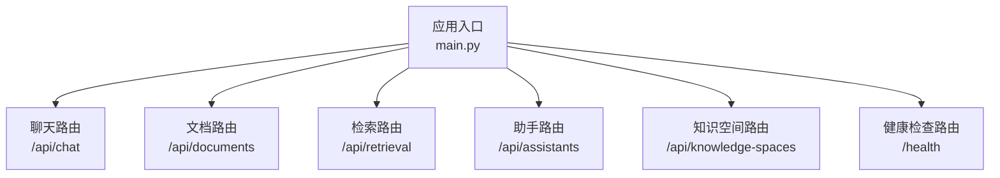
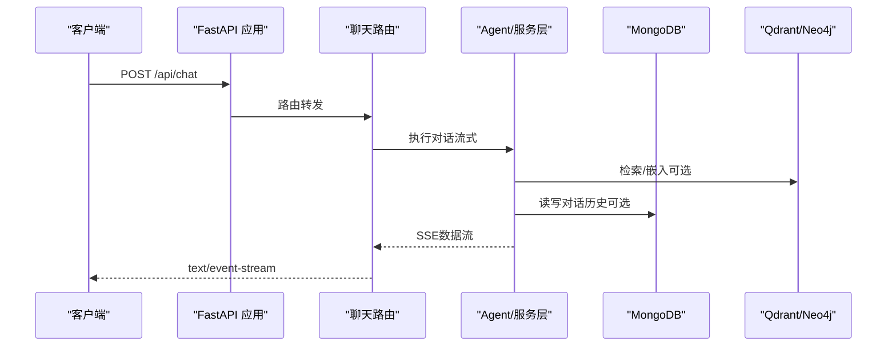
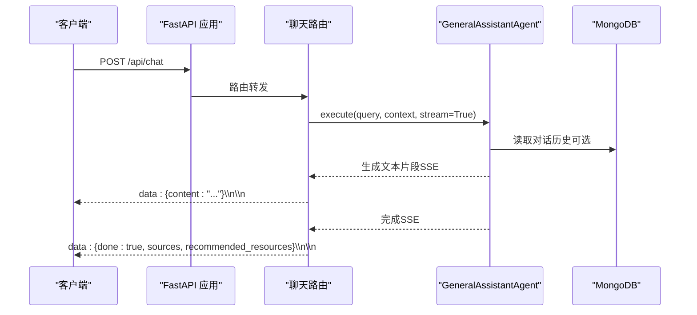
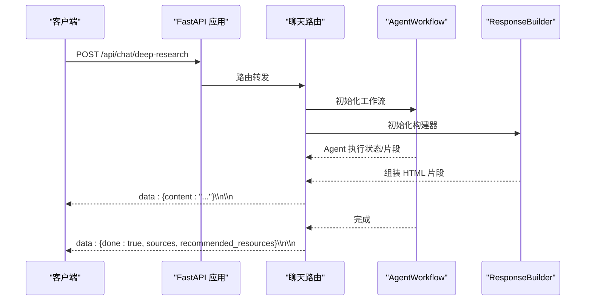
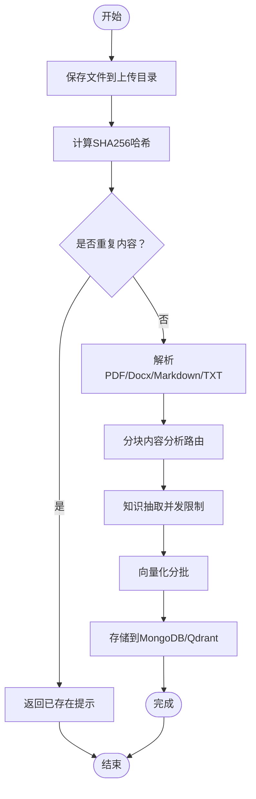

# API参考

<cite>
**本文引用的文件**
- [main.py](file://main.py)
- [chat.py](file://routers/chat.py)
- [documents.py](file://routers/documents.py)
- [retrieval.py](file://routers/retrieval.py)
- [knowledge_spaces.py](file://routers/knowledge_spaces.py)
- [assistants.py](file://routers/assistants.py)
- [health.py](file://routers/health.py)
- [README.md](file://README.md)
- [requirements.txt](file://requirements.txt)
- [qdrant_client.py](file://database/qdrant_client.py)
- [StreamingText.tsx](file://web/components/message/StreamingText.tsx)
- [page.tsx](file://web/app/chat/page.tsx)
</cite>

## 目录
1. [简介](#简介)
2. [项目结构](#项目结构)
3. [核心组件](#核心组件)
4. [架构总览](#架构总览)
5. [详细组件分析](#详细组件分析)
6. [依赖分析](#依赖分析)
7. [性能考量](#性能考量)
8. [故障排查指南](#故障排查指南)
9. [结论](#结论)
10. [附录](#附录)

## 简介
本文件为 advanced-rag 的完整 API 参考文档，覆盖所有 RESTful 接口的 HTTP 方法、URL 模式、请求参数、响应格式、认证机制、错误码与异常处理、流式响应（SSE）实现与客户端处理方法，并包含深度研究模式、文档上传、知识检索等特色 API 的详细说明。同时提供 API 版本管理、速率限制与安全考虑、客户端 SDK 使用示例与最佳实践，以及性能特征、并发处理与扩展性建议。

## 项目结构
后端基于 FastAPI，路由按功能模块划分：
- 聊天与对话：/api/chat
- 文档管理与入库：/api/documents
- 检索服务：/api/retrieval
- 助手信息：/api/assistants
- 知识空间：/api/knowledge-spaces
- 健康检查：/health（无前缀）

图表来源
- [main.py:90-97](file://main.py#L90-L97)

章节来源
- [main.py:55-98](file://main.py#L55-L98)
- [README.md:189-199](file://README.md#L189-L199)

## 核心组件
- FastAPI 应用与中间件：CORS 允许跨域；请求日志中间件；静态文件挂载（头像、缩略图、封面）。
- 路由注册：按模块注册，统一前缀。
- 全局异常处理：捕获未处理异常并返回统一 JSON。
- 健康检查：/health、/health/liveness、/health/readiness、/health/metrics。
- 版本号：应用与健康检查均返回版本号 v0.8.5。

章节来源
- [main.py:55-126](file://main.py#L55-L126)
- [health.py:23-134](file://routers/health.py#L23-L134)

## 架构总览
系统采用“纯匿名访问”的设计，API 无需认证即可使用。核心链路包括：
- 聊天：常规对话（SSE 流式）与深度研究模式（SSE 流式）。
- 文档：上传、解析、分块、知识抽取、向量化、入库（MongoDB/Qdrant）。
- 检索：RAG 检索，支持多知识空间与对话专用向量空间。
- 助手与知识空间：只读接口，便于前端选择与展示。

图表来源
- [chat.py:615-750](file://routers/chat.py#L615-L750)

## 详细组件分析

### 聊天与对话（/api/chat）
- 基础路径：/api/chat
- 认证：匿名访问
- 主要接口
  - GET /models：列出可用模型（调用 Ollama 服务）
  - POST /：常规对话（SSE 流式）
  - POST /deep-research：深度研究模式（SSE 流式）
  - GET /conversations：获取对话列表
  - GET /conversations/{conversation_id}：获取对话详情
  - POST /conversations：创建对话
  - PUT /conversations/{conversation_id}：更新对话
  - DELETE /conversations/{conversation_id}：删除对话
  - POST /conversations/{conversation_id}/messages：添加消息（匿名）
  - PUT /conversations/{conversation_id}/messages/{message_id}：编辑用户消息（匿名）
  - POST /conversations/{conversation_id}/messages/{message_id}/regenerate：重新生成回答（匿名）

请求与响应要点
- SSE 流式响应：text/event-stream，支持客户端断开检测，自动停止生成。
- 深度研究模式：返回 HTML 结果，支持多 Agent 协作。
- 对话历史：可选携带最近 N 轮消息作为上下文。
- 生成配置：可指定 LLM 与嵌入模型，或在深度研究中指定子 Agent 配置。

章节来源
- [chat.py:84-95](file://routers/chat.py#L84-L95)
- [chat.py:615-750](file://routers/chat.py#L615-L750)
- [chat.py:151-193](file://routers/chat.py#L151-L193)
- [chat.py:195-243](file://routers/chat.py#L195-L243)
- [chat.py:97-149](file://routers/chat.py#L97-L149)
- [chat.py:350-406](file://routers/chat.py#L350-L406)
- [chat.py:408-450](file://routers/chat.py#L408-L450)
- [chat.py:245-348](file://routers/chat.py#L245-L348)
- [chat.py:452-532](file://routers/chat.py#L452-L532)
- [chat.py:534-613](file://routers/chat.py#L534-L613)

#### 常规对话（SSE）序列图

图表来源
- [chat.py:615-750](file://routers/chat.py#L615-L750)

#### 深度研究模式（SSE）序列图

图表来源
- [chat.py:753-813](file://routers/chat.py#L753-L813)

### 文档管理与入库（/api/documents）
- 基础路径：/api/documents
- 认证：匿名访问
- 主要接口
  - POST /upload：上传文档并异步处理（解析、分块、知识抽取、向量化、入库）
  - GET /：获取文档列表
  - GET /{id}：获取文档详情
  - PUT /{id}：更新文档标题
  - DELETE /{id}：删除文档
  - POST /{id}/retry：重试处理失败的文档
  - GET /{id}/preview：预览文档（二进制）

处理流程与特性
- 支持 PDF、Word、Markdown、TXT；.doc 自动转换为 .docx。
- 带进度上报：解析、分块、知识抽取、向量化、存储各阶段进度。
- 超时保护：解析/分块分别设置超时阈值，避免长时间占用。
- 去重：基于文件哈希检测重复内容。
- 并发与限流：向量化分批处理（批大小 50），知识抽取并发限制（Semaphore 3），分批推进。
- 存储：MongoDB 存储块与元数据，Qdrant 存储向量（若可用）。

章节来源
- [documents.py:723-813](file://routers/documents.py#L723-L813)
- [documents.py:1-132](file://routers/documents.py#L1-L132)
- [documents.py:274-721](file://routers/documents.py#L274-L721)

#### 文档上传与入库流程图

图表来源
- [documents.py:274-721](file://routers/documents.py#L274-L721)

### 检索服务（/api/retrieval）
- 基础路径：/api/retrieval
- 认证：匿名访问
- 主要接口
  - POST /analyze：查询分析，判断是否需要检索
  - POST /：RAG 检索，返回上下文与来源

检索特性
- 支持指定 assistant_id、knowledge_space_ids、document_id、conversation_id。
- 可结合对话专用向量空间与助手知识库。
- 返回 sources 与 recommended_resources。

章节来源
- [retrieval.py:44-79](file://routers/retrieval.py#L44-L79)
- [retrieval.py:82-134](file://routers/retrieval.py#L82-L134)

### 助手信息（/api/assistants）
- 基础路径：/api/assistants
- 认证：匿名访问
- 主要接口
  - GET /：获取助手列表（只读）
  - GET /{assistant_id}：获取助手详情（只读）

章节来源
- [assistants.py:40-79](file://routers/assistants.py#L40-L79)
- [assistants.py:82-119](file://routers/assistants.py#L82-L119)

### 知识空间（/api/knowledge-spaces）
- 基础路径：/api/knowledge-spaces
- 认证：匿名访问
- 主要接口
  - GET /：获取知识空间列表
  - POST /：创建知识空间

章节来源
- [knowledge_spaces.py:50-78](file://routers/knowledge_spaces.py#L50-L78)
- [knowledge_spaces.py:81-132](file://routers/knowledge_spaces.py#L81-L132)

### 健康检查（/health）
- 基础路径：/health
- 认证：匿名访问
- 主要接口
  - GET /health：综合健康检查（MongoDB、Qdrant、系统资源）
  - GET /health/liveness：存活探针
  - GET /health/readiness：就绪探针
  - GET /health/metrics：性能指标

章节来源
- [health.py:23-134](file://routers/health.py#L23-L134)

## 依赖分析
- FastAPI 与 Uvicorn：应用框架与 ASGI 服务器。
- 数据库：MongoDB（motor/pymongo）、Qdrant（qdrant-client）、Neo4j（neo4j）。
- 文档解析：PyPDF2、PyMuPDF、python-docx、unstructured、chardet。
- 文本处理：jieba、langchain、sentence-transformers。
- 其他：httpx、requests、python-dotenv、pydantic。

章节来源
- [requirements.txt:4-38](file://requirements.txt#L4-L38)

## 性能考量
- 并发与连接
  - Uvicorn worker 数量可配置（生产环境默认 24），支持通过环境变量覆盖。
  - 限制并发连接数（每个 worker 2000）。
  - keep-alive 超时增加至 15 分钟，适配大文件上传。
- 流式响应
  - SSE 使用 text/event-stream，客户端断开检测，避免资源泄露。
  - 深度研究模式返回 HTML，适合前端渲染。
- 存储与检索
  - Qdrant 优先使用 gRPC（端口 6334），提升性能与连接复用。
  - 向量化分批（50），知识抽取并发限制（3），降低 Ollama 压力。
- 资源监控
  - 健康检查包含 CPU、内存使用率；性能指标端点提供请求统计与系统指标。

章节来源
- [main.py:128-157](file://main.py#L128-L157)
- [qdrant_client.py:66-92](file://database/qdrant_client.py#L66-L92)
- [documents.py:466-491](file://routers/documents.py#L466-L491)
- [documents.py:408-447](file://routers/documents.py#L408-L447)
- [health.py:67-81](file://routers/health.py#L67-L81)

## 故障排查指南
- 常见错误码
  - 400：请求参数非法（如文件类型不支持、文件过大、文件名为空）。
  - 404：资源不存在（对话、消息、助手、知识空间）。
  - 500：服务器内部错误（解析超时、数据库连接失败、Qdrant 不可用等）。
- 错误处理策略
  - 路由层抛出 HTTPException，统一由全局异常处理器返回 JSON。
  - 健康检查端点返回服务状态与错误摘要，便于运维定位。
- 客户端断开与流式异常
  - 服务端定期检测客户端断开，出现 BrokenPipe、ConnectionReset 等异常时优雅停止。
- Qdrant 连接
  - 本地 HTTP 连接会忽略 API key 以避免警告；生产环境建议 HTTPS 或移除 API key。

章节来源
- [chat.py:711-734](file://routers/chat.py#L711-L734)
- [health.py:32-66](file://routers/health.py#L32-L66)
- [qdrant_client.py:42-60](file://database/qdrant_client.py#L42-L60)

## 结论
advanced-rag 提供了完整的“纯匿名访问”RAG 能力：聊天（含深度研究）、文档入库、RAG 检索、知识空间与助手信息。API 设计清晰、流式响应体验良好，具备完善的健康检查与性能监控。生产部署建议关注并发配置、Qdrant 连接与超时策略，以获得稳定高效的性能表现。

## 附录

### API 列表与示例（按模块）

- 聊天与对话（/api/chat）
  - GET /models
    - 请求：无
    - 响应：包含可用模型数组
    - 示例：curl -X GET http://localhost:8000/api/chat/models
  - POST /
    - 请求体：包含 query、assistant_id、knowledge_space_ids、conversation_id、enable_rag、mode、generation_config
    - 响应：SSE 流，包含 content、done、sources、recommended_resources
    - 示例：curl -N -X POST http://localhost:8000/api/chat -H "Content-Type: application/json" -d '{"query":"...","enable_rag":true}'
  - POST /deep-research
    - 请求体：包含 query、assistant_id、conversation_id、enabled_agents、generation_config
    - 响应：SSE 流，HTML 内容
    - 示例：curl -N -X POST http://localhost:8000/api/chat/deep-research -H "Content-Type: application/json" -d '{"query":"..."}'
  - GET /conversations
    - 查询参数：skip、limit
    - 响应：包含 conversations 数组与总数
    - 示例：curl "http://localhost:8000/api/chat/conversations?skip=0&limit=100"
  - GET /conversations/{conversation_id}
    - 响应：包含对话详情与消息列表
    - 示例：curl http://localhost:8000/api/chat/conversations/{conversation_id}
  - POST /conversations
    - 请求体：title、user_id、assistant_id
    - 响应：新建对话信息
    - 示例：curl -X POST http://localhost:8000/api/chat/conversations -H "Content-Type: application/json" -d '{"title":"新对话"}'
  - PUT /conversations/{conversation_id}
    - 请求体：title
    - 响应：更新后的对话信息
    - 示例：curl -X PUT http://localhost:8000/api/chat/conversations/{conversation_id} -H "Content-Type: application/json" -d '{"title":"更新标题"}'
  - DELETE /conversations/{conversation_id}
    - 响应：删除成功信息
    - 示例：curl -X DELETE http://localhost:8000/api/chat/conversations/{conversation_id}
  - POST /conversations/{conversation_id}/messages
    - 请求体：role、content、sources、recommended_resources
    - 响应：添加成功信息
    - 示例：curl -X POST http://localhost:8000/api/chat/conversations/{conversation_id}/messages -H "Content-Type: application/json" -d '{"role":"user","content":"..."}'
  - PUT /conversations/{conversation_id}/messages/{message_id}
    - 请求体：content
    - 响应：更新成功信息
    - 示例：curl -X PUT http://localhost:8000/api/chat/conversations/{conversation_id}/messages/{message_id} -H "Content-Type: application/json" -d '{"content":"更新内容"}'
  - POST /conversations/{conversation_id}/messages/{message_id}/regenerate
    - 响应：删除后续消息并可重新生成
    - 示例：curl -X POST http://localhost:8000/api/chat/conversations/{conversation_id}/messages/{message_id}/regenerate

- 文档管理（/api/documents）
  - POST /upload
    - 表单：file（必填）、assistant_id（可选）、knowledge_space_id（可选）
    - 响应：上传任务信息
    - 示例：curl -F "file=@/path/to/doc.pdf" -F "assistant_id=..." http://localhost:8000/api/documents/upload
  - GET /
    - 响应：文档列表
    - 示例：curl http://localhost:8000/api/documents
  - GET /{id}
    - 响应：文档详情
    - 示例：curl http://localhost:8000/api/documents/{id}
  - PUT /{id}
    - 请求体：title
    - 响应：更新成功
    - 示例：curl -X PUT http://localhost:8000/api/documents/{id} -H "Content-Type: application/json" -d '{"title":"新标题"}'
  - DELETE /{id}
    - 响应：删除成功
    - 示例：curl -X DELETE http://localhost:8000/api/documents/{id}
  - POST /{id}/retry
    - 响应：重试成功
    - 示例：curl -X POST http://localhost:8000/api/documents/{id}/retry
  - GET /{id}/preview
    - 响应：二进制预览文件
    - 示例：curl http://localhost:8000/api/documents/{id}/preview -o preview.pdf

- 检索服务（/api/retrieval）
  - POST /analyze
    - 请求体：query
    - 响应：need_retrieval、reason、confidence
    - 示例：curl -X POST http://localhost:8000/api/retrieval/analyze -H "Content-Type: application/json" -d '{"query":"..."}'
  - POST /
    - 请求体：query、document_id、top_k、assistant_id、knowledge_space_ids、conversation_id
    - 响应：context、sources、retrieval_count、recommended_resources
    - 示例：curl -X POST http://localhost:8000/api/retrieval -H "Content-Type: application/json" -d '{"query":"..."}'

- 助手（/api/assistants）
  - GET /
    - 查询参数：skip、limit
    - 响应：助手列表
    - 示例：curl "http://localhost:8000/api/assistants?skip=0&limit=100"
  - GET /{assistant_id}
    - 响应：助手详情
    - 示例：curl http://localhost:8000/api/assistants/{assistant_id}

- 知识空间（/api/knowledge-spaces）
  - GET /
    - 查询参数：skip、limit
    - 响应：知识空间列表
    - 示例：curl "http://localhost:8000/api/knowledge-spaces?skip=0&limit=100"
  - POST /
    - 请求体：name、description
    - 响应：新建知识空间
    - 示例：curl -X POST http://localhost:8000/api/knowledge-spaces -H "Content-Type: application/json" -d '{"name":"空间A","description":"..."}'

- 健康检查（/health）
  - GET /health
    - 响应：状态、版本、服务状态、系统资源
    - 示例：curl http://localhost:8000/health
  - GET /health/liveness
    - 响应：存活状态
    - 示例：curl http://localhost:8000/health/liveness
  - GET /health/readiness
    - 响应：就绪状态
    - 示例：curl http://localhost:8000/health/readiness
  - GET /health/metrics
    - 响应：请求统计与系统指标
    - 示例：curl http://localhost:8000/health/metrics

### 认证机制
- 本项目采用“匿名访问”，无需认证即可使用核心 API。
- 健康检查与根路径亦为匿名访问。

章节来源
- [README.md:9](file://README.md#L9)
- [README.md:189-199](file://README.md#L189-L199)

### 错误码与异常处理
- 400：请求参数非法（文件类型、大小、缺失字段等）
- 404：资源不存在（对话、消息、助手、知识空间）
- 500：服务器内部错误（解析超时、数据库/向量库异常）
- 全局异常处理：统一返回 JSON，包含 detail 字段

章节来源
- [main.py:109-126](file://main.py#L109-L126)
- [documents.py:777-790](file://routers/documents.py#L777-L790)
- [chat.py:209-213](file://routers/chat.py#L209-L213)

### 流式响应（SSE）实现与客户端处理
- 服务端实现
  - 使用 StreamingResponse，媒体类型为 text/event-stream。
  - 定期检测客户端断开（is_disconnected），异常捕获（BrokenPipe、ConnectionReset 等）。
  - 按类型发送 content、done、error。
- 客户端处理
  - 使用 EventSource 或 fetch + ReadableStream 解析 data: 行。
  - 解析 JSON，区分 content/done/error，更新 UI。
  - 示例：前端组件 StreamingText.tsx 与页面逻辑 page.tsx 展示了流式文本渲染与滚动处理。

章节来源
- [chat.py:735-750](file://routers/chat.py#L735-L750)
- [chat.py:711-734](file://routers/chat.py#L711-L734)
- [StreamingText.tsx:16-79](file://web/components/message/StreamingText.tsx#L16-L79)
- [page.tsx:5739-5754](file://web/app/chat/page.tsx#L5739-L5754)

### API 版本管理、速率限制与安全
- 版本管理
  - 应用与健康检查返回版本号 v0.8.5。
- 速率限制
  - 未内置全局速率限制中间件；可通过网关或反向代理实现。
- 安全
  - CORS 允许所有来源（开发环境）；生产环境建议收紧。
  - Qdrant 本地 HTTP 连接忽略 API key 以避免警告；生产环境建议 HTTPS 或移除 API key。
  - Uvicorn 生产环境使用多 worker，开发环境单 worker，reload 关闭。

章节来源
- [main.py:55-70](file://main.py#L55-L70)
- [main.py:128-157](file://main.py#L128-L157)
- [qdrant_client.py:42-60](file://database/qdrant_client.py#L42-L60)

### 客户端 SDK 使用示例与最佳实践
- 前端 SDK
  - 前端 Next.js 项目中通过 apiClient 调用后端 API，示例包括对话创建、列表获取、文档管理等。
  - 流式响应处理：EventSource 或 fetch + ReadableStream，解析 data 行，区分 content/done/error。
- 最佳实践
  - 使用 AbortController 取消长时间请求。
  - SSE 断线重连与错误提示。
  - 文档上传前校验文件大小与类型，避免超时。
  - 检索前先调用 /api/retrieval/analyze 判断是否需要检索。

章节来源
- [page.tsx:193-200](file://web/app/chat/page.tsx#L193-L200)
- [StreamingText.tsx:16-79](file://web/components/message/StreamingText.tsx#L16-L79)