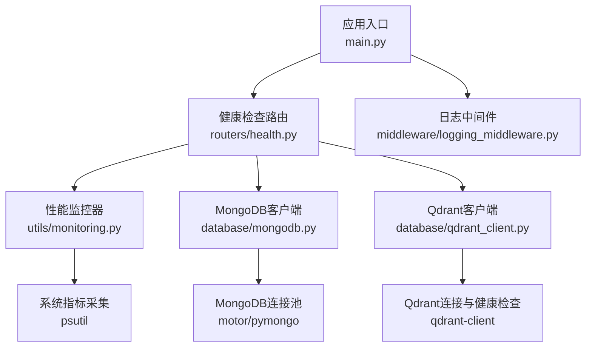
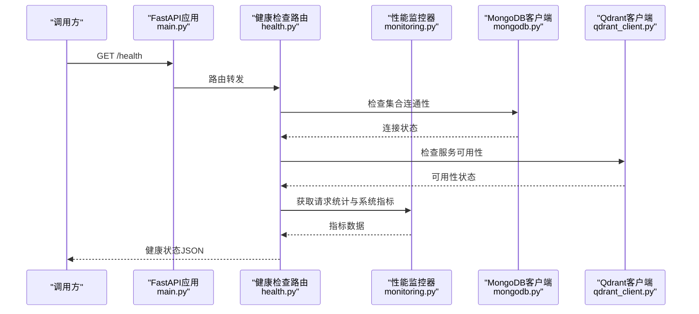
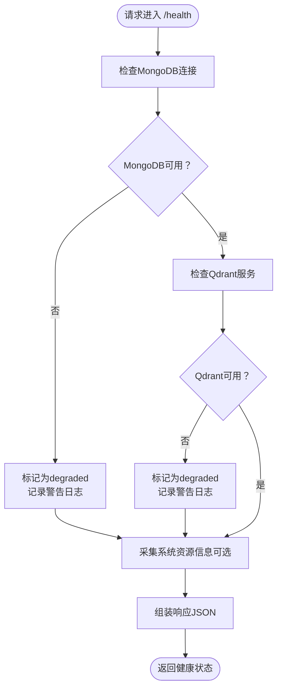
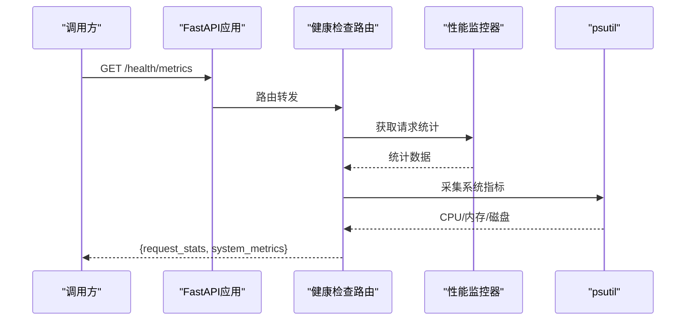
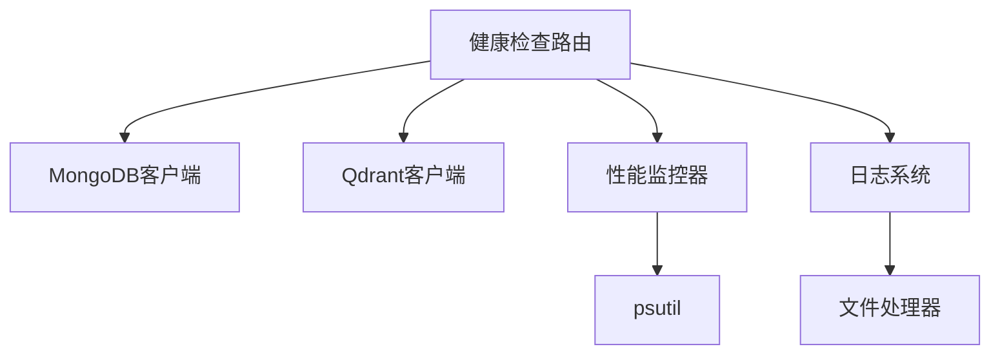

# 健康检查API

<cite>
**本文引用的文件**
- [main.py](file://main.py)
- [health.py](file://routers/health.py)
- [monitoring.py](file://utils/monitoring.py)
- [logger.py](file://utils/logger.py)
- [mongodb.py](file://database/mongodb.py)
- [qdrant_client.py](file://database/qdrant_client.py)
- [.env.example](file://.env.example)
- [README.md](file://README.md)
</cite>

## 目录
1. [简介](#简介)
2. [项目结构](#项目结构)
3. [核心组件](#核心组件)
4. [架构总览](#架构总览)
5. [详细组件分析](#详细组件分析)
6. [依赖分析](#依赖分析)
7. [性能考虑](#性能考虑)
8. [故障排除指南](#故障排除指南)
9. [结论](#结论)
10. [附录](#附录)

## 简介
本文件面向系统运维与开发人员，提供 Advanced RAG 系统健康检查API的权威文档。内容涵盖：
- 健康状态检查接口（/health）、存活探针（/health/liveness）、就绪探针（/health/readiness）
- 性能监控接口（/health/metrics），包括系统资源使用率、API响应时间、并发连接数等指标
- 日志状态接口（/logs），包括日志级别设置、错误追踪和调试信息获取
- 系统配置接口（/config），包括运行时配置查询和动态配置更新
- 告警机制、故障诊断与系统维护接口
- 监控数据的采集、存储与可视化方法
- 健康检查最佳实践与故障排除指南

## 项目结构
健康检查相关能力主要由以下模块协同实现：
- 应用入口与路由注册：main.py
- 健康检查路由：routers/health.py
- 性能监控工具：utils/monitoring.py
- 日志系统：utils/logger.py
- 数据库连接与健康检查：database/mongodb.py、database/qdrant_client.py
- 环境配置模板：.env.example
- 项目说明与API清单：README.md

图表来源
- [main.py:55-98](file://main.py#L55-L98)
- [health.py:23-135](file://routers/health.py#L23-L135)
- [monitoring.py:13-185](file://utils/monitoring.py#L13-L185)
- [mongodb.py:92-199](file://database/mongodb.py#L92-L199)
- [qdrant_client.py:18-139](file://database/qdrant_client.py#L18-L139)

章节来源
- [main.py:55-98](file://main.py#L55-L98)
- [README.md:189-199](file://README.md#L189-L199)

## 核心组件
- 健康检查路由（/health、/health/liveness、/health/readiness）
- 性能监控器（统计API响应时间、错误率、系统资源）
- 日志系统（异步写入、级别控制、文件轮转）
- 数据库健康检查（MongoDB、Qdrant）
- 环境配置（.env）

章节来源
- [health.py:23-135](file://routers/health.py#L23-L135)
- [monitoring.py:13-185](file://utils/monitoring.py#L13-L185)
- [logger.py:15-88](file://utils/logger.py#L15-L88)
- [mongodb.py:92-199](file://database/mongodb.py#L92-L199)
- [qdrant_client.py:18-139](file://database/qdrant_client.py#L18-L139)
- [.env.example:1-51](file://.env.example#L1-L51)

## 架构总览
健康检查API通过FastAPI路由聚合数据库与系统资源信息，并结合性能监控器与日志系统，形成完整的可观测性闭环。

图表来源
- [main.py:90-98](file://main.py#L90-L98)
- [health.py:23-87](file://routers/health.py#L23-L87)
- [monitoring.py:49-111](file://utils/monitoring.py#L49-L111)
- [mongodb.py:99-199](file://database/mongodb.py#L99-L199)
- [qdrant_client.py:124-139](file://database/qdrant_client.py#L124-L139)

## 详细组件分析

### 健康状态检查接口 /health
- 功能概述
  - 检查MongoDB与Qdrant的连接状态
  - 可选返回系统资源信息（CPU、内存、磁盘）
  - 返回整体健康状态（healthy/degraded）
- 响应模型
  - status: 整体状态（healthy/degraded）
  - version: 服务版本
  - services: 各依赖服务状态
  - system: 可选系统资源信息
- 错误处理
  - 任一依赖检查失败均标记为degraded
  - 记录警告日志，便于故障定位

图表来源
- [health.py:23-87](file://routers/health.py#L23-L87)
- [mongodb.py:99-199](file://database/mongodb.py#L99-L199)
- [qdrant_client.py:124-139](file://database/qdrant_client.py#L124-L139)

章节来源
- [health.py:23-87](file://routers/health.py#L23-L87)

### 存活探针 /health/liveness
- 功能概述
  - 简单存活检查，不涉及依赖服务
  - 适合容器编排的livenessProbe
- 响应
  - {"status": "alive"}

章节来源
- [health.py:90-96](file://routers/health.py#L90-L96)

### 就绪探针 /health/readiness
- 功能概述
  - 检查关键服务（如MongoDB）是否就绪
  - 适合容器编排的readinessProbe
- 响应
  - 就绪：{"status": "ready"}
  - 未就绪：{"status": "not_ready", "error": "..."}（截断错误信息）

章节来源
- [health.py:99-114](file://routers/health.py#L99-L114)

### 性能监控接口 /health/metrics
- 功能概述
  - 返回请求统计与系统资源指标
  - 请求统计：各端点的计数、错误数、平均/最小/最大响应时间及百分位数
  - 系统指标：CPU、内存、磁盘使用率与进程级指标
- 数据来源
  - 性能监控器（utils/monitoring.py）
  - psutil系统指标采集
- 响应
  - request_stats: 请求统计
  - system_metrics: 系统指标

图表来源
- [health.py:117-134](file://routers/health.py#L117-L134)
- [monitoring.py:49-111](file://utils/monitoring.py#L49-L111)

章节来源
- [health.py:117-134](file://routers/health.py#L117-L134)
- [monitoring.py:13-185](file://utils/monitoring.py#L13-L185)

### 日志状态接口 /logs
- 当前实现
  - 代码库未提供专门的 /logs 接口
  - 日志系统通过异步处理器与文件轮转实现
- 可用能力
  - 通过环境变量 LOG_LEVEL 控制日志级别
  - 日志文件位于 logs/ 目录，支持轮转
  - 生产环境可降低文件日志级别，减少IO开销
- 建议扩展
  - 提供 /logs 接口以支持：
    - 查询当前日志级别
    - 动态调整日志级别
    - 下载最近日志文件
    - 实时流式输出日志（谨慎使用）

章节来源
- [logger.py:15-88](file://utils/logger.py#L15-L88)
- [.env.example:48-51](file://.env.example#L48-L51)

### 系统配置接口 /config
- 当前实现
  - 代码库未提供专门的 /config 接口
  - 配置通过 .env 文件与环境变量加载
- 可用能力
  - 通过 .env.example 查看可配置项
  - 支持环境切换（development/production）
  - 连接池与超时参数可调
- 建议扩展
  - 提供 /config 接口以支持：
    - 查询当前运行配置
    - 动态更新部分配置（如日志级别、超时参数）
    - 导出配置快照

章节来源
- [.env.example:1-51](file://.env.example#L1-L51)
- [README.md:125-166](file://README.md#L125-L166)

### 告警机制、故障诊断与系统维护
- 告警机制
  - 健康检查返回 degraded 时触发告警
  - 慢请求（>1秒）在日志中间件中记录警告
  - 全局异常处理器记录5xx错误
- 故障诊断
  - 使用 /health 查看依赖状态
  - 使用 /health/metrics 分析响应时间与错误率
  - 检查日志文件与级别
- 系统维护
  - 通过环境变量调整连接池与超时
  - 生产环境启用多worker与连接限制

章节来源
- [health.py:23-87](file://routers/health.py#L23-L87)
- [monitoring.py:163-185](file://utils/monitoring.py#L163-L185)
- [main.py:109-126](file://main.py#L109-L126)

## 依赖分析
- 组件耦合
  - 健康检查路由依赖数据库客户端与性能监控器
  - 性能监控器依赖psutil与异步锁
  - 日志系统依赖异步队列与文件处理器
- 外部依赖
  - MongoDB：motor/pymongo
  - Qdrant：qdrant-client
  - psutil：系统指标采集

图表来源
- [health.py:23-135](file://routers/health.py#L23-L135)
- [monitoring.py:13-185](file://utils/monitoring.py#L13-L185)
- [logger.py:15-88](file://utils/logger.py#L15-L88)
- [mongodb.py:92-199](file://database/mongodb.py#L92-L199)
- [qdrant_client.py:18-139](file://database/qdrant_client.py#L18-L139)

## 性能考虑
- 监控窗口与内存占用
  - 性能监控器仅保留最近1000次请求的时间记录，避免内存膨胀
- 系统指标采样
  - psutil采样间隔短，避免阻塞
- 并发与连接
  - 生产环境使用多worker与连接限制
  - MongoDB连接池参数可调，平衡吞吐与资源

章节来源
- [monitoring.py:42-48](file://utils/monitoring.py#L42-L48)
- [monitoring.py:80-111](file://utils/monitoring.py#L80-L111)
- [main.py:140-157](file://main.py#L140-L157)
- [mongodb.py:122-136](file://database/mongodb.py#L122-L136)

## 故障排除指南
- MongoDB连接失败
  - 检查 MONGODB_URI/MONGODB_HOST/PORT/USERNAME/PASSWORD/DB_NAME
  - 确认网络可达与认证配置
  - 查看启动日志中的提示信息
- Qdrant连接失败
  - 检查 QDRANT_URL/API_KEY
  - 建议使用gRPC端口（6334）以避免HTTP相关问题
- 健康检查返回degraded
  - 查看MongoDB与Qdrant的错误信息
  - 检查系统资源是否紧张
- 慢请求与高错误率
  - 通过 /health/metrics 分析端点性能
  - 检查日志中间件记录的慢请求
- 日志级别过高/过低
  - 通过 LOG_LEVEL 调整
  - 生产环境可降低文件日志级别

章节来源
- [mongodb.py:168-184](file://database/mongodb.py#L168-L184)
- [qdrant_client.py:78-123](file://database/qdrant_client.py#L78-L123)
- [health.py:40-65](file://routers/health.py#L40-L65)
- [monitoring.py:178-183](file://utils/monitoring.py#L178-L183)
- [logger.py:77-81](file://utils/logger.py#L77-L81)

## 结论
本健康检查API通过统一的路由聚合数据库与系统资源状态，结合性能监控与日志系统，为运维与开发提供了完整的可观测性基础。建议在现有基础上扩展 /logs 与 /config 接口，以满足更灵活的运维需求，并持续完善告警与自动化维护流程。

## 附录

### API清单与说明
- GET /health
  - 功能：综合健康检查
  - 响应：包含整体状态、版本、服务状态与可选系统信息
- GET /health/liveness
  - 功能：存活探针
  - 响应：{"status": "alive"}
- GET /health/readiness
  - 功能：就绪探针
  - 响应：{"status": "ready"} 或 {"status": "not_ready", "error": "..."}
- GET /health/metrics
  - 功能：性能指标
  - 响应：请求统计与系统指标

章节来源
- [README.md:189-199](file://README.md#L189-L199)
- [health.py:23-134](file://routers/health.py#L23-L134)

### 监控数据采集、存储与可视化
- 采集
  - 性能监控器记录每次请求的耗时与状态码
  - 系统指标通过psutil定时采集
- 存储
  - 内存中缓存统计信息，支持导出
  - 日志文件轮转保存历史
- 可视化
  - 建议集成Prometheus/Grafana或自建仪表板
  - 指标包括：请求QPS、错误率、P50/P95/P99响应时间、CPU/内存/磁盘使用率

章节来源
- [monitoring.py:13-185](file://utils/monitoring.py#L13-L185)
- [logger.py:15-88](file://utils/logger.py#L15-L88)