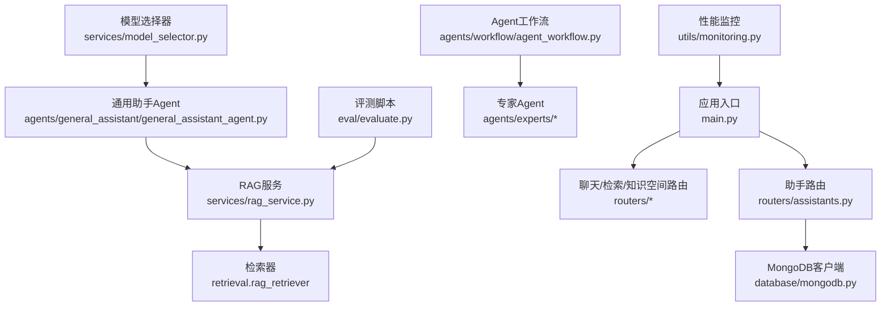
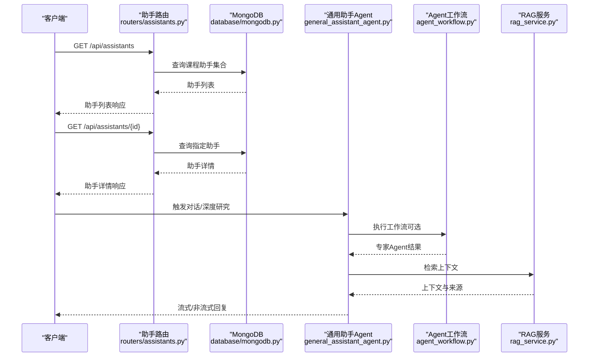
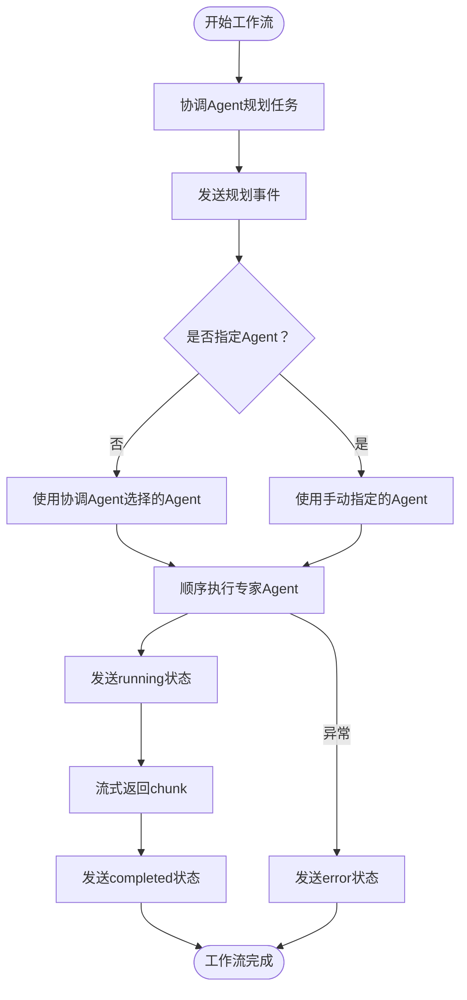
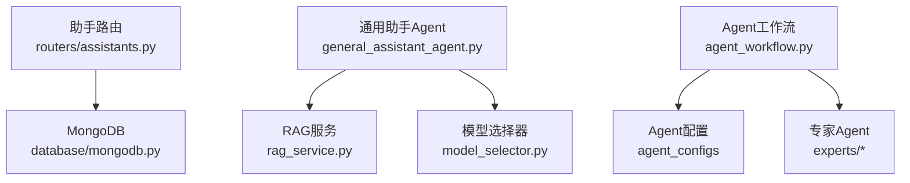

# 助手API

<cite>
**本文引用的文件**
- [main.py](file://main.py)
- [routers/assistants.py](file://routers/assistants.py)
- [web/types/assistant.ts](file://web/types/assistant.ts)
- [models/agent_config.py](file://models/agent_config.py)
- [agents/base/base_agent.py](file://agents/base/base_agent.py)
- [agents/workflow/agent_workflow.py](file://agents/workflow/agent_workflow.py)
- [agents/experts/concept_explanation_agent.py](file://agents/experts/concept_explanation_agent.py)
- [agents/general_assistant/general_assistant_agent.py](file://agents/general_assistant/general_assistant_agent.py)
- [services/rag_service.py](file://services/rag_service.py)
- [services/model_selector.py](file://services/model_selector.py)
- [database/mongodb.py](file://database/mongodb.py)
- [utils/monitoring.py](file://utils/monitoring.py)
- [eval/evaluate.py](file://eval/evaluate.py)
- [README.md](file://README.md)
</cite>

## 目录
1. [简介](#简介)
2. [项目结构](#项目结构)
3. [核心组件](#核心组件)
4. [架构总览](#架构总览)
5. [详细组件分析](#详细组件分析)
6. [依赖分析](#依赖分析)
7. [性能考量](#性能考量)
8. [故障排查指南](#故障排查指南)
9. [结论](#结论)
10. [附录](#附录)

## 简介
本文件为“助手API”的详细技术文档，聚焦于AI助手管理与协作能力，覆盖以下方面：
- 助手配置接口：获取助手列表、获取助手详情、创建助手、更新助手、删除助手
- 助手模板与默认助手：模板接口与默认助手设置
- 助手能力配置：专家代理配置、模型选择、参数设置
- 助手状态管理：在线状态、负载均衡、故障转移
- 性能监控、使用统计与质量评估接口
- 助手定制化配置与扩展开发指南
- 助手间协作机制与工作流编排

本系统基于FastAPI提供REST API，前端使用Next.js，后端采用MongoDB存储助手与配置，结合多Agent协作与RAG检索实现高质量问答与深度研究。

## 项目结构
后端通过路由模块注册API，助手相关接口位于“/api/assistants”前缀下，其余核心模块包括：
- 路由层：routers/assistants.py
- 业务服务：services/rag_service.py、services/model_selector.py
- Agent框架：agents/base/base_agent.py、agents/workflow/agent_workflow.py、agents/experts/concept_explanation_agent.py、agents/general_assistant/general_assistant_agent.py
- 数据库：database/mongodb.py
- 监控与评估：utils/monitoring.py、eval/evaluate.py
- 前端类型定义：web/types/assistant.ts

图表来源
- [main.py:90-98](file://main.py#L90-L98)
- [routers/assistants.py:14-120](file://routers/assistants.py#L14-L120)
- [database/mongodb.py:92-199](file://database/mongodb.py#L92-L199)
- [agents/general_assistant/general_assistant_agent.py:9-167](file://agents/general_assistant/general_assistant_agent.py#L9-L167)
- [services/rag_service.py:7-248](file://services/rag_service.py#L7-L248)
- [agents/workflow/agent_workflow.py:47-388](file://agents/workflow/agent_workflow.py#L47-L388)
- [services/model_selector.py:10-206](file://services/model_selector.py#L10-L206)
- [utils/monitoring.py:13-185](file://utils/monitoring.py#L13-L185)
- [eval/evaluate.py:19-127](file://eval/evaluate.py#L19-L127)

章节来源
- [README.md:55-70](file://README.md#L55-L70)
- [main.py:90-98](file://main.py#L90-L98)

## 核心组件
- 助手路由与模型
  - 助手列表与详情接口：routers/assistants.py
  - 助手数据模型：web/types/assistant.ts
  - 助手配置模型：models/agent_config.py
- Agent框架与工作流
  - 基类Agent：agents/base/base_agent.py
  - 工作流编排：agents/workflow/agent_workflow.py
  - 通用助手Agent：agents/general_assistant/general_assistant_agent.py
  - 专家Agent示例：agents/experts/concept_explanation_agent.py
- 服务与基础设施
  - RAG服务：services/rag_service.py
  - 模型选择器：services/model_selector.py
  - MongoDB客户端：database/mongodb.py
  - 性能监控：utils/monitoring.py
  - 评测脚本：eval/evaluate.py

章节来源
- [routers/assistants.py:17-118](file://routers/assistants.py#L17-L118)
- [web/types/assistant.ts:1-45](file://web/types/assistant.ts#L1-L45)
- [models/agent_config.py:6-24](file://models/agent_config.py#L6-L24)
- [agents/base/base_agent.py:8-122](file://agents/base/base_agent.py#L8-L122)
- [agents/workflow/agent_workflow.py:47-388](file://agents/workflow/agent_workflow.py#L47-L388)
- [agents/general_assistant/general_assistant_agent.py:9-167](file://agents/general_assistant/general_assistant_agent.py#L9-L167)
- [agents/experts/concept_explanation_agent.py:7-70](file://agents/experts/concept_explanation_agent.py#L7-L70)
- [services/rag_service.py:7-248](file://services/rag_service.py#L7-L248)
- [services/model_selector.py:10-206](file://services/model_selector.py#L10-L206)
- [database/mongodb.py:92-199](file://database/mongodb.py#L92-L199)
- [utils/monitoring.py:13-185](file://utils/monitoring.py#L13-L185)
- [eval/evaluate.py:19-127](file://eval/evaluate.py#L19-L127)

## 架构总览
助手API围绕“助手配置 + Agent协作 + RAG检索 + 模型选择 + 监控评估”展开，整体交互如下：

图表来源
- [routers/assistants.py:40-118](file://routers/assistants.py#L40-L118)
- [database/mongodb.py:92-199](file://database/mongodb.py#L92-L199)
- [agents/general_assistant/general_assistant_agent.py:49-167](file://agents/general_assistant/general_assistant_agent.py#L49-L167)
- [agents/workflow/agent_workflow.py:106-337](file://agents/workflow/agent_workflow.py#L106-L337)
- [services/rag_service.py:10-242](file://services/rag_service.py#L10-L242)

## 详细组件分析

### 助手配置接口
- 接口概览
  - 获取助手列表：GET /api/assistants
  - 获取助手详情：GET /api/assistants/{assistant_id}
  - 创建助手：POST /api/assistants（注：当前路由实现为只读，创建/更新/删除接口需在路由中扩展）
  - 更新助手：PUT /api/assistants/{assistant_id}（注：当前路由实现为只读）
  - 删除助手：DELETE /api/assistants/{assistant_id}（注：当前路由实现为只读）

- 数据模型
  - 响应模型：AssistantResponse（包含id、name、description、system_prompt、collection_name、is_default、greeting_message、quick_prompts、inference_model、embedding_model、icon_url、created_at、updated_at）
  - 列表响应：AssistantListResponse（包含assistants数组与total计数）
  - 前端类型：CourseAssistant/CourseAssistantListResponse/CourseAssistantCreate/CourseAssistantUpdate

- 实现要点
  - 列表接口支持分页参数skip与limit，按创建时间倒序返回
  - 详情接口按_id精确查询，不存在时返回404
  - 时间字段在返回前统一转为ISO格式字符串

章节来源
- [routers/assistants.py:40-118](file://routers/assistants.py#L40-L118)
- [web/types/assistant.ts:17-43](file://web/types/assistant.ts#L17-L43)

### 助手模板与默认助手设置
- 默认助手初始化
  - 应用启动时通过生命周期钩子确保存在一个默认助手，若缺失则自动创建
  - 默认助手集合名称为“default_knowledge”，用于RAG检索的默认知识空间

- 知识空间
  - 默认知识空间is_default为真，保证检索与对话的默认上下文

章节来源
- [utils/lifespan.py:35-65](file://utils/lifespan.py#L35-L65)

### 助手能力配置
- 专家代理配置
  - Agent配置模型：AgentConfig（agent_type、inference_model、embedding_model）
  - 更新请求模型：AgentConfigUpdate（可选字段同上）
  - 配置列表响应：AgentConfigsResponse（configs字典与total计数）
  - Agent工作流通过数据库“agent_configs”集合加载各Agent的模型配置

- 模型选择
  - ModelSelector根据问题类型智能选择模型（公式/知识），支持关键词匹配与LLM分析
  - 通用助手Agent在执行前可动态切换模型，以提升回答质量

- 参数设置
  - 助手层面：inference_model、embedding_model、quick_prompts、greeting_message、icon_url等
  - Agent层面：通过AgentConfig控制推理与向量化模型

章节来源
- [models/agent_config.py:6-24](file://models/agent_config.py#L6-L24)
- [agents/workflow/agent_workflow.py:18-44](file://agents/workflow/agent_workflow.py#L18-L44)
- [services/model_selector.py:51-132](file://services/model_selector.py#L51-L132)
- [agents/general_assistant/general_assistant_agent.py:71-96](file://agents/general_assistant/general_assistant_agent.py#L71-L96)

### 助手状态管理与协作机制
- 在线状态与进度
  - Agent工作流在规划阶段发送“planning”事件，在执行阶段发送“agent_status”事件（pending/running/completed/error/skipped），前端可实时展示Agent状态
  - 通用助手Agent在生成回复时可流式返回“chunk”事件，最终返回“complete”事件

- 负载均衡与故障转移
  - 系统通过多Worker（生产环境默认24）与连接池参数优化并发与稳定性
  - RAG检索失败时可回退到无上下文模式，保障服务连续性

- 故障转移
  - RAG检索异常时fallback_on_error控制是否回退
  - Agent执行异常时返回“error”状态并记录日志

图表来源
- [agents/workflow/agent_workflow.py:106-337](file://agents/workflow/agent_workflow.py#L106-L337)

章节来源
- [agents/workflow/agent_workflow.py:106-337](file://agents/workflow/agent_workflow.py#L106-L337)
- [main.py:128-157](file://main.py#L128-L157)
- [services/rag_service.py:219-236](file://services/rag_service.py#L219-L236)

### 性能监控、使用统计与质量评估
- 性能监控
  - PerformanceMonitor记录每个端点的请求次数、错误次数与耗时分布（均值、最小、最大、P50/P95/P99）
  - 支持系统指标采集（CPU、内存、磁盘、进程指标）

- 使用统计
  - 通过记录请求耗时与错误率，辅助定位慢请求与异常端点

- 质量评估
  - 评测脚本对RAG检索与生成回答进行评分，支持LLM-as-a-Judge评估
  - 评测流程：检索→生成→评估，输出平均分与结果文件

章节来源
- [utils/monitoring.py:22-185](file://utils/monitoring.py#L22-L185)
- [eval/evaluate.py:19-127](file://eval/evaluate.py#L19-L127)

### 助手定制化配置与扩展开发指南
- 扩展新Agent
  - 继承BaseAgent，实现get_default_model与get_prompt，并在execute中调用_llm生成或工具链
  - 在AgentWorkflow的AGENT_MAP中注册新Agent类型

- 自定义提示词与系统指令
  - 通过助手的system_prompt与Agent的get_prompt组合，形成上下文引导

- 模型与向量化配置
  - 在助手配置中设置inference_model与embedding_model，或通过AgentConfig集中管理

- 前端集成
  - 使用web/types/assistant.ts中的类型定义与后端响应模型保持一致

章节来源
- [agents/base/base_agent.py:27-122](file://agents/base/base_agent.py#L27-L122)
- [agents/workflow/agent_workflow.py:50-104](file://agents/workflow/agent_workflow.py#L50-L104)
- [web/types/assistant.ts:1-45](file://web/types/assistant.ts#L1-L45)

## 依赖分析
- 组件耦合
  - 路由层依赖MongoDB客户端进行助手数据读取
  - 通用助手Agent依赖RAG服务与模型选择器
  - Agent工作流依赖数据库加载Agent配置，并调度专家Agent

- 外部依赖
  - 数据库：MongoDB（异步/同步）
  - 检索：Qdrant/Neo4j（通过RAG服务间接使用）
  - 推理：Ollama（通过Agent与模型选择器）

图表来源
- [routers/assistants.py:10-11](file://routers/assistants.py#L10-L11)
- [database/mongodb.py:92-199](file://database/mongodb.py#L92-L199)
- [agents/general_assistant/general_assistant_agent.py:4-6](file://agents/general_assistant/general_assistant_agent.py#L4-L6)
- [services/rag_service.py:34-62](file://services/rag_service.py#L34-L62)
- [services/model_selector.py:14-24](file://services/model_selector.py#L14-L24)
- [agents/workflow/agent_workflow.py:29-44](file://agents/workflow/agent_workflow.py#L29-L44)

章节来源
- [routers/assistants.py:10-11](file://routers/assistants.py#L10-L11)
- [database/mongodb.py:92-199](file://database/mongodb.py#L92-L199)
- [agents/general_assistant/general_assistant_agent.py:4-6](file://agents/general_assistant/general_assistant_agent.py#L4-L6)
- [services/rag_service.py:34-62](file://services/rag_service.py#L34-L62)
- [services/model_selector.py:14-24](file://services/model_selector.py#L14-L24)
- [agents/workflow/agent_workflow.py:29-44](file://agents/workflow/agent_workflow.py#L29-L44)

## 性能考量
- 连接池与并发
  - MongoDB连接池参数可调（maxPoolSize/minPoolSize/maxIdleTimeMS/serverSelectionTimeoutMS/connectTimeoutMS/socketTimeoutMS）
  - 生产环境默认24个Uvicorn worker，支持高并发

- 检索与生成
  - RAG服务支持并行检索多个知识空间集合，结果去重与合并
  - 生成阶段支持流式输出，降低首字节延迟

- 监控与告警
  - 慢请求阈值（>1秒）记录警告日志
  - 统计P50/P95/P99耗时，辅助容量规划

章节来源
- [database/mongodb.py:122-151](file://database/mongodb.py#L122-L151)
- [main.py:140-157](file://main.py#L140-L157)
- [services/rag_service.py:64-83](file://services/rag_service.py#L64-L83)
- [utils/monitoring.py:178-184](file://utils/monitoring.py#L178-L184)

## 故障排查指南
- 助手接口异常
  - 列表/详情接口返回500时，检查MongoDB连接与集合是否存在
  - 404表示助手不存在，确认ID或集合命名

- RAG检索失败
  - 检查知识空间集合名称与assistant_id/collection_name映射
  - fallback_on_error为True时，系统会回退到无上下文模式继续生成

- Agent执行异常
  - 查看工作流日志，关注“error”状态事件
  - 确认Agent配置（inference_model/embedding_model）与Ollama服务可达

- 性能问题
  - 使用性能监控统计查看慢请求与错误率
  - 调整MongoDB连接池参数与Uvicorn worker数量

章节来源
- [routers/assistants.py:74-79](file://routers/assistants.py#L74-L79)
- [routers/assistants.py:113-118](file://routers/assistants.py#L113-L118)
- [services/rag_service.py:225-236](file://services/rag_service.py#L225-L236)
- [agents/workflow/agent_workflow.py:331-336](file://agents/workflow/agent_workflow.py#L331-L336)
- [utils/monitoring.py:178-184](file://utils/monitoring.py#L178-L184)

## 结论
本助手API以“只读助手配置接口”为基础，结合Agent工作流与RAG服务，实现了可扩展的多Agent协作与高质量问答能力。通过模型选择、性能监控与评测体系，系统具备良好的可运维性与可评估性。后续可在现有路由基础上扩展创建/更新/删除接口，进一步完善助手全生命周期管理。

## 附录
- API端点一览（当前版本）
  - GET /api/assistants（助手列表）
  - GET /api/assistants/{assistant_id}（助手详情）
  - POST /api/assistants（创建助手，当前实现为只读）
  - PUT /api/assistants/{assistant_id}（更新助手，当前实现为只读）
  - DELETE /api/assistants/{assistant_id}（删除助手，当前实现为只读）

- 环境变量参考
  - MONGODB_URI/MONGODB_DB_NAME：数据库连接
  - OLLAMA_BASE_URL/OLLAMA_MODEL/OLLAMA_EMBEDDING_MODEL：推理与向量化服务
  - UVICORN_WORKERS：生产环境Worker数量
  - LOG_LEVEL/LOG_FILE：日志级别与文件

章节来源
- [README.md:125-166](file://README.md#L125-L166)
- [main.py:128-157](file://main.py#L128-L157)