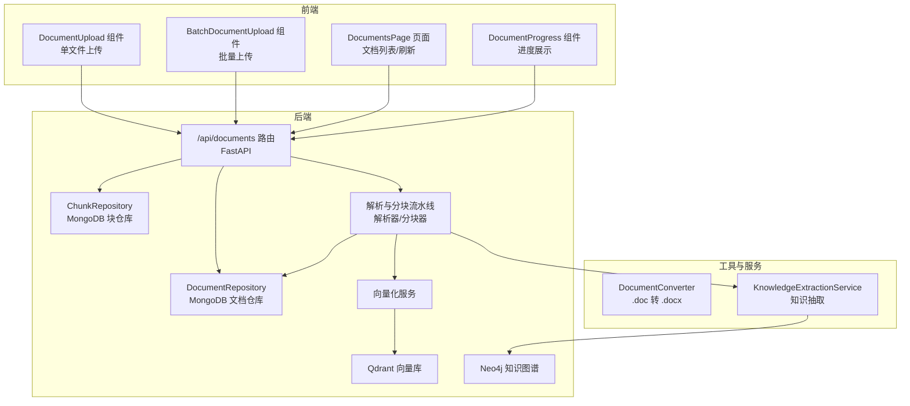
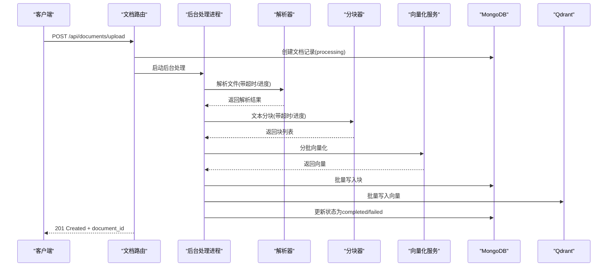
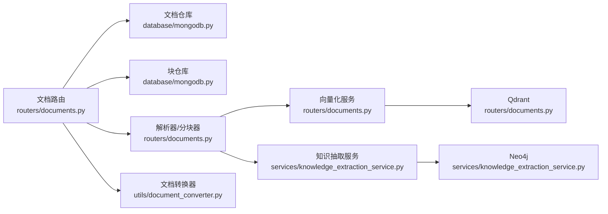

# 文档API

<cite>
**本文引用的文件**
- [routers/documents.py](file://routers/documents.py)
- [database/mongodb.py](file://database/mongodb.py)
- [web/components/document/DocumentUpload.tsx](file://web/components/document/DocumentUpload.tsx)
- [web/components/document/BatchDocumentUpload.tsx](file://web/components/document/BatchDocumentUpload.tsx)
- [web/app/documents/page.tsx](file://web/app/documents/page.tsx)
- [web/components/document/DocumentProgress.tsx](file://web/components/document/DocumentProgress.tsx)
- [utils/document_converter.py](file://utils/document_converter.py)
- [services/knowledge_extraction_service.py](file://services/knowledge_extraction_service.py)
</cite>

## 目录
1. [简介](#简介)
2. [项目结构](#项目结构)
3. [核心组件](#核心组件)
4. [架构总览](#架构总览)
5. [详细组件分析](#详细组件分析)
6. [依赖关系分析](#依赖关系分析)
7. [性能考虑](#性能考虑)
8. [故障排查指南](#故障排查指南)
9. [结论](#结论)
10. [附录](#附录)

## 简介
本文件为“文档API”的完整技术文档，覆盖文档上传、管理、预览与下载等全流程接口，以及解析状态跟踪、进度报告与错误处理机制。文档同时解释权限控制与访问限制，并提供请求参数、响应格式与使用示例。

## 项目结构
文档API由后端FastAPI路由、MongoDB持久层、解析与分块流水线、向量化与知识图谱构建、前端上传与进度展示组件构成。整体采用异步后台任务处理，避免阻塞请求响应。

图表来源
- [routers/documents.py](file://routers/documents.py)
- [database/mongodb.py](file://database/mongodb.py)
- [utils/document_converter.py](file://utils/document_converter.py)
- [services/knowledge_extraction_service.py](file://services/knowledge_extraction_service.py)

章节来源
- [routers/documents.py](file://routers/documents.py)
- [database/mongodb.py](file://database/mongodb.py)

## 核心组件
- 文档路由与后台处理：负责接收上传、调度解析/分块/向量化/存储，并实时更新进度与状态。
- 文档仓库与块仓库：提供文档元数据、块数据的增删改查与统计。
- 解析与分块流水线：根据文件类型选择解析器，支持PDF进度显示与超时监控；随后进行分块与内容分析。
- 向量化与存储：分批向量化，批量写入MongoDB与Qdrant；失败重试与健康检查。
- 知识图谱构建：基于LLM抽取实体关系，写入Neo4j。
- 前端上传与进度展示：支持单文件与批量上传，实时展示进度与状态。

章节来源
- [routers/documents.py](file://routers/documents.py)
- [database/mongodb.py](file://database/mongodb.py)
- [utils/document_converter.py](file://utils/document_converter.py)
- [services/knowledge_extraction_service.py](file://services/knowledge_extraction_service.py)

## 架构总览
文档处理流程分为六个阶段，每个阶段都有进度百分比与阶段描述，便于前端展示与用户感知。

图表来源
- [routers/documents.py](file://routers/documents.py)
- [database/mongodb.py](file://database/mongodb.py)

## 详细组件分析

### 接口总览与权限说明
- 所有文档管理接口均支持匿名模式，但上传前需明确目标“知识空间”（knowledge_space_id）或“助手”（assistant_id）。若仅提供assistant_id，系统会自动复用为knowledge_space_id。
- 管理员可查看/修改/删除所有文档；普通用户可查看与使用已处理完成的文档。
- 文件大小限制为200MB；支持类型：PDF、Word(.doc/.docx)、Markdown(.md/.markdown)、TXT；.doc文件将自动转换为.docx后再处理。

章节来源
- [routers/documents.py](file://routers/documents.py)
- [web/components/document/DocumentUpload.tsx](file://web/components/document/DocumentUpload.tsx)
- [web/components/document/BatchDocumentUpload.tsx](file://web/components/document/BatchDocumentUpload.tsx)

### 文档上传接口
- 单文件上传
  - 方法与路径：POST /api/documents/upload
  - 请求体：multipart/form-data
    - file: 二进制文件（必填）
    - assistant_id: 字符串（可选，向后兼容）
    - knowledge_space_id: 字符串（可选，推荐）
  - 行为：
    - 校验文件类型与大小（200MB上限）
    - 计算文件哈希，去重检查
    - 保存文件至本地上传目录
    - 创建文档记录（状态processing），立即返回201与document_id
    - 后台异步处理：解析 → 分块 → 知识抽取 → 向量化 → 存储
  - 响应：201 Created，包含message、document_id、filename、file_size、status
  - 错误：400（参数/类型/大小/重复）、409（重复内容）、500（内部错误）

- 批量上传（前端组件）
  - 组件：BatchDocumentUpload
  - 支持多文件拖拽/选择，顺序上传，显示每个文件的进度与状态
  - 上传超时15分钟，与后端一致

章节来源
- [routers/documents.py](file://routers/documents.py)
- [web/components/document/DocumentUpload.tsx](file://web/components/document/DocumentUpload.tsx)
- [web/components/document/BatchDocumentUpload.tsx](file://web/components/document/BatchDocumentUpload.tsx)

### 文档管理接口
- 获取文档列表
  - 方法与路径：GET /api/documents
  - 查询参数：
    - skip: 整数（默认0）
    - limit: 整数（默认100）
    - assistant_id: 字符串（可选，向后兼容）
    - knowledge_space_id: 字符串（可选）
  - 响应：documents（列表，包含id、title、file_type、file_size、created_at、status、progress_percentage、current_stage、stage_details）、total

- 获取文档详情
  - 方法与路径：GET /api/documents/{doc_id}
  - 响应：包含基础信息、metadata、processing_stages（阶段进度与状态）、chunks、vectors、统计信息（total_chunks、total_vectors）

- 更新文档信息（重命名）
  - 方法与路径：PUT /api/documents/{doc_id}
  - 请求体：JSON
    - title: 字符串（必填）
  - 响应：200 OK，包含message、document_id、title

- 删除文档
  - 方法与路径：DELETE /api/documents/{doc_id}
  - 行为：清理MongoDB块、Qdrant向量、本地文件，最后删除文档记录
  - 响应：200 OK，包含message、document_id

- 重命名文档
  - 方法与路径：PUT /api/documents/{doc_id}
  - 请求体：JSON
    - title: 字符串（必填）
  - 响应：200 OK，包含message、document_id、title

- 文档进度查询
  - 方法与路径：GET /api/documents/{doc_id}/progress
  - 响应：document_id、progress_percentage、current_stage、stage_details、status

- 重新处理文档
  - 方法与路径：POST /api/documents/{doc_id}/retry
  - 行为：清理旧chunks与vectors，重置状态为processing，重新启动后台处理
  - 响应：200 OK，包含message、document_id、status

章节来源
- [routers/documents.py](file://routers/documents.py)
- [database/mongodb.py](file://database/mongodb.py)

### 文档预览与下载
- 文档预览
  - 方法与路径：GET /api/documents/{doc_id}/preview
  - 行为：根据文件类型返回对应媒体类型，直接以FileResponse返回文件内容
  - 适用：所有认证用户均可访问

- 文档下载
  - 当前后端未提供专用下载接口；可通过预览接口获取文件内容，或在前端自行实现下载逻辑（基于预览接口返回的Blob）

章节来源
- [routers/documents.py](file://routers/documents.py)

### 解析状态跟踪与进度报告
- 进度阶段与范围：
  - 0%-5%：文档上传
  - 5%-25%：解析文档
  - 25%-35%：文本分块
  - 35%-75%：向量化（分批）
  - 75%-95%：存储向量（MongoDB/Qdrant）
  - 100%：完成
- 进度更新策略：
  - 解析阶段：每5秒更新一次
  - 分块阶段：每2秒更新一次
  - 向量化阶段：按批次更新
  - 存储阶段：按批次更新
- 阶段详情：包含当前阶段名称与描述（如“已解析: X/Y 页”、“批次 X/Y”等）

章节来源
- [routers/documents.py](file://routers/documents.py)

### 错误处理机制
- 参数校验：文件名、类型、大小、重复内容检查
- 超时保护：解析/分块最长超时分别为15分钟与30分钟
- 失败回退：增强解析模块失败时回退到原有解析器
- 健康检查：Qdrant服务不可用时降级存储至MongoDB
- 清理策略：失败或重试时清理临时文件与旧数据

章节来源
- [routers/documents.py](file://routers/documents.py)

### 权限控制与访问限制
- 上传：匿名模式，但必须提供knowledge_space_id或assistant_id；.doc文件将自动转换为.docx
- 管理：管理员可查看/修改/删除所有文档；普通用户可查看与使用已处理完成的文档
- 预览：所有认证用户可访问

章节来源
- [routers/documents.py](file://routers/documents.py)

## 依赖关系分析

图表来源
- [routers/documents.py](file://routers/documents.py)
- [database/mongodb.py](file://database/mongodb.py)
- [utils/document_converter.py](file://utils/document_converter.py)
- [services/knowledge_extraction_service.py](file://services/knowledge_extraction_service.py)

章节来源
- [routers/documents.py](file://routers/documents.py)
- [database/mongodb.py](file://database/mongodb.py)
- [utils/document_converter.py](file://utils/document_converter.py)
- [services/knowledge_extraction_service.py](file://services/knowledge_extraction_service.py)

## 性能考虑
- 异步后台处理：上传即返回，避免阻塞；后台按阶段更新进度。
- 分批向量化：每批50个，降低内存峰值与网络抖动影响。
- 连接池与超时：MongoDB连接池参数与超时配置优化高并发场景。
- Qdrant降级：服务不可用时仍可完成处理，仅存储到MongoDB。
- 前端轮询：页面自动轮询处理中的文档，3秒间隔，避免频繁请求。

章节来源
- [routers/documents.py](file://routers/documents.py)
- [database/mongodb.py](file://database/mongodb.py)
- [web/app/documents/page.tsx](file://web/app/documents/page.tsx)

## 故障排查指南
- 上传失败
  - 检查文件类型与大小（200MB限制）
  - 确认knowledge_space_id或assistant_id已提供
  - 查看后端日志中的错误堆栈与文件路径
- 解析失败
  - PDF可能为扫描版或损坏；检查PDF解析器日志
  - 回退到原有解析器后仍失败，确认文件完整性
- 分块/向量化失败
  - 检查嵌入服务可用性与维度配置
  - 查看分批向量化错误与重试次数
- Qdrant不可用
  - 检查Qdrant健康状态与网络连通性
  - 系统会自动降级存储至MongoDB
- 重复内容
  - 系统基于文件哈希去重；如提示重复，确认是否已存在相同内容文档

章节来源
- [routers/documents.py](file://routers/documents.py)

## 结论
文档API提供了完整的“上传-解析-分块-向量化-存储-预览/下载”链路，具备完善的进度跟踪、错误处理与降级策略。前端组件与后端路由协同，确保用户体验流畅、处理过程透明可控。管理员与普通用户的权限边界清晰，满足知识库共享与访问控制需求。

## 附录

### 接口清单与示例

- 单文件上传
  - 方法：POST /api/documents/upload
  - 请求体：multipart/form-data
    - file: 二进制文件
    - assistant_id: 字符串（可选）
    - knowledge_space_id: 字符串（推荐）
  - 响应：201 Created，包含message、document_id、filename、file_size、status

- 批量上传（前端组件）
  - 组件：BatchDocumentUpload
  - 行为：多文件顺序上传，显示每个文件进度与状态

- 获取文档列表
  - 方法：GET /api/documents
  - 查询参数：skip、limit、assistant_id、knowledge_space_id
  - 响应：documents（列表）、total

- 获取文档详情
  - 方法：GET /api/documents/{doc_id}
  - 响应：文档基础信息、metadata、processing_stages、chunks、vectors、统计信息

- 更新文档信息（重命名）
  - 方法：PUT /api/documents/{doc_id}
  - 请求体：JSON
    - title: 字符串（必填）
  - 响应：200 OK，包含message、document_id、title

- 删除文档
  - 方法：DELETE /api/documents/{doc_id}
  - 响应：200 OK，包含message、document_id

- 文档进度查询
  - 方法：GET /api/documents/{doc_id}/progress
  - 响应：document_id、progress_percentage、current_stage、stage_details、status

- 重新处理文档
  - 方法：POST /api/documents/{doc_id}/retry
  - 响应：200 OK，包含message、document_id、status

- 文档预览
  - 方法：GET /api/documents/{doc_id}/preview
  - 响应：FileResponse（按文件类型设置媒体类型）

- 文档下载
  - 当前未提供专用下载接口；可使用预览接口获取文件内容

章节来源
- [routers/documents.py](file://routers/documents.py)
- [web/components/document/DocumentUpload.tsx](file://web/components/document/DocumentUpload.tsx)
- [web/components/document/BatchDocumentUpload.tsx](file://web/components/document/BatchDocumentUpload.tsx)
- [web/app/documents/page.tsx](file://web/app/documents/page.tsx)
- [web/components/document/DocumentProgress.tsx](file://web/components/document/DocumentProgress.tsx)