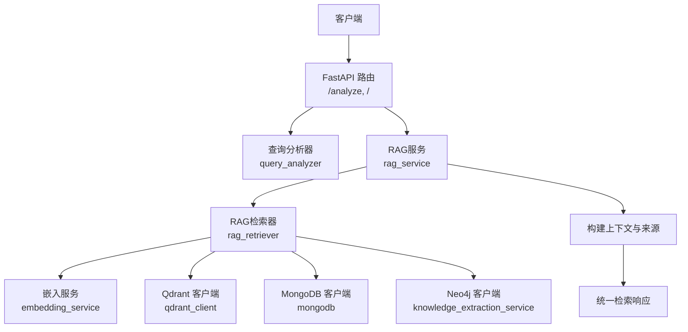
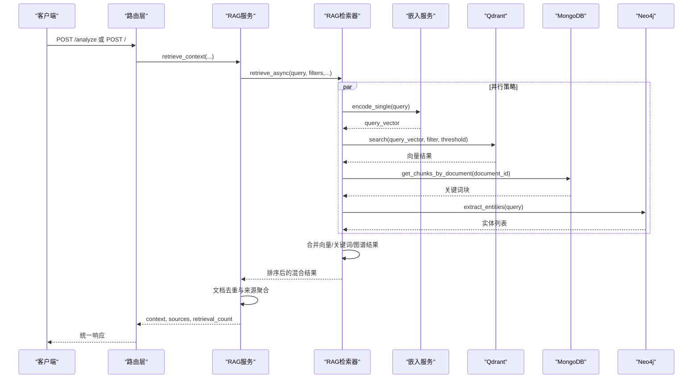
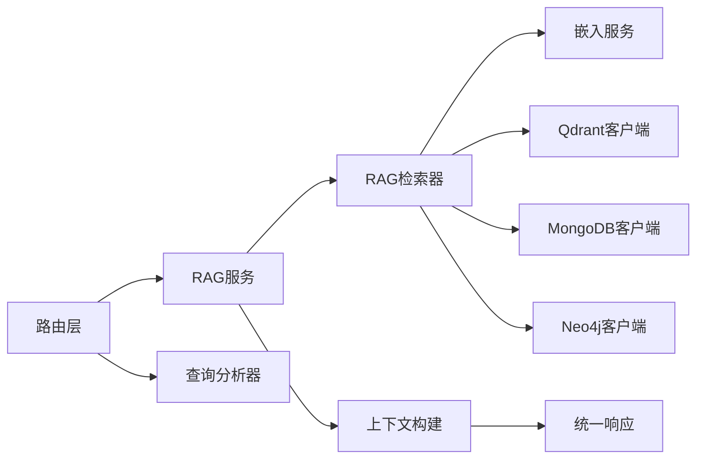

# 检索API

<cite>
**本文引用的文件**
- [retrieval.py](file://routers/retrieval.py)
- [rag_retriever.py](file://retrieval/rag_retriever.py)
- [rag_service.py](file://services/rag_service.py)
- [embedding_service.py](file://embedding/embedding_service.py)
- [qdrant_client.py](file://database/qdrant_client.py)
- [mongodb.py](file://database/mongodb.py)
- [knowledge_extraction_service.py](file://services/knowledge_extraction_service.py)
- [query_analyzer.py](file://services/query_analyzer.py)
- [evaluate.py](file://eval/evaluate.py)
- [monitoring.py](file://utils/monitoring.py)
- [logger.py](file://utils/logger.py)
</cite>

## 目录
1. [简介](#简介)
2. [项目结构](#项目结构)
3. [核心组件](#核心组件)
4. [架构总览](#架构总览)
5. [详细组件分析](#详细组件分析)
6. [依赖分析](#依赖分析)
7. [性能考量](#性能考量)
8. [故障排查指南](#故障排查指南)
9. [结论](#结论)
10. [附录](#附录)

## 简介
本文件面向检索服务API，聚焦以下接口与能力：
- 向量检索接口：/vector-search（内部实现，对外暴露统一检索入口）
- 关键词检索接口：/keyword-search（内部实现，对外暴露统一检索入口）
- 混合检索接口：/hybrid-search（内部实现，对外暴露统一检索入口）
- 检索结果排序接口：/rerank（当前实现中重排模块暂不可用）
- 检索结果过滤接口：/filter（当前实现中未提供独立过滤接口，过滤主要通过检索参数与合并策略实现）

文档还涵盖检索性能优化、缓存策略、结果去重机制、检索算法配置、模型选择与参数调优指南，以及检索质量评估与性能监控方法。

## 项目结构
检索服务围绕FastAPI路由、RAG服务、检索器、嵌入服务、向量数据库与图谱服务协同工作，形成“查询分析 → 检索 → 合并与排序 → 结果构建”的闭环。

图表来源
- [retrieval.py:1-135](file://routers/retrieval.py#L1-L135)
- [rag_service.py:1-248](file://services/rag_service.py#L1-L248)
- [rag_retriever.py:1-325](file://retrieval/rag_retriever.py#L1-L325)
- [embedding_service.py:1-278](file://embedding/embedding_service.py#L1-L278)
- [qdrant_client.py:1-544](file://database/qdrant_client.py#L1-L544)
- [mongodb.py:1-800](file://database/mongodb.py#L1-L800)
- [knowledge_extraction_service.py:1-211](file://services/knowledge_extraction_service.py#L1-L211)

章节来源
- [retrieval.py:1-135](file://routers/retrieval.py#L1-L135)
- [rag_service.py:1-248](file://services/rag_service.py#L1-L248)
- [rag_retriever.py:1-325](file://retrieval/rag_retriever.py#L1-L325)

## 核心组件
- FastAPI路由层：定义统一检索入口与查询分析入口，负责请求模型校验与响应封装。
- RAG服务层：协调多集合检索、并行任务、上下文构建与来源去重。
- RAG检索器：实现混合检索（向量、关键词、图谱），支持合并与重排。
- 嵌入服务：基于Ollama的向量编码服务，支持模型自动检测与重试。
- 向量数据库：Qdrant客户端封装，支持gRPC连接、健康检查、自动集合创建与搜索。
- 图谱与知识抽取：基于Ollama抽取实体与三元组，Neo4j存储与查询。
- 日志与监控：异步日志与性能监控工具，支持慢请求告警与系统指标采集。

章节来源
- [retrieval.py:14-42](file://routers/retrieval.py#L14-L42)
- [rag_service.py:7-248](file://services/rag_service.py#L7-L248)
- [rag_retriever.py:22-101](file://retrieval/rag_retriever.py#L22-L101)
- [embedding_service.py:8-278](file://embedding/embedding_service.py#L8-L278)
- [qdrant_client.py:18-544](file://database/qdrant_client.py#L18-L544)
- [knowledge_extraction_service.py:10-211](file://services/knowledge_extraction_service.py#L10-L211)
- [monitoring.py:13-185](file://utils/monitoring.py#L13-L185)

## 架构总览
检索服务采用“统一入口 + 多策略并行 + 合并与重排”的设计，支持：
- 多知识空间并行检索
- 向量相似度检索与关键词匹配
- 图谱实体扩展检索
- 结果按文档级别去重与来源聚合
- 可选重排（当前实现中重排模块不可用）

图表来源
- [retrieval.py:82-135](file://routers/retrieval.py#L82-L135)
- [rag_service.py:10-191](file://services/rag_service.py#L10-L191)
- [rag_retriever.py:69-101](file://retrieval/rag_retriever.py#L69-L101)
- [embedding_service.py:261-263](file://embedding/embedding_service.py#L261-L263)
- [qdrant_client.py:336-414](file://database/qdrant_client.py#L336-L414)
- [mongodb.py:799-800](file://database/mongodb.py#L799-L800)
- [knowledge_extraction_service.py:104-142](file://services/knowledge_extraction_service.py#L104-L142)

## 详细组件分析

### 统一检索接口（POST /）
- 请求模型
  - query: 查询文本（必填）
  - document_id: 可选，按文档过滤
  - top_k: 可选，返回结果数量（默认5）
  - assistant_id: 可选，用于解析集合名称
  - knowledge_space_ids: 可选，指定一个或多个知识空间
  - conversation_id: 可选，同时检索对话专用向量空间
- 处理流程
  - 解析集合名称（优先知识空间，其次助手）
  - 并行检索多个集合
  - 构建上下文与来源，按文档去重
  - 返回context、sources、retrieval_count与推荐资源占位
- 关键实现参考
  - [retrieval.py:82-135](file://routers/retrieval.py#L82-L135)
  - [rag_service.py:10-191](file://services/rag_service.py#L10-L191)

章节来源
- [retrieval.py:14-21](file://routers/retrieval.py#L14-L21)
- [retrieval.py:82-135](file://routers/retrieval.py#L82-L135)
- [rag_service.py:10-191](file://services/rag_service.py#L10-L191)

### 查询分析接口（POST /analyze）
- 作用：判断是否需要检索上下文，支持快速分流
- 请求模型：query（必填）
- 响应模型：need_retrieval（bool）、reason（string）、confidence（string）
- 实现要点：使用小模型快速判断，失败时回退关键词匹配
- 关键实现参考
  - [retrieval.py:44-79](file://routers/retrieval.py#L44-L79)
  - [query_analyzer.py:38-157](file://services/query_analyzer.py#L38-L157)

章节来源
- [retrieval.py:24-33](file://routers/retrieval.py#L24-L33)
- [retrieval.py:44-79](file://routers/retrieval.py#L44-L79)
- [query_analyzer.py:38-157](file://services/query_analyzer.py#L38-L157)

### 向量检索（/vector-search）
- 实现位置：RAG检索器内部的向量搜索方法
- 关键参数
  - query: 查询文本
  - document_id: 可选，按文档过滤
  - collection_name: 可选，指定集合名称
  - embedding_model: 可选，指定嵌入模型
  - top_k: 检索上限（内部使用较大上限再截断）
  - score_threshold: 相似度阈值（来自检索器构造参数）
- 处理流程
  - 编码查询向量
  - Qdrant向量搜索（支持gRPC、自动集合创建、健康检查）
  - 返回按分数排序的块级结果
- 关键实现参考
  - [rag_retriever.py:110-138](file://retrieval/rag_retriever.py#L110-L138)
  - [embedding_service.py:261-263](file://embedding/embedding_service.py#L261-L263)
  - [qdrant_client.py:336-414](file://database/qdrant_client.py#L336-L414)

章节来源
- [rag_retriever.py:25-38](file://retrieval/rag_retriever.py#L25-L38)
- [rag_retriever.py:110-138](file://retrieval/rag_retriever.py#L110-L138)
- [qdrant_client.py:336-414](file://database/qdrant_client.py#L336-L414)

### 关键词检索（/keyword-search）
- 实现位置：RAG检索器内部的关键词搜索方法
- 关键参数
  - query: 查询文本
  - document_id: 可选，按文档过滤
- 处理流程
  - 仅在指定document_id时执行（全局关键词检索代价过高，会被跳过）
  - 对文档块进行关键词交集匹配，计算匹配比例作为分数
  - 返回按分数排序的块级结果
- 关键实现参考
  - [rag_retriever.py:140-174](file://retrieval/rag_retriever.py#L140-L174)
  - [mongodb.py:799-800](file://database/mongodb.py#L799-L800)

章节来源
- [rag_retriever.py:140-174](file://retrieval/rag_retriever.py#L140-L174)
- [mongodb.py:799-800](file://database/mongodb.py#L799-L800)

### 混合检索（/hybrid-search）
- 实现位置：RAG检索器内部的异步检索方法
- 关键流程
  - 并行执行向量检索、关键词检索、图谱检索
  - 合并策略：向量结果为基础，关键词结果按chunk_id提升分数，图谱结果作为独立来源加入
  - 可选重排：当前实现中重排模块不可用，直接返回合并排序结果
- 关键实现参考
  - [rag_retriever.py:69-101](file://retrieval/rag_retriever.py#L69-L101)
  - [rag_retriever.py:262-297](file://retrieval/rag_retriever.py#L262-L297)
  - [rag_retriever.py:299-323](file://retrieval/rag_retriever.py#L299-L323)

章节来源
- [rag_retriever.py:69-101](file://retrieval/rag_retriever.py#L69-L101)
- [rag_retriever.py:262-297](file://retrieval/rag_retriever.py#L262-L297)

### 检索结果排序（/rerank）
- 当前状态：重排模块不可用
- 原因：sentence-transformers在当前环境被禁用，重排模型未加载
- 建议：启用重排需满足依赖与环境要求，或替换为可用的重排模型
- 关键实现参考
  - [rag_retriever.py:12-20](file://retrieval/rag_retriever.py#L12-L20)
  - [rag_retriever.py:299-323](file://retrieval/rag_retriever.py#L299-L323)

章节来源
- [rag_retriever.py:12-20](file://retrieval/rag_retriever.py#L12-L20)
- [rag_retriever.py:299-323](file://retrieval/rag_retriever.py#L299-L323)

### 检索结果过滤（/filter）
- 当前状态：未提供独立过滤接口
- 过滤实现：通过检索参数（如document_id、knowledge_space_ids、conversation_id）与合并策略实现过滤与去重
- 关键实现参考
  - [retrieval.py:16-21](file://routers/retrieval.py#L16-L21)
  - [rag_service.py:34-62](file://services/rag_service.py#L34-L62)
  - [rag_retriever.py:262-297](file://retrieval/rag_retriever.py#L262-L297)

章节来源
- [retrieval.py:16-21](file://routers/retrieval.py#L16-L21)
- [rag_service.py:34-62](file://services/rag_service.py#L34-L62)
- [rag_retriever.py:262-297](file://retrieval/rag_retriever.py#L262-L297)

### 检索结果去重机制
- 文档级别去重：按document_id聚合，保留最高分chunk
- 会话附件去重：按conversation_id+file_id聚合
- 关键实现参考
  - [rag_service.py:133-183](file://services/rag_service.py#L133-L183)

章节来源
- [rag_service.py:133-183](file://services/rag_service.py#L133-L183)

## 依赖分析
- 组件耦合
  - 路由层依赖RAG服务与查询分析器
  - RAG服务依赖RAG检索器、嵌入服务、数据库与图谱服务
  - 检索器依赖嵌入服务、向量数据库、图谱抽取与MongoDB
- 外部依赖
  - Ollama：嵌入与知识抽取
  - Qdrant：向量检索
  - Neo4j：图谱检索
  - MongoDB：文档与块元数据

图表来源
- [retrieval.py:1-135](file://routers/retrieval.py#L1-L135)
- [rag_service.py:1-248](file://services/rag_service.py#L1-L248)
- [rag_retriever.py:1-325](file://retrieval/rag_retriever.py#L1-L325)
- [embedding_service.py:1-278](file://embedding/embedding_service.py#L1-L278)
- [qdrant_client.py:1-544](file://database/qdrant_client.py#L1-L544)
- [knowledge_extraction_service.py:1-211](file://services/knowledge_extraction_service.py#L1-L211)
- [mongodb.py:1-800](file://database/mongodb.py#L1-L800)

## 性能考量
- 并行检索
  - 多知识空间并行检索，提升吞吐
  - 检索器内部并行执行向量、关键词、图谱三种策略
- 连接与超时
  - Qdrant优先使用gRPC，支持连接复用与超时配置
  - 嵌入服务对Ollama请求设置重试与超时
- 去重与截断
  - 检索器内部扩大top_k再截断，提升召回
  - 文档级别去重，避免重复来源
- 监控与告警
  - 性能监控器记录慢请求与系统指标
  - 异步日志避免阻塞

章节来源
- [rag_service.py:64-83](file://services/rag_service.py#L64-L83)
- [rag_retriever.py:82-90](file://retrieval/rag_retriever.py#L82-L90)
- [qdrant_client.py:66-96](file://database/qdrant_client.py#L66-L96)
- [embedding_service.py:175-228](file://embedding/embedding_service.py#L175-L228)
- [monitoring.py:118-185](file://utils/monitoring.py#L118-L185)
- [logger.py:15-88](file://utils/logger.py#L15-L88)

## 故障排查指南
- 向量检索失败
  - 检查Qdrant连接与集合是否存在，确认gRPC端口与超时配置
  - 关注集合维度不匹配与自动重建逻辑
  - 参考：[qdrant_client.py:336-414](file://database/qdrant_client.py#L336-L414)
- 嵌入服务异常
  - 检查Ollama模型可用性与网络连通性
  - 关注模型名称规范化与重试机制
  - 参考：[embedding_service.py:175-228](file://embedding/embedding_service.py#L175-L228)
- 图谱检索失败
  - 检查Neo4j连接与驱动状态
  - 关注实体抽取与Cypher查询
  - 参考：[knowledge_extraction_service.py:104-142](file://services/knowledge_extraction_service.py#L104-L142)
- 重排不可用
  - sentence-transformers依赖缺失或环境问题
  - 参考：[rag_retriever.py:12-20](file://retrieval/rag_retriever.py#L12-L20)
- 慢请求与高延迟
  - 使用性能监控器定位慢请求
  - 检查系统CPU、内存、磁盘占用
  - 参考：[monitoring.py:118-185](file://utils/monitoring.py#L118-L185)

章节来源
- [qdrant_client.py:336-414](file://database/qdrant_client.py#L336-L414)
- [embedding_service.py:175-228](file://embedding/embedding_service.py#L175-L228)
- [knowledge_extraction_service.py:104-142](file://services/knowledge_extraction_service.py#L104-L142)
- [rag_retriever.py:12-20](file://retrieval/rag_retriever.py#L12-L20)
- [monitoring.py:118-185](file://utils/monitoring.py#L118-L185)

## 结论
检索服务通过统一入口整合多策略检索，具备良好的扩展性与可观测性。当前实现中重排模块处于禁用状态，建议在满足依赖与环境要求后启用。通过合理的参数配置、并行策略与去重机制，可在保证质量的同时提升性能与稳定性。

## 附录

### 检索算法配置与模型选择
- 嵌入模型
  - Ollama模型名称可通过环境变量配置，支持自动检测与规范化
  - 参考：[embedding_service.py:11-44](file://embedding/embedding_service.py#L11-L44)
- 重排模型
  - 当前禁用，需满足依赖与环境要求
  - 参考：[rag_retriever.py:12-20](file://retrieval/rag_retriever.py#L12-L20)
- 图谱抽取
  - 基于Ollama抽取实体与三元组，Neo4j存储
  - 参考：[knowledge_extraction_service.py:104-142](file://services/knowledge_extraction_service.py#L104-L142)

章节来源
- [embedding_service.py:11-44](file://embedding/embedding_service.py#L11-L44)
- [rag_retriever.py:12-20](file://retrieval/rag_retriever.py#L12-L20)
- [knowledge_extraction_service.py:104-142](file://services/knowledge_extraction_service.py#L104-L142)

### 检索质量评估与性能监控
- 评估脚本
  - 使用RAG服务进行检索与生成，再由LLM评估回答质量
  - 参考：[evaluate.py:19-90](file://eval/evaluate.py#L19-L90)
- 性能监控
  - 记录请求耗时、错误率与系统指标，支持慢请求告警
  - 参考：[monitoring.py:118-185](file://utils/monitoring.py#L118-L185)

章节来源
- [evaluate.py:19-90](file://eval/evaluate.py#L19-L90)
- [monitoring.py:118-185](file://utils/monitoring.py#L118-L185)