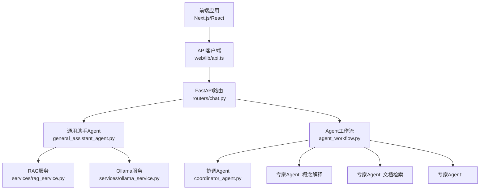
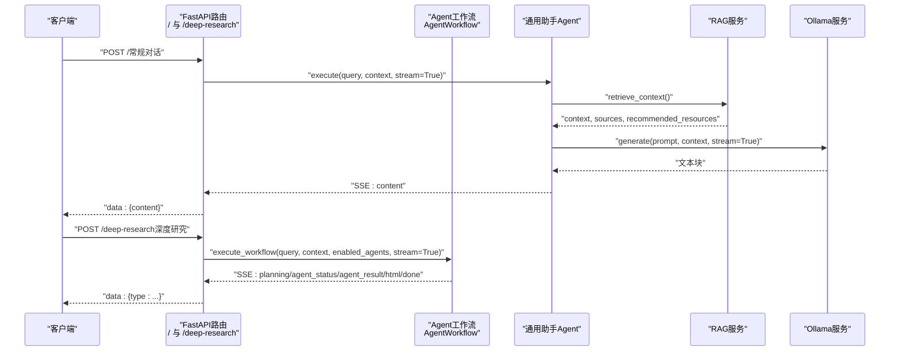
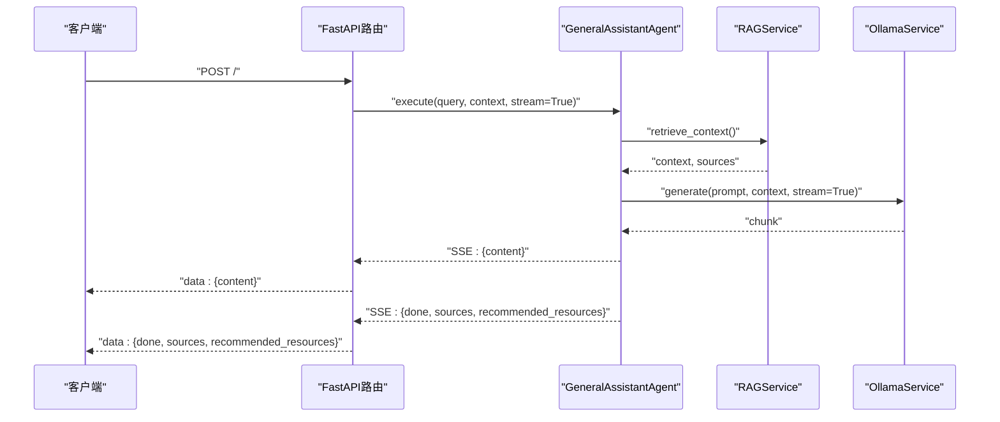
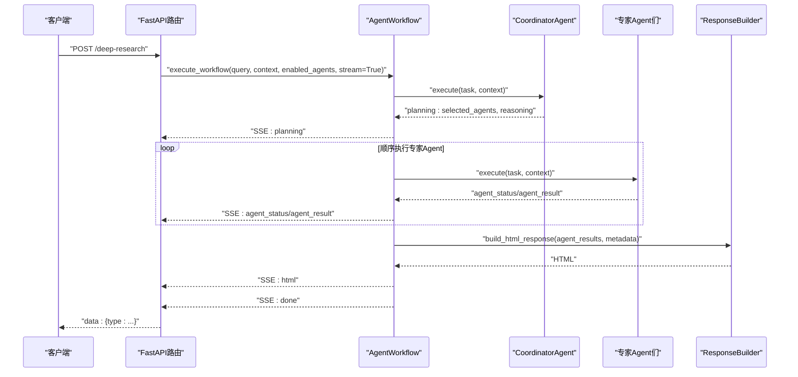
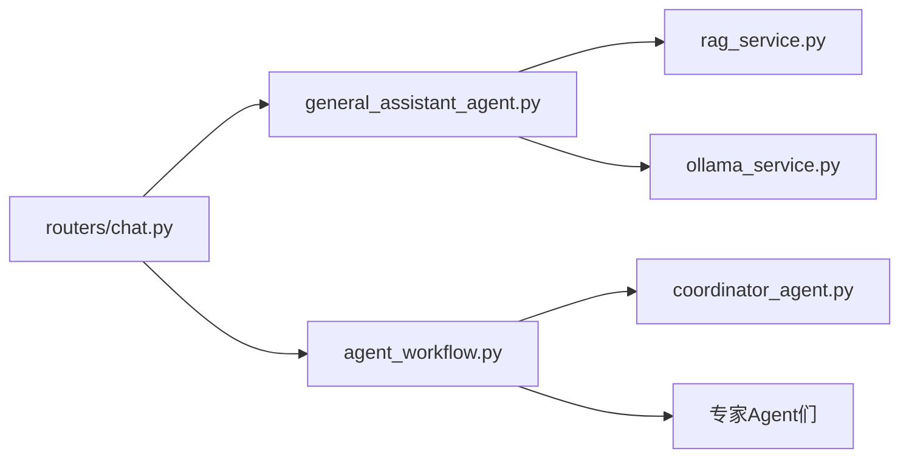
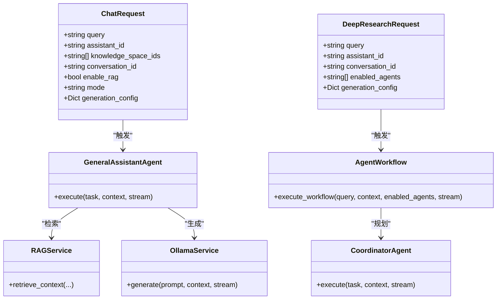

# 对话模式

<cite>
**本文引用的文件**
- [chat.py](file://routers/chat.py)
- [agent_workflow.py](file://agents/workflow/agent_workflow.py)
- [general_assistant_agent.py](file://agents/general_assistant/general_assistant_agent.py)
- [coordinator_agent.py](file://agents/coordinator/coordinator_agent.py)
- [rag_service.py](file://services/rag_service.py)
- [ollama_service.py](file://services/ollama_service.py)
- [page.tsx](file://web/app/chat/page.tsx)
- [DeepResearchRenderer.tsx](file://web/components/chat/DeepResearchRenderer.tsx)
- [api.ts](file://web/lib/api.ts)
- [chat.ts](file://web/types/chat.ts)
</cite>

## 目录
1. [简介](#简介)
2. [项目结构](#项目结构)
3. [核心组件](#核心组件)
4. [架构总览](#架构总览)
5. [详细组件分析](#详细组件分析)
6. [依赖分析](#依赖分析)
7. [性能考虑](#性能考虑)
8. [故障排查指南](#故障排查指南)
9. [结论](#结论)
10. [附录](#附录)

## 简介
本文件面向“对话模式API”的使用者与维护者，系统性说明两类对话接口：
- 常规对话接口（/）：支持RAG检索增强、来源追踪、推荐资源、流式SSE响应、客户端断开检测与性能优化。
- 深度研究模式接口（/deep-research）：多专家Agent协作、规划与进度反馈、HTML结果流式输出。

文档覆盖请求参数、响应格式、Agent选择与处理流程、模型配置、RAG检索、来源追踪、推荐资源、流式SSE实现、断开检测、性能优化策略、请求/响应示例与错误处理。

## 项目结构
后端采用FastAPI路由模块化组织，前端使用Next.js应用与React组件消费API。核心交互路径如下：
- 前端Next.js页面与组件通过API客户端发起请求
- FastAPI路由层解析请求、组装上下文
- Agent工作流与具体Agent执行任务
- RAG服务与Ollama服务提供检索与生成能力
- SSE流式返回，前端组件渲染

图表来源
- [chat.py](file://routers/chat.py)
- [general_assistant_agent.py](file://agents/general_assistant/general_assistant_agent.py)
- [agent_workflow.py](file://agents/workflow/agent_workflow.py)
- [coordinator_agent.py](file://agents/coordinator/coordinator_agent.py)
- [rag_service.py](file://services/rag_service.py)
- [ollama_service.py](file://services/ollama_service.py)
- [api.ts](file://web/lib/api.ts)

章节来源
- [chat.py](file://routers/chat.py)
- [general_assistant_agent.py](file://agents/general_assistant/general_assistant_agent.py)
- [agent_workflow.py](file://agents/workflow/agent_workflow.py)
- [coordinator_agent.py](file://agents/coordinator/coordinator_agent.py)
- [rag_service.py](file://services/rag_service.py)
- [ollama_service.py](file://services/ollama_service.py)
- [api.ts](file://web/lib/api.ts)

## 核心组件
- FastAPI路由与请求模型
  - 常规对话请求模型：query、assistant_id、knowledge_space_ids、conversation_id、enable_rag、mode、generation_config
  - 深度研究请求模型：query、assistant_id、conversation_id、enabled_agents、generation_config
- Agent体系
  - 通用助手Agent：封装RAG检索与LLM生成，支持流式输出
  - 协调Agent：规划任务、选择专家Agent、输出规划与理由
  - 专家Agent：概念解释、文档检索等
  - Agent工作流：编排多Agent协作、状态推进、结果聚合
- 服务层
  - RAG服务：检索上下文、来源与推荐资源
  - Ollama服务：构建提示词、流式/非流式生成
- 前端API与组件
  - API客户端：封装SSE请求、流式读取
  - 页面与渲染组件：处理SSE事件、展示来源与结果

章节来源
- [chat.py](file://routers/chat.py)
- [general_assistant_agent.py](file://agents/general_assistant/general_assistant_agent.py)
- [agent_workflow.py](file://agents/workflow/agent_workflow.py)
- [coordinator_agent.py](file://agents/coordinator/coordinator_agent.py)
- [rag_service.py](file://services/rag_service.py)
- [ollama_service.py](file://services/ollama_service.py)
- [api.ts](file://web/lib/api.ts)
- [page.tsx](file://web/app/chat/page.tsx)
- [DeepResearchRenderer.tsx](file://web/components/chat/DeepResearchRenderer.tsx)

## 架构总览
常规对话与深度研究模式均通过SSE流式返回，前端逐条解析事件，分别渲染普通文本或HTML结果。深度研究模式还包含Agent规划与进度事件。

图表来源
- [chat.py](file://routers/chat.py)
- [general_assistant_agent.py](file://agents/general_assistant/general_assistant_agent.py)
- [agent_workflow.py](file://agents/workflow/agent_workflow.py)
- [rag_service.py](file://services/rag_service.py)
- [ollama_service.py](file://services/ollama_service.py)

## 详细组件分析

### 常规对话接口（/）
- 请求参数
  - query：用户问题
  - assistant_id：可选，关联助手ID
  - knowledge_space_ids：可选，发起增强检索前的多知识空间ID
  - conversation_id：可选，关联对话历史
  - enable_rag：是否启用RAG检索，默认开启
  - mode：对话模式，normal或network
  - generation_config：模型配置，包含llm_model与embedding_model
- 响应格式（SSE）
  - 文本块：{"content": "..."}
  - 完成：{"done": true, "sources": [...], "recommended_resources": [...]}
  - 错误：{"error": "..."}
- 处理流程
  - 构建上下文：assistant_id、knowledge_space_ids、conversation_id、enable_rag、conversation_history、generation_config
  - 通用助手Agent执行：RAG检索 → LLM生成 → 流式返回
  - 断开检测：每N次yield检查is_disconnected，异常捕获后优雅停止
- 来源追踪与推荐资源
  - RAG服务返回sources（去重、按分数排序）
  - recommended_resources为空（可扩展）

图表来源
- [chat.py](file://routers/chat.py)
- [general_assistant_agent.py](file://agents/general_assistant/general_assistant_agent.py)
- [rag_service.py](file://services/rag_service.py)
- [ollama_service.py](file://services/ollama_service.py)

章节来源
- [chat.py](file://routers/chat.py)
- [general_assistant_agent.py](file://agents/general_assistant/general_assistant_agent.py)
- [rag_service.py](file://services/rag_service.py)
- [ollama_service.py](file://services/ollama_service.py)

### 深度研究模式接口（/deep-research）
- 请求参数
  - query：用户问题
  - assistant_id：可选
  - conversation_id：可选
  - enabled_agents：可选，手动指定启用的专家Agent列表
  - generation_config：模型配置，包含llm_model与embedding_model
- 响应格式（SSE）
  - planning：{"type": "planning", "content": "..."}（协调Agent规划）
  - agent_status：{"type": "agent_status", "agent_type": "...", "status": "...", "progress": ...}
  - agent_result：{"type": "agent_result", "agent_type": "...", "content": "..."}
  - html：{"type": "html", "content": "<html>..."}（最终HTML结果）
  - done：{"done": true}
  - error：{"error": "..."}
- 处理流程
  - Agent工作流：协调Agent规划 → 专家Agent顺序执行 → 结果聚合 → HTML构建
  - 断开检测：同上，每N次yield检查is_disconnected
- Agent选择与协作
  - 协调Agent：解析用户问题，选择必要专家Agent，给出任务与理由
  - 专家Agent：概念解释、文档检索等，按顺序执行并返回状态与结果
  - 可手动指定enabled_agents，否则使用协调Agent选择结果

图表来源
- [chat.py](file://routers/chat.py)
- [agent_workflow.py](file://agents/workflow/agent_workflow.py)
- [coordinator_agent.py](file://agents/coordinator/coordinator_agent.py)

章节来源
- [chat.py](file://routers/chat.py)
- [agent_workflow.py](file://agents/workflow/agent_workflow.py)
- [coordinator_agent.py](file://agents/coordinator/coordinator_agent.py)

### 流式响应实现（SSE）
- 服务端
  - 使用StreamingResponse与text/event-stream，禁用缓存与代理缓冲
  - 每N次yield检查is_disconnected，异常捕获后停止
  - 按事件类型序列化为data: JSON
- 客户端
  - 使用ReadableStream读取SSE，逐条解析事件
  - 普通模式：拼接content，完成后附加sources与recommended_resources
  - 深度研究模式：解析planning/agent_status/agent_result/html/done/error并渲染

章节来源
- [chat.py](file://routers/chat.py)
- [api.ts](file://web/lib/api.ts)
- [page.tsx](file://web/app/chat/page.tsx)

### 客户端断开连接检测
- 服务端
  - 每N次yield调用http_request.is_disconnected()检测
  - 捕获CancelledError、BrokenPipeError、ConnectionResetError、OSError等
  - 检测到断开后立即停止生成并清理
- 客户端
  - 使用AbortController可主动中断请求
  - 页面卸载/隐藏时保存/恢复状态，避免丢失流式生成进度

章节来源
- [chat.py](file://routers/chat.py)
- [page.tsx](file://web/app/chat/page.tsx)

### 模型配置选项
- generation_config
  - llm_model：生成模型名称（如gemma系列、gpt-oss系列等）
  - embedding_model：嵌入模型名称（用于RAG检索）
- Agent层
  - 通用助手Agent：可固定模型或动态选择
  - 协调Agent：默认模型名称
  - 专家Agent：默认模型名称
- 前端
  - 通过模型列表选择并传入generation_config

章节来源
- [chat.py](file://routers/chat.py)
- [general_assistant_agent.py](file://agents/general_assistant/general_assistant_agent.py)
- [coordinator_agent.py](file://agents/coordinator/coordinator_agent.py)
- [ollama_service.py](file://services/ollama_service.py)
- [api.ts](file://web/lib/api.ts)

### RAG检索增强与来源追踪
- 检索范围
  - knowledge_space_ids优先：解析知识空间集合名并并行检索
  - 兼容assistant_id：若未提供知识空间，回退到助手关联集合
- 检索结果
  - 合并多集合结果，按分数去重，保留最高分chunk
  - sources包含文档/附件来源，包含chunk_id、document_id/file_id、score、retrieval_type、标题与类型等
- 推荐资源
  - 当前返回空数组，可在RAG服务扩展

章节来源
- [rag_service.py](file://services/rag_service.py)
- [chat.py](file://routers/chat.py)

### 响应示例与请求示例
- 常规对话（SSE）
  - 文本块：{"content": "这是回复的一部分..."}
  - 完成：{"done": true, "sources": [...], "recommended_resources": [...]}
  - 错误：{"error": "生成失败..."}
- 深度研究（SSE）
  - 规划：{"type": "planning", "content": "{...}"}
  - 状态：{"type": "agent_status", "agent_type": "...", "status": "running/pending/completed/error", "progress": 0..100}
  - 结果：{"type": "agent_result", "agent_type": "...", "content": "..."}
  - HTML：{"type": "html", "content": "<html>..."}
  - 完成：{"done": true}
- 请求体（常规）
  - {"query": "...", "assistant_id": "...", "knowledge_space_ids": [...], "conversation_id": "...", "enable_rag": true, "mode": "normal", "generation_config": {"llm_model": "...", "embedding_model": "..."}}
- 请求体（深度研究）
  - {"query": "...", "assistant_id": "...", "conversation_id": "...", "enabled_agents": [...], "generation_config": {"llm_model": "...", "embedding_model": "..."}}

章节来源
- [chat.py](file://routers/chat.py)
- [api.ts](file://web/lib/api.ts)
- [page.tsx](file://web/app/chat/page.tsx)

## 依赖分析
- 组件耦合
  - 路由层依赖Agent工作流与通用助手Agent
  - Agent工作流依赖协调Agent与各专家Agent
  - 通用助手Agent依赖RAG服务与Ollama服务
- 外部依赖
  - Ollama服务：模型生成与流式传输
  - 数据库：对话、知识空间、文档、附件状态
  - 向量库：Qdrant（对话专用向量空间）

图表来源
- [chat.py](file://routers/chat.py)
- [general_assistant_agent.py](file://agents/general_assistant/general_assistant_agent.py)
- [agent_workflow.py](file://agents/workflow/agent_workflow.py)
- [coordinator_agent.py](file://agents/coordinator/coordinator_agent.py)
- [rag_service.py](file://services/rag_service.py)
- [ollama_service.py](file://services/ollama_service.py)

章节来源
- [chat.py](file://routers/chat.py)
- [general_assistant_agent.py](file://agents/general_assistant/general_assistant_agent.py)
- [agent_workflow.py](file://agents/workflow/agent_workflow.py)
- [coordinator_agent.py](file://agents/coordinator/coordinator_agent.py)
- [rag_service.py](file://services/rag_service.py)
- [ollama_service.py](file://services/ollama_service.py)

## 性能考虑
- 流式输出节流
  - 服务端每N次yield检查连接状态，降低轮询开销
  - 客户端对流式更新进行节流与累积，减少UI重绘
- 超时与空闲检测
  - Ollama服务设置较长超时与空闲超时，避免长时间无响应
- 模型选择与切换
  - 通用助手Agent按问题动态选择模型，必要时切换OllamaService实例
- 检索优化
  - RAG服务并行检索多知识空间集合，结果去重与排序
- 前端状态持久化
  - 页面隐藏/卸载时保存流式生成状态，恢复后继续显示

章节来源
- [chat.py](file://routers/chat.py)
- [ollama_service.py](file://services/ollama_service.py)
- [page.tsx](file://web/app/chat/page.tsx)

## 故障排查指南
- 常见错误
  - 对话不存在：404，检查conversation_id
  - 服务器内部错误：500，查看后端日志
  - 流式生成超时：检查Ollama服务可用性与网络
  - 客户端断开：SSE自动停止，可重试
- 日志定位
  - 路由层记录请求与异常
  - Agent层记录规划、执行与错误
  - RAG服务记录检索集合与来源
- 建议操作
  - 确认模型列表可用与generation_config正确
  - 检查知识空间ID与集合名
  - 使用AbortController中断长时间任务
  - 前端刷新页面恢复状态

章节来源
- [chat.py](file://routers/chat.py)
- [general_assistant_agent.py](file://agents/general_assistant/general_assistant_agent.py)
- [agent_workflow.py](file://agents/workflow/agent_workflow.py)
- [rag_service.py](file://services/rag_service.py)
- [ollama_service.py](file://services/ollama_service.py)

## 结论
本对话模式API通过SSE实现流畅的流式交互，常规对话强调RAG检索与来源追踪，深度研究模式通过多Agent协作提供结构化研究结果。前后端协同实现了断开检测、性能优化与状态持久化，满足教学与研究场景的多样化需求。

## 附录
- 类关系概览（代码级）

图表来源
- [chat.py](file://routers/chat.py)
- [general_assistant_agent.py](file://agents/general_assistant/general_assistant_agent.py)
- [agent_workflow.py](file://agents/workflow/agent_workflow.py)
- [coordinator_agent.py](file://agents/coordinator/coordinator_agent.py)
- [rag_service.py](file://services/rag_service.py)
- [ollama_service.py](file://services/ollama_service.py)