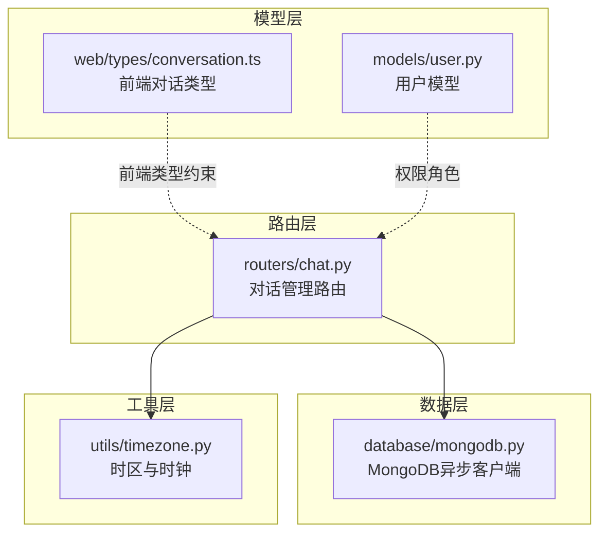
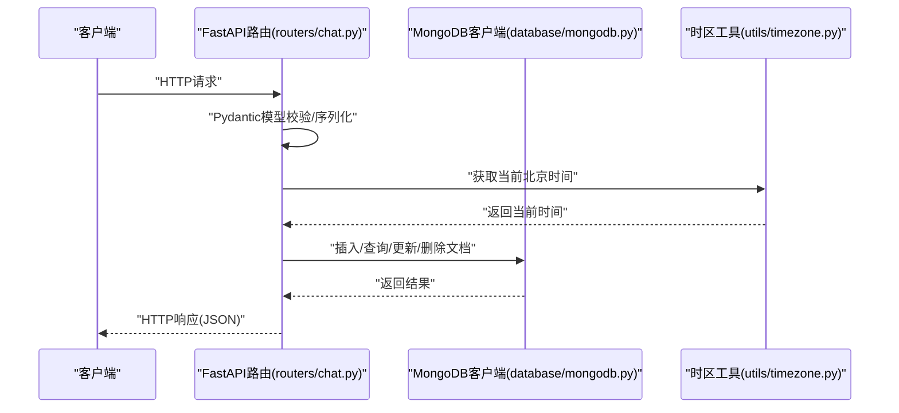
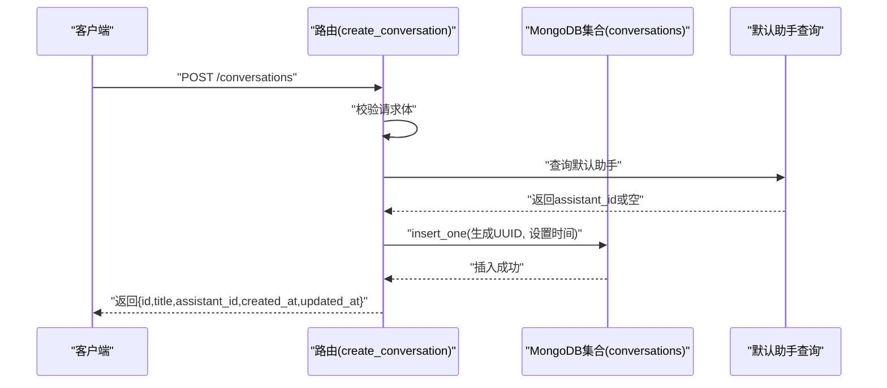
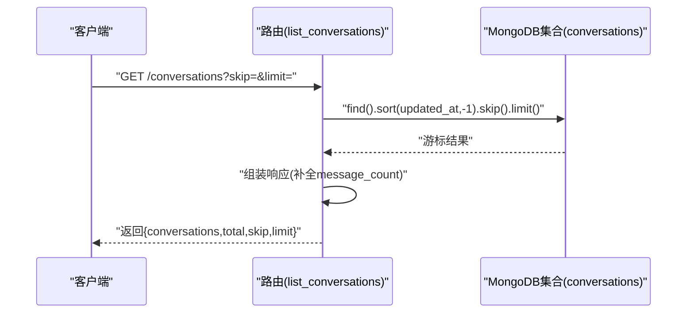
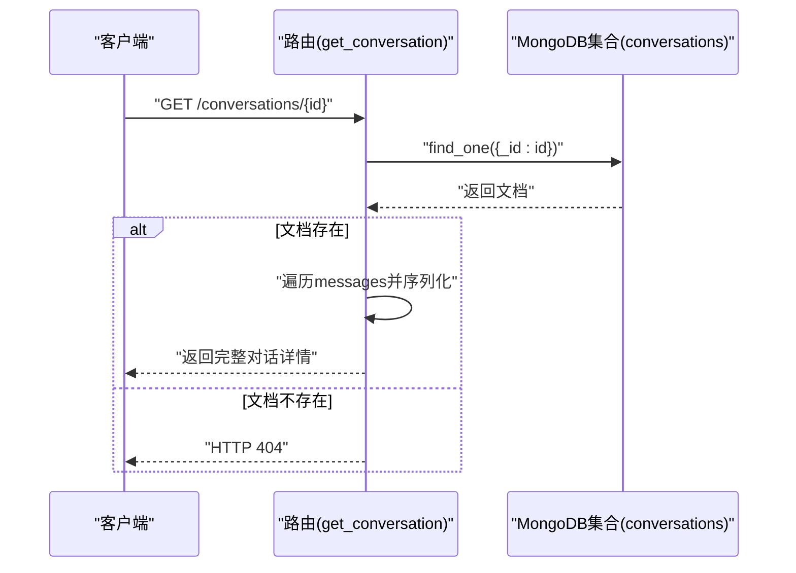
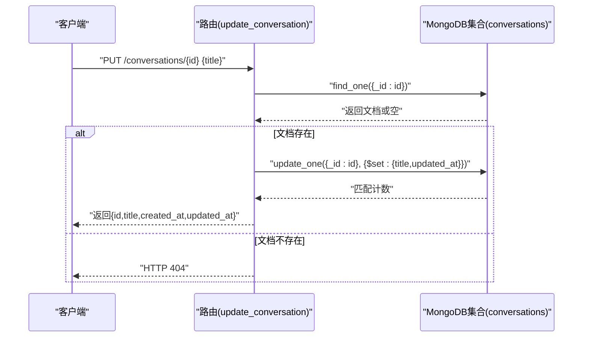
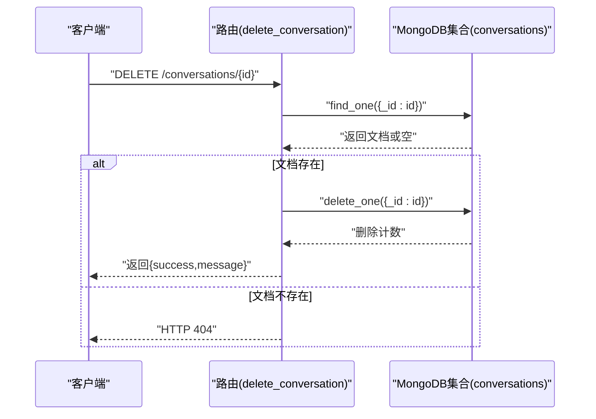
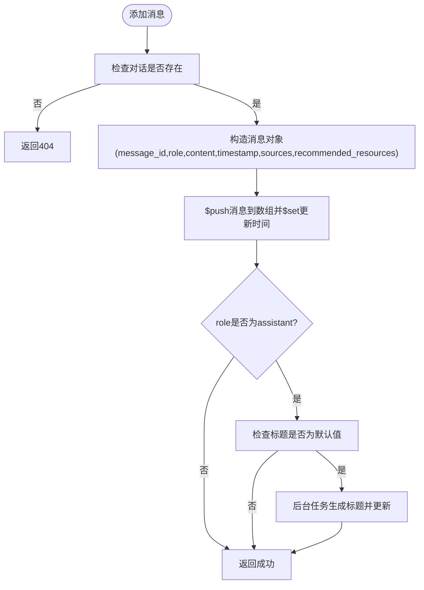
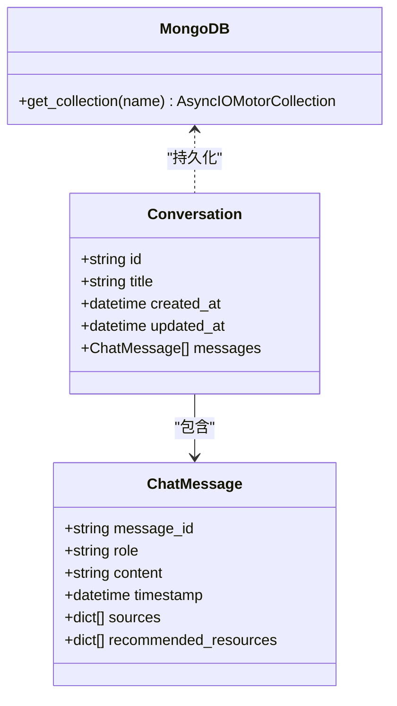

# 对话管理

<cite>
**本文引用的文件**
- [chat.py](file://routers/chat.py)
- [conversation.ts](file://web/types/conversation.ts)
- [mongodb.py](file://database/mongodb.py)
- [user.py](file://models/user.py)
- [timezone.py](file://utils/timezone.py)
</cite>

## 目录
1. [简介](#简介)
2. [项目结构](#项目结构)
3. [核心组件](#核心组件)
4. [架构总览](#架构总览)
5. [详细组件分析](#详细组件分析)
6. [依赖关系分析](#依赖关系分析)
7. [性能考量](#性能考量)
8. [故障排查指南](#故障排查指南)
9. [结论](#结论)
10. [附录](#附录)

## 简介
本文件面向后端与前端开发者，系统化梳理对话管理API的设计与实现，覆盖以下关键点：
- 对话创建接口：请求参数、响应格式与UUID生成机制
- 对话列表接口：分页参数与匿名模式下的数据持久化
- 对话详情接口：权限验证与消息序列化
- 对话更新与删除接口：完整实现与错误处理
- 请求与响应示例、错误码说明
- 匿名模式下的权限控制与数据持久化策略

## 项目结构
对话管理API位于FastAPI路由模块中，采用“按功能域划分”的组织方式：
- 路由层：集中定义HTTP接口与请求/响应模型
- 数据层：MongoDB异步客户端封装，提供集合访问
- 模型层：用户与对话的数据结构定义
- 工具层：统一时区与时钟工具

图表来源
- [chat.py](file://routers/chat.py)
- [mongodb.py](file://database/mongodb.py)
- [conversation.ts](file://web/types/conversation.ts)
- [user.py](file://models/user.py)
- [timezone.py](file://utils/timezone.py)

章节来源
- [chat.py](file://routers/chat.py)
- [mongodb.py](file://database/mongodb.py)
- [conversation.ts](file://web/types/conversation.ts)
- [user.py](file://models/user.py)
- [timezone.py](file://utils/timezone.py)

## 核心组件
- 对话路由与模型
  - 路由：集中于[routers/chat.py](file://routers/chat.py)，包含创建、列表、详情、消息增删改、删除等接口
  - 模型：Pydantic模型定义请求/响应结构，如对话创建、对话更新、消息添加等
- 数据存储
  - MongoDB：通过[mongodb.py](file://database/mongodb.py)提供的异步客户端访问集合“conversations”
- 时间与时区
  - 统一使用北京时间（UTC+8），通过[utils/timezone.py](file://utils/timezone.py)提供当前时间与转换工具
- 前端类型
  - 对话类型定义见[web/types/conversation.ts](file://web/types/conversation.ts)，用于前端交互与类型约束

章节来源
- [chat.py](file://routers/chat.py)
- [mongodb.py](file://database/mongodb.py)
- [conversation.ts](file://web/types/conversation.ts)
- [timezone.py](file://utils/timezone.py)

## 架构总览
对话管理API采用“路由-模型-存储-工具”的分层设计，请求经路由进入，使用Pydantic模型进行参数校验与序列化，随后通过MongoDB异步客户端进行数据持久化，并在必要处调用时区工具保证时间一致性。

图表来源
- [chat.py](file://routers/chat.py)
- [mongodb.py](file://database/mongodb.py)
- [timezone.py](file://utils/timezone.py)

## 详细组件分析

### 对话创建接口 /conversations
- 请求方法与路径
  - 方法：POST
  - 路径：/conversations
- 请求体模型
  - 字段：title（可选）、user_id（可选）、assistant_id（可选）
  - 说明：匿名模式下user_id为空；若未提供assistant_id，将尝试获取默认助手
- UUID生成机制
  - 使用标准库uuid生成全局唯一标识，作为对话主键存入集合
- 响应格式
  - 字段：id、title、assistant_id、created_at、updated_at
  - 时间字段为ISO 8601字符串
- 默认助手逻辑
  - 若未显式提供assistant_id，将查询“course_assistants”集合并取“is_default”为true的助手ID
- 异常处理
  - 服务端异常统一包装为HTTP 500并返回错误详情

图表来源
- [chat.py](file://routers/chat.py)

章节来源
- [chat.py](file://routers/chat.py)

### 对话列表接口 /conversations
- 请求方法与路径
  - 方法：GET
  - 路径：/conversations
- 分页参数
  - skip：跳过记录数（默认0）
  - limit：限制返回条数（默认100）
- 响应格式
  - 字段：conversations（数组，每项含id、user_id、title、message_count、assistant_id、created_at、updated_at）、total、skip、limit
- 权限控制
  - 当前实现未对user_id进行过滤，即匿名模式下返回所有对话
  - 若需按用户过滤，应在查询条件中加入user_id筛选
- 性能与排序
  - 按updated_at降序排序，配合skip/limit实现分页

图表来源
- [chat.py](file://routers/chat.py)

章节来源
- [chat.py](file://routers/chat.py)

### 对话详情接口 /conversations/{conversation_id}
- 请求方法与路径
  - 方法：GET
  - 路径：/conversations/{conversation_id}
- 响应格式
  - 字段：id、user_id、title、assistant_id、messages（数组）、created_at、updated_at
  - messages中的每条消息包含：message_id、role、content、timestamp、sources、recommended_resources
- 权限验证
  - 当前实现未做用户绑定校验，匿名模式下可读取任意对话
  - 如需限制为“仅本人可见”，应在查询前增加user_id匹配
- 消息序列化
  - 消息字段完整保留，时间戳统一为ISO 8601字符串

图表来源
- [chat.py](file://routers/chat.py)

章节来源
- [chat.py](file://routers/chat.py)

### 对话更新接口 /conversations/{conversation_id}
- 请求方法与路径
  - 方法：PUT
  - 路径：/conversations/{conversation_id}
- 请求体模型
  - 字段：title（可选）
- 行为说明
  - 仅更新title与updated_at；若title为None则仅更新时间
- 响应格式
  - 字段：id、title、created_at、updated_at
- 错误处理
  - 对话不存在时返回HTTP 404
  - 其他异常返回HTTP 500

图表来源
- [chat.py](file://routers/chat.py)

章节来源
- [chat.py](file://routers/chat.py)

### 对话删除接口 /conversations/{conversation_id}
- 请求方法与路径
  - 方法：DELETE
  - 路径：/conversations/{conversation_id}
- 行为说明
  - 删除指定对话
- 响应格式
  - 字段：success、message
- 错误处理
  - 对话不存在时返回HTTP 404
  - 其他异常返回HTTP 500

图表来源
- [chat.py](file://routers/chat.py)

章节来源
- [chat.py](file://routers/chat.py)

### 消息管理与标题生成
- 添加消息 /conversations/{conversation_id}/messages
  - 请求体：role、content、sources（可选）、recommended_resources（可选）
  - 行为：为消息生成message_id（UUID），追加到messages数组，并更新updated_at
  - 助手回复触发：当消息role为assistant且标题为默认值时，异步后台任务尝试生成新标题
- 编辑消息 /conversations/{conversation_id}/messages/{message_id}
  - 仅允许编辑role为"user"的消息
  - 更新content与timestamp
- 重新生成回答 /conversations/{conversation_id}/messages/{message_id}/regenerate
  - 删除该消息及其之后的所有消息（包括对应助手回复），保留之前的完整历史
- 时间与时区
  - 所有时间均使用北京时间（UTC+8）

图表来源
- [chat.py](file://routers/chat.py)

章节来源
- [chat.py](file://routers/chat.py)
- [timezone.py](file://utils/timezone.py)

## 依赖关系分析
- 路由依赖
  - 路由模块依赖MongoDB异步客户端进行集合操作
  - 路由模块依赖时区工具生成统一时间
- 数据模型
  - 对话模型包含消息数组，消息对象包含message_id、role、content、timestamp、sources、recommended_resources
- 前端类型
  - 前端对话类型与后端响应字段保持一致，便于类型安全

图表来源
- [chat.py](file://routers/chat.py)
- [mongodb.py](file://database/mongodb.py)
- [conversation.ts](file://web/types/conversation.ts)

章节来源
- [chat.py](file://routers/chat.py)
- [mongodb.py](file://database/mongodb.py)
- [conversation.ts](file://web/types/conversation.ts)

## 性能考量
- 分页与排序
  - 列表接口按updated_at降序排序并结合skip/limit，适合大数据量场景
- 异步访问
  - 使用AsyncIOMotorClient进行非阻塞数据库操作
- 后台任务
  - 标题生成通过异步任务执行，避免阻塞请求响应
- 时间一致性
  - 统一使用北京时间，减少跨时区带来的复杂性

[本节为通用指导，无需特定文件引用]

## 故障排查指南
- 常见错误与定位
  - 404 对话不存在：通常发生在详情、更新、删除、消息编辑、重新生成等接口
  - 500 服务端异常：数据库写入失败、默认助手查询异常、标题生成异常等
- 日志与追踪
  - 路由层使用统一logger记录请求与异常堆栈，便于定位问题
- 建议排查步骤
  - 确认请求路径与参数是否符合模型定义
  - 检查MongoDB连接与集合是否存在
  - 核对默认助手配置与生成标题的后台任务状态

章节来源
- [chat.py](file://routers/chat.py)

## 结论
对话管理API以清晰的分层设计实现了从创建、列表、详情到消息管理的完整闭环。当前实现强调匿名模式下的易用性与可扩展性，后续可在权限控制与用户绑定方面进一步完善，以满足更严格的访问控制需求。

[本节为总结性内容，无需特定文件引用]

## 附录

### 请求与响应示例（基于接口定义）
- 创建对话
  - 请求：POST /conversations
  - 请求体：{ "title": "示例标题", "assistant_id": "可选助手ID" }
  - 响应：{ "id": "UUID", "title": "示例标题", "assistant_id": "助手ID", "created_at": "ISO时间", "updated_at": "ISO时间" }
- 列表对话
  - 请求：GET /conversations?skip=0&limit=100
  - 响应：{ "conversations": [{ "id": "UUID", "user_id": "可选", "title": "标题", "message_count": 0, "assistant_id": "助手ID", "created_at": "ISO时间", "updated_at": "ISO时间" }], "total": 0, "skip": 0, "limit": 100 }
- 获取对话详情
  - 请求：GET /conversations/{conversation_id}
  - 响应：{ "id": "UUID", "user_id": "可选", "title": "标题", "assistant_id": "助手ID", "messages": [{ "message_id": "UUID", "role": "user|assistant", "content": "内容", "timestamp": "ISO时间", "sources": [], "recommended_resources": [] }], "created_at": "ISO时间", "updated_at": "ISO时间" }
- 更新对话
  - 请求：PUT /conversations/{conversation_id} { "title": "新标题" }
  - 响应：{ "id": "UUID", "title": "新标题", "created_at": "ISO时间", "updated_at": "ISO时间" }
- 删除对话
  - 请求：DELETE /conversations/{conversation_id}
  - 响应：{ "success": true, "message": "对话已删除" }
- 添加消息
  - 请求：POST /conversations/{conversation_id}/messages { "role": "user|assistant", "content": "内容", "sources": [], "recommended_resources": [] }
  - 响应：{ "success": true, "message": "消息已添加", "timestamp": "ISO时间" }
- 编辑消息
  - 请求：PUT /conversations/{conversation_id}/messages/{message_id} { "content": "新内容" }
  - 响应：{ "success": true, "message": "消息已更新", "message_id": "UUID", "timestamp": "ISO时间" }
- 重新生成回答
  - 请求：POST /conversations/{conversation_id}/messages/{message_id}/regenerate
  - 响应：{ "success": true, "message": "后续消息已删除，可以重新生成回答", "message_id": "UUID", "remaining_messages": 0 }

章节来源
- [chat.py](file://routers/chat.py)
- [conversation.ts](file://web/types/conversation.ts)