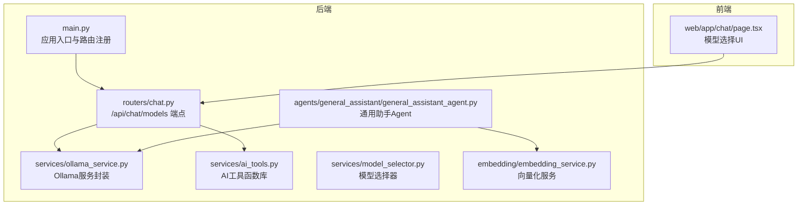
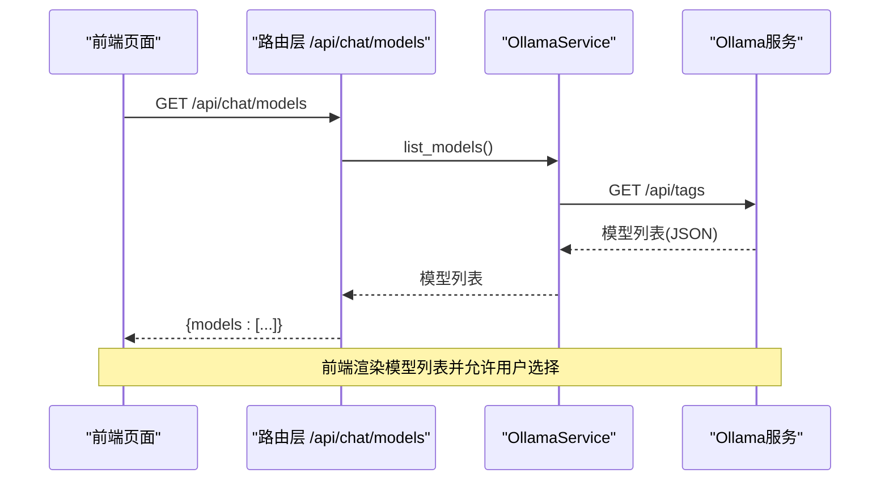
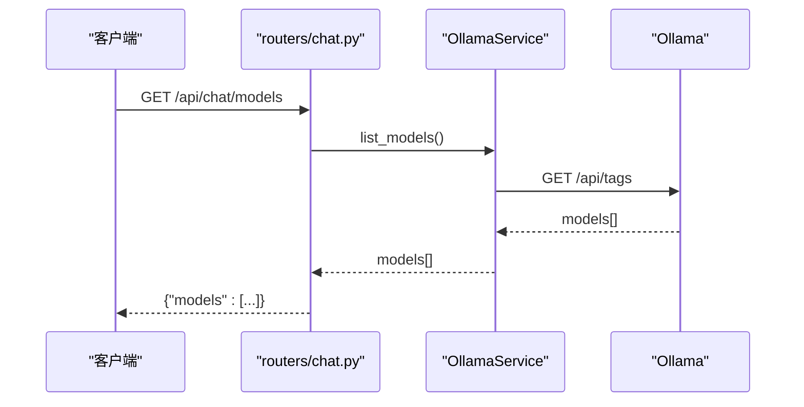
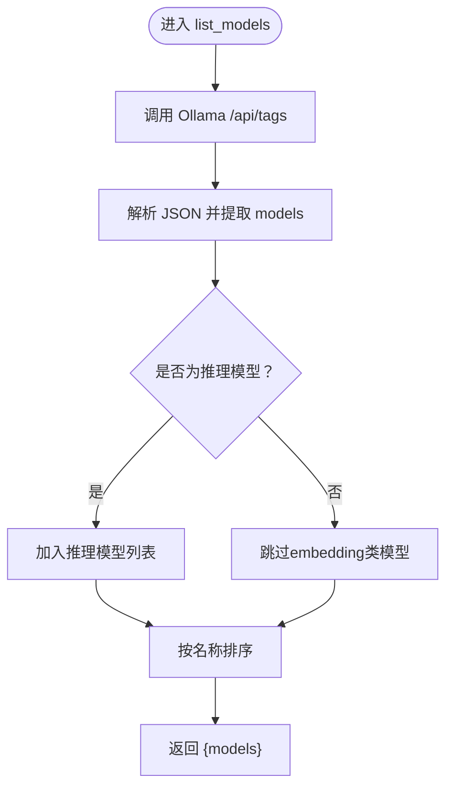
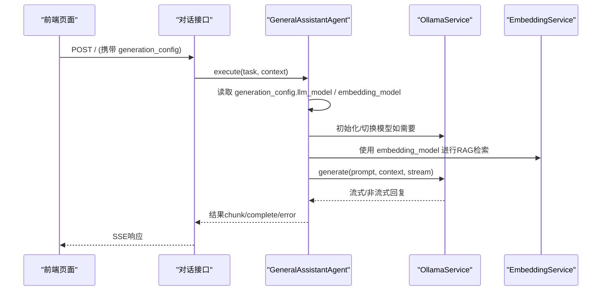
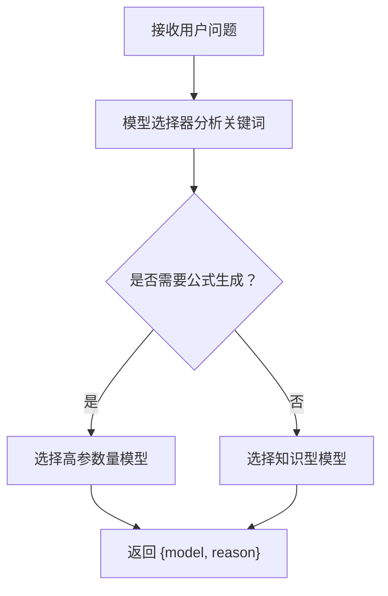
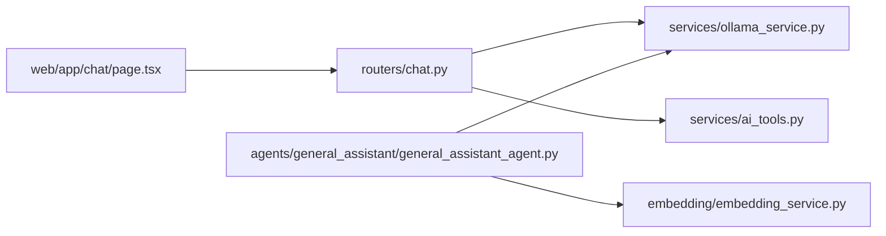

# 模型管理

<cite>
**本文引用的文件**
- [main.py](file://main.py)
- [routers/chat.py](file://routers/chat.py)
- [services/ollama_service.py](file://services/ollama_service.py)
- [services/ai_tools.py](file://services/ai_tools.py)
- [services/model_selector.py](file://services/model_selector.py)
- [embedding/embedding_service.py](file://embedding/embedding_service.py)
- [agents/general_assistant/general_assistant_agent.py](file://agents/general_assistant/general_assistant_agent.py)
- [web/app/chat/page.tsx](file://web/app/chat/page.tsx)
</cite>

## 目录
1. [简介](#简介)
2. [项目结构](#项目结构)
3. [核心组件](#核心组件)
4. [架构总览](#架构总览)
5. [详细组件分析](#详细组件分析)
6. [依赖关系分析](#依赖关系分析)
7. [性能考量](#性能考量)
8. [故障排查指南](#故障排查指南)
9. [结论](#结论)
10. [附录](#附录)

## 简介
本章节面向模型管理API，重点说明获取可用模型列表接口（/api/chat/models）的实现原理、与Ollama服务的集成方式、模型信息格式，以及generation_config参数的使用方法（llm_model与embedding_model的选择）。文档还涵盖模型配置的最佳实践、性能考虑、版本兼容性说明、请求与响应示例、错误处理策略，以及模型切换对对话质量与性能的影响。

## 项目结构
模型管理API位于后端FastAPI应用中，主要涉及以下模块：
- 路由层：负责对外暴露REST接口，解析请求参数并调用服务层
- 服务层：封装Ollama服务、AI工具集、模型选择器、向量化服务
- 代理层：通用助手Agent负责整合RAG检索与LLM生成
- 前端页面：提供模型选择UI，展示可用模型并支持手动切换

图表来源
- [main.py:91](file://main.py#L91)
- [routers/chat.py:84](file://routers/chat.py#L84)
- [services/ollama_service.py:9](file://services/ollama_service.py#L9)
- [services/ai_tools.py:10](file://services/ai_tools.py#L10)
- [services/model_selector.py:10](file://services/model_selector.py#L10)
- [embedding/embedding_service.py:8](file://embedding/embedding_service.py#L8)
- [agents/general_assistant/general_assistant_agent.py:9](file://agents/general_assistant/general_assistant_agent.py#L9)
- [web/app/chat/page.tsx](file://web/app/chat/page.tsx)

章节来源
- [main.py:91](file://main.py#L91)
- [routers/chat.py:84](file://routers/chat.py#L84)

## 核心组件
- 模型列表接口：/api/chat/models，返回Ollama可用的推理模型列表
- Ollama服务：统一管理Ollama连接、模型列表、生成与嵌入调用
- AI工具：提供获取可用模型列表、系统信息、知识库统计等工具函数
- 模型选择器：根据问题特征智能选择LLM模型
- 向量化服务：负责embedding模型的检测与文本向量化
- 通用助手Agent：在对话流程中使用generation_config中的llm_model与embedding_model

章节来源
- [routers/chat.py:84](file://routers/chat.py#L84)
- [services/ollama_service.py:36](file://services/ollama_service.py#L36)
- [services/ai_tools.py:145](file://services/ai_tools.py#L145)
- [services/model_selector.py:10](file://services/model_selector.py#L10)
- [embedding/embedding_service.py:8](file://embedding/embedding_service.py#L8)
- [agents/general_assistant/general_assistant_agent.py:77](file://agents/general_assistant/general_assistant_agent.py#L77)

## 架构总览
模型管理API的调用链路如下：
- 前端调用 /api/chat/models 获取可用模型
- 后端路由层调用OllamaService.list_models
- OllamaService通过HTTP请求访问Ollama /api/tags，解析并返回模型列表
- 前端将模型列表渲染到UI，允许用户选择llm_model与embedding_model
- 在对话请求中，generation_config携带所选模型，Agent在执行时使用对应模型

图表来源
- [routers/chat.py:84](file://routers/chat.py#L84)
- [services/ollama_service.py:36](file://services/ollama_service.py#L36)

## 详细组件分析

### 组件A：模型列表接口（/api/chat/models）
- 路径：/api/chat/models
- 方法：GET
- 功能：返回当前Ollama可用的推理模型列表
- 实现要点：
  - 路由层调用OllamaService.list_models
  - OllamaService通过HTTP请求访问Ollama /api/tags
  - 返回格式：{"models": [...]}
- 错误处理：
  - 异常捕获并抛出HTTP 500
- 前端集成：
  - 前端页面会拉取该列表并渲染下拉框，支持自动选择与手动选择

图表来源
- [routers/chat.py:84](file://routers/chat.py#L84)
- [services/ollama_service.py:36](file://services/ollama_service.py#L36)

章节来源
- [routers/chat.py:84](file://routers/chat.py#L84)
- [services/ollama_service.py:36](file://services/ollama_service.py#L36)

### 组件B：Ollama服务集成与模型信息格式
- OllamaService.list_models：
  - 通过Session访问Ollama /api/tags
  - 返回数据结构包含models数组，每个元素为模型对象
- 模型信息格式（示例结构）：
  - name：模型名称（如gemmasource、gemma3:1b等）
  - modified_at：模型最后修改时间
  - size：模型大小（字节）
- 过滤规则（工具函数侧）：
  - AI工具函数在返回推理模型列表时会过滤掉包含“embedding”、“bge”、“multilingual”等关键词的模型，确保仅返回推理模型

图表来源
- [services/ollama_service.py:36](file://services/ollama_service.py#L36)
- [services/ai_tools.py:169](file://services/ai_tools.py#L169)

章节来源
- [services/ollama_service.py:36](file://services/ollama_service.py#L36)
- [services/ai_tools.py:169](file://services/ai_tools.py#L169)

### 组件C：generation_config参数与模型选择
- generation_config位置：
  - 对话请求体 ChatRequest.generation_config（普通对话）
  - 深度研究请求体 DeepResearchRequest.generation_config（深度研究）
- 字段说明：
  - llm_model：推理模型名称（覆盖默认或自动选择）
  - embedding_model：向量化模型名称（影响RAG检索阶段的向量化）
- 使用方式：
  - Agent在执行时读取generation_config，若提供则使用指定模型
  - 若未提供，Agent会通过模型选择器进行智能选择
- 前端交互：
  - 前端页面提供两个下拉框分别选择LLM与Embedding模型，并将所选值放入generation_config

图表来源
- [routers/chat.py:64](file://routers/chat.py#L64)
- [routers/chat.py:75](file://routers/chat.py#L75)
- [agents/general_assistant/general_assistant_agent.py:77](file://agents/general_assistant/general_assistant_agent.py#L77)
- [agents/general_assistant/general_assistant_agent.py:127](file://agents/general_assistant/general_assistant_agent.py#L127)
- [embedding/embedding_service.py:8](file://embedding/embedding_service.py#L8)

章节来源
- [routers/chat.py:64](file://routers/chat.py#L64)
- [routers/chat.py:75](file://routers/chat.py#L75)
- [agents/general_assistant/general_assistant_agent.py:77](file://agents/general_assistant/general_assistant_agent.py#L77)
- [agents/general_assistant/general_assistant_agent.py:127](file://agents/general_assistant/general_assistant_agent.py#L127)
- [web/app/chat/page.tsx](file://web/app/chat/page.tsx)

### 组件D：模型选择器与智能切换
- 模型选择器：
  - 根据问题关键词判断是否需要公式生成，从而决定使用高参数量模型或轻量模型
  - 支持通过环境变量配置不同场景下的默认模型
- Agent中的切换逻辑：
  - 若Agent未固定模型，将在执行时调用模型选择器
  - 若最终选择的模型与当前OllamaService实例不同，会重新初始化以切换模型

图表来源
- [services/model_selector.py:10](file://services/model_selector.py#L10)
- [services/model_selector.py:168](file://services/model_selector.py#L168)
- [agents/general_assistant/general_assistant_agent.py:80](file://agents/general_assistant/general_assistant_agent.py#L80)

章节来源
- [services/model_selector.py:10](file://services/model_selector.py#L10)
- [services/model_selector.py:168](file://services/model_selector.py#L168)
- [agents/general_assistant/general_assistant_agent.py:80](file://agents/general_assistant/general_assistant_agent.py#L80)

### 组件E：向量化服务与embedding_model
- 自动检测：
  - 若未显式配置embedding_model，向量化服务会自动扫描Ollama模型列表，优先匹配包含“embedding”、“nomic-embed”、“all-minilm”、“bge”等关键词的模型
- 模型规范化：
  - 当环境变量提供模型名时，会尝试匹配实际存在的模型名称（含标签），确保调用正确
- 超时与重试：
  - 嵌入请求具备超时与递增重试机制，提升稳定性

章节来源
- [embedding/embedding_service.py:107](file://embedding/embedding_service.py#L107)
- [embedding/embedding_service.py:175](file://embedding/embedding_service.py#L175)

## 依赖关系分析
- 路由层依赖服务层：/api/chat/models依赖OllamaService
- Agent层依赖服务层：Agent在执行时依赖OllamaService与EmbeddingService
- 前端依赖后端：前端页面通过API获取模型列表并渲染

图表来源
- [routers/chat.py:84](file://routers/chat.py#L84)
- [services/ollama_service.py:9](file://services/ollama_service.py#L9)
- [services/ai_tools.py:10](file://services/ai_tools.py#L10)
- [agents/general_assistant/general_assistant_agent.py:9](file://agents/general_assistant/general_assistant_agent.py#L9)
- [embedding/embedding_service.py:8](file://embedding/embedding_service.py#L8)
- [web/app/chat/page.tsx](file://web/app/chat/page.tsx)

章节来源
- [routers/chat.py:84](file://routers/chat.py#L84)
- [agents/general_assistant/general_assistant_agent.py:9](file://agents/general_assistant/general_assistant_agent.py#L9)

## 性能考量
- 超时与并发：
  - OllamaService默认超时较长（秒级），适合大模型生成
  - 前端采用SSE流式输出，支持客户端断开检测，避免无效资源占用
- 模型选择：
  - 对于简单知识问答，使用轻量模型可显著降低延迟
  - 公式/物理类问题建议使用高参数量模型，提高准确性
- 向量化：
  - 合理选择embedding_model可提升检索召回率；注意模型大小与向量维度
- 环境变量：
  - 通过环境变量控制OLLAMA_BASE_URL、OLLAMA_MODEL、OLLAMA_TIMEOUT等，便于在不同部署环境下优化性能

章节来源
- [services/ollama_service.py:32](file://services/ollama_service.py#L32)
- [routers/chat.py:735](file://routers/chat.py#L735)
- [services/model_selector.py:21](file://services/model_selector.py#L21)

## 故障排查指南
- 获取模型列表失败：
  - 检查Ollama服务可达性与端口配置
  - 查看后端日志中的异常堆栈
- 模型名称不匹配：
  - 确认Ollama中是否存在目标模型；必要时使用带标签的完整名称
- 嵌入向量为空或报错：
  - 确认所选模型支持embedding；检查模型是否已下载
- SSE连接中断：
  - 检查客户端网络状况；确认后端未提前关闭连接

章节来源
- [services/ollama_service.py:46](file://services/ollama_service.py#L46)
- [embedding/embedding_service.py:175](file://embedding/embedding_service.py#L175)
- [routers/chat.py:711](file://routers/chat.py#L711)

## 结论
模型管理API通过统一的模型列表接口与Ollama服务集成，为前端提供可选的推理与向量化模型。generation_config允许在对话层面灵活指定llm_model与embedding_model，配合模型选择器与Agent的智能切换，可在保证对话质量的同时兼顾性能。建议在生产环境中通过环境变量与前端UI协同配置，实现稳定高效的模型管理。

## 附录

### 请求与响应示例
- 获取模型列表
  - 请求：GET /api/chat/models
  - 成功响应：{"models": [{"name": "...", "size": ..., "modified_at": "..."}, ...]}
  - 失败响应：HTTP 500，{"detail": "..."}
- 对话请求（携带generation_config）
  - 请求体示例：{"query": "...", "assistant_id": "...", "generation_config": {"llm_model": "...", "embedding_model": "..."}}
  - 响应：SSE流式输出，包含content、done、sources、recommended_resources等字段

章节来源
- [routers/chat.py:84](file://routers/chat.py#L84)
- [routers/chat.py:64](file://routers/chat.py#L64)
- [routers/chat.py:735](file://routers/chat.py#L735)