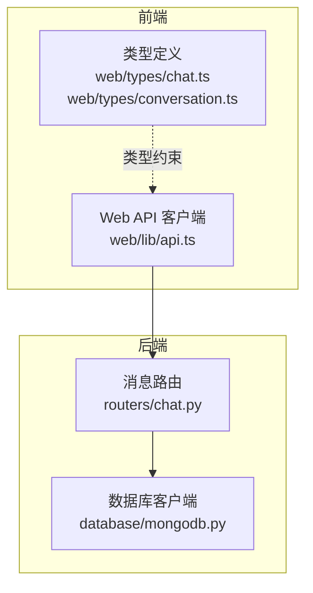
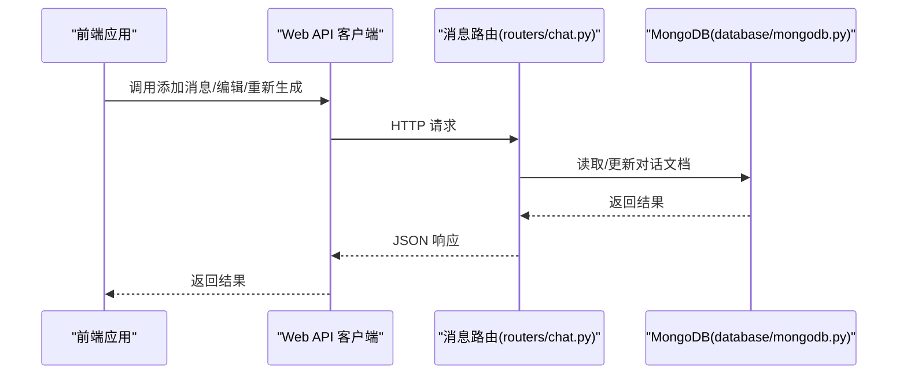

# 消息管理

<cite>
**本文引用的文件**
- [chat.py](file://routers/chat.py)
- [api.ts](file://web/lib/api.ts)
- [chat.ts](file://web/types/chat.ts)
- [conversation.ts](file://web/types/conversation.ts)
- [mongodb.py](file://database/mongodb.py)
</cite>

## 目录
1. [简介](#简介)
2. [项目结构](#项目结构)
3. [核心组件](#核心组件)
4. [架构总览](#架构总览)
5. [详细组件分析](#详细组件分析)
6. [依赖分析](#依赖分析)
7. [性能考虑](#性能考虑)
8. [故障排查指南](#故障排查指南)
9. [结论](#结论)

## 简介
本文件聚焦于消息管理API，覆盖以下关键能力：
- 添加消息接口：/api/chat/conversations/{conversation_id}/messages
- 消息编辑接口：/api/chat/conversations/{conversation_id}/messages/{message_id}
- 重新生成回答接口：/api/chat/conversations/{conversation_id}/messages/{message_id}/regenerate
- 消息模型定义、消息ID生成机制、时间戳处理、消息来源追踪等实现细节
- 请求与响应示例、错误处理说明

## 项目结构
消息管理API位于后端FastAPI路由模块中，前端通过独立的API客户端进行调用，消息模型在前端类型定义中体现。

图表来源
- [chat.py](file://routers/chat.py)
- [api.ts](file://web/lib/api.ts)
- [chat.ts](file://web/types/chat.ts)
- [conversation.ts](file://web/types/conversation.ts)
- [mongodb.py](file://database/mongodb.py)

章节来源
- [chat.py](file://routers/chat.py)
- [api.ts](file://web/lib/api.ts)
- [chat.ts](file://web/types/chat.ts)
- [conversation.ts](file://web/types/conversation.ts)
- [mongodb.py](file://database/mongodb.py)

## 核心组件
- 消息模型与请求体
  - 添加消息请求体：role、content、sources、recommended_resources
  - 编辑消息请求体：content
  - 响应体：success、message、timestamp（添加/编辑）、remaining_messages（重新生成）
- 消息ID生成机制
  - 每条消息在写入时生成唯一message_id（UUID v4）
- 时间戳处理
  - 添加消息：timestamp为添加时的北京时间
  - 编辑消息：更新content的同时更新timestamp为当前北京时间
  - 对话更新：更新updated_at为UTC时间
- 权限与规则
  - 编辑接口仅允许编辑用户消息（role=user），助手消息不可编辑
  - 重新生成接口仅允许对用户消息触发，删除其后的所有消息（含对应助手回复）

章节来源
- [chat.py](file://routers/chat.py)
- [chat.ts](file://web/types/chat.ts)

## 架构总览
消息管理涉及三层交互：前端API客户端、后端路由层、数据库层。

图表来源
- [chat.py](file://routers/chat.py)
- [api.ts](file://web/lib/api.ts)
- [mongodb.py](file://database/mongodb.py)

## 详细组件分析

### 添加消息接口
- 路径：/api/chat/conversations/{conversation_id}/messages
- 方法：POST
- 请求体字段
  - role: "user" | "assistant"
  - content: string
  - sources: 可选数组，元素包含chunk_id、document_id、score、retrieval_type等
  - recommended_resources: 可选数组，元素包含resource_id、title、description、file_type、file_size、score等
- 行为
  - 校验对话存在性
  - 为消息生成唯一message_id（UUID v4）
  - 设置timestamp为北京时间
  - 将消息追加到对话messages数组末尾
  - 更新对话updated_at为北京时间
  - 若为assistant消息且对话标题为默认标题，异步尝试生成标题
- 响应
  - success: true
  - message: "消息已添加"
  - timestamp: 消息时间戳ISO字符串

请求示例（JSON）
- POST /api/chat/conversations/{conversation_id}/messages
- Body:
  {
    "role": "user",
    "content": "如何使用RAG？",
    "sources": [
      {
        "chunk_id": "uuid",
        "document_id": "uuid",
        "score": 0.95,
        "retrieval_type": "semantic"
      }
    ],
    "recommended_resources": [
      {
        "resource_id": "uuid",
        "title": "RAG入门指南",
        "description": "基础概念与实践",
        "file_type": "pdf",
        "file_size": 1048576,
        "score": 0.92
      }
    ]
  }

响应示例（成功）
- Status: 200 OK
- Body:
  {
    "success": true,
    "message": "消息已添加",
    "timestamp": "2025-01-01T12:00:00+08:00"
  }

错误处理
- 对话不存在：404 Not Found
- 其他异常：500 Internal Server Error

章节来源
- [chat.py](file://routers/chat.py)

### 消息编辑接口
- 路径：/api/chat/conversations/{conversation_id}/messages/{message_id}
- 方法：PUT
- 请求体字段
  - content: string
- 行为
  - 校验对话存在性
  - 查找目标消息（基于message_id）
  - 仅允许编辑role为"user"的消息，助手消息禁止编辑
  - 更新content与timestamp（北京时间）
  - 保存更新后的消息列表，并更新对话updated_at为UTC
- 响应
  - success: true
  - message: "消息已更新"
  - message_id: 编辑的消息ID
  - timestamp: 更新后的时间戳ISO字符串

请求示例（JSON）
- PUT /api/chat/conversations/{conversation_id}/messages/{message_id}
- Body:
  {
    "content": "如何使用RAG进行问答？"
  }

响应示例（成功）
- Status: 200 OK
- Body:
  {
    "success": true,
    "message": "消息已更新",
    "message_id": "uuid",
    "timestamp": "2025-01-01T12:05:00+08:00"
  }

错误处理
- 消息不存在：404 Not Found
- 非用户消息编辑：400 Bad Request
- 对话不存在：404 Not Found
- 其他异常：500 Internal Server Error

章节来源
- [chat.py](file://routers/chat.py)

### 重新生成回答接口
- 路径：/api/chat/conversations/{conversation_id}/messages/{message_id}/regenerate
- 方法：POST
- 行为
  - 校验对话存在性
  - 查找目标消息（基于message_id）
  - 仅允许对用户消息触发重新生成（role必须为"user"）
  - 删除该用户消息及其之后的所有消息（包括该消息对应的助手回复）
  - 保存更新后的消息列表，并更新对话updated_at为UTC
- 响应
  - success: true
  - message: "后续消息已删除，可以重新生成回答"
  - message_id: 触发重新生成的消息ID
  - remaining_messages: 删除后的消息数量

请求示例（JSON）
- POST /api/chat/conversations/{conversation_id}/messages/{message_id}/regenerate

响应示例（成功）
- Status: 200 OK
- Body:
  {
    "success": true,
    "message": "后续消息已删除，可以重新生成回答",
    "message_id": "uuid",
    "remaining_messages": 3
  }

错误处理
- 消息不存在：404 Not Found
- 非用户消息触发：400 Bad Request
- 对话不存在：404 Not Found
- 其他异常：500 Internal Server Error

章节来源
- [chat.py](file://routers/chat.py)

### 消息模型与数据结构
- 后端模型（Pydantic）
  - ChatMessage：role、content、timestamp、sources、recommended_resources
  - MessageAdd：role、content、sources、recommended_resources
  - MessageUpdate：content
- 前端类型（TypeScript）
  - ChatMessage：message_id、role、content、timestamp、sources、recommended_resources、以及网络模式相关字段
  - SourceInfo、RecommendedResource等辅助类型

章节来源
- [chat.py](file://routers/chat.py)
- [chat.ts](file://web/types/chat.ts)

### 消息ID生成机制
- 生成时机：添加消息时
- 生成策略：使用UUID v4
- 存储位置：每条消息对象包含message_id字段
- 唯一性保证：由UUID库提供全局唯一性

章节来源
- [chat.py](file://routers/chat.py)

### 时间戳处理
- 添加消息：timestamp为添加时的北京时间
- 编辑消息：更新content的同时更新timestamp为当前北京时间
- 对话更新：更新updated_at为UTC时间
- 前端显示：前端类型定义中的timestamp为字符串ISO格式

章节来源
- [chat.py](file://routers/chat.py)
- [chat.ts](file://web/types/chat.ts)

### 消息来源追踪
- sources字段：包含检索到的文档来源信息，如chunk_id、document_id、score、retrieval_type等
- recommended_resources字段：包含推荐的相关资源信息，如resource_id、title、description、file_type、file_size、score等
- 前端类型：SourceInfo、RecommendedResource等类型定义

章节来源
- [chat.py](file://routers/chat.py)
- [chat.ts](file://web/types/chat.ts)

## 依赖分析
- 前端API客户端
  - 通过web/lib/api.ts封装HTTP请求，统一处理错误与响应
  - 调用后端消息管理接口
- 后端路由
  - routers/chat.py定义消息相关路由与业务逻辑
  - 依赖database/mongodb.py进行数据库读写
- 数据库
  - database/mongodb.py提供异步MongoDB客户端，负责集合操作

图表来源
- [api.ts](file://web/lib/api.ts)
- [chat.py](file://routers/chat.py)
- [mongodb.py](file://database/mongodb.py)

章节来源
- [api.ts](file://web/lib/api.ts)
- [chat.py](file://routers/chat.py)
- [mongodb.py](file://database/mongodb.py)

## 性能考虑
- 异步数据库操作：使用AsyncIOMotorClient，提升高并发下的响应性能
- 连接池配置：通过环境变量控制最大/最小连接池大小、超时参数，减少连接开销
- 流式响应：聊天接口采用SSE流式输出，前端按chunk接收，降低首屏延迟
- 后台任务：标题生成与附件处理采用后台任务，避免阻塞主请求

## 故障排查指南
常见错误与定位要点
- 404 对话不存在
  - 检查conversation_id是否正确
  - 确认对话是否已被删除
- 404 消息不存在
  - 检查message_id是否正确
  - 确认消息是否已被删除（重新生成会删除后续消息）
- 400 仅能编辑用户消息
  - 确认目标消息role为"user"
- 400 仅能重新生成用户消息对应的回答
  - 确认触发regenerate的消息为"user"角色
- 500 服务器内部错误
  - 查看后端日志，关注数据库连接、异常堆栈

章节来源
- [chat.py](file://routers/chat.py)

## 结论
消息管理API围绕三条核心接口构建：添加消息、编辑消息、重新生成回答。通过明确的角色校验、严格的权限控制与清晰的数据结构，实现了可靠的对话历史管理。消息ID采用UUID v4保证唯一性，时间戳在不同场景下分别采用北京时间与UTC，确保一致性与可追溯性。前端通过统一的API客户端与类型定义，简化了调用与集成成本。