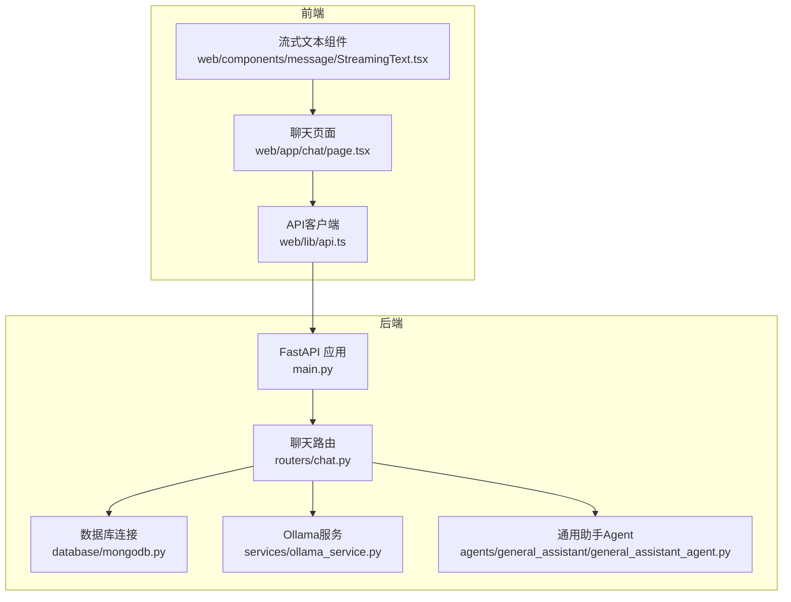
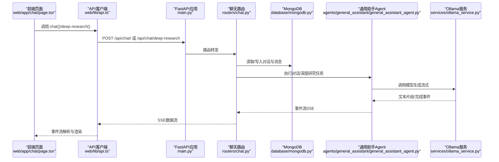
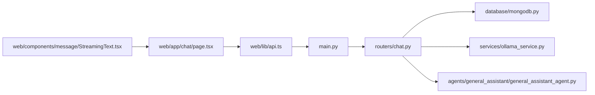

# 聊天API

<cite>
**本文引用的文件**
- [main.py](file://main.py)
- [chat.py](file://routers/chat.py)
- [mongodb.py](file://database/mongodb.py)
- [ollama_service.py](file://services/ollama_service.py)
- [general_assistant_agent.py](file://agents/general_assistant/general_assistant_agent.py)
- [api.ts](file://web/lib/api.ts)
- [chat.page.tsx](file://web/app/chat/page.tsx)
- [StreamingText.tsx](file://web/components/message/StreamingText.tsx)
- [conversation.ts](file://web/types/conversation.ts)
- [chat.ts](file://web/types/chat.ts)
</cite>

## 目录
1. [简介](#简介)
2. [项目结构](#项目结构)
3. [核心组件](#核心组件)
4. [架构总览](#架构总览)
5. [详细组件分析](#详细组件分析)
6. [依赖关系分析](#依赖关系分析)
7. [性能考虑](#性能考虑)
8. [故障排查指南](#故障排查指南)
9. [结论](#结论)
10. [附录](#附录)

## 简介
本文件面向开发者与集成方，系统化梳理聊天API的设计与实现，涵盖：
- 对话管理接口：创建、列表、详情、增删改查消息、更新对话、删除对话、重新生成回答等
- 常规对话接口与深度研究模式接口：请求参数、响应格式、流式响应实现
- 模型管理接口与可用模型列表获取
- 匿名模式下的对话权限控制与数据持久化机制
- 前端调用示例与错误处理说明

## 项目结构
后端采用FastAPI，路由集中在聊天模块，数据库使用MongoDB，模型调用通过Ollama服务，对话流程由Agent封装。

图表来源
- [main.py:91](file://main.py#L91)
- [chat.py:17](file://routers/chat.py#L17)
- [mongodb.py:199](file://database/mongodb.py#L199)
- [ollama_service.py:9](file://services/ollama_service.py#L9)
- [general_assistant_agent.py:9](file://agents/general_assistant/general_assistant_agent.py#L9)
- [api.ts:106](file://web/lib/api.ts#L106)
- [chat.page.tsx:22](file://web/app/chat/page.tsx#L22)
- [StreamingText.tsx:16](file://web/components/message/StreamingText.tsx#L16)

章节来源
- [main.py:91](file://main.py#L91)
- [chat.py:17](file://routers/chat.py#L17)
- [mongodb.py:199](file://database/mongodb.py#L199)
- [ollama_service.py:9](file://services/ollama_service.py#L9)
- [general_assistant_agent.py:9](file://agents/general_assistant/general_assistant_agent.py#L9)
- [api.ts:106](file://web/lib/api.ts#L106)
- [chat.page.tsx:22](file://web/app/chat/page.tsx#L22)
- [StreamingText.tsx:16](file://web/components/message/StreamingText.tsx#L16)

## 核心组件
- FastAPI应用与路由注册：负责CORS、静态文件、路由挂载与全局异常处理
- 聊天路由：提供对话管理与对话接口（常规/深度研究）、模型列表、附件上传与状态查询
- 数据库：MongoDB异步客户端，提供集合访问与连接池配置
- Ollama服务：封装模型列表获取与流式/非流式生成
- 通用助手Agent：封装RAG检索、提示词构建、模型调用与流式输出
- 前端API客户端：封装后端接口调用、SSE流式读取、对话状态持久化

章节来源
- [main.py:91](file://main.py#L91)
- [chat.py:84](file://routers/chat.py#L84)
- [mongodb.py:92](file://database/mongodb.py#L92)
- [ollama_service.py:36](file://services/ollama_service.py#L36)
- [general_assistant_agent.py:49](file://agents/general_assistant/general_assistant_agent.py#L49)
- [api.ts:106](file://web/lib/api.ts#L106)

## 架构总览
后端通过FastAPI暴露REST接口与SSE流式接口；前端通过API客户端发起请求，接收SSE事件流并渲染。

图表来源
- [chat.page.tsx:680](file://web/app/chat/page.tsx#L680)
- [api.ts:240](file://web/lib/api.ts#L240)
- [main.py:91](file://main.py#L91)
- [chat.py:615](file://routers/chat.py#L615)
- [general_assistant_agent.py:49](file://agents/general_assistant/general_assistant_agent.py#L49)
- [ollama_service.py:50](file://services/ollama_service.py#L50)

## 详细组件分析

### 对话管理接口
- 创建对话
  - 方法与路径：POST /api/chat/conversations
  - 请求体：title、user_id（可选）、assistant_id（可选）
  - 响应：新建对话的id、title、assistant_id、创建/更新时间
  - 匿名模式：user_id为空，对话仍可创建
- 获取对话列表
  - 方法与路径：GET /api/chat/conversations?skip=&limit=
  - 响应：对话数组（包含id、title、message_count、assistant_id、时间戳），以及total/skip/limit
  - 权限：普通用户只能看到自己的对话，管理员可见全部（当前实现未做鉴权校验）
- 获取对话详情
  - 方法与路径：GET /api/chat/conversations/{conversation_id}
  - 响应：对话详情（messages包含message_id、role、content、timestamp、sources、recommended_resources）
  - 权限：普通用户只能访问自己的对话，管理员可访问全部
- 添加消息
  - 方法与路径：POST /api/chat/conversations/{conversation_id}/messages
  - 请求体：role（user/assistant）、content、sources（可选）、recommended_resources（可选）
  - 响应：success、message、timestamp
  - 匿名模式：支持匿名对话消息添加
- 更新对话
  - 方法与路径：PUT /api/chat/conversations/{conversation_id}
  - 请求体：title（可选）
  - 响应：更新后的对话信息
  - 匿名模式：仅支持标题更新
- 删除对话
  - 方法与路径：DELETE /api/chat/conversations/{conversation_id}
  - 响应：success、message
  - 匿名模式：支持匿名对话删除
- 编辑消息
  - 方法与路径：PUT /api/chat/conversations/{conversation_id}/messages/{message_id}
  - 请求体：content
  - 响应：success、message、message_id、timestamp
  - 限制：仅允许编辑role=user的消息，不允许编辑助手回复
- 重新生成回答
  - 方法与路径：POST /api/chat/conversations/{conversation_id}/messages/{message_id}/regenerate
  - 行为：删除该用户消息及其之后的所有消息（包括对应助手回复），保留之前的完整历史
  - 响应：success、message、message_id、remaining_messages

章节来源
- [chat.py:97](file://routers/chat.py#L97)
- [chat.py:151](file://routers/chat.py#L151)
- [chat.py:195](file://routers/chat.py#L195)
- [chat.py:245](file://routers/chat.py#L245)
- [chat.py:350](file://routers/chat.py#L350)
- [chat.py:408](file://routers/chat.py#L408)
- [chat.py:452](file://routers/chat.py#L452)
- [chat.py:534](file://routers/chat.py#L534)

### 常规对话接口（/api/chat/）
- 请求参数
  - query：用户问题
  - assistant_id：助手ID（可选）
  - knowledge_space_ids：知识空间ID列表（可选，多选）
  - conversation_id：对话ID（可选）
  - enable_rag：是否启用RAG检索，默认true
  - mode：模式（normal/network，当前实现未使用）
  - generation_config：模型配置，包含llm_model、embedding_model等
- 响应格式（SSE）
  - 文本片段：{"content": "..."}
  - 完成标记：{"done": true, "sources": [...], "recommended_resources": [...]}
  - 错误：{"error": "..."}
- 流式实现
  - 通过StreamingResponse与SSE协议推送
  - 每10次yield检查一次客户端断开，避免无效输出
  - 支持客户端断开连接自动停止生成
- 对话历史
  - 若提供conversation_id，会拉取最近N轮对话作为上下文
- RAG增强
  - 通过通用助手Agent执行检索与重排，将上下文注入提示词

章节来源
- [chat.py:615](file://routers/chat.py#L615)
- [chat.py:664](file://routers/chat.py#L664)
- [chat.py:676](file://routers/chat.py#L676)
- [general_assistant_agent.py:49](file://agents/general_assistant/general_assistant_agent.py#L49)
- [ollama_service.py:50](file://services/ollama_service.py#L50)

### 深度研究模式接口（/api/chat/deep-research）
- 请求参数
  - query：用户问题
  - assistant_id：助手ID（可选）
  - conversation_id：对话ID（可选）
  - enabled_agents：启用的专家Agent列表（可选）
  - generation_config：模型配置（可包含sub_agent_config）
- 响应格式（SSE）
  - planning：{"type": "planning", "content": "..."}
  - agent_result：{"type": "agent_result", "agent_type": "...", "content": "..."}
  - html：{"type": "html", "content": "..."}（最终HTML结果）
  - done：{"done": true}
  - error：{"error": "..."}
- 流式实现
  - 与常规对话类似，支持断开检测与错误处理
  - 最终聚合为HTML并返回
- 对话历史
  - 若提供conversation_id，会拉取最近N轮对话作为上下文

章节来源
- [chat.py:753](file://routers/chat.py#L753)
- [chat.py:799](file://routers/chat.py#L799)
- [chat.py:808](file://routers/chat.py#L808)

### 模型管理接口（/api/chat/models）
- 获取可用模型列表
  - 方法与路径：GET /api/chat/models
  - 响应：{"models": [...]}
  - 实现：调用OllamaService.list_models()

章节来源
- [chat.py:84](file://routers/chat.py#L84)
- [ollama_service.py:36](file://services/ollama_service.py#L36)

### 对话附件上传与状态查询
- 上传附件
  - 方法与路径：POST /api/chat/conversation-attachment
  - 参数：conversation_id、knowledge_space_id、file（multipart/form-data）
  - 响应：file_id、document_id、status、message
- 获取附件状态
  - 方法与路径：GET /api/chat/conversation-attachment/{conversation_id}/{file_id}/status
  - 响应：状态与进度（processing/parsing/chunking/embedding/completed/failed）

章节来源
- [chat.py:1096](file://routers/chat.py#L1096)
- [chat.py:1252](file://routers/chat.py#L1252)

### 匿名模式下的权限与数据持久化
- 权限控制
  - 对话创建、消息添加、更新、删除、重新生成均支持匿名模式
  - 当前路由层未做用户鉴权校验，普通用户仅能访问自己的对话（见列表/详情注释）
- 数据持久化
  - 使用MongoDB集合“conversations”存储对话与消息
  - 消息包含message_id、role、content、timestamp、sources、recommended_resources
  - 对话包含assistant_id、user_id（匿名模式为空）、title、created_at、updated_at

章节来源
- [chat.py:97](file://routers/chat.py#L97)
- [chat.py:195](file://routers/chat.py#L195)
- [mongodb.py:199](file://database/mongodb.py#L199)

### 前端调用与流式渲染
- API客户端
  - 提供chat()与deepResearchChat()方法，返回ReadableStream
  - 支持AbortController中断生成
- 流式渲染
  - StreamingText组件接收增量文本，平滑更新显示并触发滚动
  - 聊天页面维护消息列表、加载步骤、对话ID等状态
- 状态持久化
  - 本地存储保存流式生成期间的状态，页面切换或刷新后可恢复

章节来源
- [api.ts:240](file://web/lib/api.ts#L240)
- [api.ts:265](file://web/lib/api.ts#L265)
- [StreamingText.tsx:16](file://web/components/message/StreamingText.tsx#L16)
- [chat.page.tsx:448](file://web/app/chat/page.tsx#L448)

## 依赖关系分析

图表来源
- [api.ts:106](file://web/lib/api.ts#L106)
- [main.py:91](file://main.py#L91)
- [chat.py:17](file://routers/chat.py#L17)
- [mongodb.py:199](file://database/mongodb.py#L199)
- [ollama_service.py:9](file://services/ollama_service.py#L9)
- [general_assistant_agent.py:9](file://agents/general_assistant/general_assistant_agent.py#L9)
- [chat.page.tsx:22](file://web/app/chat/page.tsx#L22)
- [StreamingText.tsx:16](file://web/components/message/StreamingText.tsx#L16)

章节来源
- [api.ts:106](file://web/lib/api.ts#L106)
- [main.py:91](file://main.py#L91)
- [chat.py:17](file://routers/chat.py#L17)
- [mongodb.py:199](file://database/mongodb.py#L199)
- [ollama_service.py:9](file://services/ollama_service.py#L9)
- [general_assistant_agent.py:9](file://agents/general_assistant/general_assistant_agent.py#L9)
- [chat.page.tsx:22](file://web/app/chat/page.tsx#L22)
- [StreamingText.tsx:16](file://web/components/message/StreamingText.tsx#L16)

## 性能考虑
- 连接池与超时
  - MongoDB连接池参数可配置，建议根据并发与硬件调整
  - Ollama流式请求超时较长（默认600秒），适合大模型生成
- 流式输出节流
  - SSE每10次yield检查一次客户端断开，降低CPU占用
- 前端渲染优化
  - StreamingText组件仅在文本增长时更新，减少重渲染
- 检索与生成分离
  - RAG检索与模型生成解耦，便于独立优化

[本节为通用指导，不直接分析具体文件]

## 故障排查指南
- 500内部错误
  - 全局异常处理器捕获未处理异常并返回JSON
- MongoDB连接失败
  - 检查MONGODB_URI/MONGODB_HOST等环境变量
  - 确认MongoDB服务可达与认证配置正确
- Ollama服务不可达
  - 检查OLLAMA_BASE_URL与模型可用性
  - 关注流式请求超时（默认600秒）
- SSE断开
  - 客户端断开将触发停止生成，属预期行为
- 权限问题
  - 当前路由未做鉴权校验，若需限制访问，请在路由层增加鉴权逻辑

章节来源
- [main.py:109](file://main.py#L109)
- [mongodb.py:168](file://database/mongodb.py#L168)
- [ollama_service.py:453](file://services/ollama_service.py#L453)
- [chat.py:684](file://routers/chat.py#L684)

## 结论
本聊天API以FastAPI为核心，结合MongoDB与Ollama，提供完整的对话管理与流式生成能力。接口设计清晰，支持匿名模式与深度研究模式，具备良好的扩展性。建议在生产环境中完善鉴权与监控，并根据业务规模调优数据库与模型服务配置。

[本节为总结性内容，不直接分析具体文件]

## 附录

### 接口一览与示例（路径引用）
- 对话管理
  - 创建对话：POST /api/chat/conversations
    - 示例请求体：{"title": "新对话", "assistant_id": "xxx"}
    - 示例响应：{"id": "...", "title": "...", "assistant_id": "...", "created_at": "...", "updated_at": "..."}
  - 获取对话列表：GET /api/chat/conversations?skip=0&limit=100
    - 示例响应：{"conversations": [...], "total": 0, "skip": 0, "limit": 100}
  - 获取对话详情：GET /api/chat/conversations/{conversation_id}
    - 示例响应：包含messages数组，每个消息含message_id、role、content、timestamp、sources、recommended_resources
  - 添加消息：POST /api/chat/conversations/{conversation_id}/messages
    - 示例请求体：{"role": "user", "content": "你好", "sources": [], "recommended_resources": []}
    - 示例响应：{"success": true, "message": "消息已添加", "timestamp": "..."}
  - 更新对话：PUT /api/chat/conversations/{conversation_id}
    - 示例请求体：{"title": "新标题"}
    - 示例响应：更新后的对话信息
  - 删除对话：DELETE /api/chat/conversations/{conversation_id}
    - 示例响应：{"success": true, "message": "对话已删除"}
  - 编辑消息：PUT /api/chat/conversations/{conversation_id}/messages/{message_id}
    - 示例请求体：{"content": "修改后的内容"}
    - 示例响应：{"success": true, "message": "消息已更新", "message_id": "...", "timestamp": "..."}
  - 重新生成回答：POST /api/chat/conversations/{conversation_id}/messages/{message_id}/regenerate
    - 示例响应：{"success": true, "message": "...", "message_id": "...", "remaining_messages": 0}

- 常规对话
  - POST /api/chat/
    - 请求体示例：{"query": "问题", "conversation_id": "...", "assistant_id": "...", "knowledge_space_ids": [...], "enable_rag": true, "generation_config": {"llm_model": "...", "embedding_model": "..."}}
    - 响应：SSE文本片段，最后发送{"done": true, "sources": [...], "recommended_resources": [...]}

- 深度研究模式
  - POST /api/chat/deep-research
    - 请求体示例：{"query": "问题", "conversation_id": "...", "assistant_id": "...", "enabled_agents": [...], "generation_config": {"llm_model": "...", "embedding_model": "..."}}
    - 响应：SSE事件序列，最终发送{"type": "html", "content": "..."}与{"done": true}

- 模型管理
  - GET /api/chat/models
    - 响应：{"models": [{"name": "...", "details": {...}}, ...]}

章节来源
- [chat.py:97](file://routers/chat.py#L97)
- [chat.py:151](file://routers/chat.py#L151)
- [chat.py:195](file://routers/chat.py#L195)
- [chat.py:245](file://routers/chat.py#L245)
- [chat.py:350](file://routers/chat.py#L350)
- [chat.py:408](file://routers/chat.py#L408)
- [chat.py:452](file://routers/chat.py#L452)
- [chat.py:534](file://routers/chat.py#L534)
- [chat.py:615](file://routers/chat.py#L615)
- [chat.py:753](file://routers/chat.py#L753)
- [chat.py:84](file://routers/chat.py#L84)

### 数据模型（前端类型）
- 对话模型（Conversation）
  - 字段：id、user_id（可选）、title、createdAt、updatedAt、message_count（可选）
- 聊天消息模型（ChatMessage）
  - 字段：message_id（可选）、role（"user"|"assistant"）、content、timestamp（可选）、sources（普通模式）、recommended_resources（普通模式）、network相关字段（网络模式）
- 前端类型定义
  - 对话类型：web/types/conversation.ts
  - 聊天类型：web/types/chat.ts

章节来源
- [conversation.ts:1](file://web/types/conversation.ts#L1)
- [chat.ts:3](file://web/types/chat.ts#L3)