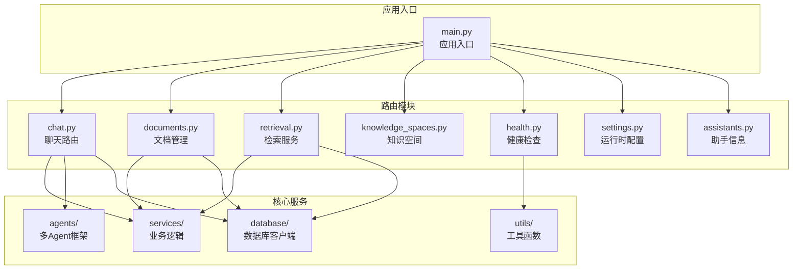
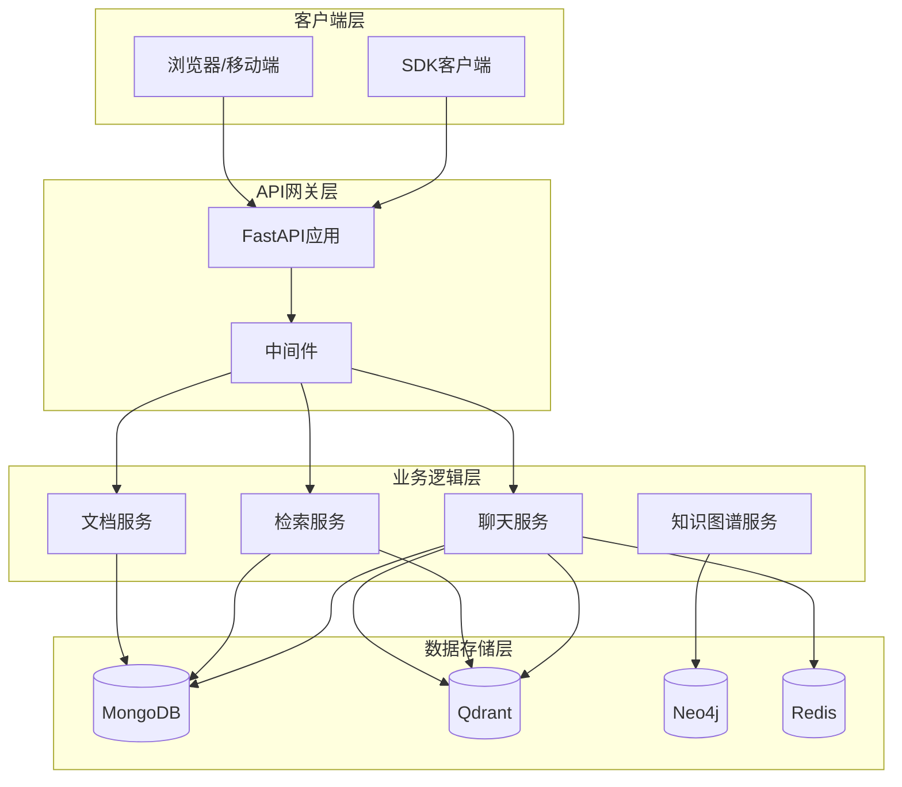
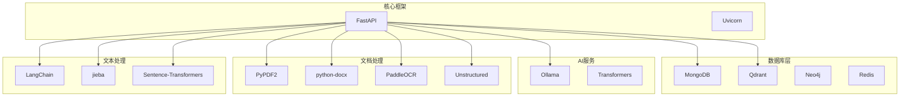
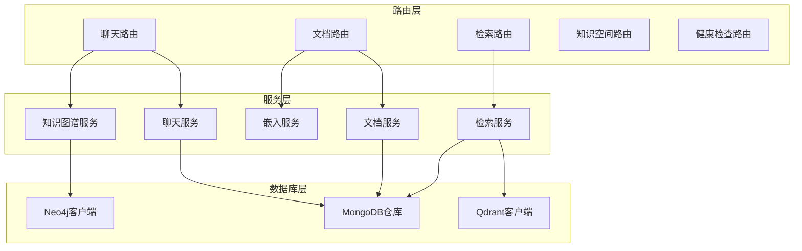
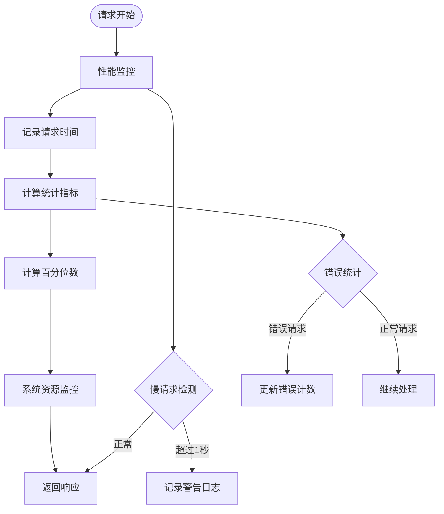
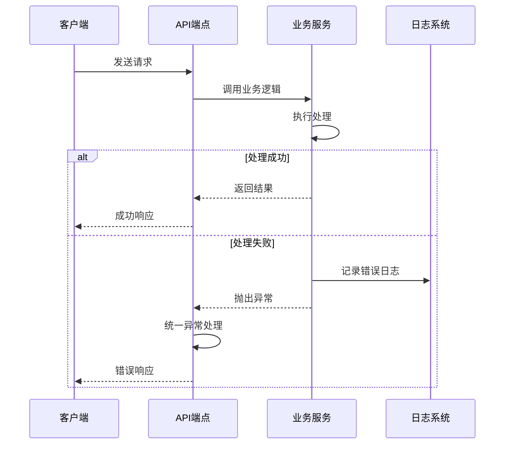

# API参考文档

<cite>
**本文档引用的文件**
- [main.py](file://main.py)
- [chat.py](file://routers/chat.py)
- [documents.py](file://routers/documents.py)
- [knowledge_spaces.py](file://routers/knowledge_spaces.py)
- [retrieval.py](file://routers/retrieval.py)
- [health.py](file://routers/health.py)
- [settings.py](file://routers/settings.py)
- [assistants.py](file://routers/assistants.py)
- [README.md](file://README.md)
- [requirements.txt](file://requirements.txt)
- [monitoring.py](file://utils/monitoring.py)
</cite>

## 目录
1. [简介](#简介)
2. [项目结构](#项目结构)
3. [核心组件](#核心组件)
4. [架构概览](#架构概览)
5. [详细组件分析](#详细组件分析)
6. [依赖分析](#依赖分析)
7. [性能考虑](#性能考虑)
8. [故障排除指南](#故障排除指南)
9. [结论](#结论)
10. [附录](#附录)

## 简介
Advanced RAG API是一个基于FastAPI构建的高级RAG（检索增强生成）系统，提供以下核心能力：
- AI助手对话（含深度研究/深度思考）
- 知识库检索与入库
- 支持匿名访问的RESTful API
- 流式SSE响应支持
- 多Agent协作的深度研究模式
- 对话附件上传与处理

系统采用模块化设计，主要分为路由层、服务层、数据库层和工具层，支持高性能部署和监控。

## 项目结构
后端采用FastAPI框架，API路由按功能模块组织：



**图表来源**
- [main.py:90-99](file://main.py#L90-L99)
- [chat.py:17](file://routers/chat.py#L17)
- [documents.py:20](file://routers/documents.py#L20)

**章节来源**
- [main.py:55-105](file://main.py#L55-L105)
- [README.md:55-70](file://README.md#L55-L70)

## 核心组件
系统的核心组件包括：

### API路由层
- **聊天路由** (/api/chat)：处理对话请求、深度研究模式、对话附件
- **文档路由** (/api/documents)：文档上传、列表查询、进度监控
- **检索路由** (/api/retrieval)：RAG检索、查询分析
- **知识空间路由** (/api/knowledge-spaces)：知识空间管理
- **健康检查路由** (/health)：服务健康状态监控

### 服务层
- **RAG服务**：检索增强生成核心逻辑
- **知识抽取服务**：实体关系抽取和知识图谱构建
- **嵌入服务**：文本向量化处理
- **运行时配置**：动态功能开关和参数调整

### 数据存储层
- **MongoDB**：文档、对话历史、知识空间数据
- **Qdrant**：向量数据库，支持相似性搜索
- **Neo4j**：可选的知识图谱存储

**章节来源**
- [requirements.txt:9-14](file://requirements.txt#L9-L14)
- [README.md:28-54](file://README.md#L28-L54)

## 架构概览
系统采用分层架构，支持高并发和流式处理：



**图表来源**
- [main.py:90-99](file://main.py#L90-L99)
- [chat.py:623-760](file://routers/chat.py#L623-L760)
- [documents.py:274-799](file://routers/documents.py#L274-799)

## 详细组件分析

### 聊天API组件

#### 常规对话接口
**端点**: `POST /api/chat`
**功能**: 处理用户查询，支持RAG增强和流式SSE响应

**请求参数**:
- `query`: 用户查询文本
- `assistant_id`: 助手ID（可选）
- `knowledge_space_ids`: 知识空间ID列表（可选）
- `conversation_id`: 对话ID（可选）
- `enable_rag`: 是否启用RAG检索（默认true）
- `mode`: 检索模式（normal/network）
- `generation_config`: 模型配置参数

**响应格式**:
- 流式SSE响应，包含文本块和完成标记
- 每个事件包含JSON数据对象

**流式响应结构**:
```javascript
// 文本块事件
data: {"content": "响应片段"}

// 完成事件
data: {"done": true, "sources": [...], "recommended_resources": [...]}

// 错误事件
data: {"error": "错误信息"}
```

**章节来源**
- [chat.py:623-760](file://routers/chat.py#L623-L760)
- [chat.py:20-73](file://routers/chat.py#L20-L73)

#### 深度研究模式
**端点**: `POST /api/chat/deep-research`
**功能**: 多Agent协作的深度研究分析

**请求参数**:
- `query`: 研究主题
- `assistant_id`: 助手ID
- `conversation_id`: 对话ID
- `enabled_agents`: 启用的专家Agent列表
- `generation_config`: 生成配置

**响应格式**: 流式SSE，返回规划、Agent结果和最终HTML响应

**章节来源**
- [chat.py:762-922](file://routers/chat.py#L762-L922)

#### 对话附件上传
**端点**: `POST /api/chat/conversation-attachment`
**功能**: 上传文件并处理，支持对话专用知识库

**请求参数**:
- `file`: 上传文件（multipart/form-data）
- `conversation_id`: 目标对话ID
- `knowledge_space_id`: 目标知识空间ID

**支持文件类型**: PDF, DOC/DOCX, MD, TXT, PPTX, XLSX/XLS, HTML, 图片等

**章节来源**
- [chat.py:1108-1267](file://routers/chat.py#L1108-L1267)

#### 对话管理接口
**端点**: `/api/chat`下的对话相关操作
- `GET /api/chat/conversations`: 获取对话列表
- `GET /api/chat/conversations/{id}`: 获取对话详情
- `POST /api/chat/conversations`: 创建新对话
- `PUT /api/chat/conversations/{id}`: 更新对话
- `DELETE /api/chat/conversations/{id}`: 删除对话
- `POST /api/chat/conversations/{id}/messages`: 添加消息
- `PUT /api/chat/conversations/{id}/messages/{message_id}`: 编辑消息
- `POST /api/chat/conversations/{id}/messages/{message_id}/regenerate`: 重新生成

**章节来源**
- [chat.py:97-456](file://routers/chat.py#L97-L456)

### 文档管理API组件

#### 文档上传接口
**端点**: `POST /api/documents/upload`
**功能**: 文档上传并后台处理

**请求参数**:
- `file`: 上传文件
- `assistant_id`: 助手ID（可选）
- `knowledge_space_id`: 知识空间ID（必填）

**处理流程**:
1. 文件校验和去重检查
2. 后台异步处理（解析→分块→向量化→入库）
3. 进度状态跟踪

**响应格式**:
```json
{
  "message": "文件上传成功，正在后台处理",
  "document_id": "字符串",
  "filename": "字符串",
  "file_size": 整数,
  "status": "processing"
}
```

**章节来源**
- [documents.py:800-978](file://routers/documents.py#L800-L978)

#### 文档列表查询
**端点**: `GET /api/documents`
**功能**: 获取文档列表

**查询参数**:
- `skip`: 跳过数量（默认0）
- `limit`: 限制数量（默认100）
- `assistant_id`: 助手ID（可选）
- `knowledge_space_id`: 知识空间ID（可选）

**章节来源**
- [documents.py:1008-1059](file://routers/documents.py#L1008-L1059)

#### 文档进度查询
**端点**: `GET /api/documents/{doc_id}/progress`
**功能**: 获取文档处理进度

**章节来源**
- [documents.py:1061-1093](file://routers/documents.py#L1061-L1093)

#### 文档详情查询
**端点**: `GET /api/documents/{doc_id}`
**功能**: 获取文档详细信息（包括处理流程、文本块、向量信息）

**章节来源**
- [documents.py:1221-1321](file://routers/documents.py#L1221-L1321)

#### 文档操作接口
- `POST /api/documents/{doc_id}/retry`: 重新处理文档
- `PUT /api/documents/{doc_id}`: 更新文档（重命名）
- `DELETE /api/documents/{doc_id}`: 删除文档
- `GET /api/documents/{doc_id}/preview`: 预览文档

**章节来源**
- [documents.py:1121-1199](file://routers/documents.py#L1121-L1199)
- [documents.py:1328-1378](file://routers/documents.py#L1328-L1378)
- [documents.py:1380-1437](file://routers/documents.py#L1380-L1437)
- [documents.py:1439-1513](file://routers/documents.py#L1439-L1513)

### 知识空间API组件

#### 知识空间管理
**端点**: `GET /api/knowledge-spaces`
**功能**: 获取知识空间列表

**查询参数**:
- `skip`: 跳过数量（默认0）
- `limit`: 限制数量（默认100）

**响应格式**:
```json
{
  "knowledge_spaces": [
    {
      "id": "字符串",
      "name": "字符串",
      "description": "字符串",
      "collection_name": "字符串",
      "is_default": 布尔值,
      "created_at": "ISO时间戳",
      "updated_at": "ISO时间戳"
    }
  ],
  "total": 整数
}
```

**章节来源**
- [knowledge_spaces.py:50-83](file://routers/knowledge_spaces.py#L50-L83)

#### 创建知识空间
**端点**: `POST /api/knowledge-spaces`
**功能**: 创建新的知识空间

**请求参数**:
- `name`: 知识空间名称（1-64字符）
- `description`: 描述信息（最多200字符）

**章节来源**
- [knowledge_spaces.py:85-140](file://routers/knowledge_spaces.py#L85-L140)

### 检索API组件

#### 查询分析
**端点**: `POST /api/retrieval/analyze`
**功能**: 分析查询是否需要检索上下文

**请求参数**:
- `query`: 用户查询文本

**响应格式**:
```json
{
  "need_retrieval": 布尔值,
  "reason": "字符串",
  "confidence": "high|medium|low"
}
```

**章节来源**
- [retrieval.py:44-95](file://routers/retrieval.py#L44-L95)

#### RAG检索
**端点**: `POST /api/retrieval`
**功能**: 执行RAG检索

**请求参数**:
- `query`: 查询文本
- `document_id`: 指定文档ID（可选）
- `top_k`: 返回结果数量（默认5）
- `assistant_id`: 助手ID（可选）
- `knowledge_space_ids`: 知识空间ID列表（可选）
- `conversation_id`: 对话ID（可选）

**响应格式**:
```json
{
  "context": "字符串",
  "sources": [],
  "retrieval_count": 整数,
  "recommended_resources": []
}
```

**章节来源**
- [retrieval.py:97-150](file://routers/retrieval.py#L97-L150)

### 健康检查API组件

#### 健康状态检查
**端点**: `GET /health`
**功能**: 检查所有服务的健康状态

**响应格式**:
```json
{
  "status": "healthy|degraded",
  "version": "字符串",
  "services": {
    "mongodb": {"status": "healthy|unhealthy", "connected": 布尔值},
    "qdrant": {"status": "healthy|unhealthy", "connected": 布尔值}
  },
  "system": {
    "cpu_percent": 浮点数,
    "memory_percent": 浮点数,
    "memory_available_mb": 浮点数
  }
}
```

**章节来源**
- [health.py:23-87](file://routers/health.py#L23-L87)

#### 存活和就绪检查
**端点**:
- `GET /health/liveness`: 存活探针
- `GET /health/readiness`: 就绪探针

**响应格式**:
- 存活：`{"status": "alive"}`
- 就绪：`{"status": "ready"|"not_ready", "error": "字符串"}`

**章节来源**
- [health.py:90-115](file://routers/health.py#L90-L115)

#### 性能指标
**端点**: `GET /health/metrics`
**功能**: 获取性能指标和系统资源使用情况

**响应格式**:
```json
{
  "request_stats": {},
  "system_metrics": {
    "cpu": {"percent": 浮点数, "process_percent": 浮点数},
    "memory": {"total_mb": 浮点数, "available_mb": 浮点数, "used_mb": 浮点数, "percent": 浮点数, "process_mb": 浮点数},
    "disk": {"total_gb": 浮点数, "used_gb": 浮点数, "free_gb": 浮点数, "percent": 浮点数}
  }
}
```

**章节来源**
- [health.py:117-134](file://routers/health.py#L117-L134)

### 运行时配置API组件

#### 获取运行时配置
**端点**: `GET /api/settings/runtime`
**功能**: 获取当前运行时配置

**响应格式**:
```json
{
  "mode": "custom|模式枚举",
  "modules": {},
  "params": {},
  "updated_at": "ISO时间戳"
}
```

**章节来源**
- [settings.py:31-39](file://routers/settings.py#L31-L39)

#### 更新运行时配置
**端点**: `PUT /api/settings/runtime`
**功能**: 更新运行时配置

**请求参数**:
- `mode`: 运行模式
- `modules`: 功能模块开关
- `params`: 参数配置

**章节来源**
- [settings.py:42-64](file://routers/settings.py#L42-L64)

### 助手信息API组件

#### 助手列表
**端点**: `GET /api/assistants`
**功能**: 获取助手列表（只读）

**查询参数**:
- `skip`: 跳过数量（默认0）
- `limit`: 限制数量（默认100）

**章节来源**
- [assistants.py:40-84](file://routers/assistants.py#L40-L84)

#### 助手详情
**端点**: `GET /api/assistants/{assistant_id}`
**功能**: 获取助手详情（只读）

**章节来源**
- [assistants.py:86-127](file://routers/assistants.py#L86-L127)

## 依赖分析

### 外部依赖关系
系统依赖关系如下：



**图表来源**
- [requirements.txt:4-42](file://requirements.txt#L4-L42)

### 内部模块依赖


**图表来源**
- [chat.py:13](file://routers/chat.py#L13)
- [documents.py:7](file://routers/documents.py#L7)
- [retrieval.py:5](file://routers/retrieval.py#L5)

**章节来源**
- [requirements.txt:9-14](file://requirements.txt#L9-L14)

## 性能考虑

### 并发处理
- **多Worker部署**: 生产环境默认使用24个worker，支持高并发请求
- **连接限制**: 每个worker限制2000个并发连接
- **Keep-Alive超时**: 15分钟，支持大文件上传

### 流式处理优化
- **SSE流式响应**: 支持实时文本流传输
- **断开检测**: 自动检测客户端断开并停止处理
- **批量处理**: 文档向量化采用批量处理减少内存占用

### 缓存策略
- **Redis缓存**: 可选缓存服务，提升查询性能
- **进程内缓存**: 临时数据缓存

### 监控指标
系统提供全面的性能监控：



**图表来源**
- [monitoring.py:22-185](file://utils/monitoring.py#L22-L185)

**章节来源**
- [main.py:144-171](file://main.py#L144-L171)
- [monitoring.py:13-185](file://utils/monitoring.py#L13-L185)

## 故障排除指南

### 常见错误处理
系统采用统一的错误处理机制：



**图表来源**
- [main.py:110-127](file://main.py#L110-L127)

### 健康检查诊断
- **MongoDB连接**: 检查连接字符串和网络连通性
- **Qdrant服务**: 验证服务可用性和API密钥
- **磁盘空间**: 确保有足够的磁盘空间进行文档处理

### 性能问题排查
1. **慢请求检测**: 查看监控日志中的慢请求记录
2. **内存使用**: 监控进程内存使用情况
3. **数据库连接**: 检查MongoDB连接池状态
4. **向量化性能**: 监控嵌入服务响应时间

**章节来源**
- [health.py:23-87](file://routers/health.py#L23-L87)
- [monitoring.py:163-185](file://utils/monitoring.py#L163-L185)

## 结论
Advanced RAG API提供了一个功能完整、性能优异的RAG系统API接口。其特点包括：

- **模块化设计**: 清晰的功能分离和依赖关系
- **高性能架构**: 支持高并发和流式处理
- **全面监控**: 内置性能监控和健康检查
- **灵活配置**: 运行时配置支持动态调整
- **扩展性强**: 易于添加新功能和集成新服务

系统适合构建企业级的AI助手和知识管理应用，支持大规模部署和生产环境使用。

## 附录

### API版本信息
- **当前版本**: v0.8.5
- **API前缀**: `/api`
- **命名空间**: 
  - 聊天: `/api/chat`
  - 文档: `/api/documents`
  - 检索: `/api/retrieval`
  - 知识空间: `/api/knowledge-spaces`
  - 设置: `/api/settings`
  - 助手: `/api/assistants`

### 安全考虑
- **匿名访问**: 所有API支持匿名访问
- **CORS配置**: 开发环境允许跨域访问
- **文件上传限制**: 200MB文件大小限制
- **重复内容检测**: 防止重复文档上传

### 部署建议
- **生产环境**: 使用多worker部署，启用性能监控
- **开发环境**: 单worker模式，支持热重载
- **数据库**: 确保MongoDB和Qdrant服务可用
- **存储**: 准备充足的磁盘空间用于文档处理

**章节来源**
- [README.md:189-199](file://README.md#L189-L199)
- [main.py:55-60](file://main.py#L55-L60)