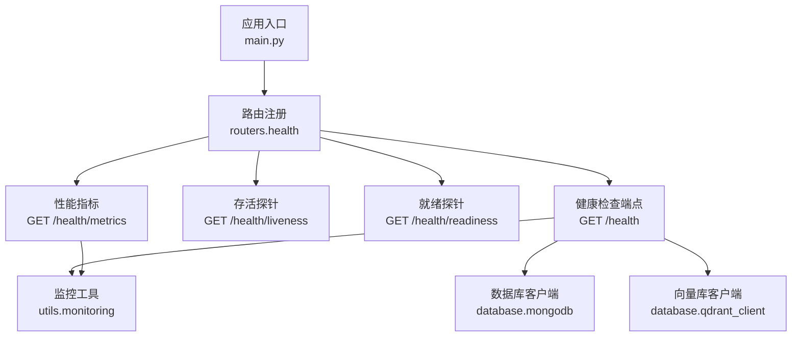
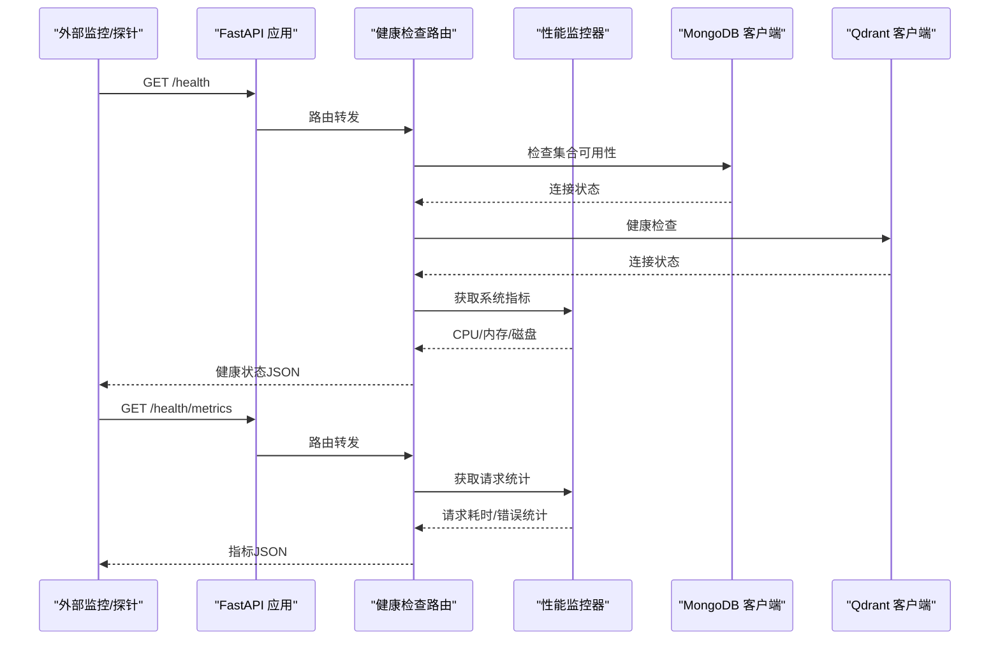
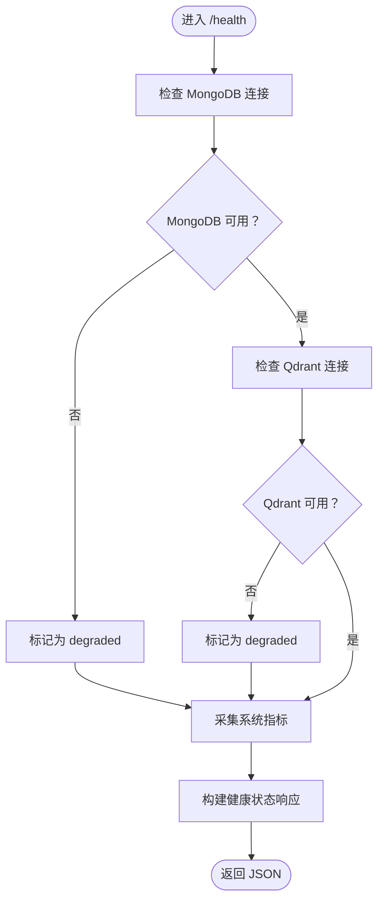
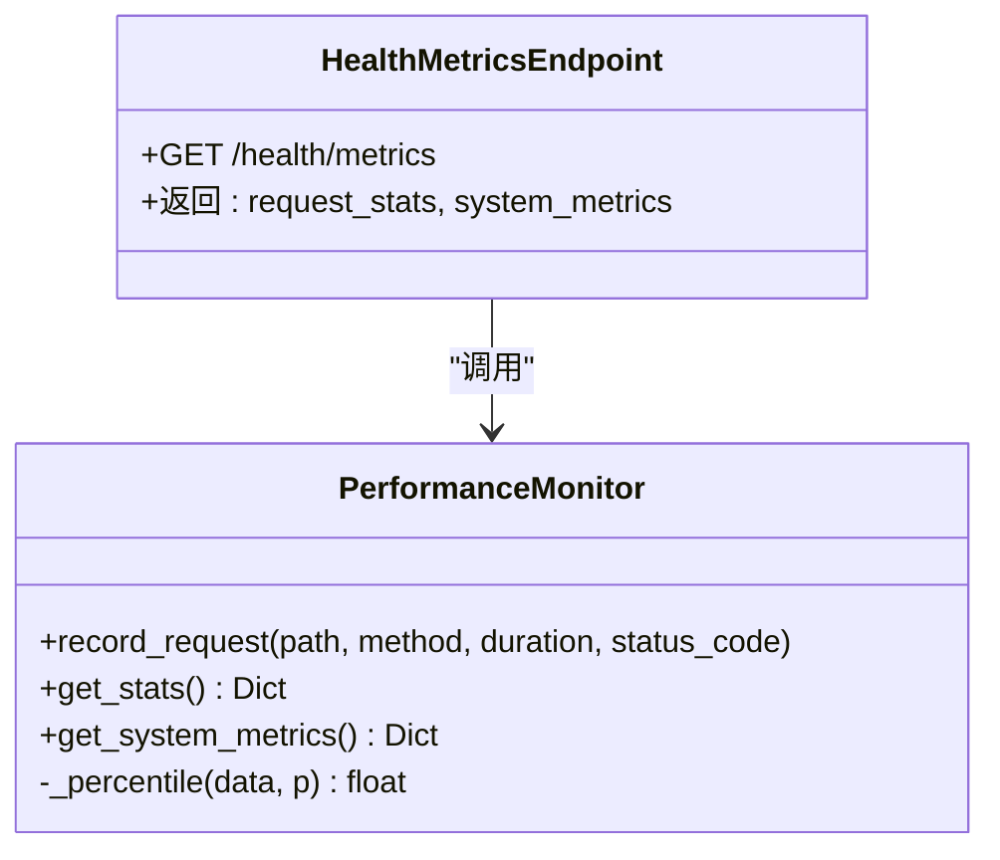
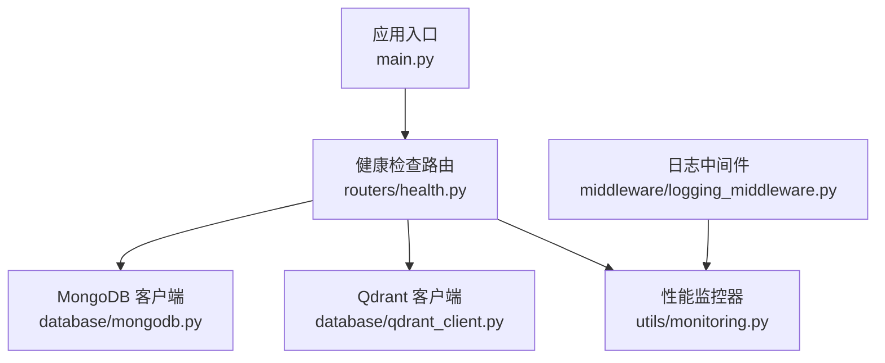

# 健康检查API

<cite>
**本文引用的文件**
- [routers/health.py](file://routers/health.py)
- [utils/monitoring.py](file://utils/monitoring.py)
- [main.py](file://main.py)
- [database/mongodb.py](file://database/mongodb.py)
- [database/qdrant_client.py](file://database/qdrant_client.py)
- [utils/lifespan.py](file://utils/lifespan.py)
- [middleware/logging_middleware.py](file://middleware/logging_middleware.py)
- [README.md](file://README.md)
</cite>

## 目录
1. [简介](#简介)
2. [项目结构](#项目结构)
3. [核心组件](#核心组件)
4. [架构总览](#架构总览)
5. [详细组件分析](#详细组件分析)
6. [依赖关系分析](#依赖关系分析)
7. [性能考量](#性能考量)
8. [故障排查指南](#故障排查指南)
9. [结论](#结论)
10. [附录](#附录)

## 简介
本文件为 Advanced RAG 健康检查API的详细技术文档，涵盖以下端点：
- GET /health：系统健康状态检查（聚合数据库、向量库、系统资源）
- GET /health/liveness：Kubernetes 存活探针（不检查依赖）
- GET /health/readiness：Kubernetes 就绪探针（关键服务就绪）
- GET /health/metrics：系统性能指标（请求统计与系统资源）

文档重点说明健康检查的各个维度（数据库连接状态、向量库可用性、系统资源使用情况），性能指标的含义与阈值建议，以及在微服务架构中的作用（服务发现、负载均衡、熔断机制）。同时提供自动化监控方案、故障转移与恢复策略，以及最佳实践（检查频率、超时设置、故障处理策略）。

## 项目结构
健康检查API位于路由层，由 FastAPI 路由器提供，依赖监控工具与数据库客户端，注册在应用入口中。

图表来源
- [main.py:98](file://main.py#L98)
- [routers/health.py:23](file://routers/health.py#L23)
- [routers/health.py:117](file://routers/health.py#L117)
- [utils/monitoring.py:13](file://utils/monitoring.py#L13)
- [database/mongodb.py:92](file://database/mongodb.py#L92)
- [database/qdrant_client.py:18](file://database/qdrant_client.py#L18)

章节来源
- [main.py:98](file://main.py#L98)
- [routers/health.py:1-135](file://routers/health.py#L1-L135)

## 核心组件
- 健康检查路由器：定义 /health、/health/liveness、/health/readiness、/health/metrics 四个端点，返回统一的健康状态模型。
- 性能监控器：记录请求耗时、状态码，计算统计指标（均值、最小/最大、百分位），采集CPU/内存/磁盘等系统指标。
- 数据库客户端：MongoDB 异步客户端，提供连接池配置与连接测试；Qdrant 客户端，提供健康检查与集合管理。
- 应用生命周期：启动时对 MongoDB 进行带重试的连接，失败不阻断服务，便于本地调试。

章节来源
- [routers/health.py:15-87](file://routers/health.py#L15-L87)
- [utils/monitoring.py:13-185](file://utils/monitoring.py#L13-L185)
- [database/mongodb.py:92-204](file://database/mongodb.py#L92-L204)
- [database/qdrant_client.py:18-139](file://database/qdrant_client.py#L18-L139)
- [utils/lifespan.py:28-92](file://utils/lifespan.py#L28-L92)

## 架构总览
健康检查API在应用启动时注册，依赖监控工具进行请求统计与系统指标采集，同时对数据库与向量库进行可用性检查。日志中间件负责记录请求并上报性能监控器。

图表来源
- [routers/health.py:23](file://routers/health.py#L23)
- [routers/health.py:117](file://routers/health.py#L117)
- [utils/monitoring.py:49](file://utils/monitoring.py#L49)
- [database/mongodb.py:196](file://database/mongodb.py#L196)
- [database/qdrant_client.py:124](file://database/qdrant_client.py#L124)

## 详细组件分析

### 健康检查端点：GET /health
- 功能：聚合检查数据库连接、向量库可用性与系统资源使用情况，返回整体健康状态与各子系统状态。
- 检查维度：
  - MongoDB：通过获取集合并执行一次查询验证连接可用性。
  - Qdrant：调用健康检查方法，返回布尔值表示可用性。
  - 系统资源：采集CPU使用率、内存使用率与可用内存、磁盘使用情况。
- 响应模型：包含状态（healthy/degraded）、版本、各服务状态与可选系统信息。

图表来源
- [routers/health.py:23](file://routers/health.py#L23)
- [routers/health.py:32](file://routers/health.py#L32)
- [routers/health.py:49](file://routers/health.py#L49)
- [routers/health.py:67](file://routers/health.py#L67)

章节来源
- [routers/health.py:23-87](file://routers/health.py#L23-L87)

### 存活探针：GET /health/liveness
- 功能：Kubernetes 存活探针，简单返回存活状态，不检查任何依赖。
- 适用场景：容器运行状态判断，快速判定进程是否存活。

章节来源
- [routers/health.py:90-96](file://routers/health.py#L90-L96)

### 就绪探针：GET /health/readiness
- 功能：Kubernetes 就绪探针，检查关键服务（此处为 MongoDB）是否就绪。
- 适用场景：在依赖服务未就绪时，避免流量进入，保证服务稳定性。

章节来源
- [routers/health.py:99-114](file://routers/health.py#L99-L114)

### 性能指标端点：GET /health/metrics
- 功能：返回请求统计与系统资源使用情况。
- 请求统计：包含每个端点的请求次数、错误次数、平均/最小/最大耗时，以及 p50/p95/p99 百分位耗时。
- 系统指标：CPU 使用率、进程 CPU 使用率、内存总量/使用量/可用量、磁盘总量/使用量/剩余量。

图表来源
- [utils/monitoring.py:13](file://utils/monitoring.py#L13)
- [utils/monitoring.py:49](file://utils/monitoring.py#L49)
- [utils/monitoring.py:78](file://utils/monitoring.py#L78)
- [routers/health.py:117](file://routers/health.py#L117)

章节来源
- [routers/health.py:117-134](file://routers/health.py#L117-L134)
- [utils/monitoring.py:13-185](file://utils/monitoring.py#L13-L185)

### 数据库与向量库客户端
- MongoDB 客户端：
  - 支持从环境变量解析连接字符串与数据库名，配置连接池参数（最大/最小连接数、超时等）。
  - 启动时通过 ping 校验连接可用性；失败时记录详细提示信息。
  - 提供集合获取方法，供健康检查使用。
- Qdrant 客户端：
  - 优先使用 gRPC 连接，避免 HTTP/httpx 的 502 问题；支持连接复用。
  - 提供健康检查方法，通过获取集合列表判断服务可用性。
  - 支持自动重建集合（当维度不匹配时）与重试机制。

章节来源
- [database/mongodb.py:92-204](file://database/mongodb.py#L92-L204)
- [database/mongodb.py:151-185](file://database/mongodb.py#L151-L185)
- [database/qdrant_client.py:18-139](file://database/qdrant_client.py#L18-L139)

### 应用生命周期与监控集成
- 应用生命周期：
  - 启动时对 MongoDB 进行带重试的连接，失败不阻断服务，便于本地调试。
  - 初始化默认助手与知识空间，保证系统基础数据可用。
- 监控集成：
  - 日志中间件记录请求并上报性能监控器，自动记录慢请求与错误请求。
  - 性能监控器记录请求耗时与状态码，支持百分位统计。

章节来源
- [utils/lifespan.py:28-92](file://utils/lifespan.py#L28-L92)
- [middleware/logging_middleware.py:8-52](file://middleware/logging_middleware.py#L8-L52)
- [utils/monitoring.py:118-185](file://utils/monitoring.py#L118-L185)

## 依赖关系分析
健康检查API的依赖关系如下：

图表来源
- [routers/health.py:5](file://routers/health.py#L5)
- [routers/health.py:6](file://routers/health.py#L6)
- [routers/health.py:8](file://routers/health.py#L8)
- [main.py:98](file://main.py#L98)
- [middleware/logging_middleware.py:5](file://middleware/logging_middleware.py#L5)

章节来源
- [routers/health.py:1-135](file://routers/health.py#L1-L135)
- [main.py:98](file://main.py#L98)
- [middleware/logging_middleware.py:1-52](file://middleware/logging_middleware.py#L1-L52)

## 性能考量
- 请求统计指标：
  - 计数：每端点累计请求次数。
  - 错误计数：状态码≥400的错误次数。
  - 耗时统计：平均、最小、最大、p50/p95/p99 百分位。
  - 百分位计算：对耗时数组排序后取对应位置值。
- 系统指标：
  - CPU：系统CPU使用率与进程CPU使用率。
  - 内存：总/可用/使用量与使用率，进程内存占用。
  - 磁盘：总/已用/剩余量与使用率。
- 监控装饰器与上下文管理器：
  - 异步/同步装饰器分别记录请求耗时与状态码。
  - 上下文管理器在请求结束后记录耗时与状态码，并对慢请求进行告警。

章节来源
- [utils/monitoring.py:49-111](file://utils/monitoring.py#L49-L111)
- [utils/monitoring.py:118-185](file://utils/monitoring.py#L118-L185)

## 故障排查指南
- MongoDB 连接失败：
  - 现象：健康检查返回 degraded，MongoDB 状态为 unhealthy。
  - 排查要点：确认 MongoDB 服务已启动、连接字符串与认证配置正确、Docker 环境下使用 host.docker.internal 或 127.0.0.1。
  - 启动时重试：应用生命周期对 MongoDB 进行多次重试，失败不阻断服务。
- Qdrant 连接失败：
  - 现象：健康检查返回 degraded，Qdrant 状态为 unhealthy。
  - 排查要点：确认 Qdrant 服务可达、URL 与 API Key 配置、优先使用 gRPC 连接。
- 系统资源采集失败：
  - 现象：系统指标字段缺失或报错。
  - 排查要点：确认运行环境具备访问系统指标的权限。
- 慢请求与错误请求：
  - 现象：日志中间件记录慢请求与错误请求。
  - 排查要点：查看响应头 X-Process-Time，定位耗时较长的端点。

章节来源
- [routers/health.py:40-65](file://routers/health.py#L40-L65)
- [routers/health.py:113](file://routers/health.py#L113)
- [utils/lifespan.py:8-25](file://utils/lifespan.py#L8-L25)
- [middleware/logging_middleware.py:38-50](file://middleware/logging_middleware.py#L38-L50)

## 结论
Advanced RAG 的健康检查API提供了完整的系统健康状态与性能指标视图，覆盖数据库、向量库与系统资源三大维度。通过存活/就绪探针与性能指标端点，结合监控工具与应用生命周期管理，能够有效支撑微服务架构下的可观测性与可靠性保障。建议在生产环境中配合告警与自动恢复策略，持续优化检查频率与阈值，提升系统的稳定性与可维护性。

## 附录

### API 定义与示例
- GET /health
  - 功能：系统健康状态检查
  - 响应字段：status（healthy/degraded）、version、services（各子系统状态）、system（可选系统指标）
- GET /health/liveness
  - 功能：存活探针
  - 响应字段：status（alive）
- GET /health/readiness
  - 功能：就绪探针
  - 响应字段：status（ready/not_ready），错误信息（可选）
- GET /health/metrics
  - 功能：性能指标
  - 响应字段：request_stats（请求统计）、system_metrics（系统指标）

章节来源
- [routers/health.py:23](file://routers/health.py#L23)
- [routers/health.py:90](file://routers/health.py#L90)
- [routers/health.py:99](file://routers/health.py#L99)
- [routers/health.py:117](file://routers/health.py#L117)

### 微服务架构中的作用
- 服务发现：健康检查端点可作为服务注册与发现的一部分，帮助服务网格识别可用实例。
- 负载均衡：结合就绪探针，确保流量仅进入已就绪的服务实例。
- 熔断机制：在健康检查持续失败时，触发熔断或降级策略，保护下游系统。

### 自动化监控方案与最佳实践
- 告警配置：
  - 健康状态：当 status 为 degraded 或服务状态为 unhealthy 时触发告警。
  - 性能指标：当 p95/p99 耗时超过阈值、错误率上升、CPU/内存/磁盘使用率过高时触发告警。
- 故障转移与恢复：
  - 存活探针失败：将实例从负载均衡池移除，待恢复后再加入。
  - 就绪探针失败：延迟重试或回退到备用实例。
  - 性能异常：自动扩容或降级非关键功能。
- 检查频率与超时：
  - 健康检查：建议 10-30 秒一次，超时 3-5 秒。
  - 就绪/存活探针：建议 1-3 秒间隔，超时 1-2 秒。
  - 指标采集：建议 1-5 秒一次，避免过度采样。
- 故障处理策略：
  - 重试与退避：对临时性错误采用指数退避重试。
  - 降级与熔断：在依赖服务不可用时，返回降级响应或快速失败。
  - 日志与追踪：记录慢请求与错误请求，便于问题定位与性能优化。

章节来源
- [README.md:185-188](file://README.md#L185-L188)
- [middleware/logging_middleware.py:38-50](file://middleware/logging_middleware.py#L38-L50)