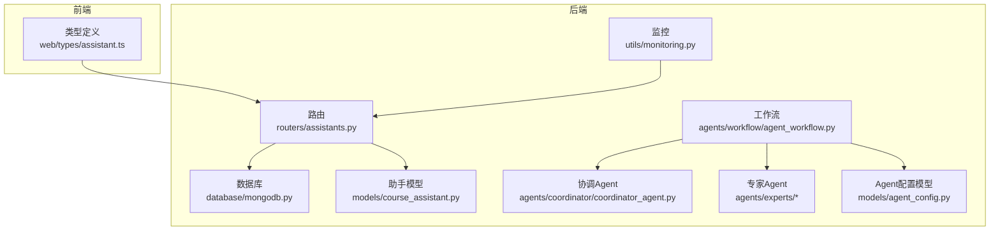
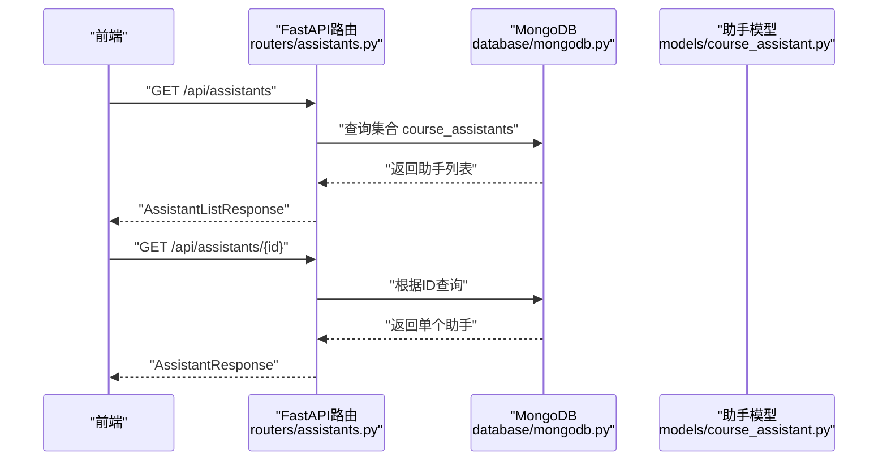
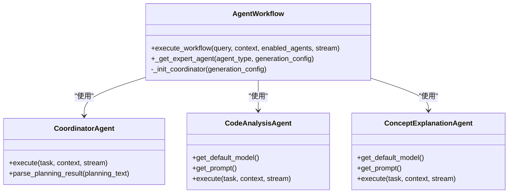
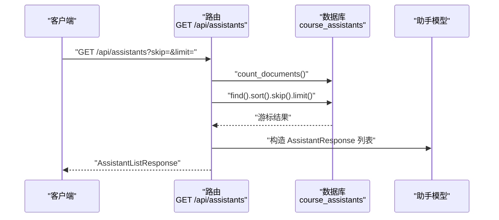
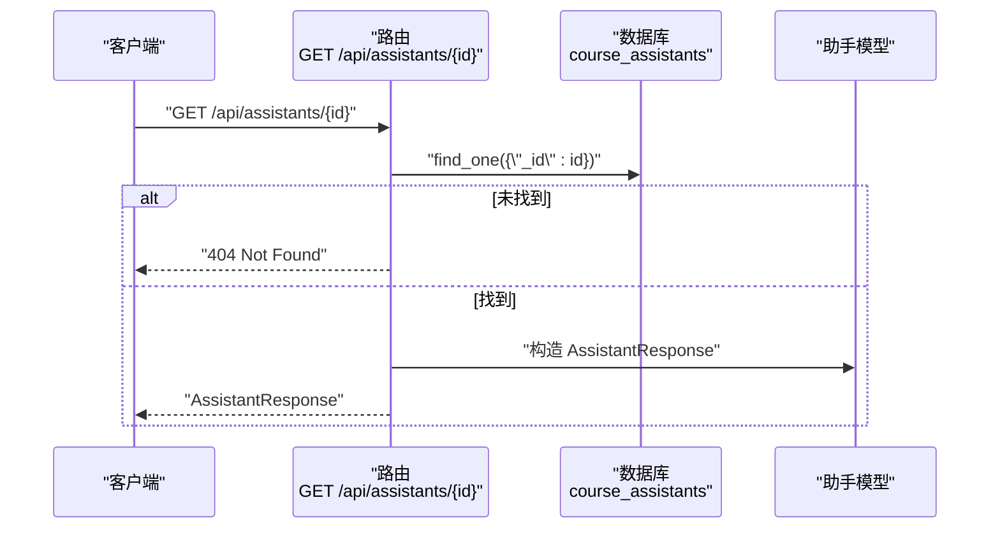
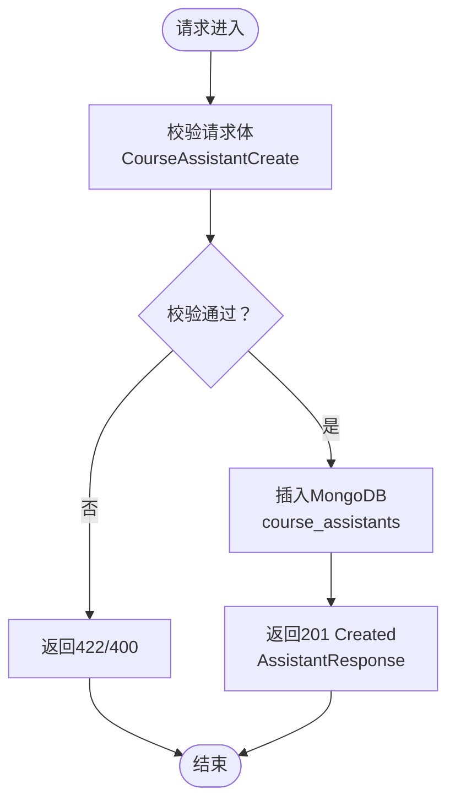
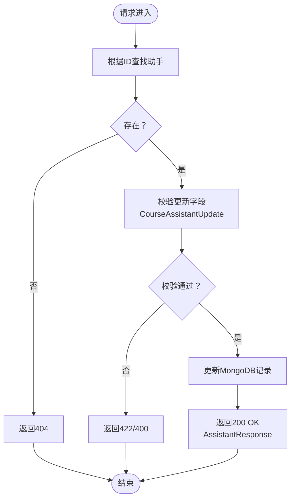
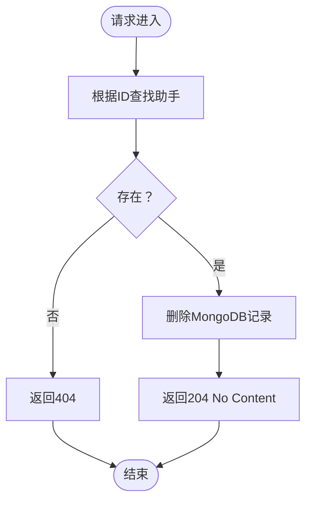
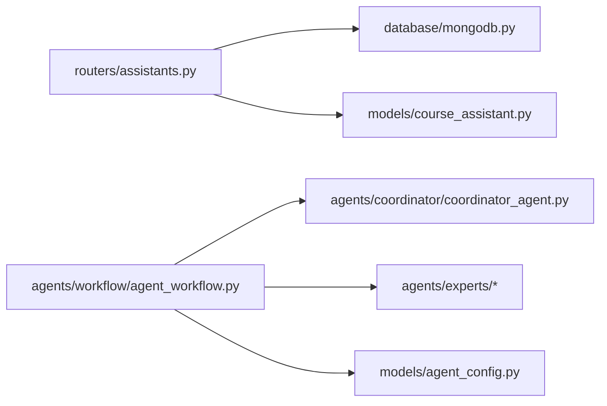

# 助手管理API

<cite>
**本文引用的文件**
- [routers/assistants.py](file://routers/assistants.py)
- [models/course_assistant.py](file://models/course_assistant.py)
- [web/types/assistant.ts](file://web/types/assistant.ts)
- [models/agent_config.py](file://models/agent_config.py)
- [agents/experts/code_analysis_agent.py](file://agents/experts/code_analysis_agent.py)
- [agents/experts/concept_explanation_agent.py](file://agents/experts/concept_explanation_agent.py)
- [agents/coordinator/coordinator_agent.py](file://agents/coordinator/coordinator_agent.py)
- [agents/workflow/agent_workflow.py](file://agents/workflow/agent_workflow.py)
- [database/mongodb.py](file://database/mongodb.py)
- [utils/monitoring.py](file://utils/monitoring.py)
- [models/user.py](file://models/user.py)
</cite>

## 目录
1. [简介](#简介)
2. [项目结构](#项目结构)
3. [核心组件](#核心组件)
4. [架构总览](#架构总览)
5. [详细组件分析](#详细组件分析)
6. [依赖分析](#依赖分析)
7. [性能考虑](#性能考虑)
8. [故障排查指南](#故障排查指南)
9. [结论](#结论)
10. [附录](#附录)

## 简介
本文件为 Advanced RAG 助手管理API的权威文档，覆盖以下端点与能力：
- GET /api/assistants：获取助手列表（匿名只读）
- GET /api/assistants/{id}：获取指定助手详情（匿名只读）
- POST /api/assistants：创建新助手（当前路由文件未实现，见“结论”）
- PUT /api/assistants/{id}：更新助手配置（当前路由文件未实现，见“结论”）
- DELETE /api/assistants/{id}：删除助手（当前路由文件未实现，见“结论”）

同时，文档详细说明助手模型字段、Agent配置、权限设置、使用统计与生命周期管理，并给出不同专家Agent的配置要点、工作流组合与最佳实践。

## 项目结构
与助手管理API直接相关的后端模块与前端类型如下：
- 后端路由：routers/assistants.py
- 助手模型：models/course_assistant.py
- Agent配置模型：models/agent_config.py
- 专家Agent实现：agents/experts/*
- 协调Agent与工作流：agents/coordinator/coordinator_agent.py、agents/workflow/agent_workflow.py
- 数据库访问：database/mongodb.py
- 前端类型定义：web/types/assistant.ts
- 性能监控：utils/monitoring.py
- 用户权限模型：models/user.py

图表来源
- [routers/assistants.py:1-127](file://routers/assistants.py#L1-L127)
- [models/course_assistant.py:1-77](file://models/course_assistant.py#L1-L77)
- [models/agent_config.py:1-24](file://models/agent_config.py#L1-L24)
- [agents/workflow/agent_workflow.py:1-388](file://agents/workflow/agent_workflow.py#L1-L388)
- [agents/coordinator/coordinator_agent.py:31-251](file://agents/coordinator/coordinator_agent.py#L31-L251)
- [agents/experts/code_analysis_agent.py:1-79](file://agents/experts/code_analysis_agent.py#L1-L79)
- [database/mongodb.py:1-800](file://database/mongodb.py#L1-L800)
- [utils/monitoring.py:1-185](file://utils/monitoring.py#L1-L185)
- [web/types/assistant.ts:1-45](file://web/types/assistant.ts#L1-L45)

章节来源
- [routers/assistants.py:1-127](file://routers/assistants.py#L1-L127)
- [models/course_assistant.py:1-77](file://models/course_assistant.py#L1-L77)
- [models/agent_config.py:1-24](file://models/agent_config.py#L1-L24)
- [agents/workflow/agent_workflow.py:1-388](file://agents/workflow/agent_workflow.py#L1-L388)
- [agents/coordinator/coordinator_agent.py:31-251](file://agents/coordinator/coordinator_agent.py#L31-L251)
- [agents/experts/code_analysis_agent.py:1-79](file://agents/experts/code_analysis_agent.py#L1-L79)
- [database/mongodb.py:1-800](file://database/mongodb.py#L1-L800)
- [utils/monitoring.py:1-185](file://utils/monitoring.py#L1-L185)
- [web/types/assistant.ts:1-45](file://web/types/assistant.ts#L1-L45)

## 核心组件
- 助手模型与字段
  - 字段定义：id、name、description、system_prompt、collection_name、is_default、greeting_message、quick_prompts、inference_model、embedding_model、icon_url、created_at、updated_at
  - 校验规则：名称长度与非空校验；集合名称（Qdrant）命名规范与长度限制
- Agent配置模型
  - 单个Agent配置：agent_type、inference_model、embedding_model
  - Agent配置列表响应：configs（字典，key为agent_type，value为配置）、total
- 路由与响应
  - GET /api/assistants：返回助手列表与总数
  - GET /api/assistants/{id}：返回单个助手详情
  - 当前未实现：POST/PUT/DELETE 助手管理端点（见“结论”）

章节来源
- [models/course_assistant.py:8-76](file://models/course_assistant.py#L8-L76)
- [models/agent_config.py:6-23](file://models/agent_config.py#L6-L23)
- [routers/assistants.py:17-126](file://routers/assistants.py#L17-L126)
- [web/types/assistant.ts:1-45](file://web/types/assistant.ts#L1-L45)

## 架构总览
助手管理API采用FastAPI路由+MongoDB存储的架构。前端通过类型定义与后端交互，后端通过依赖注入确保数据库连接可用，工作流层通过协调Agent与专家Agent协作完成复杂推理任务。

图表来源
- [routers/assistants.py:40-126](file://routers/assistants.py#L40-L126)
- [database/mongodb.py:196-223](file://database/mongodb.py#L196-L223)
- [models/course_assistant.py:8-76](file://models/course_assistant.py#L8-L76)

## 详细组件分析

### 助手模型与字段定义
- 字段说明
  - id：助手唯一标识
  - name：助手名称（必填，长度限制）
  - description：描述（可选）
  - system_prompt：系统提示词（必填）
  - collection_name：知识库集合名称（Qdrant集合命名规范）
  - is_default：是否为默认助手
  - greeting_message：初始问候语（可选）
  - quick_prompts：快捷提示词数组（可选）
  - inference_model：推理模型名称（可选）
  - embedding_model：嵌入模型名称（可选）
  - icon_url：图标URL（可选）
  - created_at/updated_at：创建与更新时间
- 校验规则
  - 名称非空且不超过100字符
  - 集合名称非空，仅允许字母、数字、下划线、连字符，最长63字符

章节来源
- [models/course_assistant.py:8-43](file://models/course_assistant.py#L8-L43)

### Agent配置模型
- AgentConfig：单个Agent配置，包含agent_type、inference_model、embedding_model
- AgentConfigUpdate：更新请求模型（字段同上，均为可选）
- AgentConfigsResponse：返回configs字典与total计数

章节来源
- [models/agent_config.py:6-23](file://models/agent_config.py#L6-L23)

### 协调Agent与工作流
- 协调Agent职责：根据用户问题自动选择专家Agent集合，生成任务描述与选择理由
- 工作流执行：顺序执行被选中的专家Agent，支持流式状态推送（planning、agent_status、agent_result、complete/error）
- Agent类型映射：document_retrieval、formula_analysis、code_analysis、concept_explanation、example_generation、summary、exercise、scientific_coding

图表来源
- [agents/workflow/agent_workflow.py:47-388](file://agents/workflow/agent_workflow.py#L47-L388)
- [agents/coordinator/coordinator_agent.py:31-251](file://agents/coordinator/coordinator_agent.py#L31-L251)
- [agents/experts/code_analysis_agent.py:1-79](file://agents/experts/code_analysis_agent.py#L1-L79)
- [agents/experts/concept_explanation_agent.py:1-70](file://agents/experts/concept_explanation_agent.py#L1-L70)

章节来源
- [agents/workflow/agent_workflow.py:47-388](file://agents/workflow/agent_workflow.py#L47-L388)
- [agents/coordinator/coordinator_agent.py:31-251](file://agents/coordinator/coordinator_agent.py#L31-L251)
- [agents/experts/code_analysis_agent.py:1-79](file://agents/experts/code_analysis_agent.py#L1-L79)
- [agents/experts/concept_explanation_agent.py:1-70](file://agents/experts/concept_explanation_agent.py#L1-L70)

### API端点与控制流

#### GET /api/assistants
- 功能：获取助手列表（匿名模式，只读）
- 参数：skip（默认0）、limit（默认100）
- 返回：AssistantListResponse（assistants数组与total计数）
- 数据来源：MongoDB集合 course_assistants

图表来源
- [routers/assistants.py:40-83](file://routers/assistants.py#L40-L83)
- [models/course_assistant.py:17-37](file://models/course_assistant.py#L17-L37)

章节来源
- [routers/assistants.py:40-83](file://routers/assistants.py#L40-L83)

#### GET /api/assistants/{id}
- 功能：获取指定助手详情（匿名模式，只读）
- 参数：assistant_id（路径参数）
- 返回：AssistantResponse
- 异常：未找到返回404

图表来源
- [routers/assistants.py:86-126](file://routers/assistants.py#L86-L126)
- [models/course_assistant.py:17-32](file://models/course_assistant.py#L17-L32)

章节来源
- [routers/assistants.py:86-126](file://routers/assistants.py#L86-L126)

#### POST /api/assistants（待实现）
- 当前状态：路由文件未实现该端点
- 建议行为：基于 CourseAssistantCreate 模型进行校验与入库，集合为 course_assistants
- 端到端流程示意：

图表来源
- [models/course_assistant.py:51-62](file://models/course_assistant.py#L51-L62)
- [routers/assistants.py:17-37](file://routers/assistants.py#L17-L37)

章节来源
- [models/course_assistant.py:51-62](file://models/course_assistant.py#L51-L62)
- [routers/assistants.py:17-37](file://routers/assistants.py#L17-L37)

#### PUT /api/assistants/{id}（待实现）
- 当前状态：路由文件未实现该端点
- 建议行为：基于 CourseAssistantUpdate 模型进行可选字段更新
- 端到端流程示意：

图表来源
- [models/course_assistant.py:65-76](file://models/course_assistant.py#L65-L76)
- [routers/assistants.py:17-37](file://routers/assistants.py#L17-L37)

章节来源
- [models/course_assistant.py:65-76](file://models/course_assistant.py#L65-L76)
- [routers/assistants.py:17-37](file://routers/assistants.py#L17-L37)

#### DELETE /api/assistants/{id}（待实现）
- 当前状态：路由文件未实现该端点
- 建议行为：根据ID删除 course_assistants 中的记录
- 端到端流程示意：

图表来源
- [routers/assistants.py:17-37](file://routers/assistants.py#L17-L37)

章节来源
- [routers/assistants.py:17-37](file://routers/assistants.py#L17-L37)

### 权限与细粒度控制
- 用户权限模型包含对助手管理的细粒度字段（仅普通管理员），如 can_view_assistants、can_create_assistants、can_edit_assistants、can_delete_assistants
- 当前助手API路由未显式使用上述权限字段，建议在后续实现中加入权限中间件与校验逻辑

章节来源
- [models/user.py:25-51](file://models/user.py#L25-L51)

### 使用统计与生命周期管理
- 字段层面：created_at、updated_at 记录助手的创建与更新时间
- 生命周期：is_default 标识默认助手；可通过更新接口切换
- 使用统计：当前未提供内置统计字段；可在业务侧通过外部指标系统采集（见“性能考虑”）

章节来源
- [models/course_assistant.py:8-22](file://models/course_assistant.py#L8-L22)

### 不同类型助手的配置要点与示例思路
- 代码分析助手（code_analysis）
  - 默认模型：建议使用具备较强代码理解能力的模型
  - 关键提示词：强调功能分析、关键代码段解释、实现建议与技术说明
- 概念解释助手（concept_explanation）
  - 默认模型：适合通用解释与推理
  - 关键提示词：定义、本质、应用场景、示例与关联关系
- 工作流组合示例（思路）
  - 简单问题：仅使用 concept_explanation
  - 复杂问题：协调Agent自动选择 code_analysis + concept_explanation，必要时追加 summary
  - 流式输出：前端可实时展示 agent_status 与 agent_result

章节来源
- [agents/experts/code_analysis_agent.py:10-23](file://agents/experts/code_analysis_agent.py#L10-L23)
- [agents/experts/concept_explanation_agent.py:10-23](file://agents/experts/concept_explanation_agent.py#L10-L23)
- [agents/workflow/agent_workflow.py:106-336](file://agents/workflow/agent_workflow.py#L106-L336)

## 依赖分析
- 路由依赖数据库连接：通过 require_mongodb 依赖注入确保连接可用
- 助手模型依赖 Pydantic 进行字段校验与序列化
- 工作流依赖协调Agent与专家Agent，专家Agent依赖基础Agent抽象类与LLM调用

图表来源
- [routers/assistants.py:10-11](file://routers/assistants.py#L10-L11)
- [models/course_assistant.py:2-5](file://models/course_assistant.py#L2-L5)
- [agents/workflow/agent_workflow.py:7-15](file://agents/workflow/agent_workflow.py#L7-L15)
- [models/agent_config.py:2-3](file://models/agent_config.py#L2-L3)

章节来源
- [routers/assistants.py:10-11](file://routers/assistants.py#L10-L11)
- [models/course_assistant.py:2-5](file://models/course_assistant.py#L2-L5)
- [agents/workflow/agent_workflow.py:7-15](file://agents/workflow/agent_workflow.py#L7-L15)
- [models/agent_config.py:2-3](file://models/agent_config.py#L2-L3)

## 性能考虑
- 数据库连接池：MongoDB连接池参数可调，建议在高并发场景下适当增大最大连接数
- 请求性能监控：通过装饰器与上下文管理器记录请求耗时、慢请求告警与系统指标
- 工作流流式输出：前端可逐步渲染Agent状态，提升用户体验

章节来源
- [database/mongodb.py:122-150](file://database/mongodb.py#L122-L150)
- [utils/monitoring.py:118-185](file://utils/monitoring.py#L118-L185)
- [agents/workflow/agent_workflow.py:106-336](file://agents/workflow/agent_workflow.py#L106-L336)

## 故障排查指南
- 数据库连接失败
  - 现象：首次请求时报503，提示数据库不可用
  - 排查：检查 .env 中 MONGODB_URI/MONGODB_HOST 等配置，确认MongoDB服务运行状态
- 查询异常
  - 现象：助手列表/详情查询抛出内部错误
  - 排查：查看后端日志，确认集合 course_assistants 存在且可访问
- 权限相关
  - 现象：当前API为匿名只读，若需写操作需实现权限校验
  - 建议：结合用户模型中的 can_* 字段在路由层增加权限中间件

章节来源
- [database/mongodb.py:207-223](file://database/mongodb.py#L207-L223)
- [routers/assistants.py:78-83](file://routers/assistants.py#L78-L83)
- [models/user.py:25-51](file://models/user.py#L25-L51)

## 结论
- 当前已实现能力
  - GET /api/assistants 与 GET /api/assistants/{id} 为匿名只读接口，数据来自 course_assistants 集合
- 待实现能力
  - POST /api/assistants、PUT /api/assistants/{id}、DELETE /api/assistants/{id} 三个端点尚未在路由文件中实现
- 建议
  - 在实现写操作端点时，严格遵循 CourseAssistantCreate/CourseAssistantUpdate 校验规则
  - 在路由层集成权限中间件，参考 models/user.py 中的 can_* 字段
  - 对外暴露 Agent 配置管理端点（如 /api/agent-configs），便于动态调整推理与嵌入模型
  - 结合工作流与监控工具，持续优化Agent组合与性能

## 附录

### API定义与示例

- GET /api/assistants
  - 查询参数：skip（默认0）、limit（默认100）
  - 响应：AssistantListResponse
  - 示例请求：GET /api/assistants?skip=0&limit=100
  - 示例响应字段：assistants[]（每项包含 id、name、description、system_prompt、collection_name、is_default、greeting_message、quick_prompts、inference_model、embedding_model、icon_url、created_at、updated_at）、total

- GET /api/assistants/{id}
  - 路径参数：assistant_id
  - 响应：AssistantResponse
  - 示例请求：GET /api/assistants/659f1234567890abcd123456
  - 示例响应字段：与列表项一致

- POST /api/assistants（待实现）
  - 请求体：CourseAssistantCreate
  - 响应：AssistantResponse（201 Created）
  - 示例请求体字段：name、description、system_prompt、collection_name（可选）、is_default（可选）、greeting_message（可选）、quick_prompts（可选）、inference_model（可选）、embedding_model（可选）、icon_url（可选））

- PUT /api/assistants/{id}（待实现）
  - 路径参数：assistant_id
  - 请求体：CourseAssistantUpdate（各字段可选）
  - 响应：AssistantResponse（200 OK）

- DELETE /api/assistants/{id}（待实现）
  - 路径参数：assistant_id
  - 响应：204 No Content

章节来源
- [routers/assistants.py:40-126](file://routers/assistants.py#L40-L126)
- [models/course_assistant.py:51-76](file://models/course_assistant.py#L51-L76)
- [web/types/assistant.ts:17-43](file://web/types/assistant.ts#L17-L43)