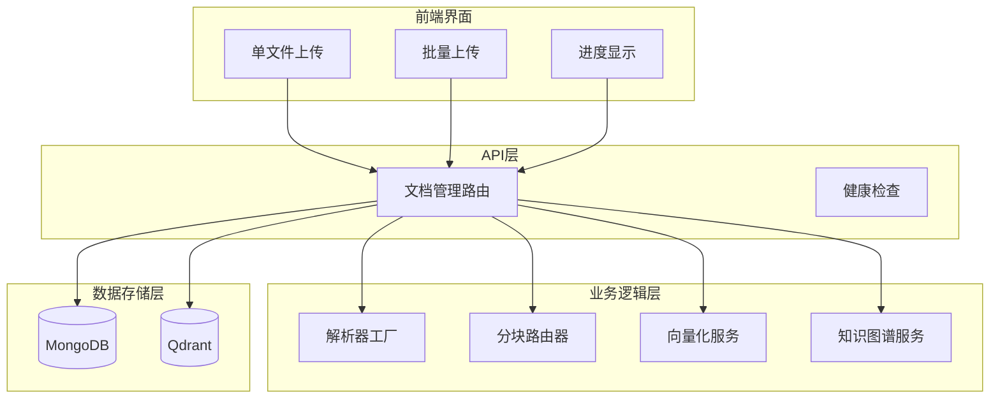
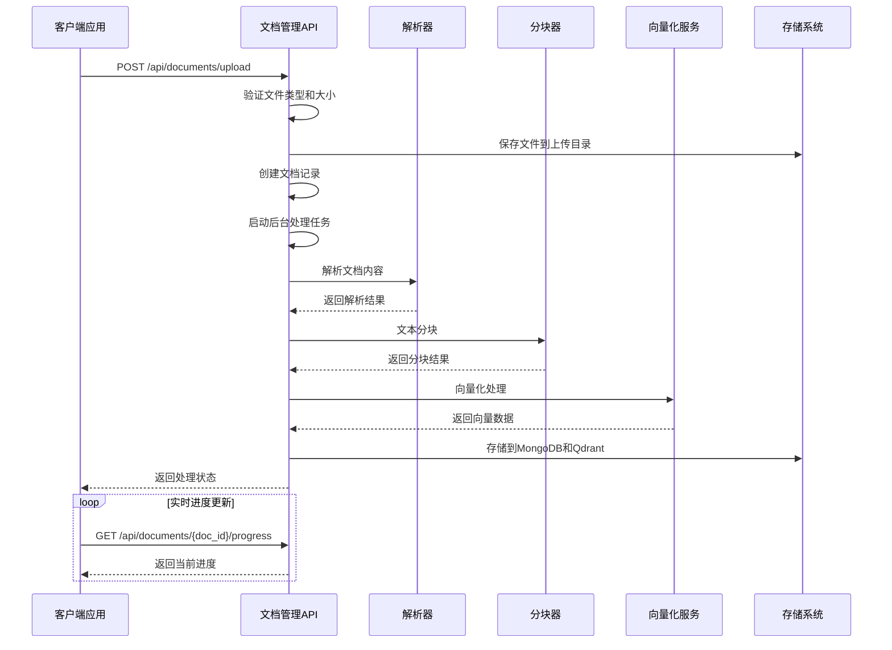
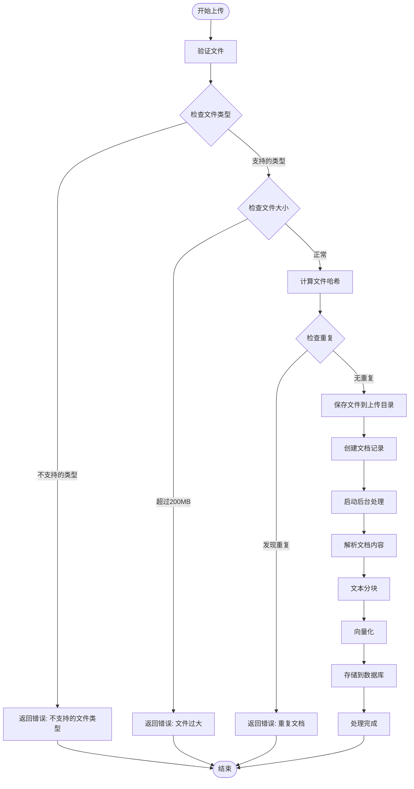
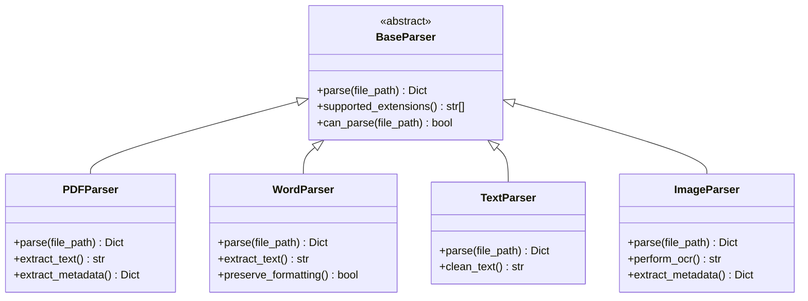
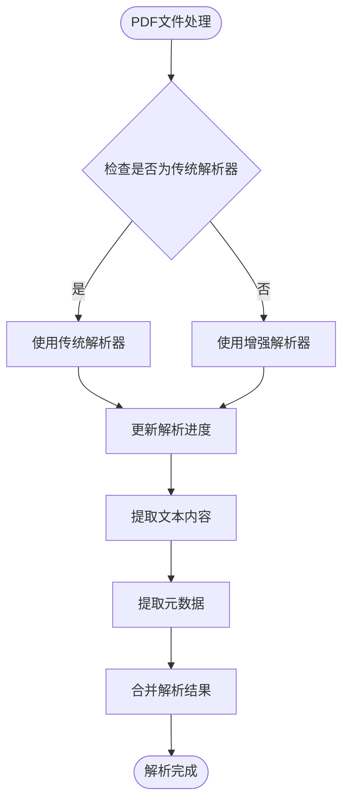
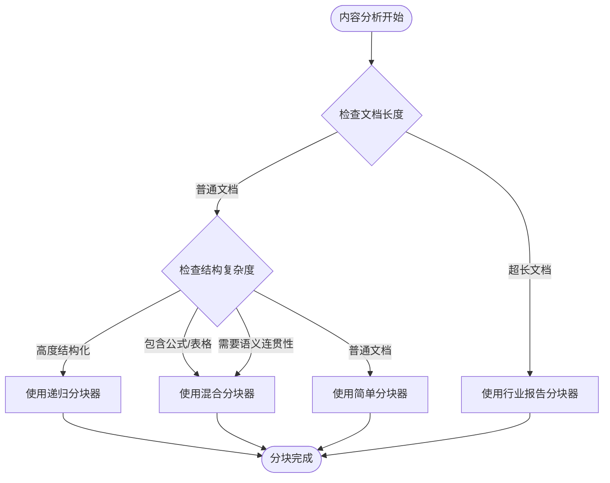
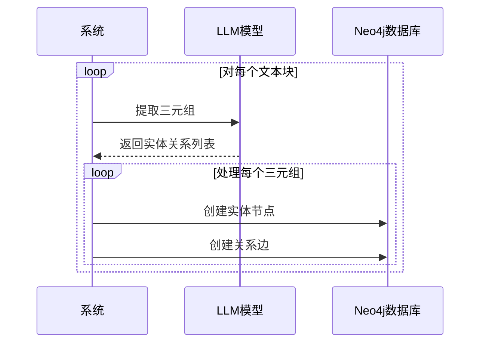
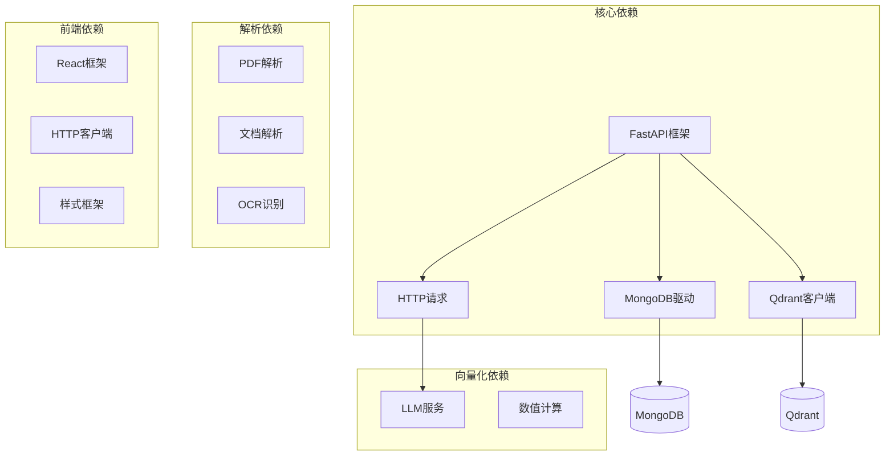

# 文档管理API

<cite>
**本文档引用的文件**
- [routers/documents.py](file://routers/documents.py)
- [database/mongodb.py](file://database/mongodb.py)
- [database/qdrant_client.py](file://database/qdrant_client.py)
- [embedding/embedding_service.py](file://embedding/embedding_service.py)
- [chunking/router/content_analyzer.py](file://chunking/router/content_analyzer.py)
- [parsers/parser_factory.py](file://parsers/parser_factory.py)
- [services/knowledge_extraction_service.py](file://services/knowledge_extraction_service.py)
- [web/components/document/DocumentUpload.tsx](file://web/components/document/DocumentUpload.tsx)
- [web/components/document/BatchDocumentUpload.tsx](file://web/components/document/BatchDocumentUpload.tsx)
- [web/components/document/DocumentProgress.tsx](file://web/components/document/DocumentProgress.tsx)
</cite>

## 目录
1. [简介](#简介)
2. [项目结构](#项目结构)
3. [核心组件](#核心组件)
4. [架构概览](#架构概览)
5. [详细组件分析](#详细组件分析)
6. [依赖关系分析](#依赖关系分析)
7. [性能考虑](#性能考虑)
8. [故障排除指南](#故障排除指南)
9. [结论](#结论)

## 简介

Advanced RAG文档管理API是一套完整的文档上传、管理和检索系统，支持多种文档格式的自动解析、分块和向量化处理。该系统采用异步处理架构，能够处理大型文档并提供实时进度反馈。

## 项目结构

**图表来源**
- [routers/documents.py:1-20](file://routers/documents.py#L1-L20)
- [database/mongodb.py:338-405](file://database/mongodb.py#L338-L405)
- [database/qdrant_client.py:18-544](file://database/qdrant_client.py#L18-L544)

## 核心组件

### 文档管理路由

文档管理API提供以下核心端点：

- **POST /api/documents/upload** - 多格式文档上传
- **GET /api/documents** - 获取文档列表
- **GET /api/documents/{doc_id}/preview** - 文档预览
- **DELETE /api/documents/{doc_id}** - 删除文档
- **GET /api/documents/{doc_id}/progress** - 获取处理进度
- **POST /api/documents/{doc_id}/retry** - 重新处理文档

### 数据存储组件

系统使用MongoDB存储文档元数据和分块信息，使用Qdrant存储向量数据。所有数据库操作都经过严格的错误处理和连接管理。

### 解析和分块引擎

系统内置智能解析器和分块路由器，能够根据文档内容特征自动选择最适合的处理策略。

**章节来源**
- [routers/documents.py:800-1514](file://routers/documents.py#L800-L1514)
- [database/mongodb.py:338-620](file://database/mongodb.py#L338-L620)
- [database/qdrant_client.py:18-140](file://database/qdrant_client.py#L18-L140)

## 架构概览

**图表来源**
- [routers/documents.py:274-798](file://routers/documents.py#L274-L798)
- [embedding/embedding_service.py:292-318](file://embedding/embedding_service.py#L292-L318)

## 详细组件分析

### 文档上传流程

文档上传是整个系统的核心入口，负责接收用户上传的文件并启动完整的处理管道。

#### 支持的文件格式

系统支持以下文件格式：
- **PDF文档**: `.pdf` - 支持扫描版和纯文本版
- **Word文档**: `.doc`, `.docx` - 自动转换处理
- **文本文件**: `.txt`, `.md`, `.markdown` - 纯文本解析
- **图片文件**: `.jpg`, `.jpeg`, `.png`, `.bmp`, `.webp`, `.tiff`, `.tif` - OCR处理
- **电子表格**: `.xlsx`, `.xls` - 结构化数据提取
- **演示文稿**: `.pptx` - 内容提取和分块

#### 文件大小限制

- **最大文件大小**: 200MB
- **流式处理**: 支持大文件的分块读取
- **内存优化**: 避免一次性加载大文件到内存

#### 重复内容检测

系统使用SHA-256哈希算法检测重复文档，防止相同内容的重复存储。

**图表来源**
- [routers/documents.py:800-978](file://routers/documents.py#L800-L978)

**章节来源**
- [routers/documents.py:800-978](file://routers/documents.py#L800-L978)

### 文档解析流程

系统采用智能解析策略，根据文件类型和内容特征选择最适合的解析器。

#### 解析器选择策略

**图表来源**
- [parsers/base.py:6-32](file://parsers/base.py#L6-L32)
- [parsers/parser_factory.py:32-58](file://parsers/parser_factory.py#L32-L58)

#### PDF特殊处理

对于PDF文件，系统提供双重解析策略：

1. **传统解析**: 使用PyPDF2提取文本内容
2. **进度显示解析**: 支持分页进度反馈的解析器

**图表来源**
- [routers/documents.py:48-187](file://routers/documents.py#L48-L187)

**章节来源**
- [routers/documents.py:48-187](file://routers/documents.py#L48-L187)
- [parsers/parser_factory.py:19-58](file://parsers/parser_factory.py#L19-L58)

### 文本分块策略

系统使用智能分块路由器，根据文档内容特征自动选择最适合的分块策略。

#### 分块策略选择

**图表来源**
- [chunking/router/content_analyzer.py:253-299](file://chunking/router/content_analyzer.py#L253-L299)

#### 分块器类型说明

| 分块器类型 | 适用场景 | 特点 |
|------------|----------|------|
| 递归分块器 | 代码、论文、结构化文档 | 精确的结构保持 |
| 混合分块器 | 包含公式/表格的文档 | 语义+规则结合 |
| 智能分块器 | 需要语义连贯性的长文档 | 语义理解能力 |
| 简单分块器 | 普通文本文档 | 快速高效 |
| 行业报告分块器 | 超长报告文档 | 结构化+token预算 |

**章节来源**
- [chunking/router/content_analyzer.py:12-300](file://chunking/router/content_analyzer.py#L12-L300)

### 向量化处理

系统使用Ollama服务进行文本向量化，支持多种嵌入模型。

#### 向量化配置

- **默认模型**: 从环境变量`OLLAMA_EMBEDDING_MODEL`获取
- **自动检测**: 如果未配置，系统会自动检测可用的嵌入模型
- **超时控制**: 每次请求最多等待120秒
- **重试机制**: 失败时自动重试，最多3次

#### 批处理优化

系统支持批量向量化处理，提高处理效率：

- **批处理大小**: 默认50个文本块
- **内存优化**: 避免一次性处理大量文本
- **进度反馈**: 实时更新向量化进度

**章节来源**
- [embedding/embedding_service.py:8-333](file://embedding/embedding_service.py#L8-L333)
- [routers/documents.py:519-552](file://routers/documents.py#L519-L552)

### 知识图谱构建

系统提供可选的知识图谱构建功能，用于抽取实体关系并存储到Neo4j数据库。

#### 实体关系抽取

**图表来源**
- [services/knowledge_extraction_service.py:147-228](file://services/knowledge_extraction_service.py#L147-L228)

**章节来源**
- [services/knowledge_extraction_service.py:12-229](file://services/knowledge_extraction_service.py#L12-L229)

### 存储架构

系统采用双存储架构，MongoDB存储结构化数据，Qdrant存储向量数据。

#### MongoDB存储

- **文档集合**: 存储文档元数据和处理状态
- **分块集合**: 存储文本块及其元数据
- **索引优化**: 为常用查询字段建立索引

#### Qdrant存储

- **向量集合**: 存储文档向量和元数据
- **批量插入**: 支持大规模向量数据的批量处理
- **自动重建**: 当维度不匹配时自动重建集合

**章节来源**
- [database/mongodb.py:338-620](file://database/mongodb.py#L338-L620)
- [database/qdrant_client.py:210-335](file://database/qdrant_client.py#L210-L335)

## 依赖关系分析

**图表来源**
- [routers/documents.py:1-20](file://routers/documents.py#L1-L20)
- [embedding/embedding_service.py:1-10](file://embedding/embedding_service.py#L1-L10)

### 外部服务集成

系统需要以下外部服务支持：

- **MongoDB**: 文档元数据和分块存储
- **Qdrant**: 向量数据存储和检索
- **Ollama**: 文本向量化服务
- **可选**: Neo4j - 知识图谱存储

**章节来源**
- [database/mongodb.py:92-204](file://database/mongodb.py#L92-L204)
- [database/qdrant_client.py:18-96](file://database/qdrant_client.py#L18-L96)

## 性能考虑

### 并发处理

系统采用异步处理架构，支持高并发文档处理：

- **后台任务**: 使用BackgroundTasks处理长时间运行的任务
- **线程池**: 解析和分块操作使用独立线程
- **连接池**: 数据库连接使用连接池优化性能

### 内存管理

- **流式处理**: 大文件采用流式读取，避免内存溢出
- **分块处理**: 文本分块和向量化采用分块策略
- **垃圾回收**: 及时释放临时文件和中间结果

### 缓存策略

- **进度缓存**: 文档处理进度实时更新到数据库
- **模型缓存**: 向量化模型信息缓存减少初始化开销
- **连接缓存**: 数据库连接池复用连接

## 故障排除指南

### 常见错误及解决方案

#### 文件上传错误

| 错误类型 | 可能原因 | 解决方案 |
|----------|----------|----------|
| 文件过大 | 超过200MB限制 | 压缩文件或拆分文档 |
| 格式不支持 | 文件扩展名不在支持列表 | 转换为支持的格式 |
| 重复文件 | 内容哈希相同 | 检查是否已存在相同文档 |
| 空文件 | 文件内容为空 | 检查源文件有效性 |

#### 解析失败

| 处理阶段 | 错误类型 | 解决方案 |
|----------|----------|----------|
| PDF解析 | 扫描版PDF | 使用OCR功能或重新扫描 |
| Word解析 | 格式损坏 | 修复文档或重新保存 |
| 图片解析 | OCR识别失败 | 检查图片质量或手动输入 |

#### 数据库连接问题

| 服务类型 | 常见问题 | 解决方案 |
|----------|----------|----------|
| MongoDB | 连接超时 | 检查网络连接和认证信息 |
| Qdrant | 服务不可用 | 检查Qdrant服务状态 |
| Neo4j | 连接失败 | 检查Neo4j配置和防火墙设置 |

### 监控和调试

系统提供完善的日志记录和进度监控功能：

- **详细日志**: 每个处理阶段都有详细的日志记录
- **进度跟踪**: 实时更新文档处理进度
- **错误报告**: 详细的错误信息和堆栈跟踪

**章节来源**
- [routers/documents.py:958-977](file://routers/documents.py#L958-L977)
- [database/mongodb.py:427-483](file://database/mongodb.py#L427-L483)

## 结论

Advanced RAG文档管理API提供了一套完整、高效的文档处理解决方案。系统具有以下优势：

1. **多格式支持**: 支持20多种文档格式的自动解析
2. **智能处理**: 根据文档特征自动选择最优处理策略
3. **高性能**: 采用异步处理和连接池优化性能
4. **可扩展性**: 模块化设计便于功能扩展
5. **可靠性**: 完善的错误处理和重试机制

该系统适用于各种文档管理场景，从个人知识库到企业级文档检索系统都能提供稳定可靠的服务。