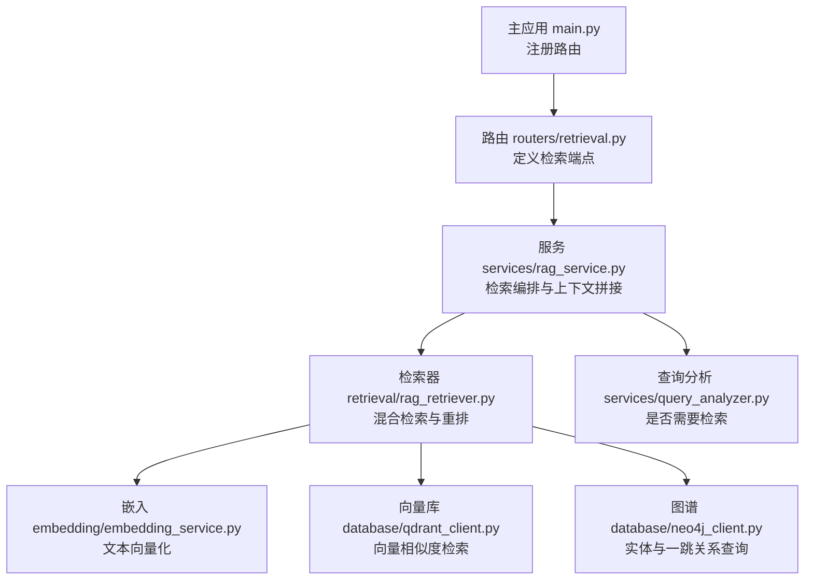
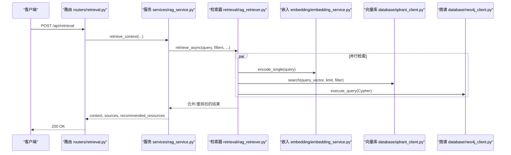
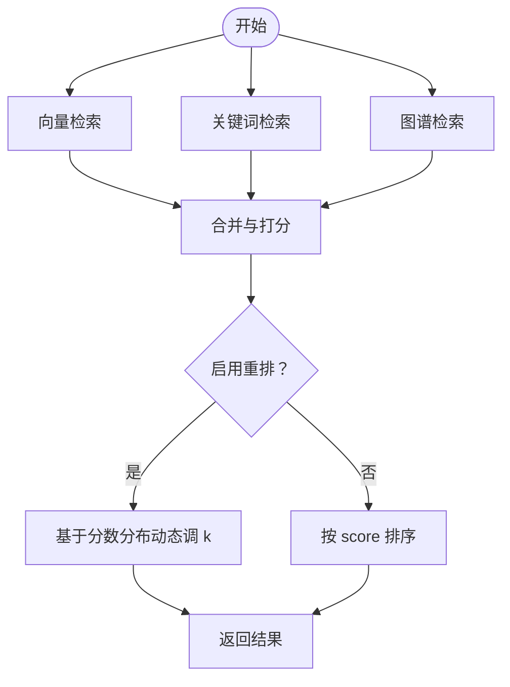
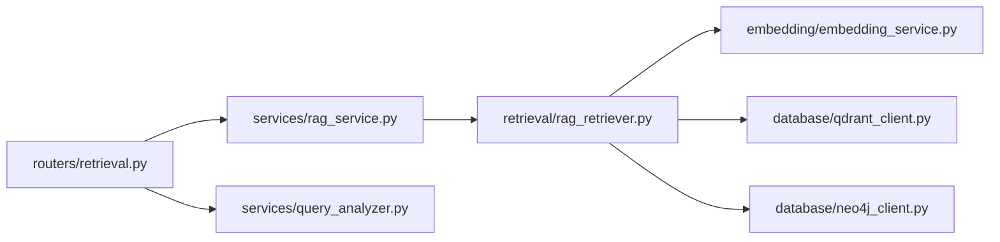

# 检索服务API

<cite>
**本文引用的文件**
- [main.py](file://main.py)
- [README.md](file://README.md)
- [routers/retrieval.py](file://routers/retrieval.py)
- [retrieval/rag_retriever.py](file://retrieval/rag_retriever.py)
- [services/rag_service.py](file://services/rag_service.py)
- [services/query_analyzer.py](file://services/query_analyzer.py)
- [embedding/embedding_service.py](file://embedding/embedding_service.py)
- [database/qdrant_client.py](file://database/qdrant_client.py)
- [database/neo4j_client.py](file://database/neo4j_client.py)
</cite>

## 目录
1. [简介](#简介)
2. [项目结构](#项目结构)
3. [核心组件](#核心组件)
4. [架构总览](#架构总览)
5. [详细组件分析](#详细组件分析)
6. [依赖分析](#依赖分析)
7. [性能考量](#性能考量)
8. [故障排查指南](#故障排查指南)
9. [结论](#结论)
10. [附录](#附录)

## 简介
本文件为 Advanced RAG 检索服务的 API 文档，聚焦检索相关端点与混合检索策略。当前系统提供如下检索相关端点：
- POST /api/retrieval/analyze：查询分析，判断是否需要检索上下文
- POST /api/retrieval：RAG 检索接口（混合检索：向量 + 关键词 + 图谱，可选重排）
- POST /api/retrieval/semantic-search：语义检索（向量检索）
- POST /api/retrieval/graph-query：图谱查询（实体与一跳关系）

文档将详细说明各端点的请求参数、搜索条件、返回结果格式，解释混合检索策略（向量相似度、关键词匹配、图谱关系的综合排序），并提供检索优化技巧与性能优化方法，包含查询示例与最佳实践。

## 项目结构
检索服务位于后端 FastAPI 应用中，路由注册在主应用入口，并由独立的路由器模块提供 API。检索核心由检索器与服务层协同完成，底层依赖向量数据库、图数据库与嵌入服务。

**图表来源**
- [main.py:90-99](file://main.py#L90-L99)
- [routers/retrieval.py:1-150](file://routers/retrieval.py#L1-L150)
- [services/rag_service.py:1-323](file://services/rag_service.py#L1-L323)
- [retrieval/rag_retriever.py:1-393](file://retrieval/rag_retriever.py#L1-L393)
- [embedding/embedding_service.py:1-333](file://embedding/embedding_service.py#L1-L333)
- [database/qdrant_client.py:1-544](file://database/qdrant_client.py#L1-L544)
- [database/neo4j_client.py:1-104](file://database/neo4j_client.py#L1-L104)

**章节来源**
- [main.py:90-99](file://main.py#L90-L99)
- [README.md:189-227](file://README.md#L189-L227)

## 核心组件
- 路由器：定义检索相关端点，负责请求模型校验与调用服务层
- RAG 服务：动态参数调整、多集合检索、邻居扩展、上下文拼接与去重
- RAG 检索器：并行执行向量检索、关键词检索、图谱检索，合并与重排
- 嵌入服务：基于 Ollama 的文本向量化
- Qdrant 客户端：向量相似度检索与集合管理
- Neo4j 客户端：实体与一跳关系查询
- 查询分析器：判断是否需要检索上下文

**章节来源**
- [routers/retrieval.py:14-149](file://routers/retrieval.py#L14-L149)
- [services/rag_service.py:8-323](file://services/rag_service.py#L8-L323)
- [retrieval/rag_retriever.py:17-393](file://retrieval/rag_retriever.py#L17-L393)
- [embedding/embedding_service.py:8-333](file://embedding/embedding_service.py#L8-L333)
- [database/qdrant_client.py:18-544](file://database/qdrant_client.py#L18-L544)
- [database/neo4j_client.py:6-104](file://database/neo4j_client.py#L6-L104)
- [services/query_analyzer.py:9-163](file://services/query_analyzer.py#L9-L163)

## 架构总览
检索流程概览：客户端请求进入路由层，路由层调用服务层，服务层协调检索器进行多路检索与重排，最终拼接上下文与来源信息返回。

**图表来源**
- [routers/retrieval.py:97-149](file://routers/retrieval.py#L97-L149)
- [services/rag_service.py:34-266](file://services/rag_service.py#L34-L266)
- [retrieval/rag_retriever.py:89-137](file://retrieval/rag_retriever.py#L89-L137)
- [embedding/embedding_service.py:316-318](file://embedding/embedding_service.py#L316-L318)
- [database/qdrant_client.py:336-413](file://database/qdrant_client.py#L336-L413)
- [database/neo4j_client.py:40-62](file://database/neo4j_client.py#L40-L62)

## 详细组件分析

### 端点：POST /api/retrieval/analyze
- 作用：分析查询是否需要检索上下文
- 请求体
  - query: string（必填）
- 响应体
  - need_retrieval: boolean
  - reason: string
  - confidence: string（枚举："high", "medium", "low"；默认 "medium"）
- 行为
  - 读取运行时配置，若关闭查询分析模块则默认需要检索
  - 使用查询分析器进行判断（线程池中执行同步方法）
  - 失败时默认需要检索（安全策略）
- 示例
  - 请求：{"query": "如何选择合适的温度传感器？"}
  - 响应：{"need_retrieval": true, "reason": "问题涉及具体传感器知识", "confidence": "high"}

**章节来源**
- [routers/retrieval.py:44-94](file://routers/retrieval.py#L44-L94)
- [services/query_analyzer.py:38-157](file://services/query_analyzer.py#L38-L157)

### 端点：POST /api/retrieval
- 作用：RAG 检索接口（混合检索 + 上下文拼接）
- 请求体
  - query: string（必填）
  - document_id: string（可选，按文档过滤）
  - top_k: number（可选，默认 5）
  - assistant_id: string（可选，用于获取集合名称）
  - knowledge_space_ids: string[]（可选，指定一个或多个知识空间）
  - conversation_id: string（可选，同时检索对话专用向量空间）
- 响应体
  - context: string（拼接后的上下文文本）
  - sources: array（来源信息数组）
    - 每项包含：chunk_id, document_id, file_id, conversation_id, score, retrieval_type, document_title, file_type, status, is_conversation_attachment
  - retrieval_count: number（来源总数）
  - recommended_resources: array（推荐资源，当前为空）
- 行为
  - 解析知识空间集合名称，若未提供则回退到助手集合
  - 并行检索多个集合，合并结果并按分数排序
  - 邻居扩展：对命中 chunk 拉取前后窗口补齐，控制总 token 预算
  - 去重：同一文档仅保留最高分 chunk
  - 返回上下文、来源与推荐资源
- 示例
  - 请求：{"query": "传感器的分类与原理", "knowledge_space_ids": ["..."]}
  - 响应：包含 context、sources（按分数降序）、retrieval_count

**章节来源**
- [routers/retrieval.py:14-42](file://routers/retrieval.py#L14-L42)
- [routers/retrieval.py:97-149](file://routers/retrieval.py#L97-L149)
- [services/rag_service.py:34-266](file://services/rag_service.py#L34-L266)

### 端点：POST /api/retrieval/semantic-search
- 作用：语义检索（向量检索）
- 请求体
  - query: string（必填）
  - document_id: string（可选，按文档过滤）
  - top_k: number（可选，默认 5）
  - collection_name: string（可选，指定集合名称）
- 行为
  - 使用嵌入服务对查询进行向量化
  - 调用 Qdrant 客户端进行相似度检索
  - 返回匹配的 chunk 与分数
- 示例
  - 请求：{"query": "光电传感器的工作原理", "top_k": 10}
  - 响应：包含匹配的 chunk 列表（含 text、score、metadata 等）

**章节来源**
- [retrieval/rag_retriever.py:176-204](file://retrieval/rag_retriever.py#L176-L204)
- [embedding/embedding_service.py:316-318](file://embedding/embedding_service.py#L316-L318)
- [database/qdrant_client.py:336-413](file://database/qdrant_client.py#L336-L413)

### 端点：POST /api/retrieval/graph-query
- 作用：图谱查询（实体与一跳关系）
- 请求体
  - query: string（必填）
  - document_id: string（可选，按文档过滤）
- 行为
  - 从查询中抽取实体
  - 对每个实体查询一跳邻居关系
  - 将路径组合为文本，构造图谱结果
- 示例
  - 请求：{"query": "温度传感器与压力传感器的关系"}
  - 响应：包含图谱上下文（实体-关系-实体）与 chunk_id 列表

**章节来源**
- [retrieval/rag_retriever.py:242-326](file://retrieval/rag_retriever.py#L242-L326)
- [database/neo4j_client.py:40-62](file://database/neo4j_client.py#L40-L62)

### 混合检索策略与综合排序
- 检索策略
  - 向量检索：基于 Qdrant 的向量相似度搜索
  - 关键词检索：对指定文档进行关键词匹配（全局关键词检索跳过）
  - 图谱检索：抽取实体并查询一跳关系，生成知识文本
- 合并与打分
  - 向量结果作为基础，关键词结果按命中关键词数比例提升分数并标记为混合/关键词
  - 图谱结果单独加入，初始分数较高
  - 合并后按 score 降序排序
- 重排与动态 k
  - 可选启用 CrossEncoder 重排，控制送入重排的最大 token 数
  - 基于重排分数分布在线动态调整最终返回数量 k，兼顾召回与精度

**图表来源**
- [retrieval/rag_retriever.py:115-137](file://retrieval/rag_retriever.py#L115-L137)
- [retrieval/rag_retriever.py:328-363](file://retrieval/rag_retriever.py#L328-L363)
- [retrieval/rag_retriever.py:139-167](file://retrieval/rag_retriever.py#L139-L167)
- [retrieval/rag_retriever.py:365-391](file://retrieval/rag_retriever.py#L365-L391)

**章节来源**
- [retrieval/rag_retriever.py:17-51](file://retrieval/rag_retriever.py#L17-L51)
- [retrieval/rag_retriever.py:115-137](file://retrieval/rag_retriever.py#L115-L137)
- [retrieval/rag_retriever.py:328-391](file://retrieval/rag_retriever.py#L328-L391)

### 查询预处理、结果过滤与相关性评分
- 查询预处理
  - 查询分析：判断是否需要检索，失败时默认需要检索
  - 动态检索参数：根据查询长度、是否对比/列举/条款类问题调整 prefetch_k 与 final_k
- 结果过滤
  - 向量检索：支持按 document_id 过滤
  - 关键词检索：仅在指定文档时执行，避免全局扫描
  - 图谱检索：按实体查询一跳关系，支持按文档过滤
- 相关性评分
  - 向量检索：返回相似度分数
  - 关键词检索：按命中关键词比例打分
  - 图谱检索：给定较高初始分
  - 重排：使用 CrossEncoder 对 query 与 doc 文本对进行打分

**章节来源**
- [services/query_analyzer.py:38-157](file://services/query_analyzer.py#L38-L157)
- [services/rag_service.py:11-32](file://services/rag_service.py#L11-L32)
- [retrieval/rag_retriever.py:176-240](file://retrieval/rag_retriever.py#L176-L240)
- [retrieval/rag_retriever.py:242-326](file://retrieval/rag_retriever.py#L242-L326)
- [retrieval/rag_retriever.py:365-391](file://retrieval/rag_retriever.py#L365-L391)

## 依赖分析
- 组件耦合
  - 路由器依赖服务层；服务层依赖检索器；检索器依赖嵌入服务、Qdrant 与 Neo4j 客户端
  - 查询分析器独立于检索链路，用于前置判断
- 外部依赖
  - Ollama：嵌入向量化与查询分析
  - Qdrant：向量相似度检索
  - Neo4j：实体与关系查询
- 运行时开关
  - 重排与图谱检索可通过运行时配置开关控制

**图表来源**
- [routers/retrieval.py:1-150](file://routers/retrieval.py#L1-L150)
- [services/rag_service.py:1-323](file://services/rag_service.py#L1-L323)
- [retrieval/rag_retriever.py:1-393](file://retrieval/rag_retriever.py#L1-L393)
- [embedding/embedding_service.py:1-333](file://embedding/embedding_service.py#L1-L333)
- [database/qdrant_client.py:1-544](file://database/qdrant_client.py#L1-L544)
- [database/neo4j_client.py:1-104](file://database/neo4j_client.py#L1-L104)
- [services/query_analyzer.py:1-163](file://services/query_analyzer.py#L1-L163)

**章节来源**
- [routers/retrieval.py:1-150](file://routers/retrieval.py#L1-L150)
- [services/rag_service.py:58-68](file://services/rag_service.py#L58-L68)
- [retrieval/rag_retriever.py:102-113](file://retrieval/rag_retriever.py#L102-L113)

## 性能考量
- 并发与并行
  - 检索器对三种检索策略采用 asyncio.gather 并行执行
  - 服务层对多个知识空间集合并行检索
- 动态参数
  - 根据查询特征动态调整 prefetch_k 与 final_k，平衡召回与精度
- 重排与预算
  - 重排时限制送入 CrossEncoder 的 token 数，避免长文本导致延迟或崩溃
- 去重与邻居扩展
  - 去重同一文档最高分 chunk，避免重复
  - 邻居扩展窗口较小，减少上下文膨胀
- 向量库与图谱
  - Qdrant 使用 gRPC 连接与连接复用，降低开销
  - Neo4j 查询限制返回数量，避免过多结果

**章节来源**
- [retrieval/rag_retriever.py:115-122](file://retrieval/rag_retriever.py#L115-L122)
- [services/rag_service.py:101-117](file://services/rag_service.py#L101-L117)
- [services/rag_service.py:128-205](file://services/rag_service.py#L128-L205)
- [retrieval/rag_retriever.py:376-387](file://retrieval/rag_retriever.py#L376-L387)
- [database/qdrant_client.py:66-96](file://database/qdrant_client.py#L66-L96)

## 故障排查指南
- 查询分析失败
  - 现象：返回默认需要检索
  - 处理：检查 Ollama 服务连通性与分析模型可用性
- 向量检索失败
  - 现象：返回空结果或异常
  - 处理：确认 Qdrant 连接、集合存在与向量维度一致
- 图谱检索失败
  - 现象：返回空结果
  - 处理：检查 Neo4j 连接、URI 替换与查询 Cypher 正确性
- 重排模型加载失败
  - 现象：自动禁用重排
  - 处理：检查环境变量与模型可用性
- 全局关键词检索跳过
  - 现象：未按全局执行关键词匹配
  - 处理：仅在指定文档时执行关键词匹配，避免性能问题

**章节来源**
- [routers/retrieval.py:87-94](file://routers/retrieval.py#L87-L94)
- [retrieval/rag_retriever.py:202-204](file://retrieval/rag_retriever.py#L202-L204)
- [retrieval/rag_retriever.py:324-326](file://retrieval/rag_retriever.py#L324-L326)
- [retrieval/rag_retriever.py:64-69](file://retrieval/rag_retriever.py#L64-L69)
- [retrieval/rag_retriever.py:214-215](file://retrieval/rag_retriever.py#L214-L215)

## 结论
本检索服务通过混合检索策略（向量、关键词、图谱）与可选重排，在保证召回的同时提升相关性。服务层提供动态参数与上下文拼接能力，底层依赖 Qdrant 与 Neo4j 实现高效检索与知识图谱增强。结合查询分析与运行时开关，系统具备良好的可配置性与鲁棒性。开发者可据此构建高性能、可扩展的检索应用。

## 附录
- 环境变量与配置要点
  - Ollama：OLLAMA_BASE_URL、OLLAMA_EMBEDDING_MODEL、OLLAMA_ANALYSIS_MODEL
  - Qdrant：QDRANT_URL、QDRANT_API_KEY、QDRANT_TIMEOUT、QDRANT_GRPC_PORT
  - Neo4j：NEO4J_URI、NEO4J_USER、NEO4J_PASSWORD
  - 运行时开关：ENABLE_RERANKER、RERANKER_MODEL、RERANKER_DEVICE、DYNK_MIN、DYNK_MAX、DYNK_GAP_HIGH、DYNK_GAP_LOW
- 最佳实践
  - 使用 /api/retrieval/analyze 判断是否需要检索，减少不必要的向量/图谱查询
  - 指定 document_id 或 knowledge_space_ids 以缩小检索范围
  - 合理设置 top_k 与运行时开关，平衡性能与质量
  - 对长查询启用重排并控制 token 预算，避免超时或崩溃

**章节来源**
- [README.md:125-166](file://README.md#L125-L166)
- [retrieval/rag_retriever.py:14-51](file://retrieval/rag_retriever.py#L14-L51)
- [services/rag_service.py:11-32](file://services/rag_service.py#L11-L32)