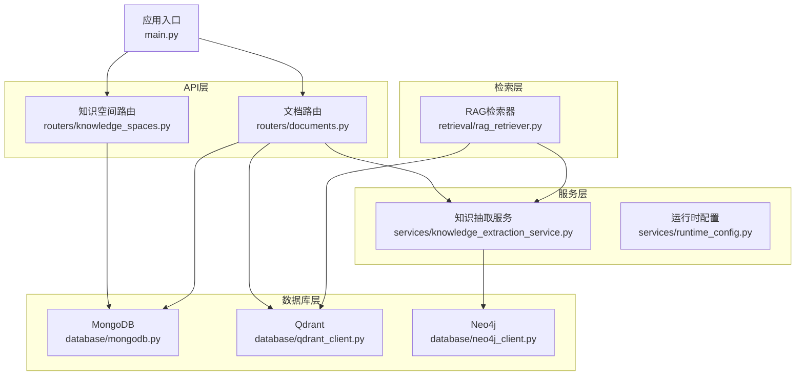
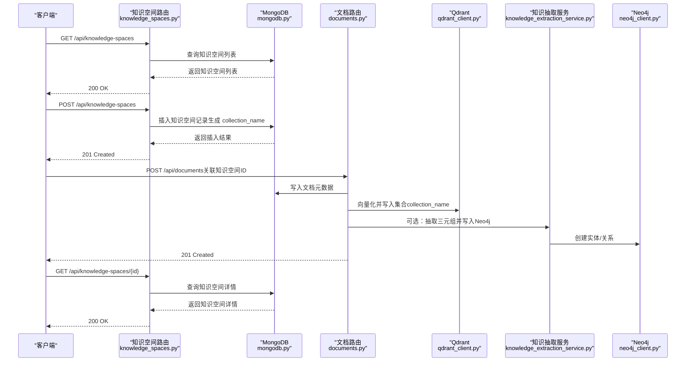
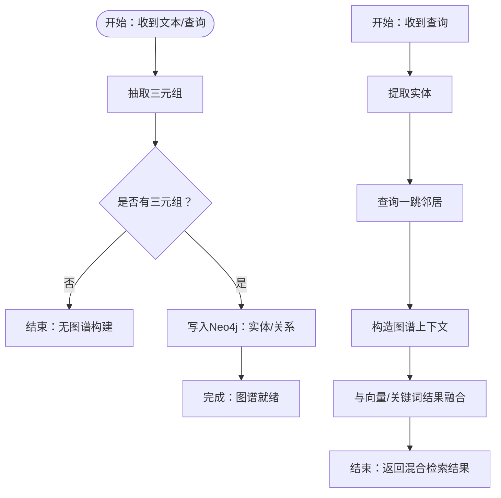
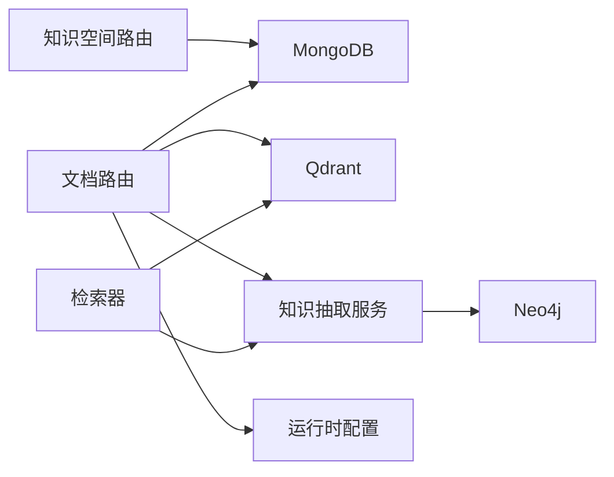

# 知识空间API

<cite>
**本文引用的文件**
- [knowledge_spaces.py](file://routers/knowledge_spaces.py)
- [mongodb.py](file://database/mongodb.py)
- [neo4j_client.py](file://database/neo4j_client.py)
- [qdrant_client.py](file://database/qdrant_client.py)
- [knowledge_extraction_service.py](file://services/knowledge_extraction_service.py)
- [rag_retriever.py](file://retrieval/rag_retriever.py)
- [documents.py](file://routers/documents.py)
- [runtime_config.py](file://services/runtime_config.py)
- [main.py](file://main.py)
- [README.md](file://README.md)
</cite>

## 目录
1. [简介](#简介)
2. [项目结构](#项目结构)
3. [核心组件](#核心组件)
4. [架构总览](#架构总览)
5. [详细组件分析](#详细组件分析)
6. [依赖分析](#依赖分析)
7. [性能考虑](#性能考虑)
8. [故障排查指南](#故障排查指南)
9. [结论](#结论)
10. [附录](#附录)

## 简介
本文件为 Advanced RAG 系统的知识空间 API 文档，聚焦知识空间的创建、查询、更新与删除，以及知识空间与文档的关联关系。知识空间是系统中独立的语义域，每个知识空间拥有独立的向量集合（Qdrant collection_name），并可选地与知识图谱（Neo4j）集成，实现图谱构建、关系抽取与知识推理。

知识空间的核心价值在于：
- 将不同主题或业务域的文档与向量索引隔离，提升检索准确性与可维护性
- 通过可选的图谱构建能力，实现实体-关系抽取与推理增强
- 与检索流程结合，支持向量、关键词与图谱的混合检索

## 项目结构
知识空间 API 位于 routers 层，通过 FastAPI 路由暴露，并依赖数据库层（MongoDB、Qdrant、Neo4j）与服务层（知识抽取服务）协同工作。

图表来源
- [knowledge_spaces.py:1-140](file://routers/knowledge_spaces.py#L1-L140)
- [documents.py:1-200](file://routers/documents.py#L1-L200)
- [knowledge_extraction_service.py:1-229](file://services/knowledge_extraction_service.py#L1-L229)
- [qdrant_client.py:1-544](file://database/qdrant_client.py#L1-L544)
- [neo4j_client.py:1-104](file://database/neo4j_client.py#L1-L104)
- [rag_retriever.py:243-318](file://retrieval/rag_retriever.py#L243-L318)
- [main.py:90-99](file://main.py#L90-L99)

章节来源
- [main.py:90-99](file://main.py#L90-L99)
- [README.md:189-199](file://README.md#L189-L199)

## 核心组件
- 知识空间路由：提供知识空间列表查询、创建、更新、删除等端点
- MongoDB：持久化知识空间元数据（名称、描述、集合名、时间戳等）
- Qdrant：为每个知识空间维护独立的向量集合，支撑向量检索
- Neo4j：可选的图谱构建与查询，支持实体-关系抽取与推理
- 知识抽取服务：负责三元组抽取、实体提取与图谱入库
- 运行时配置：控制知识抽取与检索的并发、超时等参数
- 检索器：在检索阶段结合图谱与向量进行混合检索

章节来源
- [knowledge_spaces.py:24-139](file://routers/knowledge_spaces.py#L24-L139)
- [mongodb.py:92-223](file://database/mongodb.py#L92-L223)
- [qdrant_client.py:18-544](file://database/qdrant_client.py#L18-L544)
- [neo4j_client.py:6-104](file://database/neo4j_client.py#L6-L104)
- [knowledge_extraction_service.py:12-229](file://services/knowledge_extraction_service.py#L12-L229)
- [runtime_config.py:15-218](file://services/runtime_config.py#L15-L218)
- [rag_retriever.py:243-318](file://retrieval/rag_retriever.py#L243-L318)

## 架构总览
知识空间 API 的端到端流程如下：

图表来源
- [knowledge_spaces.py:50-139](file://routers/knowledge_spaces.py#L50-L139)
- [mongodb.py:196-223](file://database/mongodb.py#L196-L223)
- [documents.py:1-200](file://routers/documents.py#L1-L200)
- [qdrant_client.py:210-444](file://database/qdrant_client.py#L210-L444)
- [knowledge_extraction_service.py:147-229](file://services/knowledge_extraction_service.py#L147-L229)
- [neo4j_client.py:64-101](file://database/neo4j_client.py#L64-L101)

## 详细组件分析

### 知识空间模型与端点
- GET /api/knowledge-spaces
  - 查询参数：skip、limit
  - 返回：知识空间列表与总数
  - 数据来源：MongoDB 集合 knowledge_spaces
- POST /api/knowledge-spaces
  - 请求体：name、description
  - 生成规则：name 去重（name_key）、collection_name（kb_前缀 + slug + uuid 截断）
  - 返回：新建知识空间的完整信息
- GET /api/knowledge-spaces/{id}
  - 返回：指定知识空间详情
- PUT /api/knowledge-spaces/{id}
  - 当前仓库未实现该端点（405 Method Not Allowed）
- DELETE /api/knowledge-spaces/{id}
  - 当前仓库未实现该端点（405 Method Not Allowed）

章节来源
- [knowledge_spaces.py:50-139](file://routers/knowledge_spaces.py#L50-L139)
- [mongodb.py:196-223](file://database/mongodb.py#L196-L223)

### 知识空间与文档的关联关系
- 文档入库时可选择关联知识空间 ID，系统据此确定向量集合名（collection_name）
- 文档元数据中同时保留兼容字段 assistant_id 与新字段 knowledge_space_id
- 知识抽取服务在构建图谱时，可将三元组与文档/分块 ID 关联，便于溯源与过滤

章节来源
- [documents.py:586-605](file://routers/documents.py#L586-L605)
- [mongodb.py:338-574](file://database/mongodb.py#L338-L574)

### 图谱构建与知识推理
- 知识抽取服务负责：
  - 三元组抽取（实体-关系-实体）
  - 实体提取（用于检索增强）
  - Neo4j 图谱入库（实体 MERGE、关系创建）
- 检索器在图谱检索阶段：
  - 从查询中提取实体
  - 查询一跳邻居并构造上下文
  - 与向量检索结果融合

图表来源
- [knowledge_extraction_service.py:36-229](file://services/knowledge_extraction_service.py#L36-L229)
- [rag_retriever.py:243-318](file://retrieval/rag_retriever.py#L243-L318)
- [neo4j_client.py:64-101](file://database/neo4j_client.py#L64-L101)

### 知识空间属性定义
- id：知识空间唯一标识
- name：知识空间名称（唯一，大小写不敏感键 name_key）
- description：描述（可选）
- collection_name：向量集合名（kb_前缀 + slug + uuid 截断）
- is_default：是否默认（当前创建接口固定为 false）
- created_at / updated_at：ISO 时间字符串

章节来源
- [knowledge_spaces.py:24-47](file://routers/knowledge_spaces.py#L24-L47)
- [knowledge_spaces.py:94-130](file://routers/knowledge_spaces.py#L94-L130)

### 端点定义与示例

- GET /api/knowledge-spaces
  - 功能：分页获取知识空间列表
  - 示例请求：GET /api/knowledge-spaces?skip=0&limit=100
  - 响应：包含 knowledge_spaces 数组与 total
- POST /api/knowledge-spaces
  - 功能：创建知识空间
  - 请求体示例：{"name":"物理课程","description":"物理相关资料"}
  - 响应：201 Created，返回新建知识空间详情
- GET /api/knowledge-spaces/{id}
  - 功能：获取指定知识空间详情
  - 响应：200 OK，返回知识空间详情
- PUT /api/knowledge-spaces/{id}
  - 功能：更新知识空间（当前未实现）
  - 响应：405 Method Not Allowed
- DELETE /api/knowledge-spaces/{id}
  - 功能：删除知识空间（当前未实现）
  - 响应：405 Method Not Allowed

章节来源
- [knowledge_spaces.py:50-139](file://routers/knowledge_spaces.py#L50-L139)

### 知识空间与文档的关系管理
- 文档入库时可选择关联知识空间 ID，系统据此确定向量集合名
- 文档元数据中同时保留 assistant_id 与 knowledge_space_id 字段，保证向后兼容
- 知识抽取服务在构建图谱时，可将三元组与文档/分块 ID 关联，便于溯源与过滤

章节来源
- [documents.py:586-605](file://routers/documents.py#L586-L605)
- [knowledge_extraction_service.py:177-212](file://services/knowledge_extraction_service.py#L177-L212)

### 知识空间创建与维护示例
- 场景一：创建“物理课程”知识空间，随后上传物理讲义，系统自动：
  - 将讲义分块并向量化，写入集合 kb_wu_li_xue_ke_cheng_{uuid}
  - 可选：抽取三元组并写入 Neo4j，形成“物理概念-关系-物理现象”的图谱
- 场景二：在检索阶段，系统结合：
  - 向量相似度检索（Qdrant）
  - 关键词检索
  - 图谱一跳邻居检索（Neo4j）
  - 并对结果进行重排，输出更准确的答案

章节来源
- [knowledge_spaces.py:101-130](file://routers/knowledge_spaces.py#L101-L130)
- [qdrant_client.py:210-444](file://database/qdrant_client.py#L210-L444)
- [knowledge_extraction_service.py:147-229](file://services/knowledge_extraction_service.py#L147-L229)
- [rag_retriever.py:243-318](file://retrieval/rag_retriever.py#L243-L318)

## 依赖分析
- 知识空间路由依赖 MongoDB 存储元数据
- 文档入库流程依赖 Qdrant 向量存储与可选 Neo4j 图谱存储
- 知识抽取服务依赖 Ollama 与 Neo4j
- 运行时配置控制知识抽取并发与超时，影响入库性能

图表来源
- [knowledge_spaces.py:14-18](file://routers/knowledge_spaces.py#L14-L18)
- [documents.py:1-20](file://routers/documents.py#L1-L20)
- [qdrant_client.py:1-544](file://database/qdrant_client.py#L1-L544)
- [knowledge_extraction_service.py:1-229](file://services/knowledge_extraction_service.py#L1-L229)
- [neo4j_client.py:1-104](file://database/neo4j_client.py#L1-L104)
- [runtime_config.py:1-218](file://services/runtime_config.py#L1-L218)
- [rag_retriever.py:243-318](file://retrieval/rag_retriever.py#L243-L318)

## 性能考虑
- MongoDB 连接池参数（最大池大小、最小池大小、超时）直接影响高并发下的稳定性与延迟
- Qdrant 插入与查询默认使用 gRPC，具备连接复用与更好的吞吐表现
- 知识抽取服务支持并发控制与超时设置，通过运行时配置调节
- 检索阶段建议结合向量与图谱，合理设置阈值与过滤条件，减少无效计算

章节来源
- [mongodb.py:122-151](file://database/mongodb.py#L122-L151)
- [qdrant_client.py:66-96](file://database/qdrant_client.py#L66-L96)
- [runtime_config.py:25-83](file://services/runtime_config.py#L25-L83)

## 故障排查指南
- MongoDB 连接失败
  - 现象：首次请求时报 503，或知识空间列表查询异常
  - 排查：检查 MONGODB_URI/MONGODB_HOST 等环境变量，确认服务可达
- Qdrant 连接失败
  - 现象：向量插入/查询报错，或健康检查失败
  - 排查：确认 QDRANT_URL、端口与网络连通性；必要时切换 gRPC 端口
- Neo4j 连接失败
  - 现象：知识抽取阶段跳过或报错
  - 排查：确认 NEO4J_URI、账号密码与容器内地址映射；可设置环境变量禁用图谱构建
- 知识抽取 JSON 解析失败
  - 现象：抽取结果为空或警告
  - 排查：检查 LLM 输出格式，服务内置多种容错与修复策略

章节来源
- [mongodb.py:186-223](file://database/mongodb.py#L186-L223)
- [qdrant_client.py:97-139](file://database/qdrant_client.py#L97-L139)
- [knowledge_extraction_service.py:71-106](file://services/knowledge_extraction_service.py#L71-L106)
- [neo4j_client.py:16-33](file://database/neo4j_client.py#L16-L33)

## 结论
知识空间 API 为 Advanced RAG 提供了清晰的语义域隔离能力，配合 Qdrant 向量检索与可选 Neo4j 图谱，能够实现从“文档入库”到“检索增强”的完整闭环。通过合理的参数配置与并发控制，可在保证性能的同时扩展到更大规模的知识库。

## 附录

### API 端点一览
- GET /api/knowledge-spaces
- POST /api/knowledge-spaces
- GET /api/knowledge-spaces/{id}
- PUT /api/knowledge-spaces/{id}（未实现）
- DELETE /api/knowledge-spaces/{id}（未实现）

章节来源
- [README.md:189-199](file://README.md#L189-L199)
- [knowledge_spaces.py:50-139](file://routers/knowledge_spaces.py#L50-L139)