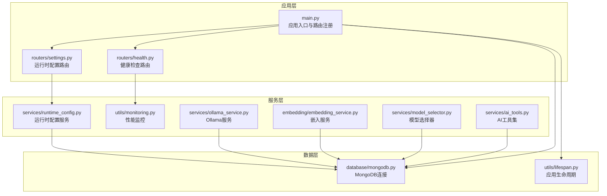
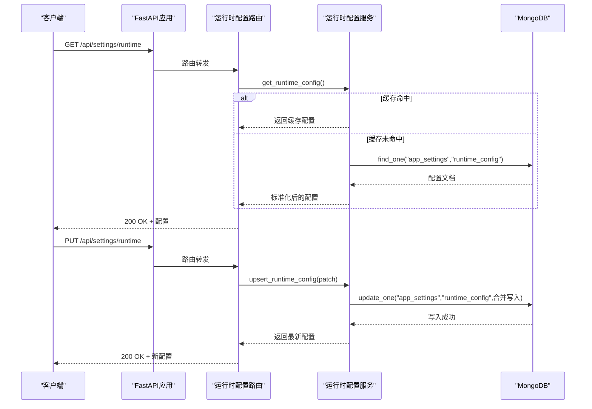
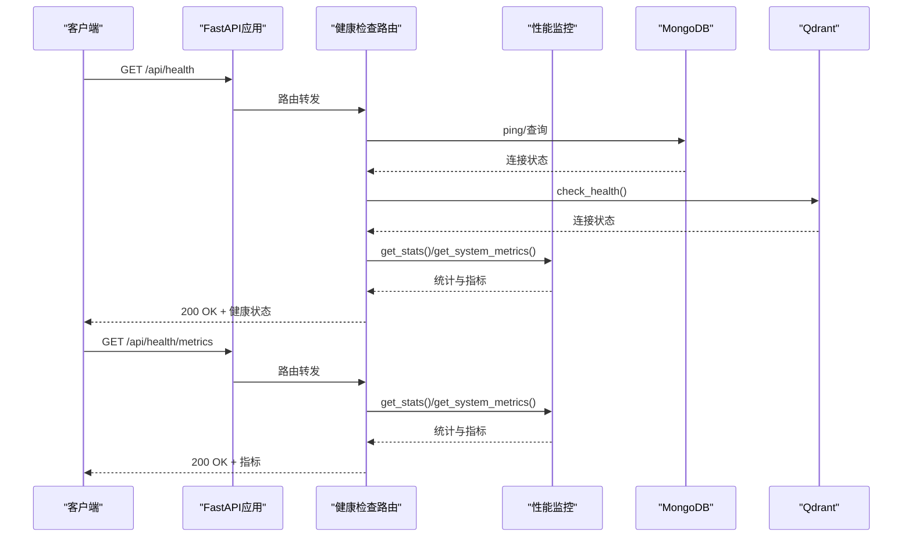
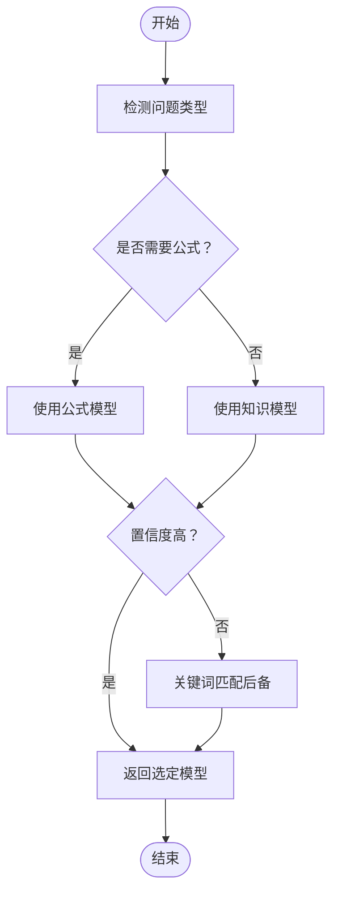
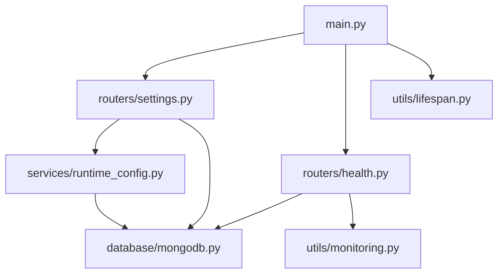

# 系统设置API

<cite>
**本文档引用的文件**
- [main.py](file://main.py)
- [settings.py](file://routers/settings.py)
- [runtime_config.py](file://services/runtime_config.py)
- [health.py](file://routers/health.py)
- [monitoring.py](file://utils/monitoring.py)
- [mongodb.py](file://database/mongodb.py)
- [lifespan.py](file://utils/lifespan.py)
- [ollama_service.py](file://services/ollama_service.py)
- [embedding_service.py](file://embedding/embedding_service.py)
- [model_selector.py](file://services/model_selector.py)
- [ai_tools.py](file://services/ai_tools.py)
</cite>

## 目录
1. [简介](#简介)
2. [项目结构](#项目结构)
3. [核心组件](#核心组件)
4. [架构概览](#架构概览)
5. [详细组件分析](#详细组件分析)
6. [依赖关系分析](#依赖关系分析)
7. [性能考量](#性能考量)
8. [故障排除指南](#故障排除指南)
9. [结论](#结论)
10. [附录](#附录)

## 简介
本文件为 Advanced RAG 系统的系统设置 API 文档，重点覆盖运行时配置管理、模型选择与切换、系统监控与诊断等功能。文档围绕以下端点展开：
- GET /api/settings/runtime：获取运行时配置
- PUT /api/settings/runtime：更新运行时配置
- GET /api/health：健康检查
- GET /api/health/metrics：性能指标
- GET /api/health/liveness：存活探针
- GET /api/health/readiness：就绪探针

同时，文档解释了运行时配置的动态更新机制（热重载与生效策略）、系统配置项（数据库连接、AI 服务配置、文件存储设置、性能参数）以及最佳实践（配置备份、版本管理、安全考虑）。

## 项目结构
系统采用 FastAPI 应用入口集中注册路由的方式，设置相关功能集中在 routers/settings.py 与 services/runtime_config.py 中实现，数据库连接通过 database/mongodb.py 提供，健康检查与性能监控分别在 routers/health.py 与 utils/monitoring.py 中实现。



**图表来源**
- [main.py:90-99](file://main.py#L90-L99)
- [settings.py:15-65](file://routers/settings.py#L15-L65)
- [runtime_config.py:1-218](file://services/runtime_config.py#L1-L218)
- [health.py:12-135](file://routers/health.py#L12-L135)
- [monitoring.py:13-185](file://utils/monitoring.py#L13-L185)
- [mongodb.py:92-224](file://database/mongodb.py#L92-L224)
- [lifespan.py:28-93](file://utils/lifespan.py#L28-L93)

**章节来源**
- [main.py:90-99](file://main.py#L90-L99)
- [settings.py:15-65](file://routers/settings.py#L15-L65)
- [runtime_config.py:1-218](file://services/runtime_config.py#L1-L218)
- [health.py:12-135](file://routers/health.py#L12-L135)
- [monitoring.py:13-185](file://utils/monitoring.py#L13-L185)
- [mongodb.py:92-224](file://database/mongodb.py#L92-L224)
- [lifespan.py:28-93](file://utils/lifespan.py#L28-L93)

## 核心组件
- 运行时配置服务：提供运行时配置的读取、合并、标准化与持久化，支持低/高/自定义三种模式，内置模块开关与性能参数。
- 健康检查与性能监控：提供健康检查端点、存活/就绪探针以及性能指标收集。
- 数据库连接：统一的 MongoDB 连接封装，支持异步与同步客户端，连接池参数可配置。
- 应用生命周期：启动时连接数据库并进行必要的初始化，失败不阻塞服务启动。

**章节来源**
- [runtime_config.py:12-217](file://services/runtime_config.py#L12-L217)
- [health.py:23-134](file://routers/health.py#L23-L134)
- [monitoring.py:13-185](file://utils/monitoring.py#L13-L185)
- [mongodb.py:92-224](file://database/mongodb.py#L92-L224)
- [lifespan.py:28-93](file://utils/lifespan.py#L28-L93)

## 架构概览
运行时配置通过 MongoDB 持久化，采用内存缓存（带 TTL）提升读取性能。更新时以补丁形式合并，标准化后写回数据库并刷新缓存。健康检查与性能监控独立于业务路由，提供系统可观测性。



**图表来源**
- [settings.py:31-63](file://routers/settings.py#L31-L63)
- [runtime_config.py:140-216](file://services/runtime_config.py#L140-L216)
- [mongodb.py:149-208](file://database/mongodb.py#L149-L208)

**章节来源**
- [settings.py:31-63](file://routers/settings.py#L31-L63)
- [runtime_config.py:140-216](file://services/runtime_config.py#L140-L216)
- [mongodb.py:149-208](file://database/mongodb.py#L149-L208)

## 详细组件分析

### 运行时配置API
- 端点
  - GET /api/settings/runtime：返回当前运行时配置（模式、模块开关、参数、更新时间）。
  - PUT /api/settings/runtime：以补丁形式更新配置（模式、模块开关、参数），合并后写入数据库并刷新缓存。
- 数据模型
  - 模式：low/high/custom。
  - 模块开关：kg_extract_enabled、kg_retrieve_enabled、query_analyze_enabled、rerank_enabled、ocr_image_enabled、table_parse_enabled、embedding_enabled。
  - 参数：kg_concurrency、kg_chunk_timeout_s、kg_max_chunks、embedding_batch_size、embedding_concurrency、ocr_concurrency。
- 动态更新机制
  - 读取：支持强制刷新与缓存（TTL 可配置）。
  - 更新：以补丁合并，标准化（强制保留基础能力），写入数据库并刷新缓存。
  - 生效策略：立即生效，客户端需重新拉取最新配置。

```mermaid
classDiagram
class RuntimeMode {
<<type alias>>
"low" | "high" | "custom"
}
class RuntimeModules {
+bool kg_extract_enabled
+bool kg_retrieve_enabled
+bool query_analyze_enabled
+bool rerank_enabled
+bool ocr_image_enabled
+bool table_parse_enabled
+bool embedding_enabled
}
class RuntimeParams {
+int kg_concurrency
+int kg_chunk_timeout_s
+int kg_max_chunks
+int embedding_batch_size
+int embedding_concurrency
+int ocr_concurrency
}
class RuntimeConfig {
+RuntimeMode mode
+RuntimeModules modules
+RuntimeParams params
+string updated_at
}
class RuntimeConfigService {
+get_runtime_config(force_refresh) RuntimeConfig
+get_runtime_config_sync(force_refresh) RuntimeConfig
+upsert_runtime_config(patch) RuntimeConfig
+set_cache_ttl(seconds) void
}
RuntimeConfigService --> RuntimeConfig : "读取/写入"
RuntimeConfig --> RuntimeMode
RuntimeConfig --> RuntimeModules
RuntimeConfig --> RuntimeParams
```

**图表来源**
- [runtime_config.py:12-39](file://services/runtime_config.py#L12-L39)
- [runtime_config.py:140-216](file://services/runtime_config.py#L140-L216)

**章节来源**
- [settings.py:18-63](file://routers/settings.py#L18-L63)
- [runtime_config.py:12-217](file://services/runtime_config.py#L12-L217)

### 健康检查与性能监控API
- 健康检查
  - GET /api/health：检查 MongoDB 与 Qdrant 连接状态，返回整体健康状态与系统资源信息。
  - GET /api/health/liveness：Kubernetes 存活探针。
  - GET /api/health/readiness：Kubernetes 就绪探针。
- 性能指标
  - GET /api/health/metrics：返回请求统计（平均/最小/最大/P50/P95/P99）与系统资源使用情况（CPU、内存、磁盘）。



**图表来源**
- [health.py:23-134](file://routers/health.py#L23-L134)
- [monitoring.py:49-185](file://utils/monitoring.py#L49-L185)

**章节来源**
- [health.py:23-134](file://routers/health.py#L23-L134)
- [monitoring.py:49-185](file://utils/monitoring.py#L49-L185)

### 数据库连接与环境配置
- MongoDB 连接
  - 支持 MONGODB_URI 或分离的主机/端口/认证参数。
  - 连接池参数可配置（最大/最小连接数、空闲超时、服务器选择/连接/Socket 超时）。
  - 提供异步（Motor）与同步（PyMongo）客户端。
- 应用生命周期
  - 启动时尝试连接数据库，失败不阻塞服务启动，提供重试与日志提示。
  - 初始化默认助手与默认知识空间。

**章节来源**
- [mongodb.py:92-224](file://database/mongodb.py#L92-L224)
- [lifespan.py:28-93](file://utils/lifespan.py#L28-L93)

### 模型选择与切换API
- 模型列表
  - 通过 Ollama 服务获取可用模型列表，过滤嵌入模型，返回推理模型清单。
- 模型选择
  - 基于问题内容智能选择公式模型或知识模型，支持关键词匹配与 LLM 判定。
- 模型切换
  - 运行时配置中可调整推理模型与向量化模型（通过环境变量与服务配置）。



**图表来源**
- [model_selector.py:51-200](file://services/model_selector.py#L51-L200)
- [ai_tools.py:204-267](file://services/ai_tools.py#L204-L267)
- [ollama_service.py:36-48](file://services/ollama_service.py#L36-L48)

**章节来源**
- [model_selector.py:51-200](file://services/model_selector.py#L51-L200)
- [ai_tools.py:204-267](file://services/ai_tools.py#L204-L267)
- [ollama_service.py:36-48](file://services/ollama_service.py#L36-L48)

## 依赖关系分析
- 设置路由依赖运行时配置服务与数据库连接。
- 健康检查路由依赖数据库连接与性能监控。
- 运行时配置服务依赖数据库连接与时间工具。
- 应用入口负责注册路由与中间件，生命周期管理负责数据库连接与初始化。



**图表来源**
- [settings.py:10-12](file://routers/settings.py#L10-L12)
- [runtime_config.py:149-208](file://services/runtime_config.py#L149-L208)
- [health.py:5-8](file://routers/health.py#L5-L8)
- [monitoring.py:13-185](file://utils/monitoring.py#L13-L185)
- [mongodb.py:149-208](file://database/mongodb.py#L149-L208)
- [main.py:90-99](file://main.py#L90-L99)
- [lifespan.py:28-93](file://utils/lifespan.py#L28-L93)

**章节来源**
- [settings.py:10-12](file://routers/settings.py#L10-L12)
- [runtime_config.py:149-208](file://services/runtime_config.py#L149-L208)
- [health.py:5-8](file://routers/health.py#L5-L8)
- [monitoring.py:13-185](file://utils/monitoring.py#L13-L185)
- [mongodb.py:149-208](file://database/mongodb.py#L149-L208)
- [main.py:90-99](file://main.py#L90-L99)
- [lifespan.py:28-93](file://utils/lifespan.py#L28-L93)

## 性能考量
- 运行时配置缓存：默认 TTL 10 秒，可通过 set_cache_ttl 调整，降低数据库压力。
- 连接池参数：可调 maxPoolSize/minPoolSize/maxIdleTimeMS/serverSelectionTimeoutMS/connectTimeoutMS/socketTimeoutMS，适配高并发场景。
- 性能监控：记录请求耗时分布（P50/P95/P99）、错误计数与系统资源使用，便于定位瓶颈。
- 超时设置：Ollama 生成超时默认 600 秒，模型选择与工具调用均有合理超时控制。

**章节来源**
- [runtime_config.py:135-137](file://services/runtime_config.py#L135-L137)
- [mongodb.py:122-136](file://database/mongodb.py#L122-L136)
- [monitoring.py:49-185](file://utils/monitoring.py#L49-L185)
- [ollama_service.py:32-34](file://services/ollama_service.py#L32-L34)

## 故障排除指南
- 数据库连接失败
  - 现象：启动时连接失败或首次请求时报 503。
  - 处理：检查 MONGODB_URI/MONGODB_HOST/MONGODB_PORT/MONGODB_USERNAME/MONGODB_PASSWORD/MONGODB_AUTH_SOURCE/MONGODB_DB_NAME 等环境变量，确认 MongoDB 已启动且网络可达。
- 运行时配置读取异常
  - 现象：读取失败使用默认 high 模式。
  - 处理：检查 app_settings 集合中 runtime_config 文档是否存在与可读，确认数据库权限。
- 健康检查失败
  - 现象：/api/health 返回 unhealthy 或 degraded。
  - 处理：检查 MongoDB 与 Qdrant 连接状态，查看系统资源信息，必要时增加资源或优化配置。
- 性能指标获取失败
  - 现象：/api/health/metrics 返回错误。
  - 处理：检查系统指标采集权限与 psutil 可用性，确认监控模块日志。

**章节来源**
- [mongodb.py:176-184](file://database/mongodb.py#L176-L184)
- [runtime_config.py:154-156](file://services/runtime_config.py#L154-L156)
- [health.py:40-66](file://routers/health.py#L40-L66)
- [monitoring.py:109-111](file://utils/monitoring.py#L109-L111)

## 结论
系统设置 API 通过运行时配置实现了对系统行为的动态控制，配合健康检查与性能监控提供了完善的可观测性。通过合理的缓存策略、连接池配置与超时设置，系统在保证稳定性的同时具备良好的性能表现。建议在生产环境中启用严格的配置校验与变更审计，确保配置变更的安全与可追溯。

## 附录

### 系统配置项与环境变量
- 数据库连接
  - MONGODB_URI：完整连接字符串（可包含认证与查询参数）。
  - MONGODB_HOST/MONGODB_PORT/MONGODB_USERNAME/MONGODB_PASSWORD/MONGODB_AUTH_SOURCE/MONGODB_DB_NAME：分离的连接参数。
  - 连接池参数：MONGODB_MAX_POOL_SIZE、MONGODB_MIN_POOL_SIZE、MONGODB_MAX_IDLE_TIME_MS、MONGODB_SERVER_SELECTION_TIMEOUT_MS、MONGODB_CONNECT_TIMEOUT_MS、MONGODB_SOCKET_TIMEOUT_MS。
- AI 服务配置
  - OLLAMA_BASE_URL：Ollama 服务地址。
  - OLLAMA_MODEL：默认推理模型。
  - OLLAMA_TIMEOUT：Ollama 调用超时（秒）。
  - OLLAMA_EMBEDDING_MODEL：嵌入模型（用于向量化）。
  - OLLAMA_ANALYSIS_MODEL：模型选择分析模型。
  - FORMULA_MODEL/KNOWLEDGE_MODEL：模型选择时的公式/知识模型。
- 文件存储设置
  - 头像、视频封面、资源封面静态文件目录挂载（/avatars、/thumbnails、/cover_images）。
- 性能参数
  - 运行时配置缓存 TTL：set_cache_ttl(seconds)。
  - 并发与批处理：kg_concurrency、embedding_batch_size、embedding_concurrency、ocr_concurrency。
  - 超时与限制：kg_chunk_timeout_s、kg_max_chunks。

**章节来源**
- [mongodb.py:101-136](file://database/mongodb.py#L101-L136)
- [ollama_service.py:24-34](file://services/ollama_service.py#L24-L34)
- [embedding_service.py:35-44](file://embedding/embedding_service.py#L35-L44)
- [model_selector.py:14-25](file://services/model_selector.py#L14-L25)
- [runtime_config.py:135-137](file://services/runtime_config.py#L135-L137)

### API 使用示例（概念性说明）
- 获取运行时配置
  - 方法：GET /api/settings/runtime
  - 返回：包含 mode、modules、params、updated_at 的 JSON。
- 更新运行时配置
  - 方法：PUT /api/settings/runtime
  - 请求体：可包含 mode、modules、params 的任意组合（补丁）。
  - 返回：最新配置。
- 健康检查
  - 方法：GET /api/health
  - 返回：整体健康状态、服务状态与系统资源信息。
- 性能指标
  - 方法：GET /api/health/metrics
  - 返回：请求统计与系统资源使用情况。
- 存活/就绪探针
  - 方法：GET /api/health/liveness、GET /api/health/readiness
  - 返回：存活/就绪状态。

**章节来源**
- [settings.py:31-63](file://routers/settings.py#L31-L63)
- [health.py:23-134](file://routers/health.py#L23-L134)

### 最佳实践
- 配置备份
  - 定期导出 app_settings 集合中的 runtime_config 文档，保存为版本化备份。
- 版本管理
  - 通过 updated_at 字段跟踪配置变更时间，结合日志审计变更内容。
- 安全考虑
  - 限制对 /api/settings/runtime 的访问权限，仅授权管理员操作。
  - 对敏感环境变量（如数据库凭据）进行加密存储与最小权限访问。
- 变更策略
  - 先在测试环境验证配置变更，再滚动更新生产节点，观察健康检查与性能指标变化。
  - 对高风险变更（如并发参数、超时设置）采用灰度发布与回滚预案。

**章节来源**
- [runtime_config.py:200-201](file://services/runtime_config.py#L200-L201)
- [health.py:23-87](file://routers/health.py#L23-L87)