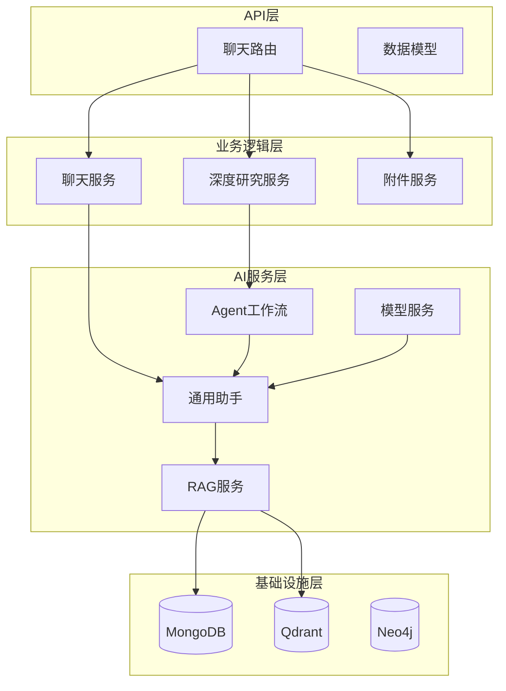
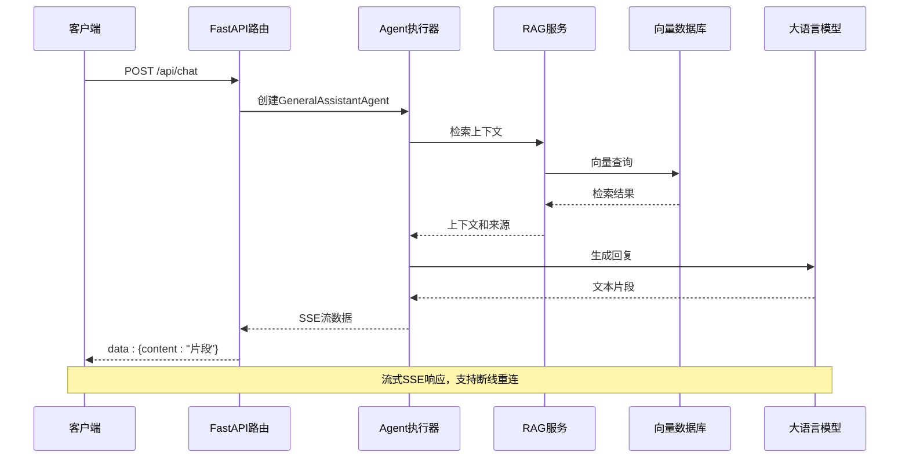
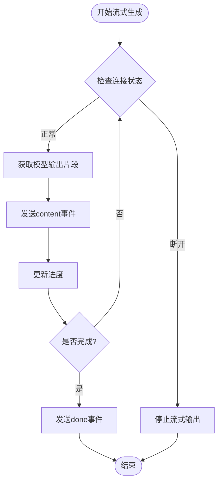
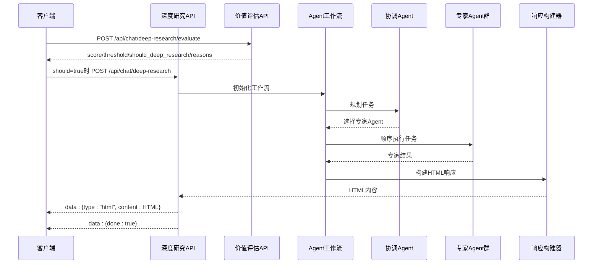
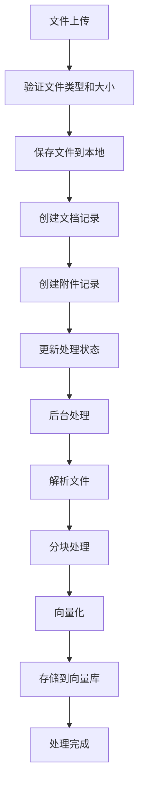
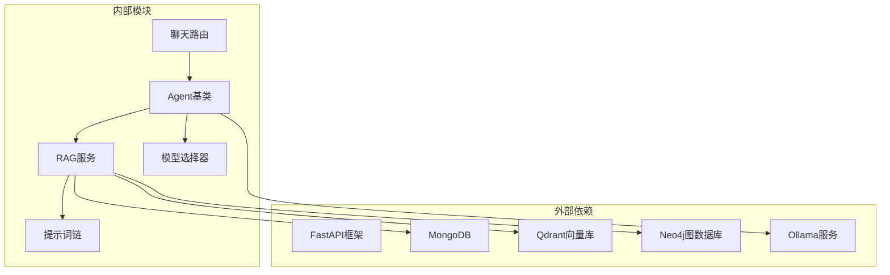

# 聊天API

<cite>
**本文档引用的文件**
- [main.py](file://main.py)
- [chat.py](file://routers/chat.py)
- [agent_workflow.py](file://agents/workflow/agent_workflow.py)
- [general_assistant_agent.py](file://agents/general_assistant/general_assistant_agent.py)
- [rag_service.py](file://services/rag_service.py)
- [ollama_service.py](file://services/ollama_service.py)
- [base_agent.py](file://agents/base/base_agent.py)
- [rag_retriever.py](file://retrieval/rag_retriever.py)
- [logging_middleware.py](file://middleware/logging_middleware.py)
</cite>

## 目录
1. [简介](#简介)
2. [项目结构](#项目结构)
3. [核心组件](#核心组件)
4. [架构概览](#架构概览)
5. [详细组件分析](#详细组件分析)
6. [依赖分析](#依赖分析)
7. [性能考虑](#性能考虑)
8. [故障排除指南](#故障排除指南)
9. [结论](#结论)

## 简介
Advanced RAG聊天API提供三种核心对话能力：
- **常规对话**：支持流式SSE响应的普通聊天
- **深度研究模式**：多Agent协作的复杂问题解决
- **对话附件上传**：支持文件解析、分块、向量化并入库

该系统基于FastAPI构建，采用模块化设计，支持RAG检索增强、多模型推理和流式响应机制。

## 项目结构
聊天API位于`routers/chat.py`中，通过FastAPI路由提供REST接口。系统采用分层架构：

**图表来源**
- [chat.py:1-1342](file://routers/chat.py#L1-L1342)
- [main.py:90-99](file://main.py#L90-L99)

**章节来源**
- [main.py:90-99](file://main.py#L90-L99)
- [chat.py:1-100](file://routers/chat.py#L1-L100)

## 核心组件
聊天API包含三个主要路由组：

### 路由前缀和注册
- **常规对话路由**：`/api/chat`
- **深度研究路由**：`/api/chat/deep-research`  
- **对话附件路由**：`/api/chat/conversation-attachment`

### 数据模型
系统定义了完整的数据传输对象：
- **ChatRequest**：常规对话请求参数
- **DeepResearchRequest**：深度研究请求参数
- **Conversation**：对话模型
- **ChatMessage**：消息模型

**章节来源**
- [chat.py:20-82](file://routers/chat.py#L20-L82)
- [chat.py:929-941](file://routers/chat.py#L929-L941)

## 架构概览
聊天API采用事件驱动的流式架构：

**图表来源**
- [chat.py:623-760](file://routers/chat.py#L623-L760)
- [general_assistant_agent.py:49-167](file://agents/general_assistant/general_assistant_agent.py#L49-L167)
- [rag_service.py:34-126](file://services/rag_service.py#L34-L126)

## 详细组件分析

### 常规对话端点
#### 端点定义
- **HTTP方法**：POST
- **URL模式**：`/api/chat/`
- **请求参数**：ChatRequest模型
- **响应格式**：SSE流式响应

#### 请求参数详解
| 参数名 | 类型 | 必填 | 默认值 | 描述 |
|--------|------|------|--------|------|
| query | string | 是 | - | 用户问题内容 |
| assistant_id | string | 否 | - | 助手ID |
| knowledge_space_ids | array[string] | 否 | - | 知识空间ID列表 |
| conversation_id | string | 否 | - | 对话ID |
| enable_rag | boolean | 否 | true | 是否启用RAG检索 |
| mode | string | 否 | normal | 对话模式 |
| generation_config | object | 否 | - | 模型配置 |

#### 响应格式（SSE）
SSE事件类型：
- **content事件**：返回文本片段
- **done事件**：标记流式响应结束
- **error事件**：返回错误信息

#### 流式响应机制

**图表来源**
- [chat.py:673-752](file://routers/chat.py#L673-L752)

**章节来源**
- [chat.py:623-760](file://routers/chat.py#L623-L760)
- [general_assistant_agent.py:49-167](file://agents/general_assistant/general_assistant_agent.py#L49-L167)

### 深度研究模式端点
#### 端点定义
- **HTTP方法**：POST  
- **URL模式**：`/api/chat/deep-research`
- **请求参数**：DeepResearchRequest模型
- **响应格式**：SSE流式HTML响应

#### 新增：深度研究价值评估端点（门控）
- **HTTP方法**：POST
- **URL模式**：`/api/chat/deep-research/evaluate`
- **请求参数**：`DeepResearchEvaluateRequest`
  - `query: string` 用户问题
  - `conversation_id?: string` 对话ID（可选）
- **响应格式**：`DeepResearchGateDecision`
  - `should_deep_research: boolean` 是否建议进入深度研究
  - `score: number` 0-100 综合评分
  - `threshold: number` 当前阈值（默认60，可由运行时参数覆盖）
  - `reasons: string[]` 判定理由列表

#### 评估规则说明
评估接口是低成本预判，不执行多Agent工作流，主要用于判断“这次问题是否值得深度研究”。评分维度包括：
- **复杂度**：是否有对比、权衡、系统设计、排查优化等迹象
- **不确定性**：是否属于开放问题或需要多证据支撑
- **风险**：是否涉及生产、合规、安全、财务等高代价场景
- **收益/成本**：问题信息量与预期收益、计算开销是否匹配

评分达到阈值时 `should_deep_research=true`，否则建议回落常规模式。

#### Agent工作流

**图表来源**
- [chat.py:174-205](file://routers/chat.py#L174-L205)
- [chat.py:762-922](file://routers/chat.py#L762-L922)
- [agent_workflow.py:106-337](file://agents/workflow/agent_workflow.py#L106-L337)

#### 支持的专家Agent类型
- **document_retrieval**：文档检索
- **formula_analysis**：公式分析  
- **code_analysis**：代码分析
- **concept_explanation**：概念解释
- **example_generation**：示例生成
- **summary**：摘要
- **exercise**：练习题
- **scientific_coding**：科学编程

**章节来源**
- [agent_workflow.py:47-67](file://agents/workflow/agent_workflow.py#L47-L67)
- [chat.py:85-205](file://routers/chat.py#L85-L205)
- [chat.py:762-922](file://routers/chat.py#L762-L922)

### 对话附件上传端点
#### 端点定义
- **HTTP方法**：POST
- **URL模式**：`/api/chat/conversation-attachment`
- **请求参数**：multipart/form-data

#### 上传流程

**图表来源**
- [chat.py:1108-1267](file://routers/chat.py#L1108-L1267)

**章节来源**
- [chat.py:1108-1342](file://routers/chat.py#L1108-L1342)

## 依赖分析
聊天API的依赖关系呈现清晰的分层结构：

**图表来源**
- [chat.py:1-17](file://routers/chat.py#L1-L17)
- [general_assistant_agent.py:1-6](file://agents/general_assistant/general_assistant_agent.py#L1-L6)

**章节来源**
- [chat.py:1-17](file://routers/chat.py#L1-L17)
- [general_assistant_agent.py:1-6](file://agents/general_assistant/general_assistant_agent.py#L1-L6)

## 性能考虑
系统在多个层面进行了性能优化：

### 流式响应优化
- **连接检测**：每10次yield检查一次客户端连接状态
- **超时控制**：Ollama服务超时设置为600秒
- **内存管理**：流式生成避免大文本缓存

### 检索性能优化
- **并行检索**：向量检索、关键词检索、图谱检索并行执行
- **动态裁剪**：根据重排分数分布自适应调整k值
- **邻居扩展**：智能扩展命中chunk的上下文

### 缓存策略
- **Agent配置缓存**：延迟加载Agent配置
- **模型选择缓存**：快速关键词匹配后备方案

## 故障排除指南

### 常见错误码
- **400 Bad Request**：请求参数无效或文件类型不支持
- **404 Not Found**：对话或附件不存在
- **500 Internal Server Error**：服务器内部错误

### 连接问题诊断
1. **SSE连接断开**：检查网络稳定性
2. **模型服务不可用**：确认Ollama服务运行状态
3. **数据库连接失败**：验证MongoDB连接配置

### 日志监控
系统内置完整的请求日志中间件，记录：
- 请求处理时间
- 错误状态码
- 慢请求识别

**章节来源**
- [logging_middleware.py:8-51](file://middleware/logging_middleware.py#L8-L51)

## 结论
Advanced RAG聊天API提供了完整的对话解决方案，具有以下特点：

1. **多模式支持**：常规对话和深度研究两种交互模式
2. **流式响应**：基于SSE的实时流式输出
3. **智能Agent**：多Agent协作解决复杂问题
4. **RAG增强**：支持向量检索、关键词检索和图谱检索
5. **文件处理**：完整的文档解析、分块、向量化流程

该系统适合构建企业级的智能对话应用，支持从简单问答到复杂研究的各种场景。