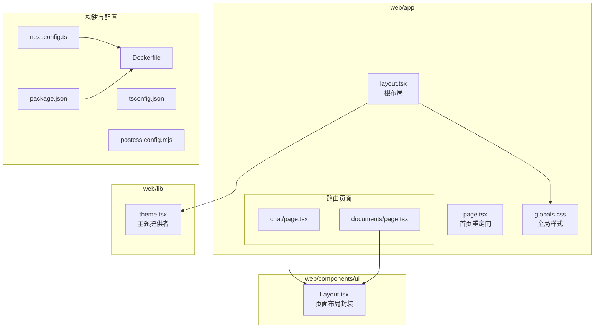
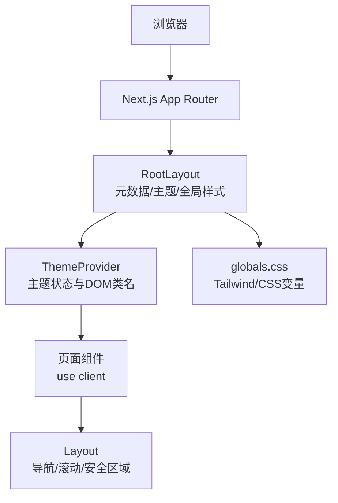
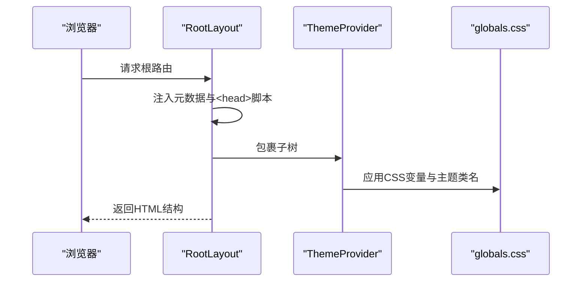
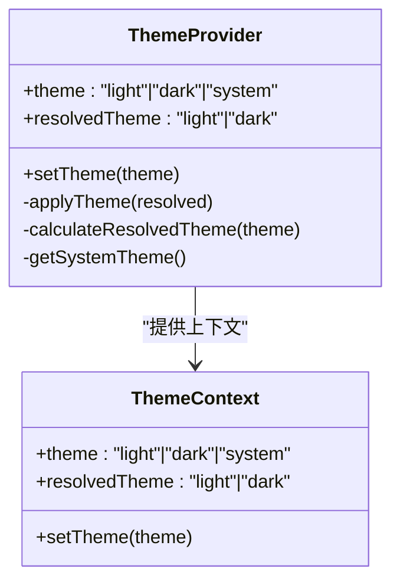
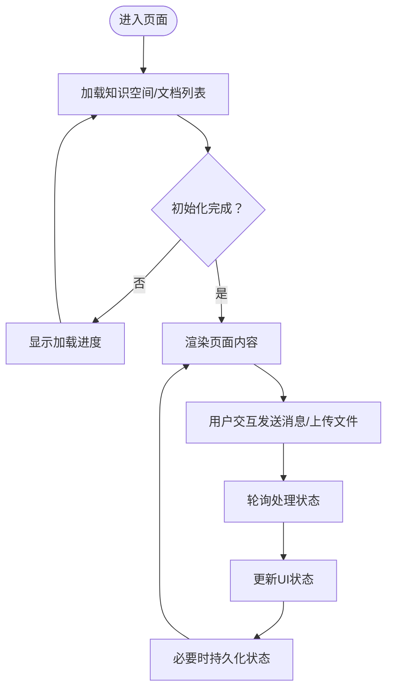
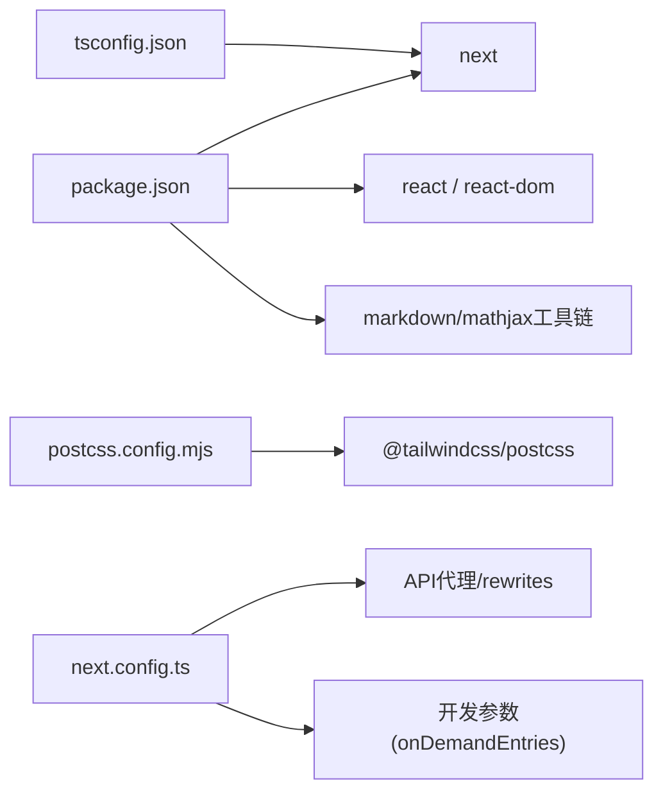

# Next.js架构设计

<cite>
**本文引用的文件**
- [web/app/layout.tsx](file://web/app/layout.tsx)
- [web/app/page.tsx](file://web/app/page.tsx)
- [web/lib/theme.tsx](file://web/lib/theme.tsx)
- [web/app/globals.css](file://web/app/globals.css)
- [web/components/ui/Layout.tsx](file://web/components/ui/Layout.tsx)
- [web/app/chat/page.tsx](file://web/app/chat/page.tsx)
- [web/app/documents/page.tsx](file://web/app/documents/page.tsx)
- [web/next.config.ts](file://web/next.config.ts)
- [web/tsconfig.json](file://web/tsconfig.json)
- [web/package.json](file://web/package.json)
- [web/postcss.config.mjs](file://web/postcss.config.mjs)
- [web/Dockerfile](file://web/Dockerfile)
</cite>

## 目录
1. [引言](#引言)
2. [项目结构](#项目结构)
3. [核心组件](#核心组件)
4. [架构总览](#架构总览)
5. [详细组件分析](#详细组件分析)
6. [依赖关系分析](#依赖关系分析)
7. [性能考虑](#性能考虑)
8. [故障排查指南](#故障排查指南)
9. [结论](#结论)
10. [附录](#附录)

## 引言
本文件系统性梳理基于Next.js App Router的前端架构设计，聚焦以下方面：
- 目录结构与路由约定（App Router）
- 根布局RootLayout的功能与作用（元数据、主题提供者、全局样式）
- TypeScript配置、CSS模块化与构建优化
- 渲染策略（静态生成、SSR、CSR）的选择与权衡
- 性能优化、缓存策略与SEO最佳实践
- 开发环境配置、生产构建与部署优化

## 项目结构
该项目采用Next.js App Router目录结构，页面按路由约定组织于web/app下，根布局与全局样式位于web/app目录内，主题提供者与UI布局组件位于web/lib与web/components目录。

**图表来源**
- [web/app/layout.tsx:1-49](file://web/app/layout.tsx#L1-L49)
- [web/app/page.tsx:1-39](file://web/app/page.tsx#L1-L39)
- [web/app/globals.css:1-1183](file://web/app/globals.css#L1-L1183)
- [web/lib/theme.tsx:1-111](file://web/lib/theme.tsx#L1-L111)
- [web/components/ui/Layout.tsx:1-61](file://web/components/ui/Layout.tsx#L1-L61)
- [web/app/chat/page.tsx:1-2563](file://web/app/chat/page.tsx#L1-L2563)
- [web/app/documents/page.tsx:1-337](file://web/app/documents/page.tsx#L1-L337)
- [web/next.config.ts:1-48](file://web/next.config.ts#L1-L48)
- [web/tsconfig.json:1-35](file://web/tsconfig.json#L1-L35)
- [web/package.json:1-40](file://web/package.json#L1-L40)
- [web/postcss.config.mjs:1-8](file://web/postcss.config.mjs#L1-L8)
- [web/Dockerfile:1-39](file://web/Dockerfile#L1-L39)

**章节来源**
- [web/app/layout.tsx:1-49](file://web/app/layout.tsx#L1-L49)
- [web/app/page.tsx:1-39](file://web/app/page.tsx#L1-L39)
- [web/app/globals.css:1-1183](file://web/app/globals.css#L1-L1183)
- [web/lib/theme.tsx:1-111](file://web/lib/theme.tsx#L1-L111)
- [web/components/ui/Layout.tsx:1-61](file://web/components/ui/Layout.tsx#L1-L61)
- [web/next.config.ts:1-48](file://web/next.config.ts#L1-L48)
- [web/tsconfig.json:1-35](file://web/tsconfig.json#L1-L35)
- [web/package.json:1-40](file://web/package.json#L1-L40)
- [web/postcss.config.mjs:1-8](file://web/postcss.config.mjs#L1-L8)
- [web/Dockerfile:1-39](file://web/Dockerfile#L1-L39)

## 核心组件
- 根布局RootLayout：负责元数据注入、主题提供者包裹、全局样式引入与HTML结构。
- 主题提供者ThemeProvider：集中管理浅色/深色/系统主题切换、DOM类名应用与本地持久化。
- 全局样式globals.css：通过Tailwind与CSS变量实现主题色、背景、文字、阴影等的统一管理，并为深色/浅色提供差异化变量。
- 页面布局Layout：封装通用导航、滚动行为与安全区域适配，支持允许滚动与禁止滚动两种布局模式。
- 路由页面：如聊天页与文档页，均使用“use client”声明客户端渲染，结合Layout与主题提供者实现交互体验。

**章节来源**
- [web/app/layout.tsx:1-49](file://web/app/layout.tsx#L1-L49)
- [web/lib/theme.tsx:1-111](file://web/lib/theme.tsx#L1-L111)
- [web/app/globals.css:1-1183](file://web/app/globals.css#L1-L1183)
- [web/components/ui/Layout.tsx:1-61](file://web/components/ui/Layout.tsx#L1-L61)
- [web/app/chat/page.tsx:1-2563](file://web/app/chat/page.tsx#L1-L2563)
- [web/app/documents/page.tsx:1-337](file://web/app/documents/page.tsx#L1-L337)

## 架构总览
Next.js App Router以文件系统为路由，根布局统一注入元数据、主题与全局样式，页面组件通过“use client”启用客户端渲染，配合主题提供者与UI布局组件实现一致的用户体验。

**图表来源**
- [web/app/layout.tsx:1-49](file://web/app/layout.tsx#L1-L49)
- [web/lib/theme.tsx:1-111](file://web/lib/theme.tsx#L1-L111)
- [web/app/globals.css:1-1183](file://web/app/globals.css#L1-L1183)
- [web/components/ui/Layout.tsx:1-61](file://web/components/ui/Layout.tsx#L1-L61)
- [web/app/chat/page.tsx:1-2563](file://web/app/chat/page.tsx#L1-L2563)

## 详细组件分析

### 根布局RootLayout
- 元数据配置：在根布局中定义站点标题、描述与图标，确保SEO基础信息完整。
- 主题提供者：在body外层包裹ThemeProvider，保证主题状态在整个应用生效。
- 全局样式：引入globals.css，统一字体、颜色与动画。
- HTML语言与水合：设置html语言属性与抑制水合警告，提升首屏一致性。

**图表来源**
- [web/app/layout.tsx:1-49](file://web/app/layout.tsx#L1-L49)
- [web/lib/theme.tsx:1-111](file://web/lib/theme.tsx#L1-L111)
- [web/app/globals.css:1-1183](file://web/app/globals.css#L1-L1183)

**章节来源**
- [web/app/layout.tsx:1-49](file://web/app/layout.tsx#L1-L49)

### 主题提供者ThemeProvider
- 主题类型与上下文：定义light/dark/system三种模式，提供resolvedTheme与setTheme。
- 本地持久化：从localStorage读取并写入主题偏好。
- DOM类名应用：在documentElement上切换light/dark类名，驱动CSS变量切换。
- 系统主题监听：监听prefers-color-scheme变更，动态调整resolvedTheme。

**图表来源**
- [web/lib/theme.tsx:1-111](file://web/lib/theme.tsx#L1-L111)

**章节来源**
- [web/lib/theme.tsx:1-111](file://web/lib/theme.tsx#L1-L111)

### 全局样式globals.css
- Tailwind集成：通过@import引入Tailwind，结合CSS变量实现主题切换。
- CSS变量体系：定义浅色/深色主题下的主色、背景、文字、边框与阴影变量。
- 代码高亮与公式渲染：针对MathJax/KaTeX提供深色模式优化与容器样式。
- 动画与滚动：定义常用动画与滚动条样式，提升交互体验。

**章节来源**
- [web/app/globals.css:1-1183](file://web/app/globals.css#L1-L1183)

### 页面布局Layout
- 两种布局模式：允许滚动（自然文档流）与禁止滚动（固定高度内部滚动）。
- 安全区域适配：通过env(safe-area-inset-*)适配移动端刘海与底栏。
- 导航集成：内置Navbar，统一顶部导航与过渡动画。

**章节来源**
- [web/components/ui/Layout.tsx:1-61](file://web/components/ui/Layout.tsx#L1-L61)

### 路由页面：聊天页与文档页
- 客户端渲染：页面组件均使用"use client"，启用React状态与副作用。
- 布局封装：统一使用Layout组件，确保导航与滚动行为一致。
- 数据加载与轮询：文档页对处理中的文档进行轮询刷新；聊天页对上传状态与消息流进行管理。
- 状态持久化：聊天页对流式生成状态进行localStorage恢复与保存，提升中断后恢复体验。

**图表来源**
- [web/app/documents/page.tsx:1-337](file://web/app/documents/page.tsx#L1-L337)
- [web/app/chat/page.tsx:1-2563](file://web/app/chat/page.tsx#L1-L2563)

**章节来源**
- [web/app/chat/page.tsx:1-2563](file://web/app/chat/page.tsx#L1-L2563)
- [web/app/documents/page.tsx:1-337](file://web/app/documents/page.tsx#L1-L337)

### 首页重定向page.tsx
- 客户端初始化：在useEffect中执行两步初始化，随后跳转至聊天页。
- 加载进度：通过LoadingProgress展示初始化步骤，改善首屏体验。

**章节来源**
- [web/app/page.tsx:1-39](file://web/app/page.tsx#L1-L39)

## 依赖关系分析
- 构建与打包：Next.js 16、TypeScript、Tailwind PostCSS插件。
- 运行时依赖：React 19、Next、Markdown/数学公式渲染工具链。
- 开发与格式化：Biome作为代码检查与格式化工具。
- 配置文件：next.config.ts定义代理与开发参数；tsconfig.json启用严格模式与路径别名；postcss.config.mjs集成Tailwind。

**图表来源**
- [web/package.json:1-40](file://web/package.json#L1-L40)
- [web/tsconfig.json:1-35](file://web/tsconfig.json#L1-L35)
- [web/postcss.config.mjs:1-8](file://web/postcss.config.mjs#L1-L8)
- [web/next.config.ts:1-48](file://web/next.config.ts#L1-L48)

**章节来源**
- [web/package.json:1-40](file://web/package.json#L1-L40)
- [web/tsconfig.json:1-35](file://web/tsconfig.json#L1-L35)
- [web/postcss.config.mjs:1-8](file://web/postcss.config.mjs#L1-L8)
- [web/next.config.ts:1-48](file://web/next.config.ts#L1-L48)

## 性能考虑
- 渲染策略
  - 首页重定向page.tsx使用客户端渲染，通过useEffect与LoadingProgress优化首屏体验。
  - 聊天页与文档页均为客户端渲染，结合Layout与主题提供者，减少不必要的服务端计算。
- 构建与缓存
  - next.config.ts启用standalone输出，便于Docker部署与缓存利用。
  - 开发环境onDemandEntries配置降低内存占用，提升热更新效率。
- 样式与主题
  - globals.css通过CSS变量与Tailwind实现主题切换，避免重复样式计算。
  - 主题提供者在初始化阶段应用DOM类名，减少水合抖动。
- 数据加载
  - 文档页对处理中的文档进行3秒轮询，避免频繁请求；聊天页对上传状态与消息流进行节流与滚动优化。
- SEO与元数据
  - 根布局定义title、description与icon，提升搜索引擎可见性。

**章节来源**
- [web/app/page.tsx:1-39](file://web/app/page.tsx#L1-L39)
- [web/app/chat/page.tsx:1-2563](file://web/app/chat/page.tsx#L1-L2563)
- [web/app/documents/page.tsx:1-337](file://web/app/documents/page.tsx#L1-L337)
- [web/next.config.ts:1-48](file://web/next.config.ts#L1-L48)
- [web/app/layout.tsx:1-49](file://web/app/layout.tsx#L1-L49)
- [web/app/globals.css:1-1183](file://web/app/globals.css#L1-L1183)
- [web/lib/theme.tsx:1-111](file://web/lib/theme.tsx#L1-L111)

## 故障排查指南
- API代理问题
  - next.config.ts通过rewrites将/api/*代理至后端服务，开发环境默认代理到本地8000端口；若未配置NEXT_PUBLIC_API_URL，生产环境使用相对路径交由反向代理处理。若出现跨域或404，请检查环境变量与代理规则。
- 主题不生效
  - 确认ThemeProvider包裹范围覆盖到根布局；检查localStorage中是否存在theme键；确认DOM存在light/dark类名。
- 样式异常
  - 确认globals.css已正确引入；Tailwind与CSS变量冲突时，优先使用CSS变量覆盖。
- Docker部署
  - Dockerfile使用standalone输出，需确保.env.production在构建与运行时可用；端口3000暴露正常。

**章节来源**
- [web/next.config.ts:1-48](file://web/next.config.ts#L1-L48)
- [web/lib/theme.tsx:1-111](file://web/lib/theme.tsx#L1-L111)
- [web/app/globals.css:1-1183](file://web/app/globals.css#L1-L1183)
- [web/Dockerfile:1-39](file://web/Dockerfile#L1-L39)

## 结论
本项目以App Router为核心，通过根布局统一注入元数据与主题，结合全局样式与UI布局组件，形成一致的用户体验。客户端渲染策略满足复杂交互需求，配合代理、构建与Docker部署配置，实现开发与生产的高效协同。建议在后续迭代中进一步细化路由层级、拆分页面组件与优化资源加载策略，持续提升性能与可维护性。

## 附录
- 开发命令：dev/build/start/lint/format
- TypeScript路径别名：@/*
- PostCSS插件：Tailwind
- Docker镜像：Alpine Node 22，使用standalone输出

**章节来源**
- [web/package.json:1-40](file://web/package.json#L1-L40)
- [web/tsconfig.json:1-35](file://web/tsconfig.json#L1-L35)
- [web/postcss.config.mjs:1-8](file://web/postcss.config.mjs#L1-L8)
- [web/Dockerfile:1-39](file://web/Dockerfile#L1-L39)