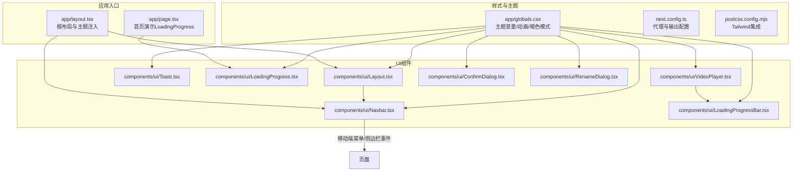
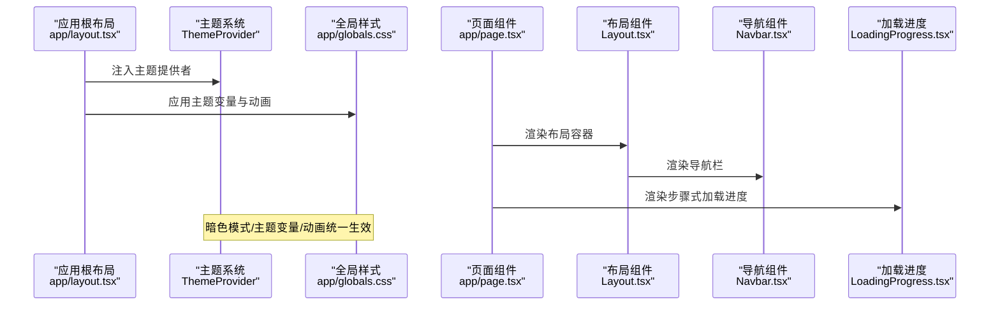
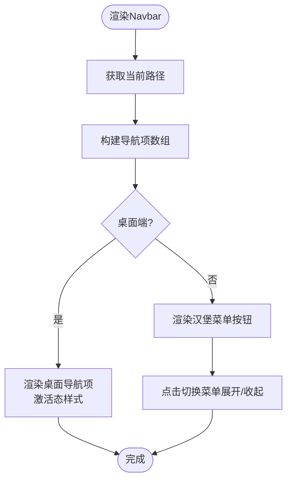
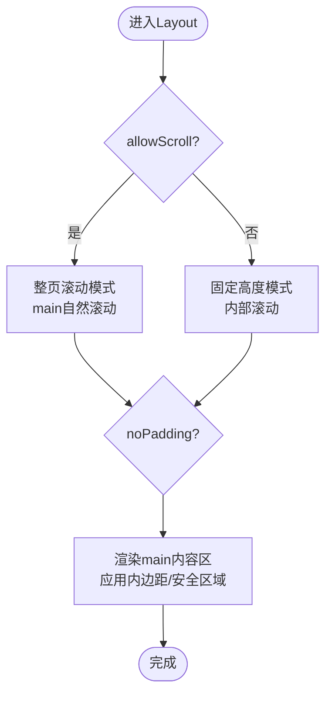
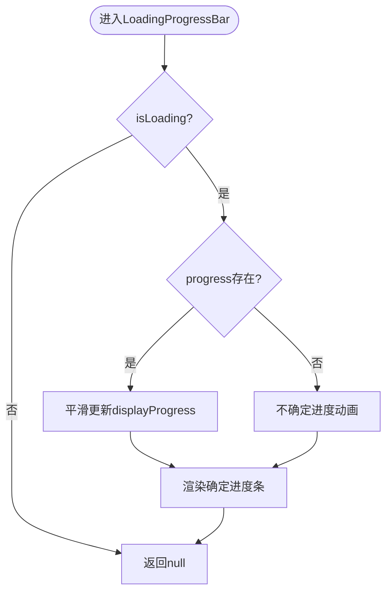
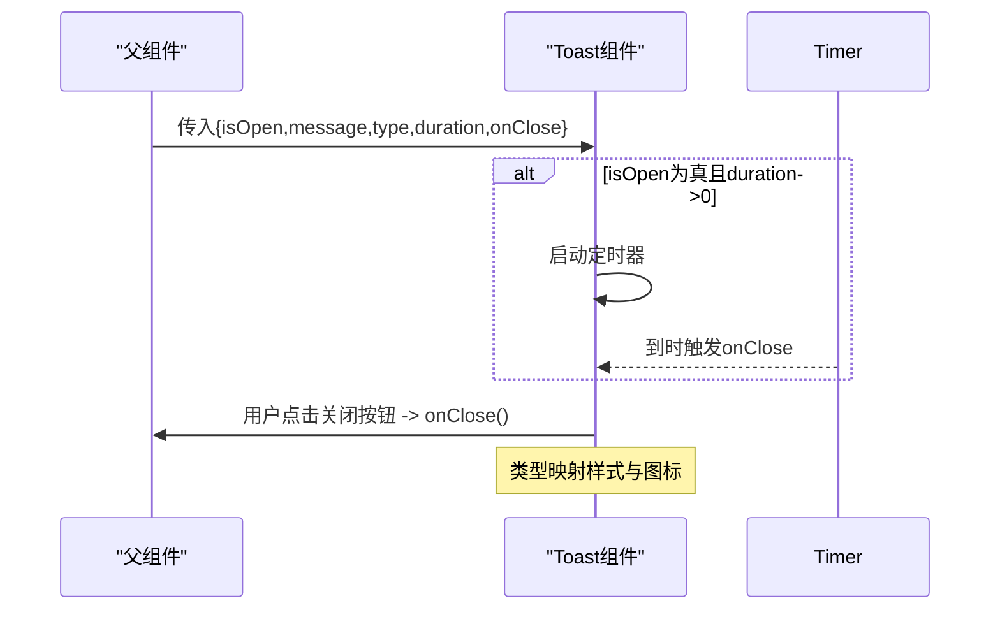
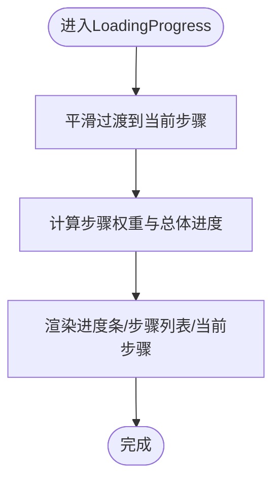
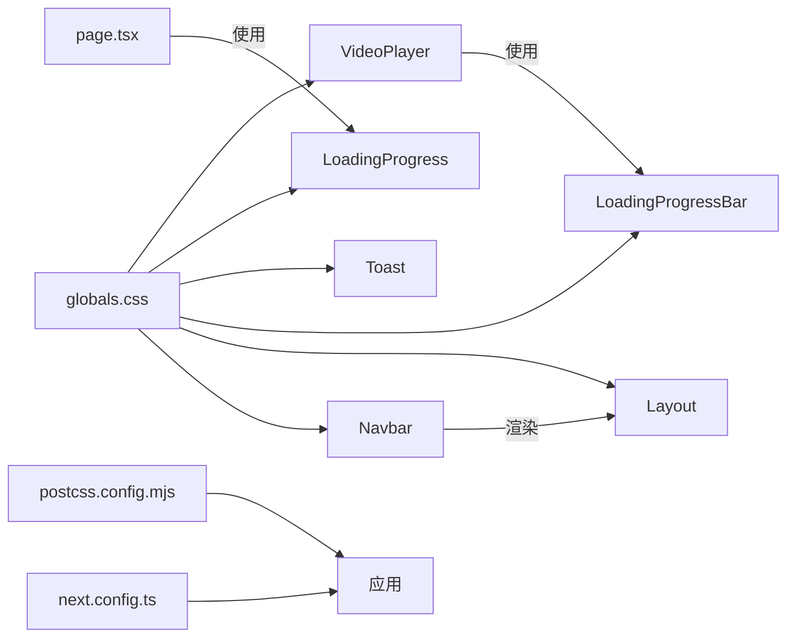

# UI组件系统

<cite>
**本文引用的文件**
- [web/components/ui/Navbar.tsx](file://web/components/ui/Navbar.tsx)
- [web/components/ui/Layout.tsx](file://web/components/ui/Layout.tsx)
- [web/components/ui/LoadingProgressBar.tsx](file://web/components/ui/LoadingProgressBar.tsx)
- [web/components/ui/Toast.tsx](file://web/components/ui/Toast.tsx)
- [web/components/ui/LoadingProgress.tsx](file://web/components/ui/LoadingProgress.tsx)
- [web/app/globals.css](file://web/app/globals.css)
- [web/app/layout.tsx](file://web/app/layout.tsx)
- [web/app/page.tsx](file://web/app/page.tsx)
- [web/components/ui/ConfirmDialog.tsx](file://web/components/ui/ConfirmDialog.tsx)
- [web/components/ui/RenameDialog.tsx](file://web/components/ui/RenameDialog.tsx)
- [web/components/ui/VideoPlayer.tsx](file://web/components/ui/VideoPlayer.tsx)
- [web/next.config.ts](file://web/next.config.ts)
- [web/postcss.config.mjs](file://web/postcss.config.mjs)
</cite>

## 目录
1. [简介](#简介)
2. [项目结构](#项目结构)
3. [核心组件](#核心组件)
4. [架构总览](#架构总览)
5. [详细组件分析](#详细组件分析)
6. [依赖关系分析](#依赖关系分析)
7. [性能考量](#性能考量)
8. [故障排查指南](#故障排查指南)
9. [结论](#结论)
10. [附录](#附录)

## 简介
本文件系统化梳理了前端Web工程中的UI组件体系，重点覆盖导航栏Navbar、布局Layout、进度条LoadingProgressBar、提示框Toast等核心组件。文档从设计规范与实现细节入手，阐述Props接口、事件处理与状态管理；解释样式系统、主题定制与响应式设计；给出使用示例、最佳实践与可访问性支持；总结组件间通信模式、组合使用与扩展方法，并提供测试策略与性能优化建议。

## 项目结构
UI组件主要位于web/components/ui目录，采用按功能分层组织，配合全局样式与主题提供统一的视觉与交互体验。Next.js应用通过根布局注入主题系统，全局CSS定义主题变量与动画，页面级组件演示组件使用方式。

**图表来源**
- [web/app/layout.tsx:16-48](file://web/app/layout.tsx#L16-L48)
- [web/app/page.tsx:1-39](file://web/app/page.tsx#L1-L39)
- [web/components/ui/Navbar.tsx:1-125](file://web/components/ui/Navbar.tsx#L1-L125)
- [web/components/ui/Layout.tsx:1-61](file://web/components/ui/Layout.tsx#L1-L61)
- [web/components/ui/LoadingProgressBar.tsx:1-76](file://web/components/ui/LoadingProgressBar.tsx#L1-L76)
- [web/components/ui/Toast.tsx:1-66](file://web/components/ui/Toast.tsx#L1-L66)
- [web/components/ui/LoadingProgress.tsx:1-138](file://web/components/ui/LoadingProgress.tsx#L1-L138)
- [web/components/ui/VideoPlayer.tsx:1-280](file://web/components/ui/VideoPlayer.tsx#L1-L280)
- [web/components/ui/ConfirmDialog.tsx:1-119](file://web/components/ui/ConfirmDialog.tsx#L1-L119)
- [web/components/ui/RenameDialog.tsx:1-127](file://web/components/ui/RenameDialog.tsx#L1-L127)
- [web/app/globals.css:1-1183](file://web/app/globals.css#L1-L1183)
- [web/next.config.ts:1-48](file://web/next.config.ts#L1-L48)
- [web/postcss.config.mjs:1-8](file://web/postcss.config.mjs#L1-L8)

**章节来源**
- [web/app/layout.tsx:16-48](file://web/app/layout.tsx#L16-L48)
- [web/app/globals.css:1-1183](file://web/app/globals.css#L1-L1183)
- [web/next.config.ts:1-48](file://web/next.config.ts#L1-L48)
- [web/postcss.config.mjs:1-8](file://web/postcss.config.mjs#L1-L8)

## 核心组件
本节概述四个关键UI组件的设计目标、Props接口、状态与事件处理要点，以及与样式系统的关联。

- 导航栏Navbar
  - 设计目标：提供站点主导航、移动端汉堡菜单、与聊天侧边栏联动。
  - 关键Props：无（使用路由钩子与静态导航项）。
  - 事件处理：移动端菜单开关、聊天页侧边栏触发自定义事件。
  - 状态管理：基于路由路径计算激活状态，受pathname影响。
  - 样式系统：Tailwind类名、暗色模式变量、动画与响应式断点。

- 布局Layout
  - 设计目标：统一页面容器、头部导航、内边距与滚动行为控制。
  - 关键Props：children、noPadding、allowScroll。
  - 事件处理：无直接事件，通过allowScroll切换滚动策略。
  - 状态管理：根据allowScroll决定是否固定视口高度与内部滚动。
  - 样式系统：安全区域适配、滚动优化、暗色模式过渡。

- 进度条LoadingProgressBar
  - 设计目标：展示确定/不确定进度，支持百分比显示与自定义样式。
  - 关键Props：isLoading、progress、text、showPercentage、className。
  - 事件处理：无（纯展示）。
  - 状态管理：平滑更新displayProgress，不确定模式使用动画。
  - 样式系统：渐变与脉冲动画、暗色模式颜色。

- 提示框Toast
  - 设计目标：顶部右上角弹出提示，支持多种类型与定时关闭。
  - 关键Props：isOpen、message、type、duration、onClose。
  - 事件处理：点击关闭按钮触发onClose；定时器自动关闭。
  - 状态管理：useEffect管理定时器生命周期。
  - 样式系统：固定定位、动画进入、类型化样式与图标映射。

**章节来源**
- [web/components/ui/Navbar.tsx:1-125](file://web/components/ui/Navbar.tsx#L1-L125)
- [web/components/ui/Layout.tsx:1-61](file://web/components/ui/Layout.tsx#L1-L61)
- [web/components/ui/LoadingProgressBar.tsx:1-76](file://web/components/ui/LoadingProgressBar.tsx#L1-L76)
- [web/components/ui/Toast.tsx:1-66](file://web/components/ui/Toast.tsx#L1-L66)

## 架构总览
UI组件与应用整体的交互关系如下：

**图表来源**
- [web/app/layout.tsx:16-48](file://web/app/layout.tsx#L16-L48)
- [web/app/globals.css:1-1183](file://web/app/globals.css#L1-L1183)
- [web/app/page.tsx:1-39](file://web/app/page.tsx#L1-L39)
- [web/components/ui/Layout.tsx:1-61](file://web/components/ui/Layout.tsx#L1-L61)
- [web/components/ui/Navbar.tsx:1-125](file://web/components/ui/Navbar.tsx#L1-L125)
- [web/components/ui/LoadingProgress.tsx:1-138](file://web/components/ui/LoadingProgress.tsx#L1-L138)

## 详细组件分析

### 导航栏Navbar
- 设计规范
  - 固定高度与阴影，浅/深色模式适配。
  - 桌面端水平导航，移动端汉堡菜单。
  - 聊天页提供侧边栏开关按钮，使用自定义事件与aria标签提升可访问性。
- Props与状态
  - 无外部Props；内部通过路由钩子获取当前路径，动态计算激活项。
  - 移动端菜单展开/收起通过DOM操作与maxHeight动画实现。
- 事件处理
  - 移动端菜单按钮：切换隐藏类与maxHeight，配合过渡动画。
  - 聊天页侧边栏按钮：派发自定义事件以供外部监听。
- 样式系统
  - Tailwind类名组合，暗色模式变量，响应式断点，过渡动画。
- 可访问性
  - 按钮提供aria-label与title，确保屏幕阅读器可用。
- 组件关系
  - 作为Layout子组件被复用，与页面路由紧密耦合。

**图表来源**
- [web/components/ui/Navbar.tsx:6-123](file://web/components/ui/Navbar.tsx#L6-L123)

**章节来源**
- [web/components/ui/Navbar.tsx:1-125](file://web/components/ui/Navbar.tsx#L1-L125)

### 布局Layout
- 设计规范
  - 两种滚动模式：允许滚动（整页滚动）与禁止滚动（固定高度内部滚动）。
  - 支持内边距控制与安全区域适配，移动端滚动优化。
- Props与状态
  - children：子节点。
  - noPadding：是否移除默认内边距。
  - allowScroll：是否允许整页滚动。
- 事件处理
  - 无直接事件，通过属性控制滚动策略。
- 样式系统
  - 安全区域类.safe-area-inset，滚动优化与暗色模式过渡。
- 组件关系
  - 作为页面容器，包裹Navbar与main内容区。

**图表来源**
- [web/components/ui/Layout.tsx:12-59](file://web/components/ui/Layout.tsx#L12-L59)

**章节来源**
- [web/components/ui/Layout.tsx:1-61](file://web/components/ui/Layout.tsx#L1-L61)

### 进度条LoadingProgressBar
- 设计规范
  - 支持确定进度与不确定进度两种模式。
  - 可选百分比显示、自定义文本与样式类。
- Props与状态
  - isLoading：是否显示。
  - progress：0-100的确定进度，未提供则为不确定模式。
  - text/showPercentage/className：文案与显示选项。
  - 内部displayProgress：平滑更新进度值。
- 事件处理
  - 无事件；通过外部状态驱动props变化。
- 样式系统
  - 蓝色进度条、脉冲与渐变动画、暗色模式颜色。
- 性能与体验
  - 确定进度使用定时器平滑过渡，避免突变。
  - 不确定进度使用动画与渐变，提升感知速度。

**图表来源**
- [web/components/ui/LoadingProgressBar.tsx:22-74](file://web/components/ui/LoadingProgressBar.tsx#L22-L74)

**章节来源**
- [web/components/ui/LoadingProgressBar.tsx:1-76](file://web/components/ui/LoadingProgressBar.tsx#L1-L76)

### 提示框Toast
- 设计规范
  - 固定定位右上角，支持成功/错误/信息/警告四种类型。
  - 可配置显示时长，支持手动关闭与自动关闭。
- Props与状态
  - isOpen/message/type/duration/onClose。
  - 内部根据type映射样式类与图标。
- 事件处理
  - 关闭按钮点击触发onClose。
  - useEffect在isOpen与duration变化时启动/清理定时器。
- 样式系统
  - 类型化背景色、白色文字、阴影与动画进入。
- 可访问性
  - 固定位置与动画需避免干扰键盘焦点；建议在关闭后将焦点返回触发源。

**图表来源**
- [web/components/ui/Toast.tsx:15-64](file://web/components/ui/Toast.tsx#L15-L64)

**章节来源**
- [web/components/ui/Toast.tsx:1-66](file://web/components/ui/Toast.tsx#L1-L66)

### 步骤式加载LoadingProgress
- 设计规范
  - 展示多步骤流程与当前步骤，支持步骤权重与平滑过渡。
  - 可选当前步骤精确进度，综合步骤权重计算总体进度。
- Props与状态
  - steps/currentStep/message/className/currentStepProgress。
  - displayedStep：平滑过渡到当前步骤。
- 事件处理
  - 无事件；通过外部状态驱动。
- 样式系统
  - 圆点指示器、步骤列表、进度条与动画。
- 组件关系
  - 作为首页初始化流程的占位组件，与路由跳转配合。

**图表来源**
- [web/components/ui/LoadingProgress.tsx:13-137](file://web/components/ui/LoadingProgress.tsx#L13-L137)

**章节来源**
- [web/components/ui/LoadingProgress.tsx:1-138](file://web/components/ui/LoadingProgress.tsx#L1-L138)
- [web/app/page.tsx:7-38](file://web/app/page.tsx#L7-L38)

### 其他相关组件（用于理解组件生态）
- 确认对话框ConfirmDialog
  - 弹窗遮罩、ESC关闭、阻止背景滚动、危险/默认风格。
- 重命名对话框RenameDialog
  - 输入校验、回车/ESC处理、自动聚焦与选择。
- 视频播放器VideoPlayer
  - 封装原生video事件、加载进度条、播放控制、全屏与音量控制。

**章节来源**
- [web/components/ui/ConfirmDialog.tsx:1-119](file://web/components/ui/ConfirmDialog.tsx#L1-L119)
- [web/components/ui/RenameDialog.tsx:1-127](file://web/components/ui/RenameDialog.tsx#L1-L127)
- [web/components/ui/VideoPlayer.tsx:1-280](file://web/components/ui/VideoPlayer.tsx#L1-L280)

## 依赖关系分析
- 组件间依赖
  - Layout依赖Navbar；页面组件可直接或间接使用LoadingProgress。
  - VideoPlayer内部使用LoadingProgressBar。
  - Navbar与Toast、ConfirmDialog/RenameDialog等独立组件通过事件或状态解耦协作。
- 样式与主题依赖
  - 所有组件共享app/globals.css中的主题变量、暗色模式类与动画。
  - Tailwind通过postcss.config.mjs集成，Next.js通过next.config.ts进行代理与输出配置。
- 可访问性与可维护性
  - 统一的aria-label与title；固定定位提示框需注意焦点管理。
  - 组件Props明确、状态内聚，利于单元测试与组合使用。

**图表来源**
- [web/components/ui/Navbar.tsx:1-125](file://web/components/ui/Navbar.tsx#L1-L125)
- [web/components/ui/Layout.tsx:1-61](file://web/components/ui/Layout.tsx#L1-L61)
- [web/components/ui/LoadingProgressBar.tsx:1-76](file://web/components/ui/LoadingProgressBar.tsx#L1-L76)
- [web/components/ui/Toast.tsx:1-66](file://web/components/ui/Toast.tsx#L1-L66)
- [web/components/ui/LoadingProgress.tsx:1-138](file://web/components/ui/LoadingProgress.tsx#L1-L138)
- [web/components/ui/VideoPlayer.tsx:1-280](file://web/components/ui/VideoPlayer.tsx#L1-L280)
- [web/app/globals.css:1-1183](file://web/app/globals.css#L1-L1183)
- [web/next.config.ts:1-48](file://web/next.config.ts#L1-L48)
- [web/postcss.config.mjs:1-8](file://web/postcss.config.mjs#L1-L8)

**章节来源**
- [web/app/globals.css:1-1183](file://web/app/globals.css#L1-L1183)
- [web/next.config.ts:1-48](file://web/next.config.ts#L1-L48)
- [web/postcss.config.mjs:1-8](file://web/postcss.config.mjs#L1-L8)

## 性能考量
- 组件渲染
  - Navbar与Layout均为轻量渲染，避免不必要的重排；LoadingProgressBar对确定进度使用定时器平滑更新，减少视觉抖动。
- 事件与副作用
  - Toast的useEffect仅在isOpen/duration变化时启动定时器，及时清理避免内存泄漏。
  - ConfirmDialog/RenameDialog在打开时阻止背景滚动，关闭时恢复，避免布局抖动。
- 样式与动画
  - 使用CSS动画与过渡，避免JavaScript动画带来的掉帧；全局动画在globals.css中集中管理。
- 滚动与布局
  - Layout的allowScroll模式适合长内容页面；移动端滚动优化与安全区域适配减少滚动卡顿。
- 资源加载
  - VideoPlayer监听loadstart/progress/canplay等事件，结合LoadingProgressBar提供良好加载反馈。

[本节为通用性能指导，无需特定文件引用]

## 故障排查指南
- Toast不消失或重复弹出
  - 检查isOpen与duration参数是否正确传递；确认onClose回调是否被调用且只调用一次。
  - 若存在多个Toast实例，确保各自独立的状态管理。
- Navbar菜单无法展开/收起
  - 检查移动端菜单按钮的点击事件绑定与DOM元素id；确认CSS过渡类与maxHeight逻辑。
- Layout滚动异常
  - 确认allowScroll与noPadding的组合是否符合预期；检查安全区域类与内边距是否冲突。
- VideoPlayer加载进度不准确
  - 确认video事件监听是否正确绑定与解绑；检查buffered与duration的计算逻辑。
- 主题切换无效
  - 检查根html元素的暗色/浅色类是否正确添加；确认globals.css中的主题变量是否生效。

**章节来源**
- [web/components/ui/Toast.tsx:22-29](file://web/components/ui/Toast.tsx#L22-L29)
- [web/components/ui/Navbar.tsx:67-90](file://web/components/ui/Navbar.tsx#L67-L90)
- [web/components/ui/Layout.tsx:18-58](file://web/components/ui/Layout.tsx#L18-L58)
- [web/components/ui/VideoPlayer.tsx:40-103](file://web/components/ui/VideoPlayer.tsx#L40-L103)
- [web/app/globals.css:42-77](file://web/app/globals.css#L42-L77)

## 结论
该UI组件系统以简洁的Props接口与明确的状态管理为核心，结合全局主题与动画，实现了跨页面一致的视觉与交互体验。Navbar与Layout提供稳定的页面骨架，LoadingProgressBar与Toast分别覆盖加载与提示两大用户场景，LoadingProgress用于复杂流程的可视化。通过事件与状态解耦、样式系统统一与响应式设计，组件具备良好的可组合性与可扩展性。建议在业务组件中遵循现有Props约定与样式规范，确保一致的用户体验与可维护性。

[本节为总结性内容，无需特定文件引用]

## 附录

### 组件Props与事件速查
- Navbar
  - 无Props；依赖路由路径计算激活态。
- Layout
  - children、noPadding?: boolean、allowScroll?: boolean。
- LoadingProgressBar
  - isLoading: boolean、progress?: number、text?: string、showPercentage?: boolean、className?: string。
- Toast
  - isOpen: boolean、message: string、type?: "success"|"error"|"info"|"warning"、duration?: number、onClose: () => void。
- LoadingProgress
  - steps: string[]、currentStep: number、message?: string、className?: string、currentStepProgress?: number。
- ConfirmDialog
  - isOpen: boolean、title: string、message: string、confirmText?: string、cancelText?: string、onConfirm: () => void、onCancel: () => void、variant?: "danger"|"default"、isLoading?: boolean。
- RenameDialog
  - isOpen: boolean、currentTitle: string、onConfirm: (newTitle: string) => void、onCancel: () => void。
- VideoPlayer
  - src: string、title?: string、className?: string、autoPlay?: boolean、loop?: boolean、muted?: boolean。

**章节来源**
- [web/components/ui/Navbar.tsx:1-125](file://web/components/ui/Navbar.tsx#L1-L125)
- [web/components/ui/Layout.tsx:6-10](file://web/components/ui/Layout.tsx#L6-L10)
- [web/components/ui/LoadingProgressBar.tsx:5-16](file://web/components/ui/LoadingProgressBar.tsx#L5-L16)
- [web/components/ui/Toast.tsx:7-13](file://web/components/ui/Toast.tsx#L7-L13)
- [web/components/ui/LoadingProgress.tsx:5-11](file://web/components/ui/LoadingProgress.tsx#L5-L11)
- [web/components/ui/ConfirmDialog.tsx:5-15](file://web/components/ui/ConfirmDialog.tsx#L5-L15)
- [web/components/ui/RenameDialog.tsx:5-10](file://web/components/ui/RenameDialog.tsx#L5-L10)
- [web/components/ui/VideoPlayer.tsx:6-16](file://web/components/ui/VideoPlayer.tsx#L6-L16)

### 最佳实践与可访问性
- 最佳实践
  - 明确Props边界，避免在组件内直接读取全局状态。
  - 使用useEffect管理副作用，确保清理函数正确执行。
  - 统一使用Tailwind类名与主题变量，减少样式碎片化。
  - 对于动画与过渡，优先使用CSS而非JS，保证性能。
- 可访问性
  - 为交互元素提供aria-label与title。
  - 固定定位提示框需考虑键盘焦点管理与屏幕阅读器支持。
  - 避免仅靠颜色区分状态，补充文本或图标说明。

[本节为通用指导，无需特定文件引用]

### 组件测试策略
- 单元测试
  - Toast：验证isOpen/duration变化时定时器行为、onClose回调调用次数。
  - LoadingProgressBar：验证确定/不确定模式渲染、百分比显示、平滑更新。
  - Navbar：验证路由变化时激活态计算、移动端菜单按钮行为。
- 集成测试
  - Layout：验证allowScroll/noPadding组合下的滚动与内边距表现。
  - LoadingProgress：验证步骤权重与总体进度计算、步骤过渡动画。
- 可访问性测试
  - 使用屏幕阅读器与键盘导航验证交互元素的可访问性。
  - 检查固定定位提示框是否影响键盘焦点顺序。

[本节为通用指导，无需特定文件引用]