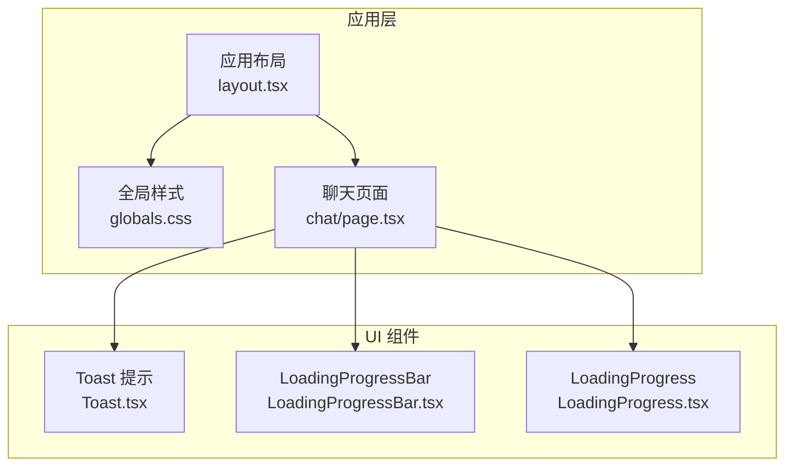
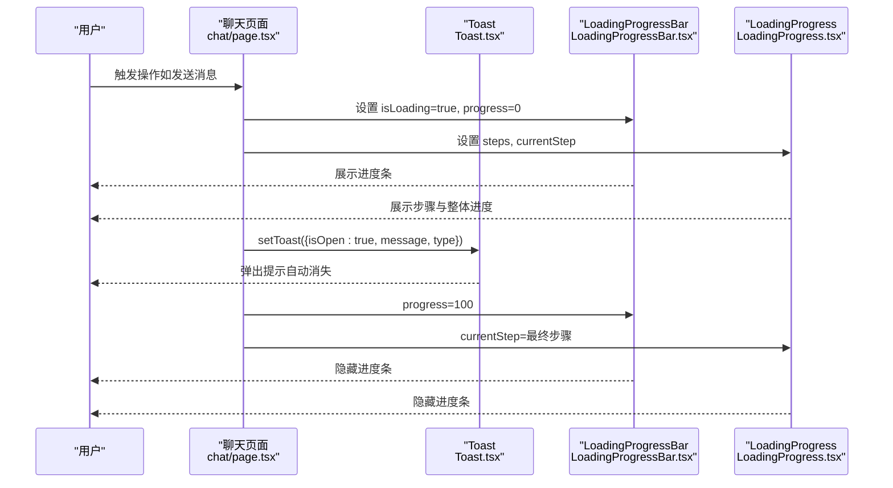
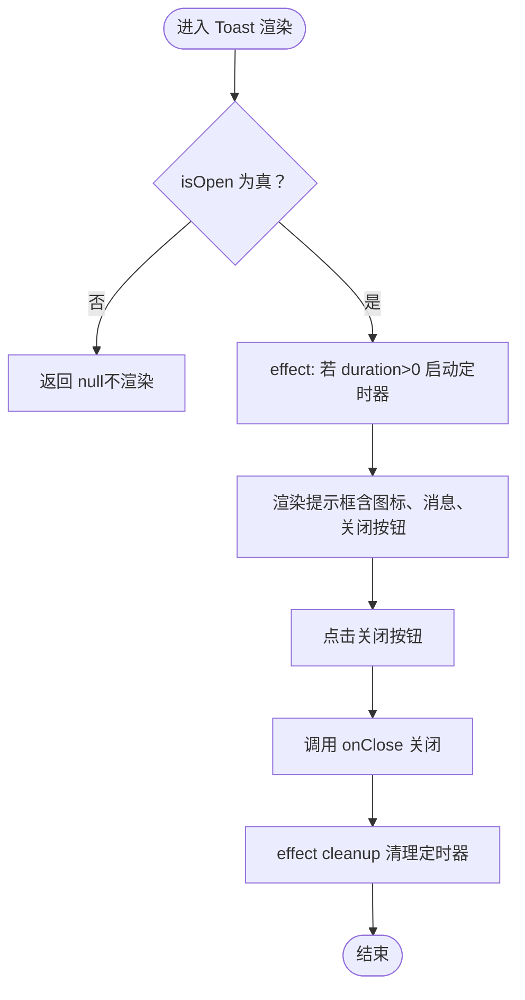
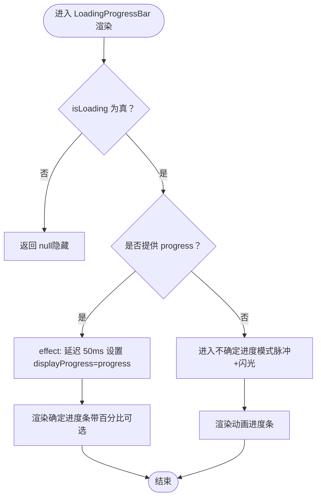
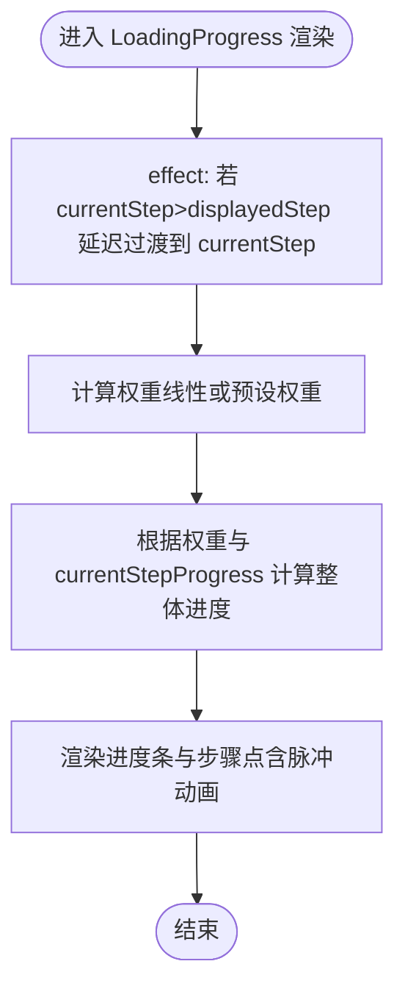
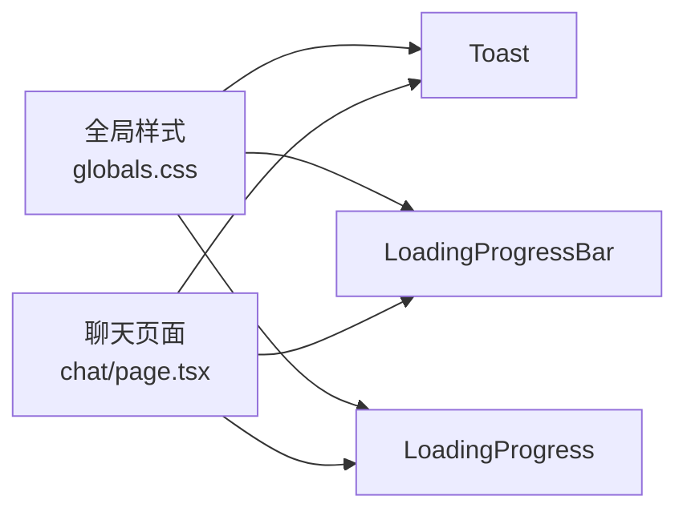

# 反馈组件

<cite>
**本文引用的文件**
- [web/components/ui/Toast.tsx](file://web/components/ui/Toast.tsx)
- [web/components/ui/LoadingProgressBar.tsx](file://web/components/ui/LoadingProgressBar.tsx)
- [web/components/ui/LoadingProgress.tsx](file://web/components/ui/LoadingProgress.tsx)
- [web/app/globals.css](file://web/app/globals.css)
- [web/app/layout.tsx](file://web/app/layout.tsx)
- [web/app/chat/page.tsx](file://web/app/chat/page.tsx)
</cite>

## 目录
1. [简介](#简介)
2. [项目结构](#项目结构)
3. [核心组件](#核心组件)
4. [架构总览](#架构总览)
5. [详细组件分析](#详细组件分析)
6. [依赖关系分析](#依赖关系分析)
7. [性能考量](#性能考量)
8. [故障排查指南](#故障排查指南)
9. [结论](#结论)
10. [附录](#附录)

## 简介
本文件系统性梳理并说明反馈组件体系，包括 Toast 提示组件的消息显示机制、自动消失逻辑与位置管理；LoadingProgressBar 与 LoadingProgress 加载组件的实现原理、动画效果与状态控制。文档同时覆盖组件的配置选项、触发方式、用户体验优化、样式定制、可访问性支持、性能考虑与错误处理策略，并结合项目实际使用场景给出最佳实践建议。

## 项目结构
反馈组件位于前端 Next.js 应用的 UI 组件目录中，配合全局样式与主题系统共同实现一致的视觉与交互体验。聊天页面作为主要使用场景之一，演示了如何在复杂流程中组合使用这些反馈组件。

**图表来源**
- [web/app/layout.tsx:16-48](file://web/app/layout.tsx#L16-L48)
- [web/app/globals.css:1-120](file://web/app/globals.css#L1-L120)
- [web/app/chat/page.tsx:1-120](file://web/app/chat/page.tsx#L1-L120)
- [web/components/ui/Toast.tsx:1-66](file://web/components/ui/Toast.tsx#L1-L66)
- [web/components/ui/LoadingProgressBar.tsx:1-76](file://web/components/ui/LoadingProgressBar.tsx#L1-L76)
- [web/components/ui/LoadingProgress.tsx:1-138](file://web/components/ui/LoadingProgress.tsx#L1-L138)

**章节来源**
- [web/app/layout.tsx:16-48](file://web/app/layout.tsx#L16-L48)
- [web/app/globals.css:1-120](file://web/app/globals.css#L1-L120)
- [web/app/chat/page.tsx:1-120](file://web/app/chat/page.tsx#L1-L120)

## 核心组件
- Toast 提示组件：用于短时、非阻塞的消息提示，支持多种类型与自动消失。
- LoadingProgressBar：用于展示确定或不确定进度的进度条，支持平滑过渡与百分比显示。
- LoadingProgress：用于多步骤流程的整体进度与步骤可视化，支持权重计算与步骤平滑过渡。

**章节来源**
- [web/components/ui/Toast.tsx:5-21](file://web/components/ui/Toast.tsx#L5-L21)
- [web/components/ui/LoadingProgressBar.tsx:5-28](file://web/components/ui/LoadingProgressBar.tsx#L5-L28)
- [web/components/ui/LoadingProgress.tsx:5-19](file://web/components/ui/LoadingProgress.tsx#L5-L19)

## 架构总览
反馈组件通过 React Hooks 实现状态与副作用管理，结合 Tailwind CSS 与全局动画样式，形成统一的视觉与交互风格。聊天页面作为典型场景，展示了如何在初始化、消息发送、文件处理等流程中合理插入反馈组件，提升用户感知与操作信心。

**图表来源**
- [web/app/chat/page.tsx:108-118](file://web/app/chat/page.tsx#L108-L118)
- [web/components/ui/Toast.tsx:15-31](file://web/components/ui/Toast.tsx#L15-L31)
- [web/components/ui/LoadingProgressBar.tsx:22-46](file://web/components/ui/LoadingProgressBar.tsx#L22-L46)
- [web/components/ui/LoadingProgress.tsx:13-32](file://web/components/ui/LoadingProgress.tsx#L13-L32)

## 详细组件分析

### Toast 提示组件
- 消息显示机制
  - 接收 isOpen、message、type、duration、onClose 等参数，按类型映射不同样式与图标。
  - 固定定位在右上角，具备阴影与动画入场效果，内部元素禁用指针事件以便透传点击到关闭按钮。
- 自动消失逻辑
  - 在 isOpen 为真且 duration 大于 0 时启动定时器，到期调用 onClose 关闭提示。
  - 组件卸载时清理定时器，避免内存泄漏。
- 位置管理
  - 使用固定定位 top-4 right-4，z-index 较高，确保层级优先级。
- 配置选项
  - 类型：success/error/info/warning
  - 持续时间：毫秒，默认 3000
  - 关闭回调：onClose
- 触发方式
  - 由业务页面（如聊天页）在特定事件（如恢复状态、停止生成）时设置 isOpen 与消息内容。
- 用户体验优化
  - 提供可点击的关闭按钮，支持键盘可访问性。
  - 深色/浅色主题下的颜色对比度优化。
- 可访问性支持
  - 内容语义明确，图标与颜色共同传达语义。
- 错误处理策略
  - 无副作用错误处理，依赖调用方正确传递参数与生命周期管理。

**图表来源**
- [web/components/ui/Toast.tsx:22-29](file://web/components/ui/Toast.tsx#L22-L29)
- [web/components/ui/Toast.tsx:47-63](file://web/components/ui/Toast.tsx#L47-L63)

**章节来源**
- [web/components/ui/Toast.tsx:5-64](file://web/components/ui/Toast.tsx#L5-L64)
- [web/app/chat/page.tsx:472-477](file://web/app/chat/page.tsx#L472-L477)
- [web/app/chat/page.tsx:657-662](file://web/app/chat/page.tsx#L657-L662)

### LoadingProgressBar 加载进度条
- 实现原理
  - 通过 isLoading 控制显示/隐藏；progress 为确定进度时，使用 displayProgress 平滑过渡到目标值。
  - 未提供 progress 时，进入不确定进度模式，使用脉冲与闪光动画模拟进度推进。
- 动画效果
  - 确定进度：宽度过渡动画，持续时间与缓动函数可配置。
  - 不确定进度：脉冲与闪光动画组合，营造“正在处理”的感知。
- 状态控制
  - 外部通过 props 控制 isLoading 与 progress；支持显示百分比与自定义样式类。
- 配置选项
  - isLoading: 是否显示
  - progress: 0-100 的数值（可选）
  - text: 左侧文本
  - showPercentage: 是否显示百分比
  - className: 自定义样式类
- 触发方式
  - 由业务流程（如初始化、消息发送、文件处理）在相应阶段设置 isLoading 与 progress。
- 用户体验优化
  - 平滑过渡减少突变带来的视觉不适；不确定进度模式避免误导用户。
- 可访问性支持
  - 文本与图标共同传达状态，建议在无障碍场景补充 aria-label。
- 错误处理策略
  - 无副作用错误处理，依赖调用方正确传递进度值与生命周期管理。

**图表来源**
- [web/components/ui/LoadingProgressBar.tsx:22-46](file://web/components/ui/LoadingProgressBar.tsx#L22-L46)
- [web/components/ui/LoadingProgressBar.tsx:32-42](file://web/components/ui/LoadingProgressBar.tsx#L32-L42)

**章节来源**
- [web/components/ui/LoadingProgressBar.tsx:5-74](file://web/components/ui/LoadingProgressBar.tsx#L5-L74)
- [web/app/chat/page.tsx:666-678](file://web/app/chat/page.tsx#L666-L678)

### LoadingProgress 多步骤进度
- 实现原理
  - 通过 steps 与 currentStep 描述流程；使用 displayedStep 平滑过渡到目标步骤，避免频繁切换造成视觉跳变。
  - 基于步骤权重（预估耗时）计算整体进度百分比，支持对当前步骤提供更精确的进度（currentStepProgress）。
- 动画效果
  - 整体进度条平滑过渡；当前步骤采用脉冲动画；步骤点根据完成状态切换颜色。
- 状态控制
  - 外部通过 steps 与 currentStep 控制；支持传入当前步骤进度以提升精度。
- 配置选项
  - steps: 步骤名称数组
  - currentStep: 当前步骤索引
  - message: 降级显示文本
  - className: 自定义样式类
  - currentStepProgress: 当前步骤进度百分比（0-100）
- 触发方式
  - 由业务流程在不同阶段更新 currentStep 与（可选）currentStepProgress。
- 用户体验优化
  - 步骤点与整体进度联动，帮助用户理解整体耗时与当前所处阶段。
- 可访问性支持
  - 文本描述步骤与进度，建议在复杂流程中提供额外的 ARIA 说明。
- 错误处理策略
  - 无副作用错误处理，依赖调用方正确传递步骤与进度。

**图表来源**
- [web/components/ui/LoadingProgress.tsx:13-32](file://web/components/ui/LoadingProgress.tsx#L13-L32)
- [web/components/ui/LoadingProgress.tsx:34-84](file://web/components/ui/LoadingProgress.tsx#L34-L84)

**章节来源**
- [web/components/ui/LoadingProgress.tsx:5-138](file://web/components/ui/LoadingProgress.tsx#L5-L138)
- [web/app/chat/page.tsx:132-146](file://web/app/chat/page.tsx#L132-L146)
- [web/app/chat/page.tsx:148-183](file://web/app/chat/page.tsx#L148-L183)

## 依赖关系分析
- 组件依赖
  - Toast 依赖 React 的 useEffect 生命周期钩子；样式依赖全局动画与主题变量。
  - LoadingProgressBar 依赖 useState/useEffect 实现平滑过渡；样式依赖全局动画与主题变量。
  - LoadingProgress 依赖 useState/useEffect 实现步骤平滑过渡与权重计算；样式依赖全局动画与主题变量。
- 样式与主题
  - 全局样式定义了主题色、背景色、文字色与阴影变量，并提供浅色/深色主题切换。
  - 动画定义了 slideIn、shimmer、pulse 等关键帧，被多个组件复用。
- 使用场景
  - 聊天页面在初始化、消息发送、文件处理等流程中组合使用上述组件，形成完整的反馈闭环。

**图表来源**
- [web/app/globals.css:253-262](file://web/app/globals.css#L253-L262)
- [web/app/globals.css:718-725](file://web/app/globals.css#L718-L725)
- [web/app/chat/page.tsx:108-118](file://web/app/chat/page.tsx#L108-L118)

**章节来源**
- [web/app/globals.css:253-262](file://web/app/globals.css#L253-L262)
- [web/app/globals.css:718-725](file://web/app/globals.css#L718-L725)
- [web/app/chat/page.tsx:108-118](file://web/app/chat/page.tsx#L108-L118)

## 性能考量
- 渲染开销
  - Toast 与 LoadingProgressBar 仅在 isOpen 或 isLoading 为真时渲染，避免不必要的 DOM。
  - LoadingProgress 通过 displayedStep 平滑过渡减少频繁重绘。
- 动画性能
  - 使用 CSS 动画与 transform/opacity 属性，避免昂贵的布局与绘制属性。
  - shimmer 与 pulse 动画在组件隐藏时不会执行，降低资源消耗。
- 状态更新
  - 通过 effect 清理定时器与轮询，防止内存泄漏与后台任务堆积。
- 交互响应
  - 关闭按钮与键盘可访问性优化，保证在高负载场景下仍能及时中断反馈。

[本节为通用性能指导，无需特定文件引用]

## 故障排查指南
- Toast 无法自动消失
  - 检查 isOpen 与 duration 参数是否正确传递；确认 effect 中的定时器是否被清理。
  - 确认 onClose 回调是否被调用。
- 进度条不更新
  - 确认 isLoading 为真；若为确定进度，检查 progress 是否随流程推进而变化。
  - 平滑过渡延迟为 50ms，确认外部状态更新频率是否过快导致抖动。
- 步骤进度异常
  - 检查 steps 数组长度与 currentStep 索引是否匹配；若步骤权重不一致，组件会回退为线性权重。
  - 若使用 currentStepProgress，请确保其范围在 0-100 且与 displayedStep 对应。
- 动画无效
  - 确认全局样式已加载；检查动画类名是否被覆盖。
- 可访问性问题
  - 建议为关键提示与步骤文本提供 aria-label 或 role 说明，确保屏幕阅读器可识别。

**章节来源**
- [web/components/ui/Toast.tsx:22-29](file://web/components/ui/Toast.tsx#L22-L29)
- [web/components/ui/LoadingProgressBar.tsx:32-42](file://web/components/ui/LoadingProgressBar.tsx#L32-L42)
- [web/components/ui/LoadingProgress.tsx:22-32](file://web/components/ui/LoadingProgress.tsx#L22-L32)

## 结论
反馈组件通过简洁的 API 与稳定的动画效果，在复杂业务流程中为用户提供了即时、直观的反馈。Toast 适合短时提示，LoadingProgressBar 适合确定进度场景，LoadingProgress 适合多步骤流程的整体可视化。结合全局样式与主题系统，组件在不同环境下保持一致的观感与性能表现。建议在实际使用中遵循本文的配置与优化建议，以获得最佳用户体验。

[本节为总结性内容，无需特定文件引用]

## 附录

### 组件配置与触发清单
- Toast
  - 参数：isOpen、message、type、duration、onClose
  - 触发：业务事件（如恢复状态、停止生成）
- LoadingProgressBar
  - 参数：isLoading、progress、text、showPercentage、className
  - 触发：初始化、消息发送、文件处理等阶段
- LoadingProgress
  - 参数：steps、currentStep、message、className、currentStepProgress
  - 触发：多步骤流程（如检索、生成、保存）

**章节来源**
- [web/components/ui/Toast.tsx:7-21](file://web/components/ui/Toast.tsx#L7-L21)
- [web/components/ui/LoadingProgressBar.tsx:5-28](file://web/components/ui/LoadingProgressBar.tsx#L5-L28)
- [web/components/ui/LoadingProgress.tsx:5-19](file://web/components/ui/LoadingProgress.tsx#L5-L19)