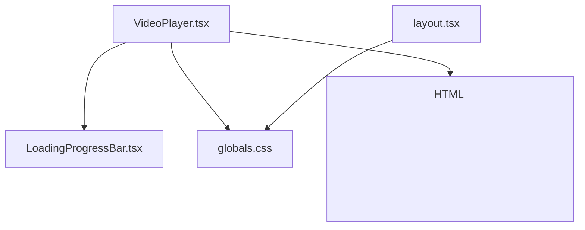
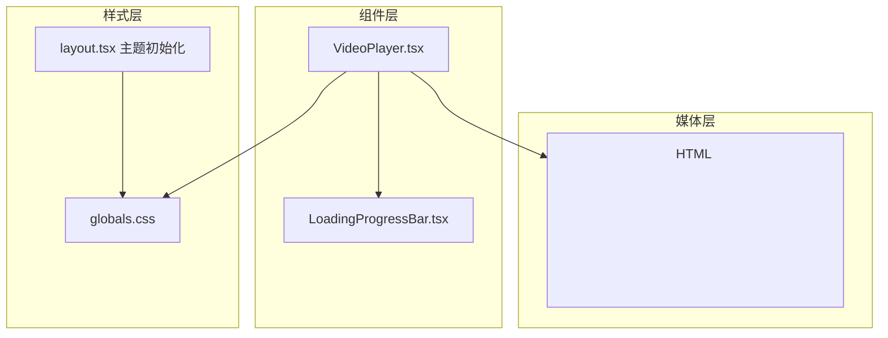
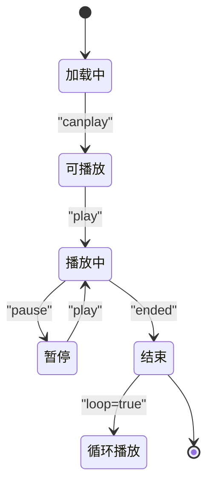
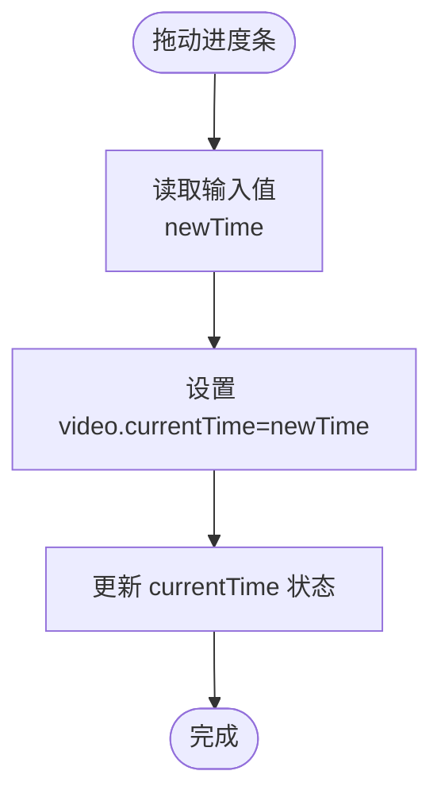
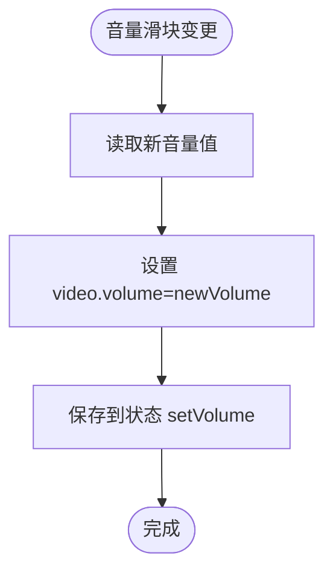
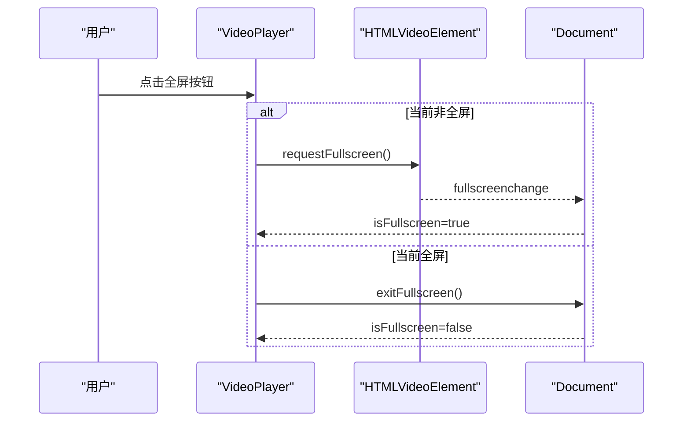
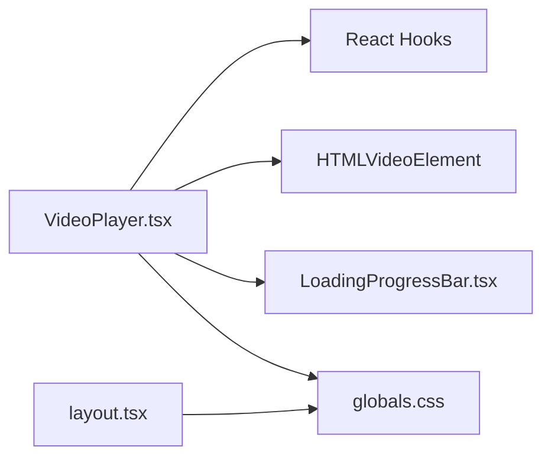
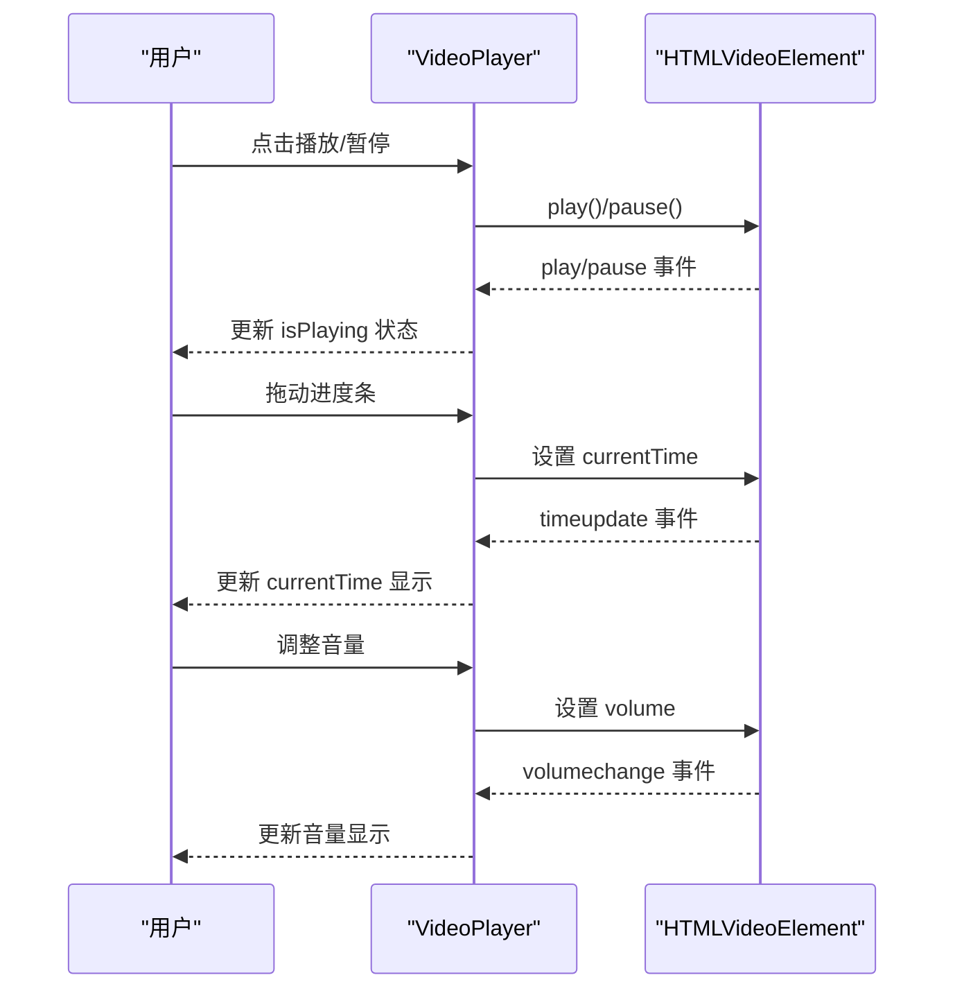

# 媒体组件

<cite>
**本文引用的文件**
- [VideoPlayer.tsx](file://web/components/ui/VideoPlayer.tsx)
- [LoadingProgressBar.tsx](file://web/components/ui/LoadingProgressBar.tsx)
- [globals.css](file://web/app/globals.css)
- [layout.tsx](file://web/app/layout.tsx)
</cite>

## 目录
1. [简介](#简介)
2. [项目结构](#项目结构)
3. [核心组件](#核心组件)
4. [架构总览](#架构总览)
5. [详细组件分析](#详细组件分析)
6. [依赖关系分析](#依赖关系分析)
7. [性能考虑](#性能考虑)
8. [故障排除指南](#故障排除指南)
9. [结论](#结论)
10. [附录](#附录)

## 简介
本文件面向“媒体组件”中的 VideoPlayer 视频播放器组件，提供从架构到实现细节的完整说明。内容涵盖播放控制与状态管理、进度条与音量调节、响应式设计与全屏模式、可配置参数与样式定制、性能优化策略、浏览器兼容性以及错误处理建议。目标是帮助开发者快速理解并正确使用该组件，同时为二次开发与扩展提供清晰指引。

## 项目结构
VideoPlayer 组件位于前端 Next.js 应用中，采用客户端组件模式，配合 TailwindCSS 样式与渐进增强的 UI 控件实现。其主要文件与职责如下：
- VideoPlayer.tsx：视频播放器主体，负责事件监听、状态管理、播放控制与 UI 渲染
- LoadingProgressBar.tsx：加载进度条子组件，支持确定与不确定进度模式
- globals.css：全局样式与主题变量，提供深浅色主题切换与通用样式
- layout.tsx：应用布局与主题初始化脚本，确保 SSR 与客户端主题一致

**图表来源**
- [VideoPlayer.tsx:157-277](file://web/components/ui/VideoPlayer.tsx#L157-L277)
- [LoadingProgressBar.tsx:22-74](file://web/components/ui/LoadingProgressBar.tsx#L22-L74)
- [globals.css:1-122](file://web/app/globals.css#L1-L122)
- [layout.tsx:16-48](file://web/app/layout.tsx#L16-L48)

**章节来源**
- [VideoPlayer.tsx:1-280](file://web/components/ui/VideoPlayer.tsx#L1-L280)
- [LoadingProgressBar.tsx:1-76](file://web/components/ui/LoadingProgressBar.tsx#L1-L76)
- [globals.css:1-122](file://web/app/globals.css#L1-L122)
- [layout.tsx:1-49](file://web/app/layout.tsx#L1-L49)

## 核心组件
VideoPlayer 是一个基于 React 的客户端组件，封装了 HTML5 video 的播放能力，并通过自定义 UI 提供更友好的交互体验。其关键特性包括：
- 播放状态管理：播放/暂停、当前时间、总时长、音量
- 加载进度反馈：缓冲进度可视化与加载提示
- 控制面板：进度拖拽、音量调节、全屏切换
- 响应式设计：鼠标悬停显示控制栏，深浅色主题适配
- 全屏模式：请求与退出全屏，状态同步

**章节来源**
- [VideoPlayer.tsx:22-155](file://web/components/ui/VideoPlayer.tsx#L22-L155)

## 架构总览
VideoPlayer 通过 React Hooks 管理内部状态，绑定 HTMLVideoElement 的事件以实时更新 UI；同时依赖 LoadingProgressBar 子组件展示加载进度。全局样式与主题系统保证组件在不同主题下的视觉一致性。

**图表来源**
- [VideoPlayer.tsx:157-277](file://web/components/ui/VideoPlayer.tsx#L157-L277)
- [LoadingProgressBar.tsx:22-74](file://web/components/ui/LoadingProgressBar.tsx#L22-L74)
- [globals.css:1-122](file://web/app/globals.css#L1-L122)
- [layout.tsx:16-48](file://web/app/layout.tsx#L16-L48)

## 详细组件分析

### 组件接口与配置选项
VideoPlayer 接收以下属性：
- src：视频资源地址
- title：可选标题（用于无障碍）
- className：自定义样式类名
- autoPlay：是否自动播放
- loop：是否循环播放
- muted：是否静音

这些属性直接传递给底层 HTML <video> 元素，确保与原生语义一致。

**章节来源**
- [VideoPlayer.tsx:6-29](file://web/components/ui/VideoPlayer.tsx#L6-L29)

### 播放状态管理
VideoPlayer 使用 useState 管理以下状态：
- isLoading：是否处于加载阶段
- loadProgress：缓冲进度百分比
- isPlaying：播放/暂停状态
- currentTime：当前播放时间
- duration：视频总时长
- volume：音量值（0-1）
- showControls：控制栏可见性
- isFullscreen：全屏状态

状态更新由 HTMLVideoElement 的事件驱动：
- loadstart/progress/canplay：加载与缓冲状态
- loadedmetadata：获取时长
- timeupdate：播放进度
- play/pause：播放状态
- volumechange：音量变化
- fullscreenchange：全屏状态

**图表来源**
- [VideoPlayer.tsx:41-103](file://web/components/ui/VideoPlayer.tsx#L41-L103)

**章节来源**
- [VideoPlayer.tsx:30-38](file://web/components/ui/VideoPlayer.tsx#L30-L38)
- [VideoPlayer.tsx:41-103](file://web/components/ui/VideoPlayer.tsx#L41-L103)

### 进度条控制
- 进度条范围：min=0，max=duration
- 当前进度：value=currentTime
- 样式：使用线性渐变表示已播与剩余部分
- 交互：用户拖动时更新 currentTime 与 video.currentTime

**图表来源**
- [VideoPlayer.tsx:116-122](file://web/components/ui/VideoPlayer.tsx#L116-L122)

**章节来源**
- [VideoPlayer.tsx:192-203](file://web/components/ui/VideoPlayer.tsx#L192-L203)
- [VideoPlayer.tsx:116-122](file://web/components/ui/VideoPlayer.tsx#L116-L122)

### 音量调节
- 音量范围：0 到 1
- 样式：根据当前音量动态绘制渐变背景
- 交互：用户调整时同步更新 video.volume 与状态

**图表来源**
- [VideoPlayer.tsx:124-130](file://web/components/ui/VideoPlayer.tsx#L124-L130)

**章节来源**
- [VideoPlayer.tsx:234-256](file://web/components/ui/VideoPlayer.tsx#L234-L256)
- [VideoPlayer.tsx:124-130](file://web/components/ui/VideoPlayer.tsx#L124-L130)

### 全屏模式
- 请求全屏：调用 video.requestFullscreen
- 退出全屏：调用 document.exitFullscreen
- 状态同步：监听 fullscreenchange 更新 isFullscreen

**图表来源**
- [VideoPlayer.tsx:132-145](file://web/components/ui/VideoPlayer.tsx#L132-L145)
- [VideoPlayer.tsx:78-80](file://web/components/ui/VideoPlayer.tsx#L78-L80)

**章节来源**
- [VideoPlayer.tsx:132-145](file://web/components/ui/VideoPlayer.tsx#L132-L145)
- [VideoPlayer.tsx:78-80](file://web/components/ui/VideoPlayer.tsx#L78-L80)

### 响应式设计与控制栏
- 控制栏默认隐藏，鼠标进入容器时显示，离开时隐藏
- 控制栏采用渐变背景，覆盖于视频底部，确保可读性
- 时间显示格式化函数支持小时单位的处理

**章节来源**
- [VideoPlayer.tsx:157-162](file://web/components/ui/VideoPlayer.tsx#L157-L162)
- [VideoPlayer.tsx:189-275](file://web/components/ui/VideoPlayer.tsx#L189-L275)
- [VideoPlayer.tsx:147-155](file://web/components/ui/VideoPlayer.tsx#L147-L155)

### 键盘快捷键支持
当前实现未包含键盘快捷键绑定。若需扩展，可在组件中添加键盘事件监听并在按键触发时调用对应播放控制方法（如播放/暂停、音量增减、跳转等）。注意需避免与浏览器默认快捷键冲突，并提供无障碍提示。

[本节为概念性建议，不直接分析具体文件，故无“章节来源”]

### 自定义样式与扩展方法
- 自定义样式：通过 className 传入自定义类名，结合 Tailwind 工具类进行样式覆盖
- 主题适配：依赖 globals.css 中的主题变量与深浅色模式切换逻辑
- 扩展点：可新增属性（如 poster、preload、controls 等）以满足更多场景需求；或引入额外控件（如画中画、清晰度切换）

**章节来源**
- [VideoPlayer.tsx:25-29](file://web/components/ui/VideoPlayer.tsx#L25-L29)
- [globals.css:1-122](file://web/app/globals.css#L1-L122)
- [layout.tsx:16-48](file://web/app/layout.tsx#L16-L48)

## 依赖关系分析
VideoPlayer 的直接依赖关系如下：
- 内部依赖：React Hooks（useState/ref/useEffect）、HTMLVideoElement
- 子组件：LoadingProgressBar
- 样式：globals.css（主题变量与通用样式）
- 布局：layout.tsx（主题初始化脚本）

**图表来源**
- [VideoPlayer.tsx:3-4](file://web/components/ui/VideoPlayer.tsx#L3-L4)
- [LoadingProgressBar.tsx:22-74](file://web/components/ui/LoadingProgressBar.tsx#L22-L74)
- [globals.css:1-122](file://web/app/globals.css#L1-L122)
- [layout.tsx:16-48](file://web/app/layout.tsx#L16-L48)

**章节来源**
- [VideoPlayer.tsx:3-4](file://web/components/ui/VideoPlayer.tsx#L3-L4)
- [LoadingProgressBar.tsx:22-74](file://web/components/ui/LoadingProgressBar.tsx#L22-L74)
- [globals.css:1-122](file://web/app/globals.css#L1-L122)
- [layout.tsx:16-48](file://web/app/layout.tsx#L16-L48)

## 性能考虑
- 事件解绑：在 useEffect 返回的清理函数中移除所有事件监听，避免内存泄漏与重复绑定
- 渲染优化：仅在状态变化时重渲染必要部分；进度条与音量条使用内联样式与最小化 DOM 更新
- 加载反馈：LoadingProgressBar 在不确定进度模式下使用动画，减少不必要的计算
- 原生播放：优先使用浏览器原生 <video> 能力，减少自定义逻辑开销

**章节来源**
- [VideoPlayer.tsx:92-102](file://web/components/ui/VideoPlayer.tsx#L92-L102)
- [LoadingProgressBar.tsx:32-42](file://web/components/ui/LoadingProgressBar.tsx#L32-L42)

## 故障排除指南
- 视频无法播放
  - 检查资源地址与跨域策略
  - 确认浏览器对媒体格式的支持（常见为 MP4/H.264、WebM/VP8/VP9）
  - 若为移动端，确认 autoPlay 策略与静音要求
- 控制栏不显示
  - 确认容器具备鼠标进入/离开事件（默认行为）
  - 检查父级样式是否影响透明度或定位
- 全屏失败
  - 确认浏览器支持 Web API requestFullscreen/exitFullscreen
  - 部分浏览器需要用户手势触发
- 加载进度异常
  - 确认 video.buffered 与 duration 的可用性
  - 检查网络状况与服务器响应头（Content-Length、Range 支持）

**章节来源**
- [VideoPlayer.tsx:45-61](file://web/components/ui/VideoPlayer.tsx#L45-L61)
- [VideoPlayer.tsx:136-144](file://web/components/ui/VideoPlayer.tsx#L136-L144)

## 结论
VideoPlayer 组件通过简洁的接口与完善的事件驱动机制，实现了对 HTML5 视频的增强控制。其加载进度反馈、自定义控制栏与全屏支持提升了用户体验；配合全局主题系统，能在深浅色模式下保持一致的视觉效果。对于进一步扩展，建议增加键盘快捷键、画中画、清晰度选择等能力，并持续关注浏览器兼容性与性能优化。

## 附录

### API 定义（属性）
- src: 字符串，视频资源地址
- title: 字符串（可选），用于无障碍标签
- className: 字符串（可选），自定义样式类
- autoPlay: 布尔值（可选），是否自动播放
- loop: 布尔值（可选），是否循环播放
- muted: 布尔值（可选），是否静音

**章节来源**
- [VideoPlayer.tsx:6-29](file://web/components/ui/VideoPlayer.tsx#L6-L29)

### 关键流程图：播放控制序列

**图表来源**
- [VideoPlayer.tsx:105-130](file://web/components/ui/VideoPlayer.tsx#L105-L130)
- [VideoPlayer.tsx:67-76](file://web/components/ui/VideoPlayer.tsx#L67-L76)