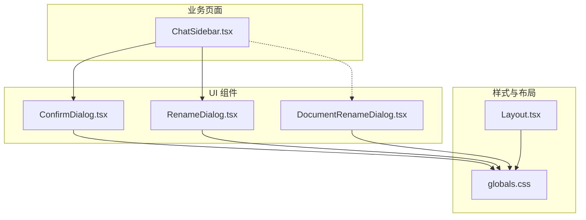
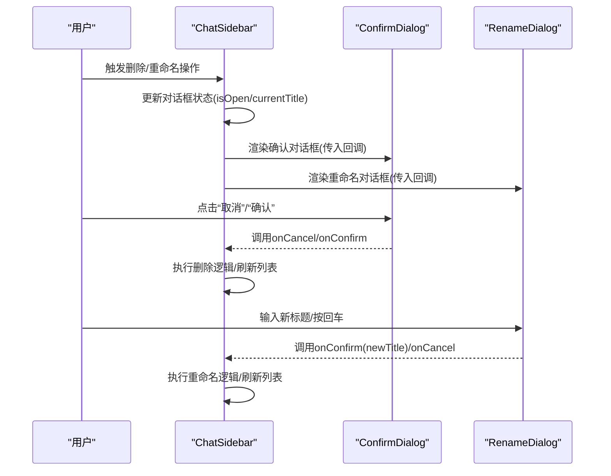
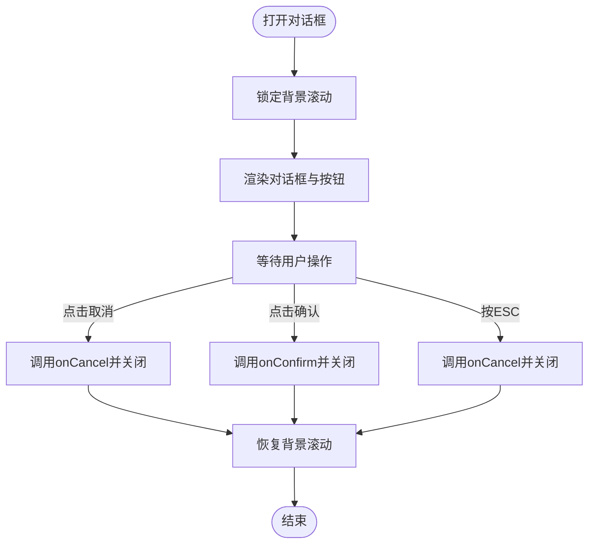
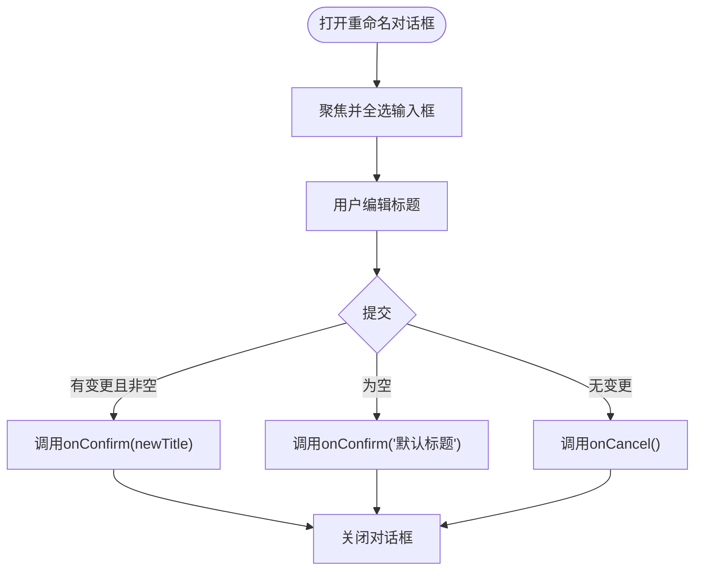
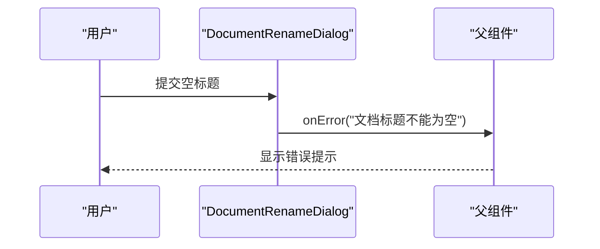
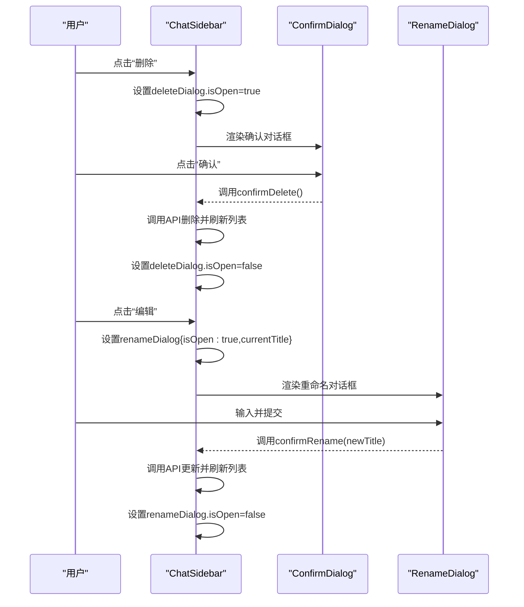
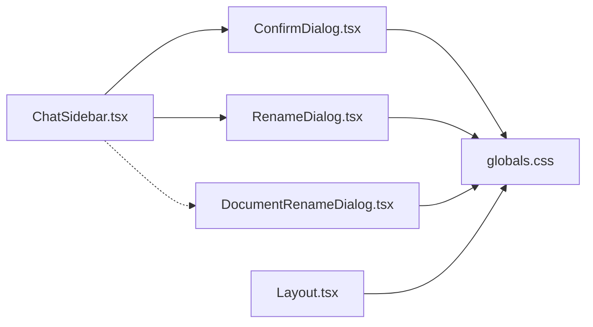

# 对话框组件

<cite>
**本文引用的文件**
- [ConfirmDialog.tsx](file://web/components/ui/ConfirmDialog.tsx)
- [RenameDialog.tsx](file://web/components/ui/RenameDialog.tsx)
- [DocumentRenameDialog.tsx](file://web/components/document/DocumentRenameDialog.tsx)
- [ChatSidebar.tsx](file://web/components/chat/ChatSidebar.tsx)
- [globals.css](file://web/app/globals.css)
- [Layout.tsx](file://web/components/ui/Layout.tsx)
</cite>

## 目录
1. [简介](#简介)
2. [项目结构](#项目结构)
3. [核心组件](#核心组件)
4. [架构总览](#架构总览)
5. [详细组件分析](#详细组件分析)
6. [依赖关系分析](#依赖关系分析)
7. [性能考量](#性能考量)
8. [故障排查指南](#故障排查指南)
9. [结论](#结论)
10. [附录](#附录)

## 简介
本文件系统性梳理并说明项目中的对话框组件体系，重点覆盖以下方面：
- ConfirmDialog 确认对话框：交互流程、按钮配置与回调处理机制
- RenameDialog 重命名对话框：输入验证、实时预览与提交逻辑
- 生命周期管理、焦点控制与键盘导航支持
- 使用示例、样式定制与国际化支持建议
- 可访问性设计、错误处理与用户体验优化策略

## 项目结构
对话框组件主要位于 web/components/ui 与 web/components/document 目录，配合全局样式与布局组件共同实现一致的视觉与交互体验。

**图表来源**
- [ConfirmDialog.tsx:1-119](file://web/components/ui/ConfirmDialog.tsx#L1-L119)
- [RenameDialog.tsx:1-127](file://web/components/ui/RenameDialog.tsx#L1-L127)
- [DocumentRenameDialog.tsx:1-132](file://web/components/document/DocumentRenameDialog.tsx#L1-L132)
- [ChatSidebar.tsx:344-362](file://web/components/chat/ChatSidebar.tsx#L344-L362)
- [globals.css:232-251](file://web/app/globals.css#L232-L251)
- [Layout.tsx:1-61](file://web/components/ui/Layout.tsx#L1-L61)

**章节来源**
- [ConfirmDialog.tsx:1-119](file://web/components/ui/ConfirmDialog.tsx#L1-L119)
- [RenameDialog.tsx:1-127](file://web/components/ui/RenameDialog.tsx#L1-L127)
- [DocumentRenameDialog.tsx:1-132](file://web/components/document/DocumentRenameDialog.tsx#L1-L132)
- [ChatSidebar.tsx:344-362](file://web/components/chat/ChatSidebar.tsx#L344-L362)
- [globals.css:232-251](file://web/app/globals.css#L232-L251)
- [Layout.tsx:1-61](file://web/components/ui/Layout.tsx#L1-L61)

## 核心组件
- ConfirmDialog：通用确认对话框，支持危险/默认两种外观、加载状态禁用按钮、ESC 关闭、背景滚动锁定等。
- RenameDialog：轻量级重命名对话框，内置输入校验（空值与重复）、自动聚焦与全选、ESC 关闭、背景滚动锁定。
- DocumentRenameDialog：文档重命名对话框，与 RenameDialog 类似，但提供错误回调以提示“标题不能为空”。

**章节来源**
- [ConfirmDialog.tsx:5-27](file://web/components/ui/ConfirmDialog.tsx#L5-L27)
- [RenameDialog.tsx:5-17](file://web/components/ui/RenameDialog.tsx#L5-L17)
- [DocumentRenameDialog.tsx:5-19](file://web/components/document/DocumentRenameDialog.tsx#L5-L19)

## 架构总览
对话框组件通过 props 驱动显示与行为，结合全局样式与键盘事件监听实现统一的交互体验。业务组件（如 ChatSidebar）负责状态管理与回调执行。

**图表来源**
- [ChatSidebar.tsx:92-145](file://web/components/chat/ChatSidebar.tsx#L92-L145)
- [ConfirmDialog.tsx:17-51](file://web/components/ui/ConfirmDialog.tsx#L17-L51)
- [RenameDialog.tsx:12-63](file://web/components/ui/RenameDialog.tsx#L12-L63)

## 详细组件分析

### ConfirmDialog 确认对话框
- 交互流程
  - 打开时锁定背景滚动，点击遮罩或按 ESC 触发取消回调
  - 点击确认按钮触发确认回调；在加载状态下禁用按钮
  - 支持危险样式变体（红色系），默认为蓝色系
- 按钮配置
  - 可配置确认文本、取消文本、危险样式、加载状态
- 回调处理
  - onConfirm：执行业务确认动作
  - onCancel：撤销操作并清理状态
- 焦点与键盘
  - ESC 键监听，支持键盘关闭
- 样式与动画
  - 使用全局动画类实现淡入与缩放效果

**图表来源**
- [ConfirmDialog.tsx:28-49](file://web/components/ui/ConfirmDialog.tsx#L28-L49)
- [ConfirmDialog.tsx:53-116](file://web/components/ui/ConfirmDialog.tsx#L53-L116)

**章节来源**
- [ConfirmDialog.tsx:1-119](file://web/components/ui/ConfirmDialog.tsx#L1-L119)

### RenameDialog 重命名对话框
- 输入验证
  - 去除首尾空白；若为空则回退到默认标题
  - 若与当前标题相同则取消（不触发确认）
- 实时预览
  - 自动聚焦并全选输入框，便于快速编辑
- 提交逻辑
  - 提交表单时根据条件决定调用 onConfirm 或 onCancel
- 键盘与焦点
  - ESC 关闭；输入框自动获得焦点
- 样式与动画
  - 使用全局动画类实现淡入与缩放效果

**图表来源**
- [RenameDialog.tsx:21-49](file://web/components/ui/RenameDialog.tsx#L21-L49)
- [RenameDialog.tsx:63-126](file://web/components/ui/RenameDialog.tsx#L63-L126)

**章节来源**
- [RenameDialog.tsx:1-127](file://web/components/ui/RenameDialog.tsx#L1-L127)

### DocumentRenameDialog 文档重命名对话框
- 与 RenameDialog 的差异
  - 增加 onError 回调，当标题为空时向上传递错误信息
  - 更长的最大长度限制
- 交互与回调
  - 与 RenameDialog 一致的输入验证与提交逻辑
- 错误处理
  - 通过 onError 提示“文档标题不能为空”

**图表来源**
- [DocumentRenameDialog.tsx:57-69](file://web/components/document/DocumentRenameDialog.tsx#L57-L69)

**章节来源**
- [DocumentRenameDialog.tsx:1-132](file://web/components/document/DocumentRenameDialog.tsx#L1-L132)

### 在业务组件中的使用示例
- ChatSidebar 中的删除与重命名流程
  - 状态管理：分别维护删除与重命名对话框的状态对象
  - 触发方式：点击“编辑/删除”按钮设置对应对话框状态
  - 回调处理：确认后调用 API 更新列表并清理状态

**图表来源**
- [ChatSidebar.tsx:92-145](file://web/components/chat/ChatSidebar.tsx#L92-L145)
- [ChatSidebar.tsx:344-362](file://web/components/chat/ChatSidebar.tsx#L344-L362)

**章节来源**
- [ChatSidebar.tsx:1-367](file://web/components/chat/ChatSidebar.tsx#L1-L367)

## 依赖关系分析
- 组件依赖
  - ConfirmDialog/RenameDialog 为通用 UI 组件，依赖全局样式与键盘事件
  - DocumentRenameDialog 在 RenameDialog 基础上增加错误回调
  - ChatSidebar 作为业务容器，负责状态与回调的编排
- 样式依赖
  - 对话框动画与主题色来自全局样式文件
- 布局影响
  - 打开对话框时锁定背景滚动，避免页面滚动穿透

**图表来源**
- [ChatSidebar.tsx:11-12](file://web/components/chat/ChatSidebar.tsx#L11-L12)
- [ConfirmDialog.tsx:1-119](file://web/components/ui/ConfirmDialog.tsx#L1-L119)
- [RenameDialog.tsx:1-127](file://web/components/ui/RenameDialog.tsx#L1-L127)
- [DocumentRenameDialog.tsx:1-132](file://web/components/document/DocumentRenameDialog.tsx#L1-L132)
- [globals.css:232-251](file://web/app/globals.css#L232-L251)
- [Layout.tsx:1-61](file://web/components/ui/Layout.tsx#L1-L61)

**章节来源**
- [globals.css:232-251](file://web/app/globals.css#L232-L251)
- [Layout.tsx:1-61](file://web/components/ui/Layout.tsx#L1-L61)

## 性能考量
- 渲染控制
  - 对话框仅在 isOpen 为真时渲染，避免常驻 DOM
- 事件监听
  - ESC 键监听在组件挂载期间注册/卸载，防止内存泄漏
- 焦点管理
  - 打开时聚焦输入框，减少用户操作步数
- 动画与滚动
  - 使用 CSS 动画与 transform，避免强制同步布局
  - 锁定背景滚动，避免滚动重排

[本节为通用指导，无需列出具体文件来源]

## 故障排查指南
- 对话框无法关闭
  - 检查 isOpen 状态是否正确传递
  - 确认遮罩点击与 ESC 事件是否被阻止冒泡
- 确认按钮不可用
  - 检查 isLoading 状态是否被错误置为 true
- 重命名无效
  - 确认输入是否为空或与原标题相同
  - 检查 onConfirm 回调是否正确执行并刷新数据
- 错误提示未显示
  - DocumentRenameDialog 需要提供 onError 回调以接收“标题不能为空”的提示

**章节来源**
- [ConfirmDialog.tsx:28-49](file://web/components/ui/ConfirmDialog.tsx#L28-L49)
- [RenameDialog.tsx:21-49](file://web/components/ui/RenameDialog.tsx#L21-L49)
- [DocumentRenameDialog.tsx:57-69](file://web/components/document/DocumentRenameDialog.tsx#L57-L69)

## 结论
本组件体系通过简洁的 props 接口与统一的样式/交互规范，实现了确认与重命名两类高频对话场景。结合业务组件的状态编排与回调处理，能够稳定地支撑多页面交互需求。建议在后续迭代中进一步完善国际化文案与无障碍属性，以提升跨语言与可访问性体验。

[本节为总结性内容，无需列出具体文件来源]

## 附录

### 使用示例与最佳实践
- 在业务组件中组合使用
  - 将对话框状态与业务状态解耦，通过 props 传递
  - 在回调中统一处理成功/失败后的状态清理
- 样式定制
  - 通过全局 CSS 变量与动画类进行主题与动效定制
  - 注意深浅色模式下的对比度与可读性
- 国际化支持
  - 将文案通过 props 注入，避免硬编码
  - 为不同语言提供对应的 confirmText/cancelText
- 可访问性
  - 确保对话框内容可被屏幕阅读器识别
  - 保证键盘可达性（Tab/Shift+Tab 切换、Enter/Space 触发）
  - 提供明确的焦点指示与 ARIA 属性

**章节来源**
- [ConfirmDialog.tsx:5-27](file://web/components/ui/ConfirmDialog.tsx#L5-L27)
- [RenameDialog.tsx:5-17](file://web/components/ui/RenameDialog.tsx#L5-L17)
- [DocumentRenameDialog.tsx:5-19](file://web/components/document/DocumentRenameDialog.tsx#L5-L19)
- [globals.css:232-251](file://web/app/globals.css#L232-L251)