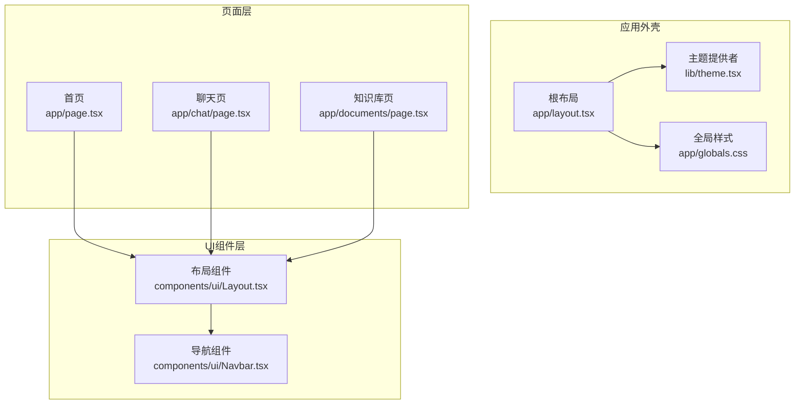
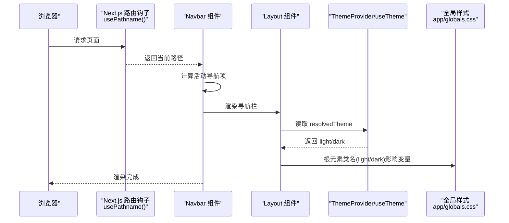
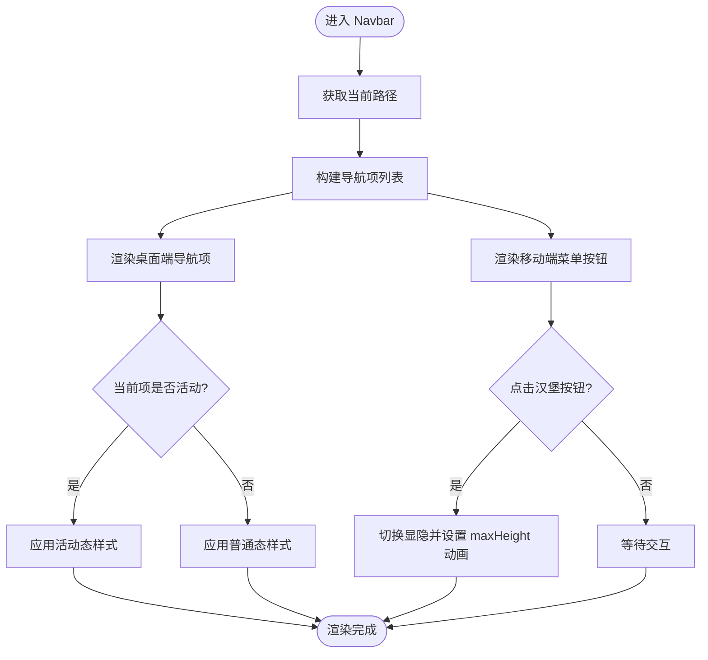
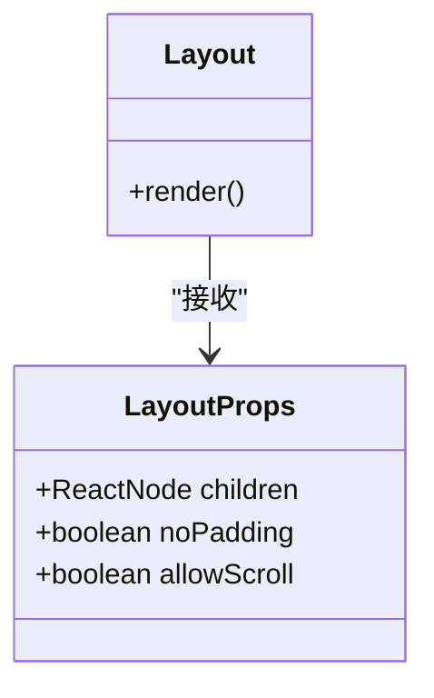
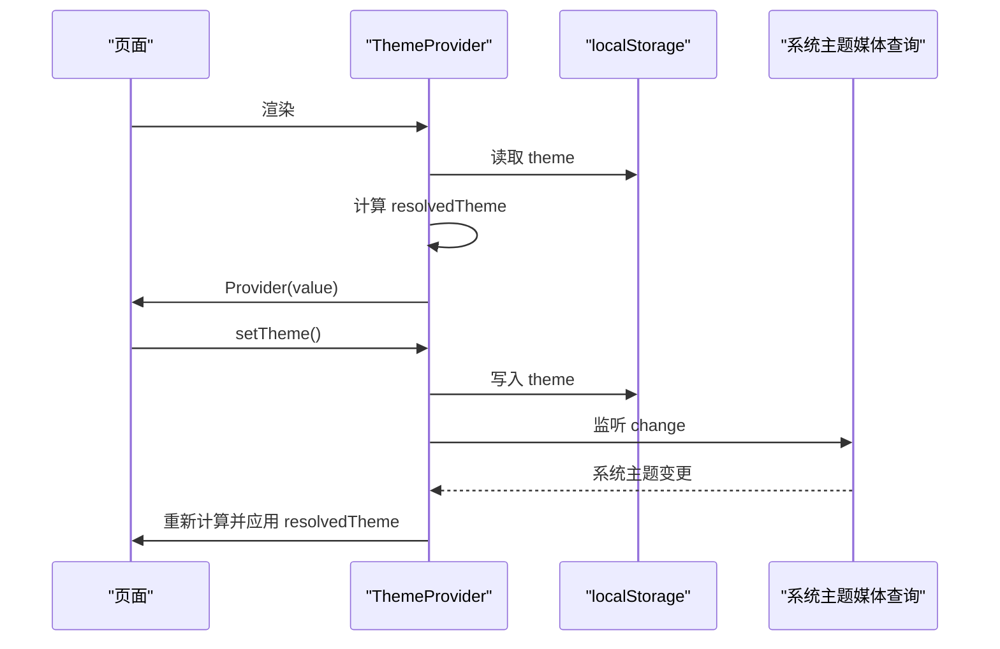
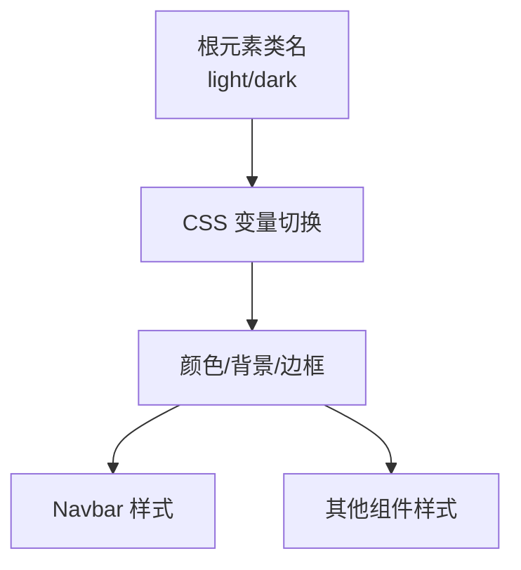
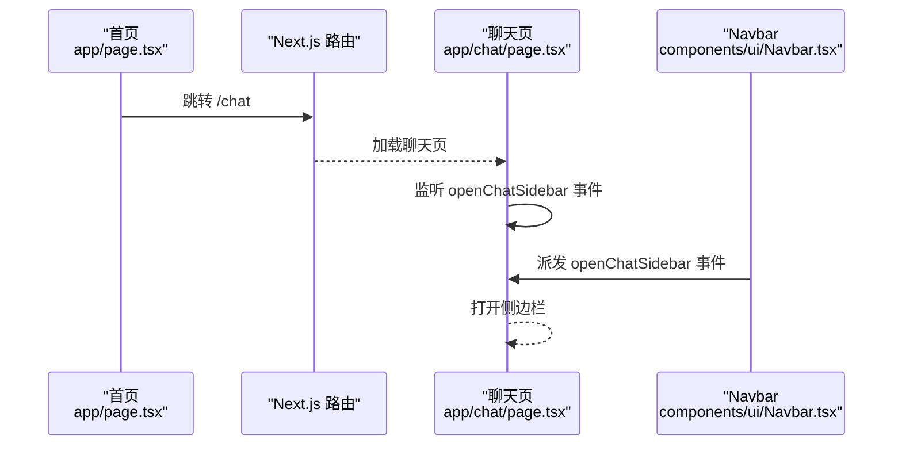
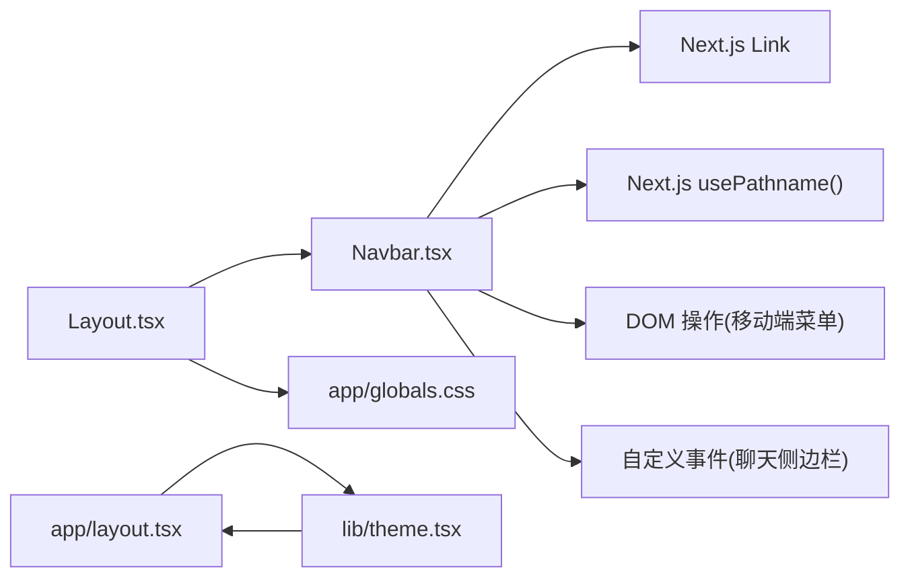

# 导航组件

<cite>
**本文引用的文件**
- [web/components/ui/Navbar.tsx](file://web/components/ui/Navbar.tsx)
- [web/components/ui/Layout.tsx](file://web/components/ui/Layout.tsx)
- [web/app/layout.tsx](file://web/app/layout.tsx)
- [web/lib/theme.tsx](file://web/lib/theme.tsx)
- [web/app/globals.css](file://web/app/globals.css)
- [web/app/chat/page.tsx](file://web/app/chat/page.tsx)
- [web/app/documents/page.tsx](file://web/app/documents/page.tsx)
- [web/app/page.tsx](file://web/app/page.tsx)
</cite>

## 目录
1. [简介](#简介)
2. [项目结构](#项目结构)
3. [核心组件](#核心组件)
4. [架构总览](#架构总览)
5. [详细组件分析](#详细组件分析)
6. [依赖关系分析](#依赖关系分析)
7. [性能考量](#性能考量)
8. [故障排查指南](#故障排查指南)
9. [结论](#结论)
10. [附录](#附录)

## 简介
本文件面向前端开发者与产品设计人员，系统化阐述导航组件（Navbar）的设计架构与实现细节，覆盖响应式导航栏构建、移动端菜单切换逻辑、活动状态管理、路由集成、事件处理与状态管理、动态导航项渲染、主题切换与无障碍支持，并提供可扩展的使用示例与最佳实践。

## 项目结构
导航组件位于 UI 组件层，通过 Layout 统一挂载于各页面之上，配合全局主题系统与 TailwindCSS 样式体系，形成一致的视觉与交互体验。

**图表来源**
- [web/app/layout.tsx:16-48](file://web/app/layout.tsx#L16-L48)
- [web/lib/theme.tsx:15-101](file://web/lib/theme.tsx#L15-L101)
- [web/app/globals.css:1-120](file://web/app/globals.css#L1-L120)
- [web/app/page.tsx:7-38](file://web/app/page.tsx#L7-L38)
- [web/app/chat/page.tsx:22-677](file://web/app/chat/page.tsx#L22-L677)
- [web/app/documents/page.tsx:12-334](file://web/app/documents/page.tsx#L12-L334)
- [web/components/ui/Layout.tsx:12-59](file://web/components/ui/Layout.tsx#L12-L59)
- [web/components/ui/Navbar.tsx:6-123](file://web/components/ui/Navbar.tsx#L6-L123)

**章节来源**
- [web/app/layout.tsx:16-48](file://web/app/layout.tsx#L16-L48)
- [web/components/ui/Layout.tsx:12-59](file://web/components/ui/Layout.tsx#L12-L59)
- [web/components/ui/Navbar.tsx:6-123](file://web/components/ui/Navbar.tsx#L6-L123)

## 核心组件
- 导航组件（Navbar）
  - 职责：渲染顶部导航栏，根据当前路由高亮活动项，移动端提供汉堡菜单与展开收起动画，聊天页在窄屏下提供侧边栏开关入口。
  - 数据来源：Next.js 路由钩子获取当前路径，静态导航项列表。
  - 事件：移动端菜单切换、聊天页侧边栏开关（通过自定义事件）。
  - 样式：TailwindCSS 类名与全局 CSS 变量驱动，支持浅色/深色主题与暗黑模式。
- 布局组件（Layout）
  - 职责：为页面提供统一的外层容器与滚动策略，承载 Navbar 并按需注入内边距与安全区适配。
- 主题系统（ThemeProvider + useTheme）
  - 职责：提供主题状态与切换能力，持久化用户偏好，监听系统主题变化，应用到根元素类名，驱动 CSS 变量生效。

**章节来源**
- [web/components/ui/Navbar.tsx:6-123](file://web/components/ui/Navbar.tsx#L6-L123)
- [web/components/ui/Layout.tsx:12-59](file://web/components/ui/Layout.tsx#L12-L59)
- [web/lib/theme.tsx:15-110](file://web/lib/theme.tsx#L15-L110)

## 架构总览
导航组件与页面路由、主题系统、布局系统协同工作，形成“路由感知 + 主题感知 + 响应式交互”的导航体验。

**图表来源**
- [web/components/ui/Navbar.tsx:6-123](file://web/components/ui/Navbar.tsx#L6-L123)
- [web/components/ui/Layout.tsx:12-59](file://web/components/ui/Layout.tsx#L12-L59)
- [web/lib/theme.tsx:28-90](file://web/lib/theme.tsx#L28-L90)
- [web/app/globals.css:41-115](file://web/app/globals.css#L41-L115)

## 详细组件分析

### 组件：Navbar
- 设计要点
  - 响应式布局：桌面端水平排列导航项；移动端显示汉堡菜单，点击展开垂直列表。
  - 活动状态管理：基于当前路径精确匹配，高亮对应导航项。
  - 无障碍支持：按钮提供 aria-label；焦点环与键盘可达性良好。
  - 主题适配：使用 Tailwind 与 CSS 变量，随根元素类名切换浅/深色。
  - 聊天页特例：在聊天页窄屏下显示“打开对话历史”按钮，通过自定义事件触发侧边栏。
- Props 接口
  - 无外部 Props 输入，内部通过 Next.js 路由钩子获取路径。
- 事件处理机制
  - 移动端菜单：点击汉堡按钮切换菜单显隐，使用内联样式控制 maxHeight 实现展开/收起动画。
  - 聊天侧边栏：点击“打开对话历史”按钮派发自定义事件，聊天页监听并打开侧边栏。
- 状态管理
  - 内部状态：导航项列表（静态）、菜单展开状态（DOM 操作）。
  - 外部状态：活动项高亮由路由状态驱动。
- 动态渲染
  - 导航项列表为静态数组，可根据业务需求扩展为动态数据源。
- 样式主题
  - 通过根元素类名切换 light/dark，CSS 变量驱动颜色、背景与边框。
- 无障碍访问
  - 按钮提供 aria-label；聚焦样式明确；图标语义化。

**图表来源**
- [web/components/ui/Navbar.tsx:6-123](file://web/components/ui/Navbar.tsx#L6-L123)

**章节来源**
- [web/components/ui/Navbar.tsx:6-123](file://web/components/ui/Navbar.tsx#L6-L123)

### 组件：Layout
- 设计要点
  - 提供两种滚动策略：允许滚动（自然文档流）与禁止滚动（固定高度内部滚动）。
  - 统一注入安全区与内边距，适配移动端。
  - 承载 Navbar，保证导航在所有页面一致呈现。
- Props 接口
  - children: ReactNode
  - noPadding?: boolean
  - allowScroll?: boolean

**图表来源**
- [web/components/ui/Layout.tsx:6-16](file://web/components/ui/Layout.tsx#L6-L16)

**章节来源**
- [web/components/ui/Layout.tsx:12-59](file://web/components/ui/Layout.tsx#L12-L59)

### 主题系统：ThemeProvider 与 useTheme
- 设计要点
  - 支持 light/dark/system 三种模式，优先级：用户选择 > 系统偏好 > 默认 light。
  - 通过 localStorage 持久化用户选择；监听系统主题变化实时更新。
  - 应用到根元素类名，驱动 CSS 变量切换。
- Props 接口
  - children: ReactNode
- Hooks
  - useTheme(): 返回 { theme, resolvedTheme, setTheme }

**图表来源**
- [web/lib/theme.tsx:15-110](file://web/lib/theme.tsx#L15-L110)

**章节来源**
- [web/lib/theme.tsx:15-110](file://web/lib/theme.tsx#L15-L110)

### 样式与主题变量
- 全局样式通过 CSS 变量定义主题色、背景、文字与阴影等，深色模式下提供镜像变量。
- 根元素类名为 light/dark 时，变量自动切换，Navbar 与其它组件随之变色。

**图表来源**
- [web/app/globals.css:41-115](file://web/app/globals.css#L41-L115)

**章节来源**
- [web/app/globals.css:1-120](file://web/app/globals.css#L1-L120)

### 路由集成与页面行为
- 首页：初始化后自动跳转至聊天页。
- 聊天页：监听 Navbar 派发的自定义事件以打开侧边栏；与 Navbar 的聊天页特例联动。
- 知识库页：使用 Layout.allowScroll=true，Navbar 在桌面端显示完整导航项。

**图表来源**
- [web/app/page.tsx:16-31](file://web/app/page.tsx#L16-L31)
- [web/app/chat/page.tsx:483-488](file://web/app/chat/page.tsx#L483-L488)
- [web/components/ui/Navbar.tsx:20-28](file://web/components/ui/Navbar.tsx#L20-L28)

**章节来源**
- [web/app/page.tsx:7-38](file://web/app/page.tsx#L7-L38)
- [web/app/chat/page.tsx:22-677](file://web/app/chat/page.tsx#L22-L677)
- [web/components/ui/Navbar.tsx:6-123](file://web/components/ui/Navbar.tsx#L6-L123)

## 依赖关系分析
- Navbar 依赖
  - Next.js 路由钩子：usePathname 获取当前路径。
  - Next.js Link：用于导航跳转。
  - DOM API：移动端菜单通过 id 与 class 控制显隐与动画。
  - 自定义事件：与聊天页侧边栏联动。
- Layout 依赖
  - Navbar：作为子组件承载导航。
  - 样式：依赖全局 CSS 与 Tailwind 类名。
- 主题系统
  - Provider 包裹应用根布局，Navbar 与 Layout 间接受益于主题变量。

**图表来源**
- [web/components/ui/Navbar.tsx:3-4](file://web/components/ui/Navbar.tsx#L3-L4)
- [web/components/ui/Navbar.tsx:6-123](file://web/components/ui/Navbar.tsx#L6-L123)
- [web/components/ui/Layout.tsx:4](file://web/components/ui/Layout.tsx#L4)
- [web/app/layout.tsx:3](file://web/app/layout.tsx#L3)
- [web/lib/theme.tsx:15-101](file://web/lib/theme.tsx#L15-L101)

**章节来源**
- [web/components/ui/Navbar.tsx:3-4](file://web/components/ui/Navbar.tsx#L3-L4)
- [web/components/ui/Layout.tsx:4](file://web/components/ui/Layout.tsx#L4)
- [web/app/layout.tsx:3](file://web/app/layout.tsx#L3)
- [web/lib/theme.tsx:15-101](file://web/lib/theme.tsx#L15-L101)

## 性能考量
- 路由状态轻量：Navbar 仅依赖 usePathname，无额外状态提升，渲染成本低。
- 移动端菜单动画：通过 maxHeight 与过渡类实现，避免复杂 JS 动画库。
- 主题切换：根元素类名切换，CSS 变量即时生效，避免重排风暴。
- 建议
  - 导航项过多时考虑虚拟滚动或分页。
  - 若导航项来自异步数据源，建议在父组件预取并传入，减少 Navbar 重渲染。

[本节为通用指导，无需列出具体文件来源]

## 故障排查指南
- 活动状态不正确
  - 检查 usePathname 返回值与导航项 href 是否完全匹配；注意末尾斜杠差异。
  - 确认路由跳转使用 Next.js Link 或 router.push，避免浏览器原生跳转破坏状态。
- 移动端菜单无法展开
  - 检查 id="mobile-menu" 是否存在；确认点击事件绑定与 class 切换逻辑。
  - 确认过渡样式与 maxHeight 设置是否被覆盖。
- 聊天侧边栏不响应
  - 确认 Navbar 中按钮是否派发 openChatSidebar 事件。
  - 确认聊天页是否监听并处理该事件。
- 主题切换无效
  - 检查根元素类名是否正确切换（light/dark）。
  - 确认 CSS 变量定义与全局样式加载顺序。

**章节来源**
- [web/components/ui/Navbar.tsx:6-123](file://web/components/ui/Navbar.tsx#L6-L123)
- [web/app/chat/page.tsx:483-488](file://web/app/chat/page.tsx#L483-L488)
- [web/lib/theme.tsx:37-43](file://web/lib/theme.tsx#L37-L43)
- [web/app/globals.css:41-115](file://web/app/globals.css#L41-L115)

## 结论
Navbar 以最小状态与轻量依赖实现了“路由感知 + 响应式 + 主题感知”的导航体验。通过 Layout 统一承载与主题系统驱动，组件在多页面间保持一致的可用性与可维护性。建议在扩展时遵循现有模式：静态导航项优先、路由状态驱动、DOM 动画简洁、主题变量集中管理。

[本节为总结性内容，无需列出具体文件来源]

## 附录

### 使用示例与自定义配置
- 在任意页面引入 Layout，即可获得统一导航栏
  - 示例路径：[web/app/documents/page.tsx:163-334](file://web/app/documents/page.tsx#L163-L334)
- 自定义导航项
  - 修改 Navbar 内部静态数组，或通过 props 注入动态列表
  - 示例路径：[web/components/ui/Navbar.tsx:9-12](file://web/components/ui/Navbar.tsx#L9-L12)
- 主题切换
  - 通过 useTheme.setTheme 切换 light/dark/system
  - 示例路径：[web/lib/theme.tsx:92-95](file://web/lib/theme.tsx#L92-L95)
- 无障碍增强
  - 为按钮补充 title 与 aria-label，确保键盘可达性
  - 示例路径：[web/components/ui/Navbar.tsx:26-28](file://web/components/ui/Navbar.tsx#L26-L28)

### 扩展方法
- 动态导航项：从后端 API 获取菜单配置，渲染前预取并传入 Navbar。
- 权限控制：结合用户角色过滤导航项，仅展示可访问链接。
- 多级菜单：在移动端菜单中嵌套子菜单，保持过渡动画与可访问性。
- 搜索集成：在 Navbar 顶部增加搜索框，跳转至搜索结果页。

[本节为概念性内容，无需列出具体文件来源]