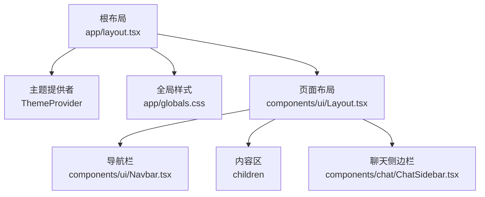
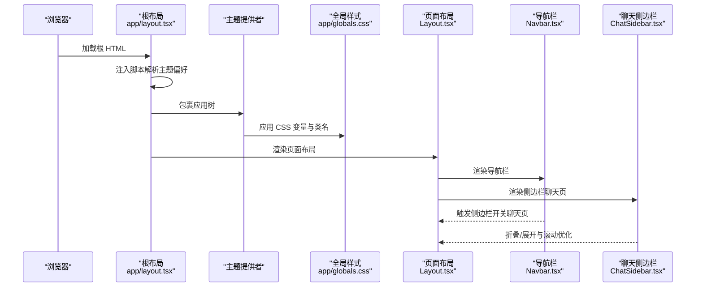
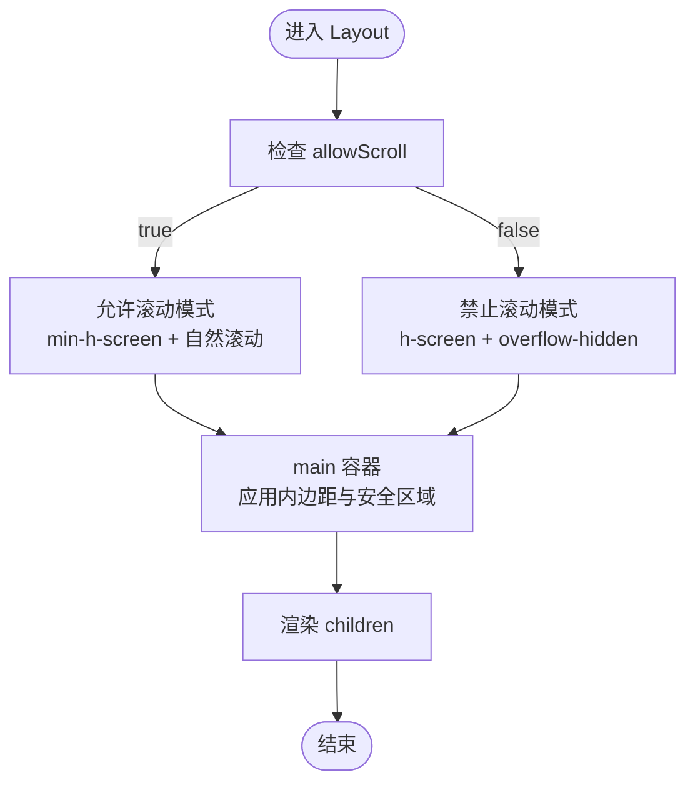
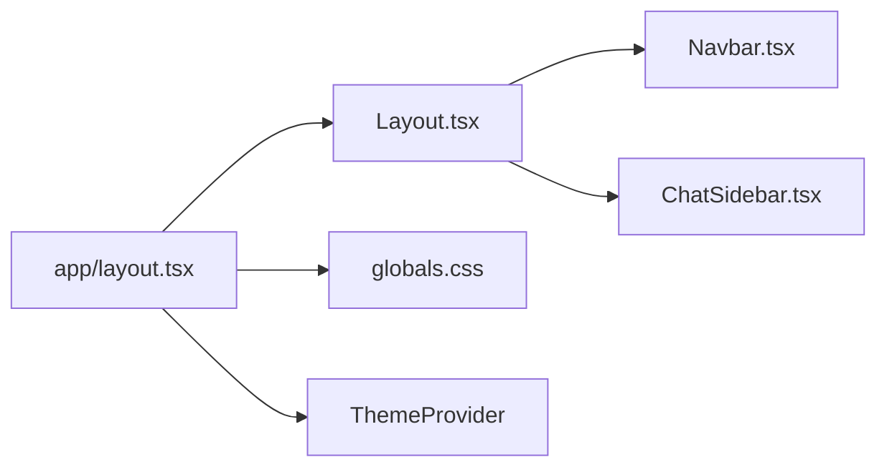

# 布局组件

<cite>
**本文引用的文件**
- [web/components/ui/Layout.tsx](file://web/components/ui/Layout.tsx)
- [web/app/layout.tsx](file://web/app/layout.tsx)
- [web/app/globals.css](file://web/app/globals.css)
- [web/components/ui/Navbar.tsx](file://web/components/ui/Navbar.tsx)
- [web/components/chat/ChatSidebar.tsx](file://web/components/chat/ChatSidebar.tsx)
- [web/app/chat/page.tsx](file://web/app/chat/page.tsx)
- [web/package.json](file://web/package.json)
- [web/next.config.ts](file://web/next.config.ts)
</cite>

## 目录
1. [简介](#简介)
2. [项目结构](#项目结构)
3. [核心组件](#核心组件)
4. [架构总览](#架构总览)
5. [详细组件分析](#详细组件分析)
6. [依赖关系分析](#依赖关系分析)
7. [性能考虑](#性能考虑)
8. [故障排除指南](#故障排除指南)
9. [结论](#结论)
10. [附录](#附录)

## 简介
本文件聚焦于布局组件的设计与实现，系统性阐述 Layout 组件的整体布局架构、页面容器设计、响应式适配机制，以及与全局 CSS 样式系统、主题切换机制和暗色模式支持的关系。同时，结合导航栏、聊天侧边栏等 UI 组件，说明布局组件在不同页面场景下的集成方式、内容区域管理与侧边栏布局策略，并提供可配置选项、自定义方法与扩展建议，覆盖性能优化、浏览器兼容性与维护要点。

## 项目结构
布局系统位于前端 Next.js 应用中，采用“根布局 + 页面级布局”的分层组织：
- 根布局负责主题注入、全局样式初始化与页面根节点结构
- 页面级布局（Layout 组件）负责内容区容器、滚动行为与安全区域适配
- 导航栏（Navbar）与聊天侧边栏（ChatSidebar）作为布局内的功能部件参与页面交互

图表来源
- [web/app/layout.tsx:16-48](file://web/app/layout.tsx#L16-L48)
- [web/components/ui/Layout.tsx:12-59](file://web/components/ui/Layout.tsx#L12-L59)
- [web/components/ui/Navbar.tsx:6-123](file://web/components/ui/Navbar.tsx#L6-L123)
- [web/components/chat/ChatSidebar.tsx:23-367](file://web/components/chat/ChatSidebar.tsx#L23-L367)

章节来源
- [web/app/layout.tsx:16-48](file://web/app/layout.tsx#L16-L48)
- [web/components/ui/Layout.tsx:12-59](file://web/components/ui/Layout.tsx#L12-L59)

## 核心组件
- Layout 组件：提供两种滚动模式（允许滚动与禁止滚动），统一内容区容器、内边距、安全区域适配与过渡动画
- Navbar 组件：顶部导航与移动端菜单，配合 Layout 的滚动模式在聊天页启用侧边栏开关
- ChatSidebar 组件：左侧聊天历史侧边栏，支持折叠/展开、移动端遮罩与滚动优化
- 根布局与全局样式：通过 html/dark/light 类名与 CSS 变量驱动主题切换与暗色模式

章节来源
- [web/components/ui/Layout.tsx:6-59](file://web/components/ui/Layout.tsx#L6-L59)
- [web/components/ui/Navbar.tsx:6-123](file://web/components/ui/Navbar.tsx#L6-L123)
- [web/components/chat/ChatSidebar.tsx:15-367](file://web/components/chat/ChatSidebar.tsx#L15-L367)
- [web/app/layout.tsx:16-48](file://web/app/layout.tsx#L16-L48)
- [web/app/globals.css:117-129](file://web/app/globals.css#L117-L129)

## 架构总览
布局架构围绕“根布局注入主题 + 页面布局容器 + 内容区 + 功能部件”的思路构建，强调：
- 主题系统：根布局通过脚本在 SSR 阶段解析系统偏好与用户选择，设置 html 类名，驱动 CSS 变量切换
- 布局容器：Layout 统一处理滚动、内边距、安全区域与过渡动画
- 交互部件：Navbar 与 ChatSidebar 与 Layout 协作，实现聊天页的侧边栏与导航联动

图表来源
- [web/app/layout.tsx:22-46](file://web/app/layout.tsx#L22-L46)
- [web/app/globals.css:42-77](file://web/app/globals.css#L42-L77)
- [web/components/ui/Layout.tsx:12-59](file://web/components/ui/Layout.tsx#L12-L59)
- [web/components/ui/Navbar.tsx:19-38](file://web/components/ui/Navbar.tsx#L19-L38)
- [web/components/chat/ChatSidebar.tsx:177-200](file://web/components/chat/ChatSidebar.tsx#L177-L200)

## 详细组件分析

### Layout 组件
- 设计目标
  - 提供两种滚动模式：允许滚动（自然文档流，适合内容页）与禁止滚动（固定高度，内部滚动，适合聊天页）
  - 统一内容区容器、内边距与安全区域适配，保证移动端体验一致
  - 支持 noPadding 与 allowScroll 两个关键配置项
- 数据结构与复杂度
  - Props 接口简洁，时间复杂度 O(1)，空间复杂度 O(1)
- 依赖链
  - 依赖 Navbar 作为顶部导航
  - 依赖全局 CSS 的类名与 CSS 变量实现主题切换
- 错误处理
  - 通过 props 控制分支，无运行时异常处理需求
- 性能影响
  - 使用 flex 布局与最小高度约束，避免不必要的重排
  - 内部滚动容器在聊天页减少整体滚动开销

图表来源
- [web/components/ui/Layout.tsx:18-58](file://web/components/ui/Layout.tsx#L18-L58)

章节来源
- [web/components/ui/Layout.tsx:6-59](file://web/components/ui/Layout.tsx#L6-L59)

### Navbar 组件
- 设计目标
  - 提供顶部导航与移动端菜单，聊天页在小屏设备上通过按钮触发侧边栏
  - 响应式布局，桌面端显示导航项，移动端显示汉堡菜单
- 交互特性
  - 聊天页移动端：点击按钮派发自定义事件，触发侧边栏打开
  - 桌面端：高亮当前路由，提供悬停与激活态样式
- 与 Layout 的协作
  - 在聊天页配合 Layout 的禁止滚动模式，确保侧边栏与内容区在同一视口内滚动

章节来源
- [web/components/ui/Navbar.tsx:6-123](file://web/components/ui/Navbar.tsx#L6-L123)

### ChatSidebar 组件
- 设计目标
  - 聊天页左侧历史对话列表，支持折叠/展开、移动端遮罩与滚动优化
- 交互特性
  - 折叠状态下仅显示展开按钮，节省空间
  - 移动端点击遮罩层自动关闭侧边栏
  - 支持新建对话、重命名与删除对话的弹窗交互
- 与 Layout 的协作
  - 在聊天页使用固定高度容器，配合 Layout 的内部滚动，避免页面整体滚动
  - 通过 CSS 变量与过渡动画提升暗色模式体验

章节来源
- [web/components/chat/ChatSidebar.tsx:15-367](file://web/components/chat/ChatSidebar.tsx#L15-L367)

### 根布局与全局样式系统
- 主题切换机制
  - 根布局在 SSR 阶段通过脚本读取 localStorage 中的主题配置或系统偏好，设置 html 的 light/dark 类名
  - 全局 CSS 定义 :root 与 .dark/.light 的 CSS 变量，驱动颜色、背景与阴影等视觉元素
- 暗色模式支持
  - 通过 .dark 类名与 CSS 变量实现全站暗色模式
  - 为代码高亮、公式渲染、滚动条等提供深色优化
- 响应式与安全区域
  - 全局 CSS 提供安全区域类名与移动端滚动优化规则
  - Tailwind v4 语法与主题变量统一字体与间距

章节来源
- [web/app/layout.tsx:22-46](file://web/app/layout.tsx#L22-L46)
- [web/app/globals.css:42-77](file://web/app/globals.css#L42-L77)
- [web/app/globals.css:117-129](file://web/app/globals.css#L117-L129)
- [web/app/globals.css:661-678](file://web/app/globals.css#L661-L678)

### 页面集成与内容区域管理
- 聊天页集成
  - 聊天页通过 Layout 包裹内容区，内部再组合 Navbar、ChatSidebar 与消息列表
  - 在聊天页使用 Layout 的禁止滚动模式，确保侧边栏与消息区在同一容器内滚动
- 内容区域管理
  - Layout 的 main 容器承担内容区滚动与安全区域适配
  - ChatSidebar 在折叠与展开之间切换，动态调整宽度与遮罩层

章节来源
- [web/app/chat/page.tsx:666-678](file://web/app/chat/page.tsx#L666-L678)
- [web/components/chat/ChatSidebar.tsx:186-200](file://web/components/chat/ChatSidebar.tsx#L186-L200)

## 依赖关系分析
- 组件耦合
  - Layout 与 Navbar 强耦合（导航触发侧边栏）
  - Layout 与 ChatSidebar 在聊天页弱耦合（通过事件通信）
- 外部依赖
  - Next.js 16 与 Tailwind v4
  - 浏览器原生类名切换与 CSS 变量
- 潜在循环依赖
  - 无直接循环依赖，事件通过 window 自定义事件传递

图表来源
- [web/components/ui/Layout.tsx:4](file://web/components/ui/Layout.tsx#L4)
- [web/components/ui/Navbar.tsx:3](file://web/components/ui/Navbar.tsx#L3)
- [web/components/chat/ChatSidebar.tsx:9](file://web/components/chat/ChatSidebar.tsx#L9)
- [web/app/layout.tsx:3](file://web/app/layout.tsx#L3)

章节来源
- [web/package.json:12-26](file://web/package.json#L12-L26)
- [web/next.config.ts:3-45](file://web/next.config.ts#L3-L45)

## 性能考虑
- 滚动性能
  - 聊天页使用内部滚动容器，减少整体滚动带来的重排与回流
  - 全局 CSS 为滚动容器设置 -webkit-overflow-scrolling: touch，提升移动端滚动体验
- 主题切换
  - 根布局在 SSR 阶段解析主题，避免首屏闪烁
  - CSS 变量切换比逐元素样式切换更高效
- 响应式与安全区域
  - 使用安全区域类名与媒体查询，避免额外 JavaScript 计算
- 构建与部署
  - Next.js standalone 输出模式简化容器部署
  - 代理配置支持大文件上传，降低前端资源限制

章节来源
- [web/components/ui/Layout.tsx:47-51](file://web/components/ui/Layout.tsx#L47-L51)
- [web/app/globals.css:661-678](file://web/app/globals.css#L661-L678)
- [web/next.config.ts:3-10](file://web/next.config.ts#L3-L10)

## 故障排除指南
- 主题未生效
  - 检查根布局脚本是否正确设置 html 类名
  - 确认全局 CSS 中 :root 与 .dark/.light 变量定义完整
- 滚动异常
  - 聊天页需使用 Layout 的禁止滚动模式，确保内部滚动容器有效
  - 检查 main 容器的 overflow 与高度设置
- 移动端滚动卡顿
  - 确认已应用 -webkit-overflow-scrolling: touch
  - 检查全局 CSS 中针对移动端的滚动优化规则
- 侧边栏无法打开
  - 确认 Navbar 在聊天页触发了 openChatSidebar 自定义事件
  - 检查 ChatSidebar 的 isOpen 状态与遮罩层逻辑

章节来源
- [web/app/layout.tsx:22-46](file://web/app/layout.tsx#L22-L46)
- [web/components/ui/Layout.tsx:41-58](file://web/components/ui/Layout.tsx#L41-L58)
- [web/components/ui/Navbar.tsx:19-38](file://web/components/ui/Navbar.tsx#L19-L38)
- [web/components/chat/ChatSidebar.tsx:177-200](file://web/components/chat/ChatSidebar.tsx#L177-L200)

## 结论
布局组件通过“根布局主题注入 + 页面布局容器 + 功能部件”的架构，实现了统一的页面容器、灵活的滚动模式与完善的暗色模式支持。在聊天页场景下，Layout 与 Navbar、ChatSidebar 协同工作，提供一致的移动端体验与高性能的内部滚动。结合全局 CSS 变量与响应式规则，布局系统具备良好的可扩展性与维护性。

## 附录

### 配置选项与自定义方法
- Layout 组件
  - noPadding：禁用内容区默认内边距
  - allowScroll：允许整页滚动（内容页）或禁止滚动（聊天页）
- Navbar 组件
  - 聊天页移动端按钮通过自定义事件触发侧边栏
- ChatSidebar 组件
  - 折叠/展开状态持久化至 localStorage
  - 移动端遮罩层自动关闭
- 全局样式
  - 通过 CSS 变量自定义主题色、背景色、文字色与阴影
  - 安全区域与移动端滚动优化规则

章节来源
- [web/components/ui/Layout.tsx:6-16](file://web/components/ui/Layout.tsx#L6-L16)
- [web/components/ui/Navbar.tsx:19-38](file://web/components/ui/Navbar.tsx#L19-L38)
- [web/components/chat/ChatSidebar.tsx:42-48](file://web/components/chat/ChatSidebar.tsx#L42-L48)
- [web/app/globals.css:42-77](file://web/app/globals.css#L42-L77)