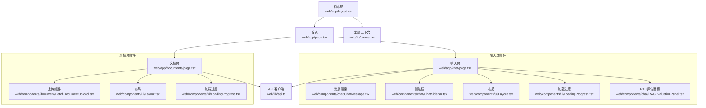
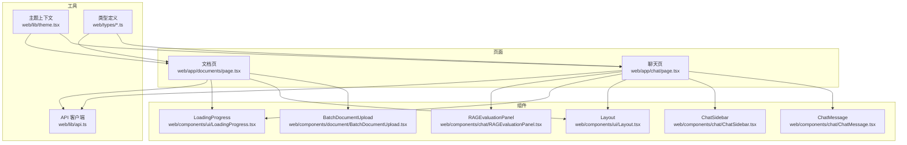
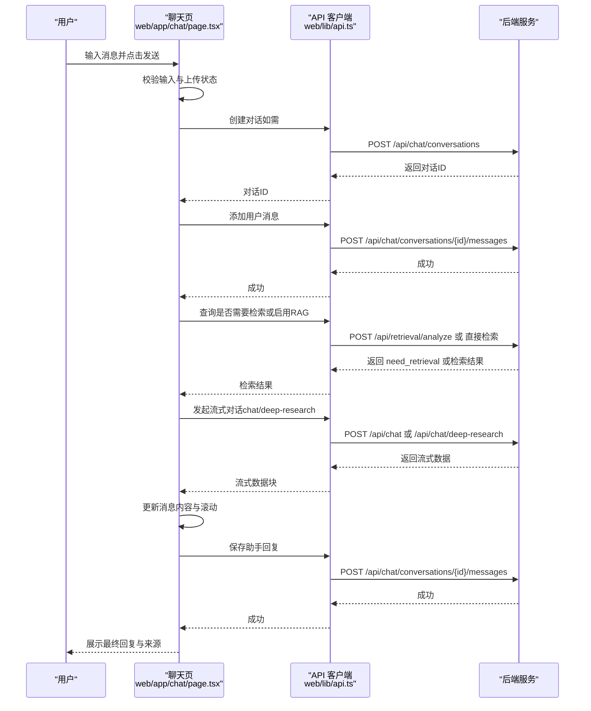
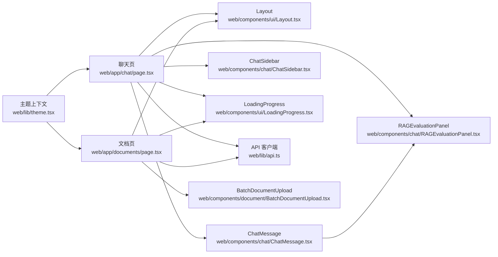

# 前端应用

<cite>
**本文引用的文件**
- [web/app/layout.tsx](file://web/app/layout.tsx)
- [web/app/page.tsx](file://web/app/page.tsx)
- [web/components/ui/Layout.tsx](file://web/components/ui/Layout.tsx)
- [web/components/ui/Navbar.tsx](file://web/components/ui/Navbar.tsx)
- [web/components/ui/LoadingProgress.tsx](file://web/components/ui/LoadingProgress.tsx)
- [web/lib/theme.tsx](file://web/lib/theme.tsx)
- [web/lib/api.ts](file://web/lib/api.ts)
- [web/app/chat/page.tsx](file://web/app/chat/page.tsx)
- [web/components/chat/ChatMessage.tsx](file://web/components/chat/ChatMessage.tsx)
- [web/components/chat/ChatSidebar.tsx](file://web/components/chat/ChatSidebar.tsx)
- [web/components/chat/RAGEvaluationPanel.tsx](file://web/components/chat/RAGEvaluationPanel.tsx)
- [web/tabs/chat.ts](file://web/tabs/chat.ts)
- [web/types/chat.ts](file://web/types/chat.ts)
- [web/types/conversation.ts](file://web/types/conversation.ts)
- [web/app/documents/page.tsx](file://web/app/documents/page.tsx)
- [web/components/document/BatchDocumentUpload.tsx](file://web/components/document/BatchDocumentUpload.tsx)
- [web/package.json](file://web/package.json)
</cite>

## 更新摘要
**所做更改**
- 新增RAG评估面板组件章节，详细介绍RAGEvaluationPanel.tsx组件的功能和实现
- 更新聊天界面章节，增加RAG评估指标的展示和交互
- 更新组件API文档，添加RAGEvaluationPanel的详细说明
- 更新数据模型章节，增加RAGEvaluationMetrics类型的定义
- 更新架构图，反映RAG评估功能的集成

## 目录
1. [简介](#简介)
2. [项目结构](#项目结构)
3. [核心组件](#核心组件)
4. [架构总览](#架构总览)
5. [详细组件分析](#详细组件分析)
6. [依赖分析](#依赖分析)
7. [性能考量](#性能考量)
8. [故障排查指南](#故障排查指南)
9. [结论](#结论)
10. [附录](#附录)

## 简介
本文件面向 advanced-rag 前端应用，基于 Next.js 16 与 React 19 构建，采用 App Router 结构与客户端组件模式。应用围绕"对话（含深度研究）+ 知识库检索/入库"的核心能力组织，提供聊天界面、文档管理界面、知识库界面等关键 UI，并通过统一的 API 客户端与后端服务交互。文档覆盖页面路由、组件层次、状态管理、响应式与主题、国际化现状、与后端集成、错误处理与加载状态、组件复用与样式管理、性能优化最佳实践等内容。

**更新** 新增RAG评估面板组件，提供实时性能指标监控和异常告警功能。

## 项目结构
- 应用入口与全局布局
  - 根布局负责主题注入、语言设置与全局样式加载。
  - 首页用于初始化与自动跳转至聊天页。
- 页面级路由
  - 聊天页：核心对话与 RAG/深度研究流程，集成RAG评估面板。
  - 文档页：知识空间与文档管理、上传与分页展示。
- 组件层
  - UI 基础组件：布局、导航、加载进度、Toast 等。
  - 聊天组件：消息渲染、侧边栏、深度研究渲染器、RAG评估面板等。
  - 文档组件：单/批量上传、进度与状态轮询。
- 类型与工具
  - 类型定义：聊天消息、对话、知识空间、模型、RAG评估指标等。
  - API 客户端：封装后端接口调用、错误与流式响应处理。
  - 主题上下文：主题切换与系统主题感知。

**图表来源**
- [web/app/layout.tsx:1-49](file://web/app/layout.tsx#L1-L49)
- [web/app/page.tsx:1-39](file://web/app/page.tsx#L1-L39)
- [web/app/chat/page.tsx:1-2563](file://web/app/chat/page.tsx#L1-L2563)
- [web/app/documents/page.tsx:1-337](file://web/app/documents/page.tsx#L1-L337)
- [web/components/chat/ChatMessage.tsx:1-182](file://web/components/chat/ChatMessage.tsx#L1-L182)
- [web/components/chat/ChatSidebar.tsx:1-367](file://web/components/chat/ChatSidebar.tsx#L1-L367)
- [web/components/chat/RAGEvaluationPanel.tsx:1-121](file://web/components/chat/RAGEvaluationPanel.tsx#L1-L121)
- [web/components/ui/Layout.tsx:1-61](file://web/components/ui/Layout.tsx#L1-L61)
- [web/components/ui/LoadingProgress.tsx:1-138](file://web/components/ui/LoadingProgress.tsx#L1-L138)
- [web/lib/theme.tsx:1-111](file://web/lib/theme.tsx#L1-L111)
- [web/lib/api.ts:1-347](file://web/lib/api.ts#L1-L347)

**章节来源**
- [web/app/layout.tsx:1-49](file://web/app/layout.tsx#L1-L49)
- [web/app/page.tsx:1-39](file://web/app/page.tsx#L1-L39)

## 核心组件
- 根布局与主题
  - 根布局负责注入主题 Provider、设置 html 语言与图标、全局样式加载。
  - 主题上下文支持 light/dark/system 三种模式，持久化到 localStorage，并监听系统主题变化。
- 导航与布局
  - 导航栏在移动端与桌面端呈现不同形态，提供"对话/知识空间"入口。
  - 布局组件提供两种模式：允许滚动（用于文档页）与固定高度（用于聊天页）。
- 加载与提示
  - 加载进度组件支持多步骤与平滑过渡，结合步骤权重估算整体进度。
- API 客户端
  - 统一封装 GET/POST 请求、错误提取、JSON 解析、流式响应（ReadableStream）。
  - 提供模型、知识空间、文档、对话、检索、深度研究等接口方法。
- 聊天页
  - 管理消息、输入、RAG/深度研究开关、模型配置、文件上传与轮询、状态持久化与恢复。
  - 集成RAG评估面板，实时展示性能指标和异常告警。
- 文档页
  - 知识空间选择、文档列表分页、上传与状态轮询、删除操作与 Toast 提示。

**更新** 新增RAG评估面板组件，提供实时性能监控和异常检测功能。

**章节来源**
- [web/lib/theme.tsx:1-111](file://web/lib/theme.tsx#L1-L111)
- [web/components/ui/Navbar.tsx:1-125](file://web/components/ui/Navbar.tsx#L1-L125)
- [web/components/ui/Layout.tsx:1-61](file://web/components/ui/Layout.tsx#L1-L61)
- [web/components/ui/LoadingProgress.tsx:1-138](file://web/components/ui/LoadingProgress.tsx#L1-L138)
- [web/lib/api.ts:1-347](file://web/lib/api.ts#L1-L347)
- [web/app/chat/page.tsx:1-2563](file://web/app/chat/page.tsx#L1-L2563)
- [web/app/documents/page.tsx:1-337](file://web/app/documents/page.tsx#L1-L337)

## 架构总览
前端采用"页面 + 组件 + 类型 + API 客户端"的分层架构：
- 页面负责业务编排与状态管理（聊天页、文档页）。
- 组件负责 UI 表达与交互（消息、侧边栏、上传、布局、RAG评估面板等）。
- 类型定义保证前后端契约清晰（聊天消息、对话、知识空间、模型、RAG评估指标等）。
- API 客户端统一封装请求、错误与流式响应，屏蔽后端细节。

**图表来源**
- [web/app/chat/page.tsx:1-2563](file://web/app/chat/page.tsx#L1-L2563)
- [web/app/documents/page.tsx:1-337](file://web/app/documents/page.tsx#L1-L337)
- [web/components/chat/ChatMessage.tsx:1-182](file://web/components/chat/ChatMessage.tsx#L1-L182)
- [web/components/chat/ChatSidebar.tsx:1-367](file://web/components/chat/ChatSidebar.tsx#L1-L367)
- [web/components/document/BatchDocumentUpload.tsx:1-512](file://web/components/document/BatchDocumentUpload.tsx#L1-L512)
- [web/components/ui/Layout.tsx:1-61](file://web/components/ui/Layout.tsx#L1-L61)
- [web/components/ui/LoadingProgress.tsx:1-138](file://web/components/ui/LoadingProgress.tsx#L1-L138)
- [web/components/chat/RAGEvaluationPanel.tsx:1-121](file://web/components/chat/RAGEvaluationPanel.tsx#L1-L121)
- [web/lib/api.ts:1-347](file://web/lib/api.ts#L1-L347)
- [web/lib/theme.tsx:1-111](file://web/lib/theme.tsx#L1-L111)
- [web/types/chat.ts:1-99](file://web/types/chat.ts#L1-L99)
- [web/types/conversation.ts:1-10](file://web/types/conversation.ts#L1-L10)

## 详细组件分析

### 聊天界面（App Router 路由：/chat）
- 页面职责
  - 初始化知识空间与文档列表，加载模型配置。
  - 管理消息列表、输入框、RAG/深度研究开关、模型参数、文件上传与轮询。
  - 实现状态持久化（localStorage）与恢复（仅最近 5 分钟内正在流式生成的状态）。
  - 处理中断生成、智能滚动、步骤化加载进度。
  - 集成RAG评估面板，展示实时性能指标和异常告警。
- 关键交互流程（发送消息）

**图表来源**
- [web/app/chat/page.tsx:680-860](file://web/app/chat/page.tsx#L680-L860)
- [web/lib/api.ts:240-286](file://web/lib/api.ts#L240-L286)

- 组件 API 与属性
  - ChatMessage
    - 属性：message（消息对象）、conversationId（可选）、onEdit（可选）、onRegenerate（可选）、isGenerating（可选）、assistantIconUrl（可选）。
    - 功能：渲染消息、编辑/重新生成、显示参考来源、思考点动画、集成RAG评估面板。
  - ChatSidebar
    - 属性：currentConversationId、onConversationSelect、onNewConversation、isOpen（可选）、onOpenChange（可选）。
    - 功能：加载/刷新对话列表、新建/重命名/删除对话、移动端遮罩与折叠、本地缓存与轮询。
  - Layout
    - 属性：children、noPadding（可选）、allowScroll（可选）。
    - 功能：两种布局模式（允许滚动/固定高度），适配安全区域与滚动行为。
  - LoadingProgress
    - 属性：steps、currentStep、message（可选）、className（可选）、currentStepProgress（可选）。
    - 功能：多步骤进度条与步骤列表，平滑过渡与权重估算。
  - **新增** RAGEvaluationPanel
    - 属性：metrics（可选的RAG评估指标）、sourceCount（可选的来源条数）。
    - 功能：展示RAG性能指标（是否检索、召回条数、上下文长度、检索耗时、首token耗时、总响应耗时）、异常告警、可折叠展开。

**更新** 新增RAGEvaluationPanel组件，提供实时性能监控功能。

**章节来源**
- [web/app/chat/page.tsx:1-2563](file://web/app/chat/page.tsx#L1-L2563)
- [web/components/chat/ChatMessage.tsx:1-182](file://web/components/chat/ChatMessage.tsx#L1-L182)
- [web/components/chat/ChatSidebar.tsx:1-367](file://web/components/chat/ChatSidebar.tsx#L1-L367)
- [web/components/ui/Layout.tsx:1-61](file://web/components/ui/Layout.tsx#L1-L61)
- [web/components/ui/LoadingProgress.tsx:1-138](file://web/components/ui/LoadingProgress.tsx#L1-L138)
- [web/components/chat/RAGEvaluationPanel.tsx:1-121](file://web/components/chat/RAGEvaluationPanel.tsx#L1-L121)
- [web/types/chat.ts:1-99](file://web/types/chat.ts#L1-L99)
- [web/types/conversation.ts:1-10](file://web/types/conversation.ts#L1-L10)

### 文档管理界面（App Router 路由：/documents）
- 页面职责
  - 加载知识空间列表，支持创建新知识空间。
  - 分页加载文档列表，轮询处理中文档状态。
  - 提供上传组件（单/批量），删除文档。
- 组件 API 与属性
  - BatchDocumentUpload
    - 属性：onUploadSuccess（可选）、knowledgeSpaceId（可选）。
    - 功能：拖拽/选择文件、类型与大小校验、进度展示、顺序上传、错误提示与 Toast。
  - Layout
    - 属性：allowScroll=true，适配长列表滚动。
  - LoadingProgress
    - 属性：steps、currentStep。
    - 功能：初始化步骤与进度条。

### 知识库界面（概念性说明）
- 界面目标：展示知识空间与文档，支持新增知识空间、上传文档、查看处理进度与状态。
- 与聊天页联动：聊天页可选择知识空间进行检索增强（RAG）。

### **新增** RAG评估面板组件（RAGEvaluationPanel）
- 组件职责
  - 展示RAG（检索增强生成）系统的性能指标。
  - 提供异常告警功能，识别性能问题。
  - 支持折叠展开，避免占用过多界面空间。
- 关键功能
  - 性能指标展示：是否触发检索、召回条数、上下文长度、检索耗时、首token耗时、总响应耗时。
  - 异常检测：基于预设阈值自动检测性能问题。
  - 可折叠界面：用户可选择展开查看详细指标。
- 阈值配置
  - 响应时间阈值：500ms
  - 检索耗时阈值：300ms  
  - 召回条数阈值：80条
- 组件交互
  - 点击标题栏展开/收起面板。
  - 异常计数徽章显示当前告警数量。
  - 详细的指标表格展示各项性能数据。

**章节来源**
- [web/components/chat/RAGEvaluationPanel.tsx:1-121](file://web/components/chat/RAGEvaluationPanel.tsx#L1-L121)
- [web/components/chat/ChatMessage.tsx:167-173](file://web/components/chat/ChatMessage.tsx#L167-L173)
- [web/types/chat.ts:3-19](file://web/types/chat.ts#L3-L19)

## 依赖分析
- 依赖关系
  - 页面依赖布局、导航、加载组件与 API 客户端。
  - 聊天页依赖消息组件、侧边栏、加载组件、RAG评估面板与 API 客户端。
  - 文档页依赖上传组件、布局与 API 客户端。
  - 主题上下文贯穿全局，影响所有页面与组件。
  - **新增** ChatMessage依赖RAGEvaluationPanel组件。
- 外部依赖
  - Next.js 16、React 19、TailwindCSS v4、Biome、MathJax 生态（公式渲染）。

**图表来源**
- [web/app/chat/page.tsx:1-2563](file://web/app/chat/page.tsx#L1-L2563)
- [web/app/documents/page.tsx:1-337](file://web/app/documents/page.tsx#L1-L337)
- [web/components/chat/ChatMessage.tsx:1-182](file://web/components/chat/ChatMessage.tsx#L1-L182)
- [web/components/chat/ChatSidebar.tsx:1-367](file://web/components/chat/ChatSidebar.tsx#L1-L367)
- [web/components/document/BatchDocumentUpload.tsx:1-512](file://web/components/document/BatchDocumentUpload.tsx#L1-L512)
- [web/components/ui/Layout.tsx:1-61](file://web/components/ui/Layout.tsx#L1-L61)
- [web/components/ui/LoadingProgress.tsx:1-138](file://web/components/ui/LoadingProgress.tsx#L1-L138)
- [web/components/chat/RAGEvaluationPanel.tsx:1-121](file://web/components/chat/RAGEvaluationPanel.tsx#L1-L121)
- [web/lib/api.ts:1-347](file://web/lib/api.ts#L1-L347)
- [web/lib/theme.tsx:1-111](file://web/lib/theme.tsx#L1-L111)

**章节来源**
- [web/package.json:1-40](file://web/package.json#L1-L40)

## 性能考量
- 滚动优化
  - 聊天页使用智能滚动策略：接近底部时平滑滚动，远距离时使用 smooth，提升体验与性能。
- 状态持久化
  - 仅对最近 5 分钟内的流式生成状态进行恢复，避免冗余存储与渲染。
- 轮询与节流
  - 文档处理状态轮询间隔 3 秒；流式更新节流定时器避免频繁 DOM 更新。
- 组件优化
  - ChatMessage 使用 memo 包装，减少重复渲染。
  - **新增** RAGEvaluationPanel使用useState管理展开状态，避免不必要的重渲染。
- 图像与资源
  - 通过 Next.js Image Manifest 与静态资源目录管理图片资源，减少首屏阻塞。

**更新** 新增RAGEvaluationPanel组件的性能优化考虑。

## 故障排查指南
- 常见问题
  - 无法连接后端：检查 NEXT_PUBLIC_API_URL 环境变量与网络连通性。
  - 上传失败：检查文件类型与大小限制、知识空间选择、后端日志。
  - 对话无响应：确认 RAG/深度研究开关、模型配置、流式响应是否正常。
  - **新增** RAG评估面板无显示：检查消息中的rag_metrics字段是否存在，确认后端是否正确返回评估指标。
- 错误处理
  - API 客户端统一捕获网络错误与后端错误消息，返回 { error, status }。
  - 页面层对关键操作（加载知识空间、文档、上传）进行 try/catch 并提示 Toast。
- 加载状态
  - 使用 LoadingProgress 展示多步骤进度，便于定位卡顿环节。
- 诊断建议
  - 打开浏览器开发者工具 Network 面板观察请求与响应。
  - 查看 Console 中错误堆栈与 API 返回体。
  - 在聊天页中查看 Toast 与消息列表，确认是否处于恢复状态。
  - **新增** 检查RAG评估面板的异常告警，关注响应时间、检索耗时等指标。

**更新** 新增RAG评估面板相关的故障排查指导。

## 结论
advanced-rag 前端应用以 Next.js App Router 为基础，采用模块化组件与类型驱动的开发方式，围绕聊天与知识库两大核心场景构建。通过统一的 API 客户端与主题上下文，实现了良好的可维护性与一致性。聊天页在状态持久化、流式响应、RAG/深度研究等方面具备较强工程化能力；文档页在知识空间管理与上传流程上提供了完整的用户体验。

**更新** 新增的RAG评估面板组件显著增强了系统的可观测性和调试能力，为用户提供实时的性能监控和异常告警功能。该组件与现有架构无缝集成，通过ChatMessage组件自动展示评估指标，无需额外配置即可获得完整的RAG性能洞察。

建议持续关注性能优化与国际化扩展，以进一步提升可用性与全球化支持。

## 附录

### 组件 API 文档（概要）
- ChatMessage
  - 属性
    - message: ChatMessage
    - conversationId?: string
    - onEdit?: (messageId: string, newContent: string) => Promise<void>
    - onRegenerate?: (messageId: string) => Promise<void>
    - isGenerating?: boolean
    - assistantIconUrl?: string
- ChatSidebar
  - 属性
    - currentConversationId: string | undefined
    - onConversationSelect: (id: string | undefined) => void
    - onNewConversation: () => void
    - isOpen?: boolean
    - onOpenChange?: (isOpen: boolean) => void
- BatchDocumentUpload
  - 属性
    - onUploadSuccess?: () => void
    - knowledgeSpaceId?: string
- Layout
  - 属性
    - children: ReactNode
    - noPadding?: boolean
    - allowScroll?: boolean
- LoadingProgress
  - 属性
    - steps: string[]
    - currentStep: number
    - message?: string
    - className?: string
    - currentStepProgress?: number
- **新增** RAGEvaluationPanel
  - 属性
    - metrics?: RAGEvaluationMetrics | null
    - sourceCount?: number

**更新** 新增RAGEvaluationPanel组件的API文档。

### 数据模型（概要）
- ChatMessage
  - 字段：message_id、role、content、timestamp、sources、recommended_resources、recommended_users、user_relationships、recommendation_reason、cypher_queries、**rag_metrics**（新增）
- Conversation
  - 字段：id、user_id、title、createdAt、updatedAt、message_count
- KnowledgeSpace
  - 字段：id、name、description、collection_name、is_default、created_at、updated_at
- Model
  - 字段：name、modified_at、size、digest、details（包含 format、family、families、parameter_size、quantization_level）
- **新增** RAGEvaluationMetrics
  - 字段：retrieval_triggered（是否触发检索）、source_count（召回条数）、context_length（上下文字符长度）、retrieval_time_ms（检索耗时，可选）、time_to_first_token_ms（首token前耗时，可选）、response_time_ms（总响应耗时，可选）、warnings（异常标记数组，可选）。

**更新** 新增RAGEvaluationMetrics数据模型定义。

### 与后端 API 集成要点
- 基础 URL
  - 通过 NEXT_PUBLIC_API_URL 注入，默认 http://localhost:8000。
- 关键接口
  - 模型列表、知识空间列表、文档 CRUD、对话 CRUD、消息 CRUD、检索分析、检索、流式对话、深度研究对话、附件上传与状态轮询。
- 流式响应
  - chat/deep-research 返回 ReadableStream，前端按块解析并增量更新 UI。
- 错误处理
  - 统一解析后端错误消息，优先使用 detail/message/error 字段，兜底为状态码描述。
- **新增** RAG评估指标
  - 后端在对话响应中返回RAG评估指标，前端自动集成到ChatMessage组件中展示。

**更新** 新增RAG评估指标的后端集成说明。

### 响应式设计与主题定制
- 响应式
  - 使用 TailwindCSS v4 断点与工具类，移动端与桌面端差异化布局与交互。
- 主题
  - 支持 light/dark/system 三模式，持久化到 localStorage，监听系统主题变化。
  - 根元素 class 切换 light/dark，影响全局样式与组件外观。
  - **新增** RAG评估面板使用暗色主题兼容的样式，确保在深色模式下的可读性。

**更新** 新增RAG评估面板的主题兼容性说明。

### 国际化支持现状
- 语言设置
  - html lang="zh-CN"，组件中部分文案为中文。
- 建议
  - 引入 i18n 方案（如 next-i18next 或 react-i18next），按页面/组件维度拆分翻译键值，逐步覆盖全站。

### 组件复用与样式管理
- 复用
  - 布局、导航、加载进度等基础组件在多页面复用，降低重复代码。
  - **新增** RAGEvaluationPanel作为独立组件，在ChatMessage中按需复用。
- 样式
  - TailwindCSS 工具类为主，配合全局样式与暗色主题 class。
  - 组件内部使用语义化 class，避免硬编码颜色与尺寸。
  - **新增** RAG评估面板使用语义化的颜色系统，异常状态使用琥珀色调表示警告。

**更新** 新增RAGEvaluationPanel组件的样式管理说明。