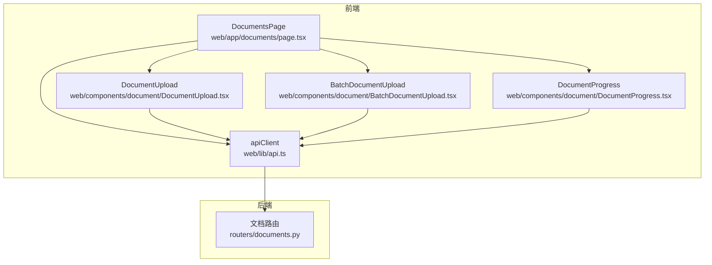
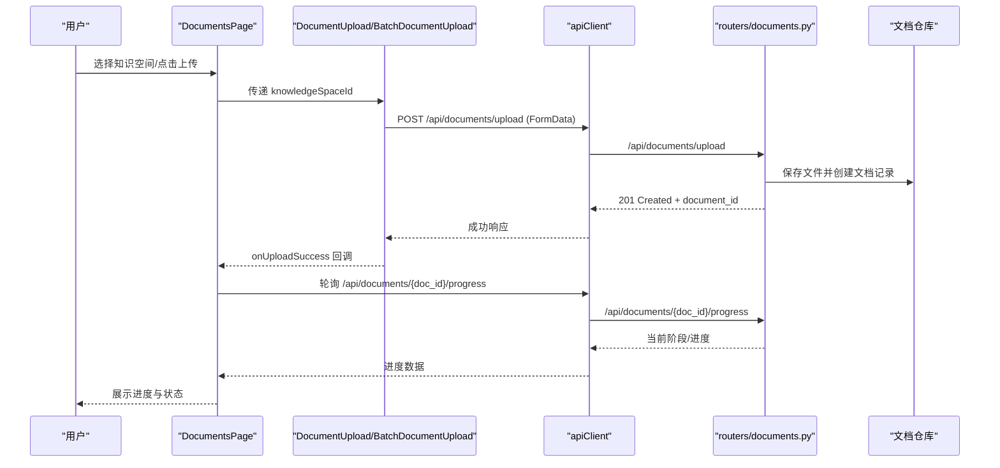
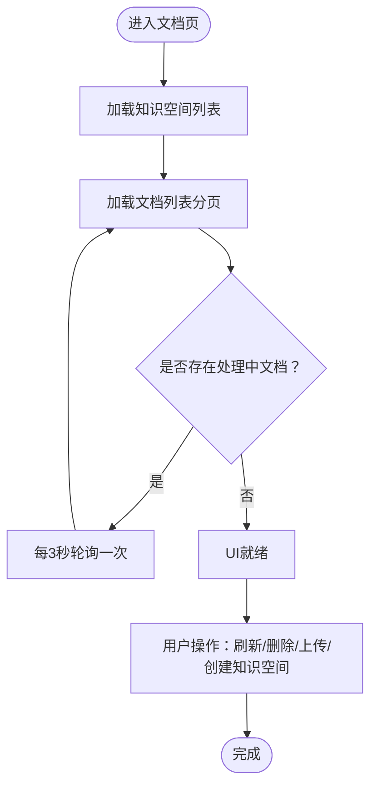
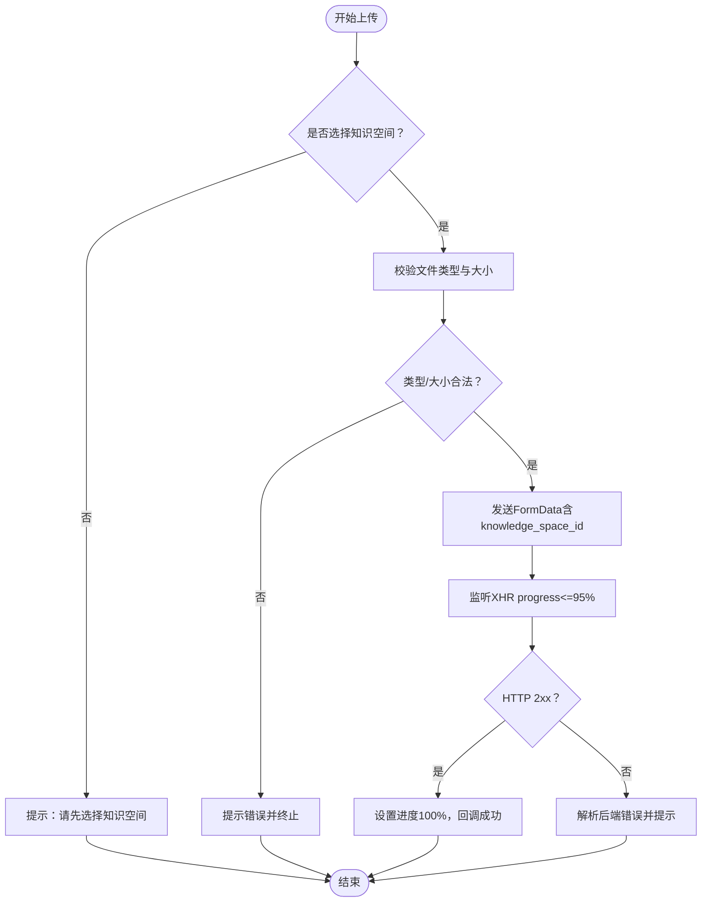
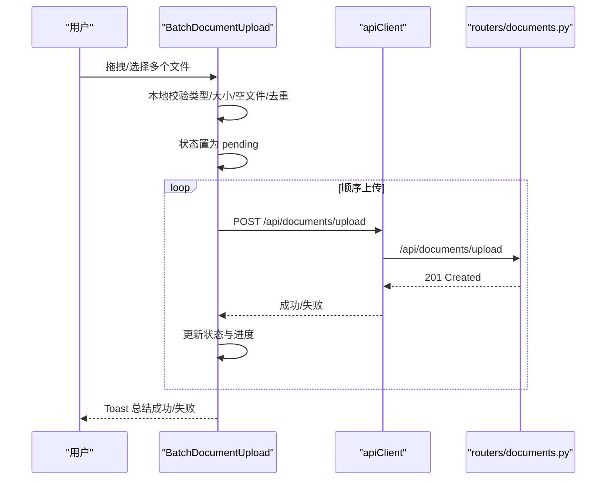
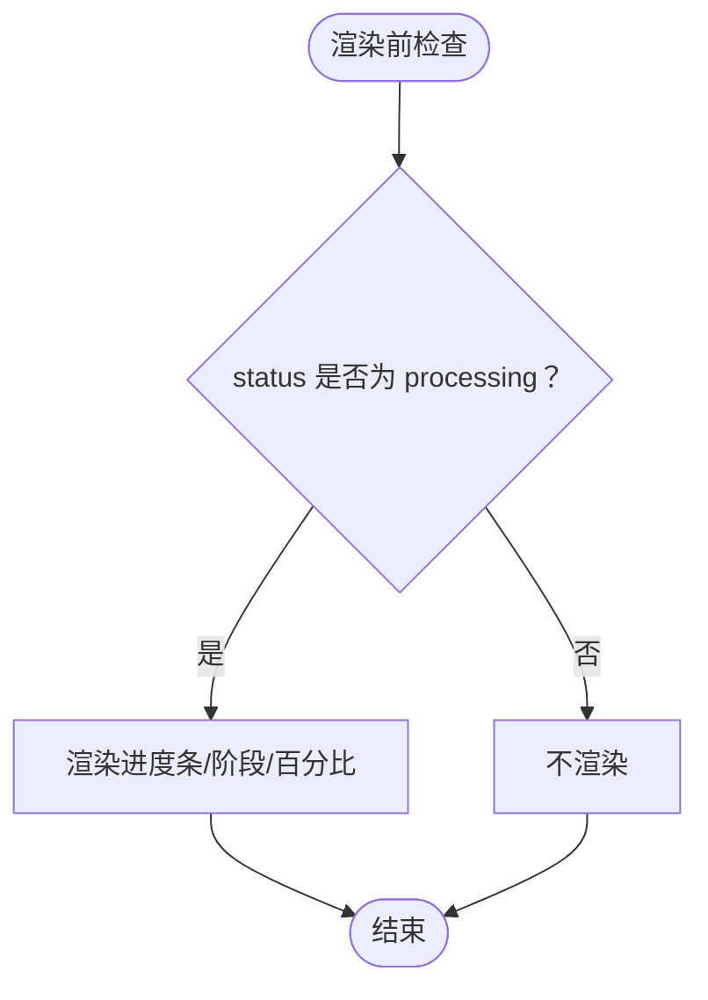
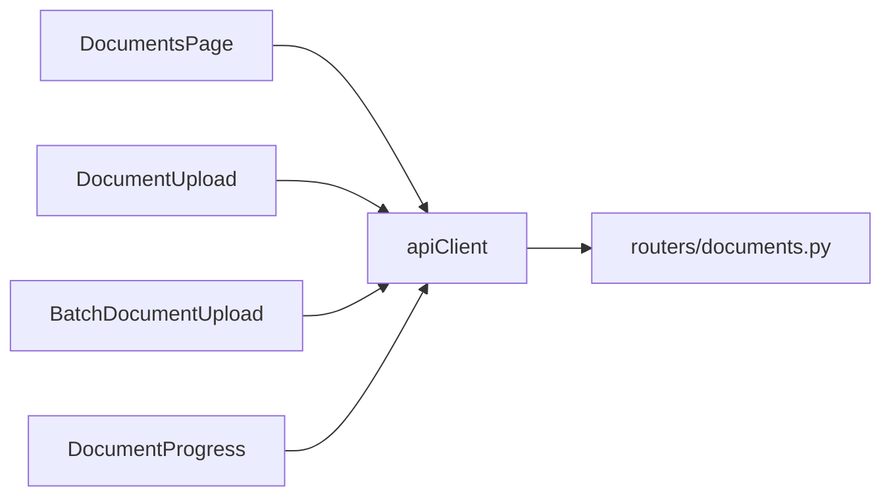

# 文档管理界面

<cite>
**本文引用的文件**
- [web/app/documents/page.tsx](file://web/app/documents/page.tsx)
- [web/components/document/DocumentUpload.tsx](file://web/components/document/DocumentUpload.tsx)
- [web/components/document/BatchDocumentUpload.tsx](file://web/components/document/BatchDocumentUpload.tsx)
- [web/components/document/DocumentProgress.tsx](file://web/components/document/DocumentProgress.tsx)
- [web/lib/api.ts](file://web/lib/api.ts)
- [routers/documents.py](file://routers/documents.py)
</cite>

## 目录
1. [简介](#简介)
2. [项目结构](#项目结构)
3. [核心组件](#核心组件)
4. [架构总览](#架构总览)
5. [详细组件分析](#详细组件分析)
6. [依赖关系分析](#依赖关系分析)
7. [性能考量](#性能考量)
8. [故障排查指南](#故障排查指南)
9. [结论](#结论)
10. [附录](#附录)

## 简介
本文件面向“文档管理界面”的前端与后端实现，聚焦以下目标：
- 文档列表页面的设计与功能：上传入口、批量上传、进度展示、分页与刷新。
- DocumentUpload 组件：文件选择、拖拽上传、预览提示、进度反馈与错误提示。
- BatchDocumentUpload 组件：多文件处理、并发控制策略、逐个文件上传与状态管理。
- DocumentProgress 组件：后端处理阶段与进度百分比的前端展示。
- 文档分类、搜索过滤与排序的实现建议（基于现有接口与数据模型）。
- 文件格式验证、大小限制与安全检查机制。
- 文档删除、重命名与批量操作的用户交互设计。

## 项目结构
文档管理界面由前端 Next.js 页面与组件构成，并通过 API 客户端调用后端 FastAPI 路由。后端负责文档上传、解析、分块、向量化与进度持久化。

**图表来源**
- [web/app/documents/page.tsx:12-337](file://web/app/documents/page.tsx#L12-L337)
- [web/components/document/DocumentUpload.tsx:1-239](file://web/components/document/DocumentUpload.tsx#L1-L239)
- [web/components/document/BatchDocumentUpload.tsx:1-512](file://web/components/document/BatchDocumentUpload.tsx#L1-L512)
- [web/components/document/DocumentProgress.tsx:1-54](file://web/components/document/DocumentProgress.tsx#L1-L54)
- [web/lib/api.ts:106-175](file://web/lib/api.ts#L106-L175)
- [routers/documents.py:723-919](file://routers/documents.py#L723-L919)

**章节来源**
- [web/app/documents/page.tsx:12-337](file://web/app/documents/page.tsx#L12-L337)
- [web/lib/api.ts:106-175](file://web/lib/api.ts#L106-L175)
- [routers/documents.py:723-919](file://routers/documents.py#L723-L919)

## 核心组件
- 文档列表页面 DocumentsPage：负责加载知识空间、分页加载文档、轮询处理中文档、删除文档、创建知识空间、上传入口与提示。
- DocumentUpload：单文件上传，支持点击选择与拖拽，内置格式与大小校验，实时进度与错误提示。
- BatchDocumentUpload：多文件队列管理，顺序上传与错误隔离，状态可视化与批量结果提示。
- DocumentProgress：展示文档处理阶段与进度百分比，仅在处理中状态显示。
- apiClient：封装知识空间、文档列表、上传、进度查询、重试、更新标题、删除等 API。

**章节来源**
- [web/app/documents/page.tsx:12-337](file://web/app/documents/page.tsx#L12-L337)
- [web/components/document/DocumentUpload.tsx:1-239](file://web/components/document/DocumentUpload.tsx#L1-L239)
- [web/components/document/BatchDocumentUpload.tsx:1-512](file://web/components/document/BatchDocumentUpload.tsx#L1-L512)
- [web/components/document/DocumentProgress.tsx:1-54](file://web/components/document/DocumentProgress.tsx#L1-L54)
- [web/lib/api.ts:106-175](file://web/lib/api.ts#L106-L175)

## 架构总览
前端通过 apiClient 调用后端 /api/documents 与 /api/knowledge-spaces 接口；上传采用表单提交，后端解析并异步处理，前端通过轮询 /api/documents/{doc_id}/progress 获取进度。

**图表来源**
- [web/app/documents/page.tsx:48-107](file://web/app/documents/page.tsx#L48-L107)
- [web/lib/api.ts:130-148](file://web/lib/api.ts#L130-L148)
- [routers/documents.py:723-919](file://routers/documents.py#L723-L919)

## 详细组件分析

### 文档列表页面 DocumentsPage
- 加载知识空间与文档列表，支持分页与刷新。
- 自动轮询处理中文档（当存在 uploading/processing/parsing/chunking/embedding 状态时，每 3 秒刷新一次）。
- 删除文档弹窗确认，调用删除 API 并刷新列表。
- 新增知识空间：输入名称与描述，调用创建接口。
- 上传入口：集成 DocumentUpload，上传成功后提示并刷新文档列表。

**图表来源**
- [web/app/documents/page.tsx:48-107](file://web/app/documents/page.tsx#L48-L107)
- [web/app/documents/page.tsx:118-151](file://web/app/documents/page.tsx#L118-L151)
- [web/app/documents/page.tsx:246-255](file://web/app/documents/page.tsx#L246-L255)

**章节来源**
- [web/app/documents/page.tsx:12-337](file://web/app/documents/page.tsx#L12-L337)

### DocumentUpload 组件
- 文件选择与拖拽：支持 .pdf/.docx/.doc/.md/.txt/.markdown，限制 200MB。
- 上传进度：基于 XHR progress 事件，最多显示到 95%，等待响应完成再置 100%。
- 错误处理：类型不支持、大小超限、网络错误、超时、后端错误消息解析。
- 与后端交互：POST /api/documents/upload，携带 knowledge_space_id。

**图表来源**
- [web/components/document/DocumentUpload.tsx:48-161](file://web/components/document/DocumentUpload.tsx#L48-L161)

**章节来源**
- [web/components/document/DocumentUpload.tsx:1-239](file://web/components/document/DocumentUpload.tsx#L1-L239)

### BatchDocumentUpload 组件
- 多文件添加：拖拽或选择，批量加入队列并进行本地校验（类型、大小、空文件、重复）。
- 顺序上传策略：逐个文件上传，避免服务器压力过大；每个文件上传后延迟 100ms。
- 状态管理：pending/uploading/success/error，独立进度条与错误信息。
- 结果提示：统计成功/失败数量，Toast 提示。

**图表来源**
- [web/components/document/BatchDocumentUpload.tsx:58-303](file://web/components/document/BatchDocumentUpload.tsx#L58-L303)
- [routers/documents.py:723-897](file://routers/documents.py#L723-L897)

**章节来源**
- [web/components/document/BatchDocumentUpload.tsx:1-512](file://web/components/document/BatchDocumentUpload.tsx#L1-L512)

### DocumentProgress 组件
- 仅在文档状态为 processing 时显示。
- 展示进度条、当前阶段与进度百分比，以及阶段详情。
- 依赖后端 /api/documents/{doc_id}/progress 提供的数据。

**图表来源**
- [web/components/document/DocumentProgress.tsx:18-52](file://web/components/document/DocumentProgress.tsx#L18-L52)
- [web/lib/api.ts:146-148](file://web/lib/api.ts#L146-L148)

**章节来源**
- [web/components/document/DocumentProgress.tsx:1-54](file://web/components/document/DocumentProgress.tsx#L1-L54)
- [web/lib/api.ts:146-148](file://web/lib/api.ts#L146-L148)

### 文档分类、搜索过滤与排序（实现建议）
- 分类：当前页面通过知识空间下拉选择进行“分类”筛选，后端路由支持 knowledge_space_id 参数。
- 搜索过滤：后端 list_documents 支持 knowledge_space_id 等筛选参数，前端可扩展查询参数实现关键词过滤。
- 排序：后端未暴露排序参数，可在前端对返回列表进行排序，或在后端新增排序字段与接口参数。

**章节来源**
- [web/app/documents/page.tsx:187-207](file://web/app/documents/page.tsx#L187-L207)
- [web/lib/api.ts:130-140](file://web/lib/api.ts#L130-L140)
- [routers/documents.py:927-977](file://routers/documents.py#L927-L977)

### 文件格式验证、大小限制与安全检查
- 前端校验：支持类型（.pdf/.docx/.doc/.md/.txt/.markdown），大小上限 200MB，空文件与重复文件检测。
- 后端校验：同类型与大小限制，文件哈希去重，禁止空文件，要求明确的知识空间 ID 或助手 ID。
- 安全检查：后端流式读取文件，超大文件分块处理，异常时清理临时文件；.doc 自动转换为 .docx。

**章节来源**
- [web/components/document/DocumentUpload.tsx:53-78](file://web/components/document/DocumentUpload.tsx#L53-L78)
- [web/components/document/BatchDocumentUpload.tsx:59-121](file://web/components/document/BatchDocumentUpload.tsx#L59-L121)
- [routers/documents.py:748-836](file://routers/documents.py#L748-L836)
- [routers/documents.py:723-897](file://routers/documents.py#L723-L897)

### 文档删除、重命名与批量操作
- 删除：DocumentsPage 中提供删除按钮，调用删除 API 并刷新列表。
- 重命名：提供 DocumentRenameDialog 弹窗，输入新标题并调用更新标题 API。
- 批量操作：BatchDocumentUpload 支持清空队列、批量开始上传与结果提示；删除与重命名可结合列表项进行批量交互设计（建议在列表页增加多选与批量删除/重命名入口）。

**章节来源**
- [web/app/documents/page.tsx:118-127](file://web/app/documents/page.tsx#L118-L127)
- [web/components/document/DocumentRenameDialog.tsx:1-132](file://web/components/document/DocumentRenameDialog.tsx#L1-L132)
- [web/components/document/BatchDocumentUpload.tsx:130-135](file://web/components/document/BatchDocumentUpload.tsx#L130-L135)

## 依赖关系分析
- DocumentsPage 依赖 apiClient 的 listKnowledgeSpaces、listDocuments、deleteDocument 等接口。
- DocumentUpload 与 BatchDocumentUpload 依赖 apiClient 的 upload 接口。
- DocumentProgress 依赖 apiClient 的 getDocumentProgress 接口。
- 后端 routers/documents.py 提供上传、列表、进度查询、重试、删除等路由。

**图表来源**
- [web/app/documents/page.tsx:39-57](file://web/app/documents/page.tsx#L39-L57)
- [web/lib/api.ts:106-175](file://web/lib/api.ts#L106-L175)
- [routers/documents.py:723-919](file://routers/documents.py#L723-L919)

**章节来源**
- [web/app/documents/page.tsx:39-57](file://web/app/documents/page.tsx#L39-L57)
- [web/lib/api.ts:106-175](file://web/lib/api.ts#L106-L175)
- [routers/documents.py:723-919](file://routers/documents.py#L723-L919)

## 性能考量
- 上传超时：前端与后端均设置 15 分钟超时，适合大文件处理。
- 顺序上传策略：BatchDocumentUpload 采用顺序上传与短延迟，降低服务器压力。
- 轮询频率：DocumentsPage 仅在存在处理中文档时轮询，间隔 3 秒，避免不必要的请求。
- 后台处理：解析、分块、向量化与知识图谱构建在后台任务中执行，避免阻塞响应。

**章节来源**
- [web/components/document/DocumentUpload.tsx:135-136](file://web/components/document/DocumentUpload.tsx#L135-L136)
- [web/components/document/BatchDocumentUpload.tsx:235](file://web/components/document/BatchDocumentUpload.tsx#L235)
- [web/app/documents/page.tsx:93-107](file://web/app/documents/page.tsx#L93-L107)
- [routers/documents.py:274-469](file://routers/documents.py#L274-L469)

## 故障排查指南
- 上传失败：检查知识空间是否选择、文件类型与大小是否符合要求、网络是否稳定、后端日志是否报错。
- 进度不更新：确认 DocumentsPage 是否处于轮询状态，后端是否正确更新进度与状态。
- 重复上传：后端根据文件哈希去重，若提示重复，请检查是否已存在相同内容的文档。
- 删除异常：确认文档 ID 正确、后端权限与集合配置是否正常。

**章节来源**
- [web/components/document/DocumentUpload.tsx:142-161](file://web/components/document/DocumentUpload.tsx#L142-L161)
- [web/app/documents/page.tsx:118-127](file://web/app/documents/page.tsx#L118-L127)
- [routers/documents.py:795-826](file://routers/documents.py#L795-L826)

## 结论
文档管理界面通过清晰的组件分工与前后端协作，实现了从上传、处理到进度展示的完整闭环。前端提供直观的交互与反馈，后端保障了安全性与可扩展性。建议后续在后端增加搜索与排序参数，前端增加批量操作入口，进一步提升用户体验。

## 附录
- API 客户端定义与接口映射详见 [web/lib/api.ts:106-175](file://web/lib/api.ts#L106-L175)。
- 后端路由与处理逻辑详见 [routers/documents.py:723-1119](file://routers/documents.py#L723-L1119)。