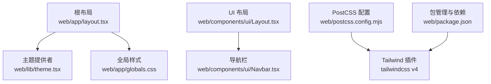
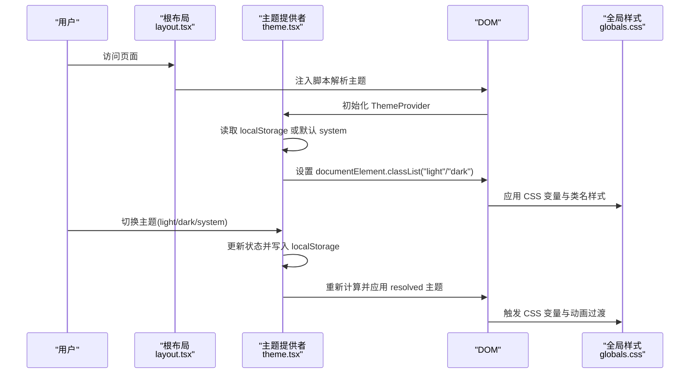
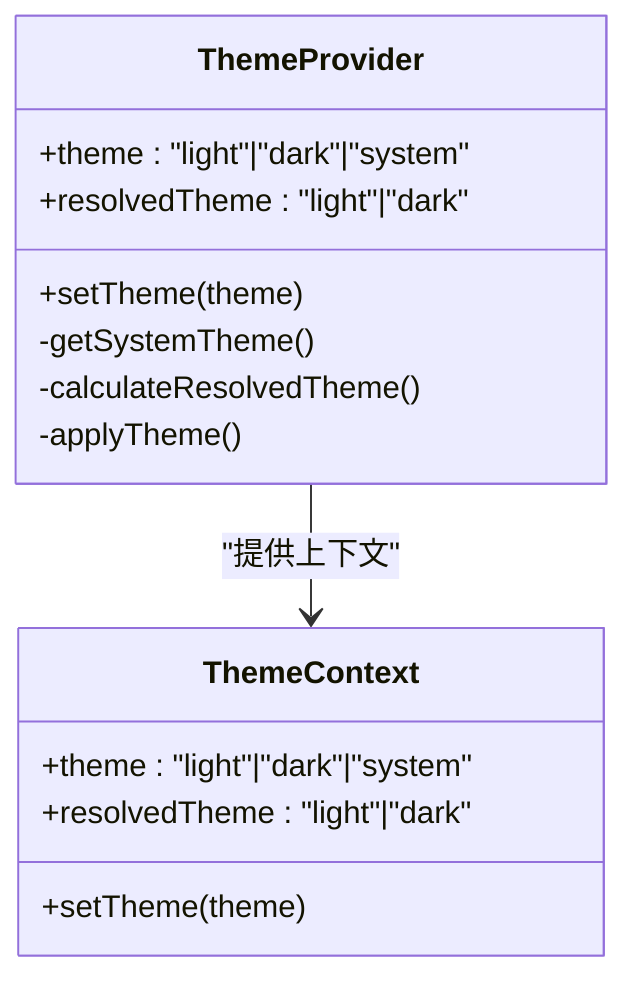
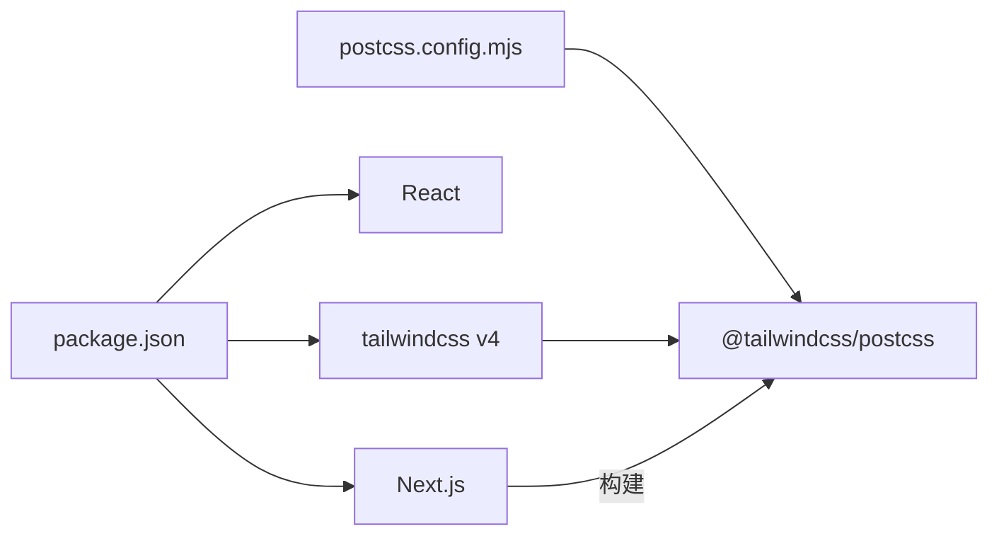

# 样式与主题

<cite>
**本文引用的文件**
- [web/app/globals.css](file://web/app/globals.css)
- [web/app/layout.tsx](file://web/app/layout.tsx)
- [web/lib/theme.tsx](file://web/lib/theme.tsx)
- [web/components/ui/Layout.tsx](file://web/components/ui/Layout.tsx)
- [web/components/ui/Navbar.tsx](file://web/components/ui/Navbar.tsx)
- [web/postcss.config.mjs](file://web/postcss.config.mjs)
- [web/package.json](file://web/package.json)
</cite>

## 目录
1. [简介](#简介)
2. [项目结构](#项目结构)
3. [核心组件](#核心组件)
4. [架构总览](#架构总览)
5. [详细组件分析](#详细组件分析)
6. [依赖关系分析](#依赖关系分析)
7. [性能考量](#性能考量)
8. [故障排查指南](#故障排查指南)
9. [结论](#结论)
10. [附录](#附录)

## 简介
本文件系统性梳理本项目的样式与主题体系，覆盖以下方面：
- CSS-in-JS 与 CSS 变量的混合使用方式
- 主题提供者（ThemeProvider）的配置与动态主题切换机制
- 全局样式组织、组件样式隔离与继承规则
- 响应式断点、移动端适配与触摸交互优化
- 主题变量、颜色系统与字体规范设计指南
- 动画、过渡与视觉反馈的实现方法
- 样式性能优化、CSS 打包与运行时样式计算优化策略
- 样式调试工具与浏览器兼容性处理方案

## 项目结构
样式与主题相关的核心文件分布如下：
- 全局样式与变量：web/app/globals.css
- 根布局与主题注入：web/app/layout.tsx
- 主题提供者与上下文：web/lib/theme.tsx
- UI 布局与导航组件：web/components/ui/Layout.tsx、web/components/ui/Navbar.tsx
- 构建与打包配置：web/postcss.config.mjs、web/package.json

图表来源
- [web/app/layout.tsx:16-48](file://web/app/layout.tsx#L16-L48)
- [web/lib/theme.tsx:15-101](file://web/lib/theme.tsx#L15-L101)
- [web/app/globals.css:1-122](file://web/app/globals.css#L1-L122)
- [web/postcss.config.mjs:1-8](file://web/postcss.config.mjs#L1-L8)
- [web/package.json:12-35](file://web/package.json#L12-L35)

章节来源
- [web/app/layout.tsx:16-48](file://web/app/layout.tsx#L16-L48)
- [web/app/globals.css:1-122](file://web/app/globals.css#L1-L122)
- [web/lib/theme.tsx:15-101](file://web/lib/theme.tsx#L15-L101)
- [web/postcss.config.mjs:1-8](file://web/postcss.config.mjs#L1-L8)
- [web/package.json:12-35](file://web/package.json#L12-L35)

## 核心组件
- 全局样式与变量层
  - 使用 CSS 变量集中定义主题色、背景、文字、边框与阴影等，并通过 :root、.light、.dark 类进行浅色/深色/显式主题覆盖。
  - 引入 @theme inline 将变量映射为 Tailwind 的设计令牌，便于在类名中直接使用。
  - 提供基础排版、滚动条、代码高亮、动画与公式渲染等通用样式。

- 主题提供者与上下文
  - 提供 ThemeProvider，支持 light/dark/system 三种模式，持久化到 localStorage。
  - 在初始化阶段根据系统偏好与用户选择计算实际主题并应用到 documentElement.classList。
  - 监听系统主题变化，动态更新 DOM 主题类。

- 根布局与脚本注入
  - 在 html head 中注入脚本，确保 SSR 与客户端一致地解析主题（优先级：localStorage > system > fallback）。
  - 在 body 上应用抗锯齿类名，提升文本渲染质量。

- UI 布局与导航
  - Layout 组件负责页面滚动策略与安全区域适配，支持允许滚动与禁止滚动两种模式。
  - Navbar 提供导航项与移动端菜单，使用过渡类名实现颜色与状态切换的平滑动画。

章节来源
- [web/app/globals.css:1-122](file://web/app/globals.css#L1-L122)
- [web/lib/theme.tsx:15-101](file://web/lib/theme.tsx#L15-L101)
- [web/app/layout.tsx:22-46](file://web/app/layout.tsx#L22-L46)
- [web/components/ui/Layout.tsx:12-59](file://web/components/ui/Layout.tsx#L12-L59)
- [web/components/ui/Navbar.tsx:6-123](file://web/components/ui/Navbar.tsx#L6-L123)

## 架构总览
整体样式与主题架构采用“CSS 变量 + 主题提供者 + Tailwind 设计令牌”的组合模式，既保证主题切换的灵活性，又借助 Tailwind 实现高效的类名样式书写。

图表来源
- [web/app/layout.tsx:24-38](file://web/app/layout.tsx#L24-L38)
- [web/lib/theme.tsx:46-95](file://web/lib/theme.tsx#L46-L95)
- [web/app/globals.css:117-129](file://web/app/globals.css#L117-L129)

## 详细组件分析

### 全局样式与变量（CSS-in-JS 与 CSS 变量）
- 主题变量组织
  - 使用 :root 定义浅色主题变量，.light/.dark 类覆盖深色模式下的变量差异，确保一致性与可维护性。
  - 通过 @theme inline 将 CSS 变量映射为 Tailwind 设计令牌，如颜色与字体族，便于在类名中直接使用。

- 全局排版与过渡
  - body 设置背景与文字颜色，使用 CSS 变量并带有 0.3s 的过渡，保证主题切换时的顺滑体验。
  - 通配符选择器对所有元素的背景、文字与边框颜色添加 0.2s 过渡，提升交互反馈。

- 代码高亮与滚动条
  - 为代码块容器与滚动条提供定制样式，适配浅/深主题并在 hover 时改变颜色。
  - 针对不同语法高亮库（如 highlight.js）提供基础样式覆盖。

- 动画与过渡
  - 定义多种动画（fadeIn、zoomIn、slideIn、thinking-dot、里程碑式出现等），并通过类名在组件中按需使用。
  - 为资源卡片提供 transform、box-shadow 与 border-color 的贝塞尔曲线过渡，提升交互质感。

- 公式渲染与深色优化
  - 针对 MathJax 与 KaTeX 提供深色模式下的颜色与背景优化，确保公式在深色背景下清晰可读。

- 移动端适配
  - 使用 env(safe-area-inset-*) 适配刘海屏与底部安全区域。
  - 在小屏设备上优化触摸反馈与滚动性能，启用 -webkit-overflow-scrolling: touch。

章节来源
- [web/app/globals.css:1-122](file://web/app/globals.css#L1-L122)
- [web/app/globals.css:124-176](file://web/app/globals.css#L124-L176)
- [web/app/globals.css:232-278](file://web/app/globals.css#L232-L278)
- [web/app/globals.css:340-431](file://web/app/globals.css#L340-L431)
- [web/app/globals.css:520-534](file://web/app/globals.css#L520-L534)
- [web/app/globals.css:560-582](file://web/app/globals.css#L560-L582)
- [web/app/globals.css:661-678](file://web/app/globals.css#L661-L678)
- [web/app/globals.css:680-689](file://web/app/globals.css#L680-L689)
- [web/app/globals.css:717-789](file://web/app/globals.css#L717-L789)

### 主题提供者（ThemeProvider）
- 支持的主题模式
  - light：强制浅色
  - dark：强制深色
  - system：跟随系统偏好

- 初始化与持久化
  - 首次挂载时从 localStorage 读取主题，若无效则回退到 system。
  - 立即计算并应用 resolved 主题到 documentElement.classList，避免闪烁。

- 动态切换与系统监听
  - setTheme 更新状态并写入 localStorage。
  - 当模式为 system 时，监听 prefers-color-scheme 媒体查询变化，实时更新主题。

- 上下文暴露
  - useTheme 返回 theme、resolvedTheme 与 setTheme，供任意子组件使用。

图表来源
- [web/lib/theme.tsx:5-11](file://web/lib/theme.tsx#L5-L11)
- [web/lib/theme.tsx:15-101](file://web/lib/theme.tsx#L15-L101)

章节来源
- [web/lib/theme.tsx:15-101](file://web/lib/theme.tsx#L15-L101)

### 根布局与脚本注入
- SSR 与客户端一致性
  - 在 head 中注入脚本，读取 localStorage 或系统偏好，设置 documentElement.classList，避免首屏闪烁。
- 抗锯齿与主题包裹
  - 在 body 上应用抗锯齿类名，并在 ThemeProvider 包裹下渲染子组件树。

章节来源
- [web/app/layout.tsx:22-46](file://web/app/layout.tsx#L22-L46)

### UI 布局与导航
- 布局组件
  - 支持允许滚动与禁止滚动两种模式，分别适用于聊天页等需要内部滚动的场景。
  - 使用安全区域类名与 env(safe-area-inset-*) 适配移动端。
  - 通过过渡类名实现背景与边框颜色的平滑切换。

- 导航组件
  - 提供桌面端与移动端导航项，使用过渡类名实现悬停与激活状态的颜色变化。
  - 移动端菜单展开/收起使用 max-height 与过渡，配合自定义事件打开侧边栏。

章节来源
- [web/components/ui/Layout.tsx:12-59](file://web/components/ui/Layout.tsx#L12-L59)
- [web/components/ui/Navbar.tsx:6-123](file://web/components/ui/Navbar.tsx#L6-L123)

## 依赖关系分析
- 构建与打包
  - PostCSS 使用 @tailwindcss/postcss 插件，结合 tailwindcss v4，实现原子化样式生成。
  - package.json 中声明 Next.js、React、Tailwind 以及数学公式渲染相关依赖，确保样式与公式渲染能力。

图表来源
- [web/package.json:12-35](file://web/package.json#L12-L35)
- [web/postcss.config.mjs:1-8](file://web/postcss.config.mjs#L1-L8)

章节来源
- [web/package.json:12-35](file://web/package.json#L12-L35)
- [web/postcss.config.mjs:1-8](file://web/postcss.config.mjs#L1-L8)

## 性能考量
- CSS 变量与类名切换
  - 通过 CSS 变量集中管理主题色与状态色，减少重复样式与运行时计算开销。
  - 使用类名切换而非内联样式，有利于浏览器缓存与重绘优化。

- 动画与过渡
  - 优先使用 transform 与 opacity 等 GPU 加速属性，减少布局抖动。
  - 控制动画时长与缓动函数，避免在低端设备上造成卡顿。

- 滚动与触摸
  - 在移动端启用 -webkit-overflow-scrolling: touch，提升滚动性能与体验。
  - 使用 will-change 与 backface-visibility 等属性优化 hover 动画的渲染表现。

- 打包与构建
  - Tailwind 原子类减少冗余样式体积，PostCSS 插件按需生成，降低最终 CSS 体积。
  - 代码高亮与公式渲染依赖外部库，建议按需引入与懒加载，避免首屏阻塞。

[本节为通用指导，无需特定文件引用]

## 故障排查指南
- 主题切换不生效
  - 检查 documentElement.classList 是否正确添加 light/dark 类。
  - 确认 localStorage 中的 theme 值是否被正确写入与读取。
  - 若使用 system 模式，确认系统主题变化监听是否正常。

- SSR 与客户端主题不一致
  - 确认根布局脚本是否在 head 中执行，确保在客户端挂载前解析主题。
  - 检查 hydrate 过程中是否存在类名冲突。

- 深色模式下公式颜色异常
  - 确认深色模式下的颜色覆盖规则是否正确应用。
  - 检查 MathJax/KaTeX 的深色适配类名是否生效。

- 移动端滚动卡顿
  - 确认已启用 -webkit-overflow-scrolling: touch。
  - 检查容器 overflow 与滚动层级，避免多层滚动叠加导致性能问题。

章节来源
- [web/lib/theme.tsx:36-95](file://web/lib/theme.tsx#L36-L95)
- [web/app/layout.tsx:24-38](file://web/app/layout.tsx#L24-L38)
- [web/app/globals.css:367-431](file://web/app/globals.css#L367-L431)
- [web/app/globals.css:667-678](file://web/app/globals.css#L667-L678)

## 结论
本项目采用“CSS 变量 + 主题提供者 + Tailwind 原子类”的混合方案，实现了灵活的主题切换、良好的移动端适配与丰富的动画反馈。通过集中管理主题变量与类名过渡，兼顾了开发效率与运行时性能。建议在后续迭代中持续关注动画性能与第三方渲染库的懒加载策略，以进一步优化用户体验。

[本节为总结，无需特定文件引用]

## 附录

### 主题变量与颜色系统设计指南
- 主题色
  - primary 系列：主色及其 hover/active/light/dark 变体，用于强调与交互反馈。
  - bilibili 系列：业务品牌色，提供文本、背景与边框变体。

- 背景与文字
  - bg-primary/secondary/tertiary：页面主背景、二级容器与三级容器。
  - text-primary/secondary/tertiary/disabled/inverse：正文、辅助、禁用与反色文字。

- 边框与阴影
  - border-primary/secondary/focus：边框与焦点态颜色。
  - shadow-sm/md/lg/xl：不同层级的阴影，适配卡片与浮层。

- 字体
  - 使用 @theme inline 将字体族映射为 Tailwind 设计令牌，确保在类名中统一使用。

章节来源
- [web/app/globals.css:4-77](file://web/app/globals.css#L4-L77)
- [web/app/globals.css:117-122](file://web/app/globals.css#L117-L122)

### 响应式断点与移动端适配
- 断点与栅格
  - 使用 Tailwind 默认断点（sm: 640px、md: 768px、lg: 1024px、xl: 1280px）组织布局。
- 移动端优化
  - 启用触摸反馈与滚动优化，使用安全区域适配刘海屏。
  - 在小屏设备上减少动画复杂度，避免影响滚动性能。

章节来源
- [web/app/globals.css:667-678](file://web/app/globals.css#L667-L678)
- [web/components/ui/Layout.tsx:18-36](file://web/components/ui/Layout.tsx#L18-L36)

### 动画与过渡实现要点
- 常用动画类
  - fadeIn、zoomIn、slideIn、fade-in-up、scale-in、shake、shimmer、thinking-dot 等。
- 过渡策略
  - 对背景、文字与边框颜色统一添加 0.2s~0.3s 过渡，提升交互感知。
  - 卡片 hover 使用贝塞尔曲线缓动，增强弹性反馈。

章节来源
- [web/app/globals.css:232-278](file://web/app/globals.css#L232-L278)
- [web/app/globals.css:520-534](file://web/app/globals.css#L520-L534)
- [web/app/globals.css:617-629](file://web/app/globals.css#L617-L629)
- [web/app/globals.css:717-789](file://web/app/globals.css#L717-L789)

### 样式调试与浏览器兼容
- 调试建议
  - 使用浏览器开发者工具检查 documentElement.classList 与 CSS 变量值。
  - 关注动画帧率与滚动性能，必要时禁用部分动画进行对比测试。
- 兼容性
  - 系统主题监听使用现代媒体查询 API，同时提供旧版监听器兼容。
  - 移动端滚动优化依赖 -webkit- 前缀属性，确保在主流移动浏览器上的表现一致。

章节来源
- [web/lib/theme.tsx:72-89](file://web/lib/theme.tsx#L72-L89)
- [web/app/globals.css:667-678](file://web/app/globals.css#L667-L678)