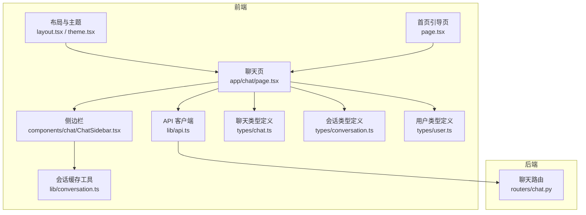
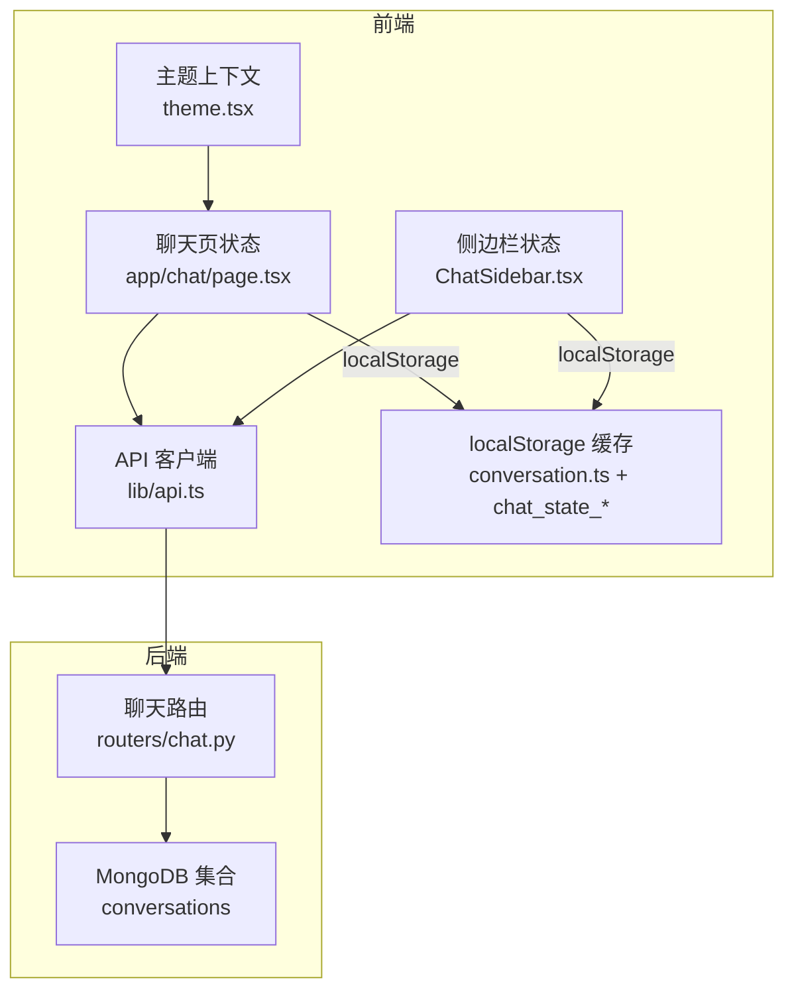
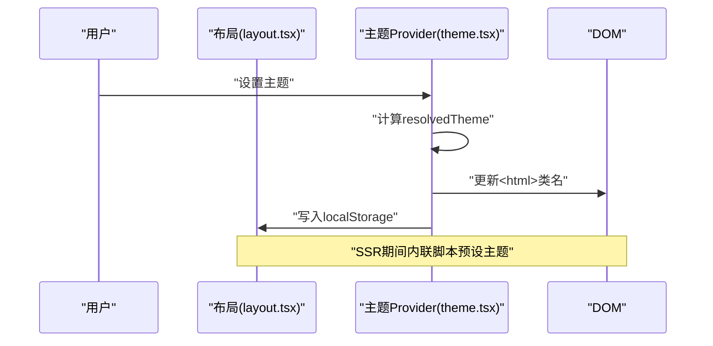
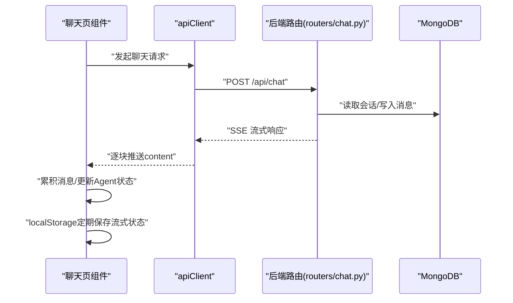
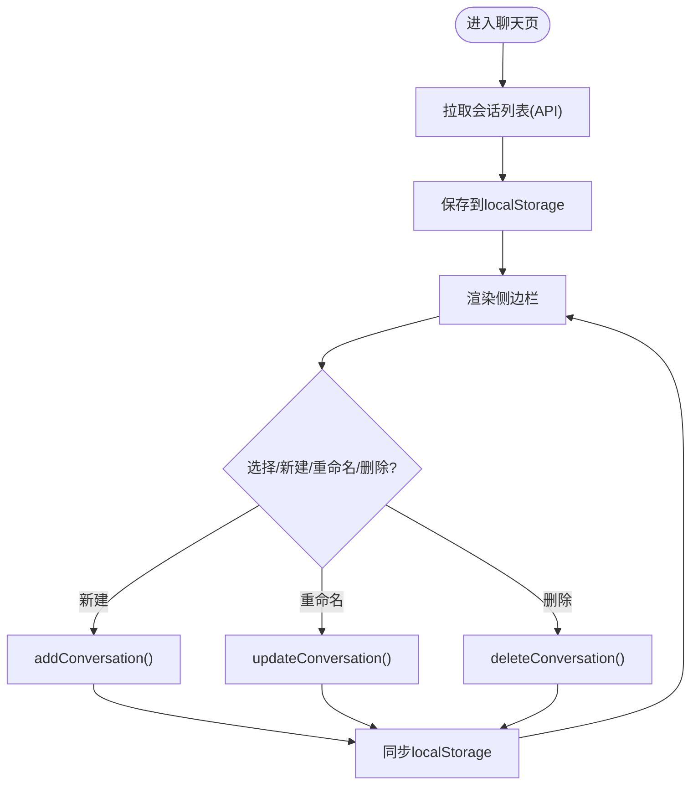
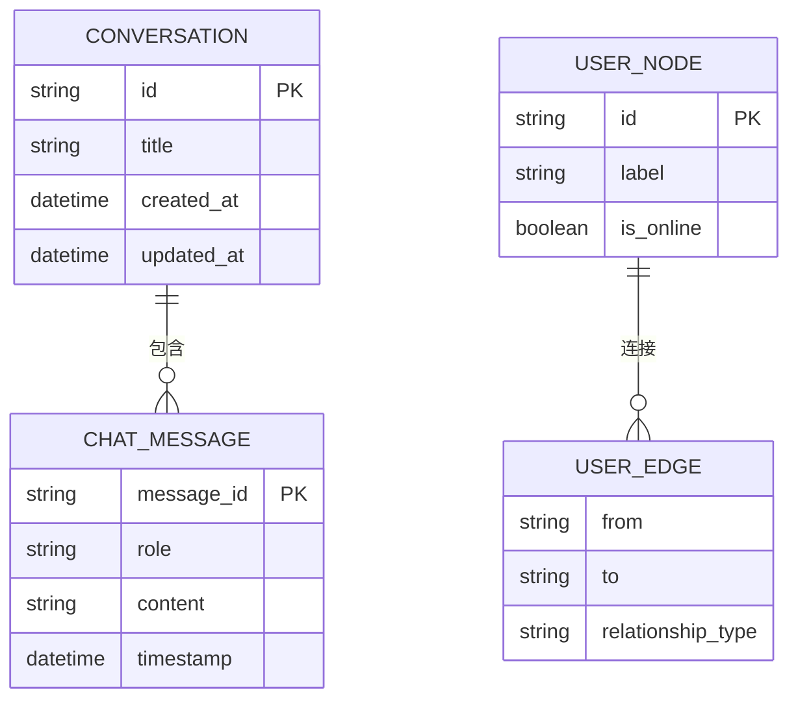
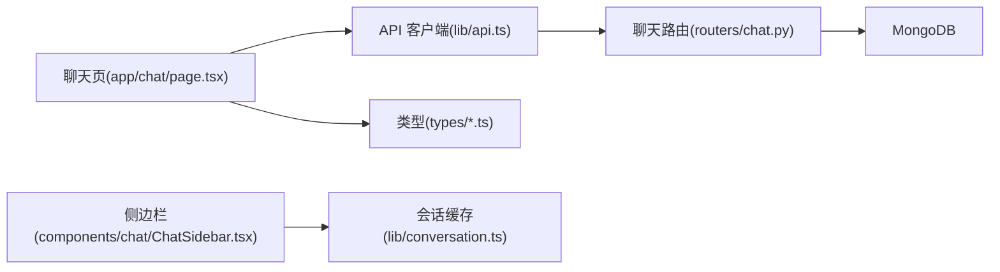

# 状态管理

<cite>
**本文引用的文件**
- [web/app/layout.tsx](file://web/app/layout.tsx)
- [web/lib/theme.tsx](file://web/lib/theme.tsx)
- [web/app/page.tsx](file://web/app/page.tsx)
- [web/app/chat/page.tsx](file://web/app/chat/page.tsx)
- [web/components/chat/ChatSidebar.tsx](file://web/components/chat/ChatSidebar.tsx)
- [web/lib/conversation.ts](file://web/lib/conversation.ts)
- [web/lib/api.ts](file://web/lib/api.ts)
- [web/types/chat.ts](file://web/types/chat.ts)
- [web/types/conversation.ts](file://web/types/conversation.ts)
- [web/types/user.ts](file://web/types/user.ts)
- [routers/chat.py](file://routers/chat.py)
</cite>

## 目录
1. [简介](#简介)
2. [项目结构](#项目结构)
3. [核心组件](#核心组件)
4. [架构总览](#架构总览)
5. [详细组件分析](#详细组件分析)
6. [依赖分析](#依赖分析)
7. [性能考虑](#性能考虑)
8. [故障排查指南](#故障排查指南)
9. [结论](#结论)
10. [附录](#附录)

## 简介
本文件系统性梳理本项目的“状态管理”设计与实现，覆盖前端与后端两部分。重点包括：
- 全局状态、局部状态与持久化存储的设计与边界
- 主题状态管理、用户认证状态与聊天状态的实现方式
- 状态更新触发机制、副作用处理与异步状态管理
- 状态订阅、状态同步与状态回滚的技术方案
- 状态序列化、状态恢复与状态迁移策略
- 状态调试工具、性能监控与内存优化技巧
- 最佳实践与常见陷阱规避方法

## 项目结构
前端采用 Next.js App Router，状态主要分布在页面级组件、UI 组件与工具模块中；后端采用 FastAPI，通过路由模块提供状态相关的接口。

**图表来源**
- [web/app/layout.tsx:1-49](file://web/app/layout.tsx#L1-L49)
- [web/lib/theme.tsx:1-111](file://web/lib/theme.tsx#L1-L111)
- [web/app/page.tsx:1-39](file://web/app/page.tsx#L1-L39)
- [web/app/chat/page.tsx:1-800](file://web/app/chat/page.tsx#L1-L800)
- [web/components/chat/ChatSidebar.tsx:1-367](file://web/components/chat/ChatSidebar.tsx#L1-L367)
- [web/lib/api.ts:1-347](file://web/lib/api.ts#L1-L347)
- [web/lib/conversation.ts:1-129](file://web/lib/conversation.ts#L1-L129)
- [web/types/chat.ts:1-79](file://web/types/chat.ts#L1-L79)
- [web/types/conversation.ts:1-10](file://web/types/conversation.ts#L1-L10)
- [web/types/user.ts:1-176](file://web/types/user.ts#L1-L176)
- [routers/chat.py:1-800](file://routers/chat.py#L1-L800)

**章节来源**
- [web/app/layout.tsx:1-49](file://web/app/layout.tsx#L1-L49)
- [web/lib/theme.tsx:1-111](file://web/lib/theme.tsx#L1-L111)
- [web/app/page.tsx:1-39](file://web/app/page.tsx#L1-L39)
- [web/app/chat/page.tsx:1-800](file://web/app/chat/page.tsx#L1-L800)
- [web/components/chat/ChatSidebar.tsx:1-367](file://web/components/chat/ChatSidebar.tsx#L1-L367)
- [web/lib/api.ts:1-347](file://web/lib/api.ts#L1-L347)
- [web/lib/conversation.ts:1-129](file://web/lib/conversation.ts#L1-L129)
- [web/types/chat.ts:1-79](file://web/types/chat.ts#L1-L79)
- [web/types/conversation.ts:1-10](file://web/types/conversation.ts#L1-L10)
- [web/types/user.ts:1-176](file://web/types/user.ts#L1-L176)
- [routers/chat.py:1-800](file://routers/chat.py#L1-L800)

## 核心组件
- 主题状态管理
  - 通过 Provider 模式在根节点注入主题上下文，支持 light/dark/system 三种模式，并持久化到 localStorage。变更时即时应用到 html 根元素类名，实现全站主题切换。
  - 参考路径：[web/lib/theme.tsx:1-111](file://web/lib/theme.tsx#L1-L111)，[web/app/layout.tsx:22-47](file://web/app/layout.tsx#L22-L47)

- 聊天状态管理（前端）
  - 聊天页集中管理消息、输入、加载、对话 ID、知识空间、模型配置、流式生成、Agent 状态、深研结果等。使用 useState/useEffect/useRef 管理局部状态，结合 localStorage 实现“流式生成中”的状态持久化与恢复。
  - 参考路径：[web/app/chat/page.tsx:22-529](file://web/app/chat/page.tsx#L22-L529)

- 会话状态与持久化（前端）
  - 侧边栏组件负责会话列表的拉取、展示、重命名、删除与本地缓存；同时提供本地 localStorage 缓存能力，提升离线可用性与加载速度。
  - 参考路径：[web/components/chat/ChatSidebar.tsx:30-82](file://web/components/chat/ChatSidebar.tsx#L30-L82)，[web/lib/conversation.ts:15-98](file://web/lib/conversation.ts#L15-L98)

- API 客户端与后端交互
  - 统一的 apiClient 封装了模型、知识空间、文档、会话、聊天流式接口等调用；后端路由提供会话 CRUD、消息增删改、流式聊天与深研模式等能力。
  - 参考路径：[web/lib/api.ts:106-347](file://web/lib/api.ts#L106-L347)，[routers/chat.py:97-751](file://routers/chat.py#L97-L751)

- 类型定义
  - 聊天消息、会话、用户网络图等类型定义，保证前后端数据结构一致性和开发期类型安全。
  - 参考路径：[web/types/chat.ts:1-79](file://web/types/chat.ts#L1-L79)，[web/types/conversation.ts:1-10](file://web/types/conversation.ts#L1-L10)，[web/types/user.ts:1-176](file://web/types/user.ts#L1-L176)

**章节来源**
- [web/lib/theme.tsx:1-111](file://web/lib/theme.tsx#L1-L111)
- [web/app/layout.tsx:22-47](file://web/app/layout.tsx#L22-L47)
- [web/app/chat/page.tsx:22-529](file://web/app/chat/page.tsx#L22-L529)
- [web/components/chat/ChatSidebar.tsx:30-82](file://web/components/chat/ChatSidebar.tsx#L30-L82)
- [web/lib/conversation.ts:15-98](file://web/lib/conversation.ts#L15-L98)
- [web/lib/api.ts:106-347](file://web/lib/api.ts#L106-L347)
- [routers/chat.py:97-751](file://routers/chat.py#L97-L751)
- [web/types/chat.ts:1-79](file://web/types/chat.ts#L1-L79)
- [web/types/conversation.ts:1-10](file://web/types/conversation.ts#L1-L10)
- [web/types/user.ts:1-176](file://web/types/user.ts#L1-L176)

## 架构总览
前端状态分为三层：
- 全局状态：主题上下文、全局模型配置、深研开关等
- 局部状态：聊天页内的消息、输入、加载、流式生成、Agent 状态等
- 持久化存储：localStorage 用于会话列表缓存与“流式生成中”状态恢复

后端状态通过 MongoDB 集合维护会话与消息，提供 REST 接口与 SSE 流式响应。

**图表来源**
- [web/lib/theme.tsx:1-111](file://web/lib/theme.tsx#L1-L111)
- [web/app/chat/page.tsx:22-529](file://web/app/chat/page.tsx#L22-L529)
- [web/components/chat/ChatSidebar.tsx:1-367](file://web/components/chat/ChatSidebar.tsx#L1-L367)
- [web/lib/api.ts:106-347](file://web/lib/api.ts#L106-L347)
- [web/lib/conversation.ts:15-98](file://web/lib/conversation.ts#L15-L98)
- [routers/chat.py:97-751](file://routers/chat.py#L97-L751)

## 详细组件分析

### 主题状态管理
- 设计要点
  - Provider 注入 theme/resolvedTheme/setTheme，setTheme 写入 localStorage 并更新 DOM 类名
  - 支持 system 模式，监听系统主题变化并实时应用
- 生命周期
  - 初始化：读取 localStorage，计算 resolvedTheme，立即应用
  - 变更：setTheme -> 写入 localStorage -> 计算 resolvedTheme -> 应用到 html
- 与页面集成
  - 根布局在 SSR 期间通过内联脚本预设主题，避免闪烁

**图表来源**
- [web/app/layout.tsx:22-47](file://web/app/layout.tsx#L22-L47)
- [web/lib/theme.tsx:46-95](file://web/lib/theme.tsx#L46-L95)

**章节来源**
- [web/lib/theme.tsx:1-111](file://web/lib/theme.tsx#L1-L111)
- [web/app/layout.tsx:22-47](file://web/app/layout.tsx#L22-L47)

### 聊天状态管理（前端）
- 全局状态
  - 模型列表、默认模型选择、RAG/深研开关、深思Agent配置等
- 局部状态
  - 消息列表、输入框、加载步骤、对话ID、知识空间选择、文件上传状态、Agent工作状态、深研结果、Toast提示
- 异步与流式
  - 使用 AbortController 中断生成；SSE 流式接收，按 chunk 累积内容
  - 流式生成中状态通过 localStorage 定期保存与恢复，支持页面隐藏/卸载场景
- 本地缓存
  - 会话消息本地缓存（conversation_{id}_messages），便于快速访问
  - “流式生成中”状态缓存（chat_state_{conversationId或new}），5分钟内有效

**图表来源**
- [web/app/chat/page.tsx:680-750](file://web/app/chat/page.tsx#L680-L750)
- [web/lib/api.ts:239-286](file://web/lib/api.ts#L239-L286)
- [routers/chat.py:615-751](file://routers/chat.py#L615-L751)

**章节来源**
- [web/app/chat/page.tsx:22-529](file://web/app/chat/page.tsx#L22-L529)
- [web/lib/api.ts:106-347](file://web/lib/api.ts#L106-L347)
- [routers/chat.py:97-751](file://routers/chat.py#L97-L751)

### 会话状态与持久化（前端）
- 侧边栏职责
  - 定时拉取会话列表，本地缓存；支持新建、重命名、删除；移动端/桌面端交互
- 本地缓存策略
  - localStorage 存储会话列表，作为离线缓存；与后端 API 结果保持一致
- 与聊天页联动
  - 选择会话时更新聊天页对话ID；新建会话时同步更新本地缓存

**图表来源**
- [web/components/chat/ChatSidebar.tsx:60-145](file://web/components/chat/ChatSidebar.tsx#L60-L145)
- [web/lib/conversation.ts:15-129](file://web/lib/conversation.ts#L15-L129)

**章节来源**
- [web/components/chat/ChatSidebar.tsx:1-367](file://web/components/chat/ChatSidebar.tsx#L1-L367)
- [web/lib/conversation.ts:15-129](file://web/lib/conversation.ts#L15-L129)

### 用户认证状态
- 当前实现
  - 聊天路由与会话接口未显式校验用户身份；匿名模式下通过对话集合进行 CRUD
- 建议
  - 在路由层引入认证中间件，对会话/消息操作进行用户绑定与权限校验
  - 在前端通过登录状态与 Token 管理，统一在 apiClient 中携带认证头

**章节来源**
- [routers/chat.py:97-149](file://routers/chat.py#L97-L149)
- [web/lib/api.ts:106-347](file://web/lib/api.ts#L106-L347)

### 聊天状态的数据模型
- 消息模型：角色、内容、时间戳、来源、推荐资源等
- 会话模型：ID、标题、消息列表、创建/更新时间
- 用户网络图：节点与边，支持在线状态、关系类型等

**图表来源**
- [web/types/conversation.ts:1-10](file://web/types/conversation.ts#L1-L10)
- [web/types/chat.ts:1-79](file://web/types/chat.ts#L1-L79)
- [web/types/user.ts:98-123](file://web/types/user.ts#L98-L123)

**章节来源**
- [web/types/conversation.ts:1-10](file://web/types/conversation.ts#L1-L10)
- [web/types/chat.ts:1-79](file://web/types/chat.ts#L1-L79)
- [web/types/user.ts:1-176](file://web/types/user.ts#L1-L176)

## 依赖分析
- 前端依赖
  - 聊天页依赖 API 客户端与类型定义；侧边栏依赖会话缓存工具；布局依赖主题 Provider
- 后端依赖
  - 路由依赖数据库连接与 Agent 执行器；提供 SSE 流式响应

**图表来源**
- [web/app/chat/page.tsx:1-800](file://web/app/chat/page.tsx#L1-L800)
- [web/lib/api.ts:106-347](file://web/lib/api.ts#L106-L347)
- [web/components/chat/ChatSidebar.tsx:1-367](file://web/components/chat/ChatSidebar.tsx#L1-L367)
- [web/lib/conversation.ts:15-98](file://web/lib/conversation.ts#L15-L98)
- [routers/chat.py:97-751](file://routers/chat.py#L97-L751)

**章节来源**
- [web/app/chat/page.tsx:1-800](file://web/app/chat/page.tsx#L1-L800)
- [web/lib/api.ts:106-347](file://web/lib/api.ts#L106-L347)
- [web/components/chat/ChatSidebar.tsx:1-367](file://web/components/chat/ChatSidebar.tsx#L1-L367)
- [web/lib/conversation.ts:15-98](file://web/lib/conversation.ts#L15-L98)
- [routers/chat.py:97-751](file://routers/chat.py#L97-L751)

## 性能考虑
- 流式渲染与滚动
  - 使用 requestAnimationFrame 与智能阈值控制滚动，减少重排；流式输出时更频繁滚动，非流式时延迟滚动
- 状态持久化频率
  - 仅在流式生成或加载中保存 localStorage，避免频繁 IO；5秒周期保存，页面隐藏/卸载时兜底保存
- 轮询与定时器
  - 侧边栏会话列表每30秒刷新；文件处理状态每2秒轮询；组件卸载时清理轮询与定时器
- 内存优化
  - 仅缓存最近N轮对话片段；及时清理 Agent 状态与深研结果；避免在消息列表中存储大对象

[本节为通用指导，无需特定文件引用]

## 故障排查指南
- 流式生成中断
  - 检查 AbortController 是否被复用；确认客户端断开检测逻辑；查看后端 is_disconnected 响应
  - 参考路径：[web/app/chat/page.tsx:645-663](file://web/app/chat/page.tsx#L645-L663)，[routers/chat.py:717-734](file://routers/chat.py#L717-L734)
- 状态恢复失败
  - localStorage 中“流式生成中”状态超过5分钟或非流式状态会被清理；检查 timestamp 与 isStreaming 字段
  - 参考路径：[web/app/chat/page.tsx:354-409](file://web/app/chat/page.tsx#L354-L409)
- 会话列表不同步
  - 确认 API 返回与本地缓存一致性；删除/重命名后需重新拉取并更新本地缓存
  - 参考路径：[web/lib/conversation.ts:39-76](file://web/lib/conversation.ts#L39-L76)，[web/components/chat/ChatSidebar.tsx:109-141](file://web/components/chat/ChatSidebar.tsx#L109-L141)
- 主题切换异常
  - 检查 localStorage 写入与 html 类名应用；确认 system 模式媒体查询监听
  - 参考路径：[web/lib/theme.tsx:92-95](file://web/lib/theme.tsx#L92-L95)，[web/app/layout.tsx:24-38](file://web/app/layout.tsx#L24-L38)

**章节来源**
- [web/app/chat/page.tsx:354-409](file://web/app/chat/page.tsx#L354-L409)
- [web/app/chat/page.tsx:645-663](file://web/app/chat/page.tsx#L645-L663)
- [web/lib/conversation.ts:39-76](file://web/lib/conversation.ts#L39-L76)
- [web/components/chat/ChatSidebar.tsx:109-141](file://web/components/chat/ChatSidebar.tsx#L109-L141)
- [web/lib/theme.tsx:92-95](file://web/lib/theme.tsx#L92-L95)
- [web/app/layout.tsx:24-38](file://web/app/layout.tsx#L24-L38)
- [routers/chat.py:717-734](file://routers/chat.py#L717-L734)

## 结论
本项目在前端实现了清晰的“主题全局状态 + 聊天局部状态 + 本地持久化”的状态管理架构，配合后端的会话与消息存储，满足了匿名模式下的核心需求。建议后续在认证、权限与状态一致性方面进一步完善，以提升安全性与稳定性。

[本节为总结，无需特定文件引用]

## 附录

### 状态订阅、同步与回滚
- 订阅
  - 通过 React hooks 订阅状态变化；SSE 流式订阅后端增量
- 同步
  - 侧边栏与聊天页通过 API 与本地缓存双向同步；会话列表定时刷新
- 回滚
  - 重新生成回答：删除指定用户消息之后的所有消息，保留历史上下文

**章节来源**
- [web/components/chat/ChatSidebar.tsx:60-82](file://web/components/chat/ChatSidebar.tsx#L60-L82)
- [routers/chat.py:534-613](file://routers/chat.py#L534-L613)

### 状态序列化、恢复与迁移
- 序列化
  - localStorage 保存消息、加载状态、Agent 状态、深研结果与时间戳
- 恢复
  - 仅恢复“流式生成中”且5分钟内的状态；否则清理缓存
- 迁移
  - 新增字段时需兼容旧版本；在恢复逻辑中提供默认值

**章节来源**
- [web/app/chat/page.tsx:330-420](file://web/app/chat/page.tsx#L330-L420)

### 状态调试、监控与优化清单
- 调试
  - 打印 localStorage 键值；检查 SSE 连接状态；验证 is_disconnected
- 监控
  - 记录流式生成耗时、轮询间隔、定时保存频率
- 优化
  - 合理的滚动策略、最小化状态更新、及时清理定时器与轮询

[本节为通用指导，无需特定文件引用]