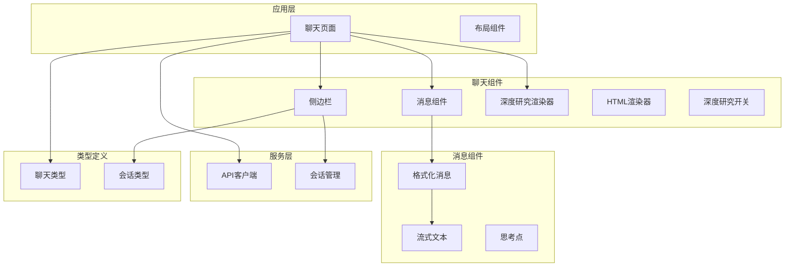
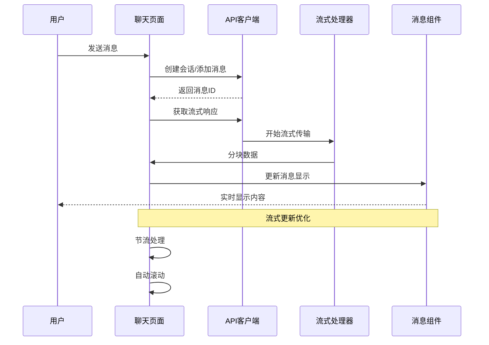
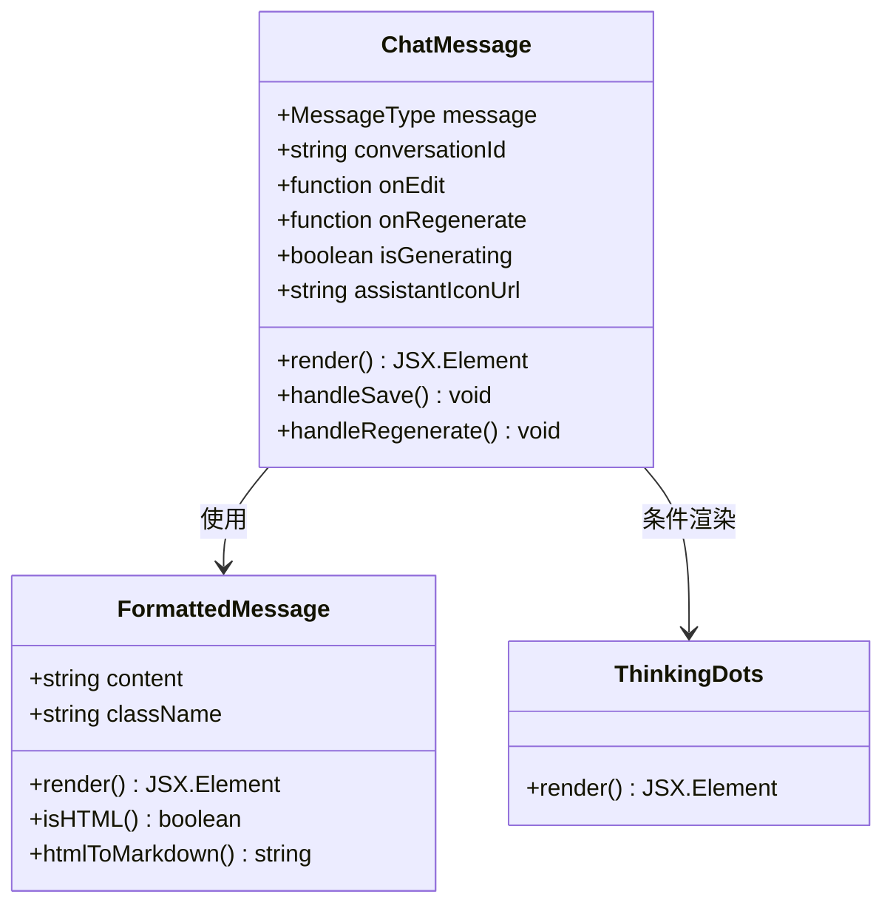
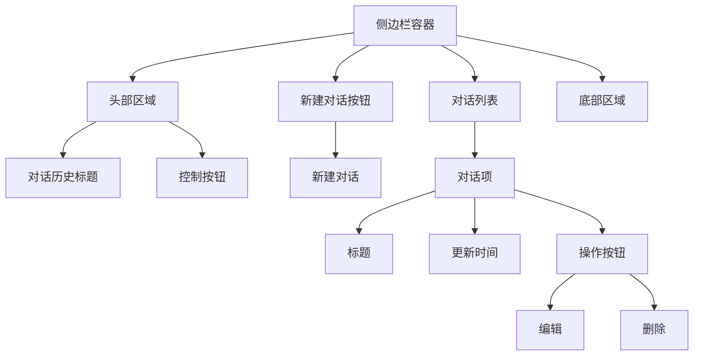
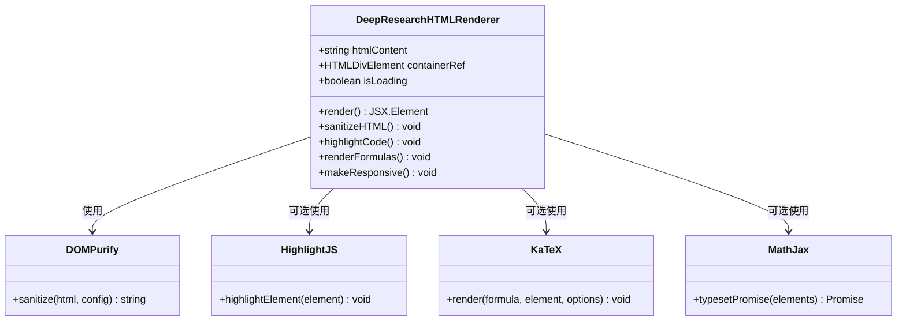
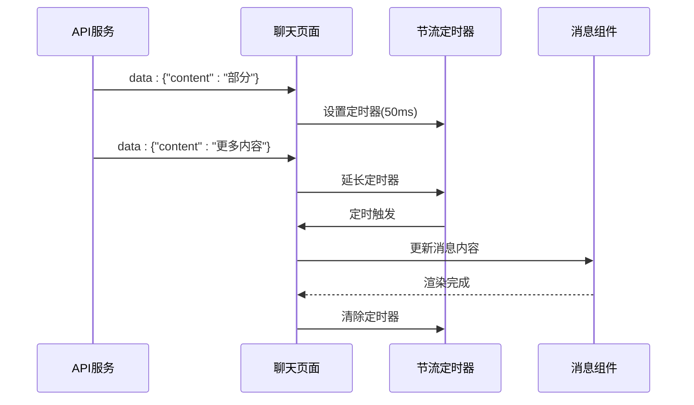
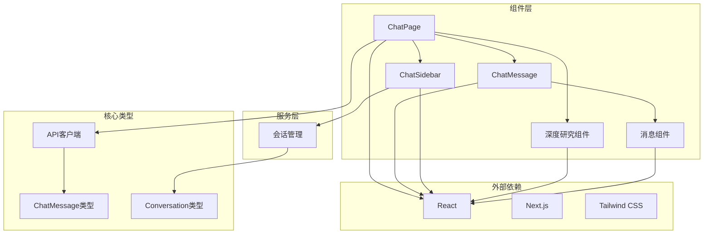

# 聊天界面

<cite>
**本文档引用的文件**
- [web/app/chat/page.tsx](file://web/app/chat/page.tsx)
- [web/components/chat/ChatMessage.tsx](file://web/components/chat/ChatMessage.tsx)
- [web/components/chat/ChatSidebar.tsx](file://web/components/chat/ChatSidebar.tsx)
- [web/components/chat/DeepResearchHTMLRenderer.tsx](file://web/components/chat/DeepResearchHTMLRenderer.tsx)
- [web/components/chat/DeepResearchRenderer.tsx](file://web/components/chat/DeepResearchRenderer.tsx)
- [web/components/chat/DeepResearchToggle.tsx](file://web/components/chat/DeepResearchToggle.tsx)
- [web/components/message/FormattedMessage.tsx](file://web/components/message/FormattedMessage.tsx)
- [web/components/message/StreamingText.tsx](file://web/components/message/StreamingText.tsx)
- [web/components/message/ThinkingDots.tsx](file://web/components/message/ThinkingDots.tsx)
- [web/lib/conversation.ts](file://web/lib/conversation.ts)
- [web/lib/api.ts](file://web/lib/api.ts)
- [web/types/chat.ts](file://web/types/chat.ts)
- [web/types/conversation.ts](file://web/types/conversation.ts)
</cite>

## 目录
1. [简介](#简介)
2. [项目结构](#项目结构)
3. [核心组件](#核心组件)
4. [架构概览](#架构概览)
5. [详细组件分析](#详细组件分析)
6. [依赖关系分析](#依赖关系分析)
7. [性能考虑](#性能考虑)
8. [故障排除指南](#故障排除指南)
9. [结论](#结论)
10. [附录](#附录)

## 简介

聊天界面是 Advanced RAG 系统的核心交互模块，提供了现代化的对话体验。该界面采用 ChatGPT 风格的设计，集成了实时消息流式传输、深度研究模式、会话管理和丰富的消息渲染功能。

主要特性包括：
- 实时流式消息传输和显示
- 深度研究模式的多Agent协作
- 会话历史管理和持久化
- 支持多种消息格式（文本、HTML、Markdown）
- 响应式设计和无障碍访问支持
- 键盘快捷键和用户体验优化

## 项目结构

聊天界面采用模块化的组件架构，主要分为以下几个层次：

**图表来源**
- [web/app/chat/page.tsx:1960-2399](file://web/app/chat/page.tsx#L1960-L2399)
- [web/components/chat/ChatMessage.tsx:1-173](file://web/components/chat/ChatMessage.tsx#L1-L173)
- [web/components/chat/ChatSidebar.tsx:1-367](file://web/components/chat/ChatSidebar.tsx#L1-L367)

**章节来源**
- [web/app/chat/page.tsx:1-800](file://web/app/chat/page.tsx#L1-L800)
- [web/components/chat/ChatMessage.tsx:1-173](file://web/components/chat/ChatMessage.tsx#L1-L173)
- [web/components/chat/ChatSidebar.tsx:1-367](file://web/components/chat/ChatSidebar.tsx#L1-L367)

## 核心组件

### 聊天页面 (ChatPage)

聊天页面是整个聊天界面的主控制器，负责管理所有状态和业务逻辑：

- **状态管理**：维护消息列表、输入内容、加载状态、会话ID等
- **流式处理**：实现消息的实时流式传输和更新
- **深度研究模式**：集成多Agent协作的复杂对话流程
- **文件上传**：支持文档上传和处理状态跟踪
- **会话管理**：处理新建、加载和编辑会话

### ChatMessage 组件

消息渲染的核心组件，负责不同类型消息的显示：

- **用户消息**：蓝色气泡，右对齐，支持编辑和重新生成
- **助手消息**：白色气泡，左对齐，支持源码引用显示
- **编辑模式**：支持消息内容的实时编辑
- **思考指示**：GPU预热期间显示思考点动画
- **源码引用**：显示知识库引用和评分

### ChatSidebar 组件

会话管理的侧边栏组件：

- **会话列表**：显示历史对话记录
- **新建会话**：创建新的对话
- **重命名功能**：支持对话标题的编辑
- **删除功能**：安全删除对话记录
- **响应式设计**：支持移动端和桌面端

**章节来源**
- [web/app/chat/page.tsx:22-530](file://web/app/chat/page.tsx#L22-L530)
- [web/components/chat/ChatMessage.tsx:18-171](file://web/components/chat/ChatMessage.tsx#L18-L171)
- [web/components/chat/ChatSidebar.tsx:23-367](file://web/components/chat/ChatSidebar.tsx#L23-L367)

## 架构概览

聊天界面采用分层架构设计，确保各组件职责清晰、耦合度低：

**图表来源**
- [web/app/chat/page.tsx:680-1292](file://web/app/chat/page.tsx#L680-L1292)
- [web/lib/api.ts:240-286](file://web/lib/api.ts#L240-L286)

## 详细组件分析

### ChatMessage 组件详细分析

ChatMessage 是消息渲染的核心组件，实现了复杂的消息显示逻辑：

#### 组件结构

**图表来源**
- [web/components/chat/ChatMessage.tsx:9-171](file://web/components/chat/ChatMessage.tsx#L9-L171)
- [web/components/message/FormattedMessage.tsx:6-255](file://web/components/message/FormattedMessage.tsx#L6-L255)
- [web/components/message/ThinkingDots.tsx:7-26](file://web/components/message/ThinkingDots.tsx#L7-L26)

#### 消息渲染逻辑

ChatMessage 组件根据消息角色和状态提供不同的渲染效果：

1. **用户消息渲染**：
   - 蓝色渐变背景
   - 右对齐布局
   - 支持编辑和重新生成操作
   - 时间戳显示

2. **助手消息渲染**：
   - 白色背景，深色文字
   - 左对齐布局
   - 源码引用显示
   - 思考指示器（GPU预热）

3. **编辑模式**：
   - 文本区域编辑
   - 保存和取消按钮
   - 实时验证和保存

#### 类型处理和样式定制

组件支持多种消息类型和样式定制：

- **角色区分**：通过 `message.role` 区分用户和助手消息
- **条件渲染**：根据 `isGenerating` 状态显示不同内容
- **样式类**：动态生成CSS类名实现主题切换
- **响应式设计**：适配不同屏幕尺寸

**章节来源**
- [web/components/chat/ChatMessage.tsx:18-171](file://web/components/chat/ChatMessage.tsx#L18-L171)
- [web/components/message/FormattedMessage.tsx:105-255](file://web/components/message/FormattedMessage.tsx#L105-L255)

### ChatSidebar 组件详细分析

ChatSidebar 提供完整的会话管理功能：

#### 侧边栏布局

**图表来源**
- [web/components/chat/ChatSidebar.tsx:175-367](file://web/components/chat/ChatSidebar.tsx#L175-L367)

#### 会话管理功能

1. **会话加载**：
   - 从API获取对话列表
   - 同步到localStorage缓存
   - 定时刷新机制（30秒间隔）

2. **新建会话**：
   - 触发父组件的 `onNewConversation` 回调
   - 清空当前消息状态

3. **会话选择**：
   - 点击对话项触发 `onConversationSelect`
   - 支持移动端自动关闭

4. **对话操作**：
   - **重命名**：弹出重命名对话框
   - **删除**：确认删除对话
   - **双击编辑**：直接编辑标题

#### 状态持久化

组件实现了完整的状态持久化机制：

- **折叠状态**：保存到 `localStorage` (`chatSidebarCollapsed`)
- **会话列表**：本地缓存同步
- **响应式行为**：支持移动端和桌面端

**章节来源**
- [web/components/chat/ChatSidebar.tsx:23-367](file://web/components/chat/ChatSidebar.tsx#L23-L367)
- [web/lib/conversation.ts:16-98](file://web/lib/conversation.ts#L16-L98)

### 深度研究模式分析

深度研究模式是聊天界面的高级功能，提供多Agent协作的复杂对话能力：

#### DeepResearchHTMLRenderer 组件

**图表来源**
- [web/components/chat/DeepResearchHTMLRenderer.tsx:17-235](file://web/components/chat/DeepResearchHTMLRenderer.tsx#L17-L235)

#### 渲染流程

深度研究HTML渲染器实现了完整的安全HTML渲染流程：

1. **内容清理**：
   - 使用DOMPurify进行XSS防护
   - 严格控制允许的HTML标签和属性
   - 支持数据属性和自定义属性

2. **内容渲染**：
   - 代码高亮（highlight.js）
   - 数学公式渲染（KaTeX/MathJax）
   - 响应式表格处理
   - 图片懒加载和响应式

3. **错误处理**：
   - 渲染失败时的降级处理
   - 异常捕获和日志记录
   - 用户友好的错误提示

#### DeepResearchRenderer 组件

DeepResearchRenderer 专门处理多Agent协作产生的内容：

1. **内容检测**：
   - 自动检测HTML格式内容
   - HTML到Markdown的转换
   - Agent类型映射和显示

2. **Agent结果显示**：
   - 每个Agent独立的标题显示
   - 渐进式动画效果
   - 结构化的内容组织

**章节来源**
- [web/components/chat/DeepResearchHTMLRenderer.tsx:17-235](file://web/components/chat/DeepResearchHTMLRenderer.tsx#L17-L235)
- [web/components/chat/DeepResearchRenderer.tsx:114-177](file://web/components/chat/DeepResearchRenderer.tsx#L114-L177)

### 流式响应处理技术方案

聊天界面实现了高效的流式响应处理机制：

#### 流式更新优化

**图表来源**
- [web/app/chat/page.tsx:1145-1172](file://web/app/chat/page.tsx#L1145-L1172)

#### 技术实现要点

1. **节流机制**：
   - 使用 `pendingContentRef` 存储累积内容
   - 50ms节流延迟批量更新
   - 避免频繁的React重渲染

2. **自动滚动**：
   - 智能滚动判断（距离底部阈值）
   - 平滑滚动和快速滚动结合
   - 用户交互时的滚动行为优化

3. **状态管理**：
   - `isStreamingRef` 标记流式状态
   - `abortControllerRef` 支持中断生成
   - `saveStateToStorage` 状态持久化

**章节来源**
- [web/app/chat/page.tsx:47-61](file://web/app/chat/page.tsx#L47-L61)
- [web/app/chat/page.tsx:550-601](file://web/app/chat/page.tsx#L550-L601)

### 用户体验优化

#### 键盘快捷键支持

聊天界面提供了完善的键盘交互支持：

- **Enter键发送**：默认行为，Shift+Enter换行
- **Esc键停止**：中断当前流式生成
- **Tab键补全**：智能提示功能
- **方向键导航**：消息列表导航

#### 无障碍访问支持

组件实现了全面的无障碍访问：

- **语义化HTML**：正确的HTML标签使用
- **ARIA属性**：适当的ARIA角色和属性
- **键盘导航**：完整的键盘操作支持
- **屏幕阅读器**：友好的语音输出

#### 响应式设计

界面支持多种设备和屏幕尺寸：

- **移动端优化**：触摸友好的按钮和输入
- **平板适配**：中间尺寸的布局调整
- **桌面端增强**：完整的功能和布局
- **暗色模式**：完整的深色主题支持

## 依赖关系分析

聊天界面的组件间依赖关系清晰，遵循单一职责原则：

**图表来源**
- [web/app/chat/page.tsx:1-50](file://web/app/chat/page.tsx#L1-L50)
- [web/types/chat.ts:3-14](file://web/types/chat.ts#L3-L14)
- [web/types/conversation.ts:1-8](file://web/types/conversation.ts#L1-L8)

### 组件耦合度分析

- **低耦合设计**：各组件职责明确，依赖关系清晰
- **接口契约**：通过props和回调函数进行通信
- **类型安全**：完整的TypeScript类型定义
- **可测试性**：组件设计便于单元测试

**章节来源**
- [web/app/chat/page.tsx:1-2563](file://web/app/chat/page.tsx#L1-L2563)
- [web/lib/api.ts:106-347](file://web/lib/api.ts#L106-L347)

## 性能考虑

### 渲染性能优化

1. **虚拟滚动**：大量消息时使用虚拟滚动
2. **记忆化**：使用 `memo` 优化组件重渲染
3. **懒加载**：图片和内容的懒加载策略
4. **防抖节流**：输入和滚动事件的性能优化

### 网络性能优化

1. **流式传输**：实时数据传输减少等待时间
2. **缓存策略**：本地缓存和CDN加速
3. **连接池**：HTTP连接复用
4. **压缩传输**：Gzip/Brotli压缩

### 内存管理

1. **状态清理**：组件卸载时清理定时器和订阅
2. **垃圾回收**：及时释放大对象引用
3. **内存泄漏防护**：严格的事件监听器管理

## 故障排除指南

### 常见问题诊断

#### 流式传输问题

**症状**：消息不显示或显示不完整
**解决方案**：
1. 检查网络连接稳定性
2. 验证API服务可用性
3. 查看浏览器控制台错误
4. 确认流式响应格式正确

#### 深度研究模式异常

**症状**：多Agent协作失败或内容显示错误
**解决方案**：
1. 检查Agent配置和权限
2. 验证HTML内容的安全性
3. 确认数学公式渲染库加载
4. 查看Agent状态面板错误信息

#### 会话管理问题

**症状**：会话列表不更新或丢失
**解决方案**：
1. 检查localStorage访问权限
2. 验证API连接状态
3. 确认会话ID格式正确
4. 查看网络请求响应

**章节来源**
- [web/app/chat/page.tsx:1238-1292](file://web/app/chat/page.tsx#L1238-L1292)
- [web/components/chat/DeepResearchHTMLRenderer.tsx:181-188](file://web/components/chat/DeepResearchHTMLRenderer.tsx#L181-L188)

## 结论

聊天界面是一个功能完整、架构清晰的现代化聊天系统。通过模块化设计和先进的技术实现，提供了优秀的用户体验和强大的功能特性。

主要优势包括：
- **高性能**：流式传输和优化的渲染机制
- **可扩展性**：清晰的架构支持功能扩展
- **用户体验**：完整的交互和无障碍支持
- **安全性**：全面的输入验证和内容清理
- **可靠性**：完善的错误处理和状态管理

未来可以考虑的功能增强：
- 更丰富的消息类型支持
- 多语言国际化
- 更灵活的主题定制
- 高级搜索和过滤功能

## 附录

### API接口定义

聊天界面使用的API接口包括：

- **会话管理**：创建、获取、更新、删除会话
- **消息处理**：添加消息、更新消息、重新生成
- **流式响应**：聊天和深度研究的流式接口
- **文件上传**：对话附件的上传和状态查询

### 类型定义概览

- **ChatMessage**：消息结构定义
- **SourceInfo**：知识库引用信息
- **Conversation**：会话信息结构
- **AgentStatus**：Agent状态信息