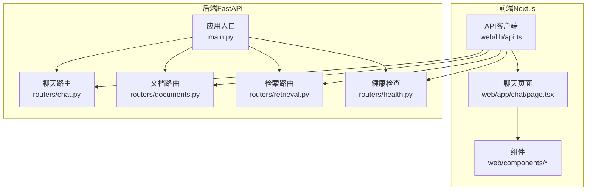
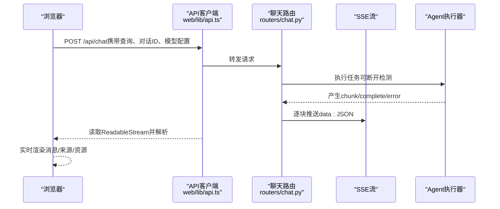
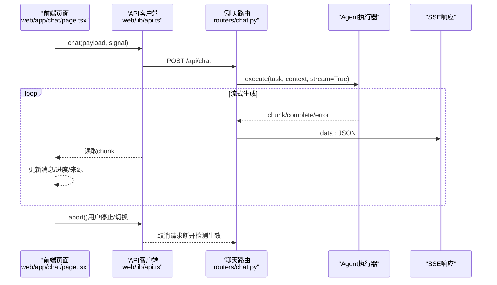
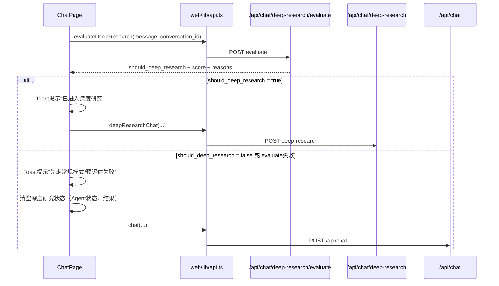
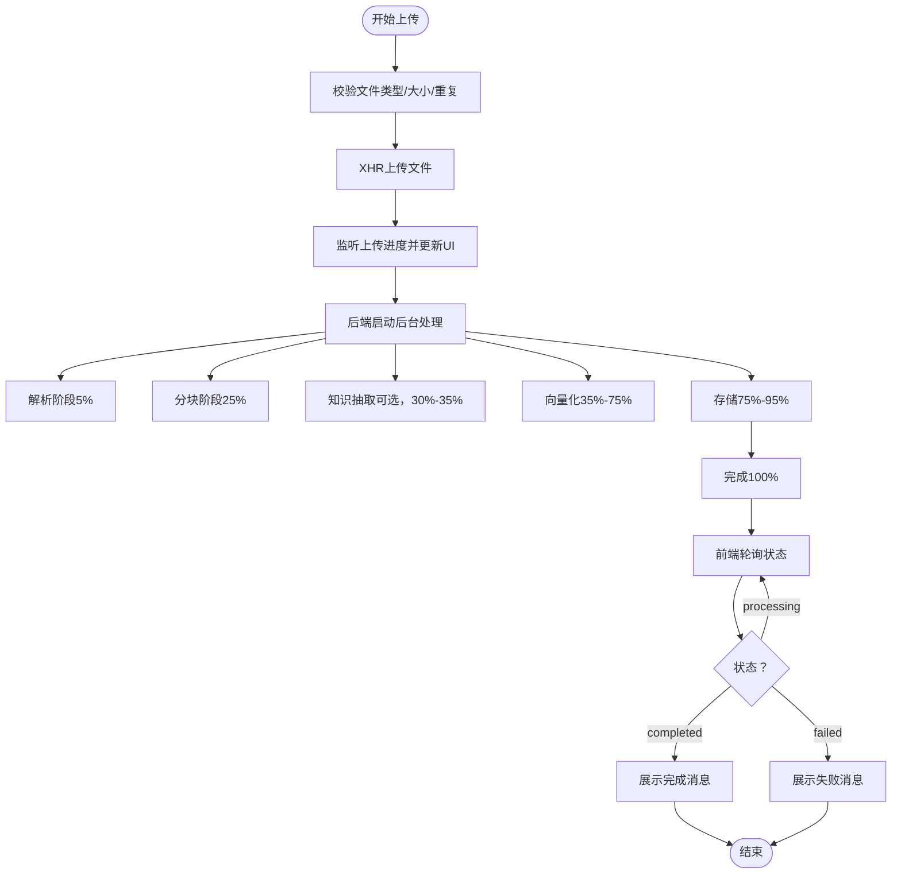
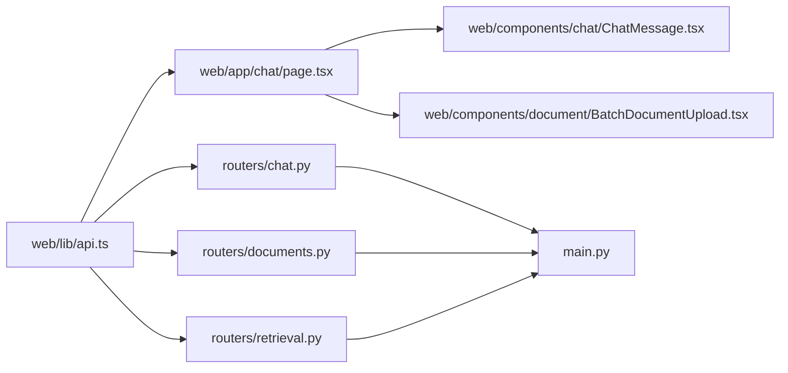

# API集成与通信

<cite>
**本文引用的文件**
- [main.py](file://main.py)
- [chat.py](file://routers/chat.py)
- [documents.py](file://routers/documents.py)
- [retrieval.py](file://routers/retrieval.py)
- [health.py](file://routers/health.py)
- [api.ts](file://web/lib/api.ts)
- [page.tsx](file://web/app/chat/page.tsx)
- [ChatMessage.tsx](file://web/components/chat/ChatMessage.tsx)
- [BatchDocumentUpload.tsx](file://web/components/document/BatchDocumentUpload.tsx)
- [chat.ts](file://web/types/chat.ts)
- [conversation.ts](file://web/types/conversation.ts)
- [Toast.tsx](file://web/components/ui/Toast.tsx)
- [LoadingProgress.tsx](file://web/components/ui/LoadingProgress.tsx)
</cite>

## 目录
1. [简介](#简介)
2. [项目结构](#项目结构)
3. [核心组件](#核心组件)
4. [架构总览](#架构总览)
5. [详细组件分析](#详细组件分析)
6. [依赖关系分析](#依赖关系分析)
7. [性能考量](#性能考量)
8. [故障排查指南](#故障排查指南)
9. [结论](#结论)
10. [附录](#附录)

## 简介
本文件面向Advanced RAG系统的API集成与通信，系统采用FastAPI作为后端，Next.js作为前端，围绕“聊天对话”“文档上传与处理”“检索增强”三大场景构建端到端的API通信机制。重点涵盖：
- HTTP请求处理、响应解析与错误处理
- 聊天API的流式响应（SSE）、断线检测与实时消息接收
- 文档上传API的文件上传、进度跟踪与状态同步
- 认证与授权机制（匿名模式为主）
- API客户端设计模式（请求拦截、响应处理、重试机制）
- 错误处理与用户体验优化（加载状态、错误提示、网络异常处理）
- WebSocket通信实现（连接建立、消息传递、断线重连）

## 项目结构
后端通过FastAPI注册多个路由模块，分别处理聊天、文档、检索、健康检查等业务；前端通过统一的API客户端封装HTTP请求，实现SSE流式接收、XHR上传进度、状态轮询与错误提示。

图表来源
- [main.py:90-99](file://main.py#L90-L99)
- [chat.py:1-20](file://routers/chat.py#L1-L20)
- [documents.py:1-25](file://routers/documents.py#L1-L25)
- [retrieval.py:1-15](file://routers/retrieval.py#L1-L15)
- [health.py:12-23](file://routers/health.py#L12-L23)
- [api.ts:63-69](file://web/lib/api.ts#L63-L69)

章节来源
- [main.py:90-99](file://main.py#L90-L99)
- [api.ts:63-69](file://web/lib/api.ts#L63-L69)

## 核心组件
- 后端路由模块
  - 聊天路由：提供模型列表、对话管理、消息增删改、流式对话与深度研究模式
  - 文档路由：提供文档上传、进度查询、重试处理、状态同步
  - 检索路由：提供查询分析与RAG检索
  - 健康检查：提供服务健康度、存活与就绪探针、性能指标
- 前端API客户端：统一封装HTTP请求、SSE流式接收、XHR上传、状态轮询与错误处理
- 前端页面与组件：聊天页面负责发起请求、接收流式响应、展示消息与进度；文档上传组件负责文件选择、进度上报与状态轮询

章节来源
- [chat.py:84-95](file://routers/chat.py#L84-L95)
- [documents.py:154-192](file://routers/documents.py#L154-L192)
- [retrieval.py:44-94](file://routers/retrieval.py#L44-L94)
- [health.py:23-87](file://routers/health.py#L23-L87)
- [api.ts:115-370](file://web/lib/api.ts#L115-L370)

## 架构总览
后端通过CORS中间件开放跨域访问，静态资源挂载头像、视频封面、资源封面；路由按模块划分，统一前缀便于管理。前端通过API客户端发起请求，聊天使用SSE流式传输，文档上传使用XMLHttpRequest以支持进度回调。

图表来源
- [api.ts:264-288](file://web/lib/api.ts#L264-L288)
- [chat.py:623-760](file://routers/chat.py#L623-L760)

章节来源
- [main.py:62-70](file://main.py#L62-L70)
- [chat.py:623-760](file://routers/chat.py#L623-L760)
- [api.ts:264-288](file://web/lib/api.ts#L264-L288)

## 详细组件分析

### 聊天API集成（SSE流式响应）
- 请求流程
  - 前端调用API客户端的chat方法，构造JSON请求体（查询、对话ID、助手ID、知识空间、是否启用RAG、模型配置）
  - 后端路由接收请求，构建上下文（助手ID、知识空间、对话历史、生成配置）
  - 后端Agent执行器异步生成结果，通过StreamingResponse以SSE格式推送
  - 前端使用ReadableStream读取，按data:行解析JSON，分别处理content、done、error三类事件
- 断线检测与取消
  - 后端在生成循环中定期检查客户端断开状态，一旦断开立即停止生成
  - 前端通过AbortController在用户点击停止或切换页面时主动取消请求
- 实时消息接收
  - 前端对流式片段进行节流合并，避免频繁渲染；在消息末尾展示来源与推荐资源
- 错误处理
  - 后端捕获异常并发送error事件；前端收到后弹出Toast提示

图表来源
- [page.tsx:645-663](file://web/app/chat/page.tsx#L645-L663)
- [api.ts:264-288](file://web/lib/api.ts#L264-L288)
- [chat.py:672-752](file://routers/chat.py#L672-L752)

章节来源
- [page.tsx:680-720](file://web/app/chat/page.tsx#L680-L720)
- [page.tsx:729-820](file://web/app/chat/page.tsx#L729-L820)
- [api.ts:264-288](file://web/lib/api.ts#L264-L288)
- [chat.py:623-760](file://routers/chat.py#L623-L760)

### 前端“深度研究门控”交互说明
- 触发条件
  - 用户打开“深度研究”模式后，发送消息时不会立刻进入多Agent流程，而是先调用预评估接口。
- 交互顺序
  1. 前端调用 `apiClient.evaluateDeepResearch()` -> `POST /api/chat/deep-research/evaluate`
  2. 若 `should_deep_research=true`，展示“已进入深度研究”提示，并继续调用 `apiClient.deepResearchChat()`
  3. 若 `should_deep_research=false`，展示“先走常规模式”提示，清理深度研究状态后回落到 `apiClient.chat()`
  4. 若评估接口异常，采用保守降级策略：提示“预评估失败，改走常规模式”
- 前端提示文案策略
  - 所有提示都携带 `score/threshold` 与前两条 `reasons`，确保用户可理解“为什么走这个模式”。
  - 深度研究与常规模式均保留原有流式体验，仅在“路由选择”阶段新增门控。

章节来源
- [page.tsx:839-882](file://web/app/chat/page.tsx#L839-L882)
- [api.ts:334-368](file://web/lib/api.ts#L334-L368)
- [chat.py:174-205](file://routers/chat.py#L174-L205)

### 文档上传API（进度跟踪与状态同步）
- 上传流程
  - 前端使用XMLHttpRequest上传FormData（文件+知识空间ID），监听upload progress事件，实时更新UI进度
  - 后端路由接收multipart/form-data，解析文件并启动后台处理流程
- 后台处理与进度同步
  - 后台函数按阶段推进：解析、分块、知识抽取（可选）、向量化、存储到MongoDB/Qdrant
  - 进度通过文档仓库更新，前端通过轮询接口获取状态与进度百分比
- 状态轮询与错误提示
  - 前端定时轮询状态接口，根据状态（processing/completed/failed）更新UI，并在完成后追加系统消息
  - 失败时展示错误原因，成功时提示用户可开始对话

图表来源
- [BatchDocumentUpload.tsx:137-238](file://web/components/document/BatchDocumentUpload.tsx#L137-L238)
- [documents.py:274-799](file://routers/documents.py#L274-L799)
- [page.tsx:242-327](file://web/app/chat/page.tsx#L242-L327)

章节来源
- [BatchDocumentUpload.tsx:137-238](file://web/components/document/BatchDocumentUpload.tsx#L137-L238)
- [documents.py:274-799](file://routers/documents.py#L274-L799)
- [page.tsx:242-327](file://web/app/chat/page.tsx#L242-L327)

### 检索服务与查询分析
- 查询分析
  - 前端可调用分析接口判断是否需要检索，后端根据运行时配置与查询分析器返回need_retrieval
- RAG检索
  - 前端在需要时调用检索接口，后端结合助手集合、对话专用向量空间与知识空间ID执行检索，返回上下文、来源与推荐资源

章节来源
- [retrieval.py:44-94](file://routers/retrieval.py#L44-L94)
- [retrieval.py:97-149](file://routers/retrieval.py#L97-L149)

### 健康检查与系统监控
- 健康检查：检查MongoDB与Qdrant连接状态，返回整体健康状态与服务详情
- 存活/就绪探针：用于容器编排的健康探测
- 性能指标：返回请求统计与系统资源使用情况

章节来源
- [health.py:23-87](file://routers/health.py#L23-L87)
- [health.py:90-114](file://routers/health.py#L90-L114)
- [health.py:117-134](file://routers/health.py#L117-L134)

### API客户端设计模式
- 统一请求封装：统一基础URL、Content-Type、错误解析与状态码映射
- SSE流式接收：chat与deep-research接口返回ReadableStream，前端逐行解析
- 深度研究门控：新增evaluate接口用于发送前判定，避免低价值问题直接进入高成本流程
- XHR上传：BatchDocumentUpload组件使用XMLHttpRequest，支持进度回调与超时控制
- 状态轮询：聊天页面轮询附件处理状态，实现异步处理结果的同步
- 错误处理：统一捕获网络错误与HTTP错误，返回标准化错误对象

章节来源
- [api.ts:71-95](file://web/lib/api.ts#L71-L95)
- [api.ts:264-368](file://web/lib/api.ts#L264-L368)
- [api.ts:342-370](file://web/lib/api.ts#L342-L370)

### 认证与授权机制
- 当前实现：后端路由未引入鉴权依赖，聊天与文档接口在路由层未显式校验用户身份
- 建议：若需引入鉴权，可在路由层增加依赖注入与权限校验，或在中间件中统一处理

章节来源
- [chat.py:97-150](file://routers/chat.py#L97-L150)
- [documents.py:154-192](file://routers/documents.py#L154-L192)

### WebSocket通信实现
- 当前实现：后端未提供WebSocket端点；前端Next.js开发环境使用WebSocket进行热更新与HMR，与业务无关
- 建议：若需实时双向通信，可在后端新增WebSocket路由，前端使用原生WebSocket或库（如socket.io），实现连接建立、消息广播、断线重连与心跳

章节来源
- [main.py:62-70](file://main.py#L62-L70)

## 依赖关系分析
- 前端依赖
  - API客户端依赖Next.js的fetch与ReadableStream，以及React状态管理
  - 聊天页面依赖消息类型定义、时间格式化与UI组件
  - 文档上传组件依赖XHR与文件选择
- 后端依赖
  - FastAPI路由依赖MongoDB、Qdrant、解析器、分块器、嵌入服务与Agent执行器
  - 中间件与CORS配置影响跨域行为

图表来源
- [api.ts:115-370](file://web/lib/api.ts#L115-L370)
- [page.tsx:1-800](file://web/app/chat/page.tsx#L1-L800)
- [ChatMessage.tsx:1-182](file://web/components/chat/ChatMessage.tsx#L1-L182)
- [BatchDocumentUpload.tsx:1-512](file://web/components/document/BatchDocumentUpload.tsx#L1-L512)
- [chat.py:1-800](file://routers/chat.py#L1-L800)
- [documents.py:1-800](file://routers/documents.py#L1-L800)
- [retrieval.py:1-150](file://routers/retrieval.py#L1-L150)
- [main.py:90-99](file://main.py#L90-L99)

章节来源
- [api.ts:115-370](file://web/lib/api.ts#L115-L370)
- [page.tsx:1-800](file://web/app/chat/page.tsx#L1-L800)
- [chat.py:1-800](file://routers/chat.py#L1-L800)
- [documents.py:1-800](file://routers/documents.py#L1-L800)
- [retrieval.py:1-150](file://routers/retrieval.py#L1-L150)
- [main.py:90-99](file://main.py#L90-L99)

## 性能考量
- SSE流式传输：减少首屏等待时间，提升交互流畅度
- 后台处理阶段化：解析、分块、向量化、存储分阶段推进，便于进度反馈与资源控制
- 超时与重试：解析与分块设置超时保护，失败时可重试或降级
- 进度上报：上传阶段与处理阶段均提供进度，改善用户体验
- 并发与限流：后端Uvicorn配置了并发连接数与keep-alive超时，适合大文件上传与高并发场景

章节来源
- [documents.py:114-187](file://routers/documents.py#L114-L187)
- [documents.py:190-272](file://routers/documents.py#L190-L272)
- [main.py:169-171](file://main.py#L169-L171)

## 故障排查指南
- 聊天流式响应异常
  - 检查后端Agent执行器是否抛出异常；确认SSE头部与JSON格式正确
  - 前端确认ReadableStream读取逻辑与断线检测是否生效
- 文档上传失败
  - 检查文件类型与大小限制；确认XHR上传是否触发error/timeout事件
  - 后端后台处理日志，定位解析、分块、向量化、存储阶段的错误
- 状态轮询无效
  - 确认轮询间隔与状态接口返回字段；检查轮询定时器是否被清理
- 健康检查失败
  - 检查MongoDB与Qdrant连接；查看系统资源占用

章节来源
- [chat.py:720-760](file://routers/chat.py#L720-L760)
- [documents.py:780-799](file://routers/documents.py#L780-L799)
- [page.tsx:242-327](file://web/app/chat/page.tsx#L242-L327)
- [health.py:23-87](file://routers/health.py#L23-L87)

## 结论
本系统通过清晰的前后端职责划分与模块化的路由设计，实现了从聊天对话到文档入库的完整API链路。SSE流式传输与阶段化后台处理显著提升了用户体验，配合统一的API客户端与完善的错误处理机制，保证了系统的稳定性与可维护性。后续可在鉴权、WebSocket实时通信与更细粒度的重试策略方面进一步完善。

## 附录
- 类型定义
  - 聊天消息与RAG评估指标类型定义，支撑前端渲染与评测面板展示
  - 对话类型定义，支撑前端侧边栏与历史记录管理

章节来源
- [chat.ts:21-99](file://web/types/chat.ts#L21-L99)
- [conversation.ts:1-10](file://web/types/conversation.ts#L1-L10)