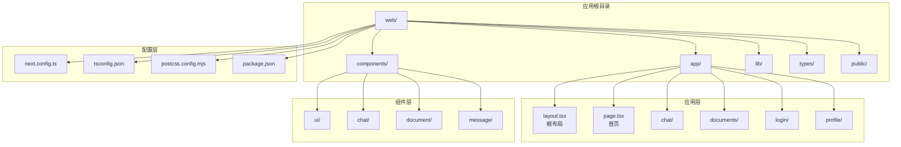
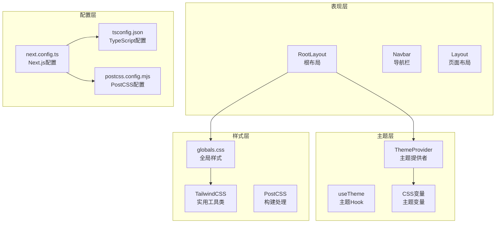
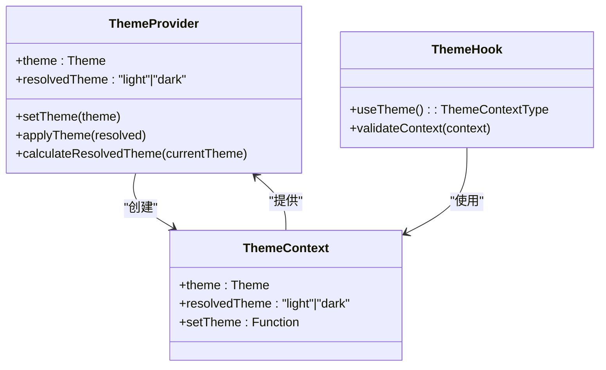
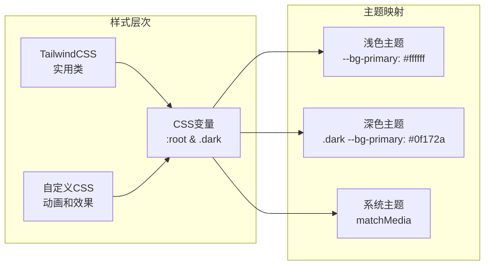
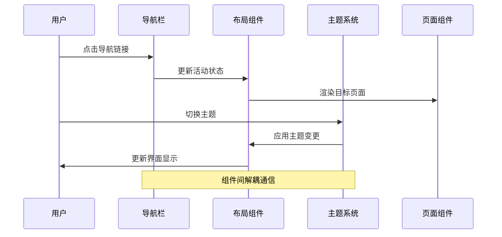
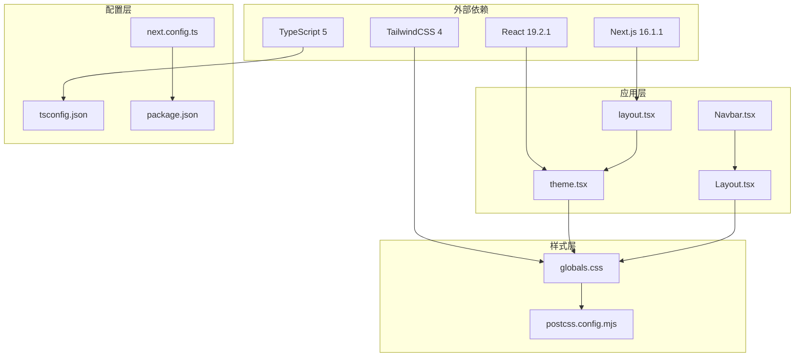
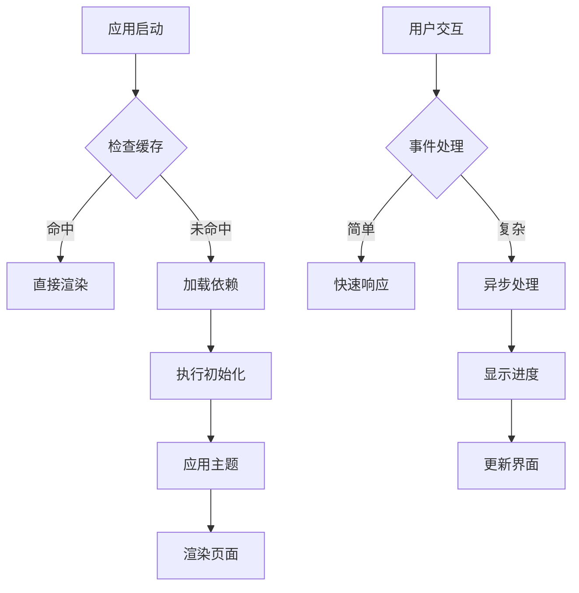

# Next.js应用架构

<cite>
**本文档引用的文件**
- [next.config.ts](file://web/next.config.ts)
- [tsconfig.json](file://web/tsconfig.json)
- [package.json](file://web/package.json)
- [layout.tsx](file://web/app/layout.tsx)
- [page.tsx](file://web/app/page.tsx)
- [Layout.tsx](file://web/components/ui/Layout.tsx)
- [Navbar.tsx](file://web/components/ui/Navbar.tsx)
- [globals.css](file://web/app/globals.css)
- [theme.tsx](file://web/lib/theme.tsx)
- [postcss.config.mjs](file://web/postcss.config.mjs)
- [Dockerfile](file://web/Dockerfile)
- [.dockerignore](file://web/.dockerignore)
</cite>

## 目录
1. [简介](#简介)
2. [项目结构](#项目结构)
3. [核心组件](#核心组件)
4. [架构概览](#架构概览)
5. [详细组件分析](#详细组件分析)
6. [依赖关系分析](#依赖关系分析)
7. [性能考虑](#性能考虑)
8. [故障排除指南](#故障排除指南)
9. [结论](#结论)
10. [附录](#附录)

## 简介

这是一个基于Next.js 16.1.1构建的高级RAG（Retrieval-Augmented Generation）系统前端应用。该应用采用App Router架构，实现了现代化的React应用开发模式，集成了TypeScript类型安全、TailwindCSS样式系统、主题切换功能和Docker容器化部署。

应用的核心功能包括智能对话助手、知识库检索、文档管理和用户交互界面。通过模块化的组件设计和清晰的路由结构，为用户提供流畅的AI增强学习体验。

## 项目结构

该项目采用标准的Next.js 13+ App Router目录结构，主要分为以下几个核心部分：



**图表来源**
- [layout.tsx:1-49](file://web/app/layout.tsx#L1-L49)
- [page.tsx:1-39](file://web/app/page.tsx#L1-L39)
- [package.json:1-40](file://web/package.json#L1-L40)

**章节来源**
- [layout.tsx:1-49](file://web/app/layout.tsx#L1-L49)
- [page.tsx:1-39](file://web/app/page.tsx#L1-L39)
- [package.json:1-40](file://web/package.json#L1-L40)

## 核心组件

### 应用根布局系统

应用采用单一根布局设计，通过`RootLayout`组件管理全局元数据、主题配置和页面结构。根布局集成了以下关键特性：

- **元数据管理**：统一的网站标题、描述和图标配置
- **主题系统**：支持浅色、深色和系统主题的动态切换
- **国际化支持**：多语言内容渲染支持
- **性能优化**：预加载脚本和客户端水合控制

### 导航栏系统

导航栏组件实现了响应式设计，支持桌面和移动设备的不同布局：

- **桌面端**：水平导航菜单，支持活动状态指示
- **移动端**：汉堡菜单，支持展开收起动画
- **交互功能**：侧边栏控制、菜单切换和状态同步

### 布局组件系统

布局组件提供了灵活的页面容器解决方案：

- **滚动控制**：支持允许滚动和禁止滚动两种模式
- **内边距管理**：响应式内边距配置
- **安全区域适配**：移动端安全区域兼容
- **主题过渡**：平滑的颜色和样式转换

**章节来源**
- [layout.tsx:1-49](file://web/app/layout.tsx#L1-L49)
- [Navbar.tsx:1-125](file://web/components/ui/Navbar.tsx#L1-L125)
- [Layout.tsx:1-61](file://web/components/ui/Layout.tsx#L1-L61)

## 架构概览

应用采用分层架构设计，各层职责明确，耦合度低：



**图表来源**
- [layout.tsx:1-49](file://web/app/layout.tsx#L1-L49)
- [theme.tsx:1-111](file://web/lib/theme.tsx#L1-L111)
- [globals.css:1-800](file://web/app/globals.css#L1-L800)
- [next.config.ts:1-48](file://web/next.config.ts#L1-L48)

## 详细组件分析

### 主题管理系统

主题系统是应用的核心特性之一，实现了完整的主题切换机制：



**图表来源**
- [theme.tsx:1-111](file://web/lib/theme.tsx#L1-L111)

主题系统的关键特性包括：

- **状态管理**：使用React Context管理全局主题状态
- **持久化存储**：localStorage保存用户偏好设置
- **系统检测**：自动检测操作系统主题偏好
- **实时更新**：支持主题变更的实时响应

**章节来源**
- [theme.tsx:1-111](file://web/lib/theme.tsx#L1-L111)
- [layout.tsx:1-49](file://web/app/layout.tsx#L1-L49)

### 样式系统架构

应用采用CSS变量驱动的主题系统，结合TailwindCSS实用工具类：



**图表来源**
- [globals.css:1-800](file://web/app/globals.css#L1-L800)

样式系统的优化特性：

- **变量驱动**：统一的颜色和间距变量管理
- **响应式设计**：移动端和桌面端的适配
- **动画优化**：硬件加速的CSS动画
- **可访问性**：颜色对比度和视觉层次

**章节来源**
- [globals.css:1-800](file://web/app/globals.css#L1-L800)
- [postcss.config.mjs:1-8](file://web/postcss.config.mjs#L1-L8)

### 路由系统设计

应用采用Next.js App Router的文件系统路由：

```mermaid
graph TD
subgraph "路由层次"
A[/] --> B[首页页面]
A --> C[聊天页面]
A --> D[文档页面]
A --> E[用户页面]
end
subgraph "页面组件"
B --> F[Home页面]
C --> G[Chat页面]
D --> H[Documents页面]
E --> I[Profile页面]
end
subgraph "动态路由"
D --> J[[id]参数]
E --> K[[id]参数]
L[Notifications] --> M[[id]参数]
end
```

**图表来源**
- [page.tsx:1-39](file://web/app/page.tsx#L1-L39)

路由系统的特点：

- **静态生成**：支持静态页面生成和动态路由
- **代码分割**：按需加载页面组件
- **SEO优化**：内置的搜索引擎友好性
- **类型安全**：TypeScript提供完整的路由类型检查

**章节来源**
- [page.tsx:1-39](file://web/app/page.tsx#L1-L39)

### 组件通信机制

应用实现了多种组件间通信模式：



**图表来源**
- [Navbar.tsx:1-125](file://web/components/ui/Navbar.tsx#L1-L125)
- [Layout.tsx:1-61](file://web/components/ui/Layout.tsx#L1-L61)
- [theme.tsx:1-111](file://web/lib/theme.tsx#L1-L111)

## 依赖关系分析

应用的依赖关系呈现清晰的单向依赖结构：



**图表来源**
- [package.json:1-40](file://web/package.json#L1-L40)
- [next.config.ts:1-48](file://web/next.config.ts#L1-L48)
- [tsconfig.json:1-35](file://web/tsconfig.json#L1-L35)

**章节来源**
- [package.json:1-40](file://web/package.json#L1-L40)
- [next.config.ts:1-48](file://web/next.config.ts#L1-L48)
- [tsconfig.json:1-35](file://web/tsconfig.json#L1-L35)

## 性能考虑

### 构建优化策略

应用采用了多项性能优化措施：

- **代码分割**：按需加载页面组件，减少初始包大小
- **静态资源优化**：自动优化图片和静态文件
- **缓存策略**：智能的浏览器缓存和CDN支持
- **Tree Shaking**：移除未使用的代码

### 运行时性能优化



**图表来源**
- [layout.tsx:1-49](file://web/app/layout.tsx#L1-L49)
- [page.tsx:1-39](file://web/app/page.tsx#L1-L39)

性能优化的具体实现：

- **水合优化**：控制客户端水合时机，避免不必要的重渲染
- **主题预加载**：在页面加载前确定主题，避免闪烁
- **滚动优化**：针对移动端滚动进行专门优化
- **动画性能**：使用transform和opacity属性实现硬件加速

## 故障排除指南

### 常见问题诊断

**主题切换问题**
- 检查localStorage是否正常工作
- 验证CSS变量是否正确应用
- 确认系统主题检测是否生效

**样式冲突问题**
- 检查TailwindCSS配置是否正确
- 验证CSS优先级顺序
- 确认PostCSS处理流程

**路由问题**
- 检查文件命名约定
- 验证动态路由参数
- 确认页面导出格式

### 开发工具使用

**调试技巧**
- 使用React DevTools检查组件树
- 利用浏览器开发者工具分析性能
- 通过网络面板监控资源加载

**构建问题排查**
- 检查TypeScript编译错误
- 验证Next.js配置正确性
- 确认依赖版本兼容性

**章节来源**
- [theme.tsx:1-111](file://web/lib/theme.tsx#L1-L111)
- [globals.css:1-800](file://web/app/globals.css#L1-L800)
- [next.config.ts:1-48](file://web/next.config.ts#L1-L48)

## 结论

该Next.js应用架构展现了现代React应用开发的最佳实践。通过合理的分层设计、类型安全的TypeScript配置、灵活的主题系统和优化的性能策略，为复杂的AI增强应用提供了坚实的技术基础。

应用的主要优势包括：

- **架构清晰**：层次分明的组件设计和明确的职责划分
- **用户体验**：流畅的主题切换、响应式布局和优化的交互体验
- **开发效率**：完善的TypeScript支持和现代化的构建工具链
- **可维护性**：模块化的代码组织和清晰的依赖关系

未来可以考虑的改进方向包括：进一步的代码分割优化、更完善的测试覆盖、以及更多的可访问性增强功能。

## 附录

### 配置文件详解

**Next.js配置**
- 支持Docker原生部署模式
- 配置API代理和重写规则
- 开发环境的按需加载优化

**TypeScript配置**
- 严格模式下的类型检查
- ES模块解析和增量编译
- 路径别名和类型插件支持

**构建配置**
- TailwindCSS集成和PostCSS处理
- 生产环境优化和代码压缩
- 静态资源处理和缓存策略

**章节来源**
- [next.config.ts:1-48](file://web/next.config.ts#L1-L48)
- [tsconfig.json:1-35](file://web/tsconfig.json#L1-L35)
- [postcss.config.mjs:1-8](file://web/postcss.config.mjs#L1-L8)

### 部署配置

**Docker部署**
- 多阶段构建优化
- 最小化镜像大小
- 环境变量配置和安全考虑

**生产优化**
- CDN集成和静态资源优化
- 缓存策略和性能监控
- 错误处理和日志记录

**章节来源**
- [Dockerfile:1-39](file://web/Dockerfile#L1-L39)
- [.dockerignore:1-49](file://web/.dockerignore#L1-L49)