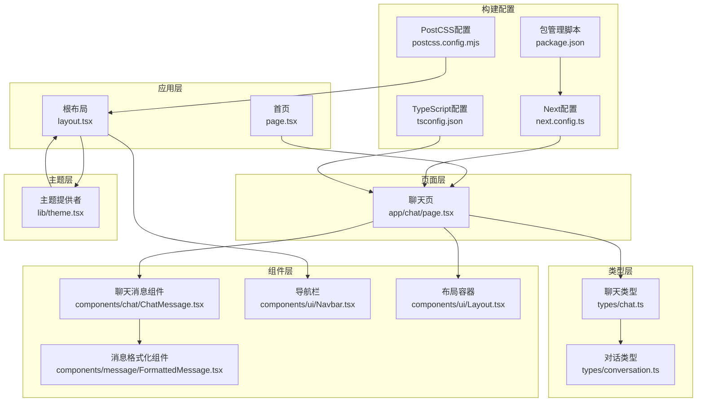
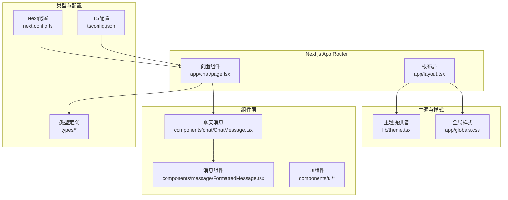
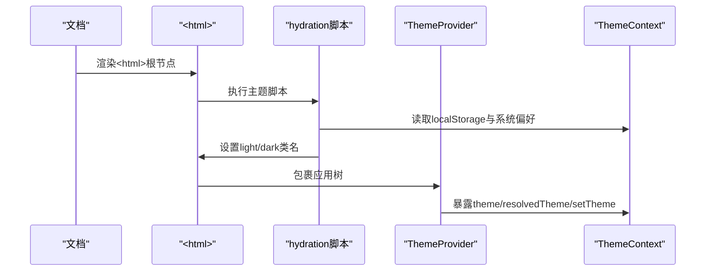
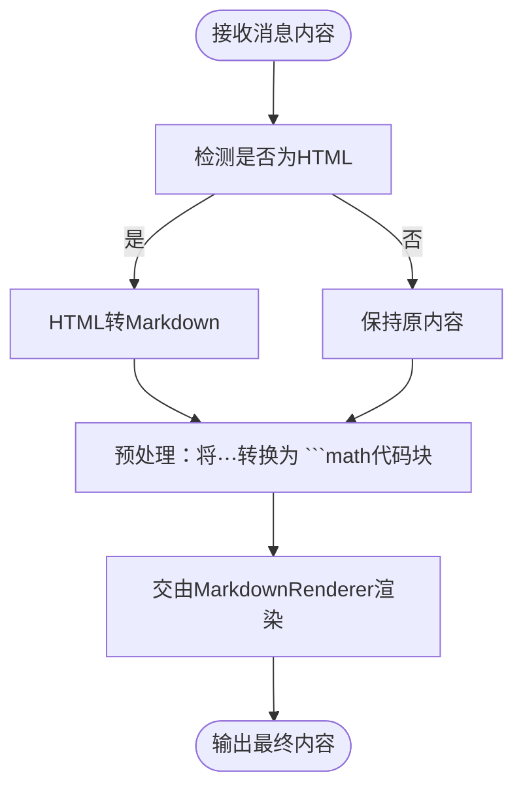
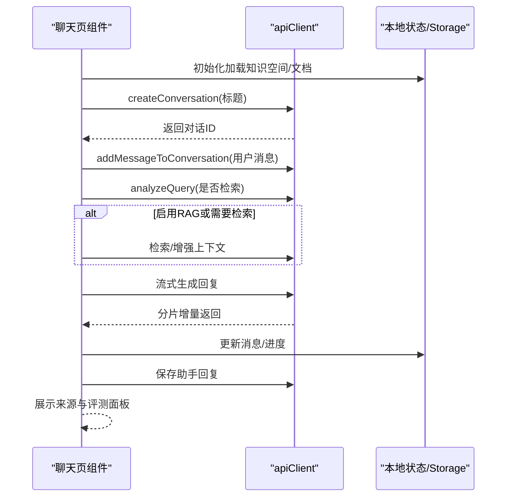
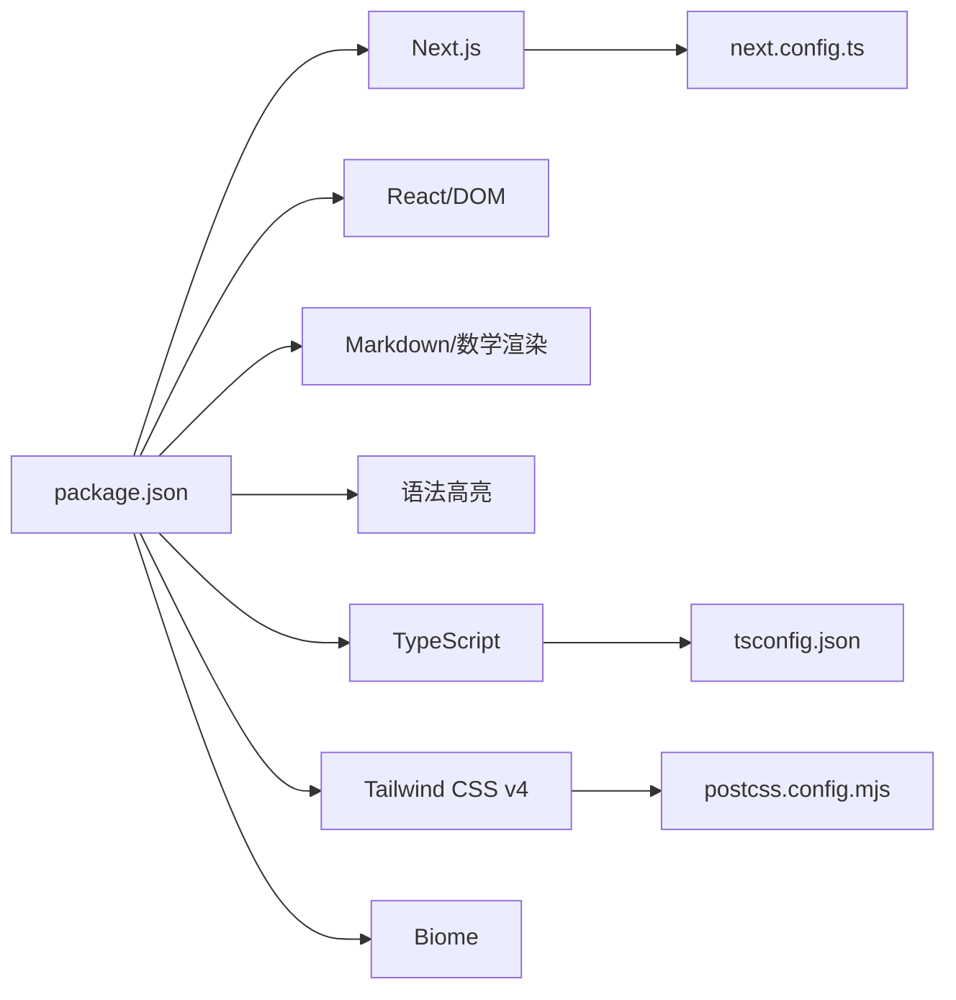

# 前端开发指南

<cite>
**本文引用的文件**
- [package.json](file://web/package.json)
- [next.config.ts](file://web/next.config.ts)
- [layout.tsx](file://web/app/layout.tsx)
- [page.tsx](file://web/app/page.tsx)
- [index.ts](file://web/components/index.ts)
- [chat.ts](file://web/types/chat.ts)
- [conversation.ts](file://web/types/conversation.ts)
- [theme.tsx](file://web/lib/theme.tsx)
- [ChatMessage.tsx](file://web/components/chat/ChatMessage.tsx)
- [FormattedMessage.tsx](file://web/components/message/FormattedMessage.tsx)
- [page.tsx](file://web/app/chat/page.tsx)
- [Navbar.tsx](file://web/components/ui/Navbar.tsx)
- [Layout.tsx](file://web/components/ui/Layout.tsx)
- [tsconfig.json](file://web/tsconfig.json)
- [postcss.config.mjs](file://web/postcss.config.mjs)
</cite>

## 目录
1. [简介](#简介)
2. [项目结构](#项目结构)
3. [核心组件](#核心组件)
4. [架构总览](#架构总览)
5. [详细组件分析](#详细组件分析)
6. [依赖分析](#依赖分析)
7. [性能考虑](#性能考虑)
8. [故障排查指南](#故障排查指南)
9. [结论](#结论)
10. [附录](#附录)

## 简介
本指南面向Advanced RAG前端开发者，围绕Next.js应用架构、App Router路由与布局、主题管理、React组件体系、状态管理与数据流、TypeScript类型安全、与后端API集成、性能优化与部署策略等方面进行系统化说明。文档同时提供可操作的最佳实践与可视化图示，帮助不同技术背景的读者快速上手并高质量交付。

## 项目结构
前端位于web目录，采用Next.js App Router组织页面与路由，使用Tailwind CSS v4进行样式工程化，并通过TypeScript保障类型安全。核心模块包括：
- 应用层：根布局、首页重定向、全局样式
- 页面层：聊天页、文档页等
- 组件层：聊天组件、消息渲染组件、UI通用组件
- 类型层：聊天、对话、资源等类型定义
- 主题层：主题提供者与系统主题感知
- 构建与配置：Next.js、PostCSS、Biome、TypeScript

图表来源
- [layout.tsx:1-49](file://web/app/layout.tsx#L1-L49)
- [page.tsx:1-39](file://web/app/page.tsx#L1-L39)
- [page.tsx:1-800](file://web/app/chat/page.tsx#L1-L800)
- [ChatMessage.tsx:1-182](file://web/components/chat/ChatMessage.tsx#L1-L182)
- [FormattedMessage.tsx:1-255](file://web/components/message/FormattedMessage.tsx#L1-L255)
- [Navbar.tsx:1-125](file://web/components/ui/Navbar.tsx#L1-L125)
- [Layout.tsx:1-61](file://web/components/ui/Layout.tsx#L1-L61)
- [chat.ts:1-99](file://web/types/chat.ts#L1-L99)
- [conversation.ts:1-10](file://web/types/conversation.ts#L1-L10)
- [theme.tsx:1-111](file://web/lib/theme.tsx#L1-L111)
- [next.config.ts:1-48](file://web/next.config.ts#L1-L48)
- [tsconfig.json:1-35](file://web/tsconfig.json#L1-L35)
- [postcss.config.mjs:1-8](file://web/postcss.config.mjs#L1-L8)
- [package.json:1-40](file://web/package.json#L1-L40)

章节来源
- [layout.tsx:1-49](file://web/app/layout.tsx#L1-L49)
- [page.tsx:1-39](file://web/app/page.tsx#L1-L39)
- [next.config.ts:1-48](file://web/next.config.ts#L1-L48)
- [tsconfig.json:1-35](file://web/tsconfig.json#L1-L35)
- [postcss.config.mjs:1-8](file://web/postcss.config.mjs#L1-L8)
- [package.json:1-40](file://web/package.json#L1-L40)

## 核心组件
- 主题系统：通过自定义Theme Provider实现“浅色/深色/跟随系统”三态切换，持久化至localStorage并在客户端即时应用。
- 布局系统：根布局负责注入主题脚本与全局样式，页面布局组件提供“允许滚动/禁止滚动”两种模式，适配聊天页的固定高度场景。
- 聊天组件：消息渲染组件负责Markdown、公式、代码块与HTML内容的统一处理；聊天消息组件支持编辑、重新生成、来源展示与RAG评测面板。
- 导航与路由：导航栏基于Next.js路由状态高亮当前页；首页负责初始化与自动跳转到聊天页。
- 类型系统：聊天消息、来源、推荐资源、对话等类型清晰定义，保障前后端契约一致。

章节来源
- [theme.tsx:1-111](file://web/lib/theme.tsx#L1-L111)
- [Layout.tsx:1-61](file://web/components/ui/Layout.tsx#L1-L61)
- [ChatMessage.tsx:1-182](file://web/components/chat/ChatMessage.tsx#L1-L182)
- [FormattedMessage.tsx:1-255](file://web/components/message/FormattedMessage.tsx#L1-L255)
- [Navbar.tsx:1-125](file://web/components/ui/Navbar.tsx#L1-L125)
- [page.tsx:1-39](file://web/app/page.tsx#L1-L39)
- [chat.ts:1-99](file://web/types/chat.ts#L1-L99)
- [conversation.ts:1-10](file://web/types/conversation.ts#L1-L10)

## 架构总览
前端采用“页面驱动”的App Router架构，页面组件集中处理业务流程（初始化、状态管理、API调用、流式渲染），组件层专注于UI与交互细节。主题系统贯穿全局，路由与布局组件提供一致的导航体验。

图表来源
- [page.tsx:1-800](file://web/app/chat/page.tsx#L1-L800)
- [layout.tsx:1-49](file://web/app/layout.tsx#L1-L49)
- [theme.tsx:1-111](file://web/lib/theme.tsx#L1-L111)
- [FormattedMessage.tsx:1-255](file://web/components/message/FormattedMessage.tsx#L1-L255)
- [ChatMessage.tsx:1-182](file://web/components/chat/ChatMessage.tsx#L1-L182)
- [chat.ts:1-99](file://web/types/chat.ts#L1-L99)
- [next.config.ts:1-48](file://web/next.config.ts#L1-L48)
- [tsconfig.json:1-35](file://web/tsconfig.json#L1-L35)

## 详细组件分析

### 主题系统与布局
- 主题提供者：支持“light/dark/system”，计算resolved主题并应用到<html>根节点，监听系统主题变化，持久化用户选择。
- 根布局：注入hydration兼容脚本，确保首屏主题正确；包裹ThemeProvider，保证主题在所有子组件可用。
- 页面布局：提供“允许滚动/禁止滚动”两种模式，聊天页使用固定高度布局，其他页面可自然滚动。

图表来源
- [layout.tsx:22-47](file://web/app/layout.tsx#L22-L47)
- [theme.tsx:15-101](file://web/lib/theme.tsx#L15-L101)

章节来源
- [theme.tsx:1-111](file://web/lib/theme.tsx#L1-L111)
- [layout.tsx:1-49](file://web/app/layout.tsx#L1-L49)
- [Layout.tsx:1-61](file://web/components/ui/Layout.tsx#L1-L61)

### 聊天消息组件与消息格式化
- ChatMessage：根据角色渲染气泡、头像、时间戳、来源清单与RAG评测面板；支持用户侧的编辑与重新生成回调。
- FormattedMessage：统一处理HTML/Markdown/公式混合内容，将块级公式转换为代码块以便渲染器识别，注入响应式样式与MathJax优化样式。

图表来源
- [FormattedMessage.tsx](file://web/components/message/FormattedMessage.tsx#L105-L254)

章节来源
- [ChatMessage.tsx](file://web/components/chat/ChatMessage.tsx#L1-L182)
- [FormattedMessage.tsx](file://web/components/message/FormattedMessage.tsx#L1-L255)

### 聊天页面：状态管理与数据流
- 状态域：消息列表、输入框、加载状态、对话ID、文档与知识空间、模型配置、流式生成控制、上传与轮询状态、Agent状态与深度研究结果、Toast提示等。
- 生命周期：初始化阶段加载知识空间与文档；自动滚动到底部；状态持久化到localStorage并在必要时恢复；支持中断生成。
- 数据流：用户输入 -> 创建/获取对话 -> 保存用户消息 -> 查询分析/检索 -> 生成回复 -> 保存助手回复 -> 展示来源与评测指标。
- 错误处理：对API失败进行降级（返回空列表）、轮询异常重试、失败消息注入到消息流。

图表来源
- [page.tsx](file://web/app/chat/page.tsx#L680-L800)
- [page.tsx](file://web/app/chat/page.tsx#L193-L240)
- [page.tsx](file://web/app/chat/page.tsx#L242-L327)
- [page.tsx](file://web/app/chat/page.tsx#L330-L421)

章节来源
- [page.tsx](file://web/app/chat/page.tsx#L1-L800)
- [chat.ts](file://web/types/chat.ts#L1-L99)
- [conversation.ts](file://web/types/conversation.ts#L1-L10)

### 导航与路由
- 导航栏：基于usePathname高亮当前页签；移动端展开菜单；在聊天页提供打开侧边栏的事件派发。
- 首页：初始化步骤与自动跳转到聊天页，期间展示加载进度。

章节来源
- [Navbar.tsx](file://web/components/ui/Navbar.tsx#L1-L125)
- [page.tsx](file://web/app/page.tsx#L1-L39)

### 组件导出索引与复用策略
- 统一导出入口：通过components/index.ts聚合消息、聊天、文档、UI组件，便于按需引入与避免路径污染。
- 设计模式：组件职责单一、通过props解耦、使用memo提升渲染性能；UI组件提供可配置的外观与行为。

章节来源
- [index.ts](file://web/components/index.ts#L1-L31)

## 依赖分析
- 运行时依赖：Next.js、React、React DOM、Markdown渲染与数学公式支持库、语法高亮等。
- 开发依赖：Biome（代码质量）、Tailwind CSS v4、TypeScript及相关类型声明。
- 构建配置：Next.js启用standalone输出、开发热更新参数、API代理规则；TypeScript严格模式与路径别名；PostCSS集成Tailwind。

图表来源
- [package.json:1-40](file://web/package.json#L1-L40)
- [next.config.ts:1-48](file://web/next.config.ts#L1-L48)
- [tsconfig.json:1-35](file://web/tsconfig.json#L1-L35)
- [postcss.config.mjs:1-8](file://web/postcss.config.mjs#L1-L8)

章节来源
- [package.json:1-40](file://web/package.json#L1-L40)
- [next.config.ts:1-48](file://web/next.config.ts#L1-L48)
- [tsconfig.json:1-35](file://web/tsconfig.json#L1-L35)
- [postcss.config.mjs:1-8](file://web/postcss.config.mjs#L1-L8)

## 性能考虑
- 渲染优化
  - 使用React.memo包裹重型组件（如聊天消息），减少不必要的重渲染。
  - 智能滚动：仅在靠近底部或流式输出时滚动，避免频繁滚动造成抖动。
  - 自动节流：流式更新采用节流与定时器，合并短间隔更新。
- 状态持久化
  - 仅在5分钟内且处于流式生成时恢复状态，避免无效恢复。
  - 关键状态定期保存，页面隐藏/卸载前保存，提升可用性。
- 网络与I/O
  - API代理：开发环境默认代理到本地后端，生产环境支持相对路径由反向代理处理。
  - 上传轮询：文件处理状态轮询，完成后清理定时器，避免内存泄漏。
- 样式与资源
  - Tailwind按需生成，避免无用样式；数学公式样式局部作用域，减少全局污染。
  - 图标与图片使用响应式尺寸，移动端优化字体与行高。

章节来源
- [ChatMessage.tsx:179-182](file://web/components/chat/ChatMessage.tsx#L179-L182)
- [page.tsx:550-601](file://web/app/chat/page.tsx#L550-L601)
- [page.tsx:422-529](file://web/app/chat/page.tsx#L422-L529)
- [page.tsx:328-351](file://web/app/chat/page.tsx#L328-L351)
- [next.config.ts:13-34](file://web/next.config.ts#L13-L34)
- [FormattedMessage.tsx:165-254](file://web/components/message/FormattedMessage.tsx#L165-L254)

## 故障排查指南
- 主题不生效
  - 检查根布局是否包裹ThemeProvider；确认hydration脚本执行；验证localStorage与系统主题偏好。
- 聊天页面空白或无法滚动
  - 确认Layout组件的allowScroll参数；检查容器高度与overflow属性；确保消息容器引用有效。
- API请求失败
  - 查看代理配置是否正确；确认NEXT_PUBLIC_API_URL；观察控制台错误与Toast提示。
- 流式生成卡顿或中断
  - 检查AbortController是否被正确复用与释放；确认轮询定时器清理；查看pendingContent与isStreaming状态。
- TypeScript编译错误
  - 校验tsconfig严格模式与路径别名；确认类型定义与接口一致性。

章节来源
- [layout.tsx:22-47](file://web/app/layout.tsx#L22-L47)
- [Layout.tsx:1-61](file://web/components/ui/Layout.tsx#L1-L61)
- [theme.tsx:46-95](file://web/lib/theme.tsx#L46-L95)
- [page.tsx:645-663](file://web/app/chat/page.tsx#L645-L663)
- [next.config.ts:13-34](file://web/next.config.ts#L13-L34)
- [tsconfig.json:1-35](file://web/tsconfig.json#L1-L35)

## 结论
本指南从架构、组件、类型、状态、主题、路由与构建配置等维度梳理了Advanced RAG前端的关键实现。通过明确的职责划分、严格的类型约束与完善的性能策略，前端可在复杂对话与RAG场景下保持稳定与高效。建议在后续迭代中持续完善组件测试、埋点监控与可访问性（a11y）覆盖。

## 附录
- 最佳实践清单
  - 组件设计：单一职责、可组合、可配置；使用memo与key优化渲染。
  - 样式定制：基于Tailwind原子化类名；局部作用域样式；响应式断点明确。
  - 无障碍：为交互元素提供aria-label与键盘可达性；颜色对比度符合WCAG。
  - 与后端集成：统一API客户端封装；错误降级与重试策略；流式数据的节流与合并。
  - 性能：懒加载非关键资源；合理拆分组件；利用Next.js静态优化与增量构建。
  - 部署：standalone输出；反向代理配置；健康检查与日志采集。