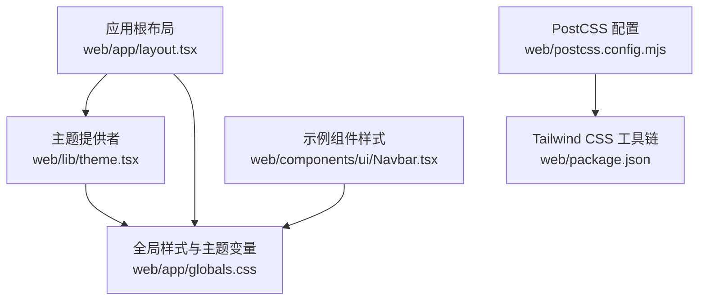
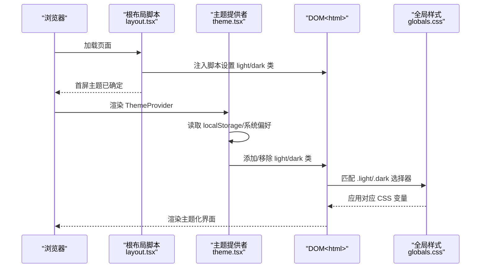
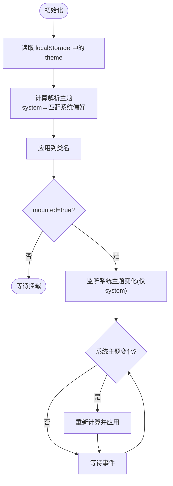
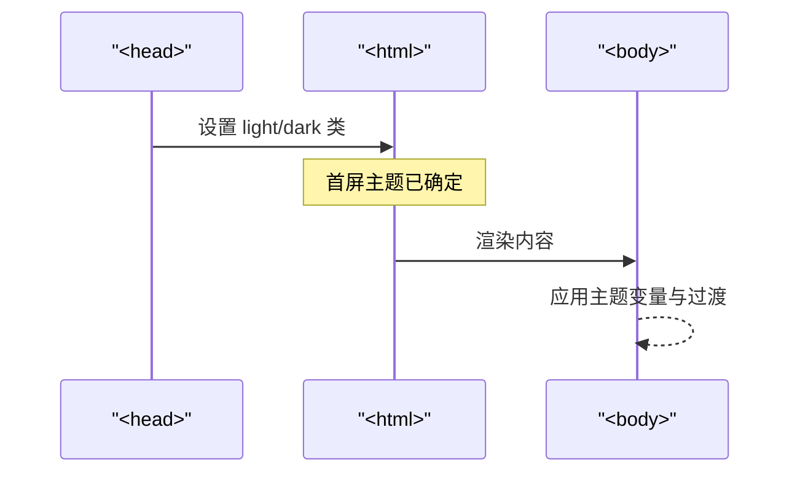
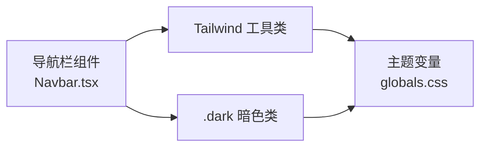
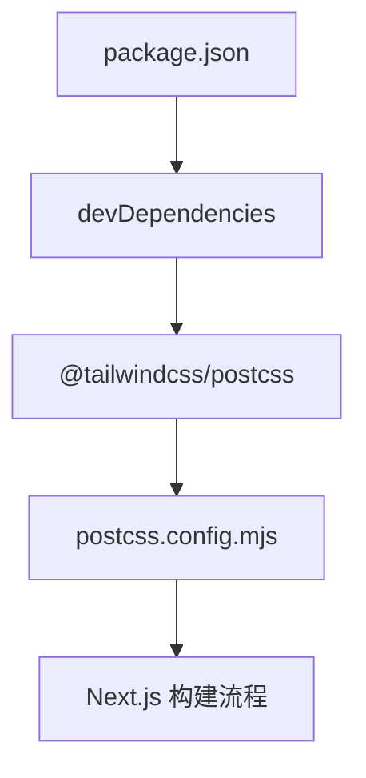
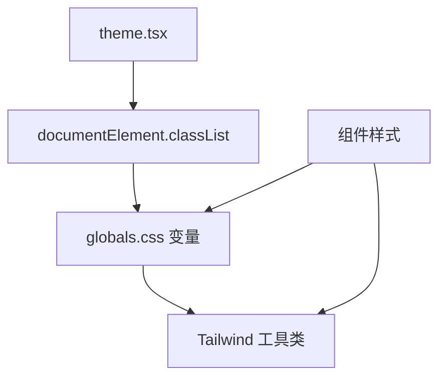

# 样式与主题系统

<cite>
**本文引用的文件**
- [web/app/globals.css](file://web/app/globals.css)
- [web/lib/theme.tsx](file://web/lib/theme.tsx)
- [web/app/layout.tsx](file://web/app/layout.tsx)
- [web/postcss.config.mjs](file://web/postcss.config.mjs)
- [web/package.json](file://web/package.json)
- [web/components/ui/Navbar.tsx](file://web/components/ui/Navbar.tsx)
</cite>

## 目录
1. [引言](#引言)
2. [项目结构](#项目结构)
3. [核心组件](#核心组件)
4. [架构总览](#架构总览)
5. [详细组件分析](#详细组件分析)
6. [依赖关系分析](#依赖关系分析)
7. [性能考量](#性能考量)
8. [故障排查指南](#故障排查指南)
9. [结论](#结论)
10. [附录](#附录)

## 引言
本设计文档聚焦 Advanced RAG 的样式与主题系统，围绕 Tailwind CSS 配置与使用、自定义主题与颜色体系、CSS 模块化策略、主题切换机制（明/暗/跟随系统）、PostCSS 构建优化、组件样式设计指南以及响应式设计最佳实践进行系统化阐述。目标是帮助开发者与设计师在理解现有实现的基础上，高效扩展与维护样式体系。

## 项目结构
样式与主题相关的关键文件分布如下：
- 全局样式与主题变量：web/app/globals.css
- 主题上下文与切换逻辑：web/lib/theme.tsx
- 应用根布局与主题初始化脚本：web/app/layout.tsx
- PostCSS 配置：web/postcss.config.mjs
- 依赖与工具链：web/package.json
- 示例组件样式（导航栏）：web/components/ui/Navbar.tsx



**图表来源**
- [web/app/layout.tsx:16-48](file://web/app/layout.tsx#L16-L48)
- [web/lib/theme.tsx:15-102](file://web/lib/theme.tsx#L15-L102)
- [web/app/globals.css:117-122](file://web/app/globals.css#L117-L122)
- [web/postcss.config.mjs:1-8](file://web/postcss.config.mjs#L1-L8)
- [web/package.json:27-35](file://web/package.json#L27-L35)
- [web/components/ui/Navbar.tsx:14-16](file://web/components/ui/Navbar.tsx#L14-L16)

**章节来源**
- [web/app/globals.css:1-122](file://web/app/globals.css#L1-L122)
- [web/lib/theme.tsx:15-102](file://web/lib/theme.tsx#L15-L102)
- [web/app/layout.tsx:16-48](file://web/app/layout.tsx#L16-L48)
- [web/postcss.config.mjs:1-8](file://web/postcss.config.mjs#L1-L8)
- [web/package.json:27-35](file://web/package.json#L27-L35)
- [web/components/ui/Navbar.tsx:14-16](file://web/components/ui/Navbar.tsx#L14-L16)

## 核心组件
- 主题上下文与切换逻辑：通过 React Context 提供 theme/resolvedTheme/setTheme，支持 light/dark/system 三种模式，持久化至 localStorage，并监听系统主题变化。
- 全局样式与主题变量：以 CSS 自定义属性为核心，定义主题主色、背景、文字、边框、阴影等变量；同时提供浅色/深色两套映射，并通过类选择器 .light/.dark/.dark 控制切换。
- 应用根布局：在 html 上注入脚本，启动时根据 localStorage 或系统偏好解析并应用主题类，避免首屏闪烁。
- 组件样式示例：导航栏组件使用 Tailwind 类名与深色类名组合，体现主题变量的复用与一致性。

**章节来源**
- [web/lib/theme.tsx:5-110](file://web/lib/theme.tsx#L5-L110)
- [web/app/globals.css:3-115](file://web/app/globals.css#L3-L115)
- [web/app/layout.tsx:24-38](file://web/app/layout.tsx#L24-L38)
- [web/components/ui/Navbar.tsx:14-16](file://web/components/ui/Navbar.tsx#L14-L16)

## 架构总览
整体架构围绕“主题上下文 → DOM 类名 → CSS 变量 → 组件样式”的链路展开。初始化阶段通过根布局脚本与主题提供者共同作用，确保首屏主题正确；运行期通过用户操作或系统变化更新 DOM 类名，从而驱动 CSS 变量生效。



**图表来源**
- [web/app/layout.tsx:24-38](file://web/app/layout.tsx#L24-L38)
- [web/lib/theme.tsx:46-90](file://web/lib/theme.tsx#L46-L90)
- [web/app/globals.css:42-77](file://web/app/globals.css#L42-L77)

## 详细组件分析

### 主题上下文与切换机制
- 支持模式：light、dark、system（跟随系统）
- 状态管理：React useState 管理当前模式与解析后的 light/dark，useEffect 处理初始化与变更监听
- DOM 应用：通过 documentElement.classList 切换 light/dark 类
- 持久化：localStorage 存储用户选择，避免每次刷新重置
- 系统监听：当模式为 system 时，监听 prefers-color-scheme 媒体查询变化并即时切换



**图表来源**
- [web/lib/theme.tsx:46-90](file://web/lib/theme.tsx#L46-L90)

**章节来源**
- [web/lib/theme.tsx:15-102](file://web/lib/theme.tsx#L15-L102)

### 全局样式与主题变量
- 变量定义：以 CSS 自定义属性形式集中定义主题主色、背景、文字、边框、阴影等
- 主题映射：:root 定义浅色默认值；.dark 定义深色覆盖；.light 显式保证一致性
- 主题变量绑定：@theme 将 CSS 变量映射为 Tailwind 内置变量，使原生 Tailwind 工具类可直接使用
- 代码高亮与滚动条：针对代码块与全局滚动条提供主题化样式
- 动画与过渡：统一的动画与过渡时长，提升交互体验
- 物理学内容专项：针对公式渲染（MathJax/KaTeX）提供深色优化

```mermaid
classDiagram
class ThemeVars {
"+主题主色系列"
"+背景色系列"
"+文字色系列"
"+边框色系列"
"+阴影系列"
}
class LightMap {
"+ : root 默认值"
}
class DarkMap {
"+.dark 覆盖值"
}
class LightClass {
"+.light 显式映射"
}
class ThemeBinding {
"+@theme 绑定为 Tailwind 变量"
}
ThemeVars <.. LightMap : "默认"
ThemeVars <.. DarkMap : "覆盖"
ThemeVars <.. LightClass : "显式"
ThemeVars --> ThemeBinding : "被绑定"
```

**图表来源**
- [web/app/globals.css:3-115](file://web/app/globals.css#L3-L115)
- [web/app/globals.css:117-122](file://web/app/globals.css#L117-L122)

**章节来源**
- [web/app/globals.css:1-800](file://web/app/globals.css#L1-L800)

### 根布局初始化与 Hydration
- 首屏脚本：在 head 中注入脚本，优先根据 localStorage 或系统偏好设置 html 类，避免水合前后闪烁
- Hydration 安全：suppressHydrationWarning 降低初次渲染差异带来的警告
- 字体与基础：body 使用主题变量作为背景与文字色，统一过渡动画



**图表来源**
- [web/app/layout.tsx:24-38](file://web/app/layout.tsx#L24-L38)
- [web/app/layout.tsx:41](file://web/app/layout.tsx#L41)

**章节来源**
- [web/app/layout.tsx:16-48](file://web/app/layout.tsx#L16-L48)

### 组件样式设计示例（导航栏）
- 使用 Tailwind 工具类与暗色类组合，确保在不同主题下保持一致的视觉与交互
- 移动端与桌面端差异化：在小屏隐藏桌面导航，使用汉堡菜单并配合过渡动画
- 交互细节：悬停、激活状态的颜色与背景随主题变量变化



**图表来源**
- [web/components/ui/Navbar.tsx:14-16](file://web/components/ui/Navbar.tsx#L14-L16)
- [web/app/globals.css:42-77](file://web/app/globals.css#L42-L77)

**章节来源**
- [web/components/ui/Navbar.tsx:14-16](file://web/components/ui/Navbar.tsx#L14-L16)

### PostCSS 与构建优化
- PostCSS 插件：通过 @tailwindcss/postcss 集成 Tailwind CSS v4
- 依赖声明：tailwindcss 与 @tailwindcss/postcss 位于 devDependencies
- 构建流程：Next.js 调用 PostCSS 处理样式，生成最终 CSS



**图表来源**
- [web/package.json:27-35](file://web/package.json#L27-L35)
- [web/postcss.config.mjs:1-8](file://web/postcss.config.mjs#L1-L8)

**章节来源**
- [web/package.json:27-35](file://web/package.json#L27-L35)
- [web/postcss.config.mjs:1-8](file://web/postcss.config.mjs#L1-L8)

## 依赖关系分析
- 主题提供者依赖浏览器媒体查询与 localStorage，确保跨会话与系统偏好的一致性
- 全局样式依赖 CSS 变量与 @theme 绑定，使 Tailwind 工具类与主题变量协同工作
- 组件样式依赖全局主题类（.light/.dark），形成统一的样式隔离与主题切换



**图表来源**
- [web/lib/theme.tsx:37-43](file://web/lib/theme.tsx#L37-L43)
- [web/app/globals.css:117-122](file://web/app/globals.css#L117-L122)
- [web/components/ui/Navbar.tsx:14-16](file://web/components/ui/Navbar.tsx#L14-L16)

**章节来源**
- [web/lib/theme.tsx:37-43](file://web/lib/theme.tsx#L37-L43)
- [web/app/globals.css:117-122](file://web/app/globals.css#L117-L122)
- [web/components/ui/Navbar.tsx:14-16](file://web/components/ui/Navbar.tsx#L14-L16)

## 性能考量
- 首屏主题：通过根布局脚本在 SSR 阶段设置主题类，减少水合闪烁与重绘
- 变量驱动：CSS 变量与 @theme 绑定减少重复样式，降低 CSS 体积
- 过渡优化：统一的 transition 时长与缓动函数，避免过度动画影响性能
- 移动端优化：针对触摸滚动与点击反馈进行针对性样式优化，提升交互流畅度

[本节为通用指导，无需特定文件引用]

## 故障排查指南
- 主题未生效
  - 检查 html 是否存在 light/dark 类（由根布局脚本与主题提供者共同决定）
  - 确认 localStorage 中的 theme 值是否为合法枚举
  - 排查 @theme 绑定是否正确，Tailwind 工具类是否使用了主题变量
- 水合闪烁
  - 确认根布局脚本已在 head 中执行
  - 检查 suppressHydrationWarning 的使用范围
- 系统主题切换无效
  - 确认主题提供者处于 system 模式
  - 检查媒体查询监听是否正常注册与注销
- 深色模式下公式渲染异常
  - 检查 .dark 下的公式样式覆盖是否生效
  - 确认 MathJax/KaTeX 的深色适配规则未被其他样式覆盖

**章节来源**
- [web/app/layout.tsx:24-38](file://web/app/layout.tsx#L24-L38)
- [web/lib/theme.tsx:71-89](file://web/lib/theme.tsx#L71-L89)
- [web/app/globals.css:340-431](file://web/app/globals.css#L340-L431)

## 结论
该样式与主题系统以 CSS 变量为核心，结合 Tailwind CSS 与 @theme 绑定，实现了统一、可维护的主题体系。通过主题提供者与根布局脚本的协作，确保首屏主题稳定与跨会话持久化。组件层采用 Tailwind 工具类与暗色类组合，实现主题变量的自然复用与隔离。PostCSS 集成 Tailwind v4，为构建优化与浏览器兼容提供基础。建议在后续迭代中持续完善动画与过渡的一致性，补充更多组件的深色适配，并对移动端交互细节进行进一步打磨。

[本节为总结性内容，无需特定文件引用]

## 附录

### CSS 模块化策略与命名规范
- 样式组织
  - 全局样式集中于 app/globals.css，按功能域拆分（主题变量、动画、组件专项样式）
  - 组件样式在各自组件文件内，优先使用 Tailwind 工具类与暗色类组合
- 命名规范
  - 使用语义化类名，如 .chat-bubble、.derivation-step、.notification-unread
  - 暗色适配统一添加 .dark 前缀或在 .dark 中覆盖
- 样式隔离
  - 通过 .dark 与组件局部类名组合，避免全局污染
  - 使用 CSS 变量与 @theme 绑定，减少重复定义

**章节来源**
- [web/app/globals.css:280-308](file://web/app/globals.css#L280-L308)
- [web/components/ui/Navbar.tsx:14-16](file://web/components/ui/Navbar.tsx#L14-L16)

### 主题变量使用与动画效果
- 主题变量使用
  - 在组件与全局样式中统一使用 var(--变量名)，确保随主题自动切换
  - 通过 @theme 将变量映射为 Tailwind 内置变量，便于工具类直接使用
- 动画效果
  - 统一定义动画名称与时序，如 fadeIn、zoomIn、slideIn、thinking-dot 等
  - 在组件中通过类名引用动画，保持交互一致性

**章节来源**
- [web/app/globals.css:117-122](file://web/app/globals.css#L117-L122)
- [web/app/globals.css:233-274](file://web/app/globals.css#L233-L274)
- [web/app/globals.css:520-533](file://web/app/globals.css#L520-L533)

### 响应式设计最佳实践
- 断点与适配
  - 使用 Tailwind 断点（sm、md、lg）控制布局与间距
  - 针对移动端进行触摸优化（点击区域、滚动性能、安全区域）
- 触摸交互优化
  - 为按钮与链接设置合适的最小点击尺寸
  - 使用 -webkit-overflow-scrolling: touch 提升滚动体验

**章节来源**
- [web/app/globals.css:661-678](file://web/app/globals.css#L661-L678)
- [web/components/ui/Navbar.tsx:67-90](file://web/components/ui/Navbar.tsx#L67-L90)