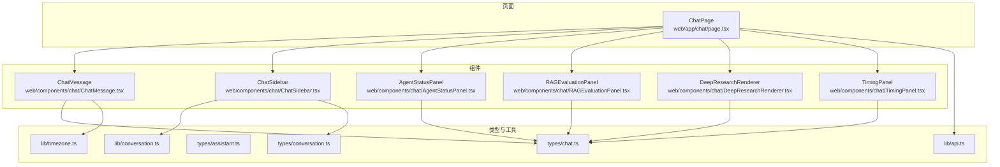
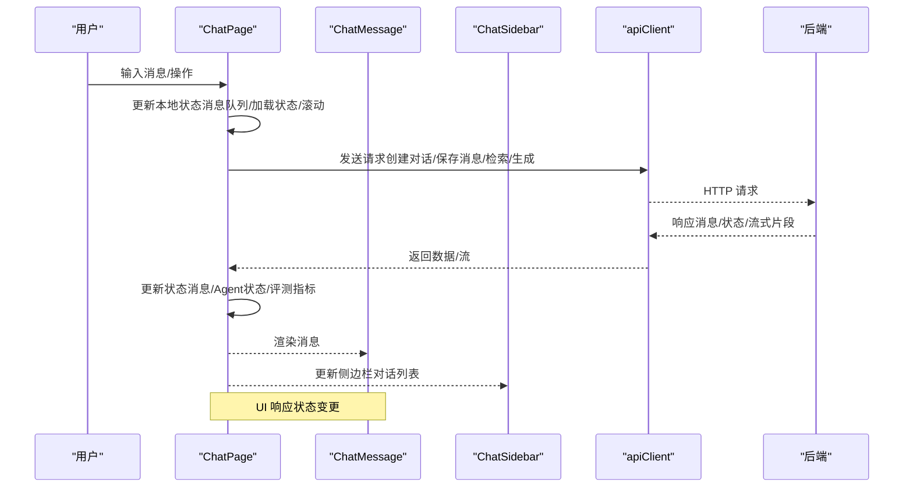
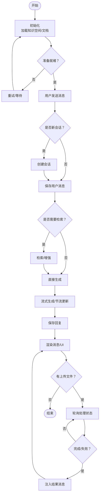
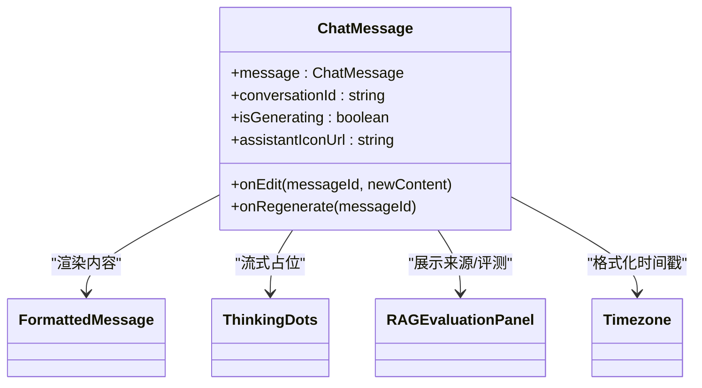
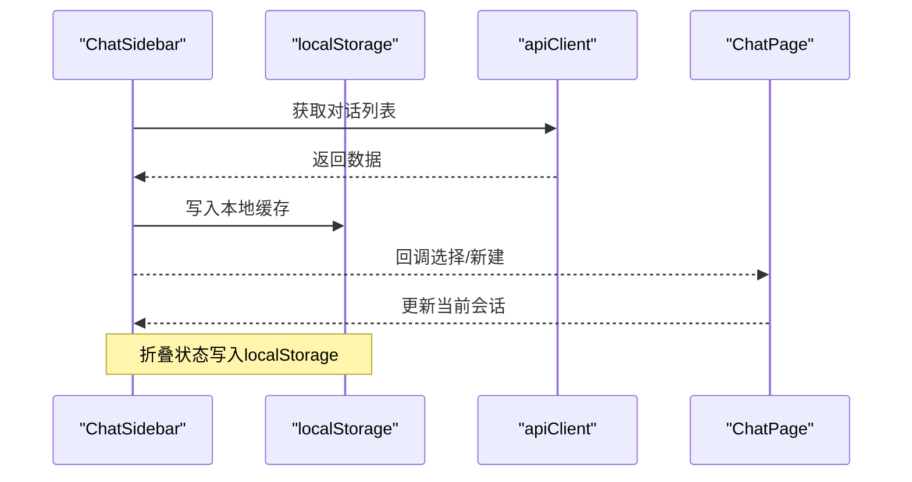
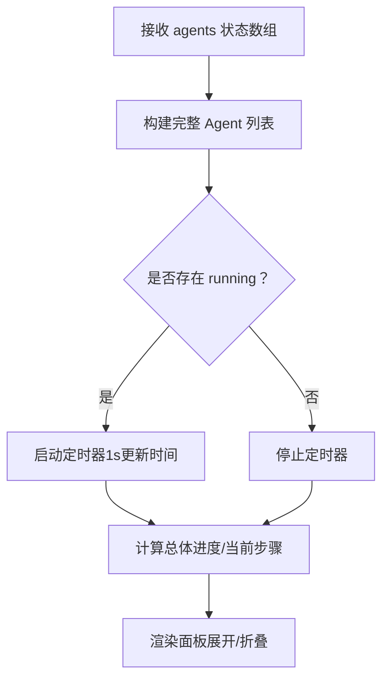
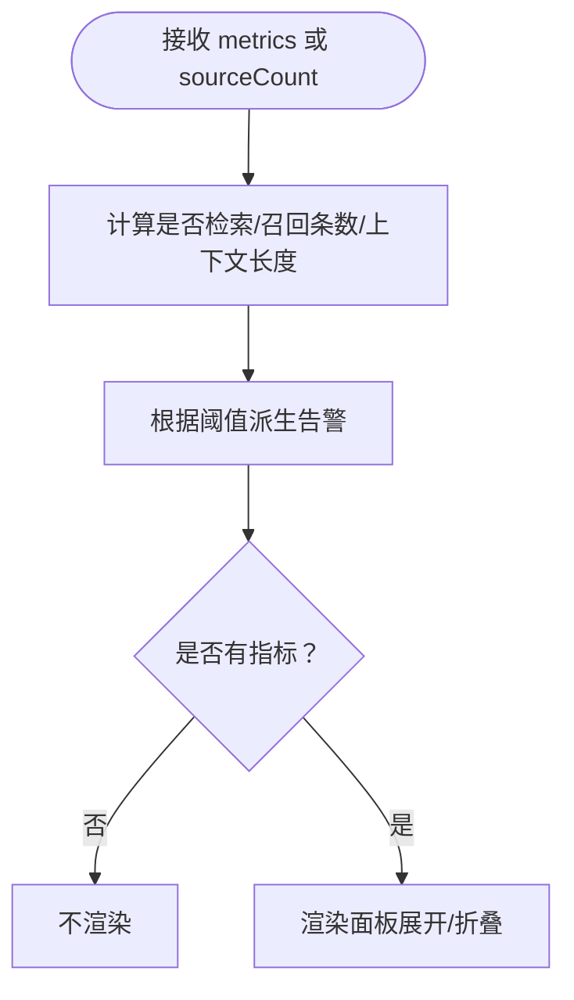
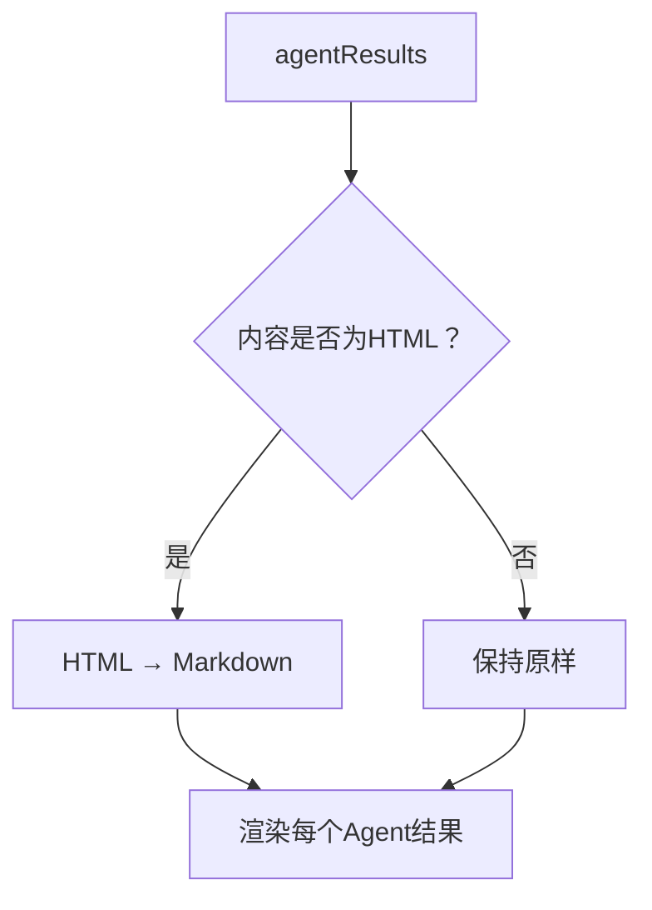
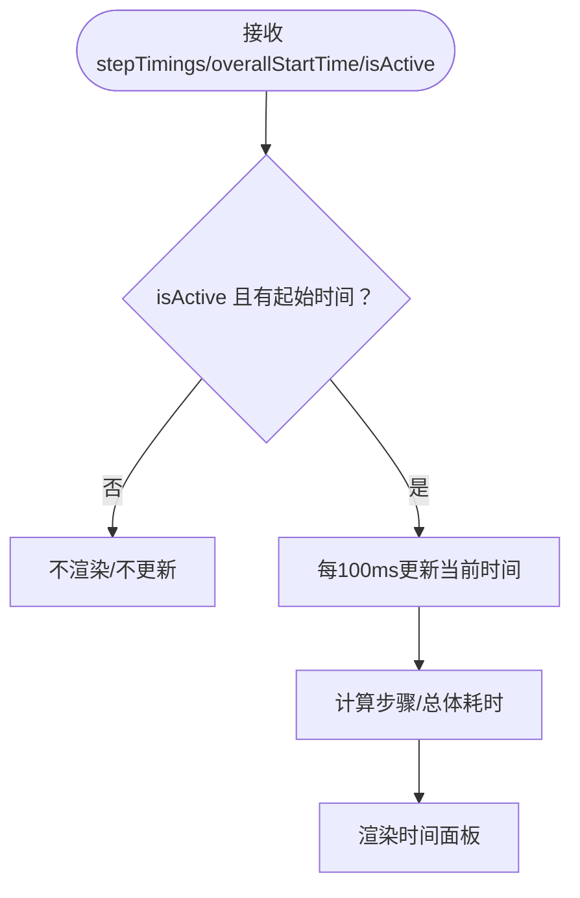
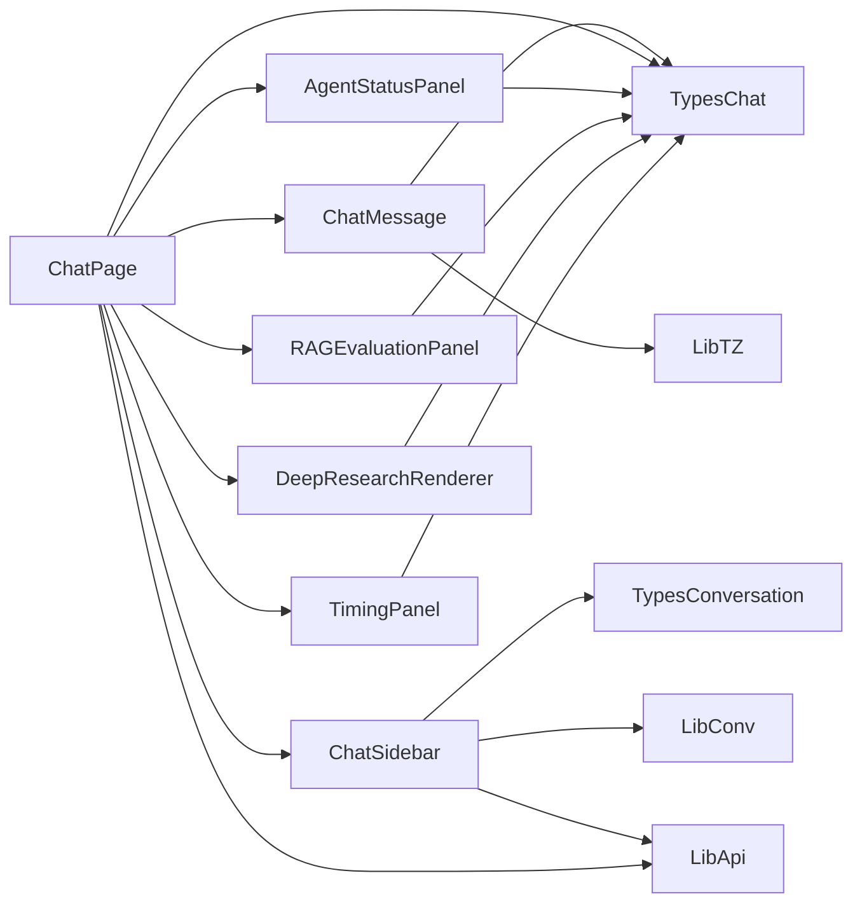

# 状态管理与数据流

<cite>
**本文引用的文件**
- [web/app/chat/page.tsx](file://web/app/chat/page.tsx)
- [web/components/chat/ChatMessage.tsx](file://web/components/chat/ChatMessage.tsx)
- [web/components/chat/ChatSidebar.tsx](file://web/components/chat/ChatSidebar.tsx)
- [web/components/chat/AgentStatusPanel.tsx](file://web/components/chat/AgentStatusPanel.tsx)
- [web/components/chat/RAGEvaluationPanel.tsx](file://web/components/chat/RAGEvaluationPanel.tsx)
- [web/components/chat/DeepResearchRenderer.tsx](file://web/components/chat/DeepResearchRenderer.tsx)
- [web/components/chat/TimingPanel.tsx](file://web/components/chat/TimingPanel.tsx)
- [web/lib/api.ts](file://web/lib/api.ts)
- [web/lib/conversation.ts](file://web/lib/conversation.ts)
- [web/types/chat.ts](file://web/types/chat.ts)
- [web/types/conversation.ts](file://web/types/conversation.ts)
- [web/types/assistant.ts](file://web/types/assistant.ts)
- [web/lib/timezone.ts](file://web/lib/timezone.ts)
</cite>

## 目录
1. [引言](#引言)
2. [项目结构](#项目结构)
3. [核心组件](#核心组件)
4. [架构总览](#架构总览)
5. [详细组件分析](#详细组件分析)
6. [依赖关系分析](#依赖关系分析)
7. [性能考量](#性能考量)
8. [故障排查指南](#故障排查指南)
9. [结论](#结论)
10. [附录](#附录)

## 引言
本技术文档聚焦 Advanced RAG 的前端状态管理与数据流，围绕 React 状态管理模式（本地状态、全局状态设计、状态提升）、对话状态管理（消息队列、会话历史、实时更新）、数据流架构（API 获取、状态更新、UI 渲染）、WebSocket 连接管理（实时通信、消息订阅、连接状态处理）、类型安全实践（TypeScript 类型定义、接口规范、类型推断）、状态持久化与缓存策略、性能优化技巧以及错误处理与异常恢复机制进行系统化梳理。

## 项目结构
前端采用 Next.js App Router 架构，聊天页面位于 web/app/chat/page.tsx，配套组件位于 web/components/chat，类型定义位于 web/types，API 客户端位于 web/lib。页面通过 API 客户端与后端交互，组件之间通过 props 和回调进行状态提升与共享。

图表来源
- [web/app/chat/page.tsx:1-2588](file://web/app/chat/page.tsx#L1-L2588)
- [web/components/chat/ChatMessage.tsx:1-182](file://web/components/chat/ChatMessage.tsx#L1-L182)
- [web/components/chat/ChatSidebar.tsx:1-367](file://web/components/chat/ChatSidebar.tsx#L1-L367)
- [web/components/chat/AgentStatusPanel.tsx:1-348](file://web/components/chat/AgentStatusPanel.tsx#L1-L348)
- [web/components/chat/RAGEvaluationPanel.tsx:1-121](file://web/components/chat/RAGEvaluationPanel.tsx#L1-L121)
- [web/components/chat/DeepResearchRenderer.tsx:1-177](file://web/components/chat/DeepResearchRenderer.tsx#L1-L177)
- [web/components/chat/TimingPanel.tsx:1-112](file://web/components/chat/TimingPanel.tsx#L1-L112)
- [web/lib/api.ts:1-372](file://web/lib/api.ts#L1-L372)
- [web/lib/conversation.ts:1-129](file://web/lib/conversation.ts#L1-L129)
- [web/types/chat.ts:1-99](file://web/types/chat.ts#L1-L99)
- [web/types/conversation.ts:1-10](file://web/types/conversation.ts#L1-L10)
- [web/types/assistant.ts:1-45](file://web/types/assistant.ts#L1-L45)
- [web/lib/timezone.ts:1-110](file://web/lib/timezone.ts#L1-L110)

章节来源
- [web/app/chat/page.tsx:1-2588](file://web/app/chat/page.tsx#L1-L2588)
- [web/lib/api.ts:1-372](file://web/lib/api.ts#L1-L372)
- [web/lib/conversation.ts:1-129](file://web/lib/conversation.ts#L1-L129)
- [web/types/chat.ts:1-99](file://web/types/chat.ts#L1-L99)
- [web/types/conversation.ts:1-10](file://web/types/conversation.ts#L1-L10)
- [web/types/assistant.ts:1-45](file://web/types/assistant.ts#L1-L45)
- [web/lib/timezone.ts:1-110](file://web/lib/timezone.ts#L1-L110)

## 核心组件
- 聊天页面（ChatPage）
  - 负责初始化、加载知识空间与文档、维护消息队列、对话历史、模型配置、RAG 开关、深度研究开关、Agent 工作状态、文件上传与轮询、流式生成与节流、状态持久化与恢复、滚动控制、停止生成等。
- 聊天消息组件（ChatMessage）
  - 渲染单条消息，支持编辑、重新生成、来源展示、RAG 评测面板、思考点动画等。
- 聊天侧边栏（ChatSidebar）
  - 展示对话历史，支持新建、重命名、删除、定期刷新、折叠状态持久化。
- Agent 状态面板（AgentStatusPanel）
  - 展示多 Agent 工作状态、进度、当前步骤、运行时长、展开/折叠。
- RAG 评测面板（RAGEvaluationPanel）
  - 展示检索触发、召回条数、上下文长度、检索/响应耗时、TTFT、异常告警。
- 深度研究渲染器（DeepResearchRenderer）
  - 渲染多 Agent 结果，支持 HTML → Markdown 转换。
- 时间面板（TimingPanel）
  - 展示步骤级与总体耗时，支持实时更新。

章节来源
- [web/app/chat/page.tsx:1-2588](file://web/app/chat/page.tsx#L1-L2588)
- [web/components/chat/ChatMessage.tsx:1-182](file://web/components/chat/ChatMessage.tsx#L1-L182)
- [web/components/chat/ChatSidebar.tsx:1-367](file://web/components/chat/ChatSidebar.tsx#L1-L367)
- [web/components/chat/AgentStatusPanel.tsx:1-348](file://web/components/chat/AgentStatusPanel.tsx#L1-L348)
- [web/components/chat/RAGEvaluationPanel.tsx:1-121](file://web/components/chat/RAGEvaluationPanel.tsx#L1-L121)
- [web/components/chat/DeepResearchRenderer.tsx:1-177](file://web/components/chat/DeepResearchRenderer.tsx#L1-L177)
- [web/components/chat/TimingPanel.tsx:1-112](file://web/components/chat/TimingPanel.tsx#L1-L112)

## 架构总览
前端采用“页面容器 + 组件”的分层结构，页面负责业务编排与状态管理，组件负责 UI 与交互。数据流自上而下（props 下发）与自下而上（回调提升）双向流动，API 客户端封装 HTTP 请求，类型定义保证接口一致性。

图表来源
- [web/app/chat/page.tsx:680-1000](file://web/app/chat/page.tsx#L680-L1000)
- [web/lib/api.ts:202-370](file://web/lib/api.ts#L202-L370)
- [web/components/chat/ChatMessage.tsx:1-182](file://web/components/chat/ChatMessage.tsx#L1-L182)
- [web/components/chat/ChatSidebar.tsx:1-367](file://web/components/chat/ChatSidebar.tsx#L1-L367)

## 详细组件分析

### 聊天页面（状态管理与数据流）
- 本地状态
  - 消息队列：messages（ChatMessage 渲染）
  - 输入与加载：input、isLoading、loadingStep
  - 会话：conversationId、消息持久化缓存
  - 知识空间：knowledgeSpaces、selectedKnowledgeSpaceIds、enableRAG
  - 模型：models、selectedLLM、selectedEmbedding、showModelSettings
  - Agent：agentStatuses、deepResearchResults、deepResearchEnabled
  - 文件上传：uploadedFiles、uploadProgress、uploadingFile、轮询状态
  - UI：sidebarOpen、spacePickerOpen、toast、mounted、isInitializing
  - 性能与稳定性：AbortController、节流定时器、滚动优化、状态持久化
- 状态提升与共享
  - ChatSidebar 通过 props 接收当前会话 ID 并回调选择/新建
  - ChatMessage 通过回调实现消息编辑/重新生成
- 数据流
  - 初始化：加载知识空间与文档 → 设置默认知识空间 → 准备就绪
  - 发送消息：创建/获取会话 → 保存用户消息 → 查询是否需要检索 → 执行检索/增强 → 生成回复 → 保存回复 → 更新 UI
  - 文件处理：上传 → 轮询状态 → 成功/失败消息注入 → 自动滚动
- WebSocket 说明
  - 仓库未发现 WebSocket 相关实现；若需实时通信，建议在现有 API 客户端基础上扩展或引入独立 WebSocket 客户端，并通过状态提升与回调驱动 UI 更新。

图表来源
- [web/app/chat/page.tsx:680-1000](file://web/app/chat/page.tsx#L680-L1000)
- [web/lib/api.ts:202-370](file://web/lib/api.ts#L202-L370)

章节来源
- [web/app/chat/page.tsx:1-2588](file://web/app/chat/page.tsx#L1-L2588)
- [web/lib/api.ts:1-372](file://web/lib/api.ts#L1-L372)

### 聊天消息组件（ChatMessage）
- 职责
  - 渲染消息内容（支持 Markdown/公式/代码块）
  - 支持用户消息的编辑与重新生成回调
  - 展示来源清单与 RAG 评测面板
  - 思考动画（流式生成初始阶段）
- 类型与渲染
  - 使用 ChatMessage 类型定义，时间戳格式化由 timezone 工具提供
- 交互
  - 编辑/保存/重新生成通过回调向上提升，由 ChatPage 统一处理

图表来源
- [web/components/chat/ChatMessage.tsx:1-182](file://web/components/chat/ChatMessage.tsx#L1-L182)
- [web/lib/timezone.ts:1-110](file://web/lib/timezone.ts#L1-L110)
- [web/types/chat.ts:21-34](file://web/types/chat.ts#L21-L34)

章节来源
- [web/components/chat/ChatMessage.tsx:1-182](file://web/components/chat/ChatMessage.tsx#L1-L182)
- [web/lib/timezone.ts:1-110](file://web/lib/timezone.ts#L1-L110)
- [web/types/chat.ts:1-99](file://web/types/chat.ts#L1-L99)

### 聊天侧边栏（ChatSidebar）
- 职责
  - 展示对话历史，支持新建、重命名、删除
  - 定期刷新（30s），折叠状态持久化
  - 与 ChatPage 通过回调交互（选择/新建）
- 数据持久化
  - 本地缓存对话列表，API 失败时可降级使用

图表来源
- [web/components/chat/ChatSidebar.tsx:1-367](file://web/components/chat/ChatSidebar.tsx#L1-L367)
- [web/lib/conversation.ts:1-129](file://web/lib/conversation.ts#L1-L129)
- [web/lib/api.ts:202-230](file://web/lib/api.ts#L202-L230)

章节来源
- [web/components/chat/ChatSidebar.tsx:1-367](file://web/components/chat/ChatSidebar.tsx#L1-L367)
- [web/lib/conversation.ts:1-129](file://web/lib/conversation.ts#L1-L129)
- [web/lib/api.ts:202-230](file://web/lib/api.ts#L202-L230)

### Agent 状态面板（AgentStatusPanel）
- 职责
  - 展示多 Agent 工作流（协调/检索/解释/批判/总结）
  - 实时进度、当前步骤、运行时长、展开/折叠
- 设计
  - 默认折叠以节省空间，运行中每秒更新时间
  - 确保所有 Agent 均显示，缺失状态补全为 pending

图表来源
- [web/components/chat/AgentStatusPanel.tsx:1-348](file://web/components/chat/AgentStatusPanel.tsx#L1-L348)

章节来源
- [web/components/chat/AgentStatusPanel.tsx:1-348](file://web/components/chat/AgentStatusPanel.tsx#L1-L348)

### RAG 评测面板（RAGEvaluationPanel）
- 职责
  - 展示检索触发、召回条数、上下文长度、检索/响应耗时、TTFT
  - 基于阈值生成异常告警（响应时间、检索耗时、召回条数）
- 交互
  - 可折叠展开，仅在存在指标时渲染

图表来源
- [web/components/chat/RAGEvaluationPanel.tsx:1-121](file://web/components/chat/RAGEvaluationPanel.tsx#L1-L121)
- [web/types/chat.ts:3-19](file://web/types/chat.ts#L3-L19)

章节来源
- [web/components/chat/RAGEvaluationPanel.tsx:1-121](file://web/components/chat/RAGEvaluationPanel.tsx#L1-L121)
- [web/types/chat.ts:1-99](file://web/types/chat.ts#L1-L99)

### 深度研究渲染器（DeepResearchRenderer）
- 职责
  - 渲染多 Agent 结果，支持 HTML → Markdown 转换
  - 为每个 Agent 结果提供标题与内容渲染
- 设计
  - 客户端/服务端分别处理 HTML 解析与转换，保证 SSR 与 CSR 一致性

图表来源
- [web/components/chat/DeepResearchRenderer.tsx:1-177](file://web/components/chat/DeepResearchRenderer.tsx#L1-L177)
- [web/types/chat.ts:105-107](file://web/types/chat.ts#L105-L107)

章节来源
- [web/components/chat/DeepResearchRenderer.tsx:1-177](file://web/components/chat/DeepResearchRenderer.tsx#L1-L177)
- [web/types/chat.ts:1-99](file://web/types/chat.ts#L1-L99)

### 时间面板（TimingPanel）
- 职责
  - 展示步骤级与总体耗时，支持实时更新
- 设计
  - 仅在活动且存在起始时间时更新，每 100ms 刷新一次

图表来源
- [web/components/chat/TimingPanel.tsx:1-112](file://web/components/chat/TimingPanel.tsx#L1-L112)

章节来源
- [web/components/chat/TimingPanel.tsx:1-112](file://web/components/chat/TimingPanel.tsx#L1-L112)

## 依赖关系分析
- 组件间依赖
  - ChatPage 依赖 ChatMessage、ChatSidebar、AgentStatusPanel、RAGEvaluationPanel、DeepResearchRenderer、TimingPanel
  - ChatMessage 依赖 FormattedMessage、ThinkingDots、RAGEvaluationPanel、timezone 工具
  - ChatSidebar 依赖 conversation 工具与 API 客户端
- 类型与工具
  - types/chat.ts、types/conversation.ts、types/assistant.ts 提供类型约束
  - lib/api.ts 提供统一 API 访问
  - lib/conversation.ts 提供对话缓存与 CRUD
  - lib/timezone.ts 提供时间格式化

图表来源
- [web/app/chat/page.tsx:1-2588](file://web/app/chat/page.tsx#L1-L2588)
- [web/components/chat/ChatMessage.tsx:1-182](file://web/components/chat/ChatMessage.tsx#L1-L182)
- [web/components/chat/ChatSidebar.tsx:1-367](file://web/components/chat/ChatSidebar.tsx#L1-L367)
- [web/components/chat/AgentStatusPanel.tsx:1-348](file://web/components/chat/AgentStatusPanel.tsx#L1-L348)
- [web/components/chat/RAGEvaluationPanel.tsx:1-121](file://web/components/chat/RAGEvaluationPanel.tsx#L1-L121)
- [web/components/chat/DeepResearchRenderer.tsx:1-177](file://web/components/chat/DeepResearchRenderer.tsx#L1-L177)
- [web/components/chat/TimingPanel.tsx:1-112](file://web/components/chat/TimingPanel.tsx#L1-L112)
- [web/lib/api.ts:1-372](file://web/lib/api.ts#L1-L372)
- [web/lib/conversation.ts:1-129](file://web/lib/conversation.ts#L1-L129)
- [web/lib/timezone.ts:1-110](file://web/lib/timezone.ts#L1-L110)
- [web/types/chat.ts:1-99](file://web/types/chat.ts#L1-L99)
- [web/types/conversation.ts:1-10](file://web/types/conversation.ts#L1-L10)
- [web/types/assistant.ts:1-45](file://web/types/assistant.ts#L1-L45)

章节来源
- [web/app/chat/page.tsx:1-2588](file://web/app/chat/page.tsx#L1-L2588)
- [web/lib/api.ts:1-372](file://web/lib/api.ts#L1-L372)
- [web/lib/conversation.ts:1-129](file://web/lib/conversation.ts#L1-L129)
- [web/lib/timezone.ts:1-110](file://web/lib/timezone.ts#L1-L110)
- [web/types/chat.ts:1-99](file://web/types/chat.ts#L1-L99)
- [web/types/conversation.ts:1-10](file://web/types/conversation.ts#L1-L10)
- [web/types/assistant.ts:1-45](file://web/types/assistant.ts#L1-L45)

## 性能考量
- 消息滚动优化
  - 仅在靠近底部或流式生成时滚动，使用 requestAnimationFrame 与阈值控制，避免频繁滚动造成卡顿。
- 流式更新节流
  - 使用定时器与 pendingContentRef 缓存增量内容，降低渲染压力。
- 状态持久化与恢复
  - 仅在 5 分钟内且处于流式生成时恢复，避免无效恢复；定期保存与页面可见性变化保存，兼顾用户体验与性能。
- 轮询与定时器清理
  - 文件处理轮询、侧边栏定时刷新、Agent 时间更新均在组件卸载时清理，防止内存泄漏。
- 图像与内容渲染
  - 深度研究渲染器对 HTML → Markdown 转换进行客户端/服务端双路径处理，保证 SSR 与 CSR 一致性。

章节来源
- [web/app/chat/page.tsx:550-643](file://web/app/chat/page.tsx#L550-L643)
- [web/app/chat/page.tsx:330-420](file://web/app/chat/page.tsx#L330-L420)
- [web/components/chat/DeepResearchRenderer.tsx:29-112](file://web/components/chat/DeepResearchRenderer.tsx#L29-L112)
- [web/components/chat/AgentStatusPanel.tsx:58-68](file://web/components/chat/AgentStatusPanel.tsx#L58-L68)

## 故障排查指南
- API 请求失败
  - apiClient 统一处理错误与状态码，返回 { data?, error?, status? }，页面在调用处进行错误分支处理与降级（如空列表、空消息）。
- 会话历史为空
  - ChatSidebar 在获取失败时记录日志并返回空列表，同时可使用本地缓存作为降级。
- 流式生成中断
  - 使用 AbortController 中止请求，清理定时器与 pendingContent，toast 提示“已停止生成”。
- 文件上传处理异常
  - 轮询失败时继续轮询，最终失败注入错误消息；成功时注入完成消息并自动滚动。
- 时间格式异常
  - timezone 工具统一使用北京时间（UTC+8），格式化相对时间与聊天时间戳，避免跨时区显示问题。

章节来源
- [web/lib/api.ts:71-95](file://web/lib/api.ts#L71-L95)
- [web/components/chat/ChatSidebar.tsx:60-82](file://web/components/chat/ChatSidebar.tsx#L60-L82)
- [web/app/chat/page.tsx:645-663](file://web/app/chat/page.tsx#L645-L663)
- [web/app/chat/page.tsx:242-327](file://web/app/chat/page.tsx#L242-L327)
- [web/lib/timezone.ts:1-110](file://web/lib/timezone.ts#L1-L110)

## 结论
Advanced RAG 前端采用清晰的页面容器 + 组件分层结构，通过 props 与回调实现状态提升与共享，结合类型定义与 API 客户端确保接口一致性与可维护性。消息队列、会话历史、Agent 状态、RAG 评测与深度研究结果均通过本地状态与组件协作实现，辅以滚动优化、流式节流、状态持久化与轮询清理等性能与稳定性措施。若需实时通信，可在现有 API 客户端基础上扩展 WebSocket 客户端，并通过状态提升驱动 UI 更新。

## 附录
- 类型安全最佳实践
  - 使用 TypeScript 接口约束 API 响应与消息结构，确保编译期校验。
  - 对可选字段使用可选链与空值检查，避免运行时错误。
  - 对 UI 属性进行严格约束（如 Agent 状态枚举），减少状态歧义。
- 状态持久化策略
  - 会话历史：localStorage 缓存对话列表，API 失败时降级使用。
  - 对话消息：按会话 ID 缓存消息，便于快速访问。
  - 流式生成：localStorage 临时缓存，限定有效期与状态条件。
- 错误处理与异常恢复
  - 统一的错误返回结构与降级策略，保证 UI 稳定性。
  - 中止请求与清理定时器，避免资源泄漏。
  - toast 与日志记录，辅助用户感知与问题定位。