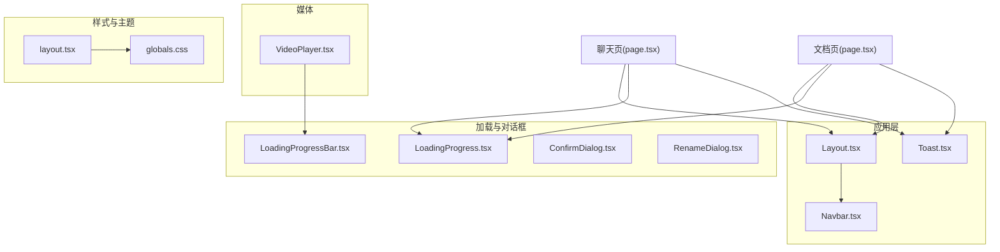
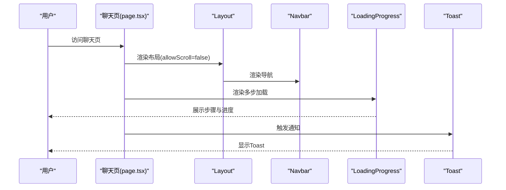
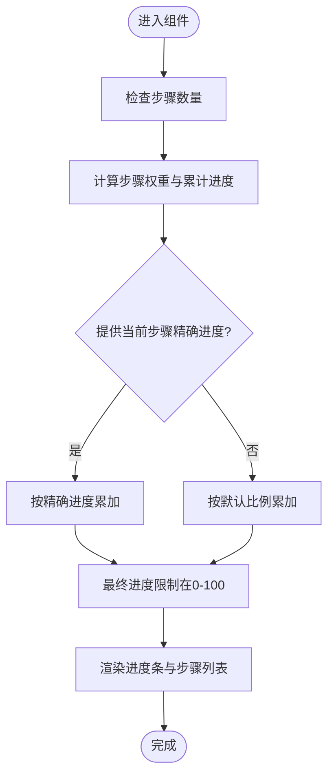
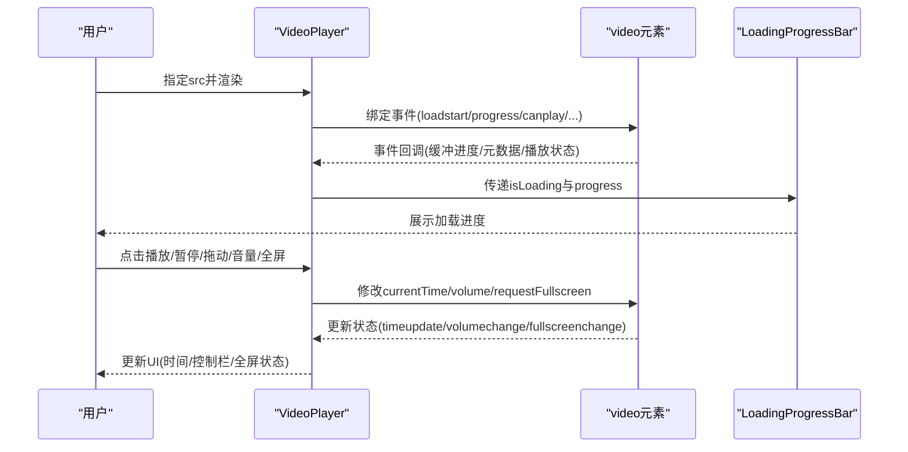
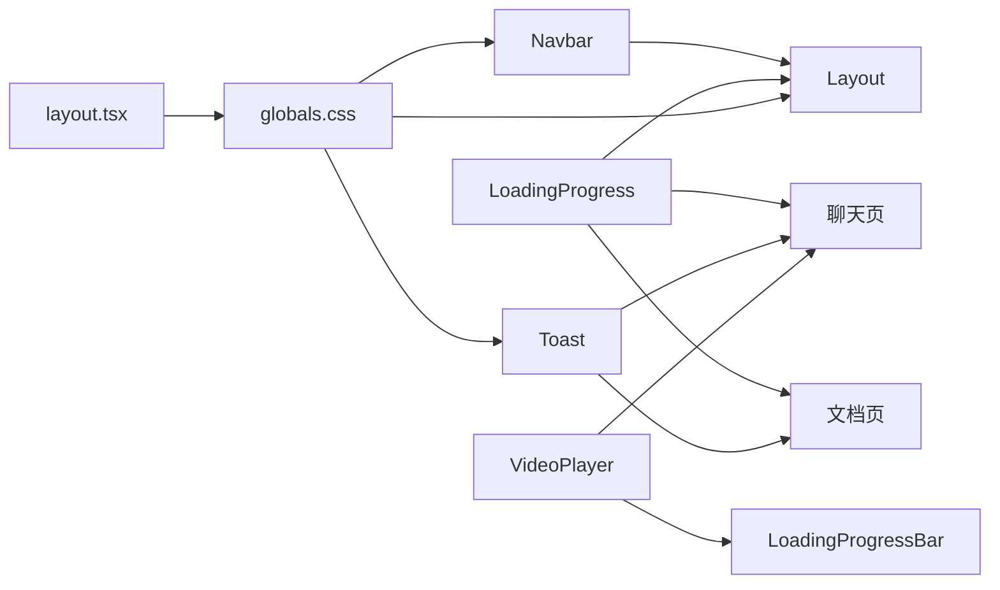

# UI组件库

<cite>
**本文引用的文件**
- [Layout.tsx](file://web/components/ui/Layout.tsx)
- [Navbar.tsx](file://web/components/ui/Navbar.tsx)
- [LoadingProgress.tsx](file://web/components/ui/LoadingProgress.tsx)
- [LoadingProgressBar.tsx](file://web/components/ui/LoadingProgressBar.tsx)
- [ConfirmDialog.tsx](file://web/components/ui/ConfirmDialog.tsx)
- [RenameDialog.tsx](file://web/components/ui/RenameDialog.tsx)
- [Toast.tsx](file://web/components/ui/Toast.tsx)
- [VideoPlayer.tsx](file://web/components/ui/VideoPlayer.tsx)
- [globals.css](file://web/app/globals.css)
- [layout.tsx](file://web/app/layout.tsx)
- [page.tsx（聊天）](file://web/app/chat/page.tsx)
- [page.tsx（文档）](file://web/app/documents/page.tsx)
</cite>

## 目录
1. [简介](#简介)
2. [项目结构](#项目结构)
3. [核心组件](#核心组件)
4. [架构总览](#架构总览)
5. [详细组件分析](#详细组件分析)
6. [依赖关系分析](#依赖关系分析)
7. [性能考量](#性能考量)
8. [故障排查指南](#故障排查指南)
9. [结论](#结论)
10. [附录](#附录)

## 简介
本文件为 Advanced RAG UI 组件库的开发与使用文档，聚焦以下组件的设计与实现：
- Layout：页面布局架构与滚动策略
- Navbar：导航系统与移动端菜单
- LoadingProgress 与 LoadingProgressBar：加载状态管理
- ConfirmDialog 与 RenameDialog：对话框组件与表单校验
- Toast：通知系统与消息类型管理
- VideoPlayer：视频播放器与媒体资源处理

文档同时提供组件 API、使用示例路径、样式定制指南与可复用性设计建议，帮助开发者在 Next.js 应用中高效集成与扩展。

## 项目结构
UI 组件集中于 web/components/ui 目录，配合 web/app/globals.css 提供主题与动画基底，并通过 web/app/layout.tsx 注入主题提供器与全局样式。

图表来源
- [Layout.tsx:1-61](file://web/components/ui/Layout.tsx#L1-L61)
- [Navbar.tsx:1-125](file://web/components/ui/Navbar.tsx#L1-L125)
- [LoadingProgress.tsx:1-138](file://web/components/ui/LoadingProgress.tsx#L1-L138)
- [LoadingProgressBar.tsx:1-76](file://web/components/ui/LoadingProgressBar.tsx#L1-L76)
- [ConfirmDialog.tsx:1-119](file://web/components/ui/ConfirmDialog.tsx#L1-L119)
- [RenameDialog.tsx:1-127](file://web/components/ui/RenameDialog.tsx#L1-L127)
- [Toast.tsx:1-66](file://web/components/ui/Toast.tsx#L1-L66)
- [VideoPlayer.tsx:1-280](file://web/components/ui/VideoPlayer.tsx#L1-L280)
- [globals.css:1-1183](file://web/app/globals.css#L1-L1183)
- [layout.tsx:1-49](file://web/app/layout.tsx#L1-L49)

章节来源
- [layout.tsx:1-49](file://web/app/layout.tsx#L1-L49)
- [globals.css:1-1183](file://web/app/globals.css#L1-L1183)

## 核心组件
本节概述各组件职责、关键特性与典型用法。

- Layout
  - 提供两种布局模式：允许滚动与禁止滚动（用于聊天页）
  - 支持无内边距与安全区域适配
  - 与 Navbar 协作形成统一头部导航
- Navbar
  - 基于路由高亮的导航项
  - 移动端汉堡菜单与侧边栏联动
- LoadingProgress
  - 多步骤进度展示，带权重估算与平滑过渡
  - 支持步骤级进度与消息占位
- LoadingProgressBar
  - 确定/不确定进度两种模式
  - 平滑动画与百分比显示
- ConfirmDialog
  - 确认/取消对话框，支持危险样式
  - ESC 关闭与背景锁定
- RenameDialog
  - 对话重命名表单，输入校验与快捷键
  - 打开时自动聚焦与全选
- Toast
  - 四种消息类型与自动消失
  - 右上角固定位置与手动关闭
- VideoPlayer
  - 原生 video 封装，内置加载进度、控制栏、全屏
  - 播放/暂停、拖动、音量、时间格式化

章节来源
- [Layout.tsx:1-61](file://web/components/ui/Layout.tsx#L1-L61)
- [Navbar.tsx:1-125](file://web/components/ui/Navbar.tsx#L1-L125)
- [LoadingProgress.tsx:1-138](file://web/components/ui/LoadingProgress.tsx#L1-L138)
- [LoadingProgressBar.tsx:1-76](file://web/components/ui/LoadingProgressBar.tsx#L1-L76)
- [ConfirmDialog.tsx:1-119](file://web/components/ui/ConfirmDialog.tsx#L1-L119)
- [RenameDialog.tsx:1-127](file://web/components/ui/RenameDialog.tsx#L1-L127)
- [Toast.tsx:1-66](file://web/components/ui/Toast.tsx#L1-L66)
- [VideoPlayer.tsx:1-280](file://web/components/ui/VideoPlayer.tsx#L1-L280)

## 架构总览
UI 组件与页面的关系如下：

图表来源
- [page.tsx（聊天）:1-800](file://web/app/chat/page.tsx#L1-L800)
- [Layout.tsx:1-61](file://web/components/ui/Layout.tsx#L1-L61)
- [Navbar.tsx:1-125](file://web/components/ui/Navbar.tsx#L1-L125)
- [LoadingProgress.tsx:1-138](file://web/components/ui/LoadingProgress.tsx#L1-L138)
- [Toast.tsx:1-66](file://web/components/ui/Toast.tsx#L1-L66)

## 详细组件分析

### Layout 组件
- 设计要点
  - 两套滚动策略：允许滚动（整页滚动）与禁止滚动（固定高度内部滚动）
  - 支持无内边距模式与安全区域注入
  - 与 Navbar 协同，保证头部始终可见
- 关键属性
  - children：子节点
  - noPadding：是否去除左右内边距
  - allowScroll：是否允许整页滚动
- 使用建议
  - 聊天页使用禁止滚动布局，确保消息区域稳定
  - 文档页等长列表场景可使用允许滚动布局

章节来源
- [Layout.tsx:1-61](file://web/components/ui/Layout.tsx#L1-L61)

### Navbar 组件
- 设计要点
  - 基于路由高亮的导航项
  - 移动端汉堡菜单，点击展开/收起
  - 在聊天页通过自定义事件触发侧边栏
- 交互细节
  - 移动端菜单展开时锁定背景滚动
  - 点击菜单项自动收起
- 可扩展性
  - 导航项通过数组配置，便于动态扩展

章节来源
- [Navbar.tsx:1-125](file://web/components/ui/Navbar.tsx#L1-L125)

### LoadingProgress 组件
- 设计要点
  - 多步骤进度条，带权重估算与平滑过渡
  - 支持步骤级进度与默认进度映射
  - 步骤号与步骤名同步显示
- 算法流程
  - 根据步骤数与权重计算累计进度
  - 当前步骤若提供精确进度则采用，否则按默认比例估算
  - 最终步骤强制为 100%

图表来源
- [LoadingProgress.tsx:1-138](file://web/components/ui/LoadingProgress.tsx#L1-L138)

章节来源
- [LoadingProgress.tsx:1-138](file://web/components/ui/LoadingProgress.tsx#L1-L138)

### LoadingProgressBar 组件
- 设计要点
  - 确定进度：平滑过渡到目标值
  - 不确定进度：脉冲动画与渐变扫光
- 关键属性
  - isLoading：是否显示
  - progress：0-100 的进度
  - text：显示文本
  - showPercentage：是否显示百分比
  - className：自定义样式
- 使用建议
  - 适合短任务或不确定耗时的加载场景

章节来源
- [LoadingProgressBar.tsx:1-76](file://web/components/ui/LoadingProgressBar.tsx#L1-L76)

### ConfirmDialog 组件
- 设计要点
  - 背景遮罩与缩放动画
  - ESC 键关闭与背景滚动锁定
  - 支持危险样式与加载态按钮
- 表单与交互
  - 点击遮罩或取消按钮关闭
  - 确认按钮禁用时显示加载态
- 最佳实践
  - 重要操作（删除、清空）优先使用危险样式
  - 结合业务状态控制 isOpen 与 isLoading

章节来源
- [ConfirmDialog.tsx:1-119](file://web/components/ui/ConfirmDialog.tsx#L1-L119)

### RenameDialog 组件
- 设计要点
  - 输入框自动聚焦与全选
  - Enter/ESC 快捷键支持
  - 空标题回退为默认标题
- 表单校验
  - 去除首尾空格
  - 空值回退为“未命名对话”
  - 与原标题一致时不触发确认
- 可复用性
  - 通过 props 传入当前标题与回调，解耦业务逻辑

章节来源
- [RenameDialog.tsx:1-127](file://web/components/ui/RenameDialog.tsx#L1-L127)

### Toast 组件
- 设计要点
  - 四种类型：success、error、info、warning
  - 自动定时关闭与手动关闭
  - 固定右上角位置，支持自定义持续时间
- 使用示例
  - 聊天页与文档页均通过状态驱动 Toast 的显示与消息内容

章节来源
- [Toast.tsx:1-66](file://web/components/ui/Toast.tsx#L1-L66)
- [page.tsx（聊天）:109-117](file://web/app/chat/page.tsx#L109-L117)
- [page.tsx（文档）:31-35](file://web/app/documents/page.tsx#L31-L35)

### VideoPlayer 组件
- 设计要点
  - 原生 video 封装，监听 loadstart/progress/canplay 等事件
  - 内置加载进度条（LoadingProgressBar）
  - 控制栏：播放/暂停、时间轴、音量、全屏
  - 鼠标悬停显示控制栏，离开隐藏
- 关键能力
  - 加载进度计算与平滑展示
  - 播放状态、时间轴、音量状态管理
  - 全屏切换与状态同步
- 优化建议
  - 移动端使用 playsInline 避免全屏自动跳转
  - 合理设置 muted/autoPlay 以提升兼容性

图表来源
- [VideoPlayer.tsx:1-280](file://web/components/ui/VideoPlayer.tsx#L1-L280)
- [LoadingProgressBar.tsx:1-76](file://web/components/ui/LoadingProgressBar.tsx#L1-L76)

章节来源
- [VideoPlayer.tsx:1-280](file://web/components/ui/VideoPlayer.tsx#L1-L280)

## 依赖关系分析
- 组件间依赖
  - Layout 依赖 Navbar
  - VideoPlayer 依赖 LoadingProgressBar
  - 页面（聊天/文档）依赖多个 UI 组件
- 样式与主题
  - globals.css 定义 CSS 变量与深浅主题
  - layout.tsx 注入 ThemeProvider，控制主题切换

图表来源
- [Layout.tsx:1-61](file://web/components/ui/Layout.tsx#L1-L61)
- [Navbar.tsx:1-125](file://web/components/ui/Navbar.tsx#L1-L125)
- [LoadingProgress.tsx:1-138](file://web/components/ui/LoadingProgress.tsx#L1-L138)
- [LoadingProgressBar.tsx:1-76](file://web/components/ui/LoadingProgressBar.tsx#L1-L76)
- [Toast.tsx:1-66](file://web/components/ui/Toast.tsx#L1-L66)
- [VideoPlayer.tsx:1-280](file://web/components/ui/VideoPlayer.tsx#L1-L280)
- [globals.css:1-1183](file://web/app/globals.css#L1-L1183)
- [layout.tsx:1-49](file://web/app/layout.tsx#L1-L49)

章节来源
- [page.tsx（聊天）:1-800](file://web/app/chat/page.tsx#L1-L800)
- [page.tsx（文档）:1-522](file://web/app/documents/page.tsx#L1-L522)

## 性能考量
- 滚动与布局
  - 禁止滚动布局适用于长消息列表，减少重排与滚动抖动
  - 允许滚动布局适合长页面，注意安全区域与触摸滚动优化
- 动画与渲染
  - 对话框与 Toast 使用 CSS 动画，避免 JS 动画带来的卡顿
  - LoadingProgress 与 LoadingProgressBar 使用平滑过渡，降低视觉跳变
- 媒体资源
  - VideoPlayer 监听关键事件，避免频繁重绘
  - 移动端使用 playsInline，减少全屏跳转成本

## 故障排查指南
- 对话框无法关闭
  - 确认 isOpen 状态正确传递
  - 检查 ESC 事件绑定与背景滚动锁定
- Toast 不显示
  - 确认 isOpen 为 true 且 message 非空
  - 检查 duration 设置与自动关闭定时器
- 视频无法播放
  - 检查 src 是否有效
  - 确认移动端设置了 playsInline
  - 检查浏览器权限与静音策略
- 导航菜单异常
  - 确认移动端菜单的展开/收起逻辑与高度计算
  - 检查自定义事件 openChatSidebar 的触发与接收

章节来源
- [ConfirmDialog.tsx:28-49](file://web/components/ui/ConfirmDialog.tsx#L28-L49)
- [Toast.tsx:22-29](file://web/components/ui/Toast.tsx#L22-L29)
- [VideoPlayer.tsx:176-186](file://web/components/ui/VideoPlayer.tsx#L176-L186)
- [Navbar.tsx:67-91](file://web/components/ui/Navbar.tsx#L67-L91)

## 结论
本 UI 组件库围绕布局、导航、加载、对话框、通知与媒体播放六大维度构建，具备良好的可复用性与扩展性。通过统一的主题变量与动画基底，组件在深浅主题下保持一致的视觉体验。建议在业务页面中按需组合使用，遵循组件 API 与交互约定，以获得稳定、流畅的用户体验。

## 附录

### 组件 API 文档

- Layout
  - 属性
    - children: ReactNode
    - noPadding?: boolean
    - allowScroll?: boolean
- Navbar
  - 无属性，基于路由高亮与移动端菜单
- LoadingProgress
  - 属性
    - steps: string[]
    - currentStep: number
    - message?: string
    - className?: string
    - currentStepProgress?: number
- LoadingProgressBar
  - 属性
    - isLoading: boolean
    - progress?: number
    - text?: string
    - showPercentage?: boolean
    - className?: string
- ConfirmDialog
  - 属性
    - isOpen: boolean
    - title: string
    - message: string
    - confirmText?: string
    - cancelText?: string
    - onConfirm: () => void
    - onCancel: () => void
    - variant?: "danger" | "default"
    - isLoading?: boolean
- RenameDialog
  - 属性
    - isOpen: boolean
    - currentTitle: string
    - onConfirm: (newTitle: string) => void
    - onCancel: () => void
- Toast
  - 属性
    - isOpen: boolean
    - message: string
    - type?: "success" | "error" | "info" | "warning"
    - duration?: number
    - onClose: () => void
- VideoPlayer
  - 属性
    - src: string
    - title?: string
    - className?: string
    - autoPlay?: boolean
    - loop?: boolean
    - muted?: boolean

章节来源
- [Layout.tsx:6-10](file://web/components/ui/Layout.tsx#L6-L10)
- [LoadingProgress.tsx:5-11](file://web/components/ui/LoadingProgress.tsx#L5-L11)
- [LoadingProgressBar.tsx:5-16](file://web/components/ui/LoadingProgressBar.tsx#L5-L16)
- [ConfirmDialog.tsx:5-15](file://web/components/ui/ConfirmDialog.tsx#L5-L15)
- [RenameDialog.tsx:5-10](file://web/components/ui/RenameDialog.tsx#L5-L10)
- [Toast.tsx:7-13](file://web/components/ui/Toast.tsx#L7-L13)
- [VideoPlayer.tsx:6-16](file://web/components/ui/VideoPlayer.tsx#L6-L16)

### 使用示例与路径
- 聊天页加载与通知
  - 多步加载：[page.tsx（聊天）:666-678](file://web/app/chat/page.tsx#L666-L678)
  - Toast 使用：[page.tsx（聊天）:109-117](file://web/app/chat/page.tsx#L109-L117)
- 文档页加载与通知
  - 多步加载：[page.tsx（文档）:217-225](file://web/app/documents/page.tsx#L217-L225)
  - Toast 使用：[page.tsx（文档）:511-517](file://web/app/documents/page.tsx#L511-L517)
- 布局与导航
  - Layout 使用：[page.tsx（聊天）:668-677](file://web/app/chat/page.tsx#L668-L677)
  - Layout 使用：[page.tsx（文档）:228-229](file://web/app/documents/page.tsx#L228-L229)

章节来源
- [page.tsx（聊天）:666-678](file://web/app/chat/page.tsx#L666-L678)
- [page.tsx（聊天）:109-117](file://web/app/chat/page.tsx#L109-L117)
- [page.tsx（文档）:217-225](file://web/app/documents/page.tsx#L217-L225)
- [page.tsx（文档）:511-517](file://web/app/documents/page.tsx#L511-L517)

### 样式定制指南
- 主题变量
  - 通过 CSS 变量控制主色、背景、文字、边框与阴影
  - 深浅主题分别定义，自动切换
- 动画与过渡
  - 对话框与 Toast 使用预设动画类
  - 滚动条与渐变效果在全局样式中定义
- 响应式与安全区域
  - 移动端安全区域适配与触摸滚动优化
  - 移动端菜单与汉堡按钮的交互样式

章节来源
- [globals.css:1-1183](file://web/app/globals.css#L1-L1183)
- [layout.tsx:22-48](file://web/app/layout.tsx#L22-L48)