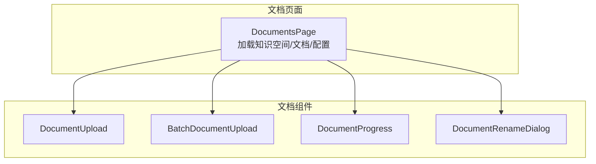
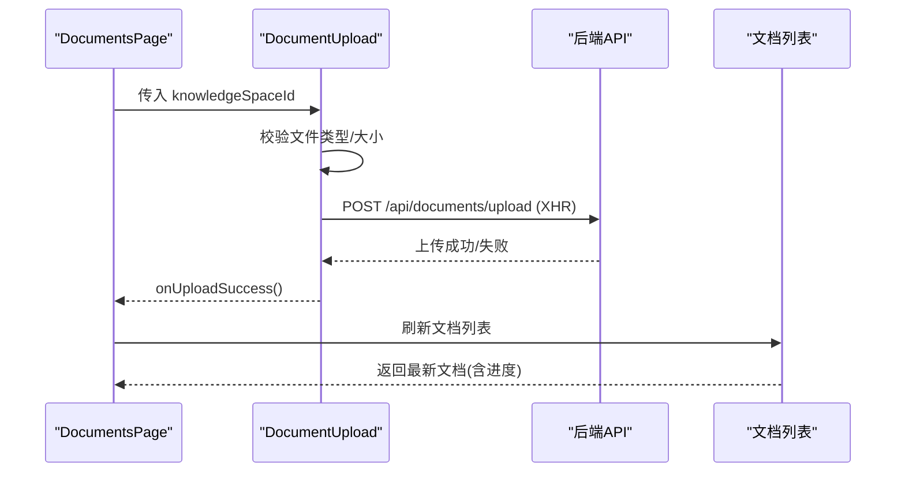
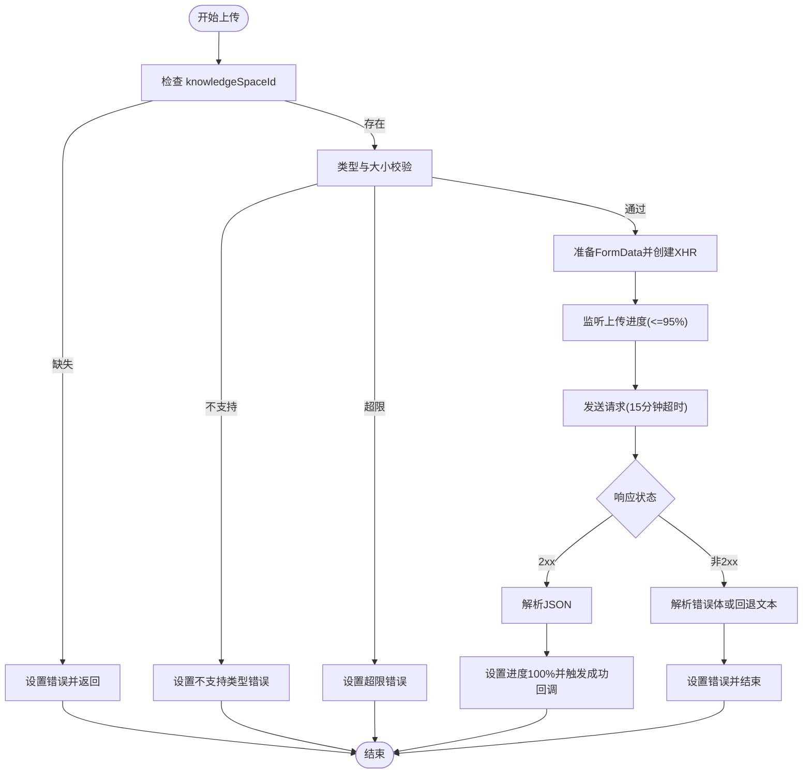
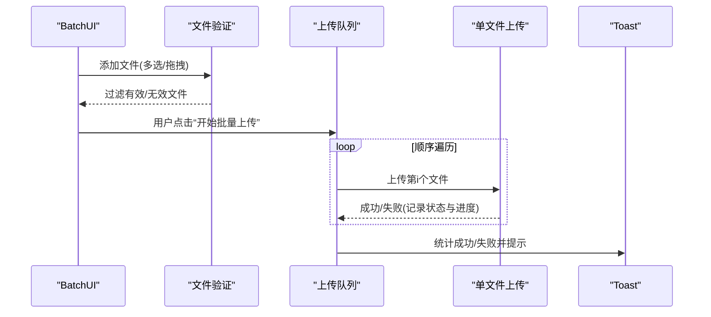
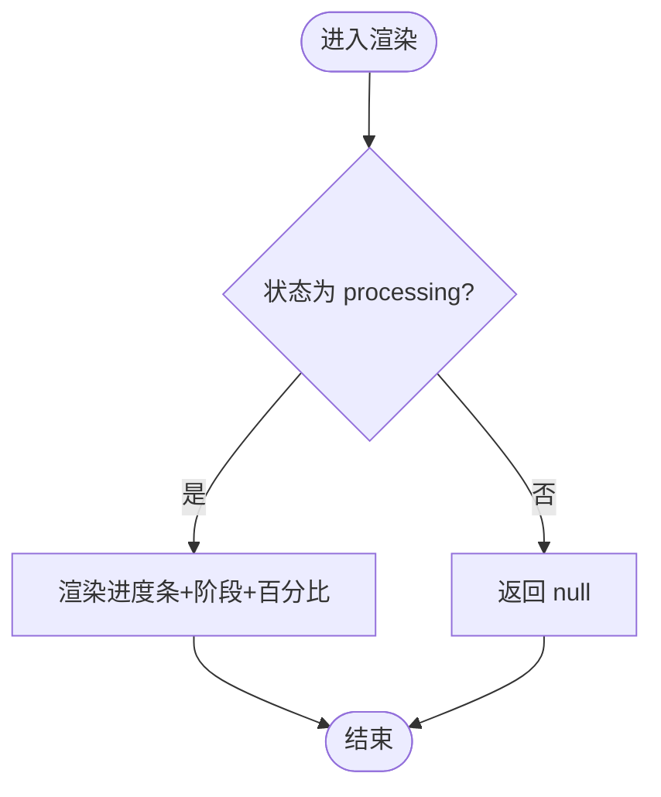
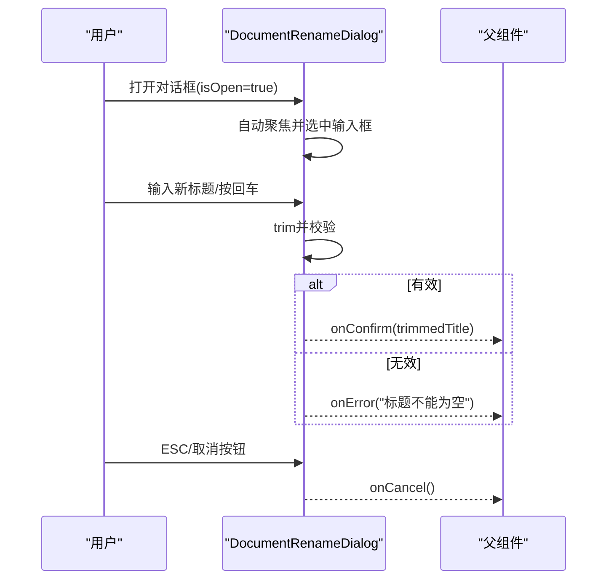
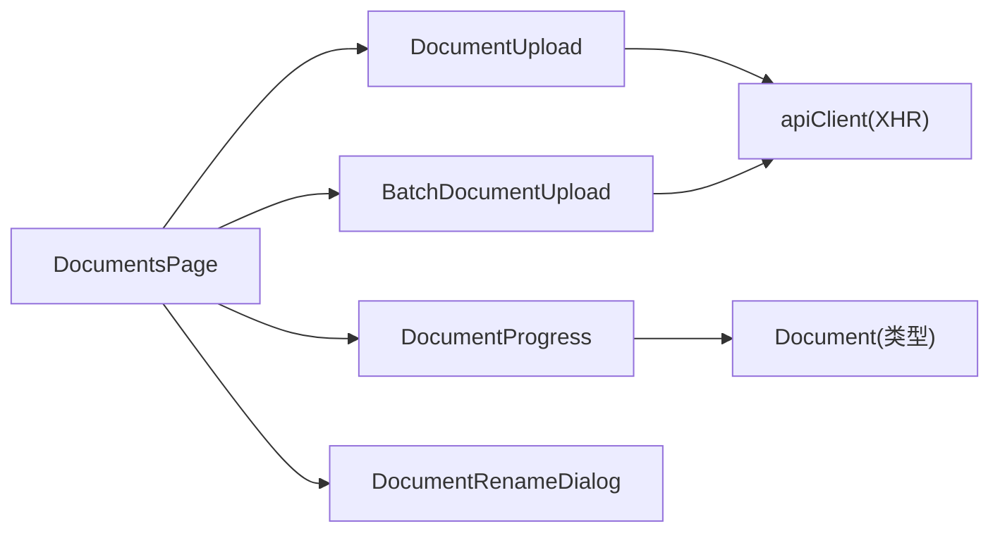

# 文档组件系统

<cite>
**本文引用的文件**
- [DocumentUpload.tsx](file://web/components/document/DocumentUpload.tsx)
- [BatchDocumentUpload.tsx](file://web/components/document/BatchDocumentUpload.tsx)
- [DocumentProgress.tsx](file://web/components/document/DocumentProgress.tsx)
- [DocumentRenameDialog.tsx](file://web/components/document/DocumentRenameDialog.tsx)
- [page.tsx](file://web/app/documents/page.tsx)
</cite>

## 目录
1. [简介](#简介)
2. [项目结构](#项目结构)
3. [核心组件](#核心组件)
4. [架构总览](#架构总览)
5. [详细组件分析](#详细组件分析)
6. [依赖关系分析](#依赖关系分析)
7. [性能考量](#性能考量)
8. [故障排查指南](#故障排查指南)
9. [结论](#结论)
10. [附录](#附录)

## 简介
本文件面向 Advanced RAG 的文档组件系统，聚焦以下四个组件：
- 单文件上传：DocumentUpload
- 批量上传：BatchDocumentUpload
- 上传进度展示：DocumentProgress
- 文档重命名对话框：DocumentRenameDialog

文档将从架构、数据流、处理逻辑、错误处理、状态管理、事件机制、Props 设计模式等方面进行深入说明，并给出使用示例与最佳实践。

## 项目结构
文档组件位于前端 Next.js 应用的 web/components/document 目录，页面入口位于 web/app/documents/page.tsx。页面负责加载知识空间、文档列表、运行时配置，并将知识空间 ID 传递给上传组件。

图表来源
- [page.tsx:334-340](file://web/app/documents/page.tsx#L334-L340)
- [DocumentUpload.tsx:11-14](file://web/components/document/DocumentUpload.tsx#L11-L14)
- [BatchDocumentUpload.tsx:19-22](file://web/components/document/BatchDocumentUpload.tsx#L19-L22)
- [DocumentProgress.tsx:10-13](file://web/components/document/DocumentProgress.tsx#L10-L13)
- [DocumentRenameDialog.tsx:13-19](file://web/components/document/DocumentRenameDialog.tsx#L13-L19)

章节来源
- [page.tsx:12-105](file://web/app/documents/page.tsx#L12-L105)

## 核心组件
- DocumentUpload：单文件拖拽/点击上传，支持进度条、错误提示、200MB 限制、类型校验（PDF/Word/Markdown/TXT），并使用 XHR 实现真实上传进度。
- BatchDocumentUpload：多文件拖拽/选择，逐个顺序上传，带本地状态管理（pending/uploading/success/error）、进度条、错误聚合提示、清空与批量开始上传。
- DocumentProgress：根据后端返回的文档对象渲染处理进度条、阶段名称与百分比，仅在状态为 processing 时显示。
- DocumentRenameDialog：弹窗式重命名，包含输入校验（非空、与原标题不同）、ESC 关闭、背景滚动控制、回调事件 onConfirm/onCancel/onError。

章节来源
- [DocumentUpload.tsx:6-161](file://web/components/document/DocumentUpload.tsx#L6-L161)
- [BatchDocumentUpload.tsx:7-303](file://web/components/document/BatchDocumentUpload.tsx#L7-L303)
- [DocumentProgress.tsx:5-52](file://web/components/document/DocumentProgress.tsx#L5-L52)
- [DocumentRenameDialog.tsx:5-129](file://web/components/document/DocumentRenameDialog.tsx#L5-L129)

## 架构总览
整体数据流：页面选择知识空间 -> 上传组件携带 knowledgeSpaceId -> 前端校验 -> XHR 上传 -> 后端处理 -> 页面轮询刷新文档列表 -> 展示处理进度。

图表来源
- [page.tsx:334-340](file://web/app/documents/page.tsx#L334-L340)
- [DocumentUpload.tsx:48-161](file://web/components/document/DocumentUpload.tsx#L48-L161)

## 详细组件分析

### DocumentUpload 组件
- 功能要点
  - 支持拖拽进入、离开、放下事件，视觉反馈切换边框样式。
  - 单文件选择与拖拽入口统一调用 handleFileUpload。
  - 文件类型白名单：PDF、DOC/DOCX、MD、TXT；扩展名辅助校验。
  - 文件大小限制：200MB。
  - 使用 XHR 实时监听上传进度，进度上限至 95%，等待响应完成后再置 100%。
  - 错误处理：JSON 解析异常、HTTP 非 2xx、网络错误、超时。
  - 成功后触发父组件回调 onUploadSuccess，并清空文件输入值。
- Props 设计
  - onUploadSuccess?: () => void
  - knowledgeSpaceId?: string
- 事件与状态
  - 拖拽事件：onDragOver/onDragLeave/onDrop
  - 输入事件：onChange
  - 状态：isDragging/uploading/progress/error
- 并发与超时
  - 单文件上传，无并发控制；XHR 超时设置为 15 分钟，适配大文件。
- 错误处理
  - 前端校验失败：setError 并终止上传。
  - 服务端错误：解析响应体中的 detail/message/error 字段作为错误消息。
  - 网络/超时：分别返回对应错误文案。

图表来源
- [DocumentUpload.tsx:48-161](file://web/components/document/DocumentUpload.tsx#L48-L161)

章节来源
- [DocumentUpload.tsx:6-161](file://web/components/document/DocumentUpload.tsx#L6-L161)

### BatchDocumentUpload 组件
- 功能要点
  - 支持多文件拖拽/选择，预校验：类型、大小、空文件、重复文件。
  - 本地状态管理 UploadFile[]：pending/uploading/success/error，每个文件独立进度。
  - 顺序上传策略：for 循环逐个调用 uploadFile，中间加入短延迟，避免服务器压力。
  - 上传中状态：进度条实时更新，最多 95%，完成后置 100%。
  - 错误聚合：统计成功/失败数量，统一 Toast 提示。
  - 清空与移除：清空全部、按项移除。
- Props 设计
  - onUploadSuccess?: () => void
  - knowledgeSpaceId?: string
- 事件与状态
  - 拖拽事件：onDragOver/onDragLeave/onDrop
  - 输入事件：multiple onChange
  - 状态：files/isDragging/uploading/toast
- 并发与超时
  - 顺序串行上传，无并发；XHR 超时 15 分钟。
- 错误处理
  - 本地校验失败：直接在对应 UploadFile 中记录 error。
  - 上传失败：记录状态与错误信息，继续后续文件上传。

图表来源
- [BatchDocumentUpload.tsx:58-303](file://web/components/document/BatchDocumentUpload.tsx#L58-L303)

章节来源
- [BatchDocumentUpload.tsx:7-303](file://web/components/document/BatchDocumentUpload.tsx#L7-L303)

### DocumentProgress 组件
- 功能要点
  - 仅当文档状态为 processing 时渲染。
  - 读取 progress_percentage/current_stage/stage_details 渲染进度条与阶段信息。
  - 进度条宽度随百分比平滑过渡。
- Props 设计
  - document: Document
  - className?: string
- 数据模型
  - Document 接口包含：status、progress_percentage、current_stage、stage_details 等字段。

图表来源
- [DocumentProgress.tsx:18-52](file://web/components/document/DocumentProgress.tsx#L18-L52)

章节来源
- [DocumentProgress.tsx:5-52](file://web/components/document/DocumentProgress.tsx#L5-L52)

### DocumentRenameDialog 组件
- 功能要点
  - 弹窗式输入，自动聚焦并全选标题。
  - ESC 键关闭对话框。
  - 背景滚动锁定，防止穿透滚动。
  - 输入校验：trim 后非空且与当前标题不同才允许确认；否则触发 onError 或取消。
  - 回调：onConfirm(newTitle)、onCancel()、onError(message)。
- Props 设计
  - isOpen: boolean
  - currentTitle: string
  - onConfirm: (newTitle: string) => void
  - onCancel: () => void
  - onError?: (message: string) => void
- 交互流程

图表来源
- [DocumentRenameDialog.tsx:13-129](file://web/components/document/DocumentRenameDialog.tsx#L13-L129)

章节来源
- [DocumentRenameDialog.tsx:5-129](file://web/components/document/DocumentRenameDialog.tsx#L5-L129)

## 依赖关系分析
- 组件间依赖
  - DocumentsPage 作为容器，向下传递 knowledgeSpaceId 与回调。
  - DocumentUpload/BatchDocumentUpload 依赖 apiClient（XHR 请求）。
  - DocumentProgress 依赖 Document 类型（来自 apiClient）。
  - DocumentRenameDialog 为纯 UI 对话框，依赖外部 onConfirm/onCancel/onError。
- 外部依赖
  - XHR 用于上传与进度监听。
  - Toast 用于批量上传后的汇总提示。

图表来源
- [page.tsx:334-340](file://web/app/documents/page.tsx#L334-L340)
- [DocumentUpload.tsx:4-4](file://web/components/document/DocumentUpload.tsx#L4-L4)
- [BatchDocumentUpload.tsx:4-5](file://web/components/document/BatchDocumentUpload.tsx#L4-L5)
- [DocumentProgress.tsx:3-3](file://web/components/document/DocumentProgress.tsx#L3-L3)

章节来源
- [page.tsx:12-105](file://web/app/documents/page.tsx#L12-L105)

## 性能考量
- 上传性能
  - 单文件上传使用 XHR 实时进度，适合大文件场景。
  - 批量上传采用顺序串行，避免服务器过载；如需提升吞吐，可评估引入并发池与节流策略。
- UI 渲染
  - DocumentProgress 使用过渡动画与最小更新策略，避免频繁重绘。
  - BatchDocumentUpload 对每个文件维护独立状态，建议在文件较多时考虑虚拟化列表优化。
- 网络与超时
  - 上传超时 15 分钟，适合大体积文档；建议结合断点续传或分片上传进一步优化。

## 故障排查指南
- 常见问题与定位
  - 无法选择文件：检查 input[type=file] 是否被禁用（uploading 状态）。
  - 类型不支持：确认文件扩展名与 MIME 类型是否在白名单内。
  - 超出大小限制：确认文件大小是否超过 200MB。
  - 知识空间缺失：上传前必须选择目标知识空间。
  - 网络错误/超时：检查网络连通性与后端服务状态。
  - 上传失败但无明确错误：查看服务端响应体结构，确保包含 detail/message/error 字段。
- 建议
  - 在 onUploadSuccess 中触发页面刷新，确保列表与进度同步。
  - 批量上传失败时，优先检查首个失败文件的错误信息，再逐步定位其他文件问题。

章节来源
- [DocumentUpload.tsx:48-161](file://web/components/document/DocumentUpload.tsx#L48-L161)
- [BatchDocumentUpload.tsx:137-238](file://web/components/document/BatchDocumentUpload.tsx#L137-L238)

## 结论
文档组件系统围绕“单文件上传、批量上传、进度展示、重命名对话框”四大能力构建，具备完善的前端校验、实时进度与错误处理机制。通过合理的 Props 设计与事件回调，组件与页面之间形成清晰的职责边界。建议在大规模批量场景下引入并发控制与断点续传，以进一步提升吞吐与稳定性。

## 附录

### 使用示例与最佳实践
- 单文件上传
  - 在页面中引入 DocumentUpload，并传入 knowledgeSpaceId 与 onUploadSuccess 回调，成功后刷新文档列表。
  - 示例路径参考：[page.tsx:334-340](file://web/app/documents/page.tsx#L334-L340)
- 批量上传
  - 使用 BatchDocumentUpload，先进行本地校验，再顺序上传；注意知识空间选择与超时设置。
  - 示例路径参考：[BatchDocumentUpload.tsx:19-303](file://web/components/document/BatchDocumentUpload.tsx#L19-L303)
- 进度展示
  - 在文档列表中对 processing 状态的文档渲染 DocumentProgress，显示当前阶段与百分比。
  - 示例路径参考：[DocumentProgress.tsx:10-52](file://web/components/document/DocumentProgress.tsx#L10-L52)
- 重命名
  - 打开 DocumentRenameDialog，校验输入后调用 onConfirm；若输入为空则通过 onError 提示。
  - 示例路径参考：[DocumentRenameDialog.tsx:13-129](file://web/components/document/DocumentRenameDialog.tsx#L13-L129)