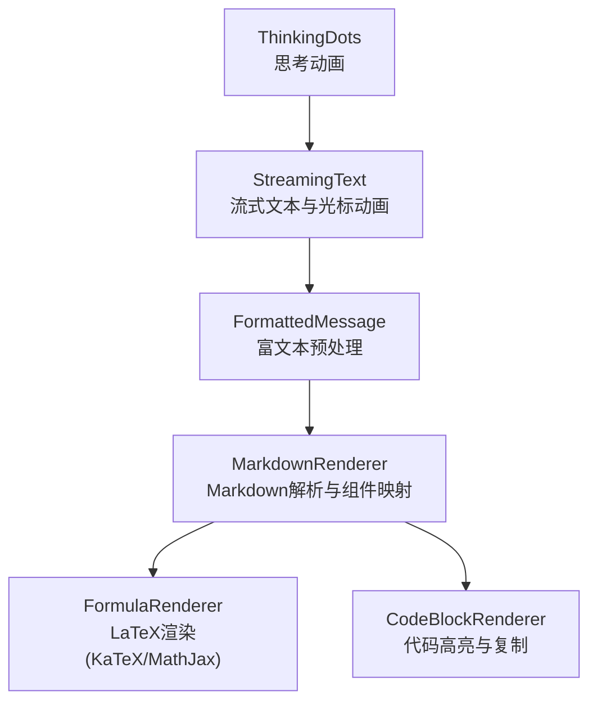
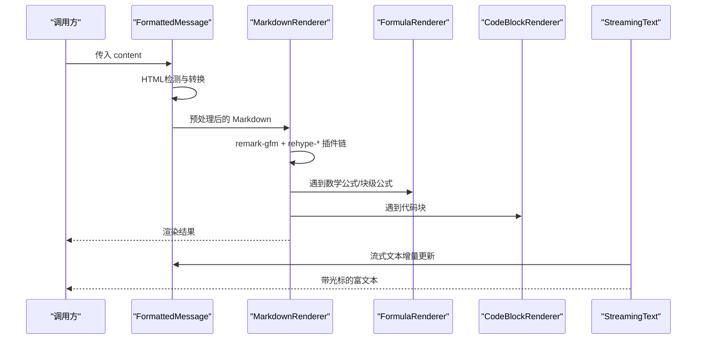
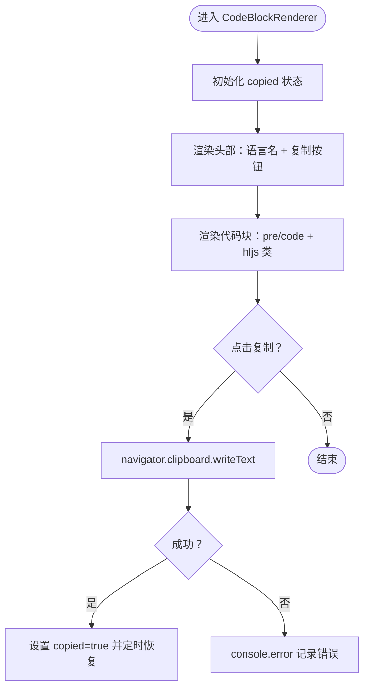
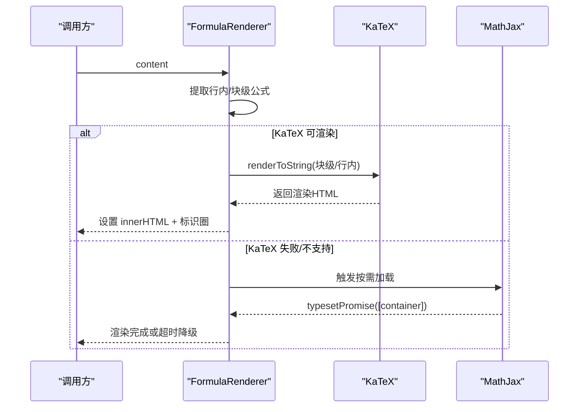
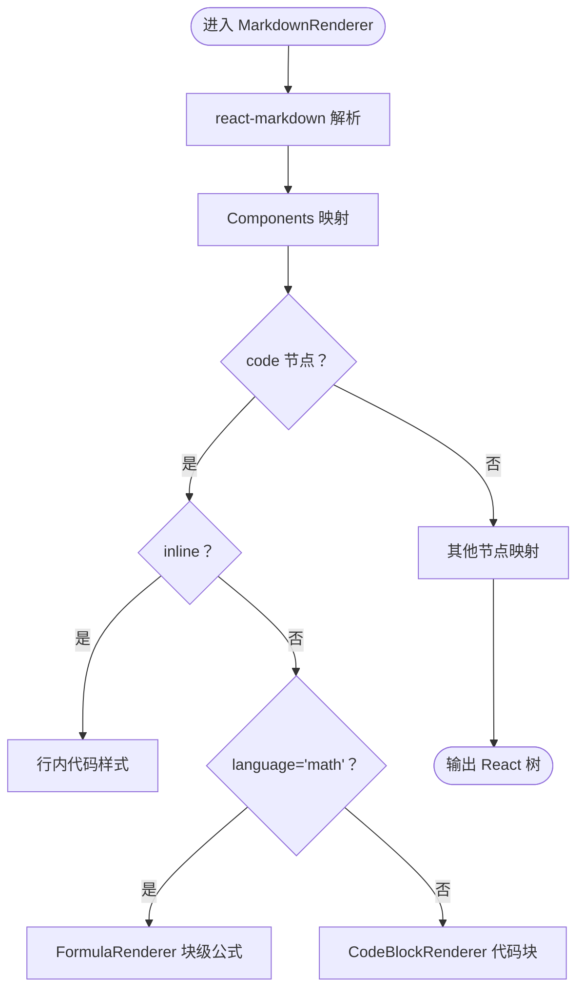
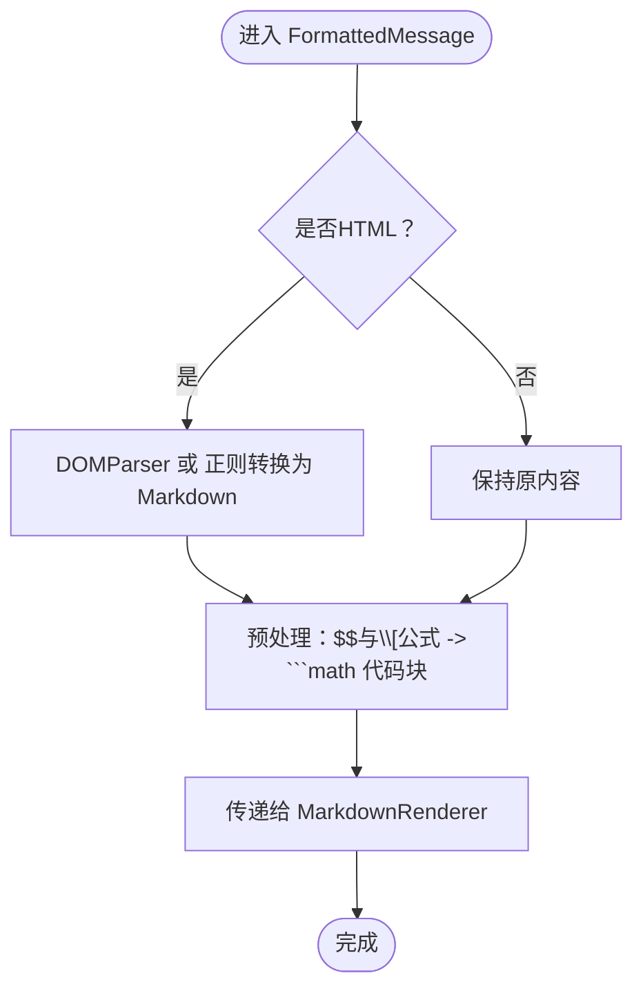
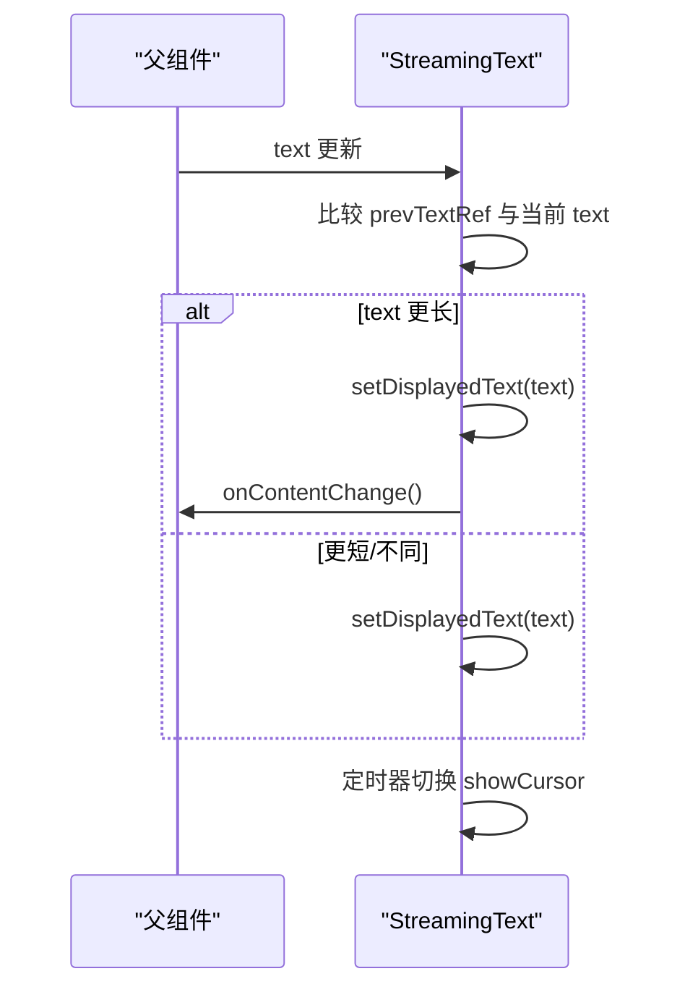
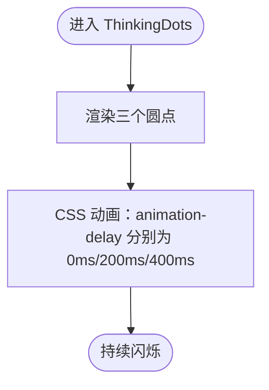
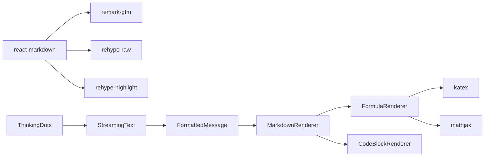

# 消息渲染组件

<cite>
**本文引用的文件列表**
- [CodeBlockRenderer.tsx](file://web/components/message/CodeBlockRenderer.tsx)
- [FormulaRenderer.tsx](file://web/components/message/FormulaRenderer.tsx)
- [MarkdownRenderer.tsx](file://web/components/message/MarkdownRenderer.tsx)
- [FormattedMessage.tsx](file://web/components/message/FormattedMessage.tsx)
- [StreamingText.tsx](file://web/components/message/StreamingText.tsx)
- [ThinkingDots.tsx](file://web/components/message/ThinkingDots.tsx)
- [package.json](file://web/package.json)
</cite>

## 目录
1. [简介](#简介)
2. [项目结构](#项目结构)
3. [核心组件](#核心组件)
4. [架构总览](#架构总览)
5. [组件详解](#组件详解)
6. [依赖关系分析](#依赖关系分析)
7. [性能与优化](#性能与优化)
8. [故障排查指南](#故障排查指南)
9. [结论](#结论)

## 简介
本文件面向 Advanced RAG 消息渲染体系，系统性梳理以下组件的技术实现与最佳实践：
- CodeBlockRenderer：代码块高亮渲染、复制交互与主题适配
- FormulaRenderer：LaTeX 公式渲染、KaTeX 优先与 MathJax 回退
- MarkdownRenderer：Markdown 解析、安全与可扩展的组件映射
- FormattedMessage：富文本预处理、HTML 转换与公式块识别
- StreamingText：流式文本渲染、逐字显示与滚动优化
- ThinkingDots：思考动画与 GPU 预热阶段的视觉反馈

目标是帮助开发者理解各组件职责边界、数据流与错误处理策略，并提供性能优化与缓存建议。

## 项目结构
消息渲染相关组件位于 web/components/message 目录，采用“组合 + 委托”的分层设计：
- FormattedMessage 作为入口，负责内容预处理与 HTML 转 Markdown
- MarkdownRenderer 使用 react-markdown + remark-gfm + rehype-* 插件链
- FormulaRenderer 与 CodeBlockRenderer 分别处理公式与代码块
- StreamingText 与 ThinkingDots 提供交互与状态反馈



图表来源
- [FormattedMessage.tsx:105-163](file://web/components/message/FormattedMessage.tsx#L105-L163)
- [MarkdownRenderer.tsx:21-304](file://web/components/message/MarkdownRenderer.tsx#L21-L304)
- [FormulaRenderer.tsx:38-498](file://web/components/message/FormulaRenderer.tsx#L38-L498)
- [CodeBlockRenderer.tsx:18-117](file://web/components/message/CodeBlockRenderer.tsx#L18-L117)
- [StreamingText.tsx:16-77](file://web/components/message/StreamingText.tsx#L16-L77)
- [ThinkingDots.tsx:7-24](file://web/components/message/ThinkingDots.tsx#L7-L24)

章节来源
- [FormattedMessage.tsx:105-163](file://web/components/message/FormattedMessage.tsx#L105-L163)
- [MarkdownRenderer.tsx:21-304](file://web/components/message/MarkdownRenderer.tsx#L21-L304)

## 核心组件
- CodeBlockRenderer：基于 rehype-highlight 的语法高亮，支持复制按钮与语言名映射
- FormulaRenderer：优先 KaTeX，不支持时回退 MathJax；内置 CDN 多源与超时重试
- MarkdownRenderer：通过组件映射将 code、p、ul/ol、table、a 等节点转为带样式的 React 组件
- FormattedMessage：检测 HTML，必要时转换为 Markdown；将块级公式转换为 math 代码块
- StreamingText：增量更新显示文本，配合光标动画与滚动回调
- ThinkingDots：三圆点动画，用于“内容即将生成”提示

章节来源
- [CodeBlockRenderer.tsx:18-117](file://web/components/message/CodeBlockRenderer.tsx#L18-L117)
- [FormulaRenderer.tsx:38-498](file://web/components/message/FormulaRenderer.tsx#L38-L498)
- [MarkdownRenderer.tsx:21-304](file://web/components/message/MarkdownRenderer.tsx#L21-L304)
- [FormattedMessage.tsx:105-163](file://web/components/message/FormattedMessage.tsx#L105-L163)
- [StreamingText.tsx:16-77](file://web/components/message/StreamingText.tsx#L16-L77)
- [ThinkingDots.tsx:7-24](file://web/components/message/ThinkingDots.tsx#L7-L24)

## 架构总览
消息渲染流程从 FormattedMessage 开始，经过 MarkdownRenderer 的插件链与组件映射，最终由 FormulaRenderer 和 CodeBlockRenderer 完成专业渲染；StreamingText 与 ThinkingDots 提供交互体验。



图表来源
- [FormattedMessage.tsx:105-163](file://web/components/message/FormattedMessage.tsx#L105-L163)
- [MarkdownRenderer.tsx:294-304](file://web/components/message/MarkdownRenderer.tsx#L294-L304)
- [FormulaRenderer.tsx:38-498](file://web/components/message/FormulaRenderer.tsx#L38-L498)
- [CodeBlockRenderer.tsx:18-117](file://web/components/message/CodeBlockRenderer.tsx#L18-L117)
- [StreamingText.tsx:16-77](file://web/components/message/StreamingText.tsx#L16-L77)

## 组件详解

### CodeBlockRenderer 组件
职责与特性
- 语法高亮：使用 rehype-highlight 与 highlight.js 样式，支持多种语言
- 复制交互：点击复制按钮将代码写入剪贴板，2 秒内显示“已复制”
- 语言名映射：将常见别名映射为展示名称，提升可读性
- 结构化 UI：头部显示语言与复制按钮，主体包裹代码块

实现要点
- 语言名映射表覆盖 Python、JavaScript、TypeScript、Java、C/C++、Go、Rust、PHP、Ruby、Swift、Kotlin、HTML/CSS、JSON/XML/YAML、SQL、Bash/Shell、MATLAB、R、Scala、Lua、Perl、Dockerfile、Markdown 等
- 复制逻辑使用 navigator.clipboard，异常捕获并记录日志
- 无障碍属性：区域与按钮提供 aria-label 与 aria-readonly



图表来源
- [CodeBlockRenderer.tsx:18-117](file://web/components/message/CodeBlockRenderer.tsx#L18-L117)

章节来源
- [CodeBlockRenderer.tsx:18-117](file://web/components/message/CodeBlockRenderer.tsx#L18-L117)

### FormulaRenderer 组件
职责与特性
- 优先使用 KaTeX：更快、更轻量、无需加载扩展
- 不支持时回退 MathJax：自动按需加载，支持多 CDN 源与超时重试
- 行内公式标识圈：为行内公式添加“公式”徽章，提升可读性
- 深色模式适配：针对 MathJax 与 KaTeX 的深色模式样式优化
- 错误与超时处理：字体加载失败、渲染超时等场景的稳健降级

实现要点
- 公式提取：分别匹配 $...$（行内）与 $$...$$（块级）两类
- KaTeX 渲染：displayMode 控制块级/行内；throwOnError=false 保证健壮性
- MathJax 初始化：配置 tex/displayMath/processEscapes/ams 包；禁用 localStorage 与菜单
- CDN 多源：jsDelivr 与 Cloudflare 备用；超时切换与失败降级
- 标识圈：为行内公式包裹 inline-formula-wrapper 与 formula-badge



图表来源
- [FormulaRenderer.tsx:38-498](file://web/components/message/FormulaRenderer.tsx#L38-L498)

章节来源
- [FormulaRenderer.tsx:38-498](file://web/components/message/FormulaRenderer.tsx#L38-L498)

### MarkdownRenderer 组件
职责与特性
- 基于 react-markdown + remark-gfm + rehype-raw/rehype-highlight
- 自定义组件映射：code、p、h1-h4、ul/ol/li、blockquote、table/th/td、a、hr、strong/em
- 数学公式与代码块委派：math 代码块交由 FormulaRenderer；其他代码块交由 CodeBlockRenderer
- 文本提取与检测：辅助函数判断段落/列表/表格单元是否包含公式，必要时整体委派给 FormulaRenderer

实现要点
- code 组件：区分行内与块级；块级时提取文本并根据语言选择渲染路径
- p/ul/ol/li/blockquote/table：按需检测 containsMathFormula，决定是否整体交给 FormulaRenderer
- a/link：外链新窗口打开，带安全属性
- 表格：容器溢出滚动与深色模式边框/背景优化



图表来源
- [MarkdownRenderer.tsx:21-304](file://web/components/message/MarkdownRenderer.tsx#L21-L304)

章节来源
- [MarkdownRenderer.tsx:21-304](file://web/components/message/MarkdownRenderer.tsx#L21-L304)

### FormattedMessage 组件
职责与特性
- HTML 检测：通过标签特征判断是否为 HTML
- HTML 转 Markdown：客户端使用 DOMParser，服务端进行简单标签剥离与结构保留
- 公式块预处理：将 $$...$$ 与 \[...\] 块级公式转换为 ```math 代码块，便于 MarkdownRenderer 统一处理
- 样式增强：为 MathJax 块级公式与行内公式提供响应式与深色模式优化

实现要点
- isHTML：检测 DOCTYPE、html 标签、div 结构与一般 HTML 片段
- htmlToMarkdown：客户端 DOMParser 提取文本与结构；服务端正则替换保留标题、段落、代码块、链接、强调等
- 预处理：保护现有代码块占位符，再将块级公式转换为 math 代码块
- 全局样式：MathJax 块级与行内公式的字体大小、背景、边框、阴影等优化



图表来源
- [FormattedMessage.tsx:105-163](file://web/components/message/FormattedMessage.tsx#L105-L163)

章节来源
- [FormattedMessage.tsx:105-163](file://web/components/message/FormattedMessage.tsx#L105-L163)

### StreamingText 组件
职责与特性
- 流式增量更新：仅在文本增长时追加显示，避免不必要的重渲染
- 光标动画：每 530ms 闪烁一次，使用 CSS 动画与 aria-hidden
- 自动滚动：内容变化时通过回调触发滚动，确保最新内容可见

实现要点
- displayedText 状态与 prevTextRef 对比，仅在增长时更新
- requestAnimationFrame 确保 DOM 更新后再触发 onContentChange
- cursor 状态与定时器管理，组件卸载时清理



图表来源
- [StreamingText.tsx:16-77](file://web/components/message/StreamingText.tsx#L16-L77)

章节来源
- [StreamingText.tsx:16-77](file://web/components/message/StreamingText.tsx#L16-L77)

### ThinkingDots 组件
职责与特性
- 三圆点动画：通过不同 animation-delay 实现依次闪烁
- GPU 预热阶段提示：在内容尚未生成时提供视觉反馈

实现要点
- 圆点尺寸与颜色：浅灰到深灰，暗色模式友好
- 动画：使用 CSS 动画，延迟错开形成脉冲感



图表来源
- [ThinkingDots.tsx:7-24](file://web/components/message/ThinkingDots.tsx#L7-L24)

章节来源
- [ThinkingDots.tsx:7-24](file://web/components/message/ThinkingDots.tsx#L7-L24)

## 依赖关系分析
- react-markdown：核心 Markdown 解析器
- remark-gfm：启用 GitHub 风格表格、删除线等
- rehype-raw：允许渲染原始 HTML（与 FormattedMessage 的 HTML 转换配合）
- rehype-highlight：代码块语法高亮
- katex：LaTeX 快速渲染
- mathjax：公式渲染回退方案



图表来源
- [package.json:12-26](file://web/package.json#L12-L26)
- [MarkdownRenderer.tsx:4-9](file://web/components/message/MarkdownRenderer.tsx#L4-L9)
- [FormulaRenderer.tsx:4-5](file://web/components/message/FormulaRenderer.tsx#L4-L5)

章节来源
- [package.json:12-26](file://web/package.json#L12-L26)

## 性能与优化
- 渲染幂等与防抖
  - FormulaRenderer 使用 renderedContentRef 与 isRenderingRef 避免重复渲染与并发冲突
  - MarkdownRenderer 在 p/li/blockquote/table 中按需检测公式，避免无谓的 FormulaRenderer 调用
- 资源加载与回退
  - FormulaRenderer 采用多 CDN 源与超时重试，失败时快速降级至 KaTeX 或直接显示原文
  - MathJax 初始化禁用 localStorage 与菜单，降低追踪风险并提升稳定性
- DOM 操作最小化
  - CodeBlockRenderer 仅在复制时写入剪贴板，其余时间保持静态
  - StreamingText 仅在文本增长时更新 displayedText，避免全量重排
- 样式与主题
  - 深色模式下为 MathJax/KaTeX 提供颜色与背景优化，减少对比度问题
  - 代码高亮样式通过 CSS 变量与 Tailwind 类统一管理

[本节为通用性能建议，不直接分析具体文件]

## 故障排查指南
- 公式渲染失败
  - 现象：MathJax 字体加载失败或 typesetPromise 报错
  - 排查：查看控制台 unhandledrejection 与 MathJax 启动错误；确认 CDN 可达性
  - 处理：FormulaRenderer 已内置字体加载失败捕获与降级；若仍失败，检查网络策略与 CSP
- 代码复制失败
  - 现象：复制按钮点击无效
  - 排查：浏览器权限与 HTTPS 环境；检查 navigator.clipboard 权限
  - 处理：捕获异常并记录日志；提供备用复制方式（选中后 Ctrl+C）
- 流式文本卡顿
  - 现象：大量增量更新导致滚动滞后
  - 排查：onContentChange 回调频率；requestAnimationFrame 使用是否正确
  - 处理：合并更新批次，限制滚动触发频率
- 思考动画不生效
  - 现象：三圆点不闪烁
  - 排查：CSS 动画是否被覆盖；浏览器动画偏好设置
  - 处理：检查样式优先级与媒体查询

章节来源
- [FormulaRenderer.tsx:45-231](file://web/components/message/FormulaRenderer.tsx#L45-L231)
- [CodeBlockRenderer.tsx:25-33](file://web/components/message/CodeBlockRenderer.tsx#L25-L33)
- [StreamingText.tsx:27-54](file://web/components/message/StreamingText.tsx#L27-L54)

## 结论
上述组件通过清晰的职责划分与稳健的错误处理，实现了高性能、可维护的消息渲染体系。建议在生产环境中：
- 严格控制公式数量与复杂度，避免 MathJax 长时间渲染
- 对频繁更新的流式文本使用节流/去抖策略
- 在深色模式下统一使用 CSS 变量与 Tailwind 类，减少样式冲突
- 对关键路径（公式渲染、代码高亮）进行监控与告警