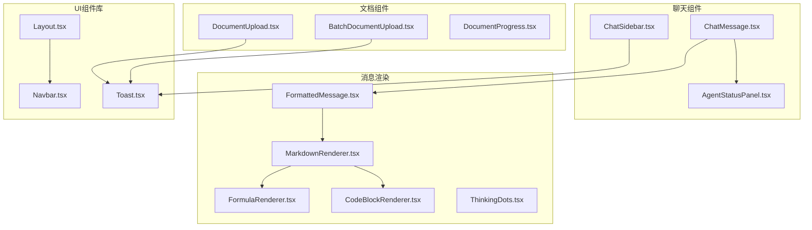
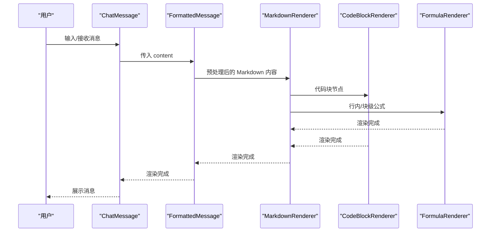
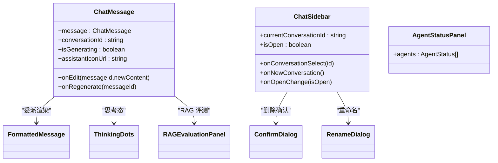
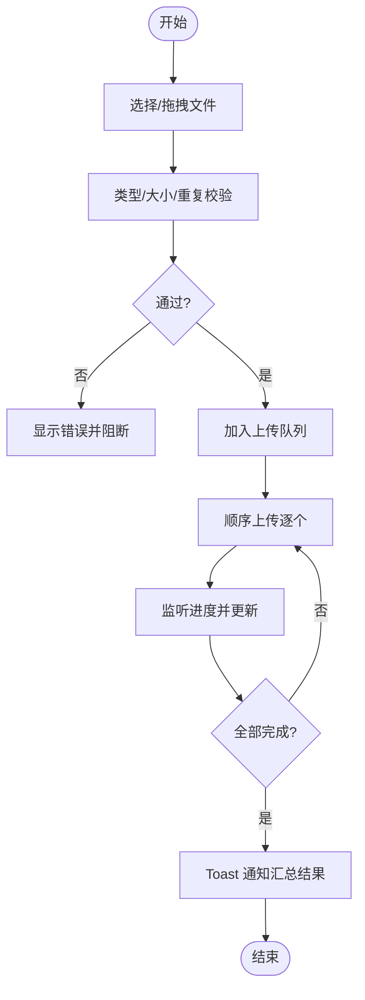
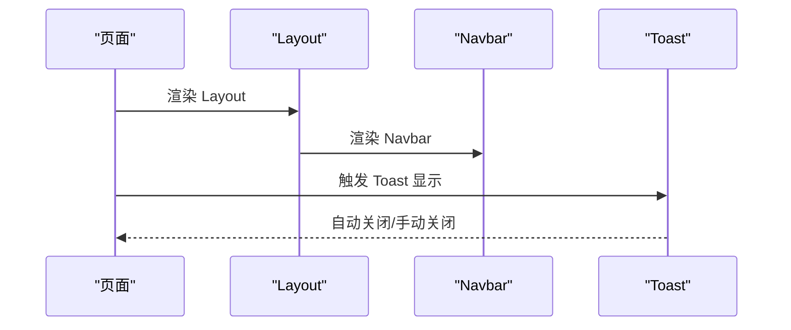
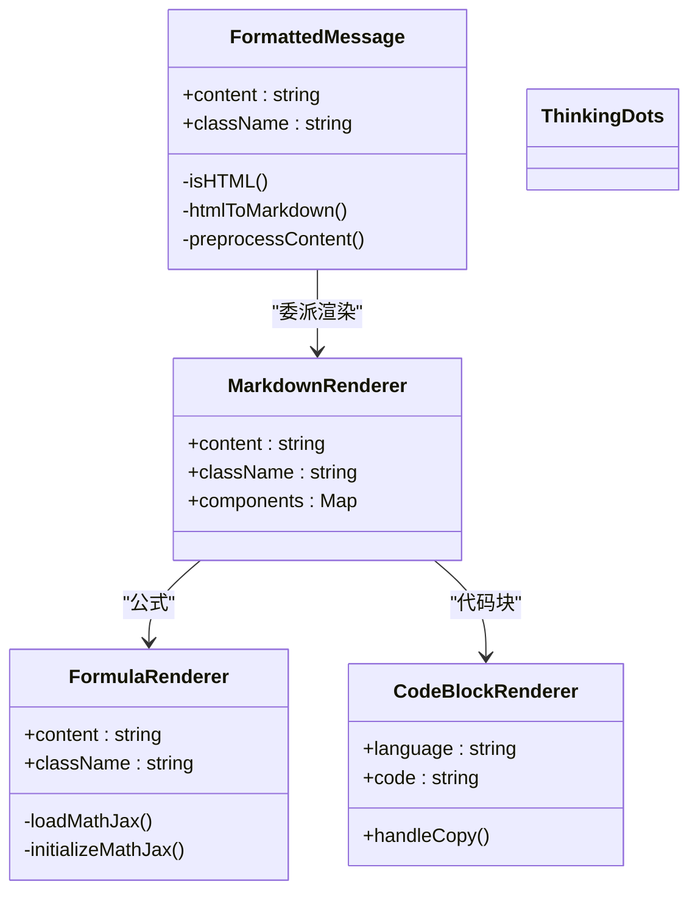
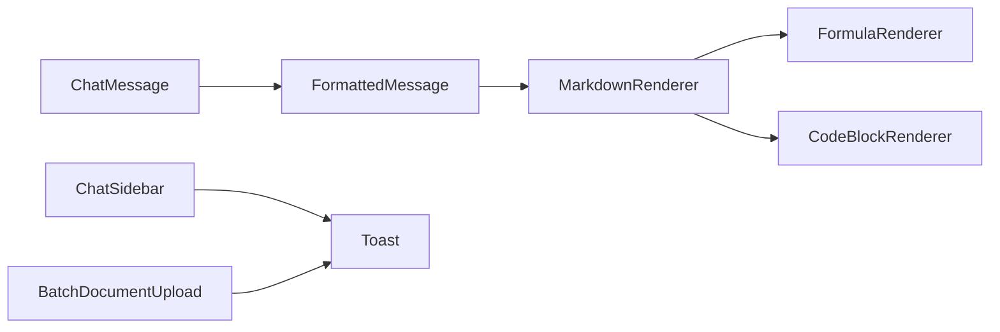

# 组件系统设计

<cite>
**本文引用的文件**
- [web/components/chat/ChatMessage.tsx](file://web/components/chat/ChatMessage.tsx)
- [web/components/chat/ChatSidebar.tsx](file://web/components/chat/ChatSidebar.tsx)
- [web/components/chat/AgentStatusPanel.tsx](file://web/components/chat/AgentStatusPanel.tsx)
- [web/components/document/DocumentUpload.tsx](file://web/components/document/DocumentUpload.tsx)
- [web/components/document/BatchDocumentUpload.tsx](file://web/components/document/BatchDocumentUpload.tsx)
- [web/components/document/DocumentProgress.tsx](file://web/components/document/DocumentProgress.tsx)
- [web/components/message/FormattedMessage.tsx](file://web/components/message/FormattedMessage.tsx)
- [web/components/message/MarkdownRenderer.tsx](file://web/components/message/MarkdownRenderer.tsx)
- [web/components/message/FormulaRenderer.tsx](file://web/components/message/FormulaRenderer.tsx)
- [web/components/message/CodeBlockRenderer.tsx](file://web/components/message/CodeBlockRenderer.tsx)
- [web/components/message/ThinkingDots.tsx](file://web/components/message/ThinkingDots.tsx)
- [web/components/ui/Layout.tsx](file://web/components/ui/Layout.tsx)
- [web/components/ui/Navbar.tsx](file://web/components/ui/Navbar.tsx)
- [web/components/ui/Toast.tsx](file://web/components/ui/Toast.tsx)
- [web/types/chat.ts](file://web/types/chat.ts)
- [web/types/conversation.ts](file://web/types/conversation.ts)
</cite>

## 目录
1. [引言](#引言)
2. [项目结构](#项目结构)
3. [核心组件](#核心组件)
4. [架构总览](#架构总览)
5. [详细组件分析](#详细组件分析)
6. [依赖分析](#依赖分析)
7. [性能考虑](#性能考虑)
8. [故障排查指南](#故障排查指南)
9. [结论](#结论)
10. [附录](#附录)

## 引言
本设计文档面向 Advanced RAG 组件系统，聚焦于组件分类、设计原则与复用策略，系统阐述聊天组件（ChatMessage、ChatSidebar、AgentStatusPanel）、文档组件（DocumentUpload、BatchDocumentUpload、DocumentProgress）、UI 组件库（Layout、Navbar、Toast）以及消息渲染组件（CodeBlockRenderer、FormulaRenderer、MarkdownRenderer）的设计与交互逻辑，并提供组件开发最佳实践，帮助开发者高效构建与维护高质量前端组件。

## 项目结构
组件位于 Next.js 应用的 web/components 目录下，按功能域划分：
- chat：聊天与代理状态面板
- document：文档上传与进度展示
- message：消息格式化与渲染
- ui：通用 UI 布局与控件
- types：组件与业务类型定义

图表来源
- [web/components/chat/ChatMessage.tsx:1-182](file://web/components/chat/ChatMessage.tsx#L1-L182)
- [web/components/chat/ChatSidebar.tsx:1-367](file://web/components/chat/ChatSidebar.tsx#L1-L367)
- [web/components/chat/AgentStatusPanel.tsx:1-348](file://web/components/chat/AgentStatusPanel.tsx#L1-L348)
- [web/components/document/DocumentUpload.tsx:1-239](file://web/components/document/DocumentUpload.tsx#L1-L239)
- [web/components/document/BatchDocumentUpload.tsx:1-512](file://web/components/document/BatchDocumentUpload.tsx#L1-L512)
- [web/components/document/DocumentProgress.tsx:1-54](file://web/components/document/DocumentProgress.tsx#L1-L54)
- [web/components/message/FormattedMessage.tsx:1-255](file://web/components/message/FormattedMessage.tsx#L1-L255)
- [web/components/message/MarkdownRenderer.tsx:1-307](file://web/components/message/MarkdownRenderer.tsx#L1-L307)
- [web/components/message/FormulaRenderer.tsx:1-612](file://web/components/message/FormulaRenderer.tsx#L1-L612)
- [web/components/message/CodeBlockRenderer.tsx:1-119](file://web/components/message/CodeBlockRenderer.tsx#L1-L119)
- [web/components/message/ThinkingDots.tsx:1-26](file://web/components/message/ThinkingDots.tsx#L1-L26)
- [web/components/ui/Layout.tsx:1-61](file://web/components/ui/Layout.tsx#L1-L61)
- [web/components/ui/Navbar.tsx:1-125](file://web/components/ui/Navbar.tsx#L1-L125)
- [web/components/ui/Toast.tsx:1-66](file://web/components/ui/Toast.tsx#L1-L66)

章节来源
- [web/components/chat/ChatMessage.tsx:1-182](file://web/components/chat/ChatMessage.tsx#L1-L182)
- [web/components/chat/ChatSidebar.tsx:1-367](file://web/components/chat/ChatSidebar.tsx#L1-L367)
- [web/components/chat/AgentStatusPanel.tsx:1-348](file://web/components/chat/AgentStatusPanel.tsx#L1-L348)
- [web/components/document/DocumentUpload.tsx:1-239](file://web/components/document/DocumentUpload.tsx#L1-L239)
- [web/components/document/BatchDocumentUpload.tsx:1-512](file://web/components/document/BatchDocumentUpload.tsx#L1-L512)
- [web/components/document/DocumentProgress.tsx:1-54](file://web/components/document/DocumentProgress.tsx#L1-L54)
- [web/components/message/FormattedMessage.tsx:1-255](file://web/components/message/FormattedMessage.tsx#L1-L255)
- [web/components/message/MarkdownRenderer.tsx:1-307](file://web/components/message/MarkdownRenderer.tsx#L1-L307)
- [web/components/message/FormulaRenderer.tsx:1-612](file://web/components/message/FormulaRenderer.tsx#L1-L612)
- [web/components/message/CodeBlockRenderer.tsx:1-119](file://web/components/message/CodeBlockRenderer.tsx#L1-L119)
- [web/components/message/ThinkingDots.tsx:1-26](file://web/components/message/ThinkingDots.tsx#L1-L26)
- [web/components/ui/Layout.tsx:1-61](file://web/components/ui/Layout.tsx#L1-L61)
- [web/components/ui/Navbar.tsx:1-125](file://web/components/ui/Navbar.tsx#L1-L125)
- [web/components/ui/Toast.tsx:1-66](file://web/components/ui/Toast.tsx#L1-L66)

## 核心组件
- 聊天组件：负责单条消息展示、编辑、重新生成、思考态占位、来源与 RAG 评测面板集成。
- 文档组件：支持单文件拖拽/选择上传、批量上传、进度可视化与错误提示。
- UI 组件库：提供布局切换（允许/不允许滚动）、导航栏与全局 Toast 通知。
- 消息渲染组件：统一处理 Markdown、行内/块级公式、代码块高亮与复制。

章节来源
- [web/components/chat/ChatMessage.tsx:10-17](file://web/components/chat/ChatMessage.tsx#L10-L17)
- [web/components/document/DocumentUpload.tsx:6-9](file://web/components/document/DocumentUpload.tsx#L6-L9)
- [web/components/document/BatchDocumentUpload.tsx:7-10](file://web/components/document/BatchDocumentUpload.tsx#L7-L10)
- [web/components/ui/Layout.tsx:6-10](file://web/components/ui/Layout.tsx#L6-L10)
- [web/components/ui/Toast.tsx:7-13](file://web/components/ui/Toast.tsx#L7-L13)
- [web/components/message/FormattedMessage.tsx:6-9](file://web/components/message/FormattedMessage.tsx#L6-L9)

## 架构总览
组件系统采用“职责单一 + 委托渲染”的模式：
- ChatMessage 作为消息容器，委派内容渲染至 FormattedMessage。
- FormattedMessage 预处理 HTML/公式，再交由 MarkdownRenderer。
- MarkdownRenderer 使用 remarkGfm + rehypeRaw + rehypeHighlight，将代码块委托给 CodeBlockRenderer，将数学公式委托给 FormulaRenderer。
- FormulaRenderer 优先使用 KaTeX，不支持时回退到 MathJax，并做字体加载容错。
- UI 组件库提供 Layout/Navbar/Toast，贯穿全站风格与交互。

图表来源
- [web/components/chat/ChatMessage.tsx:114-116](file://web/components/chat/ChatMessage.tsx#L114-L116)
- [web/components/message/FormattedMessage.tsx:105-163](file://web/components/message/FormattedMessage.tsx#L105-L163)
- [web/components/message/MarkdownRenderer.tsx:21-307](file://web/components/message/MarkdownRenderer.tsx#L21-L307)
- [web/components/message/CodeBlockRenderer.tsx:18-119](file://web/components/message/CodeBlockRenderer.tsx#L18-L119)
- [web/components/message/FormulaRenderer.tsx:38-498](file://web/components/message/FormulaRenderer.tsx#L38-L498)

## 详细组件分析

### 聊天组件体系
- ChatMessage
  - 职责：渲染单条消息、编辑/重新生成、思考态占位、来源与 RAG 评测面板。
  - 设计要点：Props 仅包含必要字段；编辑态与非编辑态切换；对 assistant 图标 URL 做本地/远程兼容；对空生成内容显示 ThinkingDots。
  - 交互：编辑保存、重新生成、悬停工具条可见性。
- ChatSidebar
  - 职责：对话历史列表、新建/重命名/删除、折叠/展开、移动端遮罩与开关。
  - 设计要点：支持外部 isOpen 与内部状态双模式；本地持久化折叠状态；定时刷新对话列表；双击重命名。
- AgentStatusPanel
  - 职责：展示多 Agent 工作流状态、总体进度、当前步骤、运行时长。
  - 设计要点：确保所有 Agent 类型均显示（含默认 pending），实时更新时间戳，支持展开/折叠详情。

图表来源
- [web/components/chat/ChatMessage.tsx:10-17](file://web/components/chat/ChatMessage.tsx#L10-L17)
- [web/components/chat/ChatSidebar.tsx:15-21](file://web/components/chat/ChatSidebar.tsx#L15-L21)
- [web/components/chat/AgentStatusPanel.tsx:16-18](file://web/components/chat/AgentStatusPanel.tsx#L16-L18)

章节来源
- [web/components/chat/ChatMessage.tsx:19-177](file://web/components/chat/ChatMessage.tsx#L19-L177)
- [web/components/chat/ChatSidebar.tsx:23-364](file://web/components/chat/ChatSidebar.tsx#L23-L364)
- [web/components/chat/AgentStatusPanel.tsx:54-345](file://web/components/chat/AgentStatusPanel.tsx#L54-L345)
- [web/types/chat.ts:21-34](file://web/types/chat.ts#L21-L34)
- [web/types/conversation.ts:1-10](file://web/types/conversation.ts#L1-L10)

### 文档组件体系
- DocumentUpload
  - 职责：单文件拖拽/选择上传，类型与大小校验，进度条与错误提示。
  - 设计要点：基于 XHR 监听上传进度；限制 200MB；支持 .doc 自动转换为 .docx。
- BatchDocumentUpload
  - 职责：批量文件选择、逐个顺序上传、状态管理、Toast 通知。
  - 设计要点：文件去重、类型/大小/空文件校验；顺序上传避免服务器压力；每个文件上传后延迟。
- DocumentProgress
  - 职责：展示单文档处理进度百分比、当前阶段与阶段详情。
  - 设计要点：仅在 processing 状态下展示；使用过渡动画更新宽度。

图表来源
- [web/components/document/BatchDocumentUpload.tsx:58-303](file://web/components/document/BatchDocumentUpload.tsx#L58-L303)
- [web/components/document/DocumentUpload.tsx:48-161](file://web/components/document/DocumentUpload.tsx#L48-L161)
- [web/components/document/DocumentProgress.tsx:10-53](file://web/components/document/DocumentProgress.tsx#L10-L53)

章节来源
- [web/components/document/DocumentUpload.tsx:11-161](file://web/components/document/DocumentUpload.tsx#L11-L161)
- [web/components/document/BatchDocumentUpload.tsx:19-303](file://web/components/document/BatchDocumentUpload.tsx#L19-L303)
- [web/components/document/DocumentProgress.tsx:10-53](file://web/components/document/DocumentProgress.tsx#L10-L53)

### UI 组件库
- Layout
  - 职责：提供两种布局模式（允许滚动/禁止滚动），统一 Navbar 与内容区间距。
  - 设计要点：allowScroll 控制滚动行为；移动端安全区域适配。
- Navbar
  - 职责：顶部导航，移动端菜单，与 ChatSidebar 事件联动。
  - 设计要点：根据路径高亮；移动端展开/收起动画。
- Toast
  - 职责：全局通知，支持多种类型与自动关闭。
  - 设计要点：受控 isOpen；duration 控制显示时长；点击关闭。

图表来源
- [web/components/ui/Layout.tsx:12-59](file://web/components/ui/Layout.tsx#L12-L59)
- [web/components/ui/Navbar.tsx:6-122](file://web/components/ui/Navbar.tsx#L6-L122)
- [web/components/ui/Toast.tsx:15-64](file://web/components/ui/Toast.tsx#L15-L64)

章节来源
- [web/components/ui/Layout.tsx:12-59](file://web/components/ui/Layout.tsx#L12-L59)
- [web/components/ui/Navbar.tsx:6-122](file://web/components/ui/Navbar.tsx#L6-L122)
- [web/components/ui/Toast.tsx:15-64](file://web/components/ui/Toast.tsx#L15-L64)

### 消息渲染组件
- FormattedMessage
  - 职责：HTML 检测与转换、块级公式预处理（转为 math 代码块）、委派渲染。
  - 设计要点：服务端/客户端差异化处理；避免误伤现有代码块占位符。
- MarkdownRenderer
  - 职责：Markdown 渲染，代码块高亮，公式委托，表格/标题/列表/引用等样式。
  - 设计要点：remarkGfm + rehypeRaw + rehypeHighlight；代码块语言识别；数学公式检测。
- FormulaRenderer
  - 职责：优先 KaTeX，不支持时回退 MathJax；字体加载容错；行内公式标识圈。
  - 设计要点：按需加载 MathJax；全局错误捕获；超时保护；深色模式样式。
- CodeBlockRenderer
  - 职责：代码块高亮与复制；语言名称映射；头部信息与复制反馈。
- ThinkingDots
  - 职责：GPU 预热期间的思考态占位动画。

图表来源
- [web/components/message/FormattedMessage.tsx:105-163](file://web/components/message/FormattedMessage.tsx#L105-L163)
- [web/components/message/MarkdownRenderer.tsx:21-307](file://web/components/message/MarkdownRenderer.tsx#L21-L307)
- [web/components/message/FormulaRenderer.tsx:38-498](file://web/components/message/FormulaRenderer.tsx#L38-L498)
- [web/components/message/CodeBlockRenderer.tsx:18-119](file://web/components/message/CodeBlockRenderer.tsx#L18-L119)
- [web/components/message/ThinkingDots.tsx:7-24](file://web/components/message/ThinkingDots.tsx#L7-L24)

章节来源
- [web/components/message/FormattedMessage.tsx:105-163](file://web/components/message/FormattedMessage.tsx#L105-L163)
- [web/components/message/MarkdownRenderer.tsx:21-307](file://web/components/message/MarkdownRenderer.tsx#L21-L307)
- [web/components/message/FormulaRenderer.tsx:38-498](file://web/components/message/FormulaRenderer.tsx#L38-L498)
- [web/components/message/CodeBlockRenderer.tsx:18-119](file://web/components/message/CodeBlockRenderer.tsx#L18-L119)
- [web/components/message/ThinkingDots.tsx:7-24](file://web/components/message/ThinkingDots.tsx#L7-L24)

## 依赖分析
- 组件间依赖
  - ChatMessage 依赖 FormattedMessage、ThinkingDots、RAGEvaluationPanel。
  - FormattedMessage 依赖 MarkdownRenderer。
  - MarkdownRenderer 依赖 FormulaRenderer、CodeBlockRenderer。
  - ChatSidebar 依赖 ConfirmDialog、RenameDialog、LocalStorage。
  - BatchDocumentUpload 依赖 Toast。
- 外部依赖
  - 公式渲染：KaTeX（优先）、MathJax（回退）。
  - 代码高亮：rehype-highlight、highlight.js。
  - Markdown：react-markdown、remarkGfm、rehypeRaw。

图表来源
- [web/components/chat/ChatMessage.tsx:5-7](file://web/components/chat/ChatMessage.tsx#L5-L7)
- [web/components/message/FormattedMessage.tsx](file://web/components/message/FormattedMessage.tsx#L4)
- [web/components/message/MarkdownRenderer.tsx:4-7](file://web/components/message/MarkdownRenderer.tsx#L4-L7)
- [web/components/message/FormulaRenderer.tsx](file://web/components/message/FormulaRenderer.tsx#L4)
- [web/components/message/CodeBlockRenderer.tsx](file://web/components/message/CodeBlockRenderer.tsx#L4)
- [web/components/chat/ChatSidebar.tsx:11-12](file://web/components/chat/ChatSidebar.tsx#L11-L12)
- [web/components/document/BatchDocumentUpload.tsx](file://web/components/document/BatchDocumentUpload.tsx#L5)

章节来源
- [web/components/chat/ChatMessage.tsx:5-7](file://web/components/chat/ChatMessage.tsx#L5-L7)
- [web/components/message/MarkdownRenderer.tsx:4-7](file://web/components/message/MarkdownRenderer.tsx#L4-L7)
- [web/components/message/FormulaRenderer.tsx](file://web/components/message/FormulaRenderer.tsx#L4)
- [web/components/message/CodeBlockRenderer.tsx](file://web/components/message/CodeBlockRenderer.tsx#L4)
- [web/components/chat/ChatSidebar.tsx:11-12](file://web/components/chat/ChatSidebar.tsx#L11-L12)
- [web/components/document/BatchDocumentUpload.tsx](file://web/components/document/BatchDocumentUpload.tsx#L5)

## 性能考虑
- 渲染性能
  - ChatMessage 使用 memo 包裹，避免不必要的重渲染。
  - MarkdownRenderer 通过组件映射精确处理代码块与公式，减少无关节点。
  - FormulaRenderer 优先 KaTeX，减少 MathJax 初始化成本；字体加载失败容错，避免阻塞。
- 上传性能
  - BatchDocumentUpload 顺序上传，降低服务器压力；XHR 监听进度，避免轮询。
  - DocumentUpload 使用 XHR 上传，支持超时与错误处理。
- 交互性能
  - ChatSidebar 折叠状态本地持久化，减少重复计算。
  - Toast 受控显示，避免频繁创建销毁。

## 故障排查指南
- 公式渲染异常
  - 现象：公式未渲染或渲染失败。
  - 排查：确认内容是否包含行内/块级公式；查看 FormulaRenderer 日志与回退逻辑；检查 MathJax CDN 加载状态。
- 代码高亮缺失
  - 现象：代码块无语法高亮。
  - 排查：确认语言类名是否存在；检查 rehype-highlight 是否生效；核对 highlight.js 样式引入。
- 上传失败
  - 现象：文件无法上传或报错。
  - 排查：检查文件类型/大小限制；确认知识空间 ID；查看 XHR 错误与超时配置。
- 侧边栏状态不同步
  - 现象：折叠状态与预期不符。
  - 排查：确认 isOpen 外部/内部状态来源；检查 LocalStorage 写入与读取。

章节来源
- [web/components/message/FormulaRenderer.tsx:45-231](file://web/components/message/FormulaRenderer.tsx#L45-L231)
- [web/components/message/MarkdownRenderer.tsx:47-292](file://web/components/message/MarkdownRenderer.tsx#L47-L292)
- [web/components/document/DocumentUpload.tsx:48-161](file://web/components/document/DocumentUpload.tsx#L48-L161)
- [web/components/document/BatchDocumentUpload.tsx:137-303](file://web/components/document/BatchDocumentUpload.tsx#L137-L303)
- [web/components/chat/ChatSidebar.tsx:42-48](file://web/components/chat/ChatSidebar.tsx#L42-L48)

## 结论
该组件系统通过清晰的职责划分与委托渲染机制，实现了从消息到公式的完整渲染链路，同时在上传、侧边栏与通知等场景提供了稳健的用户体验。建议在后续迭代中持续关注渲染性能与错误兜底，进一步完善组件的可测试性与可维护性。

## 附录
- 组件开发最佳实践
  - Props 设计：最小化必要字段，使用明确的类型定义；对外暴露稳定接口。
  - 事件处理：统一回调命名（onEdit/onRegenerate），传递必要上下文（messageId/conversationId）。
  - 状态管理：优先使用受控组件；必要时结合本地状态与外部状态（如 isOpen）。
  - 性能优化：合理使用 memo；避免在渲染阶段进行昂贵计算；按需加载第三方库。
  - 错误处理：提供友好的错误提示与回退方案；记录可控日志，避免泄露敏感信息。
  - 可访问性：为交互元素提供明确的 ARIA 标签与键盘支持；保证深色模式一致性。