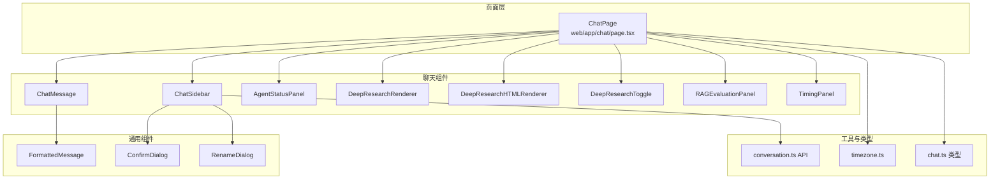
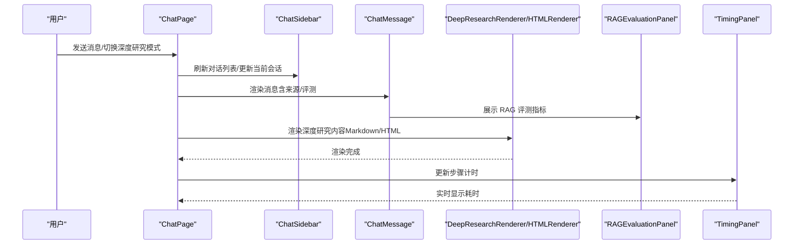
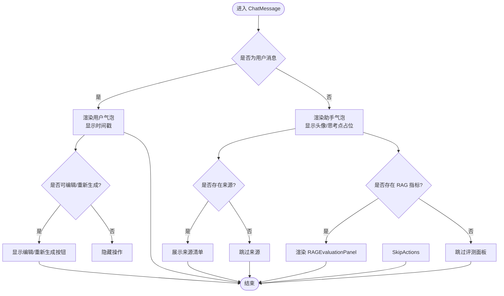
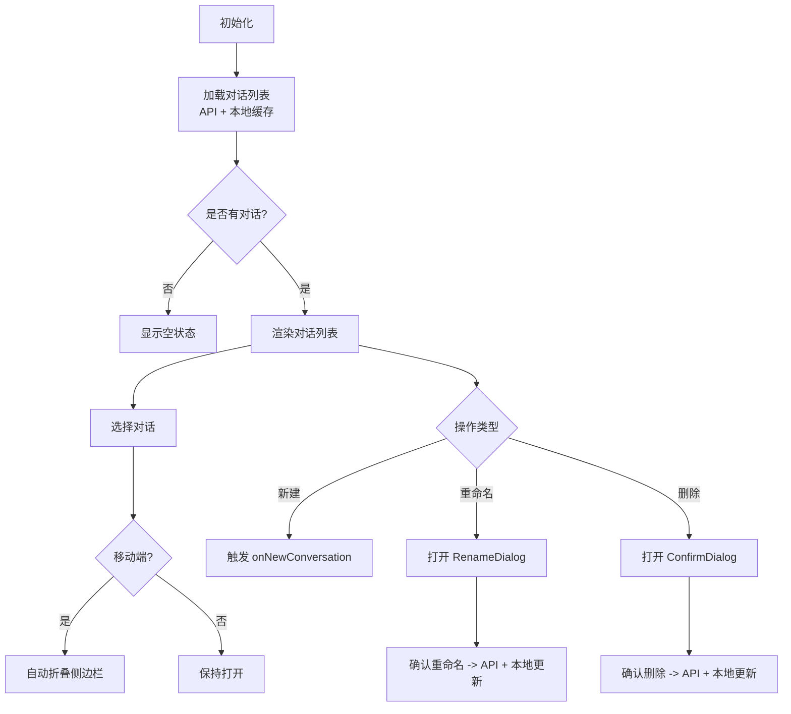
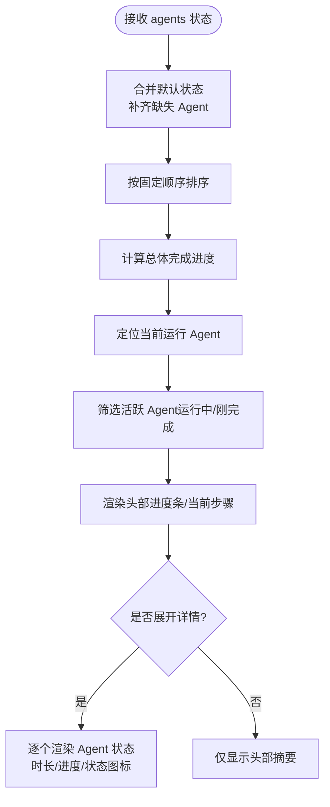
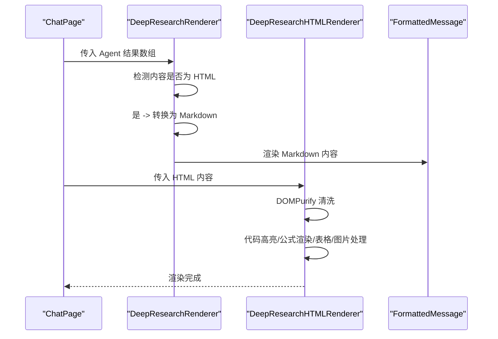
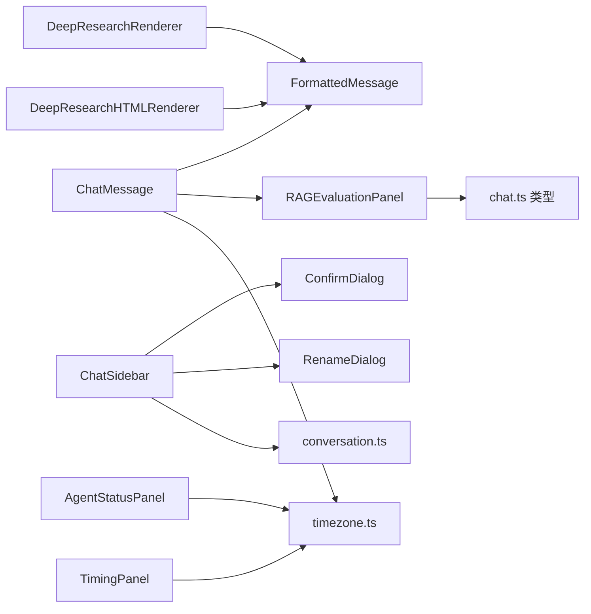

# 聊天组件系统

<cite>
**本文引用的文件**
- [web/app/chat/page.tsx](file://web/app/chat/page.tsx)
- [web/components/chat/ChatMessage.tsx](file://web/components/chat/ChatMessage.tsx)
- [web/components/chat/ChatSidebar.tsx](file://web/components/chat/ChatSidebar.tsx)
- [web/components/chat/AgentStatusPanel.tsx](file://web/components/chat/AgentStatusPanel.tsx)
- [web/components/chat/DeepResearchHTMLRenderer.tsx](file://web/components/chat/DeepResearchHTMLRenderer.tsx)
- [web/components/chat/DeepResearchRenderer.tsx](file://web/components/chat/DeepResearchRenderer.tsx)
- [web/components/chat/DeepResearchToggle.tsx](file://web/components/chat/DeepResearchToggle.tsx)
- [web/components/chat/RAGEvaluationPanel.tsx](file://web/components/chat/RAGEvaluationPanel.tsx)
- [web/components/chat/TimingPanel.tsx](file://web/components/chat/TimingPanel.tsx)
- [web/components/message/FormattedMessage.tsx](file://web/components/message/FormattedMessage.tsx)
- [web/components/ui/ConfirmDialog.tsx](file://web/components/ui/ConfirmDialog.tsx)
- [web/components/ui/RenameDialog.tsx](file://web/components/ui/RenameDialog.tsx)
- [web/lib/conversation.ts](file://web/lib/conversation.ts)
- [web/lib/timezone.ts](file://web/lib/timezone.ts)
- [web/types/chat.ts](file://web/types/chat.ts)
</cite>

## 目录
1. [简介](#简介)
2. [项目结构](#项目结构)
3. [核心组件](#核心组件)
4. [架构总览](#架构总览)
5. [详细组件分析](#详细组件分析)
6. [依赖分析](#依赖分析)
7. [性能考虑](#性能考虑)
8. [故障排查指南](#故障排查指南)
9. [结论](#结论)
10. [附录](#附录)

## 简介
本技术文档面向 Advanced RAG 聊天组件系统，聚焦聊天界面的核心组件与深度研究模式相关能力，包括：
- ChatMessage 组件的消息渲染与交互
- ChatSidebar 组件的侧边栏管理与持久化
- AgentStatusPanel 组件的多 Agent 状态可视化
- 深度研究模式：DeepResearchRenderer 与 DeepResearchHTMLRenderer 的内容渲染
- DeepResearchToggle 的模式切换与持久化
- RAGEvaluationPanel 的 RAG 评测指标展示
- TimingPanel 的步骤计时与实时统计

文档同时阐述组件间通信机制、状态管理模式以及性能优化策略，并提供可操作的使用场景与扩展建议。

## 项目结构
聊天组件位于 web/components/chat 下，页面入口为 web/app/chat/page.tsx。组件之间通过 props 传递数据，部分状态通过本地存储（localStorage）持久化，时间格式化统一由 web/lib/timezone.ts 提供。

图表来源
- [web/app/chat/page.tsx:1-800](file://web/app/chat/page.tsx#L1-L800)
- [web/components/chat/ChatMessage.tsx:1-182](file://web/components/chat/ChatMessage.tsx#L1-L182)
- [web/components/chat/ChatSidebar.tsx:1-367](file://web/components/chat/ChatSidebar.tsx#L1-L367)
- [web/components/chat/AgentStatusPanel.tsx:1-348](file://web/components/chat/AgentStatusPanel.tsx#L1-L348)
- [web/components/chat/DeepResearchRenderer.tsx:1-177](file://web/components/chat/DeepResearchRenderer.tsx#L1-L177)
- [web/components/chat/DeepResearchHTMLRenderer.tsx:1-235](file://web/components/chat/DeepResearchHTMLRenderer.tsx#L1-L235)
- [web/components/chat/DeepResearchToggle.tsx:1-53](file://web/components/chat/DeepResearchToggle.tsx#L1-L53)
- [web/components/chat/RAGEvaluationPanel.tsx:1-121](file://web/components/chat/RAGEvaluationPanel.tsx#L1-L121)
- [web/components/chat/TimingPanel.tsx:1-112](file://web/components/chat/TimingPanel.tsx#L1-L112)
- [web/components/message/FormattedMessage.tsx:1-255](file://web/components/message/FormattedMessage.tsx#L1-L255)
- [web/components/ui/ConfirmDialog.tsx:1-119](file://web/components/ui/ConfirmDialog.tsx#L1-L119)
- [web/components/ui/RenameDialog.tsx:1-127](file://web/components/ui/RenameDialog.tsx#L1-L127)
- [web/lib/conversation.ts:1-129](file://web/lib/conversation.ts#L1-L129)
- [web/lib/timezone.ts:1-110](file://web/lib/timezone.ts#L1-L110)
- [web/types/chat.ts:1-99](file://web/types/chat.ts#L1-L99)

章节来源
- [web/app/chat/page.tsx:1-800](file://web/app/chat/page.tsx#L1-L800)
- [web/components/chat/ChatMessage.tsx:1-182](file://web/components/chat/ChatMessage.tsx#L1-L182)
- [web/components/chat/ChatSidebar.tsx:1-367](file://web/components/chat/ChatSidebar.tsx#L1-L367)
- [web/components/chat/AgentStatusPanel.tsx:1-348](file://web/components/chat/AgentStatusPanel.tsx#L1-L348)
- [web/components/chat/DeepResearchRenderer.tsx:1-177](file://web/components/chat/DeepResearchRenderer.tsx#L1-L177)
- [web/components/chat/DeepResearchHTMLRenderer.tsx:1-235](file://web/components/chat/DeepResearchHTMLRenderer.tsx#L1-L235)
- [web/components/chat/DeepResearchToggle.tsx:1-53](file://web/components/chat/DeepResearchToggle.tsx#L1-L53)
- [web/components/chat/RAGEvaluationPanel.tsx:1-121](file://web/components/chat/RAGEvaluationPanel.tsx#L1-L121)
- [web/components/chat/TimingPanel.tsx:1-112](file://web/components/chat/TimingPanel.tsx#L1-L112)
- [web/components/message/FormattedMessage.tsx:1-255](file://web/components/message/FormattedMessage.tsx#L1-L255)
- [web/components/ui/ConfirmDialog.tsx:1-119](file://web/components/ui/ConfirmDialog.tsx#L1-L119)
- [web/components/ui/RenameDialog.tsx:1-127](file://web/components/ui/RenameDialog.tsx#L1-L127)
- [web/lib/conversation.ts:1-129](file://web/lib/conversation.ts#L1-L129)
- [web/lib/timezone.ts:1-110](file://web/lib/timezone.ts#L1-L110)
- [web/types/chat.ts:1-99](file://web/types/chat.ts#L1-L99)

## 核心组件
- ChatMessage：负责单条消息的渲染、编辑、重新生成、来源与 RAG 评测面板展示、思考点占位等。
- ChatSidebar：管理对话历史列表、新建/重命名/删除对话、移动端遮罩与折叠状态、本地持久化。
- AgentStatusPanel：展示多 Agent 工作流的总体进度、当前步骤、运行时长与详细状态。
- DeepResearchRenderer/DeepResearchHTMLRenderer：分别处理 Markdown 与 HTML 内容的渲染与安全净化、公式渲染、表格/图片响应式处理。
- DeepResearchToggle：深度研究模式开关，状态持久化至 localStorage。
- RAGEvaluationPanel：RAG 评测指标面板，支持阈值告警与折叠展开。
- TimingPanel：步骤计时面板，实时显示各阶段耗时与总体耗时。

章节来源
- [web/components/chat/ChatMessage.tsx:1-182](file://web/components/chat/ChatMessage.tsx#L1-L182)
- [web/components/chat/ChatSidebar.tsx:1-367](file://web/components/chat/ChatSidebar.tsx#L1-L367)
- [web/components/chat/AgentStatusPanel.tsx:1-348](file://web/components/chat/AgentStatusPanel.tsx#L1-L348)
- [web/components/chat/DeepResearchRenderer.tsx:1-177](file://web/components/chat/DeepResearchRenderer.tsx#L1-L177)
- [web/components/chat/DeepResearchHTMLRenderer.tsx:1-235](file://web/components/chat/DeepResearchHTMLRenderer.tsx#L1-L235)
- [web/components/chat/DeepResearchToggle.tsx:1-53](file://web/components/chat/DeepResearchToggle.tsx#L1-L53)
- [web/components/chat/RAGEvaluationPanel.tsx:1-121](file://web/components/chat/RAGEvaluationPanel.tsx#L1-L121)
- [web/components/chat/TimingPanel.tsx:1-112](file://web/components/chat/TimingPanel.tsx#L1-L112)

## 架构总览
聊天页面作为中枢，协调消息渲染、侧边栏、Agent 状态、深度研究模式与评测计时。页面状态通过 useState/useEffect 管理，部分关键状态持久化于 localStorage；时间格式化统一由 timezone 工具提供；对话历史通过 conversation API 与本地缓存协同维护。

图表来源
- [web/app/chat/page.tsx:1-800](file://web/app/chat/page.tsx#L1-L800)
- [web/components/chat/ChatMessage.tsx:1-182](file://web/components/chat/ChatMessage.tsx#L1-L182)
- [web/components/chat/ChatSidebar.tsx:1-367](file://web/components/chat/ChatSidebar.tsx#L1-L367)
- [web/components/chat/DeepResearchRenderer.tsx:1-177](file://web/components/chat/DeepResearchRenderer.tsx#L1-L177)
- [web/components/chat/DeepResearchHTMLRenderer.tsx:1-235](file://web/components/chat/DeepResearchHTMLRenderer.tsx#L1-L235)
- [web/components/chat/RAGEvaluationPanel.tsx:1-121](file://web/components/chat/RAGEvaluationPanel.tsx#L1-L121)
- [web/components/chat/TimingPanel.tsx:1-112](file://web/components/chat/TimingPanel.tsx#L1-L112)

## 详细组件分析

### ChatMessage 组件
职责与特性
- 根据角色渲染不同样式与头像，支持自定义头像 URL（自动补全绝对路径）。
- 支持用户消息的编辑与重新生成回调，编辑态使用 textarea 并提供保存/取消。
- 生成中且助手消息内容为空时显示“思考点”占位。
- 展示消息时间戳与来源清单（最多展示前 10 条）。
- 在助手消息中按需展示 RAGEvaluationPanel，用于呈现检索触发、召回条数、上下文长度、检索/响应耗时与告警。

渲染流程（简化）

图表来源
- [web/components/chat/ChatMessage.tsx:1-182](file://web/components/chat/ChatMessage.tsx#L1-L182)

章节来源
- [web/components/chat/ChatMessage.tsx:1-182](file://web/components/chat/ChatMessage.tsx#L1-L182)
- [web/lib/timezone.ts:86-110](file://web/lib/timezone.ts#L86-L110)
- [web/types/chat.ts:21-34](file://web/types/chat.ts#L21-L34)

### ChatSidebar 组件
职责与特性
- 加载并展示对话历史，支持新建、重命名、删除对话。
- 移动端遮罩与抽屉式侧边栏，支持折叠/展开，折叠状态持久化。
- 对话列表定期刷新（30 秒），并同步本地缓存。
- 重命名/删除对话采用 ConfirmDialog/RenameDialog 二次确认。
- 本地持久化：折叠状态、对话列表缓存。

交互流程（简化）

图表来源
- [web/components/chat/ChatSidebar.tsx:1-367](file://web/components/chat/ChatSidebar.tsx#L1-L367)
- [web/lib/conversation.ts:15-76](file://web/lib/conversation.ts#L15-L76)
- [web/components/ui/ConfirmDialog.tsx:1-119](file://web/components/ui/ConfirmDialog.tsx#L1-L119)
- [web/components/ui/RenameDialog.tsx:1-127](file://web/components/ui/RenameDialog.tsx#L1-L127)

章节来源
- [web/components/chat/ChatSidebar.tsx:1-367](file://web/components/chat/ChatSidebar.tsx#L1-L367)
- [web/lib/conversation.ts:1-129](file://web/lib/conversation.ts#L1-L129)
- [web/components/ui/ConfirmDialog.tsx:1-119](file://web/components/ui/ConfirmDialog.tsx#L1-L119)
- [web/components/ui/RenameDialog.tsx:1-127](file://web/components/ui/RenameDialog.tsx#L1-L127)

### AgentStatusPanel 组件
职责与特性
- 展示多 Agent 工作流的总体进度与当前步骤，支持展开/折叠。
- 实时更新时间（每秒），计算每个 Agent 的运行时长。
- 确保所有 Agent 类型均显示（即使尚未有状态），并按固定顺序排列。
- 活跃 Agent（运行中或刚完成）高亮显示，支持进度条与状态图标。

状态计算与渲染

图表来源
- [web/components/chat/AgentStatusPanel.tsx:1-348](file://web/components/chat/AgentStatusPanel.tsx#L1-L348)

章节来源
- [web/components/chat/AgentStatusPanel.tsx:1-348](file://web/components/chat/AgentStatusPanel.tsx#L1-L348)

### DeepResearchRenderer 与 DeepResearchHTMLRenderer
职责与特性
- DeepResearchRenderer：对 Agent 结果进行预处理，检测 HTML 内容并转换为 Markdown，再交由 FormattedMessage 渲染。
- DeepResearchHTMLRenderer：在客户端动态净化并渲染 HTML，支持代码高亮、KaTeX/MathJax 公式渲染、表格响应式、图片懒加载与外链处理，失败时降级显示原始内容。

渲染序列（简化）

图表来源
- [web/components/chat/DeepResearchRenderer.tsx:1-177](file://web/components/chat/DeepResearchRenderer.tsx#L1-L177)
- [web/components/chat/DeepResearchHTMLRenderer.tsx:1-235](file://web/components/chat/DeepResearchHTMLRenderer.tsx#L1-L235)
- [web/components/message/FormattedMessage.tsx:1-255](file://web/components/message/FormattedMessage.tsx#L1-L255)

章节来源
- [web/components/chat/DeepResearchRenderer.tsx:1-177](file://web/components/chat/DeepResearchRenderer.tsx#L1-L177)
- [web/components/chat/DeepResearchHTMLRenderer.tsx:1-235](file://web/components/chat/DeepResearchHTMLRenderer.tsx#L1-L235)
- [web/components/message/FormattedMessage.tsx:1-255](file://web/components/message/FormattedMessage.tsx#L1-L255)

### DeepResearchToggle 组件
职责与特性
- 提供深度研究模式开关，状态通过 localStorage 持久化。
- 首次加载时从 localStorage 读取并应用状态，保证跨会话一致性。

章节来源
- [web/components/chat/DeepResearchToggle.tsx:1-53](file://web/components/chat/DeepResearchToggle.tsx#L1-L53)

### RAGEvaluationPanel 组件
职责与特性
- 展示 RAG 评测指标（是否检索、召回条数、上下文长度、检索/响应耗时、TTFT 等）。
- 基于阈值生成告警（响应时间、检索耗时、召回条数过少）。
- 支持折叠/展开，仅在存在指标时展示。

章节来源
- [web/components/chat/RAGEvaluationPanel.tsx:1-121](file://web/components/chat/RAGEvaluationPanel.tsx#L1-L121)
- [web/types/chat.ts:3-19](file://web/types/chat.ts#L3-L19)

### TimingPanel 组件
职责与特性
- 展示步骤计时，支持实时更新（每 100ms）。
- 计算总体耗时与各步骤耗时，区分完成/进行中状态。
- 仅在存在起始时间且处于活动状态时更新。

章节来源
- [web/components/chat/TimingPanel.tsx:1-112](file://web/components/chat/TimingPanel.tsx#L1-L112)

## 依赖分析
- 组件间依赖
  - ChatMessage 依赖 FormattedMessage、ThinkingDots、RAGEvaluationPanel、时间格式化工具。
  - ChatSidebar 依赖 ConfirmDialog、RenameDialog、conversation API 与本地缓存。
  - AgentStatusPanel 依赖内置标题/描述映射与时间格式化。
  - DeepResearchRenderer/HTMLRenderer 依赖 FormattedMessage 与第三方渲染库（highlight.js、KaTeX、MathJax）。
  - RAGEvaluationPanel 依赖 chat.ts 中的 RAGEvaluationMetrics 类型。
  - TimingPanel 依赖时间格式化工具。
- 外部依赖
  - DOMPurify（isomorphic-dompurify）用于 HTML 净化。
  - highlight.js、KaTeX、MathJax 用于代码与公式渲染。
- 数据类型
  - chat.ts 定义了 ChatMessage、RAGEvaluationMetrics、SourceInfo 等核心类型。

图表来源
- [web/components/chat/ChatMessage.tsx:1-182](file://web/components/chat/ChatMessage.tsx#L1-L182)
- [web/components/chat/ChatSidebar.tsx:1-367](file://web/components/chat/ChatSidebar.tsx#L1-L367)
- [web/components/chat/AgentStatusPanel.tsx:1-348](file://web/components/chat/AgentStatusPanel.tsx#L1-L348)
- [web/components/chat/DeepResearchRenderer.tsx:1-177](file://web/components/chat/DeepResearchRenderer.tsx#L1-L177)
- [web/components/chat/DeepResearchHTMLRenderer.tsx:1-235](file://web/components/chat/DeepResearchHTMLRenderer.tsx#L1-L235)
- [web/components/chat/RAGEvaluationPanel.tsx:1-121](file://web/components/chat/RAGEvaluationPanel.tsx#L1-L121)
- [web/components/chat/TimingPanel.tsx:1-112](file://web/components/chat/TimingPanel.tsx#L1-L112)
- [web/components/message/FormattedMessage.tsx:1-255](file://web/components/message/FormattedMessage.tsx#L1-L255)
- [web/components/ui/ConfirmDialog.tsx:1-119](file://web/components/ui/ConfirmDialog.tsx#L1-L119)
- [web/components/ui/RenameDialog.tsx:1-127](file://web/components/ui/RenameDialog.tsx#L1-L127)
- [web/lib/conversation.ts:1-129](file://web/lib/conversation.ts#L1-L129)
- [web/lib/timezone.ts:1-110](file://web/lib/timezone.ts#L1-L110)
- [web/types/chat.ts:1-99](file://web/types/chat.ts#L1-L99)

章节来源
- [web/components/chat/ChatMessage.tsx:1-182](file://web/components/chat/ChatMessage.tsx#L1-L182)
- [web/components/chat/ChatSidebar.tsx:1-367](file://web/components/chat/ChatSidebar.tsx#L1-L367)
- [web/components/chat/AgentStatusPanel.tsx:1-348](file://web/components/chat/AgentStatusPanel.tsx#L1-L348)
- [web/components/chat/DeepResearchRenderer.tsx:1-177](file://web/components/chat/DeepResearchRenderer.tsx#L1-L177)
- [web/components/chat/DeepResearchHTMLRenderer.tsx:1-235](file://web/components/chat/DeepResearchHTMLRenderer.tsx#L1-L235)
- [web/components/chat/RAGEvaluationPanel.tsx:1-121](file://web/components/chat/RAGEvaluationPanel.tsx#L1-L121)
- [web/components/chat/TimingPanel.tsx:1-112](file://web/components/chat/TimingPanel.tsx#L1-L112)
- [web/components/message/FormattedMessage.tsx:1-255](file://web/components/message/FormattedMessage.tsx#L1-L255)
- [web/components/ui/ConfirmDialog.tsx:1-119](file://web/components/ui/ConfirmDialog.tsx#L1-L119)
- [web/components/ui/RenameDialog.tsx:1-127](file://web/components/ui/RenameDialog.tsx#L1-L127)
- [web/lib/conversation.ts:1-129](file://web/lib/conversation.ts#L1-L129)
- [web/lib/timezone.ts:1-110](file://web/lib/timezone.ts#L1-L110)
- [web/types/chat.ts:1-99](file://web/types/chat.ts#L1-L99)

## 性能考虑
- 渲染优化
  - ChatMessage 使用 memo 包装，避免不必要的重渲染。
  - DeepResearchHTMLRenderer 仅在 htmlContent 变化时执行净化与渲染，避免重复处理。
  - FormattedMessage 对 HTML 内容进行预处理与转换，减少下游组件负担。
- 状态持久化
  - ChatSidebar 折叠状态与对话列表缓存使用 localStorage，降低重复请求与计算成本。
  - ChatPage 对正在流式生成的状态进行短期 localStorage 持久化，提升用户体验。
- 实时更新
  - AgentStatusPanel 与 TimingPanel 仅在需要时启动定时器，减少 CPU 占用。
- 资源加载
  - DOMPurify 动态导入，避免在服务端渲染时阻塞。
  - 公式渲染（KaTeX/MathJax）与代码高亮（highlight.js）按需执行，失败时降级显示。

[本节为通用性能建议，无需特定文件引用]

## 故障排查指南
- 对话列表不刷新
  - 检查 API 请求与本地缓存更新逻辑，确认定时刷新间隔与错误处理。
  - 参考：[web/components/chat/ChatSidebar.tsx:60-82](file://web/components/chat/ChatSidebar.tsx#L60-L82)，[web/lib/conversation.ts:15-76](file://web/lib/conversation.ts#L15-L76)
- 删除/重命名对话无效
  - 确认 ConfirmDialog/RenameDialog 的确认回调已正确触发 API 调用与本地缓存更新。
  - 参考：[web/components/ui/ConfirmDialog.tsx:1-119](file://web/components/ui/ConfirmDialog.tsx#L1-L119)，[web/components/ui/RenameDialog.tsx:1-127](file://web/components/ui/RenameDialog.tsx#L1-L127)
- HTML 渲染报错或被过滤
  - 检查 DOMPurify 的允许标签/属性配置，确认动态导入是否成功。
  - 参考：[web/components/chat/DeepResearchHTMLRenderer.tsx:23-192](file://web/components/chat/DeepResearchHTMLRenderer.tsx#L23-L192)
- 公式/代码高亮不生效
  - 确认 KaTeX/MathJax/highlight.js 已正确引入，渲染失败时会降级显示。
  - 参考：[web/components/chat/DeepResearchHTMLRenderer.tsx:96-146](file://web/components/chat/DeepResearchHTMLRenderer.tsx#L96-L146)
- 时间显示异常
  - 统一使用 timezone.ts 的格式化函数，确保时区与格式一致。
  - 参考：[web/lib/timezone.ts:86-110](file://web/lib/timezone.ts#L86-L110)

章节来源
- [web/components/chat/ChatSidebar.tsx:60-82](file://web/components/chat/ChatSidebar.tsx#L60-L82)
- [web/lib/conversation.ts:15-76](file://web/lib/conversation.ts#L15-L76)
- [web/components/ui/ConfirmDialog.tsx:1-119](file://web/components/ui/ConfirmDialog.tsx#L1-L119)
- [web/components/ui/RenameDialog.tsx:1-127](file://web/components/ui/RenameDialog.tsx#L1-L127)
- [web/components/chat/DeepResearchHTMLRenderer.tsx:23-192](file://web/components/chat/DeepResearchHTMLRenderer.tsx#L23-L192)
- [web/lib/timezone.ts:86-110](file://web/lib/timezone.ts#L86-L110)

## 结论
该聊天组件系统围绕 ChatPage 进行状态编排，通过 ChatMessage、ChatSidebar、AgentStatusPanel 等组件实现消息渲染、会话管理、多 Agent 状态可视化与深度研究内容渲染。配合 RAGEvaluationPanel 与 TimingPanel，系统实现了可观测性与可调试性。通过 localStorage 持久化与动态资源加载，兼顾了性能与用户体验。建议在扩展新功能时遵循现有模式：组件职责清晰、状态集中管理、渲染性能优先、错误降级兜底。

[本节为总结性内容，无需特定文件引用]

## 附录
- 使用场景示例
  - 普通对话：ChatMessage 渲染用户/助手消息，ChatSidebar 展示历史，RAGEvaluationPanel 展示检索与响应指标。
  - 深度研究：DeepResearchToggle 开启后，AgentStatusPanel 展示多 Agent 工作流，DeepResearchRenderer/HTMLRenderer 渲染结构化内容。
  - 实时计时：TimingPanel 展示检索、生成等步骤耗时，辅助性能分析。
- 扩展建议
  - 新增 Agent：在 AgentStatusPanel 的 agentWorkflowOrder 与映射表中补充类型与标题描述。
  - 新增渲染器：在 DeepResearchRenderer/HTMLRenderer 中增加内容类型检测与转换逻辑。
  - 新增评测指标：在 chat.ts 中扩展 RAGEvaluationMetrics，并在 RAGEvaluationPanel 中新增阈值与展示项。

[本节为概念性内容，无需特定文件引用]