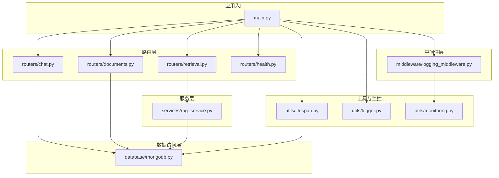
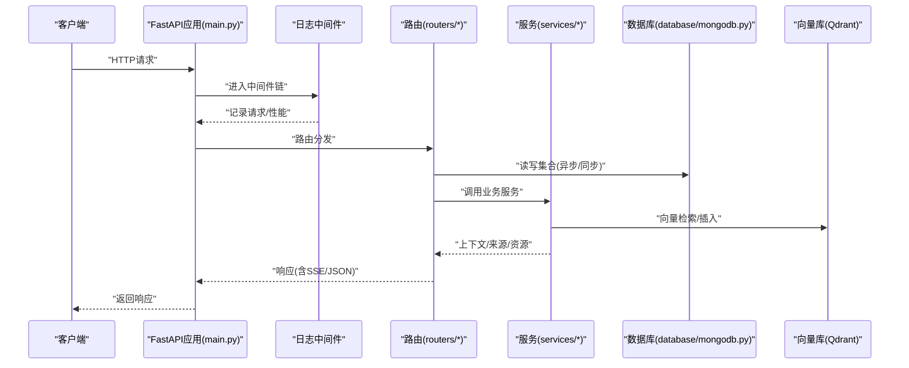
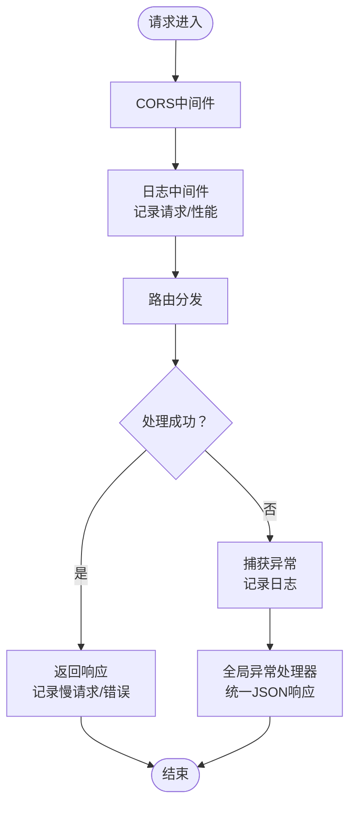
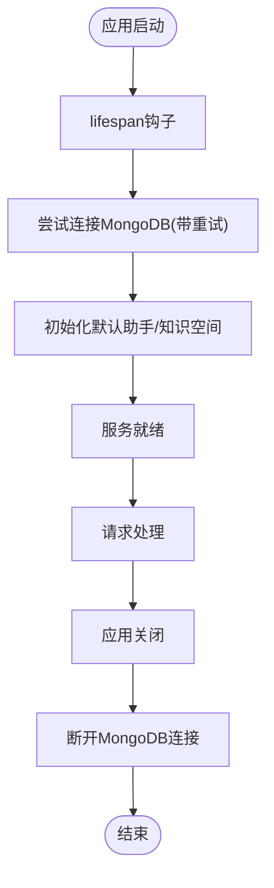
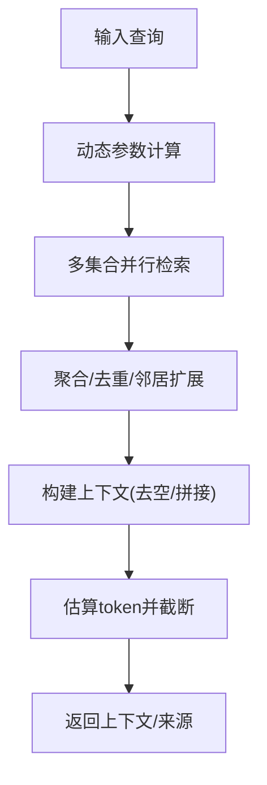
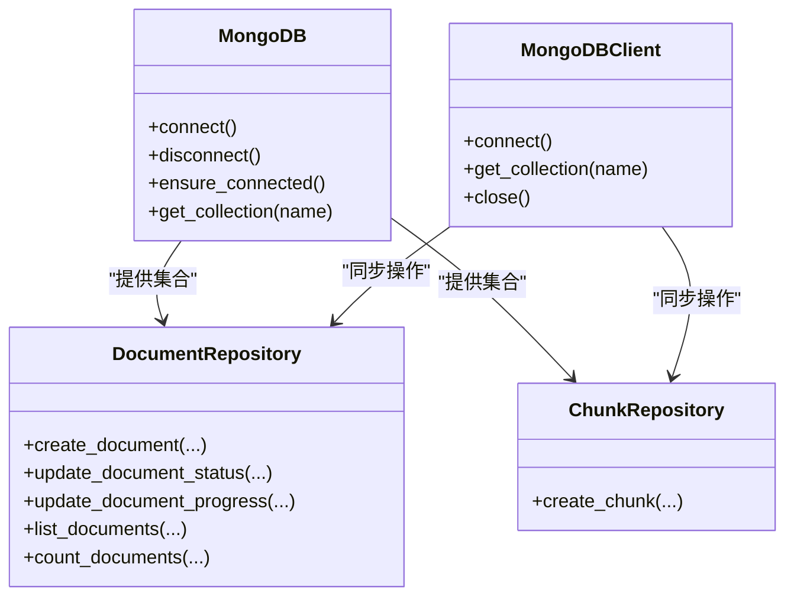
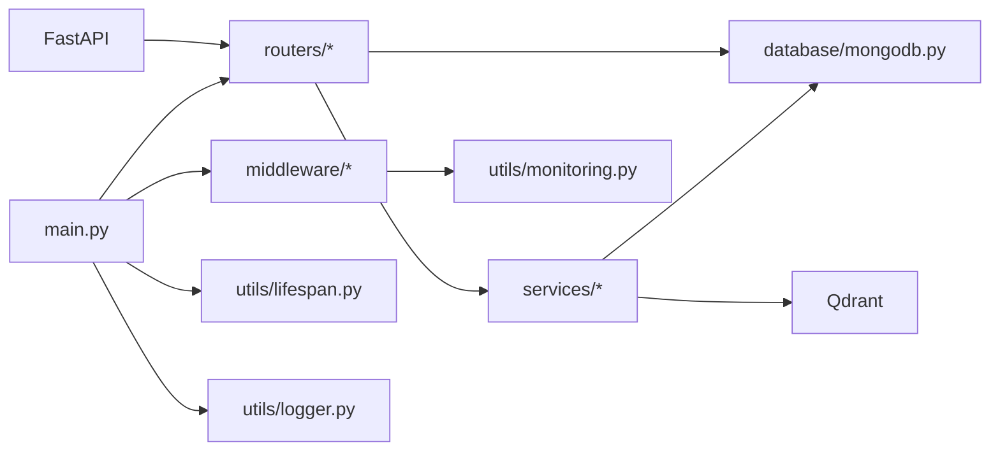

# API架构设计

<cite>
**本文引用的文件**
- [main.py](file://main.py)
- [logging_middleware.py](file://middleware/logging_middleware.py)
- [lifespan.py](file://utils/lifespan.py)
- [logger.py](file://utils/logger.py)
- [chat.py](file://routers/chat.py)
- [documents.py](file://routers/documents.py)
- [retrieval.py](file://routers/retrieval.py)
- [health.py](file://routers/health.py)
- [rag_service.py](file://services/rag_service.py)
- [mongodb.py](file://database/mongodb.py)
- [monitoring.py](file://utils/monitoring.py)
- [requirements.txt](file://requirements.txt)
- [README.md](file://README.md)
</cite>

## 目录
1. [简介](#简介)
2. [项目结构](#项目结构)
3. [核心组件](#核心组件)
4. [架构总览](#架构总览)
5. [详细组件分析](#详细组件分析)
6. [依赖分析](#依赖分析)
7. [性能考虑](#性能考虑)
8. [故障排查指南](#故障排查指南)
9. [结论](#结论)
10. [附录](#附录)

## 简介
本文件面向Advanced RAG API的架构设计与实现，围绕FastAPI应用的三层职责分离（路由层、中间件层、服务层）展开，系统性阐述：
- 路由模块的设计原则：URL模式、HTTP方法映射、请求参数验证、响应格式标准化
- 中间件配置体系：日志记录、CORS、异常处理
- 应用生命周期管理：启动/关闭钩子、数据库连接池初始化、缓存与监控
- 性能优化与最佳实践：连接池、异步流式响应、超时与重试、降级策略
- 实操指引：新增路由、配置中间件、异常处理与监控

## 项目结构
后端采用模块化分层组织：
- 应用入口与中间件：main.py、middleware/logging_middleware.py
- 生命周期与日志：utils/lifespan.py、utils/logger.py、utils/monitoring.py
- 路由层：routers/chat.py、routers/documents.py、routers/retrieval.py、routers/health.py
- 服务层：services/rag_service.py
- 数据访问层：database/mongodb.py
- 依赖声明：requirements.txt
- 项目说明：README.md

图表来源
- [main.py:55-98](file://main.py#L55-L98)
- [logging_middleware.py:8-51](file://middleware/logging_middleware.py#L8-L51)
- [chat.py:17](file://routers/chat.py#L17)
- [documents.py:20](file://routers/documents.py#L20)
- [retrieval.py:9](file://routers/retrieval.py#L9)
- [health.py:12](file://routers/health.py#L12)
- [rag_service.py:8](file://services/rag_service.py#L8)
- [mongodb.py:92](file://database/mongodb.py#L92)
- [lifespan.py:28-92](file://utils/lifespan.py#L28-L92)
- [logger.py:15-87](file://utils/logger.py#L15-L87)
- [monitoring.py:13-184](file://utils/monitoring.py#L13-L184)

章节来源
- [main.py:55-171](file://main.py#L55-L171)
- [README.md:55-70](file://README.md#L55-L70)

## 核心组件
- 应用入口与中间件
  - FastAPI实例、CORS、静态文件挂载、全局异常处理、Uvicorn运行参数
  - 请求日志中间件与性能监控集成
- 路由层
  - 聊天路由：常规对话与深度研究（SSE流式）、对话历史管理
  - 文档路由：上传、解析、分块、向量化、入库（MongoDB/Qdrant）
  - 检索路由：查询分析、RAG检索、上下文拼接与来源去重
  - 健康检查路由：服务状态、就绪/存活探针、性能指标
- 服务层
  - RAG服务：动态检索参数、并行检索、邻居扩展、上下文截断
- 数据访问层
  - MongoDB异步/同步客户端、连接池配置、集合操作封装
- 工具与监控
  - 生命周期管理（启动重试连接、初始化默认助手/知识空间、优雅关闭）
  - 异步日志与性能监控（队列异步写入、慢请求检测、系统指标）

章节来源
- [main.py:55-171](file://main.py#L55-L171)
- [chat.py:17-800](file://routers/chat.py#L17-L800)
- [documents.py:20-800](file://routers/documents.py#L20-L800)
- [retrieval.py:9-150](file://routers/retrieval.py#L9-L150)
- [health.py:12-135](file://routers/health.py#L12-L135)
- [rag_service.py:8-323](file://services/rag_service.py#L8-L323)
- [mongodb.py:92-204](file://database/mongodb.py#L92-L204)
- [lifespan.py:28-92](file://utils/lifespan.py#L28-L92)
- [logger.py:15-87](file://utils/logger.py#L15-L87)
- [monitoring.py:13-184](file://utils/monitoring.py#L13-L184)

## 架构总览
下图展示了请求从FastAPI进入，经中间件、路由、服务与数据访问层，再到外部服务（Qdrant、MongoDB、LLM）的整体流程。

图表来源
- [main.py:55-171](file://main.py#L55-L171)
- [logging_middleware.py:8-51](file://middleware/logging_middleware.py#L8-L51)
- [chat.py:623-760](file://routers/chat.py#L623-L760)
- [documents.py:274-799](file://routers/documents.py#L274-L799)
- [retrieval.py:97-149](file://routers/retrieval.py#L97-L149)
- [rag_service.py:34-266](file://services/rag_service.py#L34-L266)
- [mongodb.py:92-204](file://database/mongodb.py#L92-L204)

## 详细组件分析

### 路由层设计原则
- URL模式与HTTP方法映射
  - 聊天：/api/chat（常规对话SSE）、/api/chat/deep-research（深度研究SSE）、/api/chat/conversations（CRUD）
  - 文档：/api/documents/upload（上传）、/api/documents（列表/分页）、/api/documents/{id}（详情/删除）
  - 检索：/api/retrieval（检索）、/api/retrieval/analyze（查询分析）
  - 健康：/health（综合健康）、/health/liveness（存活）、/health/readiness（就绪）、/health/metrics（指标）
- 请求参数验证
  - 使用Pydantic模型定义请求体（如ChatRequest、DeepResearchRequest、RetrievalRequest等），自动校验类型与必填项
  - 查询参数（skip/limit）在列表接口中标准化
- 响应格式标准化
  - 成功响应统一包装（如返回数组+总数/分页信息）
  - SSE流式响应：data: JSON片段，done标记结束
  - 异常统一走全局异常处理器，返回JSON并记录日志

章节来源
- [chat.py:84-82](file://routers/chat.py#L84-L82)
- [chat.py:97-150](file://routers/chat.py#L97-L150)
- [chat.py:197-246](file://routers/chat.py#L197-L246)
- [chat.py:248-352](file://routers/chat.py#L248-L352)
- [chat.py:354-456](file://routers/chat.py#L354-L456)
- [chat.py:458-539](file://routers/chat.py#L458-L539)
- [chat.py:541-621](file://routers/chat.py#L541-L621)
- [chat.py:623-760](file://routers/chat.py#L623-L760)
- [chat.py:762-800](file://routers/chat.py#L762-L800)
- [documents.py:800-1514](file://routers/documents.py#L800-L1514)
- [retrieval.py:14-42](file://routers/retrieval.py#L14-L42)
- [retrieval.py:44-95](file://routers/retrieval.py#L44-L95)
- [retrieval.py:97-149](file://routers/retrieval.py#L97-L149)
- [health.py:23-87](file://routers/health.py#L23-L87)
- [health.py:90-114](file://routers/health.py#L90-L114)
- [health.py:117-134](file://routers/health.py#L117-L134)

### 中间件配置体系
- CORS中间件
  - 允许任意来源、方法与头部，便于跨域开发与调试
- 请求日志中间件
  - 记录请求/响应（错误与慢请求重点记录）、注入X-Process-Time响应头、集成性能监控
- 全局异常处理
  - 捕获未处理异常，记录路径与方法，返回统一JSON并设置CORS头

图表来源
- [main.py:62-74](file://main.py#L62-L74)
- [logging_middleware.py:8-51](file://middleware/logging_middleware.py#L8-L51)
- [main.py:110-126](file://main.py#L110-L126)

章节来源
- [main.py:62-126](file://main.py#L62-L126)
- [logging_middleware.py:8-51](file://middleware/logging_middleware.py#L8-L51)

### 应用生命周期管理
- 启动阶段
  - 通过lifespan钩子建立MongoDB连接（带重试）、初始化默认助手与知识空间、注册依赖
  - 启动时连接失败不阻塞服务，依赖接口在首次请求时再尝试
- 关闭阶段
  - 优雅断开MongoDB连接，避免资源泄漏
- 运行时
  - MongoDB异步客户端用于API请求；同步客户端用于文档处理后台任务

图表来源
- [lifespan.py:28-92](file://utils/lifespan.py#L28-L92)
- [mongodb.py:92-204](file://database/mongodb.py#L92-L204)

章节来源
- [lifespan.py:28-92](file://utils/lifespan.py#L28-L92)
- [mongodb.py:92-204](file://database/mongodb.py#L92-L204)

### 服务层：RAG检索服务
- 动态检索参数
  - 根据查询长度与关键词调整prefetch_k/final_k，提升复杂问题召回质量
- 并行检索
  - 多知识空间集合并行检索，聚合结果后去重与邻居扩展
- 上下文拼接与截断
  - 去空、按换行拼接、估算token并截断至上限，避免prompt过大
- 回退策略
  - 检索失败时可选择回退到无上下文模式，保证服务可用性

图表来源
- [rag_service.py:11-32](file://services/rag_service.py#L11-L32)
- [rag_service.py:34-122](file://services/rag_service.py#L34-L122)
- [rag_service.py:124-266](file://services/rag_service.py#L124-L266)

章节来源
- [rag_service.py:11-32](file://services/rag_service.py#L11-L32)
- [rag_service.py:34-122](file://services/rag_service.py#L34-L122)
- [rag_service.py:124-266](file://services/rag_service.py#L124-L266)

### 数据访问层：MongoDB客户端与连接池
- 异步客户端
  - 通过环境变量配置连接串与连接池参数（maxPoolSize/minPoolSize/maxIdleTimeMS等）
  - 启动时ping校验，确保连接可用
- 同步客户端
  - 用于文档处理后台任务，避免事件循环阻塞
- 依赖注入
  - require_mongodb依赖在路由层确保数据库可用，失败时返回503

图表来源
- [mongodb.py:92-204](file://database/mongodb.py#L92-L204)
- [mongodb.py:232-336](file://database/mongodb.py#L232-L336)
- [mongodb.py:338-668](file://database/mongodb.py#L338-L668)
- [mongodb.py:793-800](file://database/mongodb.py#L793-L800)

章节来源
- [mongodb.py:92-204](file://database/mongodb.py#L92-L204)
- [mongodb.py:232-336](file://database/mongodb.py#L232-L336)
- [mongodb.py:338-668](file://database/mongodb.py#L338-L668)
- [mongodb.py:793-800](file://database/mongodb.py#L793-L800)

### 工具与监控：日志与性能
- 异步日志
  - 队列+后台线程写入文件，避免阻塞请求；控制台同步输出便于开发
- 性能监控
  - 记录请求耗时、错误次数、慢请求检测、系统CPU/Memory/Disk指标
- 生命周期日志
  - 启动参数、环境变量文件、Worker数量、keep-alive与并发限制

章节来源
- [logger.py:15-87](file://utils/logger.py#L15-L87)
- [monitoring.py:13-184](file://utils/monitoring.py#L13-L184)
- [lifespan.py:28-92](file://utils/lifespan.py#L28-L92)
- [main.py:129-171](file://main.py#L129-L171)

## 依赖分析
- 核心依赖
  - FastAPI、Uvicorn、python-multipart
  - 数据库：pymongo、motor、qdrant-client、neo4j
  - 文档解析：PyPDF2、PyMuPDF、python-docx、unstructured
  - 文本处理：langchain、sentence-transformers、jieba
  - HTTP：httpx、requests
  - 验证：pydantic
- 模块耦合
  - 路由层依赖服务层与数据库层；服务层依赖数据库与外部向量库；中间件依赖监控与日志
  - 通过依赖注入（Depends）降低耦合，如require_mongodb

图表来源
- [requirements.txt:4-42](file://requirements.txt#L4-L42)
- [main.py:55-98](file://main.py#L55-L98)
- [logging_middleware.py:8-51](file://middleware/logging_middleware.py#L8-L51)
- [rag_service.py:34-122](file://services/rag_service.py#L34-L122)
- [mongodb.py:92-204](file://database/mongodb.py#L92-L204)

章节来源
- [requirements.txt:4-42](file://requirements.txt#L4-L42)
- [main.py:55-98](file://main.py#L55-L98)

## 性能考虑
- 连接池与并发
  - MongoDB连接池参数可调（maxPoolSize/minPoolSize等），生产环境建议结合CPU核数与QPS评估
  - Uvicorn多Worker（生产）+ keep-alive延长与并发连接限制，适配大文件上传与高并发
- 异步与流式
  - 聊天接口采用SSE流式输出，客户端断开即停止生成，节省资源
  - 文档入库采用后台任务与分批向量化，避免阻塞请求
- 超时与降级
  - 解析/分块/向量化均设置超时与进度上报，失败时记录并降级
  - 检索失败可回退到无上下文模式
- 监控与日志
  - 慢请求检测与系统指标采集，便于定位瓶颈

章节来源
- [main.py:129-171](file://main.py#L129-L171)
- [chat.py:623-760](file://routers/chat.py#L623-L760)
- [documents.py:274-799](file://routers/documents.py#L274-L799)
- [monitoring.py:13-184](file://utils/monitoring.py#L13-L184)

## 故障排查指南
- 数据库连接失败
  - 启动阶段连接失败不阻塞，依赖接口在首次请求时重试；仍失败返回503
  - 检查MONGODB_URI/MONGODB_HOST/PORT/DB_NAME与认证参数
- 健康检查异常
  - /health检查MongoDB与Qdrant；/health/readiness仅检查关键服务；/health/metrics返回性能统计
- 日志与监控
  - 查看logs目录日志文件；关注慢请求与错误率；生产环境可调整日志级别
- 异常处理
  - 全局异常处理器统一返回JSON并记录日志，便于前端与运维定位

章节来源
- [mongodb.py:207-223](file://database/mongodb.py#L207-L223)
- [lifespan.py:8-25](file://utils/lifespan.py#L8-L25)
- [health.py:23-134](file://routers/health.py#L23-L134)
- [main.py:110-126](file://main.py#L110-L126)
- [logger.py:15-87](file://utils/logger.py#L15-L87)

## 结论
本架构以FastAPI为核心，通过清晰的三层职责分离与完善的中间件、生命周期与监控体系，实现了高性能、可观测、可扩展的RAG API。路由层以Pydantic模型驱动参数验证与响应标准化；服务层以动态检索与并行处理保障召回质量；数据访问层以连接池与异步/同步双客户端满足不同场景需求。配合日志与性能监控，能够有效支撑生产环境的稳定性与可维护性。

## 附录
- 新增路由步骤
  - 在routers/下新建模块并定义APIRouter与路由函数
  - 在main.py中include_router并设置prefix/tags
  - 如需数据库访问，使用Depends(require_mongodb)或同步客户端
- 配置中间件
  - 在main.py中add_middleware添加CORS/自定义中间件
  - 在main.py中app.middleware("http")(log_requests)注册请求日志中间件
- 异常处理
  - 使用全局异常处理器统一返回JSON
  - 在服务层捕获具体异常并记录日志，必要时向上抛出或回退

章节来源
- [main.py:90-98](file://main.py#L90-L98)
- [main.py:72-73](file://main.py#L72-L73)
- [main.py:110-126](file://main.py#L110-L126)
- [README.md:229-243](file://README.md#L229-L243)