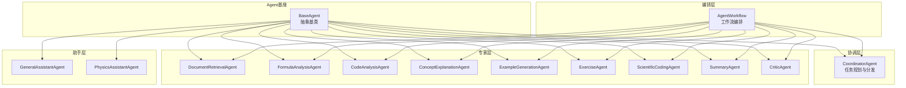
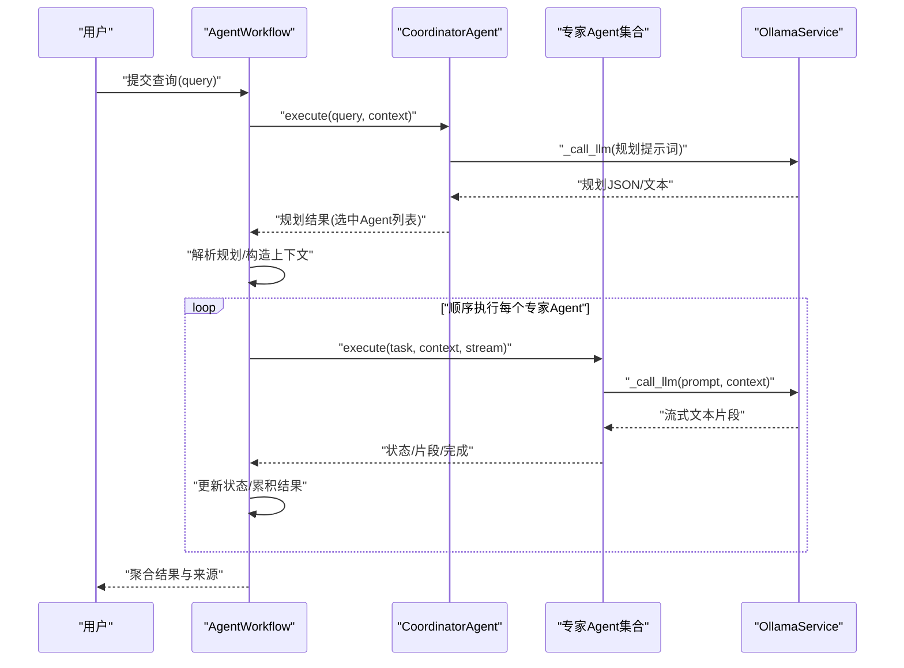
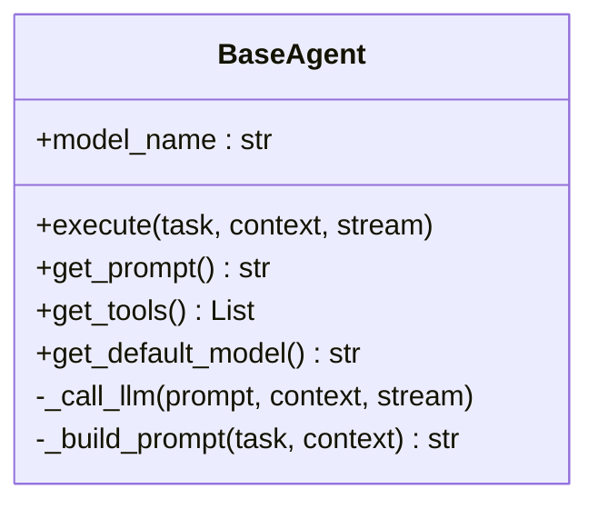
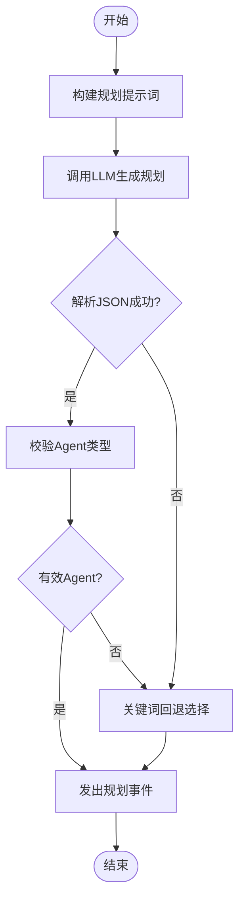
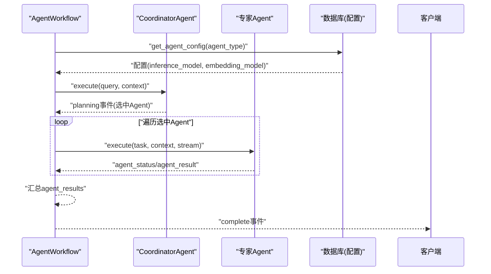
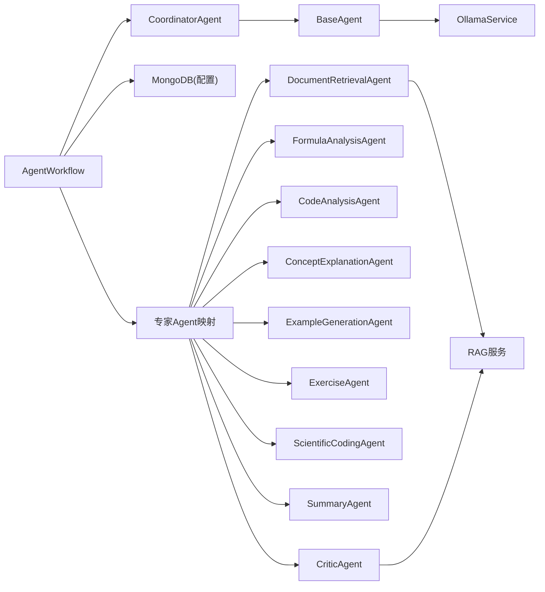

# Agent协作系统

<cite>
**本文引用的文件**   
- [agents/base/base_agent.py](file://agents/base/base_agent.py)
- [agents/coordinator/coordinator_agent.py](file://agents/coordinator/coordinator_agent.py)
- [agents/workflow/agent_workflow.py](file://agents/workflow/agent_workflow.py)
- [agents/experts/code_analysis_agent.py](file://agents/experts/code_analysis_agent.py)
- [agents/experts/concept_explanation_agent.py](file://agents/experts/concept_explanation_agent.py)
- [agents/experts/formula_analysis_agent.py](file://agents/experts/formula_analysis_agent.py)
- [agents/experts/example_generation_agent.py](file://agents/experts/example_generation_agent.py)
- [agents/experts/critic_agent.py](file://agents/experts/critic_agent.py)
- [agents/experts/document_retrieval_agent.py](file://agents/experts/document_retrieval_agent.py)
- [agents/experts/exercise_agent.py](file://agents/experts/exercise_agent.py)
- [agents/experts/scientific_coding_agent.py](file://agents/experts/scientific_coding_agent.py)
- [agents/experts/summary_agent.py](file://agents/experts/summary_agent.py)
- [agents/general_assistant/general_assistant_agent.py](file://agents/general_assistant/general_assistant_agent.py)
- [agents/physics_assistant/physics_assistant_agent.py](file://agents/physics_assistant/physics_assistant_agent.py)
- [models/agent_config.py](file://models/agent_config.py)
</cite>

## 目录
1. [引言](#引言)
2. [项目结构](#项目结构)
3. [核心组件](#核心组件)
4. [架构总览](#架构总览)
5. [详细组件分析](#详细组件分析)
6. [依赖分析](#依赖分析)
7. [性能考虑](#性能考虑)
8. [故障排查指南](#故障排查指南)
9. [结论](#结论)
10. [附录](#附录)

## 引言
本文件面向Advanced RAG Agent协作系统，提供从架构设计到实现细节的全景式技术文档。系统通过“协调Agent + 专家Agent + 工作流编排”的模式，实现对复杂问题的多视角分析与协同生成。读者将了解：
- BaseAgent基类的设计理念与通用能力
- 协调Agent的任务规划与分发机制
- 专家Agent的实现模式与典型应用场景
- Agent工作流的编排策略与状态管理
- Agent间通信协议、消息传递与协作流程
- 扩展开发指南：新增专家Agent、配置管理、第三方工具集成

## 项目结构
系统采用按职责分层的模块化组织方式：
- agents/base：抽象基类与通用能力（模型服务、提示词构建、流式生成）
- agents/coordinator：协调Agent，负责任务规划与专家选择
- agents/experts：各类专家Agent，覆盖检索、公式、代码、概念、示例、习题、科学计算、总结、批判等
- agents/workflow：工作流编排器，串联协调与专家Agent，管理状态与结果聚合
- agents/general_assistant / physics_assistant：通用与物理课程助手Agent，封装RAG检索与生成
- models：Agent配置模型（推理/嵌入模型）
- 其他模块：服务、工具、中间件、数据库、解析器、检索器等支撑能力

图表来源
- [agents/base/base_agent.py:1-122](file://agents/base/base_agent.py#L1-L122)
- [agents/coordinator/coordinator_agent.py:1-252](file://agents/coordinator/coordinator_agent.py#L1-L252)
- [agents/workflow/agent_workflow.py:1-388](file://agents/workflow/agent_workflow.py#L1-L388)
- [agents/experts/document_retrieval_agent.py:1-79](file://agents/experts/document_retrieval_agent.py#L1-L79)
- [agents/experts/formula_analysis_agent.py:1-107](file://agents/experts/formula_analysis_agent.py#L1-L107)
- [agents/experts/code_analysis_agent.py:1-79](file://agents/experts/code_analysis_agent.py#L1-L79)
- [agents/experts/concept_explanation_agent.py:1-70](file://agents/experts/concept_explanation_agent.py#L1-L70)
- [agents/experts/example_generation_agent.py:1-68](file://agents/experts/example_generation_agent.py#L1-L68)
- [agents/experts/exercise_agent.py:1-102](file://agents/experts/exercise_agent.py#L1-L102)
- [agents/experts/scientific_coding_agent.py:1-82](file://agents/experts/scientific_coding_agent.py#L1-L82)
- [agents/experts/summary_agent.py:1-87](file://agents/experts/summary_agent.py#L1-L87)
- [agents/experts/critic_agent.py:1-90](file://agents/experts/critic_agent.py#L1-L90)
- [agents/general_assistant/general_assistant_agent.py:1-167](file://agents/general_assistant/general_assistant_agent.py#L1-L167)
- [agents/physics_assistant/physics_assistant_agent.py:1-175](file://agents/physics_assistant/physics_assistant_agent.py#L1-L175)

章节来源
- [agents/base/base_agent.py:1-122](file://agents/base/base_agent.py#L1-L122)
- [agents/workflow/agent_workflow.py:1-388](file://agents/workflow/agent_workflow.py#L1-L388)

## 核心组件
- BaseAgent：定义统一接口与通用能力，包括模型初始化、提示词构建、LLM调用、工具与提示词钩子等。为所有Agent提供一致的抽象与扩展点。
- CoordinatorAgent：接收用户问题，基于规则与LLM进行专家选择与任务分派，输出规划结果（JSON结构）。
- AgentWorkflow：工作流编排器，负责异步加载Agent配置、实例化专家Agent、顺序执行并流式上报状态与结果，最终汇总。
- 专家Agent族：覆盖检索、公式、代码、概念、示例、习题、科学计算、总结、批判等，各自实现领域化的提示词与执行逻辑。
- 助手Agent：GeneralAssistantAgent与PhysicsAssistantAgent，封装RAG检索与生成流程，支持模型动态选择与流式输出。

章节来源
- [agents/base/base_agent.py:1-122](file://agents/base/base_agent.py#L1-L122)
- [agents/coordinator/coordinator_agent.py:1-252](file://agents/coordinator/coordinator_agent.py#L1-L252)
- [agents/workflow/agent_workflow.py:1-388](file://agents/workflow/agent_workflow.py#L1-L388)
- [agents/experts/document_retrieval_agent.py:1-79](file://agents/experts/document_retrieval_agent.py#L1-L79)
- [agents/experts/formula_analysis_agent.py:1-107](file://agents/experts/formula_analysis_agent.py#L1-L107)
- [agents/experts/code_analysis_agent.py:1-79](file://agents/experts/code_analysis_agent.py#L1-L79)
- [agents/experts/concept_explanation_agent.py:1-70](file://agents/experts/concept_explanation_agent.py#L1-L70)
- [agents/experts/example_generation_agent.py:1-68](file://agents/experts/example_generation_agent.py#L1-L68)
- [agents/experts/exercise_agent.py:1-102](file://agents/experts/exercise_agent.py#L1-L102)
- [agents/experts/scientific_coding_agent.py:1-82](file://agents/experts/scientific_coding_agent.py#L1-L82)
- [agents/experts/summary_agent.py:1-87](file://agents/experts/summary_agent.py#L1-L87)
- [agents/experts/critic_agent.py:1-90](file://agents/experts/critic_agent.py#L1-L90)
- [agents/general_assistant/general_assistant_agent.py:1-167](file://agents/general_assistant/general_assistant_agent.py#L1-L167)
- [agents/physics_assistant/physics_assistant_agent.py:1-175](file://agents/physics_assistant/physics_assistant_agent.py#L1-L175)

## 架构总览
系统采用“协调-执行-编排”三层架构：
- 协调层：CoordinatorAgent负责任务规划与专家选择，支持JSON规划与关键词回退策略。
- 执行层：专家Agent按需执行，遵循统一的执行接口，支持流式输出与状态上报。
- 编排层：AgentWorkflow统一调度，异步加载配置、实例化Agent、顺序执行并聚合结果，同时维护Agent状态机。

图表来源
- [agents/workflow/agent_workflow.py:106-336](file://agents/workflow/agent_workflow.py#L106-L336)
- [agents/coordinator/coordinator_agent.py:55-168](file://agents/coordinator/coordinator_agent.py#L55-L168)
- [agents/base/base_agent.py:75-97](file://agents/base/base_agent.py#L75-L97)

## 详细组件分析

### BaseAgent基类设计
- 设计理念
  - 抽象统一接口：定义抽象方法与默认实现，保证所有Agent具备一致的生命周期与行为契约。
  - 模型服务封装：通过OllamaService统一调用LLM，支持流式生成与上下文拼接。
  - 提示词与工具钩子：允许子类覆盖系统提示词与工具列表，便于领域定制。
- 关键能力
  - 模型初始化与默认模型选择
  - 统一的提示词构建（系统提示词 + 上下文 + 任务）
  - LLM调用封装（_call_llm）
  - 执行接口（execute）与流式输出（AsyncGenerator）

图表来源
- [agents/base/base_agent.py:8-122](file://agents/base/base_agent.py#L8-L122)

章节来源
- [agents/base/base_agent.py:1-122](file://agents/base/base_agent.py#L1-L122)

### 协调Agent工作机制
- 角色定位：根据用户问题智能选择所需专家Agent，给出任务分配与选择理由。
- 规划流程
  - 构建规划提示词，限定输出格式（JSON）
  - LLM生成规划文本，解析JSON（支持回退：正则提取与关键词匹配）
  - 校验Agent类型有效性，必要时回退到默认选择逻辑
  - 输出规划事件（包含选中Agent列表、任务映射、选择理由）
- 错误处理：解析失败时回退，异常捕获并返回错误事件

图表来源
- [agents/coordinator/coordinator_agent.py:55-168](file://agents/coordinator/coordinator_agent.py#L55-L168)
- [agents/coordinator/coordinator_agent.py:170-213](file://agents/coordinator/coordinator_agent.py#L170-L213)

章节来源
- [agents/coordinator/coordinator_agent.py:1-252](file://agents/coordinator/coordinator_agent.py#L1-L252)

### Agent工作流编排策略
- 配置加载
  - 通过数据库获取Agent配置（推理模型、嵌入模型），支持缓存与回退默认值
  - 协调Agent与专家Agent均支持按需异步初始化
- 执行策略
  - 顺序执行：为前端实时反馈与状态管理，采用顺序执行而非并行
  - 状态上报：在每个Agent开始、执行中、完成后发送状态事件
  - 结果聚合：收集各Agent结果，合并为最终响应
- 错误处理：单个Agent失败不影响整体流程，记录错误并继续后续Agent

图表来源
- [agents/workflow/agent_workflow.py:18-44](file://agents/workflow/agent_workflow.py#L18-L44)
- [agents/workflow/agent_workflow.py:69-104](file://agents/workflow/agent_workflow.py#L69-L104)
- [agents/workflow/agent_workflow.py:106-336](file://agents/workflow/agent_workflow.py#L106-L336)

章节来源
- [agents/workflow/agent_workflow.py:1-388](file://agents/workflow/agent_workflow.py#L1-L388)

### 专家Agent功能特性与实现模式
- 文档检索专家（DocumentRetrievalAgent）
  - 能力：调用RAG服务检索上下文，总结关键信息并标注来源
  - 特点：先检索后总结，适合需要权威依据的问题
- 公式分析专家（FormulaAnalysisAgent）
  - 能力：从文本中提取LaTeX公式，逐条解释物理意义、变量含义、适用条件与应用场景
  - 特点：公式抽取与解释分离，支持置信度与公式列表返回
- 代码分析专家（CodeAnalysisAgent）
  - 能力：分析代码功能、关键段落、优缺点与改进建议
  - 特点：输入需包含代码片段，否则快速返回低置信度提示
- 概念解释专家（ConceptExplanationAgent）
  - 能力：深入解释专业概念，提供定义、物理意义、公式、示例与关联
  - 特点：高置信度输出，适合基础概念澄清
- 示例生成专家（ExampleGenerationAgent）
  - 能力：生成从简单到复杂的实际应用示例，包含完整解题过程
  - 特点：强调可操作性与层次递进
- 习题专家（ExerciseAgent）
  - 能力：区分“出题”与“解题”，分别生成题目或提供详细解题步骤
  - 特点：关键词识别决定模式，支持多种题型与解法
- 科学计算编码专家（ScientificCodingAgent）
  - 能力：生成符合学术规范的MATLAB/Python科学计算代码，含注释与可视化
  - 特点：面向科研与教学，强调规范与可读性
- 总结专家（SummaryAgent）
  - 能力：基于其他Agent结果进行归纳总结，提炼核心要点与学习建议
  - 特点：依赖上下文other_results，适合复杂问题收尾
- 批判专家（CriticAgent）
  - 能力：基于RAG检索到的证据，客观评估信息准确性、指出问题并提供修正建议
  - 特点：强调证据驱动与建设性反馈

章节来源
- [agents/experts/document_retrieval_agent.py:1-79](file://agents/experts/document_retrieval_agent.py#L1-L79)
- [agents/experts/formula_analysis_agent.py:1-107](file://agents/experts/formula_analysis_agent.py#L1-L107)
- [agents/experts/code_analysis_agent.py:1-79](file://agents/experts/code_analysis_agent.py#L1-L79)
- [agents/experts/concept_explanation_agent.py:1-70](file://agents/experts/concept_explanation_agent.py#L1-L70)
- [agents/experts/example_generation_agent.py:1-68](file://agents/experts/example_generation_agent.py#L1-L68)
- [agents/experts/exercise_agent.py:1-102](file://agents/experts/exercise_agent.py#L1-L102)
- [agents/experts/scientific_coding_agent.py:1-82](file://agents/experts/scientific_coding_agent.py#L1-L82)
- [agents/experts/summary_agent.py:1-87](file://agents/experts/summary_agent.py#L1-L87)
- [agents/experts/critic_agent.py:1-90](file://agents/experts/critic_agent.py#L1-L90)

### 通用与物理助手Agent
- GeneralAssistantAgent
  - 封装高阶RAG流程（混合检索+重排+LLM生成），支持模型动态选择与流式输出
  - 适用于通用领域，强调引用来源与客观真实
- PhysicsAssistantAgent
  - 面向物理课程的问答助手，强调清晰解释与示例辅助
  - 支持RAG检索与对话历史，提供Markdown格式回答

章节来源
- [agents/general_assistant/general_assistant_agent.py:1-167](file://agents/general_assistant/general_assistant_agent.py#L1-L167)
- [agents/physics_assistant/physics_assistant_agent.py:1-175](file://agents/physics_assistant/physics_assistant_agent.py#L1-L175)

## 依赖分析
- 组件耦合
  - BaseAgent为所有Agent的共同父类，提供统一能力，降低重复实现
  - CoordinatorAgent依赖LLM进行规划，依赖Agent类型映射表
  - AgentWorkflow依赖数据库配置、专家Agent映射与OllamaService
  - 专家Agent之间无直接耦合，通过统一接口与上下文交互
- 外部依赖
  - OllamaService：统一的LLM调用入口
  - RAG服务：文档检索与上下文聚合
  - 数据库：Agent配置存储与读取

图表来源
- [agents/base/base_agent.py:5](file://agents/base/base_agent.py#L5)
- [agents/workflow/agent_workflow.py:29-44](file://agents/workflow/agent_workflow.py#L29-L44)
- [agents/experts/document_retrieval_agent.py:4](file://agents/experts/document_retrieval_agent.py#L4)
- [agents/experts/critic_agent.py:4](file://agents/experts/critic_agent.py#L4)

章节来源
- [agents/workflow/agent_workflow.py:18-44](file://agents/workflow/agent_workflow.py#L18-L44)
- [agents/experts/document_retrieval_agent.py:1-79](file://agents/experts/document_retrieval_agent.py#L1-L79)
- [agents/experts/critic_agent.py:1-90](file://agents/experts/critic_agent.py#L1-L90)

## 性能考虑
- 模型选择与切换
  - 通用与物理助手支持动态模型选择，减少不必要的模型初始化开销
- 异步与缓存
  - Agent配置缓存（_agent_configs_cache）、专家Agent实例缓存（expert_agents）降低重复初始化成本
- 流式输出
  - 统一的流式输出机制提升用户体验，前端可逐步渲染
- 执行策略
  - 当前采用顺序执行以保证状态一致性与前端反馈；若业务允许，可评估并行执行与结果合并策略

## 故障排查指南
- 协调Agent规划失败
  - 现象：返回错误事件或未选中Agent
  - 排查：检查提示词格式、JSON解析正则、关键词回退逻辑
  - 参考路径：[agents/coordinator/coordinator_agent.py:102-168](file://agents/coordinator/coordinator_agent.py#L102-L168)
- 专家Agent执行异常
  - 现象：单个Agent报错，工作流继续
  - 排查：查看Agent内部日志、上下文是否缺失、模型配置是否正确
  - 参考路径：[agents/workflow/agent_workflow.py:231-321](file://agents/workflow/agent_workflow.py#L231-L321)
- 配置加载失败
  - 现象：使用默认配置或警告
  - 排查：检查数据库连接、集合存在性、字段完整性
  - 参考路径：[agents/workflow/agent_workflow.py:18-44](file://agents/workflow/agent_workflow.py#L18-L44)
- RAG检索失败
  - 现象：上下文为空但仍继续生成
  - 排查：检查检索服务可用性、索引状态、查询预处理
  - 参考路径：[agents/experts/document_retrieval_agent.py:39-47](file://agents/experts/document_retrieval_agent.py#L39-L47)

章节来源
- [agents/coordinator/coordinator_agent.py:102-168](file://agents/coordinator/coordinator_agent.py#L102-L168)
- [agents/workflow/agent_workflow.py:18-44](file://agents/workflow/agent_workflow.py#L18-L44)
- [agents/experts/document_retrieval_agent.py:39-47](file://agents/experts/document_retrieval_agent.py#L39-L47)

## 结论
本系统通过清晰的分层设计与统一的抽象接口，实现了从任务规划到专家协作再到结果聚合的完整闭环。BaseAgent提供一致能力，CoordinatorAgent负责智能选择，AgentWorkflow保障执行与状态管理，专家Agent覆盖多领域需求。该架构既便于扩展新Agent，也便于优化性能与增强稳定性。

## 附录

### Agent扩展开发指南
- 新增专家Agent类型
  - 步骤
    - 在专家目录新增Agent类，继承BaseAgent，实现get_default_model与get_prompt
    - 实现execute方法，支持流式输出与状态上报
    - 在AgentWorkflow的AGENT_MAP中注册映射
    - 如需模型配置，通过数据库AgentConfig表新增对应项
  - 参考路径
    - [agents/base/base_agent.py:27-55](file://agents/base/base_agent.py#L27-L55)
    - [agents/workflow/agent_workflow.py:50-60](file://agents/workflow/agent_workflow.py#L50-L60)
    - [models/agent_config.py:6-23](file://models/agent_config.py#L6-L23)
- 配置Agent参数
  - 推理模型与嵌入模型通过数据库配置加载，支持缓存与回退
  - 参考路径：[agents/workflow/agent_workflow.py:18-44](file://agents/workflow/agent_workflow.py#L18-L44)
- 集成第三方工具
  - 在BaseAgent中提供get_tools钩子，返回LangChain工具列表
  - 参考路径：[agents/base/base_agent.py:57-64](file://agents/base/base_agent.py#L57-L64)