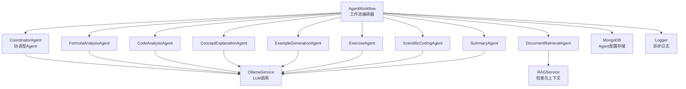
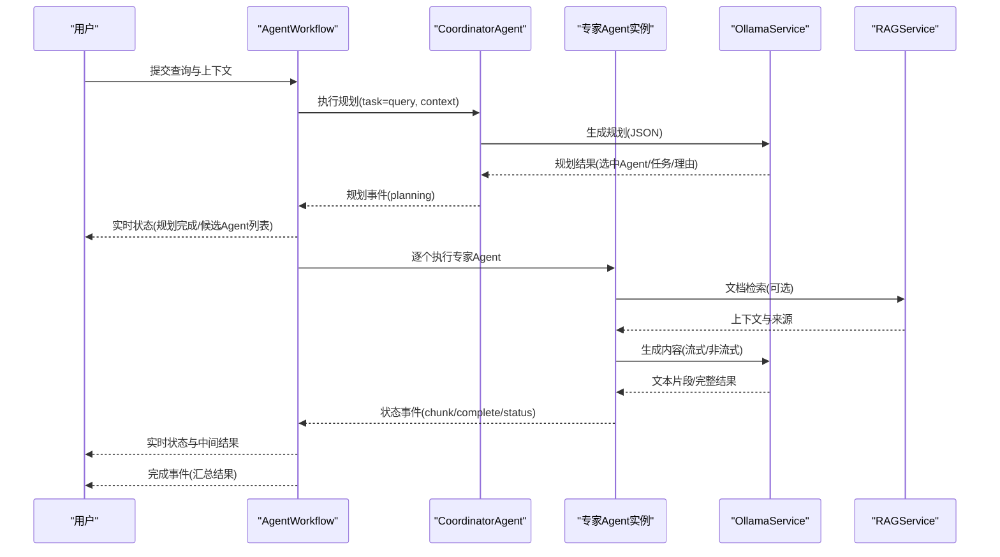
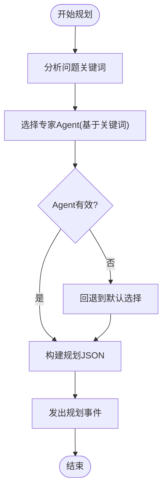
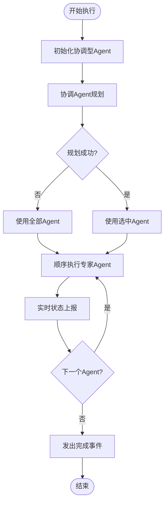
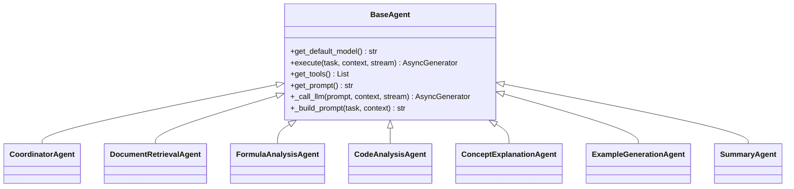
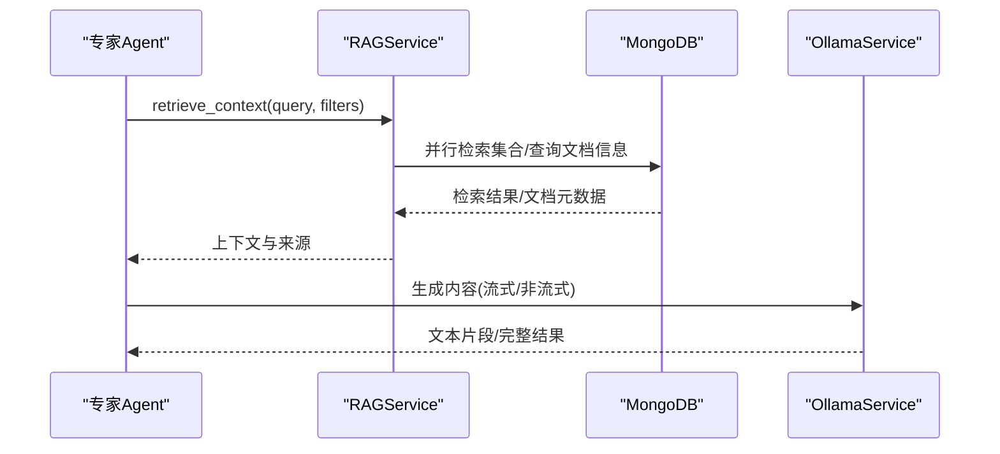
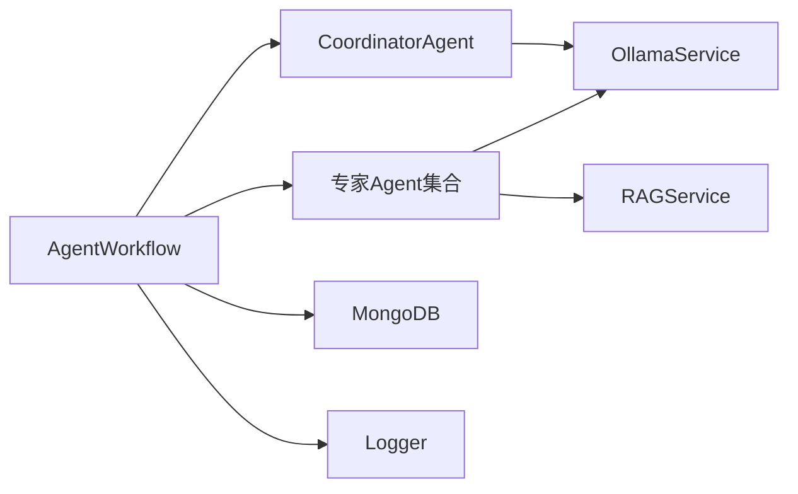
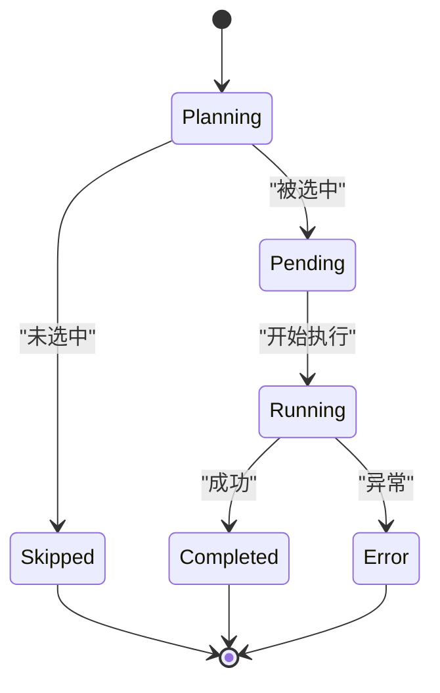

# Agent工作流

<cite>
**本文引用的文件**
- [agent_workflow.py](file://agents/workflow/agent_workflow.py)
- [base_agent.py](file://agents/base/base_agent.py)
- [coordinator_agent.py](file://agents/coordinator/coordinator_agent.py)
- [code_analysis_agent.py](file://agents/experts/code_analysis_agent.py)
- [concept_explanation_agent.py](file://agents/experts/concept_explanation_agent.py)
- [document_retrieval_agent.py](file://agents/experts/document_retrieval_agent.py)
- [formula_analysis_agent.py](file://agents/experts/formula_analysis_agent.py)
- [example_generation_agent.py](file://agents/experts/example_generation_agent.py)
- [summary_agent.py](file://agents/experts/summary_agent.py)
- [rag_service.py](file://services/rag_service.py)
- [ollama_service.py](file://services/ollama_service.py)
- [mongodb.py](file://database/mongodb.py)
- [agent_config.py](file://models/agent_config.py)
- [logger.py](file://utils/logger.py)
</cite>

## 目录
1. [简介](#简介)
2. [项目结构](#项目结构)
3. [核心组件](#核心组件)
4. [架构总览](#架构总览)
5. [详细组件分析](#详细组件分析)
6. [依赖关系分析](#依赖关系分析)
7. [性能考量](#性能考量)
8. [故障排查指南](#故障排查指南)
9. [结论](#结论)
10. [附录](#附录)

## 简介
本文件面向开发者与架构师，系统化阐述基于多Agent协作的“Agent工作流”编排理念与执行机制。内容涵盖：
- 工作流定义语法与节点连接规则
- 条件分支与动态路由（由协调型Agent驱动）
- 循环与并行控制结构（当前实现为串行顺序执行，具备扩展为并行的能力）
- 生命周期管理、状态转换、错误恢复与超时处理
- 如何设计复杂工作流（并行、串行、条件判断、动态路由）
- 与Agent系统的集成方式与性能优化策略

## 项目结构
Agent工作流位于 agents/workflow/agent_workflow.py，围绕“协调型Agent + 专家Agent”的两级编排展开，配合服务层（RAG、LLM调用、数据库）实现端到端的智能工作流。

图表来源
- [agent_workflow.py:47-388](file://agents/workflow/agent_workflow.py#L47-L388)
- [coordinator_agent.py:7-252](file://agents/coordinator/coordinator_agent.py#L7-L252)
- [document_retrieval_agent.py:8-79](file://agents/experts/document_retrieval_agent.py#L8-L79)
- [formula_analysis_agent.py:8-107](file://agents/experts/formula_analysis_agent.py#L8-L107)
- [code_analysis_agent.py:7-79](file://agents/experts/code_analysis_agent.py#L7-L79)
- [concept_explanation_agent.py:7-70](file://agents/experts/concept_explanation_agent.py#L7-L70)
- [example_generation_agent.py:7-68](file://agents/experts/example_generation_agent.py#L7-L68)
- [summary_agent.py:7-87](file://agents/experts/summary_agent.py#L7-L87)
- [rag_service.py:8-323](file://services/rag_service.py#L8-L323)
- [ollama_service.py:9-674](file://services/ollama_service.py#L9-L674)
- [mongodb.py:92-204](file://database/mongodb.py#L92-L204)
- [logger.py:15-88](file://utils/logger.py#L15-L88)

章节来源
- [agent_workflow.py:47-388](file://agents/workflow/agent_workflow.py#L47-L388)

## 核心组件
- 协调型Agent（CoordinatorAgent）：负责解析用户问题、动态选择专家Agent、分配任务、给出选择理由。其输出为“规划结果”，包含选中的Agent列表、各Agent的任务描述以及选择理由。
- 专家Agent（Experts）：具体执行任务的子Agent，如文档检索、公式分析、代码分析、概念解释、示例生成、练习生成、科学计算、总结等。每个专家Agent继承自BaseAgent，统一提供execute接口与LLM调用能力。
- 工作流编排器（AgentWorkflow）：负责初始化协调型Agent与专家Agent、执行规划、顺序调度专家Agent、聚合结果、状态上报与错误处理。
- 服务层：
  - RAGService：并行检索文档与资源，构建上下文与来源信息。
  - OllamaService：封装LLM调用，支持流式与非流式生成，内置超时与异常处理。
  - MongoDB：提供Agent配置读取与运行时集合访问。
- 日志与配置：
  - Logger：异步文件写入，降低主线程阻塞。
  - AgentConfig模型：定义Agent配置的数据结构。

章节来源
- [coordinator_agent.py:7-252](file://agents/coordinator/coordinator_agent.py#L7-L252)
- [base_agent.py:8-122](file://agents/base/base_agent.py#L8-L122)
- [agent_workflow.py:47-388](file://agents/workflow/agent_workflow.py#L47-L388)
- [rag_service.py:8-323](file://services/rag_service.py#L8-L323)
- [ollama_service.py:9-674](file://services/ollama_service.py#L9-L674)
- [mongodb.py:92-204](file://database/mongodb.py#L92-L204)
- [agent_config.py:6-24](file://models/agent_config.py#L6-L24)
- [logger.py:15-88](file://utils/logger.py#L15-L88)

## 架构总览
Agent工作流采用“协调-执行”的两阶段架构：
- 第一阶段：协调型Agent基于用户输入与上下文，动态规划任务，返回选中的专家Agent列表与任务描述。
- 第二阶段：工作流编排器顺序执行专家Agent，实时上报状态（pending/running/completed/error/skipped），汇总结果并产出最终完成信号。

图表来源
- [agent_workflow.py:106-337](file://agents/workflow/agent_workflow.py#L106-L337)
- [coordinator_agent.py:55-160](file://agents/coordinator/coordinator_agent.py#L55-L160)
- [document_retrieval_agent.py:25-79](file://agents/experts/document_retrieval_agent.py#L25-L79)
- [rag_service.py:34-266](file://services/rag_service.py#L34-L266)
- [ollama_service.py:50-92](file://services/ollama_service.py#L50-L92)

## 详细组件分析

### 协调型Agent（CoordinatorAgent）
- 职责：解析问题、选择必要专家、分配任务、说明理由。
- 输出：规划事件，包含选中Agent列表、任务映射、选择理由。
- 容错：当JSON解析失败时，回退到关键词匹配的默认选择逻辑。

图表来源
- [coordinator_agent.py:170-213](file://agents/coordinator/coordinator_agent.py#L170-L213)
- [coordinator_agent.py:108-147](file://agents/coordinator/coordinator_agent.py#L108-L147)

章节来源
- [coordinator_agent.py:7-252](file://agents/coordinator/coordinator_agent.py#L7-L252)

### 工作流编排器（AgentWorkflow）
- 初始化：异步加载协调型Agent与专家Agent配置（从MongoDB读取），并缓存。
- 执行流程：
  - 规划阶段：调用协调型Agent，实时转发规划事件与候选Agent状态。
  - 选择阶段：优先使用协调型Agent返回的选中列表，否则使用手动指定，再否则使用全部Agent。
  - 执行阶段：顺序执行专家Agent，实时上报状态（pending/running/completed/error），聚合结果。
  - 完成阶段：发出完成事件，包含成功Agent数量与汇总结果。
- 错误处理：捕获异常并发出错误事件；对Agent缺失、执行失败等情况进行降级处理。

图表来源
- [agent_workflow.py:106-337](file://agents/workflow/agent_workflow.py#L106-L337)

章节来源
- [agent_workflow.py:47-388](file://agents/workflow/agent_workflow.py#L47-L388)

### 专家Agent（示例：文档检索、公式分析、代码分析、概念解释、示例生成、总结）
- 继承BaseAgent，统一提供execute接口与提示词构建、LLM调用能力。
- 文档检索Agent：调用RAGService检索上下文，总结关键信息并标注来源。
- 公式分析Agent：提取LaTeX公式，分析物理意义与适用条件。
- 代码分析Agent：识别代码片段，分析功能、逻辑与改进建议。
- 概念解释Agent：深入解释专业概念，提供定义、意义、示例与关联。
- 示例生成Agent：生成从简单到复杂的应用示例与解题过程。
- 总结Agent：对其他Agent结果进行归纳提炼。

图表来源
- [base_agent.py:8-122](file://agents/base/base_agent.py#L8-L122)
- [coordinator_agent.py:7-252](file://agents/coordinator/coordinator_agent.py#L7-L252)
- [document_retrieval_agent.py:8-79](file://agents/experts/document_retrieval_agent.py#L8-L79)
- [formula_analysis_agent.py:8-107](file://agents/experts/formula_analysis_agent.py#L8-L107)
- [code_analysis_agent.py:7-79](file://agents/experts/code_analysis_agent.py#L7-L79)
- [concept_explanation_agent.py:7-70](file://agents/experts/concept_explanation_agent.py#L7-L70)
- [example_generation_agent.py:7-68](file://agents/experts/example_generation_agent.py#L7-L68)
- [summary_agent.py:7-87](file://agents/experts/summary_agent.py#L7-L87)

章节来源
- [base_agent.py:8-122](file://agents/base/base_agent.py#L8-L122)
- [document_retrieval_agent.py:8-79](file://agents/experts/document_retrieval_agent.py#L8-L79)
- [formula_analysis_agent.py:8-107](file://agents/experts/formula_analysis_agent.py#L8-L107)
- [code_analysis_agent.py:7-79](file://agents/experts/code_analysis_agent.py#L7-L79)
- [concept_explanation_agent.py:7-70](file://agents/experts/concept_explanation_agent.py#L7-L70)
- [example_generation_agent.py:7-68](file://agents/experts/example_generation_agent.py#L7-L68)
- [summary_agent.py:7-87](file://agents/experts/summary_agent.py#L7-L87)

### 服务层与数据流
- RAGService：并行检索多个知识空间集合，邻居扩展、去重与上下文拼接，控制最大token预算，返回上下文、来源与推荐资源。
- OllamaService：封装流式/非流式生成，支持超时控制、异常处理、工具函数调用注入与提示词链构建。
- MongoDB：提供agent_configs集合读取Agent模型配置；提供课程助手与知识空间集合名称解析。

图表来源
- [rag_service.py:34-266](file://services/rag_service.py#L34-L266)
- [mongodb.py:58-96](file://database/mongodb.py#L58-L96)
- [ollama_service.py:50-92](file://services/ollama_service.py#L50-L92)

章节来源
- [rag_service.py:8-323](file://services/rag_service.py#L8-L323)
- [ollama_service.py:9-674](file://services/ollama_service.py#L9-L674)
- [mongodb.py:92-204](file://database/mongodb.py#L92-L204)

## 依赖关系分析
- 组件耦合：
  - AgentWorkflow依赖CoordinatorAgent与各专家Agent类映射，通过异步延迟初始化与配置缓存降低耦合。
  - 专家Agent统一继承BaseAgent，共享LLM调用与提示词构建能力。
  - 协调型Agent与专家Agent均依赖OllamaService；文档检索Agent依赖RAGService。
- 外部依赖：
  - MongoDB用于Agent配置读取与集合解析。
  - Logger提供异步日志写入，避免阻塞。
- 潜在风险：
  - Agent类型映射集中于AgentWorkflow，新增Agent需同步维护映射表。
  - 协调型Agent的规划结果依赖JSON解析，解析失败时依赖回退逻辑。

图表来源
- [agent_workflow.py:47-105](file://agents/workflow/agent_workflow.py#L47-L105)
- [coordinator_agent.py:7-252](file://agents/coordinator/coordinator_agent.py#L7-L252)
- [document_retrieval_agent.py:8-79](file://agents/experts/document_retrieval_agent.py#L8-L79)
- [rag_service.py:8-323](file://services/rag_service.py#L8-L323)
- [ollama_service.py:9-674](file://services/ollama_service.py#L9-L674)
- [mongodb.py:92-204](file://database/mongodb.py#L92-L204)
- [logger.py:15-88](file://utils/logger.py#L15-L88)

章节来源
- [agent_workflow.py:47-105](file://agents/workflow/agent_workflow.py#L47-L105)

## 性能考量
- 并行与顺序：
  - 当前实现为顺序执行专家Agent，便于前端实时展示进度与状态。若业务场景允许，可扩展为并行执行并在完成后聚合结果。
- 检索与上下文：
  - RAGService对多个集合并行检索，邻居扩展与去重提升召回质量；通过token预算控制避免提示词过大。
- LLM调用：
  - OllamaService支持流式生成与超时控制，适合长文本生成；非流式生成用于摘要等确定性任务。
- 数据库连接：
  - MongoDB异步客户端与连接池参数优化，适合高并发场景；首次请求失败可在首次请求时重试。
- 日志：
  - 异步文件处理器避免阻塞主线程，生产环境可降低日志级别以减少IO压力。

章节来源
- [rag_service.py:34-122](file://services/rag_service.py#L34-L122)
- [ollama_service.py:50-92](file://services/ollama_service.py#L50-L92)
- [mongodb.py:99-184](file://database/mongodb.py#L99-L184)
- [logger.py:15-88](file://utils/logger.py#L15-L88)

## 故障排查指南
- 协调型Agent规划失败：
  - 现象：JSON解析失败或未返回选中Agent。
  - 处理：回退到关键词匹配逻辑；检查提示词链与模型稳定性。
- 专家Agent执行失败：
  - 现象：Agent未找到、执行异常、流式超时。
  - 处理：记录错误事件并降级；检查模型可用性与网络连接；查看日志定位具体异常。
- RAG检索失败：
  - 现象：检索异常或回退到空上下文。
  - 处理：检查知识空间集合名称、向量库状态与连接；确认回退策略配置。
- 数据库连接失败：
  - 现象：Agent配置读取失败或连接异常。
  - 处理：检查MONGODB_URI与连接参数；确认MongoDB服务可用。

章节来源
- [coordinator_agent.py:130-147](file://agents/coordinator/coordinator_agent.py#L130-L147)
- [agent_workflow.py:306-336](file://agents/workflow/agent_workflow.py#L306-L336)
- [rag_service.py:294-317](file://services/rag_service.py#L294-L317)
- [mongodb.py:154-184](file://database/mongodb.py#L154-L184)

## 结论
Agent工作流通过“协调-执行”的两阶段设计，实现了灵活的任务规划与稳定的结果交付。当前以顺序执行为主，兼顾实时状态反馈与错误恢复；未来可在此基础上引入并行执行与动态路由，进一步提升吞吐与灵活性。配合RAG与LLM服务的性能优化，可满足复杂场景下的高质量工作流需求。

## 附录

### 工作流定义语法与节点连接规则
- 规划事件（planning）：包含选中Agent列表、任务映射与选择理由。
- 状态事件（agent_status）：包含agent_type、status（pending/running/completed/error/skipped）、进度、步骤与细节。
- 结果事件（agent_result）：包含content、sources、confidence等。
- 完成事件（complete）：包含agent_results与统计信息。

章节来源
- [agent_workflow.py:140-329](file://agents/workflow/agent_workflow.py#L140-L329)

### 条件分支与动态路由
- 协调型Agent根据问题关键词与复杂度动态选择专家Agent，形成“条件分支”。
- 若规划失败，回退到默认选择逻辑，保证系统可用性。

章节来源
- [coordinator_agent.py:170-213](file://agents/coordinator/coordinator_agent.py#L170-L213)

### 循环与并行控制结构
- 当前实现为顺序执行专家Agent，便于前端实时展示。
- 并行执行可通过扩展“执行阶段”实现，完成后统一聚合结果与状态。

章节来源
- [agent_workflow.py:218-304](file://agents/workflow/agent_workflow.py#L218-L304)

### 生命周期管理与状态转换
- 协调阶段：planning → pending（被选中）/skipped（未选中）
- 执行阶段：pending → running → completed/error
- 完成阶段：汇总结果与统计

图表来源
- [agent_workflow.py:160-179](file://agents/workflow/agent_workflow.py#L160-L179)
- [agent_workflow.py:220-266](file://agents/workflow/agent_workflow.py#L220-L266)

### 配置示例与最佳实践
- Agent配置模型：定义agent_type、推理模型与向量化模型。
- 配置读取：从MongoDB的agent_configs集合读取，支持缓存与默认回退。
- 最佳实践：
  - 明确Agent职责边界，避免过度耦合。
  - 为关键Agent提供稳定的提示词与工具函数。
  - 对长文本生成开启流式输出，提高用户体验。
  - 合理设置RAG检索参数与token预算，平衡召回与性能。

章节来源
- [agent_config.py:6-24](file://models/agent_config.py#L6-L24)
- [agent_workflow.py:18-44](file://agents/workflow/agent_workflow.py#L18-L44)
- [rag_service.py:11-32](file://services/rag_service.py#L11-L32)