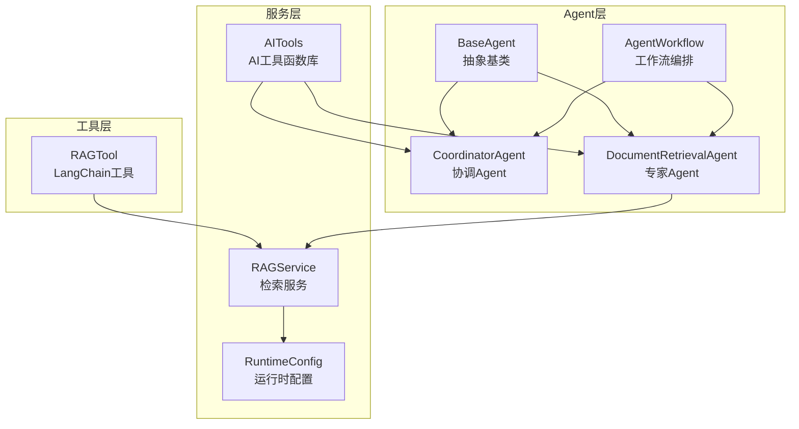
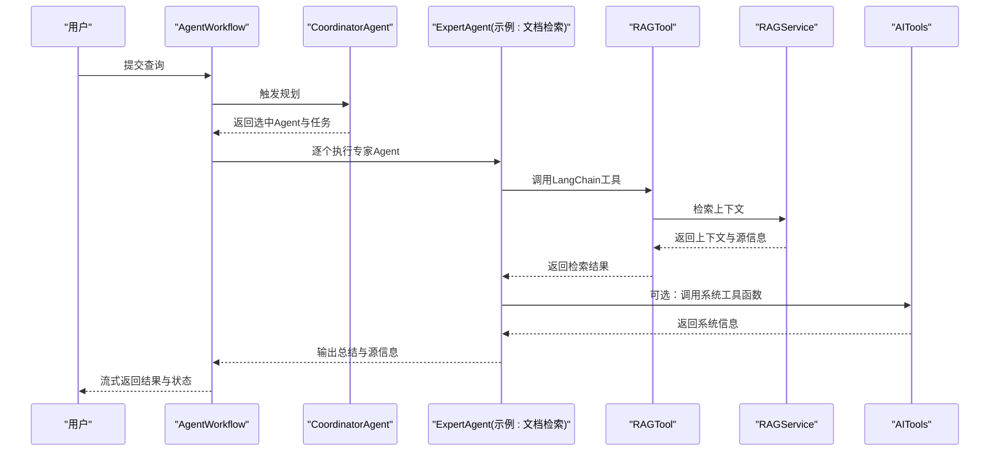
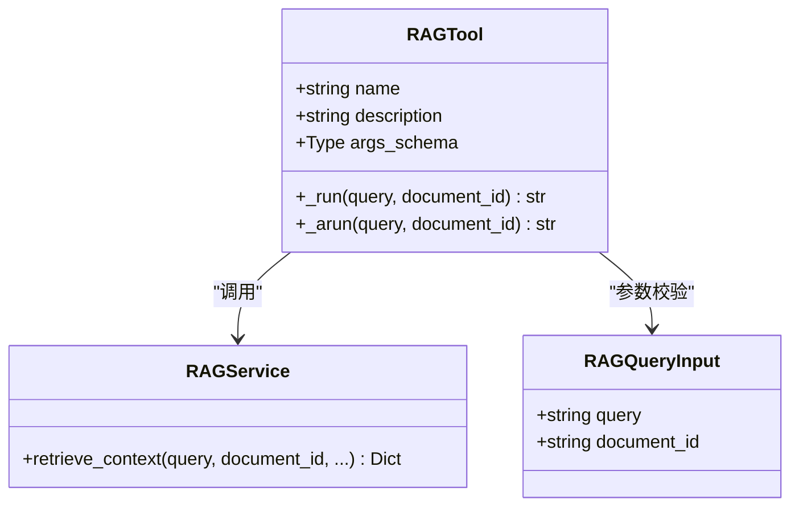
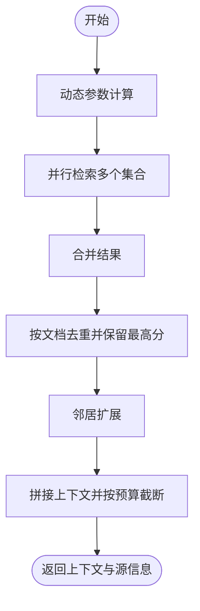
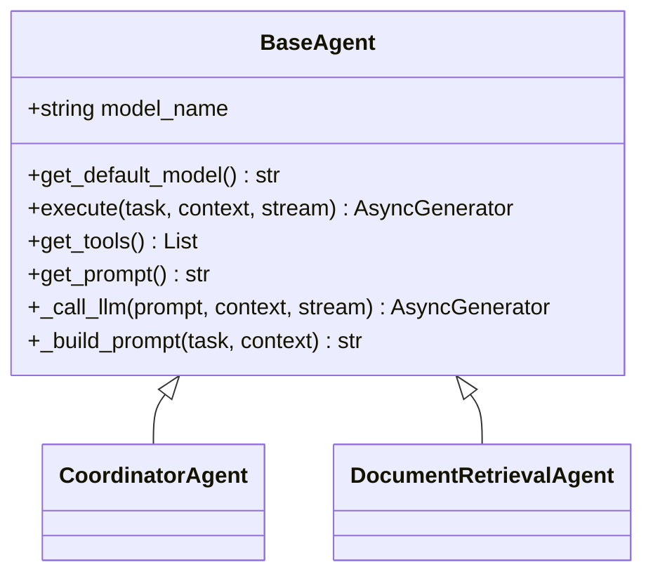
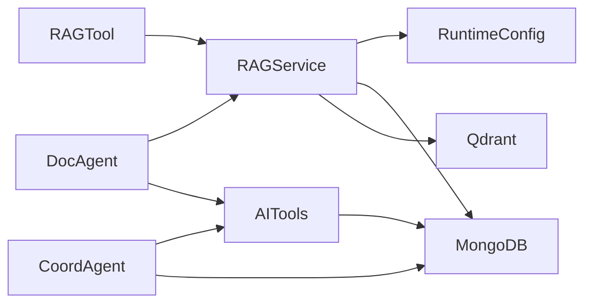

# Agent工具集成

<cite>
**本文引用的文件**
- [rag_tool.py](file://agents/tools/rag_tool.py)
- [base_agent.py](file://agents/base/base_agent.py)
- [agent_workflow.py](file://agents/workflow/agent_workflow.py)
- [rag_service.py](file://services/rag_service.py)
- [document_retrieval_agent.py](file://agents/experts/document_retrieval_agent.py)
- [coordinator_agent.py](file://agents/coordinator/coordinator_agent.py)
- [ai_tools.py](file://services/ai_tools.py)
- [runtime_config.py](file://services/runtime_config.py)
- [agent_config.py](file://models/agent_config.py)
- [test_high_level_rag.py](file://tests/test_high_level_rag.py)
</cite>

## 目录
1. [引言](#引言)
2. [项目结构](#项目结构)
3. [核心组件](#核心组件)
4. [架构总览](#架构总览)
5. [详细组件分析](#详细组件分析)
6. [依赖分析](#依赖分析)
7. [性能考虑](#性能考虑)
8. [故障排查指南](#故障排查指南)
9. [结论](#结论)
10. [附录](#附录)

## 引言
本文件面向Agent工具集成的综合技术文档，围绕RAGTool的实现与应用，系统阐述工具的接口设计、参数传递、结果处理、错误处理等关键技术点；深入分析工具与Agent的交互模式、状态管理、性能优化等实现细节；并提供工具开发的最佳实践，包括工具接口规范、配置管理、测试策略、版本兼容性等，以及如何扩展Agent工具集，添加新的工具类型和功能模块。

## 项目结构
本项目采用“按功能域分层”的组织方式，Agent工具集成主要分布在以下模块：
- agents/tools：工具定义与封装（如RAGTool）
- agents/base：Agent抽象基类与通用能力
- agents/experts：专家Agent实现（如文档检索Agent）
- agents/coordinator：协调Agent（任务规划与分发）
- agents/workflow：多Agent工作流编排
- services：服务层（如RAG服务、AI工具函数库、运行时配置）
- models：配置与数据模型（如Agent配置模型）
- tests：高层集成测试样例

**图表来源**
- [base_agent.py:8-122](file://agents/base/base_agent.py#L8-L122)
- [coordinator_agent.py:7-252](file://agents/coordinator/coordinator_agent.py#L7-L252)
- [document_retrieval_agent.py:8-79](file://agents/experts/document_retrieval_agent.py#L8-L79)
- [agent_workflow.py:47-388](file://agents/workflow/agent_workflow.py#L47-L388)
- [rag_tool.py:12-58](file://agents/tools/rag_tool.py#L12-L58)
- [rag_service.py:8-323](file://services/rag_service.py#L8-L323)
- [ai_tools.py:11-498](file://services/ai_tools.py#L11-L498)
- [runtime_config.py:140-218](file://services/runtime_config.py#L140-L218)

**章节来源**
- [base_agent.py:1-122](file://agents/base/base_agent.py#L1-L122)
- [agent_workflow.py:1-388](file://agents/workflow/agent_workflow.py#L1-L388)

## 核心组件
- RAGTool：LangChain工具，封装RAG检索能力，支持同步与异步两种执行路径，参数校验通过Pydantic模型完成，返回标准化上下文文本。
- RAGService：RAG服务核心，负责动态检索参数、并行检索、邻居扩展、上下文拼接与去重、源信息整理与回退策略。
- BaseAgent：Agent抽象基类，统一模型初始化、提示词构建、LLM调用与工具接口约定。
- CoordinatorAgent：任务规划Agent，负责解析用户问题、选择必要专家Agent、生成任务分配与理由。
- DocumentRetrievalAgent：专家Agent，调用RAGService检索并汇总结果，使用LLM进行总结。
- AgentWorkflow：多Agent工作流编排器，负责配置加载、Agent实例化、状态推进与结果聚合。
- AITools：AI工具函数库，提供系统信息、知识库文档与统计等工具，支持同步与异步调用，具备参数过滤与错误处理。
- RuntimeConfig：运行时配置管理，提供低/高预设模式与自定义合并，支持TTL缓存与MongoDB持久化。

**章节来源**
- [rag_tool.py:8-58](file://agents/tools/rag_tool.py#L8-L58)
- [rag_service.py:34-317](file://services/rag_service.py#L34-L317)
- [base_agent.py:57-122](file://agents/base/base_agent.py#L57-L122)
- [coordinator_agent.py:55-214](file://agents/coordinator/coordinator_agent.py#L55-L214)
- [document_retrieval_agent.py:25-79](file://agents/experts/document_retrieval_agent.py#L25-L79)
- [agent_workflow.py:47-337](file://agents/workflow/agent_workflow.py#L47-L337)
- [ai_tools.py:11-498](file://services/ai_tools.py#L11-L498)
- [runtime_config.py:140-218](file://services/runtime_config.py#L140-L218)

## 架构总览
Agent工具集成的整体流程如下：
- 用户输入经由工作流编排器进入，协调Agent首先进行任务规划，确定需要的专家Agent及其任务。
- 专家Agent根据规划执行具体任务，典型场景为调用RAGService进行检索与总结。
- 工具层的RAGTool可作为LangChain工具被Agent或其他组件调用，实现检索能力的模块化复用。
- AITools提供系统级工具函数，支持在提示词中注入实时系统信息，增强Agent决策质量。
- 运行时配置通过RuntimeConfig动态影响检索策略（如重排模块开关）。

**图表来源**
- [agent_workflow.py:106-337](file://agents/workflow/agent_workflow.py#L106-L337)
- [coordinator_agent.py:55-169](file://agents/coordinator/coordinator_agent.py#L55-L169)
- [document_retrieval_agent.py:25-79](file://agents/experts/document_retrieval_agent.py#L25-L79)
- [rag_tool.py:17-55](file://agents/tools/rag_tool.py#L17-L55)
- [rag_service.py:34-266](file://services/rag_service.py#L34-L266)
- [ai_tools.py:155-195](file://services/ai_tools.py#L155-L195)

## 详细组件分析

### RAGTool：LangChain工具集成
- 接口设计
  - 名称与描述：工具名称与用途明确，便于在提示词中自动注入与调用。
  - 参数Schema：通过Pydantic模型定义查询字符串与可选文档ID过滤，实现参数校验与文档生成。
- 执行模式
  - 同步执行：在事件循环未运行时使用事件循环运行检索；若事件循环已运行，返回提示改用异步执行，避免跨循环问题。
  - 异步执行：直接await服务层检索，保证在异步环境中正确调度。
- 结果处理
  - 统一返回上下文文本，若无上下文则返回占位提示，便于上层处理。
- 错误处理
  - 捕获事件循环相关异常，确保在不同运行环境下稳定返回。

**图表来源**
- [rag_tool.py:8-58](file://agents/tools/rag_tool.py#L8-L58)
- [rag_service.py:34-121](file://services/rag_service.py#L34-L121)

**章节来源**
- [rag_tool.py:12-58](file://agents/tools/rag_tool.py#L12-L58)

### RAGService：检索服务与上下文构建
- 动态检索参数
  - 根据查询长度与关键词启发式调整预取与最终K值，兼顾召回与上下文规模。
- 并行检索与邻居扩展
  - 对多个知识空间集合并行检索，随后对命中文本块进行邻居扩展，提升上下文完整性。
- 上下文拼接与去重
  - 去除空块，按最大token预算截断，避免超长prompt；按分数去重并保留最高分来源。
- 回退策略
  - 检索失败时可选择回退到不使用上下文继续处理，保障可用性。

**图表来源**
- [rag_service.py:11-121](file://services/rag_service.py#L11-L121)
- [rag_service.py:124-266](file://services/rag_service.py#L124-L266)

**章节来源**
- [rag_service.py:11-121](file://services/rag_service.py#L11-L121)
- [rag_service.py:124-266](file://services/rag_service.py#L124-L266)

### BaseAgent：Agent抽象与工具接口
- 统一模型初始化与LLM调用
  - 通过OllamaService封装生成流程，支持流式输出。
- 工具接口约定
  - 提供get_tools钩子，便于子类返回LangChain工具列表；默认为空列表。
- 提示词构建
  - 支持将上下文信息注入到系统提示词中，形成完整提示词。

**图表来源**
- [base_agent.py:8-122](file://agents/base/base_agent.py#L8-L122)

**章节来源**
- [base_agent.py:57-122](file://agents/base/base_agent.py#L57-L122)

### CoordinatorAgent：任务规划与分发
- 角色定位
  - 基于用户问题选择必要专家Agent，生成任务分配与选择理由。
- 规划结果解析
  - 支持从LLM输出中解析JSON，包含选中Agent列表、任务描述与理由；若解析失败，采用关键词后备选择逻辑。
- 输出格式
  - 以“planning”类型事件输出规划结果，供工作流编排器后续执行。

**章节来源**
- [coordinator_agent.py:55-214](file://agents/coordinator/coordinator_agent.py#L55-L214)

### DocumentRetrievalAgent：专家Agent示例
- 任务执行
  - 调用RAGService检索上下文，使用LLM对检索结果进行总结，标注来源与置信度。
- 错误处理
  - 捕获异常并以“error”类型事件返回，避免中断工作流。

**章节来源**
- [document_retrieval_agent.py:25-79](file://agents/experts/document_retrieval_agent.py#L25-L79)

### AgentWorkflow：多Agent工作流编排
- 配置加载与缓存
  - 从数据库异步加载Agent配置，支持缓存与TTL，降低查询开销。
- 实例化与延迟初始化
  - 协调Agent与专家Agent按需初始化，避免不必要的资源占用。
- 状态推进与结果聚合
  - 流式输出每个Agent的执行状态与进度，最终聚合结果并统计成功率。

**章节来源**
- [agent_workflow.py:18-44](file://agents/workflow/agent_workflow.py#L18-L44)
- [agent_workflow.py:82-104](file://agents/workflow/agent_workflow.py#L82-L104)
- [agent_workflow.py:106-337](file://agents/workflow/agent_workflow.py#L106-L337)

### AITools：AI工具函数库
- 工具注册与Schema
  - 通过注册函数统一管理工具名称、描述与参数Schema，支持OpenAI Function Calling格式。
- 同步与异步调用
  - 对含MongoDB的工具强制异步调用，避免事件循环跨loop问题；纯同步工具通过线程池执行。
- 参数过滤
  - 严格按Schema过滤传入参数，屏蔽无关字段，提高安全性与稳定性。

**章节来源**
- [ai_tools.py:19-121](file://services/ai_tools.py#L19-L121)
- [ai_tools.py:132-195](file://services/ai_tools.py#L132-L195)

### RuntimeConfig：运行时配置
- 预设模式与合并
  - 提供低/高预设模式，支持自定义覆盖；强制保留基础能力（如embedding）。
- 缓存与持久化
  - TTL缓存减少数据库访问频率；MongoDB存储最新配置并带更新时间戳。

**章节来源**
- [runtime_config.py:86-127](file://services/runtime_config.py#L86-L127)
- [runtime_config.py:140-218](file://services/runtime_config.py#L140-L218)

## 依赖分析
- 组件耦合
  - RAGTool依赖RAGService；专家Agent依赖RAGService；工作流编排器依赖协调Agent与专家Agent；AITools贯穿协调与专家Agent，提供系统信息注入。
- 外部依赖
  - 数据库：MongoDB（配置、文档、集合信息）；向量库：Qdrant（向量统计）。
  - 模型服务：Ollama（推理与嵌入模型列表）。
- 循环依赖
  - 未发现直接循环导入；服务层通过延迟导入避免循环依赖风险。

**图表来源**
- [rag_tool.py:6-6](file://agents/tools/rag_tool.py#L6-L6)
- [rag_service.py:58-95](file://services/rag_service.py#L58-L95)
- [runtime_config.py:140-161](file://services/runtime_config.py#L140-L161)
- [ai_tools.py:268-492](file://services/ai_tools.py#L268-L492)
- [coordinator_agent.py:10-12](file://agents/coordinator/coordinator_agent.py#L10-L12)
- [document_retrieval_agent.py:3-4](file://agents/experts/document_retrieval_agent.py#L3-L4)

**章节来源**
- [rag_service.py:58-95](file://services/rag_service.py#L58-L95)
- [runtime_config.py:140-161](file://services/runtime_config.py#L140-L161)
- [ai_tools.py:268-492](file://services/ai_tools.py#L268-L492)

## 性能考虑
- 异步与并发
  - RAGService对多个知识空间集合并行检索，显著缩短响应时间；工具调用优先异步，避免阻塞事件循环。
- 动态参数与预算控制
  - 动态调整检索参数，结合最大token预算截断，平衡召回与上下文长度。
- 缓存与预热
  - 运行时配置与Agent配置缓存，减少数据库访问；专家Agent实例缓存，降低重复初始化成本。
- 回退策略
  - 检索失败时可回退到不使用上下文继续处理，提升鲁棒性。

[本节为通用性能讨论，无需列出具体文件来源]

## 故障排查指南
- 工具调用失败
  - 若在事件循环中调用含MongoDB的工具，应使用异步调用接口；同步调用会触发跨loop异常。
- RAGTool执行异常
  - 同步执行在运行中事件循环中会被拒绝，建议改用异步执行；检查RAGService返回结构与上下文字段。
- 检索结果为空
  - 检查动态参数与阈值设置；确认知识空间集合名称与权限；查看回退策略是否生效。
- 配置加载失败
  - 检查数据库连接与集合存在性；确认运行时配置键值与类型；观察缓存刷新与TTL设置。

**章节来源**
- [ai_tools.py:155-195](file://services/ai_tools.py#L155-L195)
- [rag_tool.py:28-41](file://agents/tools/rag_tool.py#L28-L41)
- [rag_service.py:294-317](file://services/rag_service.py#L294-L317)
- [runtime_config.py:140-161](file://services/runtime_config.py#L140-L161)

## 结论
本项目通过LangChain工具（RAGTool）与服务层（RAGService）的协同，实现了Agent工具的模块化与可复用；配合工作流编排器与协调Agent，形成了从任务规划到结果聚合的完整闭环。通过严格的参数校验、异步执行与回退策略，系统在功能完整性与运行稳定性之间取得良好平衡。建议在扩展新工具时遵循统一接口规范、参数Schema与错误处理策略，确保工具生态的一致性与可维护性。

[本节为总结性内容，无需列出具体文件来源]

## 附录

### 工具开发最佳实践
- 接口规范
  - 使用Pydantic模型定义参数Schema，明确必填与默认值；为工具提供清晰描述与用途说明。
- 参数传递
  - 在同步环境中避免直接使用asyncio.run；优先通过异步接口调用；对含数据库的工具统一走异步路径。
- 结果处理
  - 统一返回结构，包含上下文、来源与推荐资源；对空结果提供明确占位与日志提示。
- 错误处理
  - 明确捕获与上报异常，区分业务错误与系统错误；必要时启用回退策略。
- 配置管理
  - 使用运行时配置动态控制模块开关与参数；利用缓存降低数据库压力。
- 测试策略
  - 高层集成测试覆盖多Agent协作与工具调用链路；通过环境变量控制集成测试开关。
- 版本兼容性
  - 工具Schema变更需向后兼容或提供迁移策略；异步接口保持稳定，避免破坏性改动。

**章节来源**
- [rag_tool.py:8-58](file://agents/tools/rag_tool.py#L8-L58)
- [ai_tools.py:113-131](file://services/ai_tools.py#L113-L131)
- [test_high_level_rag.py:64-109](file://tests/test_high_level_rag.py#L64-L109)