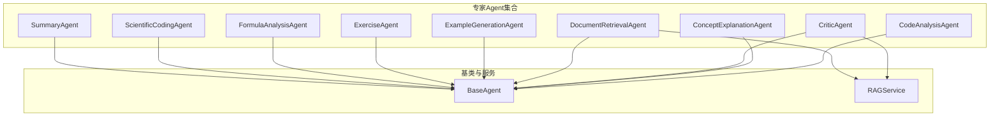
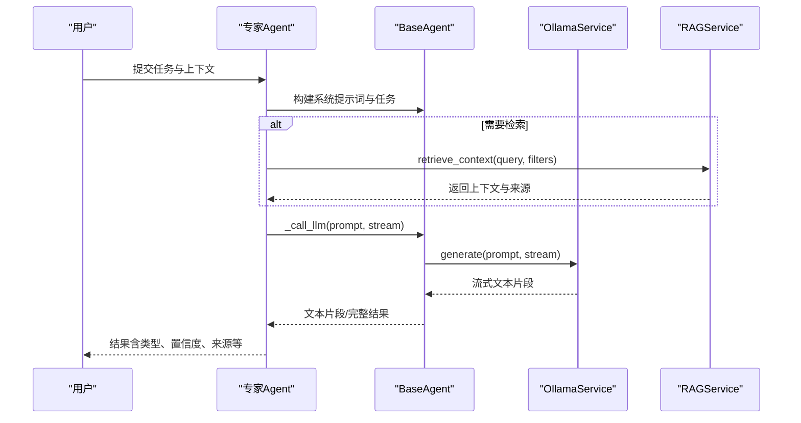
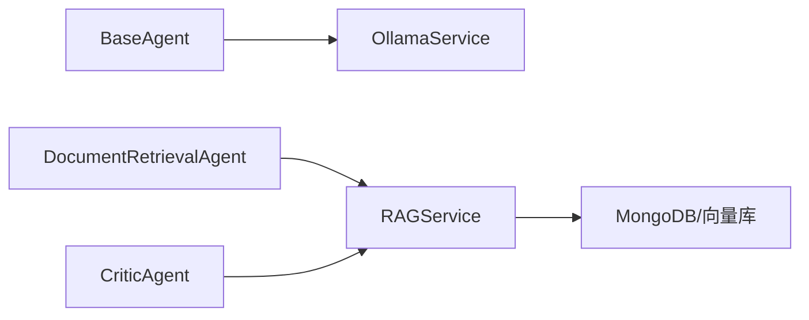

# 专家Agent集合

<cite>
**本文引用的文件**
- [agents/experts/__init__.py](file://agents/experts/__init__.py)
- [agents/experts/code_analysis_agent.py](file://agents/experts/code_analysis_agent.py)
- [agents/experts/concept_explanation_agent.py](file://agents/experts/concept_explanation_agent.py)
- [agents/experts/critic_agent.py](file://agents/experts/critic_agent.py)
- [agents/experts/document_retrieval_agent.py](file://agents/experts/document_retrieval_agent.py)
- [agents/experts/example_generation_agent.py](file://agents/experts/example_generation_agent.py)
- [agents/experts/exercise_agent.py](file://agents/experts/exercise_agent.py)
- [agents/experts/formula_analysis_agent.py](file://agents/experts/formula_analysis_agent.py)
- [agents/experts/scientific_coding_agent.py](file://agents/experts/scientific_coding_agent.py)
- [agents/experts/summary_agent.py](file://agents/experts/summary_agent.py)
- [agents/base/base_agent.py](file://agents/base/base_agent.py)
- [services/rag_service.py](file://services/rag_service.py)
- [utils/code_analyzer.py](file://utils/code_analyzer.py)
- [utils/formula_analyzer.py](file://utils/formula_analyzer.py)
- [utils/formula_extractor.py](file://utils/formula_extractor.py)
</cite>

## 目录
1. [引言](#引言)
2. [项目结构](#项目结构)
3. [核心组件](#核心组件)
4. [架构总览](#架构总览)
5. [详细组件分析](#详细组件分析)
6. [依赖分析](#依赖分析)
7. [性能考虑](#性能考虑)
8. [故障排查指南](#故障排查指南)
9. [结论](#结论)
10. [附录](#附录)

## 引言
本文件面向“专家Agent集合”的技术文档，系统梳理各Agent在专业领域的功能特性、实现原理与工程边界，覆盖代码分析、概念解释、批判性思维、文档检索、示例生成、练习生成、公式分析、科学编程与摘要等能力。文档同时给出性能特点、适用场景与集成方式，并提供Agent选择与组合使用的指导原则，帮助读者在实际业务中高效落地。

## 项目结构
专家Agent集合位于 agents/experts 目录，采用“按功能域划分”的模块化组织方式；每个Agent独立实现，共享统一的基类与通用服务。核心目录与文件如下：
- agents/experts：专家Agent集合（共8个）
- agents/base：Agent基类，统一接口与通用能力
- services：外部服务封装（如RAG服务）
- utils：通用工具（代码分析、公式提取与分析）

图表来源
- [agents/experts/__init__.py:1-22](file://agents/experts/__init__.py#L1-L22)
- [agents/base/base_agent.py:1-122](file://agents/base/base_agent.py#L1-L122)
- [services/rag_service.py:1-323](file://services/rag_service.py#L1-L323)

章节来源
- [agents/experts/__init__.py:1-22](file://agents/experts/__init__.py#L1-L22)

## 核心组件
- Agent基类 BaseAgent：定义统一接口（默认模型、系统提示词、执行流程），封装与LLM服务的交互与提示词构建。
- 专家Agent：围绕特定专业能力实现，均继承自 BaseAgent，具备一致的执行协议与错误处理策略。
- RAG服务：提供检索与上下文拼装能力，被文档检索与批判Agent复用。

章节来源
- [agents/base/base_agent.py:1-122](file://agents/base/base_agent.py#L1-L122)
- [services/rag_service.py:1-323](file://services/rag_service.py#L1-L323)

## 架构总览
专家Agent集合遵循“统一基类 + 专业Agent + 外部服务”的分层架构。Agent通过基类统一调用LLM服务，部分Agent（如文档检索、批判）进一步调用RAG服务以增强上下文质量与可信度。

图表来源
- [agents/base/base_agent.py:75-98](file://agents/base/base_agent.py#L75-L98)
- [services/rag_service.py:34-121](file://services/rag_service.py#L34-L121)

## 详细组件分析

### 代码分析Agent（CodeAnalysisAgent）
- 功能特性
  - 识别输入是否包含代码片段，若无则返回低置信度提示。
  - 对包含代码的任务，生成功能分析、关键段解释、优缺点与改进建议。
  - 支持流式输出，便于前端实时渲染。
- 实现要点
  - 通过关键词与代码块标记进行初步判定。
  - 使用统一提示词构建与LLM生成流程。
- 适用场景
  - 技术问答、代码审查、教学讲解中的代码解读。
- 性能与边界
  - 适合中短代码片段；对超长代码建议先切片。
  - 置信度较低时应引导用户提供更明确的代码上下文。
- 集成方式
  - 直接调用 execute(task, context, stream)，接收标准化结果。

章节来源
- [agents/experts/code_analysis_agent.py:1-79](file://agents/experts/code_analysis_agent.py#L1-L79)

### 概念解释Agent（ConceptExplanationAgent）
- 功能特性
  - 面向物理学概念的深度解释，涵盖定义、物理意义、公式、应用与关联。
- 实现要点
  - 固定系统提示词，强调结构化输出。
  - 统一的流式/完整输出协议。
- 适用场景
  - 物理教学、概念复习、跨学科知识衔接。
- 性能与边界
  - 输出质量依赖提示词与模型能力；对模糊问题建议明确概念范围。
- 集成方式
  - 传入“概念”主题即可获得结构化解释。

章节来源
- [agents/experts/concept_explanation_agent.py:1-70](file://agents/experts/concept_explanation_agent.py#L1-L70)

### 批判Agent（CriticAgent）
- 功能特性
  - 基于RAG检索的事实核查与逻辑评估，输出准确性评估、问题点、证据对比与修正建议。
- 实现要点
  - 先调用 RAGService 检索上下文，再驱动LLM进行批判性分析。
  - 返回 sources 以便溯源。
- 适用场景
  - 内容审核、事实核查、学术审稿辅助。
- 性能与边界
  - 检索质量直接影响批判效果；检索失败时返回错误类型结果。
- 集成方式
  - 传入上下文中的检索参数（如 document_id、assistant_id、知识空间ID等）以限定检索范围。

章节来源
- [agents/experts/critic_agent.py:1-90](file://agents/experts/critic_agent.py#L1-L90)
- [services/rag_service.py:34-121](file://services/rag_service.py#L34-L121)

### 文档检索Agent（DocumentRetrievalAgent）
- 功能特性
  - 从知识库检索相关文档片段，进行总结并标注来源与推荐资源。
- 实现要点
  - 调用 RAGService 检索，随后用LLM对检索结果做摘要。
  - 返回 raw_context、sources、recommended_resources 等丰富元数据。
- 适用场景
  - 智能问答、知识增强生成、学习资料推荐。
- 性能与边界
  - 检索参数动态调整，支持多集合并行检索；注意上下文长度与token预算。
- 集成方式
  - 传入 document_id/assistant_id/knowledge_space_ids 等上下文参数。

章节来源
- [agents/experts/document_retrieval_agent.py:1-79](file://agents/experts/document_retrieval_agent.py#L1-L79)
- [services/rag_service.py:34-121](file://services/rag_service.py#L34-L121)

### 示例生成Agent（ExampleGenerationAgent）
- 功能特性
  - 面向问题生成实际应用示例，覆盖从简单到复杂的多层级示例与完整解题过程。
- 实现要点
  - 固定系统提示词，强调示例多样性与物理意义说明。
- 适用场景
  - 教学演示、学习辅助、题库建设。
- 性能与边界
  - 对复杂问题建议拆分；对模糊问题建议补充背景信息。
- 集成方式
  - 直接传入问题主题，获得示例与解题步骤。

章节来源
- [agents/experts/example_generation_agent.py:1-68](file://agents/experts/example_generation_agent.py#L1-L68)

### 练习生成Agent（ExerciseAgent）
- 功能特性
  - 自动区分“解题”与“出题”，分别提供详细解题步骤与多种题型（选择、填空、计算、应用）。
- 实现要点
  - 基于关键词判断任务类型，分别构造提示词。
  - 输出包含模式标识与高置信度。
- 适用场景
  - 自适应学习、课堂练习、课后巩固。
- 性能与边界
  - 关键词规则简单有效，但需避免歧义；必要时显式指明“解题/出题”。
- 集成方式
  - 传入任务文本，自动分流至相应模式。

章节来源
- [agents/experts/exercise_agent.py:1-102](file://agents/experts/exercise_agent.py#L1-L102)

### 公式分析Agent（FormulaAnalysisAgent）
- 功能特性
  - 识别LaTeX公式，解释物理意义、变量含义、适用条件与应用场景，并可提供推导说明。
- 实现要点
  - 使用公式提取工具识别块级/行内公式，再进行结构化解析。
  - 内置正则匹配与去重机制。
- 适用场景
  - 物理/数学教学、公式手册、学术写作辅助。
- 性能与边界
  - 对非LaTeX或格式不规范的公式识别有限；建议规范化输入。
- 集成方式
  - 直接传入包含公式的文本，获得分析结果与变量清单。

章节来源
- [agents/experts/formula_analysis_agent.py:1-107](file://agents/experts/formula_analysis_agent.py#L1-L107)
- [utils/formula_extractor.py:1-149](file://utils/formula_extractor.py#L1-L149)
- [utils/formula_analyzer.py:1-233](file://utils/formula_analyzer.py#L1-L233)

### 科学编程Agent（ScientificCodingAgent）
- 功能特性
  - 生成符合学术规范的科学计算代码（MATLAB/Python），包含注释、变量命名、错误处理与可视化。
- 实现要点
  - 明确语言偏好与代码规范，强调可读性与可复现性。
- 适用场景
  - 科研论文、实验脚本、数据分析自动化。
- 性能与边界
  - 对复杂算法建议分模块实现；对特殊库依赖需在提示词中明确。
- 集成方式
  - 传入需求描述，获得完整代码与使用说明。

章节来源
- [agents/experts/scientific_coding_agent.py:1-82](file://agents/experts/scientific_coding_agent.py#L1-L82)

### 摘要Agent（SummaryAgent）
- 功能特性
  - 对多Agent协同产出的信息进行总结归纳，提炼核心要点与学习建议。
- 实现要点
  - 读取 context.other_results，格式化后交由LLM生成总结。
- 适用场景
  - 复合任务的最终整合、报告生成、学习路径汇总。
- 性能与边界
  - 输入信息质量直接影响摘要质量；建议在上游Agent提供结构化输出。
- 集成方式
  - 传入 task 与 context.other_results，获得高质量总结。

章节来源
- [agents/experts/summary_agent.py:1-87](file://agents/experts/summary_agent.py#L1-L87)

### 代码分析工具（CodeAnalyzer）
- 功能特性
  - 识别语言、提取函数/类/导入、统计变量与关键字、估算复杂度。
- 实现要点
  - 基于正则的多语言解析，支持Python/JavaScript/Java/C++。
- 适用场景
  - 代码静态分析、教学辅助、代码审计预处理。
- 性能与边界
  - 正则解析在极复杂语法下可能受限；建议配合AST工具链使用。
- 集成方式
  - 直接调用静态方法进行代码块分析。

章节来源
- [utils/code_analyzer.py:1-350](file://utils/code_analyzer.py#L1-L350)

### 公式提取与分析工具
- 功能特性
  - 提取LaTeX块级/行内公式，规范化常见字符，分析变量、关系、函数与结构复杂度。
- 实现要点
  - 多正则模式匹配，避免重叠覆盖；支持物理量定义检测。
- 适用场景
  - 数学/物理文本处理、公式数据库构建、教学材料清洗。
- 性能与边界
  - 正则匹配效率高但易受格式影响；建议预处理文本。
- 集成方式
  - 先提取，再逐条分析，最后汇总结构化结果。

章节来源
- [utils/formula_extractor.py:1-149](file://utils/formula_extractor.py#L1-L149)
- [utils/formula_analyzer.py:1-233](file://utils/formula_analyzer.py#L1-L233)

## 依赖分析
- 组件耦合
  - 专家Agent均依赖 BaseAgent 的统一接口与LLM调用封装。
  - DocumentRetrievalAgent 与 CriticAgent 依赖 RAGService，形成“检索-生成”的典型链路。
- 外部依赖
  - OllamaService：统一的LLM生成服务。
  - MongoDB/向量库：RAG检索的数据基础（由 RAGService 封装）。
- 循环依赖
  - 未发现循环依赖；模块职责清晰。

图表来源
- [agents/base/base_agent.py:23-25](file://agents/base/base_agent.py#L23-L25)
- [services/rag_service.py:58-95](file://services/rag_service.py#L58-L95)

章节来源
- [agents/base/base_agent.py:1-122](file://agents/base/base_agent.py#L1-L122)
- [services/rag_service.py:1-323](file://services/rag_service.py#L1-L323)

## 性能考虑
- 检索与上下文控制
  - RAGService 动态调节 prefetch_k/final_k，控制召回规模；并对上下文进行token预算与截断，避免过长prompt导致性能下降。
- 流式输出
  - 各Agent普遍支持流式输出，降低首屏延迟，提升用户体验。
- 模型选择
  - 不同Agent配置不同默认模型，兼顾成本与质量；可根据任务复杂度选择更合适的模型。
- 并行检索
  - RAGService 支持多集合并行检索，缩短响应时间。

章节来源
- [services/rag_service.py:11-32](file://services/rag_service.py#L11-L32)
- [services/rag_service.py:97-121](file://services/rag_service.py#L97-L121)

## 故障排查指南
- Agent执行失败
  - 各Agent在异常时返回“error”类型结果，包含错误信息与agent_type，便于前端展示与日志追踪。
- 检索失败
  - CriticAgent/DocumentRetrievalAgent 在检索阶段失败时，返回错误提示；可检查上下文参数（如 document_id、assistant_id、知识空间ID）是否正确。
- 公式/代码识别不足
  - 若公式未被识别，检查输入是否为LaTeX格式或存在转义问题；若代码未被识别，检查是否包含代码块标记或函数/类定义关键词。
- 性能问题
  - 上下文过长或检索集合过多会导致延迟上升；建议缩小检索范围或减少并发集合数量。

章节来源
- [agents/experts/critic_agent.py:50-57](file://agents/experts/critic_agent.py#L50-L57)
- [agents/experts/document_retrieval_agent.py:71-77](file://agents/experts/document_retrieval_agent.py#L71-L77)
- [agents/experts/code_analysis_agent.py:71-77](file://agents/experts/code_analysis_agent.py#L71-L77)
- [agents/experts/formula_analysis_agent.py:81-87](file://agents/experts/formula_analysis_agent.py#L81-L87)

## 结论
专家Agent集合以统一基类为核心，围绕8类专业能力构建了可插拔、可扩展的Agent体系。通过RAG服务与工具链的配合，能够覆盖从知识检索、概念解释、公式分析到代码生成与学习路径设计的全栈场景。建议在实际部署中结合任务类型选择合适Agent，并通过上下文参数与检索范围优化性能与质量。

## 附录

### Agent选择与组合使用指导
- 单Agent场景
  - 代码问题：优先 CodeAnalysisAgent。
  - 概念学习： ConceptExplanationAgent。
  - 公式理解： FormulaAnalysisAgent。
  - 示例生成： ExampleGenerationAgent。
  - 练习生成： ExerciseAgent。
  - 科学编程： ScientificCodingAgent。
  - 文档问答： DocumentRetrievalAgent。
  - 质量把关： CriticAgent。
- 复合场景
  - “检索-解释-示例-总结”链路：DocumentRetrievalAgent → ConceptExplanationAgent → ExampleGenerationAgent → SummaryAgent。
  - “检索-批判-生成”链路：DocumentRetrievalAgent → CriticAgent → 任意生成型Agent。
  - “公式-分析-生成”链路：FormulaAnalysisAgent → ScientificCodingAgent。
- 参数与上下文
  - 使用 knowledge_space_ids、assistant_id、document_id 精准限定检索范围，提升相关性与性能。
- 置信度与结果类型
  - 关注结果中的 agent_type、confidence 与 sources 字段，便于前端呈现与二次加工。