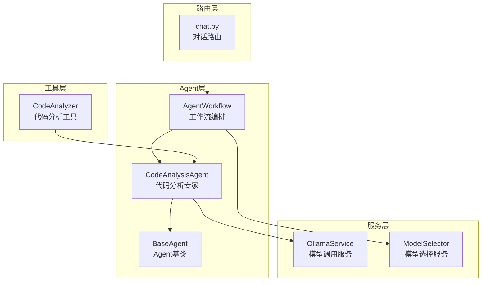
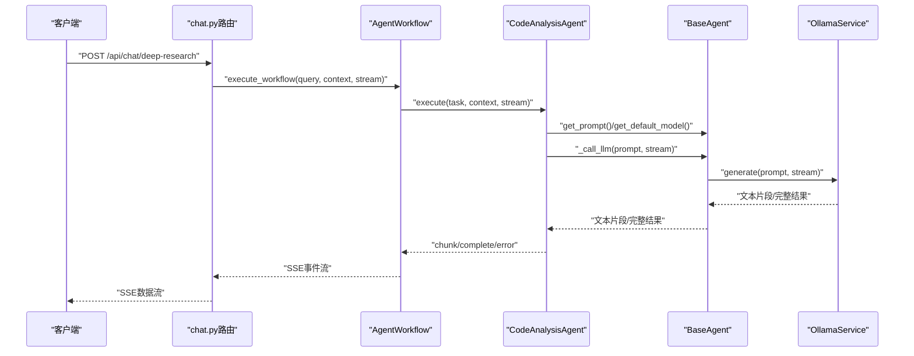
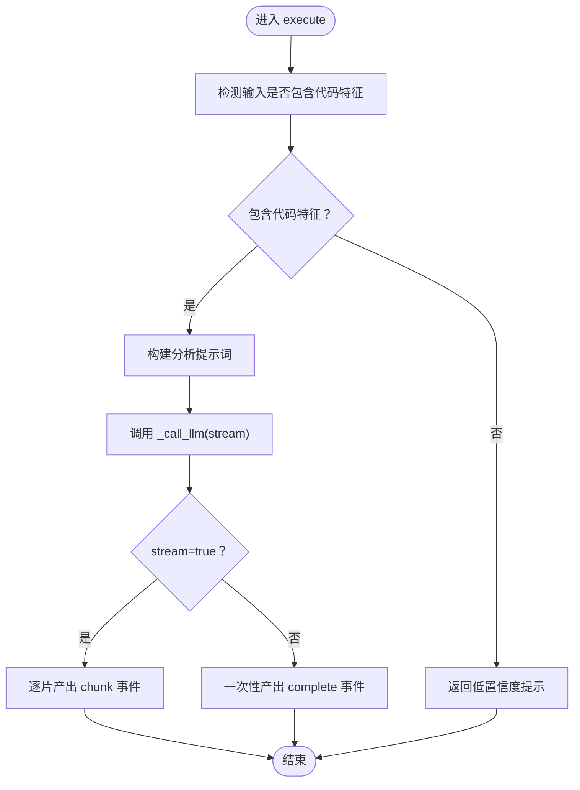
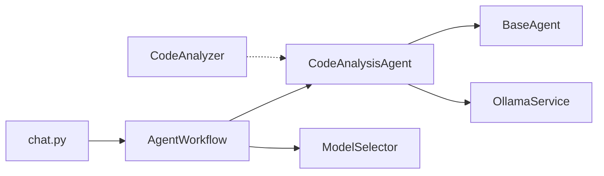

# 代码分析Agent

<cite>
**本文档引用的文件**
- [agents/experts/code_analysis_agent.py](file://agents/experts/code_analysis_agent.py)
- [agents/base/base_agent.py](file://agents/base/base_agent.py)
- [agents/workflow/agent_workflow.py](file://agents/workflow/agent_workflow.py)
- [services/ollama_service.py](file://services/ollama_service.py)
- [utils/code_analyzer.py](file://utils/code_analyzer.py)
- [routers/chat.py](file://routers/chat.py)
- [models/agent_config.py](file://models/agent_config.py)
- [services/model_selector.py](file://services/model_selector.py)
</cite>

## 目录
1. [简介](#简介)
2. [项目结构](#项目结构)
3. [核心组件](#核心组件)
4. [架构总览](#架构总览)
5. [详细组件分析](#详细组件分析)
6. [依赖关系分析](#依赖关系分析)
7. [性能考量](#性能考量)
8. [故障排查指南](#故障排查指南)
9. [结论](#结论)
10. [附录](#附录)

## 简介
本文件面向“代码分析Agent”的技术文档，系统性阐述其核心能力、默认模型配置、系统提示词设计原理、执行流程与响应格式、代码检测机制、流式响应实现、错误处理与置信度评分策略，并给出与其他Agent的协作模式与适用场景指导。该Agent专注于对代码示例进行功能与逻辑分析、关键部分解释、优缺点评估以及改进建议生成，适用于教学、代码审查、技术答疑与知识沉淀等场景。

## 项目结构
代码分析Agent位于多Agent协作体系中，与基类Agent、工作流编排器、Ollama服务、代码分析工具、路由层等模块协同工作。整体结构如下：



图表来源
- [agents/experts/code_analysis_agent.py:1-79](file://agents/experts/code_analysis_agent.py#L1-L79)
- [agents/base/base_agent.py:1-122](file://agents/base/base_agent.py#L1-L122)
- [agents/workflow/agent_workflow.py:1-388](file://agents/workflow/agent_workflow.py#L1-L388)
- [services/ollama_service.py:1-674](file://services/ollama_service.py#L1-L674)
- [utils/code_analyzer.py:1-350](file://utils/code_analyzer.py#L1-L350)
- [routers/chat.py:1-200](file://routers/chat.py#L1-L200)

章节来源
- [agents/experts/code_analysis_agent.py:1-79](file://agents/experts/code_analysis_agent.py#L1-L79)
- [agents/base/base_agent.py:1-122](file://agents/base/base_agent.py#L1-L122)
- [agents/workflow/agent_workflow.py:1-388](file://agents/workflow/agent_workflow.py#L1-L388)
- [services/ollama_service.py:1-674](file://services/ollama_service.py#L1-L674)
- [utils/code_analyzer.py:1-350](file://utils/code_analyzer.py#L1-L350)
- [routers/chat.py:1-200](file://routers/chat.py#L1-L200)

## 核心组件
- 代码分析Agent（CodeAnalysisAgent）：负责接收任务、检测输入是否包含代码、构造分析提示词、调用LLM生成结果、支持流式输出与错误处理，并返回标准化响应。
- Agent基类（BaseAgent）：提供统一接口、默认模型选择、系统提示词拼接、与Ollama服务交互的封装。
- 工作流编排（AgentWorkflow）：协调多Agent协作，按需选择专家Agent，顺序执行并汇总结果，支持流式状态推送。
- Ollama服务（OllamaService）：封装与本地Ollama服务的通信，支持流式与非流式生成，构建完整提示词，处理工具函数调用。
- 代码分析工具（CodeAnalyzer）：提取代码的语言、函数、类、导入、变量、关键字等语法与语义特征，辅助代码检测与复杂度评估。
- 路由层（chat.py）：提供深度研究模式的SSE流式接口，将工作流结果转化为前端可消费的事件流。

章节来源
- [agents/experts/code_analysis_agent.py:1-79](file://agents/experts/code_analysis_agent.py#L1-L79)
- [agents/base/base_agent.py:1-122](file://agents/base/base_agent.py#L1-L122)
- [agents/workflow/agent_workflow.py:1-388](file://agents/workflow/agent_workflow.py#L1-L388)
- [services/ollama_service.py:1-674](file://services/ollama_service.py#L1-L674)
- [utils/code_analyzer.py:1-350](file://utils/code_analyzer.py#L1-L350)
- [routers/chat.py:800-922](file://routers/chat.py#L800-L922)

## 架构总览
代码分析Agent在系统中的位置与交互如下：



图表来源
- [routers/chat.py:800-922](file://routers/chat.py#L800-L922)
- [agents/workflow/agent_workflow.py:106-337](file://agents/workflow/agent_workflow.py#L106-L337)
- [agents/experts/code_analysis_agent.py:25-78](file://agents/experts/code_analysis_agent.py#L25-L78)
- [agents/base/base_agent.py:75-122](file://agents/base/base_agent.py#L75-L122)
- [services/ollama_service.py:50-93](file://services/ollama_service.py#L50-L93)

## 详细组件分析

### 代码分析Agent（CodeAnalysisAgent）
- 默认模型配置：gpt-oss:20b
- 系统提示词设计：聚焦于“代码功能与逻辑分析、关键部分解释、优缺点评估、改进建议、应用场景说明”，形成结构化任务清单，便于模型稳定输出。
- 输入检测机制：通过代码块标记（```）、函数定义（def）、类声明（class）等特征进行初步判定，若未检测到代码，直接返回低置信度的提示信息。
- 执行流程：
  - 构造分析提示词（包含问题与输出清单）
  - 调用基类封装的LLM生成接口，支持流式与非流式
  - 流式模式下逐片产出，非流式模式一次性返回完整结果
  - 成功完成时返回高置信度结果，异常时返回错误事件
- 响应格式：
  - chunk事件：type="chunk"，携带content与agent_type
  - complete事件：type="complete"，携带content、agent_type与confidence
  - error事件：type="error"，携带错误信息与agent_type
- 置信度策略：
  - 未检测到代码：confidence=0.3
  - 正常完成：confidence=0.85
- 错误处理：捕获异常并记录日志，返回标准化错误事件



图表来源
- [agents/experts/code_analysis_agent.py](file://agents/experts/code_analysis_agent.py#L25-L78)

章节来源
- [agents/experts/code_analysis_agent.py](file://agents/experts/code_analysis_agent.py#L1-L79)

### Agent基类（BaseAgent）
- 统一接口：get_default_model、execute、get_prompt、_call_llm、_build_prompt
- 模型选择：优先使用子类指定的默认模型，否则回退至子类实现
- LLM调用：通过OllamaService进行生成，支持流式与非流式
- 提示词拼接：将系统提示词与上下文信息合并，形成最终提示

章节来源
- [agents/base/base_agent.py](file://agents/base/base_agent.py#L1-L122)

### 工作流编排（AgentWorkflow）
- Agent映射：将Agent类型映射到具体实现类，包括代码分析Agent
- 配置加载：从数据库读取Agent配置（推理模型、嵌入模型），支持缓存与降级
- 协调执行：顺序执行被选中的专家Agent，实时推送状态事件（planning、agent_status、agent_result、complete、error）
- 流式状态：为前端提供进度与状态更新，便于可视化展示

章节来源
- [agents/workflow/agent_workflow.py](file://agents/workflow/agent_workflow.py#L1-L388)

### Ollama服务（OllamaService）
- 流式生成：封装Ollama的流式API，处理超时、空闲超时、连接错误等异常
- 提示词构建：整合系统提示词、知识库状态、文档信息、对话历史与工具函数调用结果
- 超时与稳定性：设置较长超时时间，适配大模型生成耗时

章节来源
- [services/ollama_service.py](file://services/ollama_service.py#L1-L674)

### 代码分析工具（CodeAnalyzer）
- 语言检测：基于常见关键字与语法特征识别Python、JavaScript、Java、C++
- 函数提取：按语言匹配函数定义，提取函数名与参数
- 类提取：识别类声明，提取类名
- 导入提取：提取import/from/import ... from等导入语句
- 复杂度估算：综合行数、控制结构与函数数量，给出简单/中等/复杂等级

章节来源
- [utils/code_analyzer.py](file://utils/code_analyzer.py#L1-L350)

### 路由层（chat.py）
- 深度研究模式：提供SSE流式接口，将工作流结果序列化为事件流
- 断连检测：定期检查客户端连接状态，优雅中断流式输出
- HTML聚合：在工作流完成后构建HTML响应并推送

章节来源
- [routers/chat.py](file://routers/chat.py#L800-L922)

## 依赖关系分析
- 代码分析Agent依赖Agent基类与Ollama服务，实现统一的执行接口与模型调用
- 工作流编排器依赖各专家Agent实现类，负责调度与状态推送
- 代码分析工具独立存在，可被上层逻辑调用以增强代码检测与特征提取
- 路由层依赖工作流编排器，提供对外的SSE接口



图表来源
- [agents/experts/code_analysis_agent.py](file://agents/experts/code_analysis_agent.py#L1-L79)
- [agents/base/base_agent.py](file://agents/base/base_agent.py#L1-L122)
- [agents/workflow/agent_workflow.py](file://agents/workflow/agent_workflow.py#L1-L388)
- [services/ollama_service.py](file://services/ollama_service.py#L1-L674)
- [utils/code_analyzer.py](file://utils/code_analyzer.py#L1-L350)
- [routers/chat.py](file://routers/chat.py#L1-L200)

章节来源
- [agents/experts/code_analysis_agent.py](file://agents/experts/code_analysis_agent.py#L1-L79)
- [agents/workflow/agent_workflow.py](file://agents/workflow/agent_workflow.py#L1-L388)
- [services/model_selector.py](file://services/model_selector.py#L1-L206)

## 性能考量
- 流式输出：通过SSE与异步生成降低首屏延迟，提升用户体验
- 超时与空闲控制：Ollama服务对流式请求设置最大空闲时间与总超时，避免长时间占用资源
- 连接断开检测：路由层定期检查客户端连接状态，及时终止无效流
- 模型选择：ModelSelector在需要公式/知识型回答时快速分流，减少不必要的大模型调用

## 故障排查指南
- 未检测到代码：Agent会在输入不包含代码特征时返回低置信度提示，确认输入是否包含代码块或函数/类定义
- 流式输出异常：检查Ollama服务可达性与超时配置，关注空闲超时与连接错误日志
- 工作流中断：确认客户端连接状态，路由层会自动检测断连并终止流式输出
- 模型配置问题：Agent配置可从数据库读取，若读取失败将使用默认配置，检查数据库连接与配置项

章节来源
- [agents/experts/code_analysis_agent.py](file://agents/experts/code_analysis_agent.py#L34-L41)
- [services/ollama_service.py](file://services/ollama_service.py#L453-L638)
- [routers/chat.py](file://routers/chat.py#L824-L896)

## 结论
代码分析Agent以简洁而稳健的方式实现了对代码的结构化分析与解释，结合工作流编排与流式输出，能够满足教学、审查与知识沉淀等多种场景需求。其默认模型配置与提示词设计兼顾准确性与稳定性，配合完善的错误处理与置信度策略，为上层应用提供了可靠的代码分析能力。

## 附录

### 默认模型与提示词
- 默认模型：gpt-oss:20b
- 系统提示词要点：功能与逻辑分析、关键部分解释、优缺点评估、改进建议、应用场景说明

章节来源
- [agents/experts/code_analysis_agent.py](file://agents/experts/code_analysis_agent.py#L10-L23)

### 响应事件类型
- chunk：流式文本片段
- complete：完整结果，包含content、agent_type与confidence
- error：错误信息，包含agent_type与错误描述

章节来源
- [agents/experts/code_analysis_agent.py](file://agents/experts/code_analysis_agent.py#L54-L77)

### 代码检测机制
- 代码块标记：```出现
- 函数定义：def
- 类声明：class
- 未检测到时返回低置信度提示

章节来源
- [agents/experts/code_analysis_agent.py:34-41](file://agents/experts/code_analysis_agent.py#L34-L41)

### 使用示例（场景与流程）
- 场景A：用户提交一段代码并询问功能与实现细节
  - 流程：路由层接收请求 → 工作流编排器选择代码分析Agent → Agent执行分析 → 流式返回chunk → 完成后返回complete
- 场景B：用户仅提出一般性问题，未包含代码
  - 流程：Agent检测未包含代码特征 → 返回低置信度提示

章节来源
- [routers/chat.py:800-922](file://routers/chat.py#L800-L922)
- [agents/workflow/agent_workflow.py:106-337](file://agents/workflow/agent_workflow.py#L106-L337)
- [agents/experts/code_analysis_agent.py:34-77](file://agents/experts/code_analysis_agent.py#L34-L77)