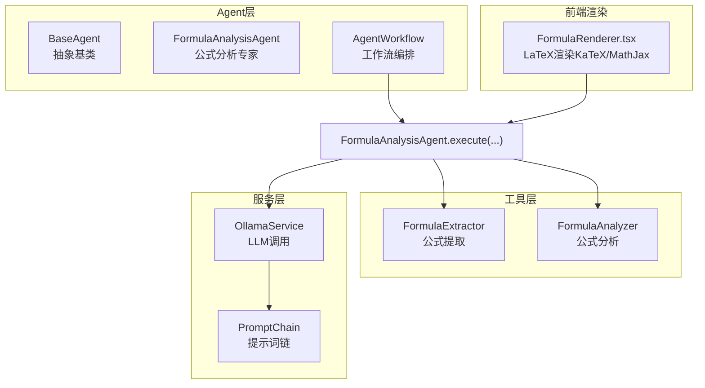
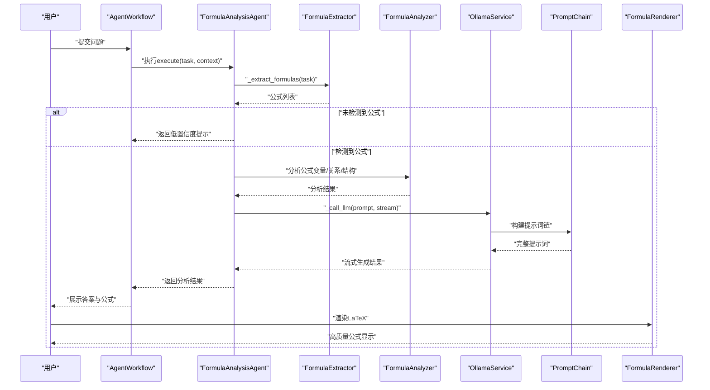
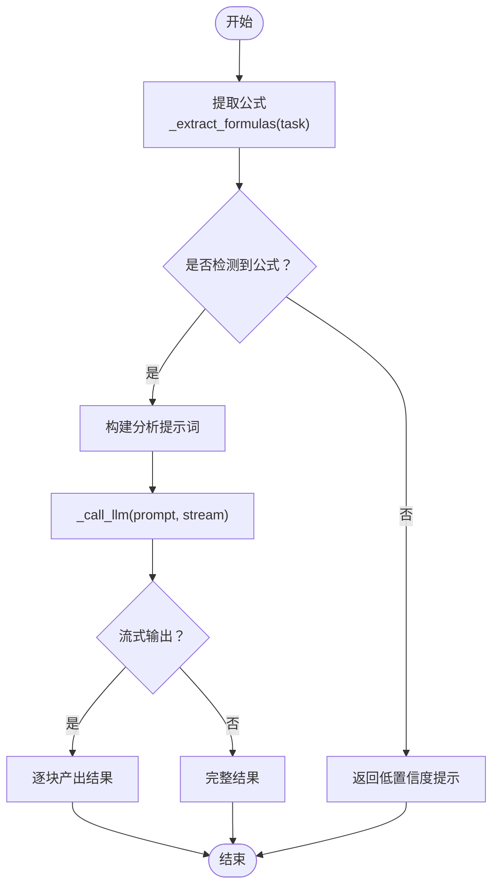
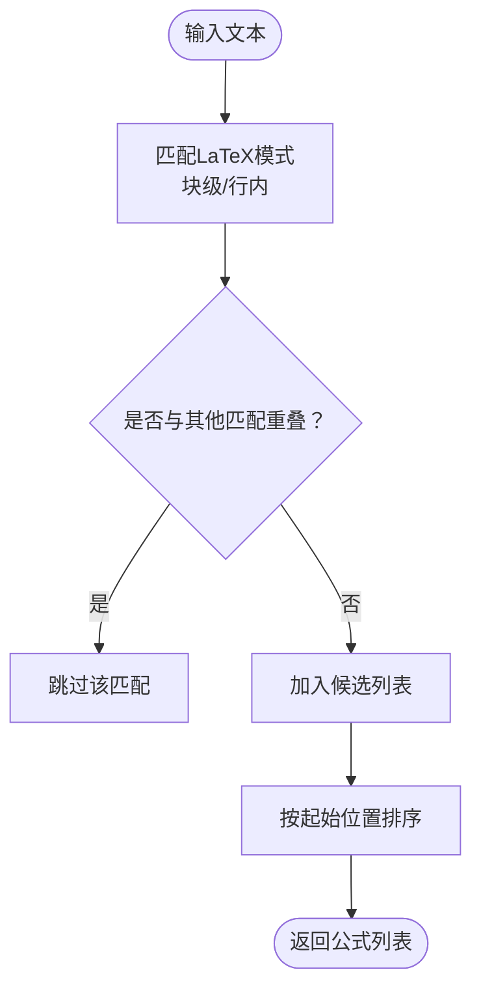
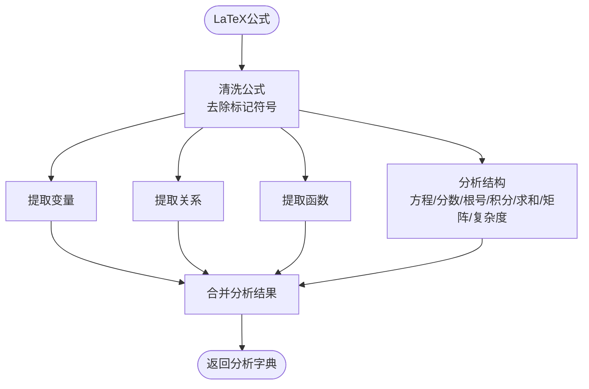
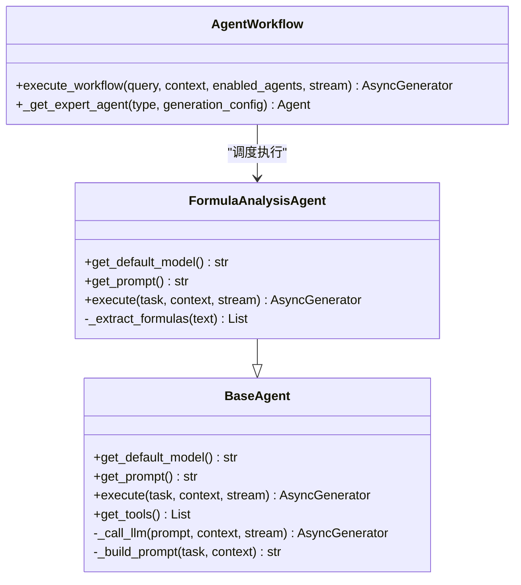
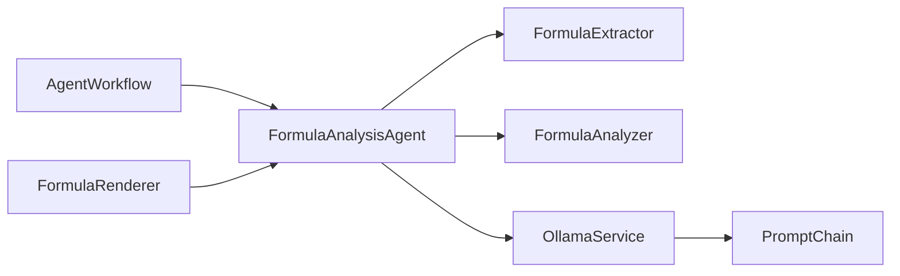

# 公式分析Agent

<cite>
**本文引用的文件**
- [agents/experts/formula_analysis_agent.py](file://agents/experts/formula_analysis_agent.py)
- [utils/formula_analyzer.py](file://utils/formula_analyzer.py)
- [utils/formula_extractor.py](file://utils/formula_extractor.py)
- [agents/base/base_agent.py](file://agents/base/base_agent.py)
- [agents/workflow/agent_workflow.py](file://agents/workflow/agent_workflow.py)
- [services/ollama_service.py](file://services/ollama_service.py)
- [services/prompt_chain.py](file://services/prompt_chain.py)
- [web/components/message/FormulaRenderer.tsx](file://web/components/message/FormulaRenderer.tsx)
- [README.md](file://README.md)
</cite>

## 目录
1. [简介](#简介)
2. [项目结构](#项目结构)
3. [核心组件](#核心组件)
4. [架构总览](#架构总览)
5. [详细组件分析](#详细组件分析)
6. [依赖关系分析](#依赖关系分析)
7. [性能考量](#性能考量)
8. [故障排查指南](#故障排查指南)
9. [结论](#结论)
10. [附录](#附录)

## 简介
本文件面向“公式分析Agent”的技术文档，系统性阐述其在数学符号识别、公式解析、语义理解、变换推导与验证检查等方面的实现与使用方法。文档覆盖Agent的系统提示词设计、复杂公式处理策略、前后端渲染集成、以及与科学计算系统的协同方式，并提供可操作的使用案例与最佳实践。

## 项目结构
公式分析Agent位于多Agent协作体系中，属于专家Agent之一，通过工作流编排器统一调度。其核心能力由三个层次构成：
- 前端渲染层：负责LaTeX公式在浏览器中的高质量渲染（KaTeX/MathJax）。
- 工具层：提供公式提取、标准化与结构分析能力。
- Agent层：基于LLM对公式进行语义解释、变量分析、适用条件与应用场景说明，并可提供推导过程。

图表来源
- [agents/workflow/agent_workflow.py](file://agents/workflow/agent_workflow.py)
- [agents/experts/formula_analysis_agent.py](file://agents/experts/formula_analysis_agent.py)
- [utils/formula_extractor.py](file://utils/formula_extractor.py)
- [utils/formula_analyzer.py](file://utils/formula_analyzer.py)
- [services/ollama_service.py](file://services/ollama_service.py)
- [services/prompt_chain.py](file://services/prompt_chain.py)
- [web/components/message/FormulaRenderer.tsx](file://web/components/message/FormulaRenderer.tsx)

章节来源
- [README.md](file://README.md)
- [agents/workflow/agent_workflow.py](file://agents/workflow/agent_workflow.py)
- [agents/experts/formula_analysis_agent.py](file://agents/experts/formula_analysis_agent.py)

## 核心组件
- 公式分析专家Agent：负责识别问题中的公式，解释物理意义、变量含义、适用条件与场景，并可提供推导过程。
- 公式提取器：从文本中提取LaTeX块级/行内公式及物理量定义，避免重复与重叠。
- 公式分析器：对LaTeX公式进行变量、关系、函数与结构分析，计算复杂度等级。
- 基类Agent：提供统一的模型选择、提示词构建与LLM调用能力。
- 工作流编排器：协调多Agent协作，按规划结果顺序执行专家Agent。
- Ollama服务：封装本地LLM调用，支持流式与非流式生成，构建提示词链。
- 前端公式渲染：优先使用KaTeX，不支持时回退至MathJax，保证公式渲染质量与稳定性。

章节来源
- [agents/experts/formula_analysis_agent.py](file://agents/experts/formula_analysis_agent.py)
- [utils/formula_extractor.py](file://utils/formula_extractor.py)
- [utils/formula_analyzer.py](file://utils/formula_analyzer.py)
- [agents/base/base_agent.py](file://agents/base/base_agent.py)
- [agents/workflow/agent_workflow.py](file://agents/workflow/agent_workflow.py)
- [services/ollama_service.py](file://services/ollama_service.py)
- [web/components/message/FormulaRenderer.tsx](file://web/components/message/FormulaRenderer.tsx)

## 架构总览
公式分析Agent的执行流程如下：
- 输入问题文本，Agent首先调用公式提取器识别LaTeX公式。
- 若未检测到公式，Agent返回低置信度提示；否则进入分析阶段。
- Agent构建分析提示词，调用Ollama服务生成回答，支持流式输出。
- 前端使用FormulaRenderer组件渲染LaTeX，优先KaTeX，必要时回退MathJax。

图表来源
- [agents/experts/formula_analysis_agent.py](file://agents/experts/formula_analysis_agent.py)
- [utils/formula_extractor.py](file://utils/formula_extractor.py)
- [utils/formula_analyzer.py](file://utils/formula_analyzer.py)
- [services/ollama_service.py](file://services/ollama_service.py)
- [services/prompt_chain.py](file://services/prompt_chain.py)
- [web/components/message/FormulaRenderer.tsx](file://web/components/message/FormulaRenderer.tsx)

## 详细组件分析

### 公式分析专家Agent
- 角色定位：专门分析数学与物理公式，解释物理意义、变量含义、适用条件与应用场景，并可提供推导过程。
- 默认模型：使用较大的语言模型以提升复杂公式分析与推导能力。
- 执行流程：
  - 提取公式：使用正则匹配LaTeX块级/行内公式，去重后得到候选集合。
  - 构建分析提示词：将问题与检测到的公式组合，明确分析维度。
  - 调用LLM：通过OllamaService生成回答，支持流式输出。
  - 结果封装：返回完整结果、公式列表与置信度。

图表来源
- [agents/experts/formula_analysis_agent.py](file://agents/experts/formula_analysis_agent.py)

章节来源
- [agents/experts/formula_analysis_agent.py](file://agents/experts/formula_analysis_agent.py)

### 公式提取器
- 功能：从文本中提取LaTeX块级与行内公式，避免重叠匹配，按出现位置排序。
- 支持模式：
  - 块级：双美元、方括号环境、equation/align/matrix环境。
  - 行内：单美元、圆括号环境。
- 物理量定义：识别形如“变量=数值单位”的定义式，便于变量语义标注。
- 规范化：将常见错误编码替换为标准LaTeX符号，统一空格与格式。

图表来源
- [utils/formula_extractor.py](file://utils/formula_extractor.py)

章节来源
- [utils/formula_extractor.py](file://utils/formula_extractor.py)

### 公式分析器
- 功能：对LaTeX公式进行变量、关系、函数与结构分析，并计算复杂度等级。
- 变量提取：支持单字母、带下标（花括号/简单）、正体与文本变量。
- 关系提取：识别等式与不等式关系，标注左右两侧表达式。
- 函数提取：识别LaTeX命令与常见函数名。
- 结构分析：判断是否为方程、是否包含分数/根号/积分/求和/矩阵等，计算复杂度等级（简单/中等/复杂）。
- 全量分析：批量提取并分析文本中的所有公式，附带类型与位置信息。

图表来源
- [utils/formula_analyzer.py](file://utils/formula_analyzer.py)

章节来源
- [utils/formula_analyzer.py](file://utils/formula_analyzer.py)

### 基类Agent与工作流编排
- 基类Agent：
  - 提供默认模型选择、系统提示词获取、工具列表与提示词构建。
  - 统一LLM调用接口，支持流式与非流式生成。
- 工作流编排：
  - 协调专家Agent执行，按规划结果顺序调度。
  - 支持手动指定Agent列表或由协调Agent动态选择。
  - 提供状态上报与结果聚合，便于前端实时展示。

图表来源
- [agents/base/base_agent.py](file://agents/base/base_agent.py)
- [agents/experts/formula_analysis_agent.py](file://agents/experts/formula_analysis_agent.py)
- [agents/workflow/agent_workflow.py](file://agents/workflow/agent_workflow.py)

章节来源
- [agents/base/base_agent.py](file://agents/base/base_agent.py)
- [agents/workflow/agent_workflow.py](file://agents/workflow/agent_workflow.py)

### LLM调用与提示词链
- OllamaService：
  - 支持流式与非流式生成，内置超时与异常处理。
  - 构建完整提示词：基础提示词 + 助手特定提示词 + 上下文信息 + 对话历史 + 工具调用结果。
- PromptChain：
  - 提供基础提示词获取与工具描述格式化，确保Agent遵循统一回答原则与格式要求。
  - 特别强调数学公式必须使用KaTeX兼容的LaTeX格式输出，保证前端渲染一致性。

章节来源
- [services/ollama_service.py](file://services/ollama_service.py)
- [services/prompt_chain.py](file://services/prompt_chain.py)

### 前端公式渲染
- FormulaRenderer：
  - 优先使用KaTeX进行快速渲染；遇到不支持的命令时触发MathJax回退。
  - 自动为行内公式添加“公式”标识圈，增强可读性。
  - 支持深色模式适配与字体加载失败的健壮性处理。

章节来源
- [web/components/message/FormulaRenderer.tsx](file://web/components/message/FormulaRenderer.tsx)

## 依赖关系分析
- 组件耦合：
  - FormulaAnalysisAgent依赖FormulaExtractor与FormulaAnalyzer进行预处理与分析。
  - AgentWorkflow负责调度与状态上报，解耦Agent与外部系统。
  - OllamaService与PromptChain共同决定最终提示词质量与输出格式。
- 外部依赖：
  - Ollama本地推理服务，支持长超时与流式输出。
  - 前端KaTeX/MathJax，保证LaTeX渲染质量与兼容性。
- 潜在风险：
  - 公式提取正则复杂度与性能：需关注大规模文本的匹配效率。
  - LLM生成质量与稳定性：依赖提示词链与模型配置，需持续优化。

图表来源
- [agents/experts/formula_analysis_agent.py](file://agents/experts/formula_analysis_agent.py)
- [utils/formula_extractor.py](file://utils/formula_extractor.py)
- [utils/formula_analyzer.py](file://utils/formula_analyzer.py)
- [services/ollama_service.py](file://services/ollama_service.py)
- [services/prompt_chain.py](file://services/prompt_chain.py)
- [agents/workflow/agent_workflow.py](file://agents/workflow/agent_workflow.py)
- [web/components/message/FormulaRenderer.tsx](file://web/components/message/FormulaRenderer.tsx)

## 性能考量
- 公式提取：
  - 使用正则匹配与去重策略，避免重复扫描；对重叠区域进行过滤，减少无效匹配。
  - 建议在大规模文本中分段处理，降低内存与CPU压力。
- LLM调用：
  - 流式输出可显著改善用户体验，但需注意网络抖动与超时处理。
  - 超时时间可配置，建议根据模型大小与硬件条件合理设置。
- 渲染性能：
  - KaTeX优先渲染，MathJax按需加载，减少首屏渲染时间。
  - 深色模式与字体缓存策略可进一步优化渲染体验。

## 故障排查指南
- 未检测到公式：
  - 检查输入文本是否包含LaTeX标记（$...$、$$...$$、\(...\)、\[...\]、\begin{...}\end{...}）。
  - 确认公式提取器的正则模式是否覆盖目标格式。
- 公式渲染异常：
  - 前端回退到MathJax时，检查CDN可用性与字体加载状态。
  - 深色模式下可能出现字体颜色问题，确认CSS样式是否正确加载。
- LLM生成失败：
  - 检查Ollama服务连通性与模型可用性。
  - 关注提示词链构建是否成功，确认上下文与工具调用结果拼接正确。
- 工作流执行异常：
  - 查看AgentWorkflow的日志，确认Agent类型映射与配置缓存是否正确。
  - 确认模型配置从数据库加载是否成功，必要时回退默认配置。

章节来源
- [agents/experts/formula_analysis_agent.py](file://agents/experts/formula_analysis_agent.py)
- [utils/formula_extractor.py](file://utils/formula_extractor.py)
- [web/components/message/FormulaRenderer.tsx](file://web/components/message/FormulaRenderer.tsx)
- [services/ollama_service.py](file://services/ollama_service.py)
- [agents/workflow/agent_workflow.py](file://agents/workflow/agent_workflow.py)

## 结论
公式分析Agent通过“提取—分析—生成—渲染”的闭环，实现了对数学与物理公式的系统化处理。其设计强调：
- 提示词链与统一回答格式，确保输出质量与一致性；
- 工具层的公式提取与分析，提升识别精度与语义理解；
- 前后端协同的高效渲染，保障用户体验；
- 工作流编排与模型配置的灵活性，便于扩展与维护。

## 附录

### 使用案例
- 数学证明：
  - 输入：给出三角恒等式证明的步骤要求。
  - Agent：识别目标公式，解释变量与恒等式含义，提供逐步推导与注意事项。
- 物理公式推导：
  - 输入：要求推导动能定理或麦克斯韦方程组的某一分量。
  - Agent：解释物理意义、适用条件与边界，给出推导过程与关键假设。
- 工程计算：
  - 输入：给出结构力学或电路分析中的公式与参数。
  - Agent：解释变量含义、单位与适用范围，提供典型应用场景与简化条件。

### 数学符号标准化与转换策略
- 规范化：
  - 将常见错误编码替换为标准LaTeX符号（如×→\times、≤→\leq等）。
  - 统一空格与格式，确保LaTeX解析稳定。
- 符号映射：
  - 希腊字母、积分、求和、根号、向量、矩阵等常用符号均提供对应LaTeX命令。
- 输出约束：
  - 严格遵循提示词链要求，使用KaTeX兼容的LaTeX格式输出，确保前端正确渲染。

### 推导过程记录方法
- Agent在分析提示词中明确要求“提供推导过程（如果适用）”，并在执行时调用LLM生成。
- 建议在工作流中结合RAG检索，将相关知识与上下文纳入提示词，提升推导的准确性与可追溯性。

### 与科学计算系统的集成
- 模型选择：
  - 可通过Agent配置或模型选择服务动态切换推理模型，满足不同复杂度需求。
- 知识库与上下文：
  - 通过提示词链与RAG检索，将知识库内容与对话历史注入提示词，提升回答的权威性与上下文一致性。
- 工具调用：
  - PromptChain支持工具函数调用，可用于查询系统状态、文档信息等，增强Agent的实时能力。

章节来源
- [services/prompt_chain.py](file://services/prompt_chain.py)
- [services/model_selector.py](file://services/model_selector.py)