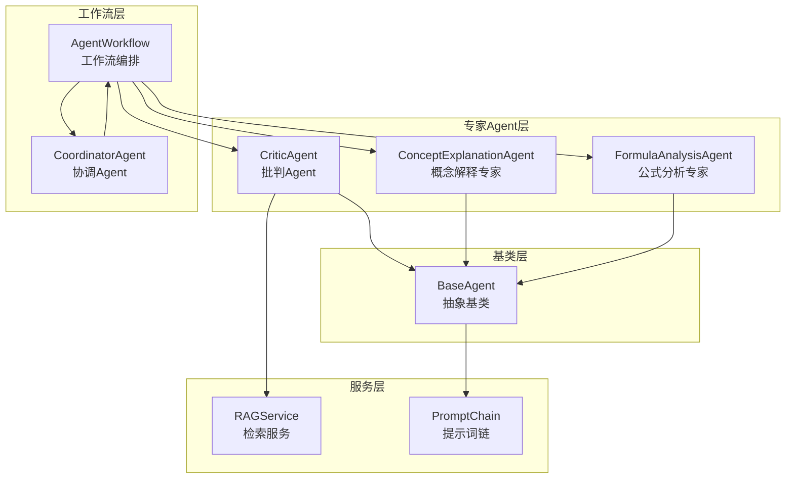
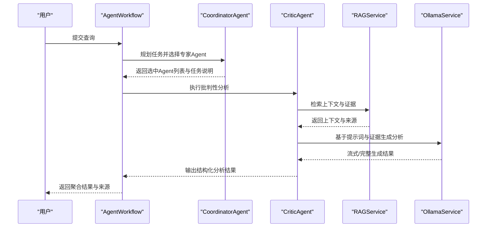
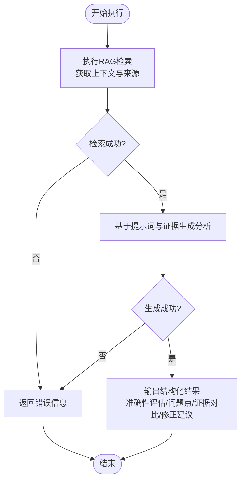
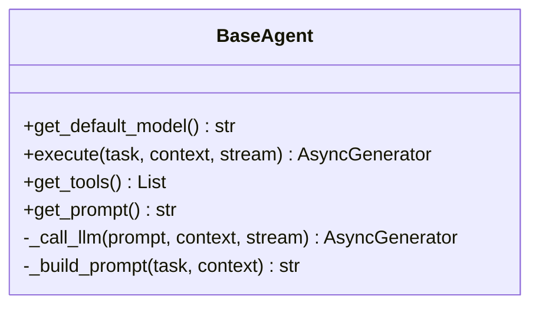
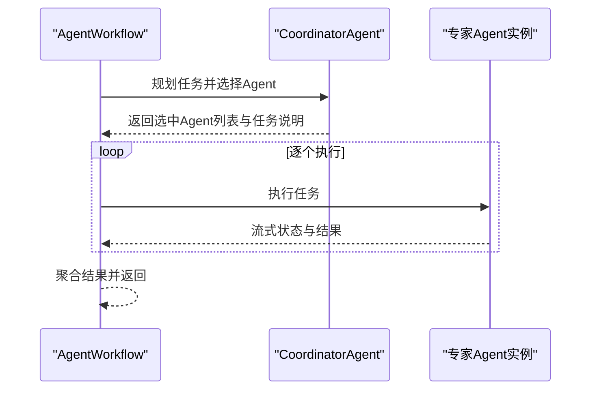
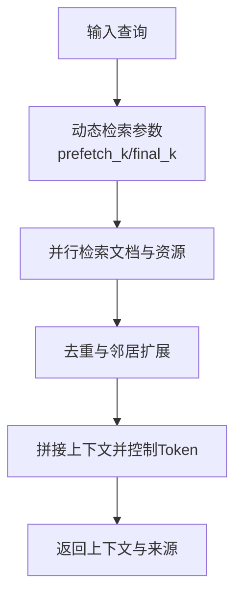
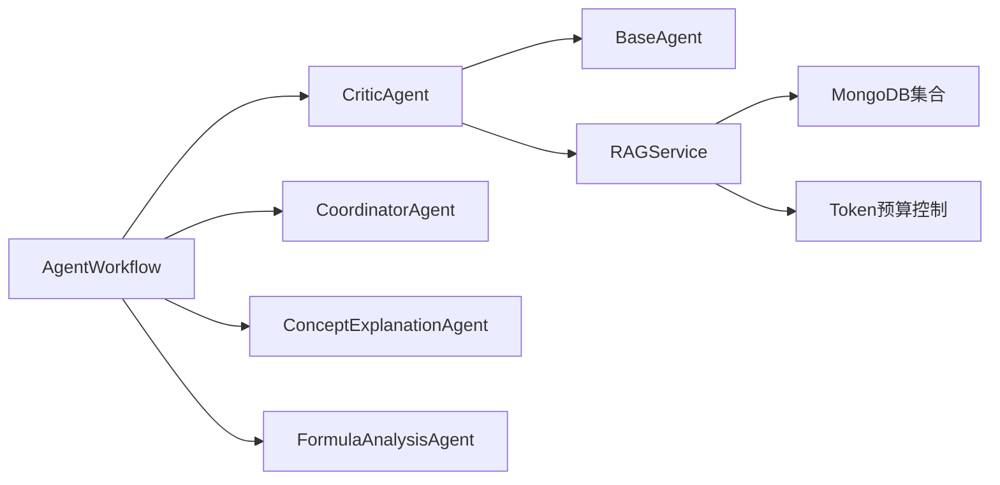

# 批判Agent

<cite>
**本文引用的文件**
- [critic_agent.py](file://agents/experts/critic_agent.py)
- [base_agent.py](file://agents/base/base_agent.py)
- [agent_workflow.py](file://agents/workflow/agent_workflow.py)
- [rag_service.py](file://services/rag_service.py)
- [prompt_chain.py](file://services/prompt_chain.py)
- [coordinator_agent.py](file://agents/coordinator/coordinator_agent.py)
- [concept_explanation_agent.py](file://agents/experts/concept_explanation_agent.py)
- [formula_analysis_agent.py](file://agents/experts/formula_analysis_agent.py)
- [agent_config.py](file://models/agent_config.py)
</cite>

## 目录
1. [简介](#简介)
2. [项目结构](#项目结构)
3. [核心组件](#核心组件)
4. [架构总览](#架构总览)
5. [详细组件分析](#详细组件分析)
6. [依赖分析](#依赖分析)
7. [性能考量](#性能考量)
8. [故障排查指南](#故障排查指南)
9. [结论](#结论)
10. [附录](#附录)

## 简介
本文件面向“批判Agent”的技术文档，聚焦其在批判性思维训练、逻辑推理与质量评估方面的能力与实现。批判Agent的核心职责是审查信息或观点，识别潜在的逻辑漏洞、事实错误与幻觉（hallucination），并基于检索到的证据进行反驳或确认，提供建设性的修正建议。本文将系统梳理其系统提示词设计、逻辑推理流程（前提识别、结论验证、推理链构建）、质量评估标准与框架、与其他Agent的协作模式，以及在学术论文评审、技术方案评估、信息真实性判断等场景中的应用策略。

## 项目结构
批判Agent位于专家Agent子系统中，采用“基类 + 专家Agent”的分层设计；其执行流程与RAG检索服务紧密耦合，通过工作流编排器实现多Agent协作。关键目录与文件如下：
- 专家Agent层：critic_agent.py、concept_explanation_agent.py、formula_analysis_agent.py 等
- 基类层：base_agent.py（统一接口、提示词拼装、LLM调用）
- 工作流层：agent_workflow.py（编排与状态管理）
- 检索服务：rag_service.py（动态检索参数、上下文拼装、来源去重）
- 提示词链：prompt_chain.py（基础提示词与助手特定提示词叠加）
- 协调Agent：coordinator_agent.py（任务规划与专家Agent选择）
- 配置模型：agent_config.py（Agent配置模型）

图表来源
- [critic_agent.py:1-90](file://agents/experts/critic_agent.py#L1-L90)
- [base_agent.py:1-122](file://agents/base/base_agent.py#L1-L122)
- [agent_workflow.py:1-388](file://agents/workflow/agent_workflow.py#L1-L388)
- [rag_service.py:1-323](file://services/rag_service.py#L1-L323)
- [prompt_chain.py:1-450](file://services/prompt_chain.py#L1-L450)
- [coordinator_agent.py:1-252](file://agents/coordinator/coordinator_agent.py#L1-L252)
- [concept_explanation_agent.py:1-70](file://agents/experts/concept_explanation_agent.py#L1-L70)
- [formula_analysis_agent.py:1-107](file://agents/experts/formula_analysis_agent.py#L1-L107)

章节来源
- [critic_agent.py:1-90](file://agents/experts/critic_agent.py#L1-L90)
- [base_agent.py:1-122](file://agents/base/base_agent.py#L1-L122)
- [agent_workflow.py:1-388](file://agents/workflow/agent_workflow.py#L1-L388)
- [rag_service.py:1-323](file://services/rag_service.py#L1-L323)
- [prompt_chain.py:1-450](file://services/prompt_chain.py#L1-L450)
- [coordinator_agent.py:1-252](file://agents/coordinator/coordinator_agent.py#L1-L252)
- [concept_explanation_agent.py:1-70](file://agents/experts/concept_explanation_agent.py#L1-L70)
- [formula_analysis_agent.py:1-107](file://agents/experts/formula_analysis_agent.py#L1-L107)

## 核心组件
- 批判Agent（CriticAgent）：负责审查信息，识别逻辑漏洞、事实错误与幻觉，提供准确性评估、问题点、证据对比与修正建议。
- 基类Agent（BaseAgent）：统一抽象接口、提示词拼装、LLM调用与工具接口。
- 工作流编排（AgentWorkflow）：协调专家Agent执行，管理状态、进度与结果聚合。
- 检索服务（RAGService）：动态检索参数、上下文拼装、来源去重与资源推荐。
- 提示词链（PromptChain）：基础提示词与助手特定提示词叠加，支持数据库读取与默认回退。
- 协调Agent（CoordinatorAgent）：分析用户问题，智能选择专家Agent并分配任务。
- 其他专家Agent：概念解释、公式分析等，为批判Agent提供互补视角与输入。

章节来源
- [critic_agent.py:7-90](file://agents/experts/critic_agent.py#L7-L90)
- [base_agent.py:8-122](file://agents/base/base_agent.py#L8-L122)
- [agent_workflow.py:47-388](file://agents/workflow/agent_workflow.py#L47-L388)
- [rag_service.py:8-323](file://services/rag_service.py#L8-L323)
- [prompt_chain.py:6-450](file://services/prompt_chain.py#L6-L450)
- [coordinator_agent.py:7-252](file://agents/coordinator/coordinator_agent.py#L7-L252)

## 架构总览
批判Agent的执行路径遵循“检索-分析-输出”的闭环：先通过RAG检索获取证据上下文，再基于系统提示词进行批判性分析，最终以结构化输出呈现准确性评估、问题点、证据对比与修正建议。工作流编排器负责任务规划与多Agent协作，协调Agent根据问题复杂度选择必要专家Agent，形成“协调-执行-汇总”的协作模式。

图表来源
- [agent_workflow.py:106-336](file://agents/workflow/agent_workflow.py#L106-L336)
- [coordinator_agent.py:55-168](file://agents/coordinator/coordinator_agent.py#L55-L168)
- [critic_agent.py:26-90](file://agents/experts/critic_agent.py#L26-L90)
- [rag_service.py:34-266](file://services/rag_service.py#L34-L266)

## 详细组件分析

### 批判Agent（CriticAgent）
- 系统提示词设计：强调客观、严谨、基于证据的批判性思维，明确输出格式要求（准确性评估、问题点、证据对比、修正建议）。
- 执行流程：
  1) RAG检索：根据上下文参数（文档ID、助手ID、知识空间ID、嵌入模型）检索相关证据上下文与来源。
  2) 生成分析：将任务与检索到的证据拼装为提示词，调用LLM生成批判性分析。
  3) 结构化输出：支持流式输出与完整输出，包含分析内容与来源列表。
- 错误处理：对检索失败与生成失败进行捕获与反馈，保证工作流稳定性。

图表来源
- [critic_agent.py:26-90](file://agents/experts/critic_agent.py#L26-L90)
- [rag_service.py:34-266](file://services/rag_service.py#L34-L266)

章节来源
- [critic_agent.py:10-24](file://agents/experts/critic_agent.py#L10-L24)
- [critic_agent.py:26-90](file://agents/experts/critic_agent.py#L26-L90)
- [rag_service.py:34-266](file://services/rag_service.py#L34-L266)

### 基类Agent（BaseAgent）
- 统一接口：定义默认模型获取、抽象执行接口、工具接口与提示词拼装。
- 提示词拼装：将系统提示词与上下文信息拼接，支持结构化提示词构建。
- LLM调用：封装OllamaService的生成接口，支持流式输出。

图表来源
- [base_agent.py:8-122](file://agents/base/base_agent.py#L8-L122)

章节来源
- [base_agent.py:66-122](file://agents/base/base_agent.py#L66-L122)

### 工作流编排（AgentWorkflow）
- 任务规划：协调Agent负责分析问题并选择必要专家Agent，返回选中Agent列表与任务说明。
- 执行顺序：顺序执行被选中的专家Agent，便于前端实时显示进度与状态。
- 状态管理：发送规划阶段、Agent状态（pending/running/completed/error）与最终结果聚合。
- 配置加载：异步从数据库加载Agent配置，支持延迟初始化与缓存。

图表来源
- [agent_workflow.py:106-336](file://agents/workflow/agent_workflow.py#L106-L336)
- [coordinator_agent.py:55-168](file://agents/coordinator/coordinator_agent.py#L55-L168)

章节来源
- [agent_workflow.py:47-388](file://agents/workflow/agent_workflow.py#L47-L388)

### 检索服务（RAGService）
- 动态检索参数：根据查询长度、是否对比/列举/条款类问题动态调整预取与最终K值。
- 并行检索：支持多知识空间集合并行检索，合并结果并去重。
- 上下文拼装：邻居扩展、去重与Token预算控制，避免上下文过大。
- 来源信息：记录文档/附件来源、分数与检索类型，支持溯源与可视化。

图表来源
- [rag_service.py:11-32](file://services/rag_service.py#L11-L32)
- [rag_service.py:97-266](file://services/rag_service.py#L97-L266)

章节来源
- [rag_service.py:34-266](file://services/rag_service.py#L34-L266)

### 提示词链（PromptChain）
- 基础提示词：支持从数据库读取或默认值，定义通用角色、回答原则、格式要求与工具使用。
- 助手特定提示词：作为扩展追加到基础提示词，实现课程方向与教学重点的细化。
- 工具描述：格式化工具函数描述，增强Agent的工具使用能力。

章节来源
- [prompt_chain.py:9-450](file://services/prompt_chain.py#L9-L450)

### 协调Agent（CoordinatorAgent）
- 任务规划：分析问题复杂度，智能选择必要专家Agent，分配具体任务并说明理由。
- JSON输出：严格JSON格式返回规划结果，包含选中Agent列表、任务说明与理由。
- 备份逻辑：当JSON解析失败时，基于关键词进行默认Agent选择。

章节来源
- [coordinator_agent.py:19-168](file://agents/coordinator/coordinator_agent.py#L19-L168)

### 其他专家Agent（示例）
- 概念解释专家：深入解释专业概念，提供定义、物理意义、公式、示例与关联。
- 公式分析专家：识别并分析问题中的数学/物理公式，解释变量、适用条件与应用场景。

章节来源
- [concept_explanation_agent.py:14-70](file://agents/experts/concept_explanation_agent.py#L14-L70)
- [formula_analysis_agent.py:15-107](file://agents/experts/formula_analysis_agent.py#L15-L107)

## 依赖分析
- 批判Agent依赖：
  - 基类Agent：继承统一接口与提示词拼装能力。
  - RAGService：检索证据上下文与来源。
  - 日志服务：记录执行过程与错误信息。
- 工作流编排依赖：
  - 协调Agent：任务规划与专家Agent选择。
  - 专家Agent：概念解释、公式分析等。
  - 数据库配置：Agent模型配置的异步加载与缓存。
- 检索服务依赖：
  - 知识空间集合：支持多集合并行检索。
  - 向量化模型：可按上下文传入覆盖默认模型。
  - Token预算：上下文截断与去重控制。

图表来源
- [critic_agent.py:3-5](file://agents/experts/critic_agent.py#L3-L5)
- [agent_workflow.py:7-16](file://agents/workflow/agent_workflow.py#L7-L16)
- [rag_service.py:58-95](file://services/rag_service.py#L58-L95)

章节来源
- [critic_agent.py:3-5](file://agents/experts/critic_agent.py#L3-L5)
- [agent_workflow.py:7-16](file://agents/workflow/agent_workflow.py#L7-L16)
- [rag_service.py:58-95](file://services/rag_service.py#L58-L95)

## 性能考量
- 检索参数动态调整：根据查询特征（对比/列举/条款）调整预取与最终K值，平衡召回与延迟。
- 并行检索与去重：多集合并行检索与按文档去重，减少冗余，提升上下文质量。
- Token预算控制：上下文拼接后进行Token估算与截断，避免超限导致的性能与稳定性问题。
- 流式输出：支持流式生成与状态上报，改善用户体验与前端渲染效率。
- 模型配置缓存：工作流异步加载Agent配置并缓存，降低重复查询成本。

章节来源
- [rag_service.py:11-32](file://services/rag_service.py#L11-L32)
- [rag_service.py:251-260](file://services/rag_service.py#L251-L260)
- [agent_workflow.py:69-104](file://agents/workflow/agent_workflow.py#L69-L104)

## 故障排查指南
- 检索失败：检查知识空间集合名称、向量化模型配置与网络连接；必要时启用回退模式继续处理。
- 生成失败：确认提示词拼装与上下文长度；检查模型可用性与日志错误堆栈。
- JSON解析失败：协调Agent提供备份选择逻辑，确保至少选择必要Agent继续执行。
- 配置加载失败：检查数据库连接与配置项；工作流会使用默认配置并记录警告。

章节来源
- [critic_agent.py:50-57](file://agents/experts/critic_agent.py#L50-L57)
- [critic_agent.py:83-89](file://agents/experts/critic_agent.py#L83-L89)
- [coordinator_agent.py:130-135](file://agents/coordinator/coordinator_agent.py#L130-L135)
- [agent_workflow.py:28-44](file://agents/workflow/agent_workflow.py#L28-L44)

## 结论
批判Agent通过系统化的提示词设计与严格的执行流程，实现了对信息的客观审查与质量评估。其与RAG检索服务、工作流编排与协调Agent的协同，形成了“检索-分析-输出-协作”的闭环体系。在学术评审、技术评估与信息真实性判断等场景中，批判Agent可作为关键的质量守门人，结合其他专家Agent提供互补视角，提升整体决策的准确性与可靠性。

## 附录
- 应用场景建议：
  - 学术论文评审：利用批判Agent对结论与证据链进行验证，识别逻辑漏洞与事实错误。
  - 技术方案评估：对技术方案的可行性与依据进行批判性分析，提供修正建议。
  - 信息真实性判断：基于检索证据对陈述进行准确性评估，标注来源与不确定性。
- 质量评估标准与框架：
  - 准确性评估：可信/存疑/不可信三档分级。
  - 问题点：明确指出逻辑漏洞、事实错误或证据不足之处。
  - 证据对比：引用检索到的证据，说明支撑或反驳依据。
  - 修正建议：提供可操作的改进方案与补充材料建议。
- 与其他Agent的协作模式：
  - 协调Agent先行规划，选择必要专家Agent（如概念解释、公式分析）为批判分析提供背景与输入。
  - 工作流顺序执行专家Agent，便于前端实时展示进度与状态。
  - 批判Agent在完成分析后，可作为总结与质量把关环节，输出结构化结论。

章节来源
- [critic_agent.py:19-24](file://agents/experts/critic_agent.py#L19-L24)
- [coordinator_agent.py:29-53](file://agents/coordinator/coordinator_agent.py#L29-L53)
- [agent_workflow.py:106-336](file://agents/workflow/agent_workflow.py#L106-L336)