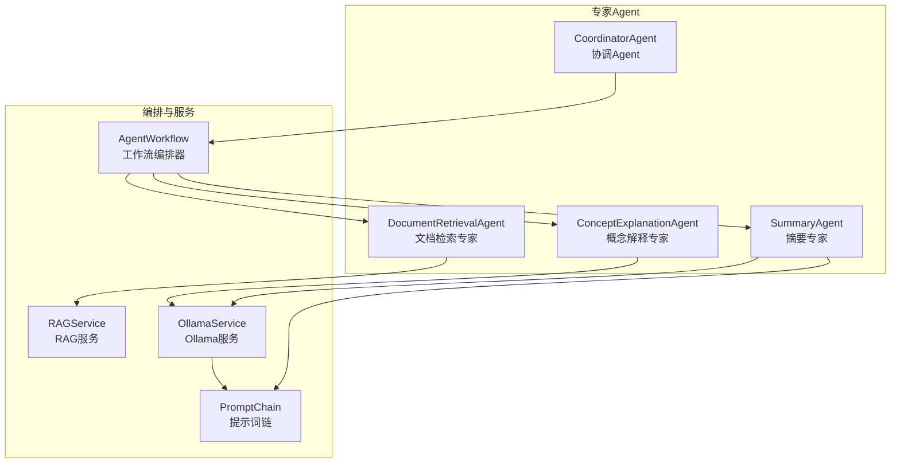
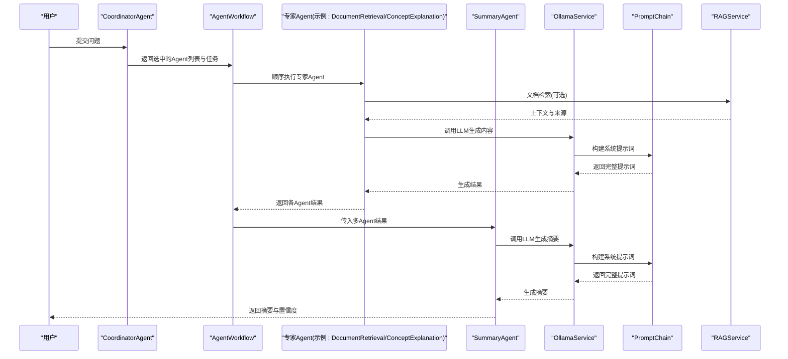
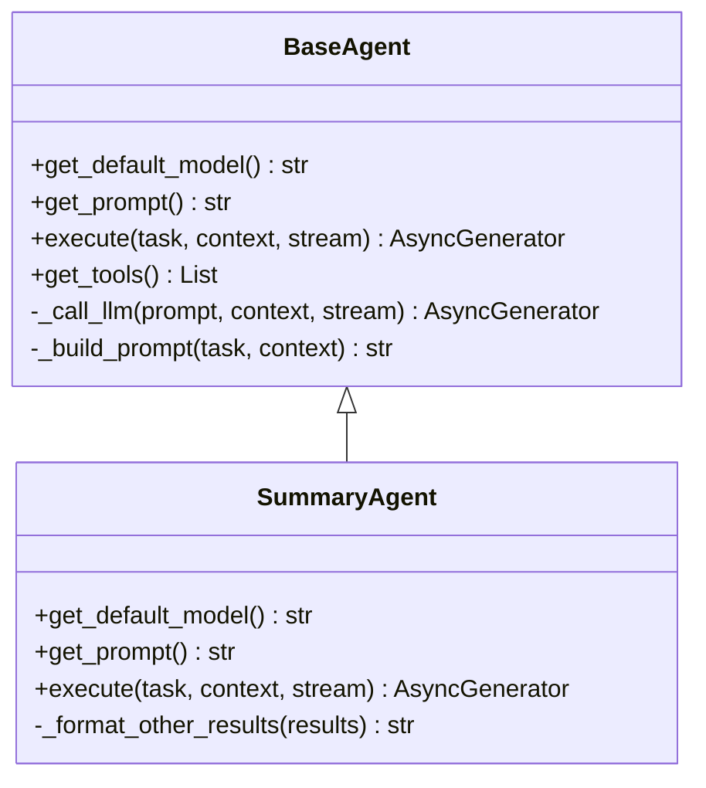
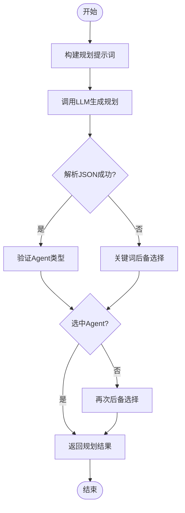
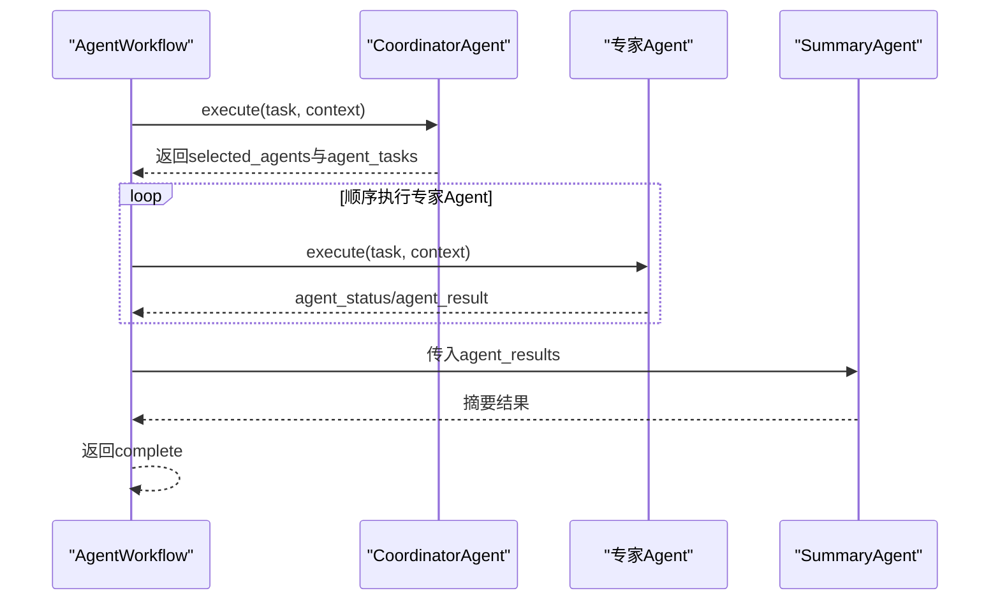
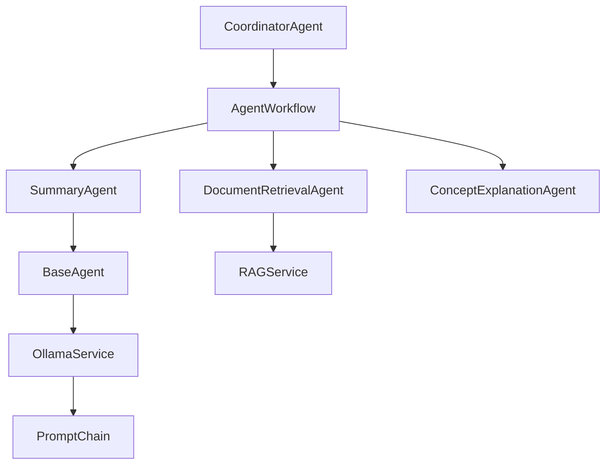

# 摘要Agent

<cite>
**本文引用的文件**
- [summary_agent.py](file://agents/experts/summary_agent.py)
- [base_agent.py](file://agents/base/base_agent.py)
- [coordinator_agent.py](file://agents/coordinator/coordinator_agent.py)
- [agent_workflow.py](file://agents/workflow/agent_workflow.py)
- [prompt_chain.py](file://services/prompt_chain.py)
- [ollama_service.py](file://services/ollama_service.py)
- [rag_service.py](file://services/rag_service.py)
- [document_retrieval_agent.py](file://agents/experts/document_retrieval_agent.py)
- [concept_explanation_agent.py](file://agents/experts/concept_explanation_agent.py)
</cite>

## 目录
1. [简介](#简介)
2. [项目结构](#项目结构)
3. [核心组件](#核心组件)
4. [架构总览](#架构总览)
5. [详细组件分析](#详细组件分析)
6. [依赖关系分析](#依赖关系分析)
7. [性能考量](#性能考量)
8. [故障排查指南](#故障排查指南)
9. [结论](#结论)
10. [附录](#附录)

## 简介
摘要Agent是高级RAG系统中的“总结专家”，负责对多Agent协作产生的信息进行内容压缩、要点提取与结构重组，形成高质量、可读性强的摘要。其核心能力包括：
- 信息筛选：从多来源、多Agent结果中提取关键信息
- 主题识别：识别核心主题与关键概念
- 结构重组：将碎片化信息组织为连贯的摘要结构
- 语言优化：提升表达清晰度与可读性
- 质量评估：通过置信度与来源标注保障内容可信度

摘要Agent在系统中通常作为最后一个环节，用于整合前序专家Agent的输出，形成最终的总结性结果。

## 项目结构
摘要Agent位于专家Agent体系中，与协调Agent、工作流编排器、提示词链、Ollama服务、RAG服务等模块协同工作，形成端到端的摘要生成流水线。

图表来源
- [summary_agent.py:1-87](file://agents/experts/summary_agent.py#L1-L87)
- [coordinator_agent.py:1-252](file://agents/coordinator/coordinator_agent.py#L1-L252)
- [agent_workflow.py:1-388](file://agents/workflow/agent_workflow.py#L1-L388)
- [prompt_chain.py:1-450](file://services/prompt_chain.py#L1-L450)
- [ollama_service.py:1-674](file://services/ollama_service.py#L1-L674)
- [rag_service.py:1-323](file://services/rag_service.py#L1-L323)

章节来源
- [summary_agent.py:1-87](file://agents/experts/summary_agent.py#L1-L87)
- [base_agent.py:1-122](file://agents/base/base_agent.py#L1-L122)
- [coordinator_agent.py:1-252](file://agents/coordinator/coordinator_agent.py#L1-L252)
- [agent_workflow.py:1-388](file://agents/workflow/agent_workflow.py#L1-L388)
- [prompt_chain.py:1-450](file://services/prompt_chain.py#L1-L450)
- [ollama_service.py:1-674](file://services/ollama_service.py#L1-L674)
- [rag_service.py:1-323](file://services/rag_service.py#L1-L323)

## 核心组件
- 摘要专家（SummaryAgent）：继承自BaseAgent，负责汇总多Agent结果并生成最终摘要，支持流式输出与错误处理。
- 协调Agent（CoordinatorAgent）：负责分析用户问题并智能选择需要的专家Agent，返回选中的Agent列表与任务描述。
- 工作流编排器（AgentWorkflow）：串联协调Agent与专家Agent，顺序执行并产出统一的摘要结果。
- 提示词链（PromptChain）：构建基础提示词与助手特定提示词的叠加，为LLM提供标准化的系统提示。
- Ollama服务（OllamaService）：封装LLM调用，支持流式与非流式生成，构建完整提示词（含上下文、对话历史、工具调用等）。
- RAG服务（RAGService）：提供检索上下文与来源标注，为摘要提供可靠的知识支撑。

章节来源
- [summary_agent.py:7-87](file://agents/experts/summary_agent.py#L7-L87)
- [base_agent.py:8-122](file://agents/base/base_agent.py#L8-L122)
- [coordinator_agent.py:7-252](file://agents/coordinator/coordinator_agent.py#L7-L252)
- [agent_workflow.py:47-388](file://agents/workflow/agent_workflow.py#L47-L388)
- [prompt_chain.py:6-450](file://services/prompt_chain.py#L6-L450)
- [ollama_service.py:9-674](file://services/ollama_service.py#L9-L674)
- [rag_service.py:8-323](file://services/rag_service.py#L8-L323)

## 架构总览
摘要生成的端到端流程如下：
1. 协调Agent分析用户问题，选择必要专家Agent并分配任务。
2. 工作流编排器顺序执行专家Agent，收集各Agent结果。
3. 摘要专家接收多Agent结果，构建摘要提示词并生成最终摘要。
4. Ollama服务负责LLM调用，PromptChain提供系统提示词，RAG服务提供检索上下文与来源信息。

图表来源
- [coordinator_agent.py:55-168](file://agents/coordinator/coordinator_agent.py#L55-L168)
- [agent_workflow.py:106-336](file://agents/workflow/agent_workflow.py#L106-L336)
- [summary_agent.py:24-72](file://agents/experts/summary_agent.py#L24-L72)
- [ollama_service.py:50-93](file://services/ollama_service.py#L50-L93)
- [prompt_chain.py:386-431](file://services/prompt_chain.py#L386-L431)
- [rag_service.py:34-266](file://services/rag_service.py#L34-L266)

## 详细组件分析

### 摘要专家（SummaryAgent）
- 角色与职责
  - 作为总结专家，负责对多Agent输出进行内容压缩、要点提取与结构重组。
  - 通过系统提示词与上下文构建，生成高质量摘要。
- 关键实现
  - 默认模型与系统提示词：提供摘要任务的系统提示词，强调“总结关键信息、归纳主要观点、提炼核心概念、组织信息结构”。
  - 执行流程：接收任务与上下文，格式化其他Agent结果，构建摘要提示词，调用LLM生成摘要，支持流式输出与错误处理。
  - 结果格式：输出摘要文本、Agent类型标识、置信度（示例为0.9），以及可选的来源信息。
- 数据结构与复杂度
  - 其他Agent结果格式化：遍历结果列表，截断长度并拼接，时间复杂度近似O(N)，N为结果数量。
  - 提示词构建：拼接任务、其他Agent结果与摘要模板，时间复杂度近似O(M)，M为上下文总长度。
- 依赖关系
  - 继承BaseAgent，复用LLM调用与提示词构建能力。
  - 依赖OllamaService进行LLM生成。
  - 依赖PromptChain构建系统提示词（间接通过BaseAgent的提示词构建）。

图表来源
- [base_agent.py:8-122](file://agents/base/base_agent.py#L8-L122)
- [summary_agent.py:7-87](file://agents/experts/summary_agent.py#L7-L87)

章节来源
- [summary_agent.py:7-87](file://agents/experts/summary_agent.py#L7-L87)
- [base_agent.py:27-122](file://agents/base/base_agent.py#L27-L122)

### 协调Agent（CoordinatorAgent）
- 角色与职责
  - 分析用户问题的复杂度与需求，智能选择必要的专家Agent。
  - 为每个选中的Agent分配具体任务，并说明选择理由。
- 关键实现
  - 系统提示词：定义可用专家Agent及其适用场景，强调“只选择必要的Agent”“返回JSON格式结果”等原则。
  - 任务规划：构建规划提示词，调用LLM生成JSON格式的选中Agent列表与任务描述，解析失败时采用关键词后备选择逻辑。
  - 结果验证：校验Agent类型有效性，若未选中任何Agent则回退到默认选择。
- 数据结构与复杂度
  - JSON解析与正则提取：时间复杂度近似O(K)，K为LLM输出长度。
  - 关键词匹配：对任务文本进行多关键词匹配，时间复杂度近似O(L)，L为关键词数量。
- 依赖关系
  - 继承BaseAgent，复用LLM调用与提示词构建。
  - 依赖正则表达式与JSON解析进行规划结果提取。

图表来源
- [coordinator_agent.py:73-168](file://agents/coordinator/coordinator_agent.py#L73-L168)
- [coordinator_agent.py:170-214](file://agents/coordinator/coordinator_agent.py#L170-L214)

章节来源
- [coordinator_agent.py:7-252](file://agents/coordinator/coordinator_agent.py#L7-L252)

### 工作流编排器（AgentWorkflow）
- 角色与职责
  - 管理多Agent协作，顺序执行专家Agent并将结果汇总给摘要专家。
  - 提供统一的状态反馈（planning、agent_status、agent_result、complete）。
- 关键实现
  - 协调Agent初始化：异步加载配置，确定模型名称。
  - 专家Agent获取：延迟初始化，按需加载Agent配置。
  - 执行流程：先规划，再顺序执行专家Agent，收集结果，最后返回汇总。
  - 状态反馈：在流式模式下，实时发送每个Agent的执行状态与进度。
- 数据结构与复杂度
  - Agent类型映射：O(1)查找。
  - 顺序执行：整体复杂度近似O(T)，T为Agent数量与生成时间之和。
- 依赖关系
  - 依赖CoordinatorAgent进行任务规划。
  - 依赖各专家Agent的execute接口。
  - 依赖数据库获取Agent配置。

图表来源
- [agent_workflow.py:106-336](file://agents/workflow/agent_workflow.py#L106-L336)

章节来源
- [agent_workflow.py:47-388](file://agents/workflow/agent_workflow.py#L47-L388)

### 提示词链（PromptChain）
- 角色与职责
  - 构建基础提示词与助手特定提示词的叠加，确保系统提示词的一致性与可扩展性。
- 关键实现
  - 基础提示词：从数据库读取或使用默认值，定义角色定位、回答原则、回答格式、工具函数使用等。
  - 助手特定提示词：作为扩展追加到基础提示词，实现课程方向与教学重点的细化。
  - 提示词构建：支持完整系统提示词与扩展提示词两种模式，自动统一中文回答要求。
- 依赖关系
  - 依赖数据库读取系统配置。
  - 依赖工具函数Schema生成工具描述。

章节来源
- [prompt_chain.py:6-450](file://services/prompt_chain.py#L6-L450)

### Ollama服务（OllamaService）
- 角色与职责
  - 封装LLM调用，支持流式与非流式生成，构建完整提示词（含上下文、对话历史、工具调用等）。
- 关键实现
  - 提示词构建：结合系统提示词、知识库状态、文档信息、检索知识、对话历史、引用内容等，形成完整提示。
  - 工具函数调用：解析并执行XML格式的工具函数调用，将结果注入提示词。
  - 流式生成：通过线程池与队列实现同步HTTP流式请求的异步消费。
- 依赖关系
  - 依赖PromptChain构建系统提示词。
  - 依赖工具函数集合进行实时数据查询。

章节来源
- [ollama_service.py:9-674](file://services/ollama_service.py#L9-L674)

### RAG服务（RAGService）
- 角色与职责
  - 提供检索上下文与来源标注，为摘要提供可靠的知识支撑。
- 关键实现
  - 动态检索参数：根据问题长度、关键词类型（对比/列举/条款）调整预取与最终K值。
  - 并行检索：支持多知识空间集合并行检索，合并结果并去重。
  - 上下文拼接：对命中chunk进行邻居扩展，控制token预算，拼接上下文并返回来源信息。
- 依赖关系
  - 依赖ChunkRepository与DocumentRepository进行文档信息查询。
  - 依赖RAGRetriever进行向量检索与重排。

章节来源
- [rag_service.py:8-323](file://services/rag_service.py#L8-L323)

## 依赖关系分析
- 组件耦合与内聚
  - SummaryAgent与BaseAgent：高内聚，复用LLM调用与提示词构建能力。
  - CoordinatorAgent与AgentWorkflow：强耦合，前者负责规划，后者负责执行。
  - OllamaService与PromptChain：紧密耦合，前者依赖后者构建系统提示词。
  - RAGService与OllamaService：间接耦合，前者为后者提供检索上下文。
- 外部依赖
  - 数据库：MongoDB用于系统配置、知识库状态、文档信息等。
  - 向量数据库：用于RAG检索（具体实现位于retrieval模块）。
  - 工具函数：通过XML格式调用，实现系统信息查询与知识库状态获取。

图表来源
- [summary_agent.py:3-4](file://agents/experts/summary_agent.py#L3-L4)
- [base_agent.py:5](file://agents/base/base_agent.py#L5)
- [ollama_service.py:119-123](file://services/ollama_service.py#L119-L123)
- [prompt_chain.py:119-123](file://services/prompt_chain.py#L119-L123)
- [coordinator_agent.py:1-2](file://agents/coordinator/coordinator_agent.py#L1-L2)
- [agent_workflow.py:7-15](file://agents/workflow/agent_workflow.py#L7-L15)
- [document_retrieval_agent.py:4](file://agents/experts/document_retrieval_agent.py#L4)
- [rag_service.py:1-2](file://services/rag_service.py#L1-L2)

章节来源
- [summary_agent.py:1-87](file://agents/experts/summary_agent.py#L1-L87)
- [base_agent.py:1-122](file://agents/base/base_agent.py#L1-L122)
- [coordinator_agent.py:1-252](file://agents/coordinator/coordinator_agent.py#L1-L252)
- [agent_workflow.py:1-388](file://agents/workflow/agent_workflow.py#L1-L388)
- [prompt_chain.py:1-450](file://services/prompt_chain.py#L1-L450)
- [ollama_service.py:1-674](file://services/ollama_service.py#L1-L674)
- [rag_service.py:1-323](file://services/rag_service.py#L1-L323)

## 性能考量
- 流式生成与超时控制
  - OllamaService支持流式生成，最大空闲时间与总超时时间可配置，避免长时间等待。
- 提示词长度与Token预算
  - PromptChain与RAGService对提示词长度与上下文进行控制，避免超出模型上下文限制。
- 检索参数动态调整
  - RAGService根据问题特征动态调整预取与最终K值，平衡召回与延迟。
- 并行检索与去重
  - 多知识空间集合并行检索，命中结果按分数去重，减少重复信息。

[本节为通用性能讨论，无需引用具体文件]

## 故障排查指南
- 协调Agent规划失败
  - 现象：JSON解析失败或未选中任何Agent。
  - 处理：检查系统提示词是否返回JSON格式；后备逻辑会根据关键词选择Agent。
- LLM调用异常
  - 现象：流式请求超时或连接错误。
  - 处理：检查Ollama服务地址与模型配置；确认网络连通性与超时设置。
- 摘要生成错误
  - 现象：摘要专家执行失败，返回错误信息。
  - 处理：查看日志中的异常堆栈；确认其他Agent结果格式与长度限制。
- 来源信息缺失
  - 现象：摘要缺少来源标注。
  - 处理：确认RAG检索是否成功；检查文档信息查询与去重逻辑。

章节来源
- [coordinator_agent.py:130-135](file://agents/coordinator/coordinator_agent.py#L130-L135)
- [ollama_service.py:526-541](file://services/ollama_service.py#L526-L541)
- [summary_agent.py:66-72](file://agents/experts/summary_agent.py#L66-L72)
- [rag_service.py:148-179](file://services/rag_service.py#L148-L179)

## 结论
摘要Agent通过与协调Agent、工作流编排器、提示词链、Ollama服务与RAG服务的协同，实现了从多源信息到高质量摘要的自动化生成。其系统提示词设计强调“总结关键信息、归纳主要观点、提炼核心概念、组织信息结构”，并通过置信度与来源标注保障摘要质量。在工程上，采用流式生成、动态检索参数与并行检索等策略，兼顾性能与稳定性。

[本节为总结性内容，无需引用具体文件]

## 附录

### 使用案例
- 新闻摘要
  - 场景：对多篇新闻报道进行主题识别与要点提取，生成简洁摘要。
  - 流程：协调Agent选择概念解释与文档检索专家，摘要专家整合输出。
- 论文提炼
  - 场景：从论文摘要与正文提取核心观点与结论，形成结构化摘要。
  - 流程：协调Agent选择概念解释与文档检索专家，摘要专家整合输出。
- 报告总结
  - 场景：对多份报告进行内容压缩与要点提取，形成高层级总结。
  - 流程：协调Agent选择文档检索专家，摘要专家整合输出。
- 会议纪要
  - 场景：对会议讨论内容进行要点提取与结构重组，形成纪要。
  - 流程：协调Agent选择概念解释专家，摘要专家整合输出。

[本节为概念性说明，无需引用具体文件]

### 摘要质量评估标准
- 准确性：摘要内容与原始信息一致，不编造事实。
- 完整性：涵盖核心要点与关键结论，避免遗漏重要信息。
- 清晰性：语言简洁、结构清晰、逻辑连贯。
- 可读性：符合中文表达习惯，易于理解。
- 置信度：摘要专家提供置信度评分（示例为0.9），辅助质量判断。
- 来源标注：标注信息来源，便于追溯与验证。

[本节为通用质量标准说明，无需引用具体文件]

### 长度控制策略
- 上下文长度控制：RAGService对上下文进行token预算控制，避免提示词过长。
- 结果截断：摘要专家对其他Agent结果进行截断，避免过长输入。
- 流式输出：OllamaService支持流式生成，逐步输出摘要，降低首token延迟。

[本节为通用策略说明，无需引用具体文件]

### 内容完整性保证方法
- 邻居扩展：对命中chunk进行前后窗口补齐，增强上下文完整性。
- 去重与排序：按分数去重并排序，确保来源质量。
- 工具函数调用：通过XML格式调用工具函数，获取实时系统信息与知识库状态。

[本节为通用方法说明，无需引用具体文件]

### 与文档处理系统的集成方式
- 文档解析与进度跟踪：文档路由提供解析进度与状态，便于在摘要生成前确认文档处理完成。
- 知识空间与集合：RAGService支持多知识空间集合并行检索，满足多文档摘要需求。
- 来源标注：摘要结果包含来源信息（文档ID、chunk ID、分数等），便于溯源。

章节来源
- [rag_service.py:68-96](file://services/rag_service.py#L68-L96)
- [rag_service.py:148-266](file://services/rag_service.py#L148-L266)