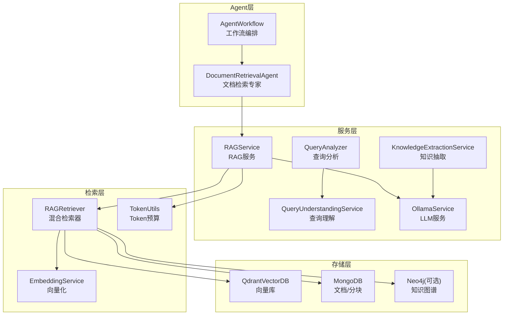
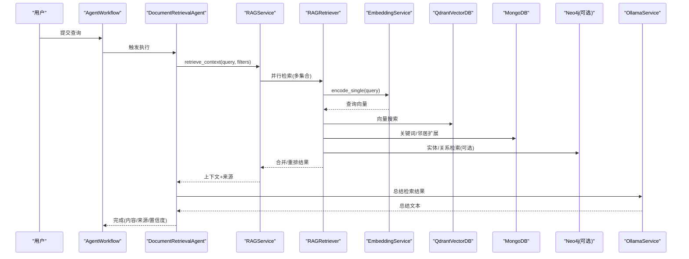
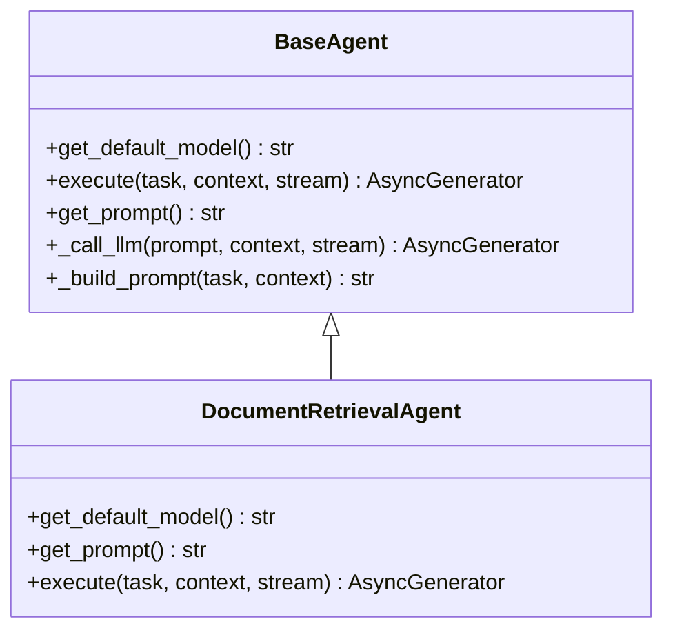
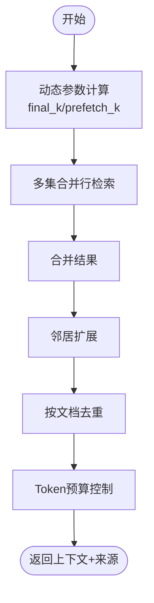
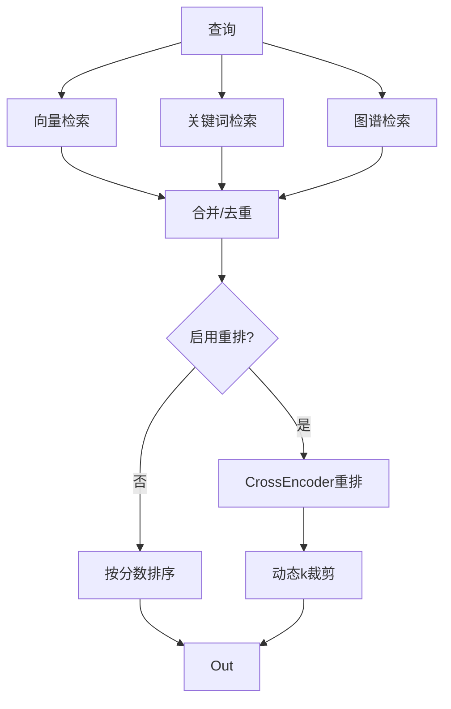
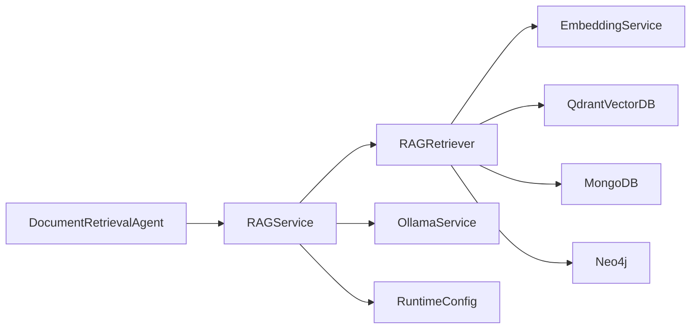

# 文档检索Agent

<cite>
**本文档引用的文件**
- [document_retrieval_agent.py](file://agents/experts/document_retrieval_agent.py)
- [rag_retriever.py](file://retrieval/rag_retriever.py)
- [rag_service.py](file://services/rag_service.py)
- [query_analyzer.py](file://services/query_analyzer.py)
- [query_understanding_service.py](file://services/query_understanding_service.py)
- [knowledge_extraction_service.py](file://services/knowledge_extraction_service.py)
- [embedding_service.py](file://embedding/embedding_service.py)
- [qdrant_client.py](file://database/qdrant_client.py)
- [mongodb.py](file://database/mongodb.py)
- [ollama_service.py](file://services/ollama_service.py)
- [token_utils.py](file://utils/token_utils.py)
- [base_agent.py](file://agents/base/base_agent.py)
- [rag_tool.py](file://agents/tools/rag_tool.py)
- [agent_workflow.py](file://agents/workflow/agent_workflow.py)
- [runtime_config.py](file://services/runtime_config.py)
- [README.md](file://README.md)
</cite>

## 目录
1. [简介](#简介)
2. [项目结构](#项目结构)
3. [核心组件](#核心组件)
4. [架构概览](#架构概览)
5. [详细组件分析](#详细组件分析)
6. [依赖分析](#依赖分析)
7. [性能考量](#性能考量)
8. [故障排查指南](#故障排查指南)
9. [结论](#结论)
10. [附录](#附录)

## 简介
本文档面向“文档检索Agent”，系统性阐述其在信息抽取、语义理解、相关性评分与文档匹配方面的算法能力与工程实现。重点包括：
- 从复杂查询中提取关键信息并进行精确匹配的系统提示词设计
- 信息抽取流程：实体识别、关系抽取、主题建模
- 检索优化策略、排序算法与结果过滤机制
- 与RAG系统的集成方式及在知识库构建中的作用

## 项目结构
该系统采用“多Agent协作 + RAG检索”的整体架构，文档检索Agent作为专家Agent之一，负责从知识库中检索与用户问题相关的文档内容，并进行总结与溯源。

图表来源
- [agent_workflow.py:47-105](file://agents/workflow/agent_workflow.py#L47-L105)
- [document_retrieval_agent.py:8-79](file://agents/experts/document_retrieval_agent.py#L8-L79)
- [rag_service.py:8-323](file://services/rag_service.py#L8-L323)
- [rag_retriever.py:17-393](file://retrieval/rag_retriever.py#L17-L393)
- [embedding_service.py:8-333](file://embedding/embedding_service.py#L8-L333)
- [qdrant_client.py:18-544](file://database/qdrant_client.py#L18-L544)
- [mongodb.py:92-800](file://database/mongodb.py#L92-L800)
- [ollama_service.py:9-674](file://services/ollama_service.py#L9-L674)
- [token_utils.py:7-72](file://utils/token_utils.py#L7-L72)

章节来源
- [README.md:1-290](file://README.md#L1-L290)

## 核心组件
- 文档检索Agent：负责执行检索任务、调用RAG服务、总结检索结果并标注来源。
- RAG服务：封装检索参数动态调整、上下文拼接、邻居扩展、去重与来源标注。
- RAG检索器：混合检索（向量 + 关键词 + 图谱），支持重排与动态k裁剪。
- 向量化服务：基于Ollama的嵌入生成，支持模型检测与重试。
- 向量数据库：Qdrant封装，支持gRPC连接、健康检查与自动集合创建。
- MongoDB：文档与分块存储，支持邻居扩展与批量查询。
- 知识抽取服务：从查询/文本中抽取实体与关系，构建知识图谱。
- 查询分析与理解：判断是否需要检索、提取结构化搜索条件。
- 运行时配置：模块开关与参数动态控制，支持低/高模式预设。

章节来源
- [document_retrieval_agent.py:8-79](file://agents/experts/document_retrieval_agent.py#L8-L79)
- [rag_service.py:8-323](file://services/rag_service.py#L8-L323)
- [rag_retriever.py:17-393](file://retrieval/rag_retriever.py#L17-L393)
- [embedding_service.py:8-333](file://embedding/embedding_service.py#L8-L333)
- [qdrant_client.py:18-544](file://database/qdrant_client.py#L18-L544)
- [mongodb.py:92-800](file://database/mongodb.py#L92-L800)
- [knowledge_extraction_service.py:12-229](file://services/knowledge_extraction_service.py#L12-L229)
- [query_analyzer.py:9-163](file://services/query_analyzer.py#L9-L163)
- [query_understanding_service.py:9-248](file://services/query_understanding_service.py#L9-L248)
- [runtime_config.py:12-218](file://services/runtime_config.py#L12-L218)

## 架构概览
文档检索Agent的工作流如下：

图表来源
- [agent_workflow.py:106-337](file://agents/workflow/agent_workflow.py#L106-L337)
- [document_retrieval_agent.py:25-79](file://agents/experts/document_retrieval_agent.py#L25-L79)
- [rag_service.py:34-266](file://services/rag_service.py#L34-L266)
- [rag_retriever.py:89-137](file://retrieval/rag_retriever.py#L89-L137)
- [embedding_service.py:175-318](file://embedding/embedding_service.py#L175-L318)
- [qdrant_client.py:336-414](file://database/qdrant_client.py#L336-L414)
- [mongodb.py:793-1341](file://database/mongodb.py#L793-L1341)
- [ollama_service.py:50-93](file://services/ollama_service.py#L50-L93)

## 详细组件分析

### 文档检索Agent（DocumentRetrievalAgent）
- 角色定位：作为专家Agent，负责从知识库检索相关文档并总结。
- 系统提示词设计：强调理解用户核心需求、检索相关文档、整理总结并标注来源。
- 执行流程：
  - 从上下文提取assistant_id/document_id等过滤条件
  - 调用RAG服务检索上下文
  - 基于检索结果构造总结提示词，调用LLM生成摘要
  - 返回结构化结果（内容、来源、推荐资源、置信度、原始上下文）

图表来源
- [base_agent.py:8-122](file://agents/base/base_agent.py#L8-L122)
- [document_retrieval_agent.py:8-79](file://agents/experts/document_retrieval_agent.py#L8-L79)

章节来源
- [document_retrieval_agent.py:8-79](file://agents/experts/document_retrieval_agent.py#L8-L79)
- [base_agent.py:8-122](file://agents/base/base_agent.py#L8-L122)

### RAG服务（RAGService）
- 动态检索参数：根据查询长度、是否对比/列举/条款类问题，动态调整final_k与prefetch_k。
- 多集合检索：支持知识空间集合列表并行检索，合并结果。
- 上下文拼接与去重：按文档去重，保留最高分chunk；邻居扩展提升上下文完整性；Token预算控制。
- 来源标注：区分普通文档与对话附件，记录chunk_id、文档标题、文件类型、状态等。
- 回退机制：检索失败时可选择回退到不使用上下文继续处理。

图表来源
- [rag_service.py:11-32](file://services/rag_service.py#L11-L32)
- [rag_service.py:97-122](file://services/rag_service.py#L97-L122)
- [rag_service.py:124-266](file://services/rag_service.py#L124-L266)
- [token_utils.py:16-72](file://utils/token_utils.py#L16-L72)

章节来源
- [rag_service.py:8-323](file://services/rag_service.py#L8-L323)
- [token_utils.py:7-72](file://utils/token_utils.py#L7-L72)

### RAG检索器（RAGRetriever）
- 混合检索策略：
  - 向量检索：基于Qdrant的向量相似度搜索，支持过滤条件与阈值。
  - 关键词检索：在指定文档范围内进行关键词匹配，计算匹配率作为分数。
  - 图谱检索：从查询中抽取实体，查询Neo4j图谱，生成“实体-关系-实体”路径文本。
- 结果合并与重排：
  - 向量结果作为基础，关键词结果进行boost，图谱结果作为补充。
  - 可选CrossEncoder重排，动态k裁剪（基于分数分布自动调节召回/精度平衡）。
- 运行时模块控制：通过运行时配置开关kg_retrieve_enabled、rerank_enabled等。

图表来源
- [rag_retriever.py:71-137](file://retrieval/rag_retriever.py#L71-L137)
- [rag_retriever.py:139-167](file://retrieval/rag_retriever.py#L139-L167)
- [rag_retriever.py:328-363](file://retrieval/rag_retriever.py#L328-L363)
- [rag_retriever.py:365-392](file://retrieval/rag_retriever.py#L365-L392)
- [runtime_config.py:15-23](file://services/runtime_config.py#L15-L23)

章节来源
- [rag_retriever.py:17-393](file://retrieval/rag_retriever.py#L17-L393)
- [runtime_config.py:12-218](file://services/runtime_config.py#L12-L218)

### 向量化与向量检索
- 向量化服务：封装Ollama嵌入接口，支持模型检测、重试与超长文本截断。
- 向量数据库：Qdrant封装，优先gRPC连接，自动集合创建与维度校验，支持健康检查与删除操作。

章节来源
- [embedding_service.py:8-333](file://embedding/embedding_service.py#L8-L333)
- [qdrant_client.py:18-544](file://database/qdrant_client.py#L18-L544)

### 知识抽取与图谱检索
- 知识抽取：从查询/文本中抽取实体与关系，支持JSON格式解析与错误修复。
- 图谱检索：基于实体在Neo4j中查询一跳邻居，构造知识文本作为检索结果。

章节来源
- [knowledge_extraction_service.py:12-229](file://services/knowledge_extraction_service.py#L12-L229)
- [rag_retriever.py:242-326](file://retrieval/rag_retriever.py#L242-L326)

### 查询分析与理解
- 查询分析：使用小模型快速判断是否需要检索，支持后备关键词匹配策略。
- 查询理解：将自然语言查询转换为结构化搜索条件（研究领域、用户类型、技能、学院、专业、兴趣、意图等）。

章节来源
- [query_analyzer.py:9-163](file://services/query_analyzer.py#L9-L163)
- [query_understanding_service.py:9-248](file://services/query_understanding_service.py#L9-L248)

### 工具与工作流集成
- RAG工具：LangChain工具封装，支持同步/异步执行，便于在多Agent工作流中调用。
- Agent工作流：编排多Agent协作，文档检索Agent作为专家Agent之一，按规划执行并返回结果。

章节来源
- [rag_tool.py:12-57](file://agents/tools/rag_tool.py#L12-L57)
- [agent_workflow.py:47-337](file://agents/workflow/agent_workflow.py#L47-L337)

## 依赖分析
- 组件耦合与内聚：
  - DocumentRetrievalAgent高度依赖RAGService；RAGService依赖RAGRetriever与运行时配置。
  - RAGRetriever依赖EmbeddingService、QdrantVectorDB、MongoDB、Neo4j（可选）。
  - 知识抽取服务与图谱检索存在弱耦合，通过实体抽取与Cypher查询交互。
- 外部依赖与集成点：
  - Ollama：生成与嵌入均依赖Ollama服务。
  - Qdrant：向量检索主存储。
  - MongoDB：文档与分块元数据存储。
  - Neo4j：可选知识图谱存储。
- 潜在环依赖：未发现直接环依赖，但检索器与服务层存在双向调用（检索器调用服务，服务层再调用检索器），通过模块职责划分避免循环。

图表来源
- [document_retrieval_agent.py:8-79](file://agents/experts/document_retrieval_agent.py#L8-L79)
- [rag_service.py:8-323](file://services/rag_service.py#L8-L323)
- [rag_retriever.py:17-393](file://retrieval/rag_retriever.py#L17-L393)
- [runtime_config.py:12-218](file://services/runtime_config.py#L12-L218)

章节来源
- [document_retrieval_agent.py:8-79](file://agents/experts/document_retrieval_agent.py#L8-L79)
- [rag_service.py:8-323](file://services/rag_service.py#L8-L323)
- [rag_retriever.py:17-393](file://retrieval/rag_retriever.py#L17-L393)
- [runtime_config.py:12-218](file://services/runtime_config.py#L12-L218)

## 性能考量
- 检索参数动态调整：根据查询特征自动放大候选池与最终返回数量，兼顾召回与精度。
- 重排与动态k裁剪：在启用重排时，基于分数分布自适应调整k，提升排序质量与用户体验。
- Token预算控制：对上下文进行近似token估算与截断，避免超长prompt导致性能问题。
- 连接与并发优化：Qdrant优先gRPC连接，MongoDB连接池参数可调，降低延迟与提高吞吐。
- 模块开关：通过运行时配置控制图谱检索与重排等高耗模块，按需启用以平衡性能与效果。

章节来源
- [rag_service.py:11-32](file://services/rag_service.py#L11-L32)
- [rag_retriever.py:139-167](file://retrieval/rag_retriever.py#L139-L167)
- [token_utils.py:16-72](file://utils/token_utils.py#L16-L72)
- [qdrant_client.py:66-96](file://database/qdrant_client.py#L66-L96)
- [mongodb.py:122-136](file://database/mongodb.py#L122-L136)
- [runtime_config.py:12-218](file://services/runtime_config.py#L12-L218)

## 故障排查指南
- 向量检索失败：检查Qdrant连接、集合维度与过滤条件；关注健康检查与自动创建逻辑。
- 知识抽取失败：确认Ollama服务可用、模型名称正确；检查JSON解析与错误修复逻辑。
- 查询分析失败：若模型请求失败，系统会回退到关键词匹配策略；可检查网络与超时配置。
- 模型超时/连接错误：嵌入服务与Ollama服务均具备重试与超时控制；可适当增大超时时间。
- 运行时配置异常：若读取失败，系统会使用默认high模式；检查MongoDB app_settings集合。

章节来源
- [qdrant_client.py:124-139](file://database/qdrant_client.py#L124-L139)
- [knowledge_extraction_service.py:63-69](file://services/knowledge_extraction_service.py#L63-L69)
- [query_analyzer.py:100-105](file://services/query_analyzer.py#L100-L105)
- [embedding_service.py:259-290](file://embedding/embedding_service.py#L259-L290)
- [runtime_config.py:140-161](file://services/runtime_config.py#L140-L161)

## 结论
文档检索Agent通过“查询理解 + 混合检索 + 精准重排 + 上下文控制”的技术组合，实现了对复杂查询的高效匹配与高质量检索。其系统提示词设计强调“理解需求—检索—总结—溯源”，并在工程上通过动态参数、运行时模块开关与Token预算等手段保障性能与稳定性。与RAG系统的深度集成使其能够灵活适配多集合、多模态与跨语言场景，并在知识库构建中发挥关键作用。

## 附录
- 实际使用示例（概念性说明）：
  - 多模态文档：Agent可结合向量与关键词检索，对图片OCR后的文本与结构化内容进行联合匹配。
  - 跨语言检索：通过统一的嵌入向量空间与关键词匹配，支持中英文混合查询与跨语言文档检索。
  - 长文档理解：利用邻居扩展与动态k裁剪，确保长文档中关键片段被有效召回与排序。
- 与RAG系统的集成：
  - AgentWorkflow编排多Agent协作，文档检索Agent作为专家Agent之一参与规划与执行。
  - RAGTool提供LangChain工具接口，便于在工作流中统一调用检索能力。
  - 运行时配置支持按需启用图谱检索与重排，满足不同场景下的性能与准确性需求。

章节来源
- [agent_workflow.py:47-337](file://agents/workflow/agent_workflow.py#L47-L337)
- [rag_tool.py:12-57](file://agents/tools/rag_tool.py#L12-L57)
- [runtime_config.py:12-218](file://services/runtime_config.py#L12-L218)
- [README.md:11-54](file://README.md#L11-L54)